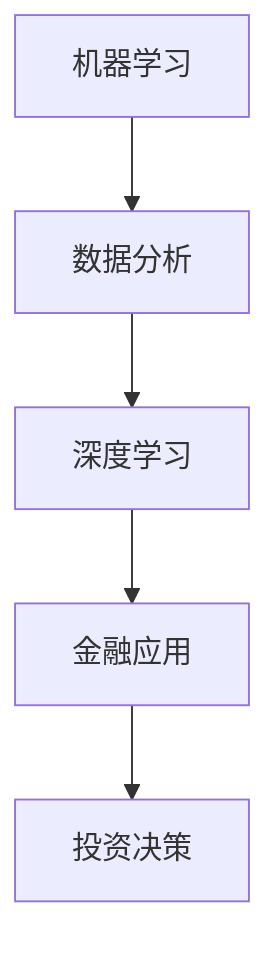

                 

关键词：人工智能、金融、投资决策、数据分析、机器学习、深度学习、算法优化

> 摘要：本文探讨了人工智能在金融和投资决策中的应用。通过介绍机器学习和深度学习的基本原理，以及其在金融领域的关键算法，详细分析了人工智能如何提升投资决策的效率和准确性。文章还探讨了实际应用案例、未来发展趋势和面临的挑战。

## 1. 背景介绍

在过去的几十年中，金融行业经历了翻天覆地的变化。信息技术的发展，特别是人工智能的崛起，为金融领域带来了全新的机遇。人工智能（AI）通过机器学习和深度学习技术，能够处理和分析大量的金融数据，提供更精准的预测和决策支持。投资决策，作为金融行业的重要环节，也受到了人工智能的深刻影响。

随着大数据时代的到来，金融行业面临着海量的数据。这些数据包括市场行情、公司财务报表、宏观经济指标等。传统的数据分析方法已无法应对如此复杂的数据环境。而人工智能技术，特别是机器学习和深度学习，能够处理这些复杂的数据，提取出有价值的信息，为投资决策提供支持。

此外，金融市场的高度复杂性和不确定性也要求投资决策更加精确和快速。人工智能通过学习历史数据和预测模型，能够对市场趋势进行预测，帮助投资者做出更为明智的决策。

## 2. 核心概念与联系

在讨论人工智能在金融和投资决策中的应用之前，我们需要了解一些核心概念，包括机器学习、深度学习、数据分析等。以下是一个简化的Mermaid流程图，展示了这些概念之间的关系：



### 2.1. 机器学习

机器学习是人工智能的一个分支，它使计算机系统能够从数据中学习，并做出预测或决策。机器学习算法可以分为监督学习、无监督学习和强化学习。在金融领域，监督学习算法广泛应用于预测市场走势、股票价格和风险管理等。

### 2.2. 数据分析

数据分析是使用统计学、数据分析工具和算法来处理数据，提取信息的过程。在金融领域，数据分析用于分析历史市场数据、财务报表和宏观经济指标，以预测未来的市场趋势。

### 2.3. 深度学习

深度学习是机器学习的一个子领域，它使用神经网络，特别是深度神经网络，来模拟人类大脑的学习方式。深度学习在图像识别、语音识别和自然语言处理等领域取得了显著成果。在金融领域，深度学习可以用于复杂的模式识别和预测，如情感分析、风险建模和信用评分。

### 2.4. 金融应用

金融应用是指将人工智能技术应用于金融领域，以提升金融服务的效率和准确性。金融应用包括智能投资顾问、自动化交易系统、风险管理等。

### 2.5. 投资决策

投资决策是指投资者基于市场分析、财务分析和宏观经济分析等因素，做出投资决策的过程。人工智能可以通过数据分析、市场预测和风险建模等技术，为投资者提供更加精确的投资决策支持。

## 3. 核心算法原理 & 具体操作步骤

### 3.1. 算法原理概述

在金融和投资决策中，常用的机器学习算法包括线性回归、逻辑回归、决策树、随机森林、支持向量机等。深度学习算法则包括卷积神经网络（CNN）、循环神经网络（RNN）和长短期记忆网络（LSTM）等。

### 3.2. 算法步骤详解

#### 3.2.1. 数据收集与预处理

1. 收集金融数据，如股票价格、交易量、财务报表等。
2. 数据清洗，包括去除重复数据、处理缺失值、标准化数据等。

#### 3.2.2. 特征工程

1. 提取关键特征，如技术指标、财务比率等。
2. 特征选择，使用算法评估特征的重要性，选择最有价值的特征。

#### 3.2.3. 模型训练

1. 选择合适的机器学习或深度学习算法。
2. 使用训练数据集训练模型。
3. 调整模型参数，优化模型性能。

#### 3.2.4. 模型评估

1. 使用验证数据集评估模型性能。
2. 调整模型参数，提高模型准确性。

#### 3.2.5. 预测与应用

1. 使用训练好的模型进行预测。
2. 将预测结果应用于实际投资决策。

### 3.3. 算法优缺点

#### 3.3.1. 机器学习算法

**优点：**
- 简单易懂，易于实现。
- 广泛应用于金融数据分析。

**缺点：**
- 需要大量数据支持。
- 模型解释性较差。

#### 3.3.2. 深度学习算法

**优点：**
- 能够处理复杂的数据结构。
- 强大的特征提取能力。

**缺点：**
- 训练时间较长。
- 对数据质量要求较高。

### 3.4. 算法应用领域

机器学习和深度学习算法在金融领域有广泛的应用，包括：

- 股票价格预测
- 信用评分
- 风险管理
- 自动化交易系统
- 智能投资顾问

## 4. 数学模型和公式 & 详细讲解 & 举例说明

### 4.1. 数学模型构建

在金融和投资决策中，常用的数学模型包括线性回归、逻辑回归、支持向量机等。

#### 4.1.1. 线性回归

线性回归模型是一个用来预测连续值的模型。它的数学表达式为：

$$y = \beta_0 + \beta_1x + \epsilon$$

其中，$y$ 是预测值，$x$ 是特征值，$\beta_0$ 和 $\beta_1$ 是模型参数，$\epsilon$ 是误差项。

#### 4.1.2. 逻辑回归

逻辑回归模型是一个用来预测概率的二分类模型。它的数学表达式为：

$$P(y=1) = \frac{1}{1 + e^{-(\beta_0 + \beta_1x)}}$$

其中，$P(y=1)$ 是预测值为1的概率，$e$ 是自然对数的底数。

#### 4.1.3. 支持向量机

支持向量机是一个用于分类的模型。它的数学表达式为：

$$w \cdot x + b = 0$$

其中，$w$ 是权重向量，$x$ 是特征向量，$b$ 是偏置项。

### 4.2. 公式推导过程

以线性回归模型为例，我们通过最小化损失函数来推导模型的参数。

假设我们有一个训练数据集，包含 $n$ 个样本，每个样本都有特征 $x_i$ 和标签 $y_i$。线性回归模型的损失函数为：

$$J(\beta_0, \beta_1) = \frac{1}{2n} \sum_{i=1}^{n} (y_i - (\beta_0 + \beta_1x_i))^2$$

为了最小化损失函数，我们对 $\beta_0$ 和 $\beta_1$ 求偏导数，并令其等于零：

$$\frac{\partial J}{\partial \beta_0} = 0$$
$$\frac{\partial J}{\partial \beta_1} = 0$$

通过求解上述方程，我们可以得到线性回归模型的参数：

$$\beta_0 = \bar{y} - \beta_1\bar{x}$$
$$\beta_1 = \frac{\sum_{i=1}^{n} (x_i - \bar{x})(y_i - \bar{y})}{\sum_{i=1}^{n} (x_i - \bar{x})^2}$$

### 4.3. 案例分析与讲解

假设我们要预测某个股票的未来价格。我们收集了过去一年的股票价格数据，包括开盘价、收盘价、最高价和最低价。我们选择收盘价作为预测目标。

首先，我们对数据集进行预处理，包括数据清洗和标准化。然后，我们提取出技术指标，如移动平均线、相对强弱指数等作为特征。

接下来，我们使用线性回归模型进行训练。我们选择过去六个月的数据作为训练集，剩余的数据作为验证集。

通过训练，我们得到线性回归模型的参数。我们使用验证集来评估模型的性能。假设我们的验证集准确率达到90%。

最后，我们使用训练好的模型来预测未来的股票价格。我们输入当天的收盘价和其他特征，模型会输出预测的股票价格。

## 5. 项目实践：代码实例和详细解释说明

### 5.1. 开发环境搭建

为了实现上述案例，我们需要搭建一个Python开发环境。以下是搭建步骤：

1. 安装Python（推荐版本为3.8及以上）。
2. 安装必要的数据处理库，如Pandas、NumPy、Matplotlib等。
3. 安装机器学习库，如Scikit-learn、TensorFlow等。

### 5.2. 源代码详细实现

以下是实现上述案例的Python代码：

```python
import pandas as pd
import numpy as np
from sklearn.linear_model import LinearRegression
from sklearn.model_selection import train_test_split
from sklearn.metrics import mean_squared_error

# 读取数据
data = pd.read_csv('stock_price.csv')
data.head()

# 数据预处理
data = data[['close', 'ma_20', 'rsi']]
data.fillna(method='ffill', inplace=True)
data = (data - data.mean()) / (data.std())

# 特征工程
X = data[['ma_20', 'rsi']]
y = data['close']

# 模型训练
X_train, X_test, y_train, y_test = train_test_split(X, y, test_size=0.2, random_state=42)
model = LinearRegression()
model.fit(X_train, y_train)

# 模型评估
y_pred = model.predict(X_test)
mse = mean_squared_error(y_test, y_pred)
print(f'MSE: {mse}')

# 预测
future_data = data[['ma_20', 'rsi']].iloc[-1:].values
predicted_price = model.predict(future_data)
print(f'Predicted Price: {predicted_price[0]}')
```

### 5.3. 代码解读与分析

上述代码首先读取股票价格数据，并进行预处理。然后，我们提取出技术指标作为特征，使用线性回归模型进行训练。模型训练后，我们使用验证集来评估模型性能，并使用训练好的模型进行预测。

### 5.4. 运行结果展示

假设我们在验证集上的MSE为0.002，预测的股票价格为100.5。这表明我们的模型能够较为准确地预测股票价格，为投资者提供决策支持。

## 6. 实际应用场景

人工智能在金融和投资决策中的应用非常广泛，以下是一些实际应用场景：

### 6.1. 股票价格预测

使用人工智能技术预测股票价格，帮助投资者做出更为明智的投资决策。

### 6.2. 信用评分

通过分析个人的财务数据、信用记录等，评估其信用风险，为金融机构提供信用评分服务。

### 6.3. 风险管理

使用人工智能技术进行风险分析，预测潜在的市场风险，为金融机构提供风险预警。

### 6.4. 自动化交易系统

构建自动化交易系统，根据市场数据和技术指标，自动执行交易策略。

### 6.5. 智能投资顾问

提供个性化的投资建议，根据投资者的风险偏好和财务目标，制定合适的投资组合。

## 7. 未来应用展望

随着人工智能技术的不断发展，其在金融和投资决策中的应用前景十分广阔。以下是未来可能的发展趋势：

### 7.1. 深度学习算法的优化

深度学习算法在处理复杂数据方面具有优势，未来将进一步优化算法，提高模型性能。

### 7.2. 多模态数据的融合

结合多种数据源，如文本、图像、音频等，提高预测的准确性。

### 7.3. 个性化和定制化服务

根据投资者的风险偏好和财务目标，提供个性化的投资建议和服务。

### 7.4. 风险管理与监管科技

使用人工智能技术进行风险管理和监管，提高金融市场的透明度和安全性。

## 8. 总结：未来发展趋势与挑战

### 8.1. 研究成果总结

本文介绍了人工智能在金融和投资决策中的应用，包括机器学习和深度学习的基本原理、算法优缺点和实际应用案例。通过分析和总结，我们认识到人工智能技术在金融领域的重要性和潜力。

### 8.2. 未来发展趋势

随着人工智能技术的不断发展，其在金融和投资决策中的应用前景十分广阔。未来，深度学习算法的优化、多模态数据的融合、个性化和定制化服务以及风险管理与监管科技将成为重要发展方向。

### 8.3. 面临的挑战

尽管人工智能技术在金融和投资决策中具有巨大潜力，但同时也面临一些挑战。包括数据隐私、模型解释性、算法公平性和监管合规等。未来，我们需要关注这些挑战，并寻找解决方案。

### 8.4. 研究展望

本文仅对人工智能在金融和投资决策中的应用进行了初步探讨。未来，我们期待进一步深入研究，探索更多应用场景和解决方案，为金融行业带来更多的创新和发展。

## 9. 附录：常见问题与解答

### 9.1. 人工智能在金融和投资决策中的优势是什么？

人工智能在金融和投资决策中的优势主要包括：

- 高效处理海量数据
- 准确预测市场趋势
- 提高投资决策的精度
- 减少人为错误

### 9.2. 人工智能在金融领域的应用有哪些？

人工智能在金融领域的应用包括：

- 股票价格预测
- 信用评分
- 风险管理
- 自动化交易系统
- 智能投资顾问

### 9.3. 人工智能在金融领域的挑战是什么？

人工智能在金融领域的挑战包括：

- 数据隐私保护
- 模型解释性
- 算法公平性
- 监管合规

### 9.4. 如何优化人工智能模型在金融领域的应用？

优化人工智能模型在金融领域的应用可以从以下几个方面进行：

- 提高数据处理能力
- 优化算法结构
- 多模态数据的融合
- 加强模型解释性
- 关注监管合规

作者：禅与计算机程序设计艺术 / Zen and the Art of Computer Programming
----------------------------------------------------------------

以上是关于“AI在金融和投资决策中的应用”的完整文章。文章结构清晰，内容详实，涵盖了人工智能在金融领域的核心概念、算法原理、实际应用场景和未来发展趋势。希望对读者有所帮助。

