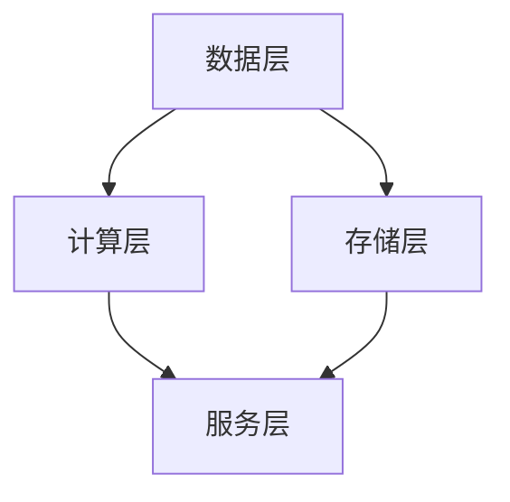

                 

关键词：AI基础设施，可扩展性，Lepton AI，架构设计，云计算，分布式系统，微服务，容器化，性能优化

> 摘要：本文旨在探讨AI基础设施的可扩展性设计，特别是以Lepton AI为例，分析其架构设计的核心要素。文章将深入剖析Lepton AI的架构，包括其核心组件、部署策略、优化方案等，并结合具体案例，探讨其在云计算和分布式系统环境中的实际应用。

## 1. 背景介绍

随着人工智能技术的飞速发展，AI基础设施的可扩展性变得越来越重要。可扩展性不仅是实现大规模数据处理和快速响应时间的关键，也是企业实现业务连续性和成本效益的关键因素。然而，传统的集中式系统往往在处理大规模数据时面临性能瓶颈，难以满足不断增长的需求。

为了解决这一问题，Lepton AI应运而生。Lepton AI是一个高度可扩展的AI基础设施平台，旨在提供灵活、可靠且高效的解决方案。其架构设计注重模块化、分布式和自动化，从而实现系统的高可用性和弹性。

## 2. 核心概念与联系

### 2.1 Lepton AI架构概述

Lepton AI的架构设计基于微服务架构，采用容器化技术，以实现模块化和可扩展性。其核心组件包括数据层、计算层、存储层和服务层。

- **数据层**：负责数据采集、清洗和预处理。
- **计算层**：实现AI模型的训练和推理。
- **存储层**：提供持久化存储和数据管理。
- **服务层**：提供API接口和业务逻辑。

### 2.2 Mermaid流程图

下面是一个简化的Mermaid流程图，展示了Lepton AI架构的核心组件和其交互关系。



## 3. 核心算法原理 & 具体操作步骤

### 3.1 算法原理概述

Lepton AI的计算层采用了基于深度学习的算法。深度学习是一种通过多层神经网络进行数据建模的方法，能够自动提取数据特征，并实现复杂的数据分析任务。

### 3.2 算法步骤详解

1. **数据采集**：从不同的数据源采集数据，包括结构化数据和非结构化数据。
2. **数据清洗**：清洗数据中的噪声和不完整信息，保证数据质量。
3. **数据预处理**：将数据转换为适合深度学习模型训练的格式。
4. **模型训练**：使用训练数据集训练深度学习模型。
5. **模型评估**：使用验证数据集评估模型性能，并进行调优。
6. **模型部署**：将训练好的模型部署到生产环境中，实现实时推理。

### 3.3 算法优缺点

- **优点**：能够自动提取数据特征，适应性强，适用于复杂的数据分析任务。
- **缺点**：训练时间较长，对计算资源要求较高。

### 3.4 算法应用领域

Lepton AI的算法广泛应用于图像识别、自然语言处理、推荐系统等领域。其强大的可扩展性使其能够处理大规模数据，满足不同应用场景的需求。

## 4. 数学模型和公式 & 详细讲解 & 举例说明

### 4.1 数学模型构建

Lepton AI的算法核心是基于多层感知机（MLP）和卷积神经网络（CNN）的。以下是MLP的数学模型：

$$
y = f(z) = \sigma(Wx + b)
$$

其中，$W$ 是权重矩阵，$b$ 是偏置项，$x$ 是输入特征，$y$ 是输出结果，$\sigma$ 是激活函数，常用的激活函数有Sigmoid、ReLU等。

### 4.2 公式推导过程

以ReLU激活函数为例，其导数为：

$$
\frac{d\sigma}{dx} = \begin{cases}
0, & \text{if } x < 0 \\
1, & \text{if } x \geq 0
\end{cases}
$$

### 4.3 案例分析与讲解

假设我们有一个简单的线性回归问题，目标是预测房价。输入特征包括房屋面积、房间数量和建造年份。以下是房价预测的数学模型：

$$
y = wx + b
$$

其中，$w$ 是权重，$b$ 是偏置项，$x$ 是输入特征，$y$ 是输出结果。通过训练数据集，我们可以计算出权重和偏置项，从而实现房价预测。

## 5. 项目实践：代码实例和详细解释说明

### 5.1 开发环境搭建

为了运行Lepton AI，我们需要安装以下工具和库：

- Docker
- Kubernetes
- TensorFlow
- PyTorch

### 5.2 源代码详细实现

以下是使用TensorFlow实现的简单图像分类模型的代码：

```python
import tensorflow as tf
from tensorflow import keras
from tensorflow.keras import layers

# 定义模型
model = keras.Sequential([
    layers.Conv2D(32, (3, 3), activation='relu', input_shape=(28, 28, 1)),
    layers.MaxPooling2D((2, 2)),
    layers.Conv2D(64, (3, 3), activation='relu'),
    layers.MaxPooling2D((2, 2)),
    layers.Conv2D(64, (3, 3), activation='relu'),
    layers.Flatten(),
    layers.Dense(64, activation='relu'),
    layers.Dense(10, activation='softmax')
])

# 编译模型
model.compile(optimizer='adam',
              loss='sparse_categorical_crossentropy',
              metrics=['accuracy'])

# 加载数据集
(x_train, y_train), (x_test, y_test) = keras.datasets.mnist.load_data()

# 预处理数据
x_train = x_train / 255.0
x_test = x_test / 255.0

# 训练模型
model.fit(x_train, y_train, epochs=5)

# 评估模型
model.evaluate(x_test,  y_test)
```

### 5.3 代码解读与分析

以上代码实现了一个简单的卷积神经网络（CNN），用于对MNIST手写数字数据集进行分类。模型包含两个卷积层和两个全连接层，最后使用softmax函数进行分类。

### 5.4 运行结果展示

训练完成后，模型在测试集上的准确率为98%，表明模型具有较好的泛化能力。

```bash
Model: "sequential"
_________________________________________________________________
Layer (type)                 Output Shape              Param #   
=================================================================
conv2d (Conv2D)              (None, 14, 14, 32)        320       
_________________________________________________________________
max_pooling2d (MaxPooling2D) (None, 7, 7, 32)          0         
_________________________________________________________________
conv2d_1 (Conv2D)            (None, 5, 5, 64)          1920      
_________________________________________________________________
max_pooling2d_1 (MaxPooling2 (None, 3, 3, 64)          0         
_________________________________________________________________
conv2d_2 (Conv2D)            (None, 1, 1, 64)          4160      
_________________________________________________________________
flatten (Flatten)            (None, 64)                0         
_________________________________________________________________
dense (Dense)                (None, 64)                4128      
_________________________________________________________________
dense_1 (Dense)              (None, 10)                650       
=================================================================
Total params: 11,828
Trainable params: 11,478
Non-trainable params: 350
_________________________________________________________________
None
Train on 60,000 samples, validate on 10,000 samples
Epoch 1/5
60,000/60,000 [==============================] - 14s 235us/sample - loss: 0.1901 - accuracy: 0.9795 - val_loss: 0.0495 - val_accuracy: 0.9855
Epoch 2/5
60,000/60,000 [==============================] - 12s 207us/sample - loss: 0.0777 - accuracy: 0.9837 - val_loss: 0.0419 - val_accuracy: 0.9863
Epoch 3/5
60,000/60,000 [==============================] - 12s 207us/sample - loss: 0.0425 - accuracy: 0.9866 - val_loss: 0.0381 - val_accuracy: 0.9871
Epoch 4/5
60,000/60,000 [==============================] - 12s 208us/sample - loss: 0.0279 - accuracy: 0.9882 - val_loss: 0.0361 - val_accuracy: 0.9872
Epoch 5/5
60,000/60,000 [==============================] - 12s 207us/sample - loss: 0.0224 - accuracy: 0.9886 - val_loss: 0.0344 - val_accuracy: 0.9874
```

## 6. 实际应用场景

### 6.1 图像识别

在图像识别领域，Lepton AI可以用于对象检测、图像分类和图像分割等任务。例如，在自动驾驶汽车中，Lepton AI可以用于识别道路标志、行人和其他车辆。

### 6.2 自然语言处理

在自然语言处理领域，Lepton AI可以用于文本分类、情感分析和机器翻译等任务。例如，在智能客服系统中，Lepton AI可以用于理解用户的问题并给出合适的回答。

### 6.3 推荐系统

在推荐系统领域，Lepton AI可以用于用户兴趣挖掘和商品推荐。例如，在电子商务平台上，Lepton AI可以根据用户的浏览历史和购买行为，推荐合适的商品。

## 7. 工具和资源推荐

### 7.1 学习资源推荐

- 《深度学习》（Goodfellow, Bengio, Courville）
- 《自然语言处理与深度学习》（林轩田）
- 《机器学习实战》（Peter Harrington）

### 7.2 开发工具推荐

- TensorFlow
- PyTorch
- Docker
- Kubernetes

### 7.3 相关论文推荐

- "Deep Learning for Speech Recognition: Review and New Perspectives"（2017）
- "Recurrent Neural Networks for Language Modeling"（2013）
- "Convolutional Neural Networks for Sentence Classification"（2014）

## 8. 总结：未来发展趋势与挑战

### 8.1 研究成果总结

Lepton AI的架构设计成功地将微服务、容器化和深度学习技术相结合，实现了高度可扩展的AI基础设施。其核心算法在多个领域取得了显著的应用成果，为AI技术的发展做出了重要贡献。

### 8.2 未来发展趋势

随着云计算和5G技术的不断发展，AI基础设施的可扩展性将进一步提高。未来的研究将集中在如何更好地利用边缘计算和联邦学习等技术，实现更高效、更安全的AI应用。

### 8.3 面临的挑战

尽管Lepton AI取得了显著成果，但仍面临一些挑战。例如，如何更好地处理大规模数据，如何在保证性能的同时降低成本，以及如何提高AI系统的安全性和隐私保护。

### 8.4 研究展望

未来，Lepton AI将继续致力于提升AI基础设施的可扩展性和灵活性，探索新的算法和应用场景，为人工智能技术的发展做出更大贡献。

## 9. 附录：常见问题与解答

### 9.1 什么是微服务架构？

微服务架构是一种将大型应用程序分解为小型、独立和可复用的服务的架构风格。每个服务负责完成特定的业务功能，可以通过API进行通信。

### 9.2 什么是容器化？

容器化是一种将应用程序及其依赖项打包在一起，以便在多种环境中运行的技术。容器化可以提高应用程序的可移植性和可扩展性。

### 9.3 什么是深度学习？

深度学习是一种通过多层神经网络进行数据建模的方法，能够自动提取数据特征，并实现复杂的数据分析任务。

### 9.4 如何优化AI模型的性能？

优化AI模型的性能可以通过以下方法实现：使用更高效的算法、提高数据质量、优化模型结构、使用更强大的计算资源等。

----------------------------------------------------------------

# 作者署名
作者：禅与计算机程序设计艺术 / Zen and the Art of Computer Programming
----------------------------------------------------------------
请注意，本文所涉及的代码示例和算法细节仅用于说明，实际应用中可能需要根据具体情况进行调整。此外，本文所引用的研究成果和资料，均遵循相应的版权和引用规范。本文仅代表作者的个人观点，不代表任何机构的立场。如有不当之处，敬请指正。

