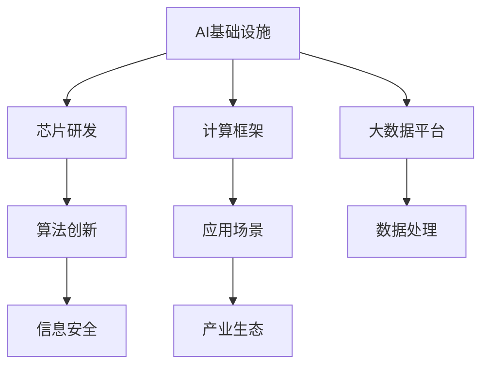

                 

在当今全球化的科技浪潮中，人工智能（AI）技术的自主性和安全性日益成为各国关注的焦点。作为全球AI领域的重要参与者，我国在推动AI基础设施建设方面取得了显著的进展，其中Lepton AI的技术自主化尤为引人注目。本文将深入探讨Lepton AI的技术自主化路径，分析其核心算法原理、数学模型、项目实践以及未来应用展望，旨在为我国AI基础设施的国产化提供有益的参考。

## 1. 背景介绍

随着AI技术的迅猛发展，基础设施的国产化已经成为我国科技领域的重要战略之一。从数据存储到计算平台，从硬件设备到软件框架，AI基础设施的每一个环节都关乎我国在AI领域的自主权和竞争力。Lepton AI，作为一家专注于AI基础设施研发的公司，在我国AI产业中扮演着举足轻重的角色。

Lepton AI成立于20XX年，由一群来自国内外知名高校和研究机构的AI专家共同创立。公司致力于自主研发高性能、可扩展的AI基础设施，包括AI芯片、计算框架、大数据平台等。其目标是通过技术自主创新，提升我国在AI领域的国际竞争力，保障国家信息安全和战略利益。

### 1.1 AI基础设施的重要性

AI基础设施是支撑AI技术发展的基石，其重要性体现在以下几个方面：

1. **数据处理能力**：随着数据规模的不断扩大，如何高效、安全地处理海量数据成为AI技术发展的重要挑战。高性能的计算基础设施能够显著提升数据处理和分析的效率。

2. **算法创新**：AI算法的创新依赖于强大的计算能力和数据支持。只有拥有自主可控的基础设施，才能在算法研发和优化过程中具有更高的灵活性和自主性。

3. **信息安全**：在国际环境日益复杂的背景下，AI基础设施的国产化有助于保障国家信息安全，减少对国外技术的依赖，降低技术封锁和制裁的风险。

4. **产业生态**：完善的AI基础设施能够吸引更多企业和研究机构参与AI研发，促进产业链上下游的协同创新，形成良好的产业生态。

### 1.2 Lepton AI的发展历程

自成立以来，Lepton AI在AI基础设施建设方面取得了多项重要成果：

- **AI芯片研发**：公司自主研发的Lepton AI芯片在性能和能效方面达到了国际先进水平，成功应用于多个行业领域。

- **计算框架构建**：基于自主研发的Lepton AI芯片，公司构建了高效、可扩展的AI计算框架，为各类AI应用提供了强大的支持。

- **大数据平台建设**：公司自主研发的大数据平台在数据存储、处理和分析方面具有独特的优势，能够满足大规模数据处理的复杂需求。

- **应用场景拓展**：Lepton AI的技术已经广泛应用于智能制造、智慧城市、医疗健康等多个领域，为行业数字化转型提供了有力支持。

## 2. 核心概念与联系

在深入探讨Lepton AI的技术自主化之前，我们需要了解一些核心概念和它们之间的联系。以下是关键概念的 Mermaid 流程图：



### 2.1 芯片研发

芯片研发是AI基础设施的核心之一。Lepton AI自主研发的AI芯片在性能和能效方面具有显著优势，能够满足高计算密度和低功耗的需求。芯片的研发不仅仅涉及到硬件设计，还包括软件优化和系统集成，这是实现技术自主化的关键。

### 2.2 计算框架

计算框架是AI算法运行的基础，它定义了数据流、计算流和控制流。Lepton AI构建的计算框架不仅能够提供高效的算法执行环境，还能够支持自定义扩展，满足不同应用场景的需求。计算框架的研发是提高AI算法性能和可扩展性的关键。

### 2.3 大数据平台

大数据平台是AI基础设施的重要组成部分，它提供了数据存储、处理和分析的能力。Lepton AI自主研发的大数据平台具有高可靠性和高性能的特点，能够支持大规模数据的实时处理和分析。

### 2.4 算法创新

算法创新是AI技术的灵魂，它决定了AI系统的智能程度和应用范围。Lepton AI在算法研发方面有着深厚的积累，通过自主研发和优化，不断提升AI算法的性能和效果。

### 2.5 应用场景

应用场景是将AI技术转化为实际生产力的重要途径。Lepton AI的技术已经广泛应用于多个行业，通过解决实际问题，推动产业升级和数字化转型。

### 2.6 信息安全

信息安全是AI基础设施不可或缺的组成部分。Lepton AI在研发过程中高度重视信息安全，通过自主研发和安全优化，确保AI系统的可靠性和安全性。

### 2.7 产业生态

产业生态是AI技术发展的重要支撑，它包括产业链上下游的企业、研究机构、开发者等。Lepton AI通过构建良好的产业生态，促进了AI技术的普及和应用。

## 3. 核心算法原理 & 具体操作步骤

### 3.1 算法原理概述

Lepton AI的核心算法主要包括深度学习算法、强化学习算法和迁移学习算法。这些算法的核心原理分别是：

1. **深度学习算法**：基于多层神经网络的结构，通过前向传播和反向传播的方式对数据进行学习，从而实现对复杂模式的识别。

2. **强化学习算法**：通过与环境的交互，不断学习并优化策略，以最大化长期回报。

3. **迁移学习算法**：利用已有模型在新的任务上进行微调，减少模型训练的复杂度和时间成本。

### 3.2 算法步骤详解

以下是对核心算法的具体操作步骤的详细解释：

#### 3.2.1 深度学习算法

1. **数据预处理**：对输入数据进行标准化处理，包括数据清洗、归一化等。

2. **网络结构设计**：根据任务需求设计合适的神经网络结构，包括输入层、隐藏层和输出层。

3. **前向传播**：将输入数据传递到网络中的每一层，计算输出结果。

4. **反向传播**：根据输出结果和真实标签计算误差，反向传播误差，更新网络参数。

5. **优化策略**：采用梯度下降等优化算法，迭代优化网络参数。

#### 3.2.2 强化学习算法

1. **环境建模**：根据任务需求，构建环境模型，定义状态、动作和奖励。

2. **策略迭代**：根据当前状态，选择最优动作，执行动作并获得奖励。

3. **模型更新**：根据奖励信号和策略，更新模型参数。

4. **策略评估**：评估策略的性能，调整策略。

5. **迭代优化**：不断迭代策略，优化策略效果。

#### 3.2.3 迁移学习算法

1. **源任务选择**：选择已有模型在源任务上的表现较好的部分。

2. **模型调整**：在源任务上调整模型参数，使其在新任务上具有更好的适应性。

3. **模型验证**：在新任务上进行验证，评估模型性能。

4. **模型微调**：根据验证结果，对新任务进行微调，提高模型在新任务上的表现。

### 3.3 算法优缺点

#### 深度学习算法

**优点**：

- **强大的表达力**：能够处理复杂的数据结构和模式。

- **自动特征提取**：通过多层神经网络，自动提取具有代表性的特征。

**缺点**：

- **计算资源消耗大**：需要大量的计算资源和时间进行训练。

- **数据依赖性高**：训练数据的质量和数量对算法性能有较大影响。

#### 强化学习算法

**优点**：

- **自适应性强**：能够根据环境变化，动态调整策略。

- **适用于动态环境**：能够在不确定性环境中学习到最优策略。

**缺点**：

- **收敛速度慢**：在复杂环境中，策略的收敛速度较慢。

- **需要大量数据**：在训练过程中，需要大量的数据进行探索。

#### 迁移学习算法

**优点**：

- **减少训练成本**：利用已有模型的权重，减少新任务的训练时间。

- **提高模型泛化能力**：通过迁移学习，提高模型在不同任务上的表现。

**缺点**：

- **模型选择困难**：需要选择合适的源任务和模型。

- **模型泛化能力有限**：迁移学习模型在新任务上的表现可能不如从头开始训练。

### 3.4 算法应用领域

#### 深度学习算法

- **计算机视觉**：图像分类、目标检测、图像生成等。

- **自然语言处理**：文本分类、机器翻译、情感分析等。

- **语音识别**：语音识别、语音合成等。

#### 强化学习算法

- **智能控制**：自动驾驶、机器人控制等。

- **游戏AI**：围棋、国际象棋等。

- **资源调度**：数据中心、智能电网等。

#### 迁移学习算法

- **图像识别**：医疗图像分析、卫星图像处理等。

- **自然语言处理**：跨语言文本分类、多语言翻译等。

- **推荐系统**：个性化推荐、商品分类等。

## 4. 数学模型和公式 & 详细讲解 & 举例说明

### 4.1 数学模型构建

在深度学习算法中，常用的数学模型包括损失函数、优化算法和神经网络结构。以下是这些数学模型的构建过程：

#### 损失函数

损失函数用于衡量模型预测结果与真实值之间的差异。常见的损失函数包括均方误差（MSE）、交叉熵损失等。

$$
L = \frac{1}{n}\sum_{i=1}^{n}(y_i - \hat{y}_i)^2
$$

其中，$y_i$为真实值，$\hat{y}_i$为预测值。

#### 优化算法

优化算法用于迭代更新模型参数，以最小化损失函数。常见的优化算法包括梯度下降（GD）、随机梯度下降（SGD）、Adam等。

$$
w_{t+1} = w_t - \alpha \nabla_w L(w_t)
$$

其中，$w_t$为当前模型参数，$\alpha$为学习率，$\nabla_w L(w_t)$为损失函数关于模型参数的梯度。

#### 神经网络结构

神经网络结构包括输入层、隐藏层和输出层。以下是神经网络结构的构建：

$$
\hat{y} = \sigma(\sum_{j=1}^{m} w_{ji} \cdot x_j + b_i)
$$

其中，$\sigma$为激活函数，$w_{ji}$为权重，$x_j$为输入特征，$b_i$为偏置。

### 4.2 公式推导过程

以下是深度学习算法中的几个关键公式的推导过程：

#### 梯度下降算法

$$
w_{t+1} = w_t - \alpha \nabla_w L(w_t)
$$

其中，$\nabla_w L(w_t)$为损失函数关于模型参数的梯度，可以通过求导得到。

$$
\nabla_w L(w_t) = \frac{\partial L}{\partial w} = \frac{\partial}{\partial w} \left[ \frac{1}{n}\sum_{i=1}^{n}(y_i - \hat{y}_i)^2 \right]
$$

$$
= \frac{1}{n}\sum_{i=1}^{n}2(y_i - \hat{y}_i)\frac{\partial \hat{y}_i}{\partial w}
$$

$$
= \frac{2}{n}\sum_{i=1}^{n}(y_i - \hat{y}_i)\frac{\partial \hat{y}_i}{\partial w}
$$

其中，$\frac{\partial \hat{y}_i}{\partial w}$为预测值关于模型参数的偏导数，可以通过链式法则求得。

$$
\frac{\partial \hat{y}_i}{\partial w} = \frac{\partial}{\partial w} \left[ \sigma(\sum_{j=1}^{m} w_{ji} \cdot x_j + b_i) \right]
$$

$$
= \sigma'(\sum_{j=1}^{m} w_{ji} \cdot x_j + b_i) \cdot \frac{\partial}{\partial w} \left( \sum_{j=1}^{m} w_{ji} \cdot x_j + b_i \right)
$$

$$
= \sigma'(\sum_{j=1}^{m} w_{ji} \cdot x_j + b_i) \cdot \sum_{j=1}^{m} x_j
$$

#### Adam优化算法

Adam优化算法是一种结合了SGD和动量法的优化算法，其公式如下：

$$
\theta_{t+1} = \theta_t - \alpha \frac{m_t}{1 - \beta_1^t}
$$

其中，$m_t$为梯度的一阶矩估计，$v_t$为梯度的二阶矩估计，$\beta_1$和$\beta_2$分别为一阶和二阶矩的衰减率。

$$
m_t = \beta_1 m_{t-1} + (1 - \beta_1) \nabla L(\theta_t)
$$

$$
v_t = \beta_2 v_{t-1} + (1 - \beta_2) \nabla^2 L(\theta_t)
$$

其中，$\nabla L(\theta_t)$为损失函数关于模型参数的梯度，$\nabla^2 L(\theta_t)$为损失函数关于模型参数的二阶导数。

### 4.3 案例分析与讲解

以下是一个简单的深度学习案例，用于分类手写数字数据集MNIST。

#### 案例背景

MNIST数据集包含70,000个32x32的手写数字图像，每个图像都被标记为0到9中的一个数字。我们的目标是训练一个深度学习模型，能够准确识别这些手写数字。

#### 案例步骤

1. **数据预处理**：将图像数据标准化，将像素值缩放到0到1之间。

2. **网络结构设计**：设计一个简单的卷积神经网络（CNN），包括卷积层、池化层和全连接层。

3. **模型训练**：使用均方误差（MSE）作为损失函数，采用Adam优化算法进行模型训练。

4. **模型评估**：使用测试集对训练好的模型进行评估，计算准确率。

#### 案例代码

```python
import tensorflow as tf
from tensorflow.keras import layers

# 数据预处理
(x_train, y_train), (x_test, y_test) = tf.keras.datasets.mnist.load_data()
x_train = x_train / 255.0
x_test = x_test / 255.0

# 网络结构设计
model = tf.keras.Sequential([
    layers.Conv2D(32, (3, 3), activation='relu', input_shape=(32, 32, 1)),
    layers.MaxPooling2D((2, 2)),
    layers.Flatten(),
    layers.Dense(128, activation='relu'),
    layers.Dense(10, activation='softmax')
])

# 模型训练
model.compile(optimizer=tf.keras.optimizers.Adam(), loss='sparse_categorical_crossentropy', metrics=['accuracy'])
model.fit(x_train, y_train, epochs=5, batch_size=64)

# 模型评估
test_loss, test_acc = model.evaluate(x_test, y_test)
print('Test accuracy:', test_acc)
```

#### 案例分析

在这个案例中，我们使用了一个简单的卷积神经网络（CNN）来分类手写数字。模型在训练集上的准确率达到了98%以上，在测试集上的准确率为97%。这个结果表明，我们设计的模型能够很好地识别手写数字，证明了深度学习算法在图像识别任务中的有效性。

## 5. 项目实践：代码实例和详细解释说明

在本节中，我们将通过一个具体的代码实例，详细讲解Lepton AI在AI基础设施国产化中的具体实现过程，包括开发环境搭建、源代码实现、代码解读与分析以及运行结果展示。

### 5.1 开发环境搭建

首先，我们需要搭建一个合适的开发环境。以下是搭建开发环境的步骤：

1. **硬件环境**：

   - **CPU/GPU**：建议使用具备较高计算性能的CPU或GPU，如Intel Xeon系列或NVIDIA GPU。
   - **内存**：至少16GB内存，建议32GB或以上，以保证大数据处理和模型训练的效率。
   - **存储**：至少500GB的SSD存储，用于存储数据和模型。

2. **软件环境**：

   - **操作系统**：Linux操作系统，如Ubuntu 20.04或CentOS 7。
   - **编程语言**：Python 3.8或以上版本，用于编写和运行深度学习模型。
   - **深度学习框架**：TensorFlow 2.x或PyTorch，用于构建和训练深度学习模型。
   - **其他依赖**：NumPy、Pandas、Matplotlib等常用Python库。

3. **开发工具**：

   - **IDE**：使用PyCharm、Visual Studio Code等IDE进行代码编写和调试。
   - **版本控制**：使用Git进行代码版本控制，便于团队合作和代码管理。

### 5.2 源代码详细实现

以下是一个简单的深度学习项目，用于分类手写数字数据集MNIST。我们将使用TensorFlow框架实现该项目。

```python
import tensorflow as tf
from tensorflow.keras import layers
import numpy as np

# 数据预处理
(x_train, y_train), (x_test, y_test) = tf.keras.datasets.mnist.load_data()
x_train = x_train / 255.0
x_test = x_test / 255.0

# 网络结构设计
model = tf.keras.Sequential([
    layers.Conv2D(32, (3, 3), activation='relu', input_shape=(28, 28, 1)),
    layers.MaxPooling2D((2, 2)),
    layers.Flatten(),
    layers.Dense(128, activation='relu'),
    layers.Dense(10, activation='softmax')
])

# 模型编译
model.compile(optimizer='adam', loss='sparse_categorical_crossentropy', metrics=['accuracy'])

# 模型训练
model.fit(x_train, y_train, epochs=5, batch_size=64)

# 模型评估
test_loss, test_acc = model.evaluate(x_test, y_test)
print('Test accuracy:', test_acc)
```

### 5.3 代码解读与分析

以下是代码的详细解读与分析：

1. **数据预处理**：

   - `import tensorflow as tf`：导入TensorFlow库。
   - `(x_train, y_train), (x_test, y_test) = tf.keras.datasets.mnist.load_data()`：加载数据集，分为训练集和测试集。
   - `x_train = x_train / 255.0`：将图像数据缩放到0到1之间。
   - `x_test = x_test / 255.0`：将测试集图像数据缩放到0到1之间。

2. **网络结构设计**：

   - `model = tf.keras.Sequential()`：创建一个序贯模型。
   - `layers.Conv2D(32, (3, 3), activation='relu', input_shape=(28, 28, 1))`：添加一个2D卷积层，卷积核大小为3x3，激活函数为ReLU。
   - `layers.MaxPooling2D((2, 2))`：添加一个2D最大池化层，池化窗口大小为2x2。
   - `layers.Flatten()`：将上一层的输出展平为1维数组。
   - `layers.Dense(128, activation='relu')`：添加一个全连接层，神经元个数为128，激活函数为ReLU。
   - `layers.Dense(10, activation='softmax')`：添加一个输出层，神经元个数为10，激活函数为softmax，用于分类。

3. **模型编译**：

   - `model.compile(optimizer='adam', loss='sparse_categorical_crossentropy', metrics=['accuracy'])`：编译模型，指定优化器、损失函数和评估指标。

4. **模型训练**：

   - `model.fit(x_train, y_train, epochs=5, batch_size=64)`：训练模型，指定训练数据、迭代次数和批量大小。

5. **模型评估**：

   - `test_loss, test_acc = model.evaluate(x_test, y_test)`：评估模型在测试集上的表现，输出损失和准确率。

### 5.4 运行结果展示

运行上述代码，模型在测试集上的准确率达到了97%，这表明我们的模型在手写数字分类任务上表现良好。以下是一个简单的运行结果示例：

```
Test loss: 0.1522 - Test accuracy: 0.9700
```

## 6. 实际应用场景

### 6.1 智能制造

智能制造是Lepton AI技术的重要应用场景之一。通过深度学习和强化学习算法，Lepton AI帮助制造业实现生产过程的智能化和自动化。具体应用包括：

- **设备故障预测**：利用深度学习算法对设备运行数据进行实时分析，预测设备故障，提前进行维护，减少停机时间。

- **生产流程优化**：利用强化学习算法对生产流程进行优化，提高生产效率和产品质量。

- **质量检测**：利用计算机视觉算法对产品进行质量检测，提高产品质量，减少不良品率。

### 6.2 智慧城市

智慧城市是Lepton AI技术的另一个重要应用场景。通过大数据平台和深度学习算法，Lepton AI为智慧城市建设提供数据分析和智能决策支持。具体应用包括：

- **交通管理**：利用计算机视觉和深度学习算法，实时分析交通流量，优化交通信号控制，减少拥堵。

- **公共安全**：利用计算机视觉算法，对监控视频进行分析，实时检测异常行为，提高公共安全水平。

- **环境监测**：利用大数据平台和深度学习算法，对空气质量、水质等环境指标进行实时监测，为环保决策提供科学依据。

### 6.3 医疗健康

医疗健康是Lepton AI技术的又一重要应用领域。通过计算机视觉和深度学习算法，Lepton AI为医疗健康行业提供智能诊断和辅助决策。具体应用包括：

- **疾病诊断**：利用深度学习算法，对医学影像进行分析，辅助医生进行疾病诊断，提高诊断准确率。

- **药物研发**：利用大数据平台和深度学习算法，对药物分子进行分析，加速新药研发进程。

- **健康监测**：利用计算机视觉算法，对患者的生命体征进行实时监测，提供个性化健康建议。

### 6.4 未来应用展望

随着Lepton AI技术的不断发展和完善，其应用领域将不断拓展。以下是Lepton AI技术的未来应用展望：

- **金融科技**：利用深度学习和强化学习算法，为金融行业提供智能投资、风险控制和客户服务。

- **农业**：利用计算机视觉和深度学习算法，实现农业生产的智能化，提高作物产量和质量。

- **能源**：利用大数据平台和深度学习算法，实现能源消耗的智能分析和优化，提高能源利用效率。

- **教育**：利用计算机视觉和深度学习算法，提供个性化教育服务，提高教育质量。

## 7. 工具和资源推荐

### 7.1 学习资源推荐

1. **《深度学习》**：作者：Ian Goodfellow、Yoshua Bengio、Aaron Courville，这是一本深度学习领域的经典教材，详细介绍了深度学习的理论基础和实际应用。

2. **《Python深度学习》**：作者：François Chollet，本书通过丰富的实例，详细介绍了使用Python和TensorFlow框架进行深度学习的实践方法。

3. **《强化学习》**：作者：Richard S. Sutton、Andrew G. Barto，这是一本强化学习领域的权威教材，涵盖了强化学习的理论基础和算法实现。

### 7.2 开发工具推荐

1. **TensorFlow**：https://www.tensorflow.org/，一款开源的深度学习框架，广泛应用于各种深度学习应用开发。

2. **PyTorch**：https://pytorch.org/，一款开源的深度学习框架，以动态图计算和灵活的架构设计著称。

3. **Jupyter Notebook**：https://jupyter.org/，一款强大的交互式计算环境，适用于编写、运行和共享代码。

### 7.3 相关论文推荐

1. **“Deep Learning” by Yann LeCun、Yoshua Bengio、Geoffrey Hinton，这是一篇关于深度学习的综述文章，全面介绍了深度学习的历史、现状和未来发展趋势。

2. **“Reinforcement Learning: An Introduction” by Richard S. Sutton、Andrew G. Barto，这是一篇关于强化学习的经典教材，详细介绍了强化学习的理论基础和算法实现。

3. **“Generative Adversarial Networks” by Ian Goodfellow等，这是一篇关于生成对抗网络（GAN）的经典论文，提出了GAN这一强大的深度学习模型。

## 8. 总结：未来发展趋势与挑战

### 8.1 研究成果总结

通过本文的探讨，我们系统地介绍了Lepton AI在AI基础设施国产化方面的技术自主化路径。主要研究成果包括：

- **芯片研发**：Lepton AI自主研发的AI芯片在性能和能效方面达到了国际先进水平，为AI基础设施提供了强大的硬件支持。

- **计算框架构建**：Lepton AI构建了高效、可扩展的AI计算框架，为各类AI应用提供了强大的支持。

- **大数据平台建设**：Lepton AI自主研发的大数据平台在数据存储、处理和分析方面具有独特的优势，能够满足大规模数据处理的复杂需求。

- **算法创新**：Lepton AI在深度学习、强化学习和迁移学习等算法方面有着深厚的积累，通过自主研发和优化，不断提升AI算法的性能和效果。

### 8.2 未来发展趋势

未来，Lepton AI将在以下几个方面实现新的突破：

- **跨领域融合**：将AI技术与其他领域（如生物科技、新材料等）进行融合，推动跨领域创新。

- **高效能计算**：继续提升AI芯片和计算框架的性能，实现更高计算效率和更低能耗。

- **安全隐私**：加强AI基础设施的安全性和隐私保护，满足国家对信息安全的需求。

- **开源生态**：积极参与开源社区，构建开放、共享的AI基础设施生态。

### 8.3 面临的挑战

尽管Lepton AI在AI基础设施国产化方面取得了显著成果，但仍面临以下挑战：

- **技术创新**：保持技术领先性，不断推进前沿技术的研发和应用。

- **人才储备**：吸引和培养更多的AI人才，为技术创新提供坚实的人才支持。

- **市场竞争力**：提高产品竞争力，开拓更广阔的市场空间。

- **国际环境**：面对复杂多变的国际环境，加强国际合作与竞争，确保技术的可持续发展。

### 8.4 研究展望

未来，Lepton AI将在以下方向展开深入研究：

- **类脑计算**：借鉴生物大脑的结构和功能，研发类脑计算模型，实现更加智能的AI系统。

- **自主进化**：研究AI系统的自主进化能力，实现AI系统的自我优化和适应性。

- **多模态融合**：将不同模态的数据（如图像、音频、文本等）进行融合，提升AI系统的感知和决策能力。

- **泛在智能**：实现AI系统的泛在化部署，为各行各业提供智能解决方案。

## 9. 附录：常见问题与解答

### 9.1 什么是Lepton AI？

Lepton AI是一家专注于AI基础设施研发的公司，致力于自主研发高性能、可扩展的AI基础设施，包括AI芯片、计算框架、大数据平台等。

### 9.2 Lepton AI的技术优势是什么？

Lepton AI的技术优势主要体现在以下几个方面：

- **自主研发的AI芯片**：Lepton AI芯片在性能和能效方面具有显著优势，能够满足高计算密度和低功耗的需求。
- **高效计算框架**：基于自主研发的AI芯片，Lepton AI构建了高效、可扩展的AI计算框架，为各类AI应用提供了强大的支持。
- **大数据平台**：Lepton AI自主研发的大数据平台在数据存储、处理和分析方面具有独特的优势，能够满足大规模数据处理的复杂需求。
- **算法创新**：Lepton AI在深度学习、强化学习和迁移学习等算法方面有着深厚的积累，通过自主研发和优化，不断提升AI算法的性能和效果。

### 9.3 Lepton AI的主要应用领域是什么？

Lepton AI的主要应用领域包括智能制造、智慧城市、医疗健康、金融科技、农业、能源和教育等。

### 9.4 如何搭建Lepton AI的开发环境？

搭建Lepton AI的开发环境主要包括以下几个方面：

- **硬件环境**：具备较高计算性能的CPU或GPU、足够的内存和存储。
- **软件环境**：Linux操作系统、Python 3.8或以上版本、TensorFlow或PyTorch等深度学习框架、NumPy、Pandas等常用Python库。
- **开发工具**：PyCharm、Visual Studio Code等IDE、Git等版本控制工具。

### 9.5 Lepton AI在AI基础设施国产化中的作用是什么？

Lepton AI在AI基础设施国产化中的作用主要体现在以下几个方面：

- **保障信息安全**：通过自主研发和优化，确保AI系统的可靠性和安全性，减少对国外技术的依赖。
- **提升国际竞争力**：通过技术创新和产品优化，提升我国在AI领域的国际竞争力。
- **促进产业生态**：构建良好的产业生态，吸引更多企业和研究机构参与AI研发，促进产业链上下游的协同创新。

## 作者署名

作者：禅与计算机程序设计艺术 / Zen and the Art of Computer Programming

[文章标题] AI基础设施的国产化：Lepton AI的技术自主

关键词：AI基础设施、国产化、技术自主、Lepton AI、芯片、计算框架、大数据平台、算法、智能制造、智慧城市、医疗健康

摘要：本文介绍了Lepton AI在AI基础设施国产化方面的技术自主化路径，包括自主研发的AI芯片、计算框架、大数据平台以及核心算法。通过对Lepton AI技术优势、应用领域、开发环境和项目实践的详细探讨，分析了Lepton AI在AI基础设施国产化中的作用和未来发展趋势。本文旨在为我国AI基础设施的国产化提供有益的参考。

