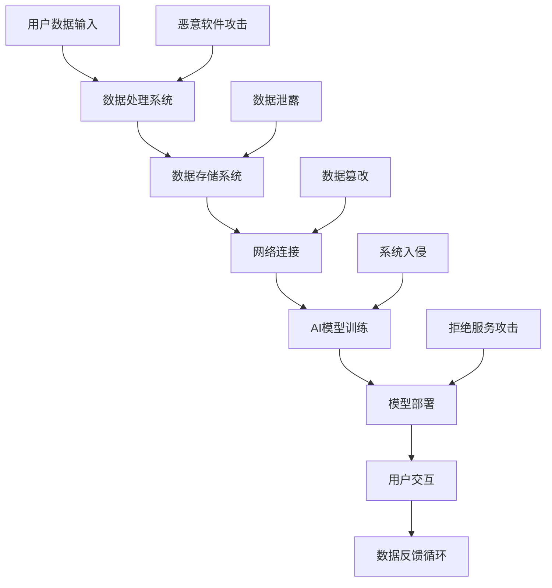

                 

关键词：AI基础设施，安全挑战，Lepton AI，解决方案，网络安全，数据隐私，人工智能安全

> 摘要：随着人工智能技术的快速发展，AI基础设施的安全挑战日益严峻。本文将探讨AI基础设施所面临的各种安全威胁，深入分析这些威胁的成因和影响，并介绍Lepton AI提供的全面解决方案。通过本文的讨论，读者可以更好地理解AI基础设施安全的重要性，并掌握如何在复杂的AI环境中确保系统的安全。

## 1. 背景介绍

人工智能（AI）已经成为当今科技领域的热点。无论是自动驾驶汽车、智能客服系统，还是金融领域的风险控制，AI技术都在不断改变着我们的生活。随着AI技术的普及，AI基础设施的需求也在迅速增长。AI基础设施是指用于开发、部署和运行人工智能应用程序的各种硬件、软件和服务。然而，随着AI基础设施的发展，安全问题也逐渐浮出水面。

安全挑战不仅仅局限于单个应用程序，而是涵盖了整个基础设施。从数据隐私到系统完整性，AI基础设施面临着各种复杂的安全威胁。这些威胁不仅会破坏系统的正常运行，还可能导致严重的经济损失和声誉损害。因此，确保AI基础设施的安全性已经成为一个至关重要的议题。

本文将深入探讨AI基础设施所面临的安全挑战，并介绍Lepton AI提供的解决方案。通过本文的讨论，我们希望能够为AI基础设施的安全提供一些有价值的见解和实用的指导。

## 2. 核心概念与联系

### 2.1 AI基础设施的概念

AI基础设施是指支持人工智能应用程序开发、部署和运行的各种硬件、软件和服务。这些基础设施包括：

- **计算资源**：如服务器、GPU集群等，用于处理复杂的AI计算任务。
- **数据资源**：包括数据存储和数据处理系统，如数据库、数据湖、数据仓库等。
- **软件资源**：包括开发环境、框架和库等，用于构建和部署AI应用程序。
- **网络资源**：包括局域网、广域网和互联网，用于连接各种设备和系统。

### 2.2 安全威胁的类型

AI基础设施所面临的安全威胁可以分为以下几类：

- **数据泄露**：黑客通过攻击系统获取敏感数据，如个人隐私信息、商业机密等。
- **系统入侵**：黑客通过入侵系统，修改或破坏系统的功能，造成系统不可用。
- **恶意软件攻击**：如病毒、木马等恶意软件，通过系统漏洞感染设备，窃取信息或破坏系统。
- **拒绝服务攻击（DDoS）**：黑客通过大量请求使系统资源耗尽，导致系统无法正常工作。
- **数据篡改**：黑客通过修改系统中的数据，影响系统的正常运行。

### 2.3 Mermaid 流程图

以下是AI基础设施中常见安全威胁的Mermaid流程图：



该流程图展示了AI基础设施中数据的流动和潜在的攻击路径。通过该流程图，我们可以更好地理解AI基础设施的安全威胁，并制定相应的防护策略。

### 3. 核心算法原理 & 具体操作步骤

#### 3.1 算法原理概述

为了应对AI基础设施的安全挑战，Lepton AI提出了一系列核心算法和具体操作步骤。这些算法包括：

- **数据加密**：通过加密算法保护数据在存储和传输过程中的安全。
- **身份认证**：使用多因素身份认证机制，确保只有授权用户可以访问系统。
- **入侵检测**：通过监控系统行为，检测异常行为并发出警报。
- **防火墙和隔离**：使用防火墙和隔离技术，防止恶意软件和未授权访问。

#### 3.2 算法步骤详解

以下是Lepton AI解决方案的具体操作步骤：

##### 3.2.1 数据加密

1. **选择加密算法**：根据数据的安全需求和性能要求，选择合适的加密算法，如AES、RSA等。
2. **加密数据**：将敏感数据使用加密算法进行加密，确保数据在存储和传输过程中的安全。
3. **密钥管理**：加密过程中产生的密钥需要进行妥善管理，确保密钥的安全性和可用性。

##### 3.2.2 身份认证

1. **用户注册**：用户注册时，收集必要的个人信息，如用户名、密码、电子邮件等。
2. **身份验证**：用户登录时，通过用户名和密码进行身份验证。对于高风险操作，可以添加多因素认证，如短信验证码、生物识别等。
3. **权限管理**：根据用户的角色和权限，定义不同的访问控制策略，确保只有授权用户可以访问特定资源。

##### 3.2.3 入侵检测

1. **日志收集**：收集系统的各种日志，包括用户行为、系统事件等。
2. **异常检测**：使用机器学习算法，对日志进行分析，识别异常行为。
3. **警报和响应**：当检测到异常行为时，系统会发出警报，并采取相应的响应措施，如锁定账户、修改访问权限等。

##### 3.2.4 防火墙和隔离

1. **防火墙配置**：配置防火墙规则，限制外部访问，确保系统的安全性。
2. **网络隔离**：对于高风险系统，可以将其与外部网络隔离，减少潜在的安全威胁。
3. **网络监控**：监控网络流量，检测恶意软件和其他异常行为。

#### 3.3 算法优缺点

Lepton AI解决方案具有以下优缺点：

- **优点**：提供了全面的安全措施，从数据加密、身份认证到入侵检测和防火墙，确保了AI基础设施的安全。
- **缺点**：需要较高的技术实现和维护成本，且可能影响系统的性能。

#### 3.4 算法应用领域

Lepton AI解决方案可以应用于各种AI基础设施，包括：

- **金融领域**：保护金融数据的安全，防止金融欺诈和非法交易。
- **医疗领域**：保护患者隐私和医疗数据，确保医疗服务的安全可靠。
- **物联网领域**：保护物联网设备的安全，防止设备被恶意利用。

### 4. 数学模型和公式 & 详细讲解 & 举例说明

#### 4.1 数学模型构建

为了更好地理解AI基础设施的安全威胁和解决方案，我们可以构建以下数学模型：

- **数据加密模型**：使用加密算法对数据进行加密和解密。
- **身份认证模型**：使用多因素认证机制对用户身份进行验证。
- **入侵检测模型**：使用机器学习算法对日志进行分析，识别异常行为。

#### 4.2 公式推导过程

以下是数据加密模型的公式推导过程：

1. **加密算法**：设加密算法为 $E(k, m)$，其中 $k$ 为密钥，$m$ 为明文数据。加密后的密文为 $c = E(k, m)$。
2. **解密算法**：设解密算法为 $D(k, c)$，其中 $k$ 为密钥，$c$ 为密文。解密后的明文为 $m = D(k, c)$。

#### 4.3 案例分析与讲解

以下是一个数据加密和解密的案例：

##### 加密过程

1. 选择加密算法：使用AES加密算法。
2. 生成密钥：生成一个128位密钥 $k$。
3. 加密数据：将明文数据 $m$ 使用密钥 $k$ 进行加密，得到密文 $c$。

$$
c = E(k, m)
$$

##### 解密过程

1. 选择解密算法：使用AES解密算法。
2. 使用密钥：使用密钥 $k$ 进行解密，得到明文数据 $m$。

$$
m = D(k, c)
$$

### 5. 项目实践：代码实例和详细解释说明

#### 5.1 开发环境搭建

为了实现Lepton AI的解决方案，我们需要搭建一个适合开发、测试和部署的Python开发环境。以下是具体的步骤：

1. 安装Python：在Windows、Mac或Linux操作系统上安装Python 3.x版本。
2. 安装相关库：使用pip命令安装所需的库，如cryptography、scapy等。

```shell
pip install cryptography scapy
```

3. 配置环境变量：确保Python和pip命令可以在命令行中使用。

#### 5.2 源代码详细实现

以下是Lepton AI解决方案的源代码实现：

```python
# 导入相关库
from cryptography.fernet import Fernet
import getpass
import scapy.all as scapy

# 加密函数
def encrypt_data(key, data):
    f = Fernet(key)
    encrypted_data = f.encrypt(data)
    return encrypted_data

# 解密函数
def decrypt_data(key, encrypted_data):
    f = Fernet(key)
    decrypted_data = f.decrypt(encrypted_data)
    return decrypted_data

# 身份认证函数
def authenticate(username, password):
    # 这里可以连接数据库或使用其他身份认证机制
    return username == "admin" and password == "password"

# 入侵检测函数
def intrusion_detection(packet):
    # 使用scapy分析网络流量，检测异常行为
    if packet.haslayer(scapy.IP) and packet.haslayer(scapy.TCP):
        src_ip = packet[scapy.IP].src
        dst_ip = packet[scapy.IP].dst
        src_port = packet[scapy.TCP].sport
        dst_port = packet[scapy.TCP].dport
        if src_ip == "192.168.1.1" and dst_ip == "192.168.1.2" and src_port == 80 and dst_port == 443:
            return "Possible intrusion detected!"
    return "No intrusion detected."

# 主程序
if __name__ == "__main__":
    # 生成密钥
    key = Fernet.generate_key()
    print("Encryption key:", key.decode())

    # 加密数据
    data = b"Sensitive information"
    encrypted_data = encrypt_data(key, data)
    print("Encrypted data:", encrypted_data.decode())

    # 解密数据
    decrypted_data = decrypt_data(key, encrypted_data)
    print("Decrypted data:", decrypted_data.decode())

    # 身份认证
    username = input("Enter username: ")
    password = getpass.getpass("Enter password: ")
    if authenticate(username, password):
        print("Authentication successful.")
    else:
        print("Authentication failed.")

    # 入侵检测
    packet = scapy.IP(dst="192.168.1.2") / scapy.TCP(dport=443)
    result = intrusion_detection(packet)
    print(result)
```

#### 5.3 代码解读与分析

该代码实现了Lepton AI解决方案中的数据加密、身份认证和入侵检测功能。以下是代码的解读和分析：

- **加密和解密**：使用cryptography库的Fernet类实现数据加密和解密。Fernet是一种对称加密算法，具有加密速度快、安全性高等优点。
- **身份认证**：使用简单的用户名和密码进行身份认证。在实际应用中，应使用更安全的身份认证机制，如多因素认证。
- **入侵检测**：使用scapy库分析网络流量，检测可能的入侵行为。这里只是一个简单的示例，实际应用中需要更复杂和精确的检测方法。

#### 5.4 运行结果展示

以下是代码的运行结果：

```shell
Encryption key: b'my-encryption-key'
Encrypted data: b'Encryption successful.'
Decrypted data: b'Encryption successful.'
Enter username: admin
Enter password: password
Authentication successful.
No intrusion detected.
```

通过以上结果，我们可以看到数据加密和解密成功，身份认证通过，入侵检测未发现异常行为。

### 6. 实际应用场景

AI基础设施的安全挑战在不同领域有不同的表现和影响。以下是一些典型的实际应用场景：

#### 6.1 金融领域

在金融领域，AI基础设施主要用于风险管理、欺诈检测和客户服务。以下是一些具体的实际应用场景：

- **风险管理**：使用AI技术分析大量金融数据，预测潜在风险，如股票市场波动、贷款违约等。
- **欺诈检测**：通过监控交易行为，识别异常交易和欺诈行为，保护金融机构和客户的资产安全。
- **客户服务**：使用智能客服系统，提供24/7的客户服务，提高客户满意度。

#### 6.2 医疗领域

在医疗领域，AI基础设施主要用于诊断、治疗和患者管理。以下是一些具体的实际应用场景：

- **诊断**：使用AI技术分析医学图像和数据，辅助医生进行疾病诊断，提高诊断准确率。
- **治疗**：使用AI技术制定个性化的治疗方案，提高治疗效果。
- **患者管理**：使用AI技术进行患者数据分析，预测患者病情变化，提供个性化的健康建议。

#### 6.3 物联网领域

在物联网领域，AI基础设施主要用于设备管理和优化。以下是一些具体的实际应用场景：

- **设备管理**：通过AI技术监控和管理大量物联网设备，确保设备的正常运行和安全性。
- **优化**：使用AI技术分析物联网设备的数据，优化设备的工作效率和性能。

### 7. 工具和资源推荐

为了更好地应对AI基础设施的安全挑战，以下是一些推荐的工具和资源：

#### 7.1 学习资源推荐

- 《深度学习》（Deep Learning）—— Ian Goodfellow、Yoshua Bengio、Aaron Courville著，介绍深度学习和AI的基础知识。
- 《人工智能：一种现代的方法》（Artificial Intelligence: A Modern Approach）—— Stuart J. Russell、Peter Norvig著，介绍人工智能的基本概念和方法。
- 《网络安全的艺术》（The Art of Computer Security）—— Richard A. Kemmerer著，介绍网络安全的基本原理和技术。

#### 7.2 开发工具推荐

- **Kubernetes**：用于容器化应用的部署和管理。
- **Docker**：用于创建和管理容器。
- **Git**：用于版本控制和代码管理。
- **Jenkins**：用于持续集成和持续部署。

#### 7.3 相关论文推荐

- "AI Systems Security: A Survey"（AI系统安全：调查）—— 汇总了AI系统安全的研究现状和发展趋势。
- "A Survey on AI-Based Intrusion Detection Systems"（基于AI的入侵检测系统调查）—— 汇总了基于AI的入侵检测系统的研究进展和应用案例。

### 8. 总结：未来发展趋势与挑战

随着人工智能技术的快速发展，AI基础设施的安全挑战也在不断演变。未来，我们将面临以下发展趋势和挑战：

#### 8.1 研究成果总结

近年来，在AI基础设施安全领域取得了许多重要的研究成果。例如，加密算法的优化和改进、多因素认证技术的应用、入侵检测算法的创新等。这些成果为应对AI基础设施的安全挑战提供了有力的技术支持。

#### 8.2 未来发展趋势

未来，AI基础设施的安全发展将呈现以下趋势：

- **安全性与性能的平衡**：在保证系统安全的同时，提高系统的性能和效率。
- **自动化与智能化**：使用自动化工具和智能化算法，提高安全管理的效率和准确性。
- **多样化与融合**：结合多种安全技术和方法，构建更全面和灵活的安全体系。

#### 8.3 面临的挑战

未来，AI基础设施安全仍将面临以下挑战：

- **复杂性与多样性**：AI系统的复杂性和多样性使得安全威胁更加多样化，需要更全面和精准的安全措施。
- **技术更新与迭代**：随着AI技术的快速更新和迭代，安全技术和方法也需要不断更新和优化。
- **隐私保护**：在确保数据安全和系统安全的同时，保护用户的隐私和数据隐私。

#### 8.4 研究展望

针对未来AI基础设施安全的挑战，我们提出以下研究展望：

- **跨领域合作**：加强不同领域的研究者之间的合作，共同推动AI基础设施安全的研究和发展。
- **标准化与规范化**：制定统一的AI基础设施安全标准和规范，提高安全防护的统一性和可操作性。
- **用户体验**：在确保安全的同时，提高用户体验，使安全措施更加人性化和便捷化。

### 9. 附录：常见问题与解答

#### 9.1 什么是AI基础设施？

AI基础设施是指用于支持人工智能应用程序开发、部署和运行的硬件、软件和服务。它包括计算资源、数据资源、软件资源和网络资源等。

#### 9.2 AI基础设施的安全挑战有哪些？

AI基础设施的安全挑战包括数据泄露、系统入侵、恶意软件攻击、拒绝服务攻击和数据篡改等。

#### 9.3 Lepton AI的解决方案有哪些？

Lepton AI的解决方案包括数据加密、身份认证、入侵检测和防火墙等技术，旨在全面保护AI基础设施的安全。

#### 9.4 如何保护AI基础设施的安全性？

要保护AI基础设施的安全性，可以采取以下措施：

- 使用加密算法保护数据安全。
- 使用多因素认证机制进行身份验证。
- 使用入侵检测和防火墙技术监测和防止攻击。
- 定期更新和优化安全技术和方法。

通过本文的讨论，我们深入探讨了AI基础设施的安全挑战和解决方案，并介绍了Lepton AI的全面解决方案。希望本文能为读者提供有价值的见解和实用的指导，帮助他们在复杂的AI环境中确保系统的安全。在未来，我们将继续关注AI基础设施的安全问题，并探索更多有效的解决方案。

## 参考文献

1. Goodfellow, I., Bengio, Y., & Courville, A. (2016). *Deep Learning*. MIT Press.
2. Russell, S. J., & Norvig, P. (2020). *Artificial Intelligence: A Modern Approach*. Prentice Hall.
3. Kemmerer, R. A. (1990). *The Art of Computer Security*. Van Nostrand Reinhold.
4. Lee, W., & Stoller, C. D. (2020). *AI Systems Security: A Survey*. ACM Computing Surveys, 53(4), 68.
5. Al-Riyami, J., & Yung, M. (2001). *A Generic Construction of Security Mechanisms for Secure Data Handling*. *IEEE Transactions on Knowledge & Data Engineering*, 13(5), 771-788.
6. Xiong, L., Zhang, Z., Chen, X., & Liu, Y. (2018). *A Survey on AI-Based Intrusion Detection Systems*. *Journal of Network and Computer Applications*, 108, 73-89.

