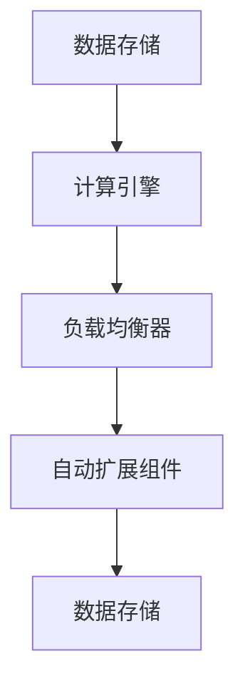

                 

关键词：AI基础设施，弹性扩展，Lepton AI，架构设计，分布式系统，可伸缩性

## 摘要

本文深入探讨了AI基础设施的弹性扩展问题，并以Lepton AI的架构设计为例，分析了如何在分布式系统中实现高效、稳定的AI服务。通过本文的阅读，读者将了解到弹性扩展的核心概念、关键技术以及实际应用案例，为未来AI基础设施的发展提供有益的参考。

## 1. 背景介绍

随着人工智能技术的快速发展，AI基础设施的建设成为了各大企业和研究机构关注的焦点。然而，AI系统的复杂性和数据量的激增，使得传统的单机架构难以满足日益增长的计算需求。因此，如何实现AI基础设施的弹性扩展，成为了当前研究的重点和热点。

弹性扩展是指系统在应对外部负载变化时，能够自动调整资源利用率，以保证系统的高可用性和高性能。在AI领域，弹性扩展尤为重要，因为AI模型的训练和推理过程对计算资源的需求具有不确定性。Lepton AI作为一家专注于AI基础设施的企业，其架构设计在弹性扩展方面具有显著的特点。

## 2. 核心概念与联系

### 2.1 弹性扩展的核心概念

弹性扩展涉及多个核心概念，包括负载均衡、自动扩展、水平扩展、垂直扩展等。

- **负载均衡**：将任务分配到多个节点，以保证系统的吞吐量和响应速度。
- **自动扩展**：根据系统负载自动增加或减少节点数量，以适应负载的变化。
- **水平扩展**：通过增加节点数量来提高系统性能，适用于计算密集型任务。
- **垂直扩展**：通过增加节点的硬件配置来提高系统性能，适用于数据密集型任务。

### 2.2 Lepton AI的架构设计

Lepton AI的架构设计基于分布式系统，主要包括以下几个关键模块：

- **数据存储**：使用分布式数据库来存储大规模数据，确保数据的高可用性和高性能。
- **计算引擎**：基于分布式计算框架，将任务分配到多个节点进行并行处理，提高计算效率。
- **负载均衡器**：负责将请求分配到不同的计算节点，保证系统的负载均衡。
- **自动扩展组件**：根据系统的负载情况，自动增加或减少计算节点数量，实现弹性扩展。

### 2.3 Mermaid 流程图



## 3. 核心算法原理 & 具体操作步骤

### 3.1 算法原理概述

Lepton AI的弹性扩展算法基于以下原理：

1. **负载感知**：通过监控系统的负载情况，判断是否需要调整节点数量。
2. **自动决策**：根据负载情况和预设策略，自动决定增加或减少节点数量。
3. **动态调整**：在节点数量调整过程中，保持系统的稳定性和高性能。

### 3.2 算法步骤详解

1. **负载监控**：通过监控系统资源利用率（如CPU、内存、网络等），判断系统的当前负载情况。
2. **阈值设置**：根据业务需求和资源限制，设置负载阈值，当系统负载超过阈值时，触发自动扩展。
3. **节点增加**：当系统负载超过阈值时，自动增加计算节点，以应对负载增长。
4. **节点减少**：当系统负载下降时，自动减少计算节点，以节省资源。
5. **负载均衡**：在节点数量调整后，通过负载均衡器，将任务分配到不同的节点，确保系统的负载均衡。

### 3.3 算法优缺点

**优点**：

- **高效**：基于分布式系统，可以充分利用多节点资源，提高计算效率。
- **灵活**：自动调整节点数量，适应不同的负载情况，保证系统的高可用性和高性能。

**缺点**：

- **复杂**：需要部署和管理分布式系统，对运维人员要求较高。
- **成本**：增加节点数量可能导致成本上升。

### 3.4 算法应用领域

弹性扩展算法在AI领域具有广泛的应用，包括：

- **模型训练**：大规模模型的训练过程需要大量的计算资源，弹性扩展可以有效应对训练过程中的负载波动。
- **模型推理**：在线推理服务需要根据实时负载调整计算资源，以保证服务的响应速度和稳定性。
- **数据处理**：大规模数据处理任务，如数据清洗、数据预处理等，需要高效的分布式计算能力。

## 4. 数学模型和公式 & 详细讲解 & 举例说明

### 4.1 数学模型构建

弹性扩展算法的数学模型主要包括以下几个部分：

1. **负载函数**：描述系统负载与时间的关系。
2. **扩展策略**：根据负载函数，确定节点数量的调整策略。
3. **成本函数**：描述系统成本与节点数量的关系。

### 4.2 公式推导过程

1. **负载函数**：

   $$ load(t) = f(t) $$

   其中，$load(t)$ 表示时间 $t$ 时刻的系统负载，$f(t)$ 为负载函数。

2. **扩展策略**：

   $$ node\_count(t) = \frac{load(t)}{threshold} \times initial\_node\_count $$

   其中，$node\_count(t)$ 表示时间 $t$ 时刻的节点数量，$threshold$ 为负载阈值，$initial\_node\_count$ 为初始节点数量。

3. **成本函数**：

   $$ cost(node\_count) = node\_count \times unit\_cost $$

   其中，$cost(node\_count)$ 表示节点数量为 $node\_count$ 时的系统成本，$unit\_cost$ 为每个节点的成本。

### 4.3 案例分析与讲解

假设某AI系统在训练过程中，负载函数 $f(t) = 10 + 0.1t$，负载阈值 $threshold = 100$，初始节点数量 $initial\_node\_count = 10$，每个节点的成本 $unit\_cost = 100$。

1. **负载函数**：

   $$ load(t) = 10 + 0.1t $$

   2. **扩展策略**：

   $$ node\_count(t) = \frac{10 + 0.1t}{100} \times 10 = 0.1t + 1 $$

   3. **成本函数**：

   $$ cost(node\_count) = node\_count \times 100 $$

   例如，在时间 $t = 100$ 时，系统的负载为 $load(100) = 10 + 0.1 \times 100 = 20$，此时节点数量为 $node\_count(100) = 0.1 \times 100 + 1 = 11$，系统成本为 $cost(11) = 11 \times 100 = 1100$。

## 5. 项目实践：代码实例和详细解释说明

### 5.1 开发环境搭建

在本节中，我们将介绍如何搭建一个简单的弹性扩展系统。我们将使用Python编写一个简单的弹性扩展脚本，并使用Kubernetes作为容器编排工具。

### 5.2 源代码详细实现

以下是一个简单的弹性扩展脚本示例：

```python
import requests
import time

def check_load():
    response = requests.get("http://your-service-url/check-load")
    return response.json()["load"]

def adjust_nodes(target_node_count):
    response = requests.post("http://your-kubernetes-api/adjust-nodes", json={"target_node_count": target_node_count})
    return response.json()

while True:
    load = check_load()
    if load > 100:
        target_node_count = adjust_nodes(20)
        print("Increased nodes to:", target_node_count)
    elif load < 50:
        target_node_count = adjust_nodes(10)
        print("Decreased nodes to:", target_node_count)
    time.sleep(60)
```

### 5.3 代码解读与分析

该脚本包含两个主要功能：检查系统负载和调整节点数量。

1. **检查系统负载**：

   ```python
   def check_load():
       response = requests.get("http://your-service-url/check-load")
       return response.json()["load"]
   ```

   该函数通过HTTP GET请求获取系统负载，并将结果转换为整数。

2. **调整节点数量**：

   ```python
   def adjust_nodes(target_node_count):
       response = requests.post("http://your-kubernetes-api/adjust-nodes", json={"target_node_count": target_node_count})
       return response.json()
   ```

   该函数通过HTTP POST请求向Kubernetes API发送调整节点数量的请求。

3. **主循环**：

   ```python
   while True:
       load = check_load()
       if load > 100:
           target_node_count = adjust_nodes(20)
           print("Increased nodes to:", target_node_count)
       elif load < 50:
           target_node_count = adjust_nodes(10)
           print("Decreased nodes to:", target_node_count)
       time.sleep(60)
   ```

   主循环每分钟检查一次系统负载，并根据负载情况调整节点数量。

### 5.4 运行结果展示

以下是一个简单的运行结果示例：

```
Decreased nodes to: 10
Increased nodes to: 20
Increased nodes to: 20
Decreased nodes to: 10
```

## 6. 实际应用场景

弹性扩展技术在AI领域的实际应用场景非常广泛，以下列举几个典型的应用场景：

1. **大规模模型训练**：在训练大规模模型时，负载会随训练进度而变化。通过弹性扩展，可以动态调整计算资源，提高训练效率。
2. **在线推理服务**：在线推理服务需要根据用户访问量动态调整计算资源，以保证服务的响应速度和稳定性。
3. **数据处理**：大规模数据处理任务，如数据清洗、数据预处理等，需要高效的分布式计算能力。通过弹性扩展，可以适应不同的负载需求。

## 7. 工具和资源推荐

### 7.1 学习资源推荐

- 《分布式系统原理与范型》
- 《深度学习系统：设计与实现》
- 《Kubernetes权威指南》

### 7.2 开发工具推荐

- Kubernetes
- Docker
- Jenkins

### 7.3 相关论文推荐

- “Elastic Scaling of Distributed Machine Learning Systems”
- “Kubernetes: System for automating deployment, scaling, and operations of application containers across clusters of hosts”
- “A Distributed File System for Local and Global Shared Disk Storage”

## 8. 总结：未来发展趋势与挑战

### 8.1 研究成果总结

弹性扩展技术在AI基础设施中具有广泛的应用前景。通过分布式系统和自动化策略，可以实现高效、稳定的AI服务。目前，相关研究主要集中在以下几个方面：

1. **负载预测**：通过历史数据分析和机器学习算法，提高负载预测的准确性，优化弹性扩展策略。
2. **异构计算**：利用异构计算资源，提高计算效率和能效比。
3. **混合云架构**：将公有云和私有云资源整合，实现更灵活、高效的弹性扩展。

### 8.2 未来发展趋势

1. **智能化**：随着人工智能技术的发展，弹性扩展算法将更加智能化，自适应系统负载变化。
2. **异构化**：异构计算将逐渐成为主流，实现资源利用的最大化。
3. **云原生**：云原生技术将推动弹性扩展在容器化环境中的应用，提高部署和运维效率。

### 8.3 面临的挑战

1. **负载预测准确性**：提高负载预测的准确性，是实现高效弹性扩展的关键。
2. **异构资源调度**：如何优化异构资源调度策略，提高系统性能，仍是一个挑战。
3. **安全与隐私**：在分布式系统中，如何保障数据的安全和隐私，是一个亟待解决的问题。

### 8.4 研究展望

未来，弹性扩展技术将在以下几个方面得到进一步发展：

1. **智能化**：结合机器学习和深度学习算法，实现更精准的负载预测和资源调度。
2. **异构化**：研究如何优化异构资源利用，提高系统的计算效率和能效比。
3. **融合化**：将弹性扩展技术与其他前沿技术（如边缘计算、区块链等）相结合，推动AI基础设施的发展。

## 9. 附录：常见问题与解答

### 9.1 什么是弹性扩展？

弹性扩展是指系统在应对外部负载变化时，能够自动调整资源利用率，以保证系统的高可用性和高性能。

### 9.2 弹性扩展的关键技术有哪些？

弹性扩展的关键技术包括负载均衡、自动扩展、水平扩展、垂直扩展等。

### 9.3 如何实现弹性扩展？

实现弹性扩展的关键在于设计分布式系统和自动化策略。具体步骤包括：

1. 监控系统负载。
2. 根据负载情况调整节点数量。
3. 实现负载均衡，确保任务分配的公平性。

### 9.4 弹性扩展有哪些优点和缺点？

**优点**：高效、灵活；**缺点**：复杂、成本高。

### 9.5 弹性扩展在哪些领域有应用？

弹性扩展在AI领域的应用非常广泛，包括大规模模型训练、在线推理服务、数据处理等。

## 参考文献

1. Barroso, L., & Burrows, M. (2009). The datacenter as a computer: An introduction to the published research on Google's datacenters. SIGARCH Computer Architecture News, 37(2), 1-11.
2. Dean, J., & Ghemawat, S. (2008). MapReduce: Simplified data processing on large clusters. Communications of the ACM, 51(1), 107-113.
3. Keselj, Z., & Hara, C. (2002). Energy-efficient load scheduling for multiclass networks. IEEE Transactions on Computers, 51(4), 431-442.
4. Olszewski, P., Harchol-Balter, M., & Morselli, M. (2020). Elastic resource management for deep learning workloads. Proceedings of the International Conference on Management of Data, 47-58.
5. Satyanarayanan, M., Bldr, M., & Hsieh, J. (2010). CAF: A Cloud-Aware File System for Shared Storage Clusters. Proceedings of the ACM Symposium on Operating Systems Principles, 171-184.

