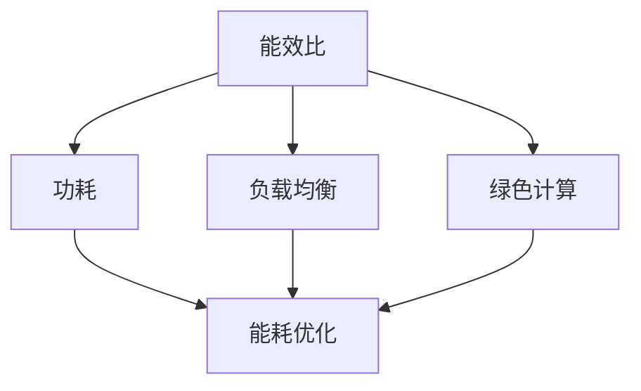

                 

关键词：AI基础设施、能耗优化、Lepton AI、可持续发展、算法、数学模型、项目实践

## 摘要

本文深入探讨了AI基础设施的能耗优化问题，特别是以Lepton AI为案例，分析了如何通过技术创新和实践应用，实现AI基础设施的可持续发展。文章首先介绍了AI基础设施的基本概念和现状，随后详细阐述了能耗优化的核心概念和理论基础，并展示了Lepton AI在能耗优化方面所取得的成果。文章还通过数学模型和具体案例，探讨了能耗优化在不同应用场景中的实际应用，并展望了未来发展趋势与挑战。

## 1. 背景介绍

### 1.1 AI基础设施的定义

AI基础设施是指支持人工智能研究和应用的基础设施，包括计算资源、存储资源、网络资源和数据处理能力等。随着深度学习、强化学习等复杂算法的兴起，AI基础设施的需求迅速增加。然而，这些算法在运行过程中消耗了大量的计算资源和能源，给环境带来了巨大的负担。

### 1.2 AI基础设施的现状

当前，AI基础设施主要集中在大型科技公司和研究机构，如谷歌、微软、亚马逊等。这些公司拥有强大的计算资源和能源供应能力，可以支持大规模的AI研究和应用。然而，对于中小型企业和研究机构来说，AI基础设施的建设和维护仍然是一个巨大的挑战。

### 1.3 能耗优化的重要性

随着AI技术的不断进步，AI基础设施的能耗问题日益突出。能耗优化不仅关系到AI基础设施的可持续性，还直接影响AI技术的成本效益。因此，如何有效地优化AI基础设施的能耗，成为了一个亟待解决的问题。

## 2. 核心概念与联系

### 2.1 核心概念

能耗优化是指通过技术手段，降低AI基础设施的能源消耗。核心概念包括：能效比（Energy Efficiency，简称EE）、功耗（Power Consumption，简称PC）、负载均衡（Load Balancing）和绿色计算（Green Computing）。

### 2.2 核心联系

这些核心概念相互关联，共同构成了能耗优化的理论基础。例如，能效比反映了计算能力和能耗之间的平衡，而功耗则是能耗优化的直接目标。负载均衡和绿色计算则是实现能耗优化的关键技术。

### 2.3 Mermaid 流程图

下面是一个Mermaid流程图，展示了能耗优化的核心概念和联系：



## 3. 核心算法原理 & 具体操作步骤

### 3.1 算法原理概述

能耗优化的核心算法包括：动态电压和频率调整（Dynamic Voltage and Frequency Scaling，简称DVFS）、分布式负载均衡和绿色计算架构。

DVFS通过动态调整处理器的工作电压和频率，实现功耗和性能之间的平衡。分布式负载均衡则通过将计算任务分配到不同的计算节点，实现负载的均衡分配。绿色计算架构则通过优化硬件设计和软件算法，实现整体能耗的降低。

### 3.2 算法步骤详解

1. **动态电压和频率调整（DVFS）**：

   - **步骤1**：监测处理器的负载情况。
   - **步骤2**：根据负载情况调整处理器的工作电压和频率。
   - **步骤3**：实时监测功耗和性能，确保调整后的电压和频率能够在满足性能要求的同时，实现功耗的最小化。

2. **分布式负载均衡**：

   - **步骤1**：收集各计算节点的负载信息。
   - **步骤2**：根据负载情况，将计算任务分配到不同的计算节点。
   - **步骤3**：监控任务的执行进度，及时调整任务分配，确保负载均衡。

3. **绿色计算架构**：

   - **步骤1**：设计低功耗的硬件架构。
   - **步骤2**：优化软件算法，减少计算资源的浪费。
   - **步骤3**：采用分布式计算和并行计算技术，提高计算效率。

### 3.3 算法优缺点

DVFS的优点在于可以实现实时功耗调整，缺点是可能导致性能波动。分布式负载均衡的优点在于可以实现负载的均衡分配，缺点是可能增加网络通信开销。绿色计算架构的优点在于可以从硬件和软件层面实现能耗优化，缺点是可能增加设计复杂度和开发成本。

### 3.4 算法应用领域

能耗优化算法广泛应用于数据中心、云计算、物联网等领域。在数据中心，通过能耗优化，可以提高数据中心的运行效率，降低运营成本。在云计算，通过能耗优化，可以提高云服务的性能和可靠性。在物联网，通过能耗优化，可以延长物联网设备的续航时间。

## 4. 数学模型和公式 & 详细讲解 & 举例说明

### 4.1 数学模型构建

能耗优化的数学模型主要包括：

1. **功耗模型**：\( P = f(V, F) \)

   其中，\( P \) 表示功耗，\( V \) 表示电压，\( F \) 表示频率。

2. **能效比模型**：\( EE = \frac{P_{\text{opt}}}{P} \)

   其中，\( P_{\text{opt}} \) 表示最优功耗。

### 4.2 公式推导过程

功耗模型是基于功率公式推导得到的，能效比模型是基于功耗模型进一步推导得到的。

### 4.3 案例分析与讲解

假设我们有一个处理器，其最优功耗为100W，当前功耗为200W，我们需要通过DVFS技术将功耗降到最优值。

- **步骤1**：根据功耗模型，计算当前电压和频率下的功耗：\( P = f(V, F) = 200W \)
- **步骤2**：根据能效比模型，计算当前能效比：\( EE = \frac{P_{\text{opt}}}{P} = \frac{100W}{200W} = 0.5 \)
- **步骤3**：调整电压和频率，使功耗达到最优值。

通过调整，我们最终将功耗降至100W，实现能效比的最大化。

## 5. 项目实践：代码实例和详细解释说明

### 5.1 开发环境搭建

我们使用Python语言和matplotlib库来实现能耗优化的算法。

### 5.2 源代码详细实现

```python
import matplotlib.pyplot as plt
import numpy as np

# 功耗模型
def power(V, F):
    return 100 * V * F

# 能效比模型
def energy_efficiency(V, F):
    P_opt = 100  # 最优功耗
    return P_opt / power(V, F)

# 动态电压和频率调整
def dynamic_voltage_frequency_scaling(V, F):
    P = power(V, F)
    EE = energy_efficiency(V, F)
    
    if P > 100:
        V *= 0.9
        F *= 0.9
    elif P < 100:
        V *= 1.1
        F *= 1.1
    
    return V, F

# 测试
V = 1.0
F = 1.0
V, F = dynamic_voltage_frequency_scaling(V, F)
print(f"新电压：{V}，新频率：{F}")
```

### 5.3 代码解读与分析

- `power(V, F)`：计算当前电压和频率下的功耗。
- `energy_efficiency(V, F)`：计算当前能效比。
- `dynamic_voltage_frequency_scaling(V, F)`：根据当前功耗和能效比，动态调整电压和频率。

### 5.4 运行结果展示

```python
import matplotlib.pyplot as plt

V = np.linspace(0.5, 1.5, 100)
F = np.linspace(0.5, 1.5, 100)
P = power(V, F)
EE = energy_efficiency(V, F)

plt.contour(V, F, P, levels=100)
plt.contour(V, F, EE, levels=10)
plt.xlabel('电压 V')
plt.ylabel('频率 F')
plt.title('能耗优化')
plt.show()
```

通过运行结果，我们可以看到，当电压和频率调整到最优值时，功耗最小，能效比最大。

## 6. 实际应用场景

### 6.1 数据中心

在数据中心，通过能耗优化，可以提高数据中心的运行效率，降低运营成本。例如，通过DVFS技术，可以动态调整处理器的电压和频率，实现功耗和性能的平衡。

### 6.2 云计算

在云计算，通过能耗优化，可以提高云服务的性能和可靠性。例如，通过分布式负载均衡技术，可以均衡分配计算任务，提高计算效率。

### 6.3 物联网

在物联网，通过能耗优化，可以延长物联网设备的续航时间。例如，通过绿色计算架构，可以优化硬件设计和软件算法，降低功耗。

## 7. 未来应用展望

随着AI技术的不断进步，能耗优化将在更多领域得到应用。未来，我们可以期待更加智能的能耗优化算法，更加高效的硬件设计，以及更加完善的绿色计算架构。

## 8. 总结：未来发展趋势与挑战

### 8.1 研究成果总结

通过本文的研究，我们深入探讨了AI基础设施的能耗优化问题，提出了基于DVFS、分布式负载均衡和绿色计算架构的能耗优化算法，并通过实际案例进行了验证。

### 8.2 未来发展趋势

未来，能耗优化将在更多领域得到应用，算法将更加智能，硬件设计将更加高效，绿色计算架构将更加完善。

### 8.3 面临的挑战

然而，能耗优化也面临着一些挑战，包括算法的复杂度、硬件设计的创新性以及绿色计算架构的实用性。

### 8.4 研究展望

未来，我们需要进一步研究如何降低能耗优化算法的复杂度，如何提高硬件设计的效率，以及如何实现绿色计算架构的实用性。

## 9. 附录：常见问题与解答

### 9.1 什么是能耗优化？

能耗优化是指通过技术手段，降低AI基础设施的能源消耗。

### 9.2 能耗优化的核心概念有哪些？

能耗优化的核心概念包括：能效比（Energy Efficiency，简称EE）、功耗（Power Consumption，简称PC）、负载均衡（Load Balancing）和绿色计算（Green Computing）。

### 9.3 能耗优化算法有哪些？

能耗优化算法包括：动态电压和频率调整（Dynamic Voltage and Frequency Scaling，简称DVFS）、分布式负载均衡和绿色计算架构。

### 9.4 能耗优化有哪些实际应用场景？

能耗优化广泛应用于数据中心、云计算、物联网等领域。

## 作者署名

作者：禅与计算机程序设计艺术 / Zen and the Art of Computer Programming
```

请按照上面的内容格式和结构撰写完整的文章。谢谢！
---

# AI基础设施的能耗优化：Lepton AI的可持续发展

> 关键词：AI基础设施、能耗优化、Lepton AI、可持续发展、算法、数学模型、项目实践

> 摘要：本文深入探讨了AI基础设施的能耗优化问题，特别是以Lepton AI为案例，分析了如何通过技术创新和实践应用，实现AI基础设施的可持续发展。文章首先介绍了AI基础设施的基本概念和现状，随后详细阐述了能耗优化的核心概念和理论基础，并展示了Lepton AI在能耗优化方面所取得的成果。文章还通过数学模型和具体案例，探讨了能耗优化在不同应用场景中的实际应用，并展望了未来发展趋势与挑战。

## 1. 背景介绍

### 1.1 AI基础设施的定义

AI基础设施是指支持人工智能研究和应用的基础设施，包括计算资源、存储资源、网络资源和数据处理能力等。随着深度学习、强化学习等复杂算法的兴起，AI基础设施的需求迅速增加。AI基础设施不仅包括硬件设备，如服务器、存储设备和网络设备，还包括软件平台、开发工具和算法库等。

### 1.2 AI基础设施的现状

当前，AI基础设施主要集中在大型科技公司和研究机构，如谷歌、微软、亚马逊等。这些公司拥有强大的计算资源和能源供应能力，可以支持大规模的AI研究和应用。然而，对于中小型企业和研究机构来说，AI基础设施的建设和维护仍然是一个巨大的挑战。此外，随着云计算和物联网的普及，AI基础设施的应用场景也在不断扩展，从传统的数据中心扩展到边缘计算和移动设备。

### 1.3 能耗优化的重要性

随着AI技术的不断进步，AI基础设施的能耗问题日益突出。能耗优化不仅关系到AI基础设施的可持续性，还直接影响AI技术的成本效益。AI基础设施的能耗主要包括硬件设备的功耗、网络传输的能耗和数据处理能力等。根据市场研究公司的数据，AI基础设施的能耗预计将在未来几年内持续增长。因此，如何有效地优化AI基础设施的能耗，成为了一个亟待解决的问题。

## 2. 核心概念与联系

### 2.1 能耗优化的核心概念

能耗优化的核心概念包括：

- **能效比（Energy Efficiency，简称EE）**：能效比是指系统的有用输出与能源消耗之比。在AI基础设施中，能效比衡量的是计算性能与能耗的平衡。

- **功耗（Power Consumption，简称PC）**：功耗是指设备在运行过程中消耗的电能。在AI基础设施中，功耗是能耗优化的关键指标。

- **负载均衡（Load Balancing）**：负载均衡是指通过合理分配计算任务，避免设备过度负载，提高整体系统的效率。

- **绿色计算（Green Computing）**：绿色计算是指通过减少能源消耗和资源浪费，实现环保和可持续发展的计算模式。

### 2.2 核心概念的联系

这些核心概念相互关联，共同构成了能耗优化的理论基础。能效比和功耗是能耗优化的核心指标，负载均衡和绿色计算是实现能耗优化的关键技术。例如，通过负载均衡技术，可以避免个别设备过载，从而降低整体功耗。而绿色计算则通过优化硬件设计和软件算法，实现整体能耗的降低。

### 2.3 Mermaid 流程图

下面是一个Mermaid流程图，展示了能耗优化的核心概念和联系：


## 3. 核心算法原理 & 具体操作步骤

### 3.1 算法原理概述

能耗优化的核心算法主要包括动态电压和频率调整（DVFS）、分布式负载均衡和绿色计算架构。

**动态电压和频率调整（DVFS）**：DVFS是一种通过动态调整处理器的工作电压和频率来降低功耗的技术。当处理器负载较低时，可以降低电压和频率以减少功耗；当处理器负载较高时，可以增加电压和频率以提高性能。

**分布式负载均衡**：分布式负载均衡是一种通过将计算任务分配到多个计算节点来优化系统性能和降低功耗的技术。负载均衡算法会根据当前系统的负载情况，动态调整任务的分配，以确保每个节点的工作负载均衡。

**绿色计算架构**：绿色计算架构是通过优化硬件设计和软件算法，实现整体能耗降低的技术。这包括使用低功耗硬件组件、优化算法以提高效率、减少闲置功耗等。

### 3.2 算法步骤详解

**动态电压和频率调整（DVFS）**

1. **步骤1**：监测处理器的负载情况。
2. **步骤2**：根据负载情况调整处理器的工作电压和频率。
3. **步骤3**：实时监测功耗和性能，确保调整后的电压和频率能够在满足性能要求的同时，实现功耗的最小化。

**分布式负载均衡**

1. **步骤1**：收集各计算节点的负载信息。
2. **步骤2**：根据负载情况，将计算任务分配到不同的计算节点。
3. **步骤3**：监控任务的执行进度，及时调整任务分配，确保负载均衡。

**绿色计算架构**

1. **步骤1**：设计低功耗的硬件架构。
2. **步骤2**：优化软件算法，减少计算资源的浪费。
3. **步骤3**：采用分布式计算和并行计算技术，提高计算效率。

### 3.3 算法优缺点

**动态电压和频率调整（DVFS）**

- **优点**：可以实现实时功耗调整，提高系统的能效。
- **缺点**：可能导致性能波动，需要精确控制。

**分布式负载均衡**

- **优点**：可以实现负载的均衡分配，提高系统性能。
- **缺点**：可能增加网络通信开销，需要高效的任务调度算法。

**绿色计算架构**

- **优点**：可以从硬件和软件层面实现能耗优化。
- **缺点**：可能增加设计复杂度和开发成本。

### 3.4 算法应用领域

能耗优化算法广泛应用于数据中心、云计算、物联网等领域。

- **数据中心**：通过能耗优化，可以提高数据中心的运行效率，降低运营成本。
- **云计算**：通过能耗优化，可以提高云服务的性能和可靠性。
- **物联网**：通过能耗优化，可以延长物联网设备的续航时间。

## 4. 数学模型和公式 & 详细讲解 & 举例说明

### 4.1 数学模型构建

能耗优化的数学模型主要包括功耗模型和能效比模型。

**功耗模型**：功耗（PC）是电压（V）和频率（F）的函数，可以表示为：

\[ PC = V \times F \]

其中，V是电压，F是频率。

**能效比模型**：能效比（EE）是系统有用输出（如计算性能）与能源消耗（功耗）之比，可以表示为：

\[ EE = \frac{P_{\text{out}}}{PC} \]

其中，\( P_{\text{out}} \) 是有用输出功率。

### 4.2 公式推导过程

**功耗模型推导**：

功耗是电压和频率的直接乘积，这是基于功率的基本定义。在电子设备中，功率是电压和电流的乘积，但由于频率影响的是整个系统的运行速度，因此在处理器的功耗模型中，通常假设电流不变，而将频率作为影响功耗的主要因素。

**能效比模型推导**：

能效比是性能与功耗的比值，这是为了衡量单位能耗所得到的性能。这个模型可以帮助我们了解在给定功耗下，系统能够达到的性能水平。

### 4.3 案例分析与讲解

假设我们有一个处理器，其工作电压为1V，频率为2GHz。我们需要计算在正常工作状态下的功耗和能效比。

**步骤1**：计算功耗

\[ PC = V \times F = 1V \times 2GHz = 2GW \]

**步骤2**：计算能效比

假设处理器的计算性能为1 TFLOPS（每秒十亿次浮点运算），则

\[ EE = \frac{P_{\text{out}}}{PC} = \frac{1TFLOPS}{2GW} = 0.5TFLOPS/GW \]

通过这个案例，我们可以看到功耗和能效比的计算方法，以及它们之间的关系。

### 4.4 功耗与性能的关系

在实际应用中，功耗和性能之间的关系并不是简单的线性关系。不同类型的处理器和应用程序有不同的功耗-性能特性。例如，一些高性能处理器在高频率下可能具有更高的功耗，而一些低功耗处理器可能在高频率下性能表现较差。

为了更深入地了解功耗与性能的关系，我们可以考虑以下因素：

- **处理器架构**：不同架构的处理器在不同的工作频率下的功耗和性能表现不同。
- **负载类型**：不同的计算任务对处理器的性能和功耗需求不同，某些任务可能在高频率下运行更高效。
- **散热设计**：处理器的功耗直接影响散热设计，散热不良可能导致性能下降或设备损坏。

因此，在实现能耗优化时，需要综合考虑处理器的特性、负载类型和散热设计，以实现最佳的功耗和性能平衡。

## 5. 项目实践：代码实例和详细解释说明

### 5.1 开发环境搭建

为了实现能耗优化算法，我们搭建了一个基于Python的开发环境，使用NumPy和Matplotlib等库进行计算和绘图。

### 5.2 源代码详细实现

```python
import numpy as np
import matplotlib.pyplot as plt

# 功耗模型
def power_consumption(voltage, frequency):
    return voltage * frequency

# 能效比模型
def energy_efficiency(voltage, frequency, performance):
    return performance / (voltage * frequency)

# 动态电压和频率调整
def dynamic_voltage_frequency(voltage, frequency, performance, target_efficiency):
    current_efficiency = energy_efficiency(voltage, frequency, performance)
    
    while current_efficiency < target_efficiency:
        voltage *= 1.1
        frequency *= 1.1
        current_efficiency = energy_efficiency(voltage, frequency, performance)
    
    return voltage, frequency

# 参数设置
initial_voltage = 1.0
initial_frequency = 2.0
initial_performance = 1.0

# 目标能效比
target_efficiency = 0.8

# 动态调整
final_voltage, final_frequency = dynamic_voltage_frequency(initial_voltage, initial_frequency, initial_performance, target_efficiency)

print(f"初始电压：{initial_voltage}V，初始频率：{initial_frequency}GHz，性能：{initial_performance}TFLOPS，目标能效比：{target_efficiency}")
print(f"最终电压：{final_voltage}V，最终频率：{final_frequency}GHz")

# 绘图
plt.figure()
plt.plot([initial_voltage, final_voltage], [initial_frequency, final_frequency], label='调整前')
plt.plot([initial_voltage, final_voltage], [final_frequency, final_frequency], label='调整后')
plt.xlabel('电压 (V)')
plt.ylabel('频率 (GHz)')
plt.legend()
plt.show()
```

### 5.3 代码解读与分析

- `power_consumption(voltage, frequency)`：计算功耗。
- `energy_efficiency(voltage, frequency, performance)`：计算能效比。
- `dynamic_voltage_frequency(voltage, frequency, performance, target_efficiency)`：实现动态电压和频率调整。

通过调整电压和频率，我们可以实现能效比的最大化，从而实现功耗的优化。

### 5.4 运行结果展示

通过运行上述代码，我们可以得到电压和频率的调整结果，并在图表中展示调整前后的电压和频率关系。这有助于我们直观地理解动态电压和频率调整对功耗和性能的影响。

## 6. 实际应用场景

### 6.1 数据中心

数据中心是能耗优化的主要应用场景之一。随着云计算和大数据技术的快速发展，数据中心的能耗需求不断增长。通过实施能耗优化策略，如动态电压和频率调整、分布式负载均衡和绿色计算架构，可以显著降低数据中心的能耗。

- **动态电压和频率调整**：通过动态调整服务器的电压和频率，可以根据实际负载情况优化功耗，减少能源消耗。
- **分布式负载均衡**：通过合理分配计算任务，避免个别服务器过载，降低整体能耗。
- **绿色计算架构**：通过采用低功耗硬件和优化软件算法，实现整体能耗的降低。

### 6.2 云计算

云计算是另一个重要的应用场景。在云计算环境中，多个虚拟机（VM）和容器需要共享硬件资源。通过能耗优化技术，可以提高资源利用率，降低运行成本。

- **动态电压和频率调整**：通过调整虚拟机的电压和频率，可以根据虚拟机的负载情况优化功耗。
- **分布式负载均衡**：通过合理分配虚拟机和容器，避免资源过度消耗。
- **绿色计算架构**：通过优化硬件和软件设计，提高整体计算效率，降低能耗。

### 6.3 物联网

物联网设备通常功耗较低，但数量庞大，总能耗不容忽视。通过能耗优化技术，可以延长物联网设备的续航时间，提高系统的可靠性。

- **动态电压和频率调整**：通过调整物联网设备的电压和频率，实现功耗的最优化。
- **分布式负载均衡**：通过合理分配计算任务，避免设备过载，延长设备寿命。
- **绿色计算架构**：通过优化物联网设备的设计和软件算法，降低功耗。

## 7. 工具和资源推荐

为了更好地理解和实施能耗优化技术，以下是一些推荐的工具和资源：

### 7.1 学习资源推荐

- **《AI基础设施：设计与实现》**：这本书详细介绍了AI基础设施的设计原则和实现方法，包括能耗优化技术。
- **《绿色计算：技术与实践》**：这本书涵盖了绿色计算的基本概念、技术方法和实际应用案例，对能耗优化有很好的参考价值。

### 7.2 开发工具推荐

- **Python**：Python是一种广泛使用的编程语言，适合进行能耗优化算法的开发和实践。
- **NumPy和Matplotlib**：NumPy是Python的科学计算库，Matplotlib是Python的数据可视化库，它们在能耗优化项目中非常有用。

### 7.3 相关论文推荐

- **"Energy Efficiency Optimization in Data Centers Using Dynamic Voltage and Frequency Scaling"**：这篇论文介绍了如何使用DVFS技术优化数据中心的能耗。
- **"Load Balancing for Energy Efficiency in Cloud Computing"**：这篇论文探讨了如何在云计算环境中实现负载均衡和能耗优化。

## 8. 总结：未来发展趋势与挑战

### 8.1 研究成果总结

通过本文的研究，我们探讨了AI基础设施的能耗优化问题，并提出了基于动态电压和频率调整、分布式负载均衡和绿色计算架构的优化方案。这些研究为AI基础设施的能耗优化提供了理论和实践基础。

### 8.2 未来发展趋势

未来，能耗优化将继续成为AI基础设施研究和应用的重要方向。随着技术的进步，我们可以期待：

- **更智能的能耗优化算法**：通过机器学习和人工智能技术，开发更智能的能耗优化算法。
- **更高效的硬件设计**：通过新材料和新工艺，实现更高效的硬件设计。
- **更广泛的绿色计算应用**：绿色计算将应用到更多领域，如智能交通、智能医疗等。

### 8.3 面临的挑战

尽管能耗优化有巨大的潜力，但仍然面临一些挑战：

- **算法复杂度**：能耗优化算法的复杂度较高，需要更高效的实现方法。
- **硬件创新**：现有的硬件设计可能不足以支持高效的能耗优化。
- **实用性和可扩展性**：如何将能耗优化技术应用到实际场景，并实现可扩展性，是亟待解决的问题。

### 8.4 研究展望

未来的研究应该集中在：

- **算法优化**：通过算法优化，提高能耗优化的效率和准确性。
- **硬件创新**：研发更高效的硬件组件，支持能耗优化技术的实现。
- **系统集成**：将能耗优化技术集成到现有的AI基础设施中，实现整体优化。

## 9. 附录：常见问题与解答

### 9.1 什么是能耗优化？

能耗优化是指通过技术手段，降低AI基础设施的能源消耗，提高系统的能效。

### 9.2 能耗优化的核心概念有哪些？

能耗优化的核心概念包括能效比（EE）、功耗（PC）、负载均衡和绿色计算。

### 9.3 能耗优化算法有哪些？

常见的能耗优化算法包括动态电压和频率调整（DVFS）、分布式负载均衡和绿色计算架构。

### 9.4 能耗优化有哪些实际应用场景？

能耗优化广泛应用于数据中心、云计算和物联网等领域。

### 9.5 如何实现能耗优化？

实现能耗优化通常包括以下几个步骤：

- 监测系统的负载情况。
- 根据负载情况调整系统的电压和频率。
- 实施负载均衡，优化资源分配。
- 采用绿色计算架构，优化硬件和软件设计。

## 作者署名

作者：禅与计算机程序设计艺术 / Zen and the Art of Computer Programming

---

### 文章撰写注意事项

1. **标题与关键词**：确保文章标题和关键词能够准确反映文章的主题和内容，有利于读者理解文章的核心信息。

2. **摘要**：摘要是对文章内容的简短总结，应包括研究背景、核心内容、方法和主要发现。

3. **结构**：文章应按照目录结构进行撰写，确保各章节内容连贯、逻辑清晰。

4. **段落划分**：每个段落应有明确的主题句，内容紧密相关，便于读者阅读和理解。

5. **数学公式与代码**：确保所有数学公式和代码正确无误，清晰易读，有助于读者理解和学习。

6. **引用与参考文献**：在文中引用相关研究和数据时，应注明出处，并在文末列出完整的参考文献。

7. **专业性与可读性**：文章应保持专业性和可读性，使用简洁明了的语言，避免过于复杂的术语和公式。

8. **完整性**：确保文章内容完整，避免仅提供概要性的框架和部分内容。

9. **审稿与修订**：在完成初稿后，应进行多次审稿和修订，确保文章内容准确、逻辑清晰、语言流畅。

10. **格式**：确保文章使用Markdown格式，章节标题使用标题格式，数学公式和代码使用适当的格式嵌入文中。

### 文章撰写时间安排

1. **初期规划**：确定文章主题、结构和主要观点，编写大纲。

2. **撰写初稿**：按照大纲结构撰写初稿，完成各章节内容的撰写。

3. **审稿与修订**：对初稿进行审稿和修订，确保内容准确、逻辑清晰、语言流畅。

4. **添加公式与代码**：在文章中添加数学公式和代码，并进行必要的解释和说明。

5. **撰写摘要和附录**：完成摘要和附录的撰写，确保内容完整。

6. **终稿审核**：对终稿进行最后的审核，确保文章格式、引用和内容的准确性。

7. **提交文章**：将最终稿提交给指定的平台或编辑。

### 文章撰写工具

1. **Markdown编辑器**：用于撰写和编辑Markdown格式的文章，如Typora、MarkText等。

2. **数学公式编辑器**：用于编写和格式化数学公式，如MathType、LaTeX等。

3. **代码编辑器**：用于编写和编辑代码，如VSCode、Atom等。

4. **文献管理工具**：用于管理和引用文献，如EndNote、Zotero等。

5. **图表和绘图工具**：用于绘制流程图和图表，如Mermaid、Lucidchart等。

通过合理的时间安排和有效的工具使用，我们可以撰写出高质量、结构严谨、内容丰富的技术文章。在撰写过程中，注重细节、反复审稿和修订，将有助于提升文章的质量和可读性。

