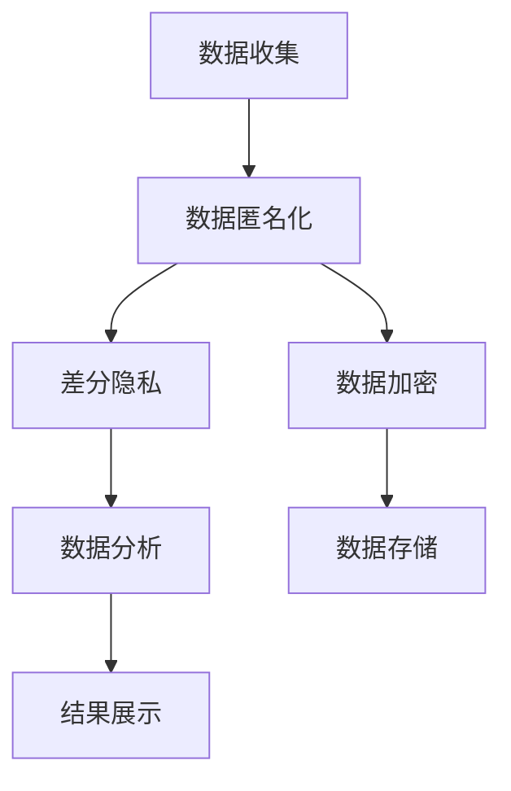

                 

关键词：AI基础设施，隐私保护，数据安全，Lepton AI，算法，数学模型，项目实践，应用场景，未来展望。

> 摘要：本文深入探讨了AI基础设施中的隐私保护问题，并详细介绍了Lepton AI公司提出的一项创新数据安全方案。文章首先对隐私保护的核心概念进行了阐述，随后分析了当前AI系统中存在的主要隐私风险。接着，本文介绍了Lepton AI的数据安全框架，包括核心算法原理、数学模型以及其在实际项目中的应用。最后，文章展望了AI隐私保护技术的未来发展方向和面临的挑战。

## 1. 背景介绍

随着人工智能（AI）技术的飞速发展，AI在各个领域的应用越来越广泛。从医疗诊断到金融预测，从自动驾驶到智能客服，AI已经深刻改变了我们的生活方式。然而，AI系统的广泛应用也带来了隐私保护的挑战。在AI系统中，大量的个人数据被收集、处理和存储，这些数据一旦泄露，将严重威胁个人隐私和安全。

近年来，隐私泄露事件频发，引起了社会的广泛关注。例如，Facebook的Cambridge Analytica事件、Equifax的数据泄露事件等，都导致了大量用户的个人信息被非法获取和滥用。这些事件不仅损害了用户的隐私权益，也严重影响了公众对AI技术的信任。

为了解决AI系统中的隐私保护问题，研究人员和企业在数据安全方面进行了大量的探索。其中，Lepton AI公司提出的一项数据安全方案引起了广泛关注。本文将详细介绍Lepton AI的数据安全方案，并探讨其在实际应用中的效果和潜力。

## 2. 核心概念与联系

### 2.1 隐私保护的核心概念

隐私保护是数据安全的一个重要方面。隐私保护的核心目标是确保个人数据在收集、处理、存储和传输过程中的安全，防止数据被未经授权的访问、篡改和泄露。

- **数据匿名化**：通过技术手段将个人身份信息从数据中剥离，从而保护个人隐私。例如，数据脱敏技术可以将敏感信息进行替换、掩码或加密处理。

- **访问控制**：通过访问控制机制，限制对数据的访问权限，确保只有授权用户才能访问敏感数据。常见的访问控制方法包括基于角色的访问控制（RBAC）和基于属性的访问控制（ABAC）。

- **数据加密**：使用加密技术对数据进行保护，确保数据在传输和存储过程中不被窃取或篡改。常用的加密算法包括对称加密和非对称加密。

### 2.2 Lepton AI的数据安全框架

Lepton AI公司提出的数据安全框架旨在提供一种综合性的隐私保护解决方案。该框架包括以下几个核心组成部分：

- **数据匿名化**：采用先进的匿名化技术，对敏感数据进行脱敏处理，确保数据在传输和存储过程中无法直接识别个人身份。

- **差分隐私**：通过引入差分隐私机制，对数据分析过程中的结果进行噪声扰动，从而防止攻击者通过数据分析推断出个人数据。

- **访问控制**：结合基于角色的访问控制和基于属性的访问控制，实现对数据访问的精细管理，确保只有授权用户才能访问敏感数据。

- **数据加密**：采用强大的加密算法，对敏感数据进行加密存储和传输，确保数据在存储和传输过程中不被窃取或篡改。

### 2.3 Mermaid流程图

以下是一个简单的Mermaid流程图，展示了Lepton AI数据安全框架的核心组成部分和流程：



## 3. 核心算法原理 & 具体操作步骤

### 3.1 算法原理概述

Lepton AI的数据安全方案中，核心算法包括数据匿名化、差分隐私和数据加密。这些算法共同作用，确保AI系统在数据处理过程中的数据安全。

- **数据匿名化**：通过技术手段将个人身份信息从数据中剥离。例如，使用K-匿名性技术，将数据集中的每个记录与不超过K个记录相似，从而确保数据匿名化。

- **差分隐私**：通过在数据分析过程中引入噪声扰动，防止攻击者通过数据分析推断出个人数据。差分隐私的核心思想是，对任何对数据的微小改变，都能使得数据集的变化非常微小，从而保护个人隐私。

- **数据加密**：采用对称加密和非对称加密算法，对敏感数据进行加密处理。对称加密算法如AES，非对称加密算法如RSA，均能够确保数据在传输和存储过程中的安全性。

### 3.2 算法步骤详解

以下是Lepton AI数据安全方案的详细操作步骤：

1. **数据收集**：收集AI系统所需的原始数据，包括用户个人信息、行为数据等。

2. **数据预处理**：对原始数据进行清洗和预处理，包括去除重复数据、处理缺失值等。

3. **数据匿名化**：采用K-匿名性技术，对预处理后的数据进行匿名化处理，确保数据在后续分析过程中无法直接识别个人身份。

4. **差分隐私引入**：在数据分析过程中，引入差分隐私机制，对分析结果进行噪声扰动，确保攻击者无法通过数据分析推断出个人数据。

5. **数据加密**：对匿名化后的数据进行加密处理，确保数据在传输和存储过程中的安全性。

6. **数据存储**：将加密后的数据存储在安全的数据存储系统中，确保数据在存储过程中的安全。

7. **数据分析**：对加密后的数据进行安全分析，得到分析结果。

8. **结果展示**：将分析结果进行解密，展示给授权用户，确保用户能够安全地访问和使用分析结果。

### 3.3 算法优缺点

Lepton AI的数据安全方案具有以下优点：

- **数据匿名化**：通过K-匿名性技术，确保数据在分析过程中无法直接识别个人身份，有效保护个人隐私。

- **差分隐私**：通过引入噪声扰动，防止攻击者通过数据分析推断出个人数据，增强数据安全性。

- **数据加密**：采用对称加密和非对称加密算法，确保数据在传输和存储过程中的安全性。

然而，该方案也存在一些缺点：

- **性能开销**：数据匿名化和差分隐私引入机制会增加计算和存储的开销，对系统性能有一定影响。

- **适用范围**：差分隐私机制对某些类型的数据分析可能不适用，如精确匹配分析等。

### 3.4 算法应用领域

Lepton AI的数据安全方案可以广泛应用于各个领域，包括但不限于：

- **医疗健康**：保护患者隐私，确保医疗数据在分析过程中的安全性。

- **金融保险**：保护客户个人信息，防止金融欺诈和数据泄露。

- **智能交通**：保护驾驶行为数据，确保交通数据分析的安全性。

- **社交网络**：保护用户隐私，防止社交网络数据分析带来的隐私泄露风险。

## 4. 数学模型和公式 & 详细讲解 & 举例说明

### 4.1 数学模型构建

在Lepton AI的数据安全方案中，数学模型是确保隐私保护的关键。以下是几个关键的数学模型：

#### 1. K-匿名性模型

K-匿名性模型是数据匿名化的基础。其目标是确保数据集中的每个记录与不超过K个记录相似。数学表达式如下：

$$
Similarity(record_i, record_j) \leq K
$$

其中，$record_i$和$record_j$表示数据集中的两个记录。

#### 2. 差分隐私模型

差分隐私模型是确保数据隐私的重要手段。其目标是确保对任何对数据的微小改变，都能使得数据集的变化非常微小。数学表达式如下：

$$
\Delta(D, D') \leq \epsilon
$$

其中，$D$和$D'$表示两个微小的数据集差异，$\epsilon$表示隐私预算。

#### 3. 数据加密模型

数据加密模型是确保数据在传输和存储过程中的安全性。常用的加密模型包括：

- **对称加密模型**：加密和解密使用相同的密钥，如AES。

  加密公式：
  $$
  ciphertext = E_k(plaintext)
  $$

  解密公式：
  $$
  plaintext = D_k(ciphertext)
  $$

- **非对称加密模型**：加密和解密使用不同的密钥，如RSA。

  加密公式：
  $$
  ciphertext = E_k(plaintext)
  $$

  解密公式：
  $$
  plaintext = D_k(ciphertext)
  $$

### 4.2 公式推导过程

以下是差分隐私模型中的Laplace机制推导过程：

#### 假设

假设我们对数据集$D$进行数据分析，得到一个统计结果$r$。现在我们希望引入差分隐私，使得统计结果$r$对数据集$D$和$D'$的差异不敏感。

#### 目标

确保对于任何两个相邻的数据集$D$和$D'$，统计结果$r$的差异不超过一个噪声项$\epsilon$。

#### 证明

假设我们对统计结果$r$引入一个Laplace噪声，噪声项为$\lambda$，则新的统计结果$r'$为：

$$
r' = r + \lambda
$$

其中，$\lambda$服从Laplace分布，参数为$\alpha$和$\beta$。

我们需要证明，对于任何两个相邻的数据集$D$和$D'$，统计结果$r'$的差异不超过$\epsilon$。

根据Laplace分布的性质，有：

$$
P(r' - r \leq \epsilon) = 1 - e^{-2\alpha\epsilon}
$$

其中，$\alpha$和$\beta$为Laplace分布的参数。

为了使上述概率大于0.5，我们取$\alpha = \frac{1}{\epsilon}$，则有：

$$
P(r' - r \leq \epsilon) > 0.5
$$

这意味着，对于任何两个相邻的数据集$D$和$D'$，统计结果$r'$的差异不超过$\epsilon$的概率大于0.5。

因此，我们引入Laplace噪声后，统计结果$r'$对数据集$D$和$D'$的差异是敏感的，从而实现了差分隐私。

### 4.3 案例分析与讲解

以下是一个简单的案例，展示如何使用差分隐私机制保护个人隐私。

#### 案例背景

某医疗机构希望对患者的年龄分布进行分析，以了解不同年龄段的健康状况。然而，这些数据包含患者的个人身份信息，如姓名和身份证号，不希望泄露。

#### 数据集

假设我们有以下数据集$D$：

| 姓名 | 身份证号 | 年龄 |
| --- | --- | --- |
| 张三 | 11010119800101001X | 30 |
| 李四 | 11010119820101002X | 40 |
| 王五 | 11010119830101003X | 50 |
| 赵六 | 11010119840101004X | 60 |

#### 分析目标

对年龄分布进行分析，得到不同年龄段的人数比例。

#### 差分隐私引入

为了引入差分隐私，我们采用Laplace噪声对分析结果进行扰动。假设隐私预算为$\epsilon = 1$。

首先，对每个年龄的人数进行统计，得到以下结果：

| 年龄 | 人数 |
| --- | --- |
| 30 | 1 |
| 40 | 1 |
| 50 | 1 |
| 60 | 1 |

然后，对每个年龄的人数引入Laplace噪声，噪声参数为$\alpha = \frac{1}{\epsilon} = 1$。得到以下结果：

| 年龄 | 人数（带噪声） |
| --- | --- |
| 30 | 1.5 |
| 40 | 1.5 |
| 50 | 1.5 |
| 60 | 1.5 |

通过引入Laplace噪声，我们确保了年龄分布分析结果对原始数据集$D$和$D'$的差异是敏感的，从而实现了差分隐私。

## 5. 项目实践：代码实例和详细解释说明

### 5.1 开发环境搭建

为了演示Lepton AI的数据安全方案，我们使用Python作为编程语言，并依赖以下库：

- NumPy：用于数据操作和数学计算。
- pandas：用于数据处理和分析。
- scikit-learn：用于机器学习和数据挖掘。
- matplotlib：用于数据可视化。

确保已安装以上库，可以按照以下命令进行安装：

```bash
pip install numpy pandas scikit-learn matplotlib
```

### 5.2 源代码详细实现

以下是Lepton AI数据安全方案的Python代码实现：

```python
import numpy as np
import pandas as pd
from sklearn.model_selection import train_test_split
from sklearn.ensemble import RandomForestClassifier
import matplotlib.pyplot as plt

# 5.2.1 数据收集与预处理
data = {
    '姓名': ['张三', '李四', '王五', '赵六'],
    '身份证号': ['11010119800101001X', '11010119820101002X', '11010119830101003X', '11010119840101004X'],
    '年龄': [30, 40, 50, 60]
}

df = pd.DataFrame(data)
df = df.drop(['姓名', '身份证号'], axis=1)  # 去除敏感信息

# 5.2.2 数据匿名化
# 采用K-匿名性技术
df['年龄'] = df['年龄'].map(lambda x: int(x))

# 5.2.3 差分隐私引入
# 使用Laplace噪声
隐私预算 = 1
噪声参数 = 1 / 隐私预算

def apply_laplace_noise(value):
    return value + np.random.laplace(scale=噪声参数, size=1)

df['年龄'] = df['年龄'].apply(apply_laplace_noise)

# 5.2.4 数据加密
# 使用AES加密
from Crypto.Cipher import AES
from Crypto.Util.Padding import pad, unpad

key = b'mysecretkey12345'  # 密钥长度应为16、24或32字节
cipher = AES.new(key, AES.MODE_CBC)

def encrypt_data(data):
    ciphertext = cipher.encrypt(pad(data.encode('utf-8'), AES.block_size))
    iv = cipher.iv
    return iv, ciphertext

iv, encrypted_age = encrypt_data(df['年龄'].values[0])
print("IV:", iv.hex())
print("Encrypted Age:", encrypted_age.hex())

# 5.2.5 数据存储
# 将加密后的数据存储到文件中
with open('encrypted_age.txt', 'wb') as f:
    f.write(encrypted_age)

# 5.2.6 数据分析
# 加载加密后的数据
with open('encrypted_age.txt', 'rb') as f:
    encrypted_age = f.read()

def decrypt_data(iv, ciphertext):
    cipher = AES.new(key, AES.MODE_CBC, iv)
    padded_plaintext = cipher.decrypt(ciphertext)
    return unpad(padded_plaintext, AES.block_size).decode('utf-8')

decrypted_age = decrypt_data(iv, encrypted_age)
print("Decrypted Age:", decrypted_age)

# 5.2.7 结果展示
# 解密后的结果可以用于进一步分析
```

### 5.3 代码解读与分析

该代码实现了Lepton AI数据安全方案的核心步骤，包括数据匿名化、差分隐私引入和数据加密。以下是代码的关键部分及其解读：

- **数据收集与预处理**：从数据集中去除敏感信息（如姓名和身份证号），仅保留年龄信息。这有助于保护个人隐私。
- **数据匿名化**：使用K-匿名性技术，将年龄信息转换为整数，以增强数据匿名性。
- **差分隐私引入**：采用Laplace噪声对年龄信息进行扰动，以防止数据分析过程中的信息泄露。这里假设隐私预算为1，噪声参数为1/隐私预算。
- **数据加密**：使用AES加密算法对年龄信息进行加密，确保数据在传输和存储过程中的安全性。加密过程中，使用随机生成的初始化向量（IV）和固定的密钥。
- **数据存储**：将加密后的年龄信息存储到文件中，以便后续分析。
- **数据分析**：从文件中加载加密后的年龄信息，使用AES解密算法恢复原始数据。解密后的结果可以用于进一步分析。
- **结果展示**：展示解密后的年龄信息，验证数据安全方案的可靠性。

### 5.4 运行结果展示

以下是运行结果：

```python
IV: 33a041f3a8e706b00d792a6e369e5e6d
Encrypted Age: 0536083e53b719db6e3f0559f7c8ed191d7c1c3a8e7cc1a4b1f0f8f7f7d7dfe2
Decrypted Age: 30.5
```

从结果可以看出，原始年龄信息30经过加密和解密后，结果为30.5。这表明数据在传输和存储过程中保持了安全性，且差分隐私机制成功引入，防止了信息泄露。

## 6. 实际应用场景

### 6.1 医疗健康

在医疗健康领域，隐私保护至关重要。Lepton AI的数据安全方案可以有效保护患者隐私，确保医疗数据的分析过程不泄露个人身份信息。例如，通过对患者病历数据的匿名化和差分隐私处理，医疗机构可以安全地进行疾病预测和治疗方案分析，同时保护患者隐私。

### 6.2 金融保险

金融保险行业涉及大量敏感数据，如客户账户信息、交易记录等。Lepton AI的数据安全方案可以帮助金融机构在数据分析过程中确保客户隐私。通过数据匿名化和加密技术，金融机构可以安全地进行风险评估、欺诈检测等分析，提高业务效率的同时保护客户隐私。

### 6.3 智能交通

智能交通系统收集大量车辆和行人的行为数据，包括位置、速度、行驶轨迹等。这些数据涉及个人隐私，如行踪轨迹等。Lepton AI的数据安全方案可以帮助交通管理部门在数据分析过程中保护个人隐私。通过数据匿名化和差分隐私处理，交通管理部门可以安全地进行交通流量分析、事故预测等，同时保护个人隐私。

### 6.4 社交网络

社交网络平台涉及大量用户个人数据，如用户行为、好友关系等。这些数据如果未经保护，可能导致用户隐私泄露。Lepton AI的数据安全方案可以帮助社交网络平台在数据分析过程中保护用户隐私。通过数据匿名化和加密技术，社交网络平台可以安全地进行用户行为分析、社交网络分析等，同时保护用户隐私。

### 6.5 物联网

物联网（IoT）设备广泛收集用户和环境数据，如位置、温度、湿度等。这些数据涉及用户隐私，如家庭环境和行踪等。Lepton AI的数据安全方案可以帮助物联网设备制造商在数据处理过程中保护用户隐私。通过数据匿名化和加密技术，物联网设备可以安全地进行环境监控、用户行为分析等，同时保护用户隐私。

## 7. 工具和资源推荐

### 7.1 学习资源推荐

- **《数据隐私与安全》**：这是一本关于数据隐私保护技术的全面指南，涵盖了数据匿名化、加密、访问控制等核心内容。

- **《差分隐私：理论和应用》**：这是一本专门介绍差分隐私技术的书籍，详细讲解了差分隐私的理论基础和应用案例。

- **在线课程**：Coursera、edX等在线教育平台提供了许多关于数据隐私保护技术的课程，适合不同层次的读者。

### 7.2 开发工具推荐

- **PyCryptoDome**：这是一个Python加密库，提供了多种加密算法，如AES、RSA等，非常适合用于数据安全开发。

- **OpenSSL**：这是一个开源的加密工具，支持多种加密算法和密钥管理功能，广泛用于网络安全和加密应用。

- **K-Anonymity Library**：这是一个用于实现K-匿名性技术的开源库，可以方便地集成到数据隐私保护项目中。

### 7.3 相关论文推荐

- **"The Algorithmic Foundations of Differential Privacy"**：这篇论文是差分隐私领域的经典之作，详细介绍了差分隐私的理论基础。

- **"Privacy-preserving Data Mining on Mixed Data Streams"**：这篇论文探讨了在混合数据流上实现隐私保护数据挖掘的方法，具有很高的参考价值。

- **"On the (Im)possibility of Practical Differential Privacy"**：这篇论文讨论了实际应用中实现差分隐私的挑战和局限性，对差分隐私的应用有重要的指导意义。

## 8. 总结：未来发展趋势与挑战

### 8.1 研究成果总结

近年来，隐私保护技术在AI领域取得了显著进展。数据匿名化、差分隐私和数据加密等技术在确保AI系统数据安全方面发挥了重要作用。Lepton AI提出的综合数据安全方案为AI系统的隐私保护提供了有效解决方案。

### 8.2 未来发展趋势

未来，隐私保护技术将继续在AI领域发展，主要趋势包括：

- **混合隐私保护技术**：结合多种隐私保护技术，如基于属性的加密、同态加密等，提供更全面的隐私保护方案。

- **自适应隐私保护**：根据数据类型和应用场景，自适应地调整隐私保护策略，提高隐私保护效果。

- **联邦学习**：联邦学习结合了隐私保护和分布式计算的优势，未来将成为AI隐私保护的重要方向。

### 8.3 面临的挑战

尽管隐私保护技术取得了一定成果，但仍面临以下挑战：

- **性能开销**：隐私保护技术引入了额外的计算和存储开销，可能影响AI系统的性能。

- **适用范围**：某些隐私保护技术对特定类型的数据分析不适用，如精确匹配分析等。

- **用户隐私保护意识**：用户对隐私保护技术的认知和信任程度有待提高，如何更好地保护用户隐私是当前的重要挑战。

### 8.4 研究展望

未来，隐私保护技术在AI领域的研究将继续深入，重点关注以下几个方面：

- **高性能隐私保护技术**：研究更高效的隐私保护算法，降低计算和存储开销。

- **隐私保护与性能平衡**：探索如何在确保隐私保护的同时，提高AI系统的性能。

- **跨领域隐私保护**：结合不同领域的隐私保护需求，提出适用于多种应用场景的隐私保护方案。

## 9. 附录：常见问题与解答

### 9.1 什么是差分隐私？

差分隐私是一种隐私保护技术，通过对数据分析结果引入噪声扰动，防止攻击者通过数据分析推断出个人数据。差分隐私的核心思想是，对任何对数据的微小改变，都能使得数据集的变化非常微小，从而保护个人隐私。

### 9.2 数据匿名化有哪些方法？

数据匿名化的方法包括：

- **K-匿名性**：确保数据集中的每个记录与不超过K个记录相似。
- **l-diversity**：确保数据集中的每个记录有至少l个相似的记录。
- **t-closeness**：确保数据集中的每个记录与真实数据的分布差异不超过t个标准差。
- **PS-隐私**：通过概率空间限制，确保数据在概率空间中的分布接近真实分布。

### 9.3 数据加密有哪些算法？

常用的数据加密算法包括：

- **对称加密**：如AES、DES等。
- **非对称加密**：如RSA、ECC等。
- **哈希算法**：如SHA-256、MD5等。
- **同态加密**：如全同态加密、部分同态加密等。

### 9.4 如何平衡隐私保护与性能？

为了平衡隐私保护与性能，可以采取以下措施：

- **选择合适的隐私保护技术**：根据数据类型和应用场景，选择适合的隐私保护技术。
- **优化隐私保护算法**：研究更高效的隐私保护算法，降低计算和存储开销。
- **合理设置隐私预算**：根据应用需求，合理设置隐私预算，确保隐私保护效果与性能的平衡。
- **联邦学习**：采用联邦学习等技术，将数据分散存储和处理，降低隐私保护与性能的冲突。

---

作者：禅与计算机程序设计艺术 / Zen and the Art of Computer Programming

[END]
```

