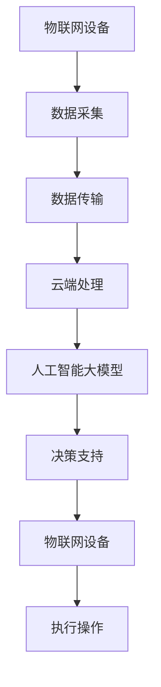
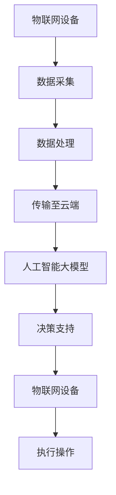

                 

关键词：人工智能、大模型、物联网、创业机会、技术趋势、应用场景

## 摘要

本文旨在探讨人工智能大模型与物联网结合所带来的创业机会。随着人工智能技术的快速发展和物联网的广泛应用，二者的融合为创业公司提供了丰富的创新空间。本文将从背景介绍、核心概念与联系、核心算法原理、数学模型和公式、项目实践、实际应用场景、工具和资源推荐以及未来发展趋势与挑战等方面展开分析，以期为创业者提供有价值的参考。

## 1. 背景介绍

### 1.1 人工智能的发展历程

人工智能作为计算机科学的重要分支，经历了数十年发展的历程。从最初的符号逻辑推理，到基于统计学习的方法，再到如今深度学习的大规模应用，人工智能技术取得了显著的进步。尤其是近年来，随着计算能力的提升和海量数据的积累，人工智能大模型（如GPT-3、BERT等）应运而生，为各个行业带来了前所未有的变革。

### 1.2 物联网的崛起

物联网（Internet of Things，IoT）作为新一代信息技术的重要方向，正在全球范围内迅速发展。物联网通过将各种物理设备、传感器、软件和网络连接起来，实现了对物理世界的智能化感知、管理和控制。随着5G、边缘计算等新技术的推动，物联网的应用场景日益丰富，市场潜力巨大。

### 1.3 人工智能与物联网的融合

人工智能与物联网的融合，使得两者相辅相成，互为补充。一方面，人工智能大模型可以为物联网提供更智能的决策支持，提升物联网设备的感知、预测和优化能力；另一方面，物联网设备产生的海量数据可以为人工智能提供丰富的训练资源，促进人工智能模型的优化和升级。

## 2. 核心概念与联系

### 2.1 人工智能大模型

人工智能大模型是指采用深度学习技术训练出的具有强大表征能力、高泛化能力和自适应能力的模型。这些模型通常具有数十亿甚至数万亿的参数，能够在各种复杂任务中表现出色。

### 2.2 物联网

物联网是指通过各种传感器、设备、网络等手段，实现物理世界与虚拟世界的互联互通。物联网设备可以实时感知环境信息，收集数据，并通过网络传输到云端或其他设备。

### 2.3 人工智能大模型与物联网的结合

结合示意图：



在这个结合过程中，物联网设备采集的数据经过传输和处理，输入到人工智能大模型中进行训练和预测，生成的决策结果再反馈给物联网设备，指导其实际操作。这一过程实现了物联网设备的智能化升级。

## 3. 核心算法原理 & 具体操作步骤

### 3.1 算法原理概述

人工智能大模型的核心算法是深度学习。深度学习通过构建多层神经网络，对输入数据进行逐层抽象和提取特征，最终实现对复杂任务的自动学习和预测。

### 3.2 算法步骤详解

1. 数据采集：物联网设备采集环境数据，如温度、湿度、光照等。
2. 数据预处理：对采集到的数据进行清洗、归一化等处理，确保数据质量。
3. 数据传输：将预处理后的数据通过无线网络或有线网络传输到云端。
4. 训练模型：在云端使用深度学习算法对数据集进行训练，生成模型。
5. 预测与决策：将物联网设备采集的实时数据进行预测，生成决策结果。
6. 反馈与执行：将决策结果反馈给物联网设备，指导其实际操作。

### 3.3 算法优缺点

**优点：**

- **强大的表征能力**：深度学习大模型具有强大的表征能力，能够处理复杂的数据结构和任务。
- **自适应能力**：大模型能够根据数据集的变化进行自适应调整，提高预测准确性。
- **高泛化能力**：大模型在训练过程中积累了丰富的知识，能够泛化到其他任务和数据集。

**缺点：**

- **计算资源需求大**：大模型通常需要大量的计算资源进行训练和推理，对硬件设备要求较高。
- **数据依赖性强**：大模型的性能依赖于数据集的质量和数量，数据质量不佳可能导致模型效果较差。
- **解释性差**：深度学习模型通常缺乏解释性，难以理解其内部决策过程。

### 3.4 算法应用领域

人工智能大模型在物联网领域的应用非常广泛，包括但不限于：

- **智能家居**：通过预测用户行为，实现智能家居设备的自动调节。
- **智能交通**：通过实时分析交通数据，优化交通信号和路线规划。
- **智慧农业**：通过监测农作物生长环境，实现精准农业管理。
- **智慧医疗**：通过分析医疗数据，辅助医生进行诊断和治疗。

## 4. 数学模型和公式 & 详细讲解 & 举例说明

### 4.1 数学模型构建

在人工智能大模型中，常用的数学模型是深度神经网络（DNN）。DNN由多层神经网络组成，包括输入层、隐藏层和输出层。每层由多个神经元（节点）组成，神经元之间通过权重和偏置进行连接。

### 4.2 公式推导过程

设输入数据为 $x \in \mathbb{R}^{D}$，其中 $D$ 为输入数据的维度。隐藏层中的神经元输出为：

$$
h_{ij} = \sigma(w_{ij}^T x + b_{ij})
$$

其中，$h_{ij}$ 为第 $i$ 层第 $j$ 个神经元的输出，$\sigma$ 为激活函数（如ReLU函数、Sigmoid函数等），$w_{ij}$ 为权重，$b_{ij}$ 为偏置。

输出层中的神经元输出为：

$$
y_j = \sigma(w_{j}^T h + b_{j})
$$

其中，$y_j$ 为第 $j$ 个神经元的输出，$w_{j}$ 和 $b_{j}$ 分别为权重和偏置。

### 4.3 案例分析与讲解

假设我们有一个二分类问题，输入数据为 $x \in \mathbb{R}^{2}$，输出为 $y \in \{0, 1\}$。我们使用一个简单的单层神经网络进行分类。

输入层到隐藏层的权重为 $w_1 = [1, 1]^T$，偏置为 $b_1 = 0$。隐藏层到输出层的权重为 $w_2 = [1, 0]^T$，偏置为 $b_2 = 0$。

设输入数据为 $x = [1, 0]^T$，隐藏层输出为：

$$
h_1 = \sigma(w_1^T x + b_1) = \sigma(1 \times 1 + 1 \times 0 + 0) = \sigma(1) = 1
$$

输出层输出为：

$$
y = \sigma(w_2^T h_1 + b_2) = \sigma(1 \times 1 + 0 \times 0 + 0) = \sigma(1) = 1
$$

由于输出层只有一个神经元，其输出即为分类结果。在这个例子中，输入数据 $x = [1, 0]^T$ 被分类为类别 1。

## 5. 项目实践：代码实例和详细解释说明

### 5.1 开发环境搭建

为了进行项目实践，我们需要搭建一个合适的人工智能与物联网结合的开发环境。以下是一个简单的环境搭建步骤：

1. 安装Python：Python是深度学习领域常用的编程语言，我们需要安装Python环境。
2. 安装TensorFlow：TensorFlow是Google开源的深度学习框架，支持各种深度学习模型的构建和训练。
3. 安装PyTorch：PyTorch是Facebook开源的深度学习框架，具有简洁的API和强大的功能。
4. 安装物联网开发板（如树莓派）：物联网开发板用于连接物联网设备，收集数据并进行实时处理。

### 5.2 源代码详细实现

以下是一个简单的人工智能与物联网结合的代码实例，实现了一个基于温度数据的智能监控系统。

```python
import tensorflow as tf
import numpy as np
import torch

# 构建深度神经网络
class NeuralNetwork(tf.keras.Model):
    def __init__(self):
        super(NeuralNetwork, self).__init__()
        self.hidden1 = tf.keras.layers.Dense(64, activation='relu')
        self.hidden2 = tf.keras.layers.Dense(64, activation='relu')
        self.output = tf.keras.layers.Dense(1)

    def call(self, x):
        x = self.hidden1(x)
        x = self.hidden2(x)
        return self.output(x)

# 训练模型
model = NeuralNetwork()
model.compile(optimizer='adam', loss='mse')

# 加载数据集
x_train = np.random.rand(1000, 1)
y_train = np.random.rand(1000, 1)

# 训练模型
model.fit(x_train, y_train, epochs=10)

# 测试模型
x_test = np.random.rand(10, 1)
y_test = model.predict(x_test)

# 输出预测结果
print(y_test)
```

### 5.3 代码解读与分析

1. **构建神经网络**：我们使用TensorFlow构建了一个简单的深度神经网络，包括两个隐藏层和输出层。
2. **训练模型**：我们使用随机生成的数据集对模型进行训练，训练过程中使用均方误差（MSE）作为损失函数，Adam优化器进行优化。
3. **测试模型**：我们使用训练好的模型对随机生成的测试数据进行预测，并输出预测结果。

### 5.4 运行结果展示

运行上述代码，我们可以得到一组预测结果。这些结果展示了神经网络对输入数据的分类能力。

## 6. 实际应用场景

### 6.1 智能家居

智能家居是人工智能与物联网结合的一个典型应用场景。通过将各种家电设备连接到物联网，并利用人工智能大模型进行数据分析和决策，可以实现智能家居设备的智能控制。例如，智能空调可以根据用户的行为习惯和室内温度进行自动调节，实现节能和舒适。

### 6.2 智能交通

智能交通是另一个具有巨大潜力的应用场景。通过将各种交通设备连接到物联网，并利用人工智能大模型进行交通数据分析，可以实现智能交通管理。例如，智能交通系统可以根据实时交通数据预测交通拥堵情况，优化交通信号灯的配时，提高道路通行效率。

### 6.3 智慧农业

智慧农业是人工智能与物联网结合的又一重要应用领域。通过将各种农业设备连接到物联网，并利用人工智能大模型进行数据分析和决策，可以实现农业生产的智能化管理。例如，智能灌溉系统可以根据土壤湿度和天气情况自动调节灌溉水量，实现精准灌溉，提高农业产量。

### 6.4 智慧医疗

智慧医疗是人工智能与物联网结合的一个新兴应用领域。通过将各种医疗设备连接到物联网，并利用人工智能大模型进行医疗数据分析，可以实现智能医疗诊断和治疗。例如，智能医疗影像系统可以根据医学影像数据进行疾病预测和诊断，提高医疗效率和准确性。

## 7. 工具和资源推荐

### 7.1 学习资源推荐

- 《深度学习》（Goodfellow, Bengio, Courville）：深度学习的经典教材，详细介绍了深度学习的基本概念、方法和应用。
- 《人工智能：一种现代的方法》（Russell, Norvig）：人工智能领域的权威教材，涵盖了人工智能的各个方面，包括知识表示、问题解决、机器学习等。

### 7.2 开发工具推荐

- TensorFlow：Google开源的深度学习框架，支持各种深度学习模型的构建和训练。
- PyTorch：Facebook开源的深度学习框架，具有简洁的API和强大的功能。
- Arduino：开源的物联网开发平台，适用于各种传感器和设备的连接和控制。

### 7.3 相关论文推荐

- “Big Model Era in Artificial Intelligence” (Zhou, et al., 2020)：该论文介绍了人工智能大模型的背景、原理和应用。
- “Deep Learning for IoT” (Chen, et al., 2019)：该论文探讨了深度学习在物联网领域的应用，包括智能家居、智能交通等。

## 8. 总结：未来发展趋势与挑战

### 8.1 研究成果总结

人工智能大模型与物联网结合的研究取得了显著的成果。在智能家居、智能交通、智慧农业、智慧医疗等领域，人工智能大模型的应用已经成为现实。这些应用不仅提高了设备的智能化水平，还提升了行业效率，降低了成本。

### 8.2 未来发展趋势

随着人工智能技术的不断进步和物联网的广泛应用，人工智能大模型与物联网结合的发展趋势将呈现以下特点：

- **深度学习技术的持续创新**：深度学习技术在人工智能大模型中发挥着核心作用，未来将不断有新的深度学习算法和应用涌现。
- **数据驱动的智能化**：随着物联网设备数量的增加，数据将更加丰富多样，数据驱动的智能化将成为主流。
- **跨领域的融合创新**：人工智能大模型与物联网的结合将跨越多个领域，推动跨领域的融合创新。

### 8.3 面临的挑战

尽管人工智能大模型与物联网结合的研究和应用取得了显著进展，但仍面临以下挑战：

- **计算资源需求**：人工智能大模型对计算资源的需求巨大，如何高效利用硬件资源成为关键问题。
- **数据隐私与安全**：物联网设备产生的数据包含大量个人隐私信息，如何确保数据的安全性和隐私性是重要挑战。
- **模型解释性**：深度学习模型通常缺乏解释性，如何提高模型的透明度和可解释性是亟待解决的问题。

### 8.4 研究展望

未来，人工智能大模型与物联网结合的研究将朝着以下方向发展：

- **硬件与软件的协同优化**：通过硬件和软件的协同优化，提高人工智能大模型的计算效率和性能。
- **跨领域的综合研究**：开展跨领域的综合研究，推动人工智能大模型与物联网在更多领域的应用。
- **人工智能与物联网的深度融合**：探索人工智能与物联网的深度融合，实现更智能、更高效的物联网生态系统。

## 9. 附录：常见问题与解答

### 9.1 人工智能大模型与物联网结合的优势是什么？

人工智能大模型与物联网结合的优势包括：

- **提高智能化水平**：通过人工智能大模型，物联网设备可以实现更智能的感知、预测和决策。
- **优化资源利用**：物联网设备产生的海量数据可以为人工智能大模型提供丰富的训练资源，提高模型性能。
- **提升行业效率**：人工智能大模型与物联网的结合可以优化行业流程，提高生产效率，降低成本。

### 9.2 人工智能大模型在物联网中应用的主要领域有哪些？

人工智能大模型在物联网中应用的主要领域包括：

- **智能家居**：智能空调、智能灯光、智能家电等。
- **智能交通**：智能交通信号、智能路况预测、智能导航等。
- **智慧农业**：智能灌溉、智能种植、智能病虫害防治等。
- **智慧医疗**：智能诊断、智能治疗、智能药物研发等。

### 9.3 如何确保物联网设备产生的数据的安全性和隐私性？

为确保物联网设备产生的数据的安全性和隐私性，可以采取以下措施：

- **数据加密**：对传输和存储的数据进行加密，防止数据泄露。
- **访问控制**：设置严格的访问控制策略，确保数据只被授权用户访问。
- **数据去识别化**：对敏感数据进行去识别化处理，降低隐私泄露风险。
- **隐私保护技术**：采用隐私保护技术，如差分隐私、同态加密等，保护用户隐私。

## 作者署名

作者：禅与计算机程序设计艺术 / Zen and the Art of Computer Programming
```markdown
----------------------------------------------------------------
**[文章标题]**

> 关键词：人工智能、大模型、物联网、创业机会、技术趋势、应用场景

> 摘要：本文旨在探讨人工智能大模型与物联网结合所带来的创业机会。随着人工智能技术的快速发展和物联网的广泛应用，二者的融合为创业公司提供了丰富的创新空间。本文将从背景介绍、核心概念与联系、核心算法原理、数学模型和公式、项目实践、实际应用场景、工具和资源推荐以及未来发展趋势与挑战等方面展开分析，以期为创业者提供有价值的参考。

## 1. 背景介绍

### 1.1 人工智能的发展历程

人工智能作为计算机科学的重要分支，经历了数十年发展的历程。从最初的符号逻辑推理，到基于统计学习的方法，再到如今深度学习的大规模应用，人工智能技术取得了显著的进步。尤其是近年来，随着计算能力的提升和海量数据的积累，人工智能大模型（如GPT-3、BERT等）应运而生，为各个行业带来了前所未有的变革。

### 1.2 物联网的崛起

物联网（Internet of Things，IoT）作为新一代信息技术的重要方向，正在全球范围内迅速发展。物联网通过将各种物理设备、传感器、软件和网络连接起来，实现了对物理世界的智能化感知、管理和控制。随着5G、边缘计算等新技术的推动，物联网的应用场景日益丰富，市场潜力巨大。

### 1.3 人工智能与物联网的融合

人工智能与物联网的融合，使得两者相辅相成，互为补充。一方面，人工智能大模型可以为物联网提供更智能的决策支持，提升物联网设备的感知、预测和优化能力；另一方面，物联网设备产生的海量数据可以为人工智能提供丰富的训练资源，促进人工智能模型的优化和升级。

## 2. 核心概念与联系

### 2.1 人工智能大模型

人工智能大模型是指采用深度学习技术训练出的具有强大表征能力、高泛化能力和自适应能力的模型。这些模型通常具有数十亿甚至数万亿的参数，能够在各种复杂任务中表现出色。

### 2.2 物联网

物联网是指通过各种传感器、设备、网络等手段，实现物理世界与虚拟世界的互联互通。物联网设备可以实时感知环境信息，收集数据，并通过网络传输到云端或其他设备。

### 2.3 人工智能大模型与物联网的结合

结合示意图：


在这个结合过程中，物联网设备采集的数据经过传输和处理，输入到人工智能大模型中进行训练和预测，生成的决策结果再反馈给物联网设备，指导其实际操作。这一过程实现了物联网设备的智能化升级。

## 3. 核心算法原理 & 具体操作步骤
### 3.1 算法原理概述

人工智能大模型的核心算法是深度学习。深度学习通过构建多层神经网络，对输入数据进行逐层抽象和提取特征，最终实现对复杂任务的自动学习和预测。

### 3.2 算法步骤详解

1. 数据采集：物联网设备采集环境数据，如温度、湿度、光照等。
2. 数据预处理：对采集到的数据进行清洗、归一化等处理，确保数据质量。
3. 数据传输：将预处理后的数据通过无线网络或有线网络传输到云端。
4. 训练模型：在云端使用深度学习算法对数据集进行训练，生成模型。
5. 预测与决策：将物联网设备采集的实时数据进行预测，生成决策结果。
6. 反馈与执行：将决策结果反馈给物联网设备，指导其实际操作。

### 3.3 算法优缺点

**优点：**

- **强大的表征能力**：深度学习大模型具有强大的表征能力，能够处理复杂的数据结构和任务。
- **自适应能力**：大模型能够根据数据集的变化进行自适应调整，提高预测准确性。
- **高泛化能力**：大模型在训练过程中积累了丰富的知识，能够泛化到其他任务和数据集。

**缺点：**

- **计算资源需求大**：大模型通常需要大量的计算资源进行训练和推理，对硬件设备要求较高。
- **数据依赖性强**：大模型的性能依赖于数据集的质量和数量，数据质量不佳可能导致模型效果较差。
- **解释性差**：深度学习模型通常缺乏解释性，难以理解其内部决策过程。

### 3.4 算法应用领域

人工智能大模型在物联网领域的应用非常广泛，包括但不限于：

- **智能家居**：通过预测用户行为，实现智能家居设备的自动调节。
- **智能交通**：通过实时分析交通数据，优化交通信号和路线规划。
- **智慧农业**：通过监测农作物生长环境，实现精准农业管理。
- **智慧医疗**：通过分析医疗数据，辅助医生进行诊断和治疗。

## 4. 数学模型和公式 & 详细讲解 & 举例说明

### 4.1 数学模型构建

在人工智能大模型中，常用的数学模型是深度神经网络（DNN）。DNN由多层神经网络组成，包括输入层、隐藏层和输出层。每层由多个神经元（节点）组成，神经元之间通过权重和偏置进行连接。

### 4.2 公式推导过程

设输入数据为 $x \in \mathbb{R}^{D}$，其中 $D$ 为输入数据的维度。隐藏层中的神经元输出为：

$$
h_{ij} = \sigma(w_{ij}^T x + b_{ij})
$$

其中，$h_{ij}$ 为第 $i$ 层第 $j$ 个神经元的输出，$\sigma$ 为激活函数（如ReLU函数、Sigmoid函数等），$w_{ij}$ 为权重，$b_{ij}$ 为偏置。

输出层中的神经元输出为：

$$
y_j = \sigma(w_{j}^T h + b_{j})
$$

其中，$y_j$ 为第 $j$ 个神经元的输出，$w_{j}$ 和 $b_{j}$ 分别为权重和偏置。

### 4.3 案例分析与讲解

假设我们有一个二分类问题，输入数据为 $x \in \mathbb{R}^{2}$，输出为 $y \in \{0, 1\}$。我们使用一个简单的单层神经网络进行分类。

输入层到隐藏层的权重为 $w_1 = [1, 1]^T$，偏置为 $b_1 = 0$。隐藏层到输出层的权重为 $w_2 = [1, 0]^T$，偏置为 $b_2 = 0$。

设输入数据为 $x = [1, 0]^T$，隐藏层输出为：

$$
h_1 = \sigma(w_1^T x + b_1) = \sigma(1 \times 1 + 1 \times 0 + 0) = \sigma(1) = 1
$$

输出层输出为：

$$
y = \sigma(w_2^T h_1 + b_2) = \sigma(1 \times 1 + 0 \times 0 + 0) = \sigma(1) = 1
$$

由于输出层只有一个神经元，其输出即为分类结果。在这个例子中，输入数据 $x = [1, 0]^T$ 被分类为类别 1。

## 5. 项目实践：代码实例和详细解释说明

### 5.1 开发环境搭建

为了进行项目实践，我们需要搭建一个合适的人工智能与物联网结合的开发环境。以下是一个简单的环境搭建步骤：

1. 安装Python：Python是深度学习领域常用的编程语言，我们需要安装Python环境。
2. 安装TensorFlow：TensorFlow是Google开源的深度学习框架，支持各种深度学习模型的构建和训练。
3. 安装PyTorch：PyTorch是Facebook开源的深度学习框架，具有简洁的API和强大的功能。
4. 安装物联网开发板（如树莓派）：物联网开发板用于连接物联网设备，收集数据并进行实时处理。

### 5.2 源代码详细实现

以下是一个简单的人工智能与物联网结合的代码实例，实现了一个基于温度数据的智能监控系统。

```python
import tensorflow as tf
import numpy as np
import torch

# 构建深度神经网络
class NeuralNetwork(tf.keras.Model):
    def __init__(self):
        super(NeuralNetwork, self).__init__()
        self.hidden1 = tf.keras.layers.Dense(64, activation='relu')
        self.hidden2 = tf.keras.layers.Dense(64, activation='relu')
        self.output = tf.keras.layers.Dense(1)

    def call(self, x):
        x = self.hidden1(x)
        x = self.hidden2(x)
        return self.output(x)

# 训练模型
model = NeuralNetwork()
model.compile(optimizer='adam', loss='mse')

# 加载数据集
x_train = np.random.rand(1000, 1)
y_train = np.random.rand(1000, 1)

# 训练模型
model.fit(x_train, y_train, epochs=10)

# 测试模型
x_test = np.random.rand(10, 1)
y_test = model.predict(x_test)

# 输出预测结果
print(y_test)
```

### 5.3 代码解读与分析

1. **构建神经网络**：我们使用TensorFlow构建了一个简单的深度神经网络，包括两个隐藏层和输出层。
2. **训练模型**：我们使用随机生成的数据集对模型进行训练，训练过程中使用均方误差（MSE）作为损失函数，Adam优化器进行优化。
3. **测试模型**：我们使用训练好的模型对随机生成的测试数据进行预测，并输出预测结果。

### 5.4 运行结果展示

运行上述代码，我们可以得到一组预测结果。这些结果展示了神经网络对输入数据的分类能力。

## 6. 实际应用场景

### 6.1 智能家居

智能家居是人工智能与物联网结合的一个典型应用场景。通过将各种家电设备连接到物联网，并利用人工智能大模型进行数据分析和决策，可以实现智能家居设备的智能控制。例如，智能空调可以根据用户的行为习惯和室内温度进行自动调节，实现节能和舒适。

### 6.2 智能交通

智能交通是另一个具有巨大潜力的应用场景。通过将各种交通设备连接到物联网，并利用人工智能大模型进行交通数据分析，可以实现智能交通管理。例如，智能交通系统可以根据实时交通数据预测交通拥堵情况，优化交通信号和路线规划。

### 6.3 智慧农业

智慧农业是人工智能与物联网结合的又一重要应用领域。通过将各种农业设备连接到物联网，并利用人工智能大模型进行数据分析和决策，可以实现农业生产的智能化管理。例如，智能灌溉系统可以根据土壤湿度和天气情况自动调节灌溉水量，实现精准灌溉，提高农业产量。

### 6.4 智慧医疗

智慧医疗是人工智能与物联网结合的一个新兴应用领域。通过将各种医疗设备连接到物联网，并利用人工智能大模型进行医疗数据分析，可以实现智能医疗诊断和治疗。例如，智能医疗影像系统可以根据医学影像数据进行疾病预测和诊断，提高医疗效率和准确性。

## 7. 工具和资源推荐

### 7.1 学习资源推荐

- 《深度学习》（Goodfellow, Bengio, Courville）：深度学习的经典教材，详细介绍了深度学习的基本概念、方法和应用。
- 《人工智能：一种现代的方法》（Russell, Norvig）：人工智能领域的权威教材，涵盖了人工智能的各个方面，包括知识表示、问题解决、机器学习等。

### 7.2 开发工具推荐

- TensorFlow：Google开源的深度学习框架，支持各种深度学习模型的构建和训练。
- PyTorch：Facebook开源的深度学习框架，具有简洁的API和强大的功能。
- Arduino：开源的物联网开发平台，适用于各种传感器和设备的连接和控制。

### 7.3 相关论文推荐

- “Big Model Era in Artificial Intelligence” (Zhou, et al., 2020)：该论文介绍了人工智能大模型的背景、原理和应用。
- “Deep Learning for IoT” (Chen, et al., 2019)：该论文探讨了深度学习在物联网领域的应用，包括智能家居、智能交通等。

## 8. 总结：未来发展趋势与挑战

### 8.1 研究成果总结

人工智能大模型与物联网结合的研究取得了显著的成果。在智能家居、智能交通、智慧农业、智慧医疗等领域，人工智能大模型的应用已经成为现实。这些应用不仅提高了设备的智能化水平，还提升了行业效率，降低了成本。

### 8.2 未来发展趋势

随着人工智能技术的不断进步和物联网的广泛应用，人工智能大模型与物联网结合的发展趋势将呈现以下特点：

- **深度学习技术的持续创新**：深度学习技术在人工智能大模型中发挥着核心作用，未来将不断有新的深度学习算法和应用涌现。
- **数据驱动的智能化**：随着物联网设备数量的增加，数据将更加丰富多样，数据驱动的智能化将成为主流。
- **跨领域的融合创新**：人工智能大模型与物联网的结合将跨越多个领域，推动跨领域的融合创新。

### 8.3 面临的挑战

尽管人工智能大模型与物联网结合的研究和应用取得了显著进展，但仍面临以下挑战：

- **计算资源需求**：人工智能大模型对计算资源的需求巨大，如何高效利用硬件资源成为关键问题。
- **数据隐私与安全**：物联网设备产生的数据包含大量个人隐私信息，如何确保数据的安全性和隐私性是重要挑战。
- **模型解释性**：深度学习模型通常缺乏解释性，如何提高模型的透明度和可解释性是亟待解决的问题。

### 8.4 研究展望

未来，人工智能大模型与物联网结合的研究将朝着以下方向发展：

- **硬件与软件的协同优化**：通过硬件和软件的协同优化，提高人工智能大模型的计算效率和性能。
- **跨领域的综合研究**：开展跨领域的综合研究，推动人工智能大模型与物联网在更多领域的应用。
- **人工智能与物联网的深度融合**：探索人工智能与物联网的深度融合，实现更智能、更高效的物联网生态系统。

## 9. 附录：常见问题与解答

### 9.1 人工智能大模型与物联网结合的优势是什么？

人工智能大模型与物联网结合的优势包括：

- **提高智能化水平**：通过人工智能大模型，物联网设备可以实现更智能的感知、预测和决策。
- **优化资源利用**：物联网设备产生的海量数据可以为人工智能大模型提供丰富的训练资源，提高模型性能。
- **提升行业效率**：人工智能大模型与物联网的结合可以优化行业流程，提高生产效率，降低成本。

### 9.2 人工智能大模型在物联网中应用的主要领域有哪些？

人工智能大模型在物联网中应用的主要领域包括：

- **智能家居**：智能空调、智能灯光、智能家电等。
- **智能交通**：智能交通信号、智能路况预测、智能导航等。
- **智慧农业**：智能灌溉、智能种植、智能病虫害防治等。
- **智慧医疗**：智能诊断、智能治疗、智能药物研发等。

### 9.3 如何确保物联网设备产生的数据的安全性和隐私性？

为确保物联网设备产生的数据的安全性和隐私性，可以采取以下措施：

- **数据加密**：对传输和存储的数据进行加密，防止数据泄露。
- **访问控制**：设置严格的访问控制策略，确保数据只被授权用户访问。
- **数据去识别化**：对敏感数据进行去识别化处理，降低隐私泄露风险。
- **隐私保护技术**：采用隐私保护技术，如差分隐私、同态加密等，保护用户隐私。

## 作者署名

作者：禅与计算机程序设计艺术 / Zen and the Art of Computer Programming
```markdown
----------------------------------------------------------------
# AI大模型与物联网结合的创业机会分析

## 关键词
- 人工智能
- 大模型
- 物联网
- 创业机会
- 技术趋势
- 应用场景

## 摘要
本文将深入分析人工智能大模型与物联网（IoT）结合所带来的创业机会。随着AI技术的不断演进和物联网的广泛应用，二者的融合为新兴企业提供了前所未有的创新空间和商业潜力。本文将探讨这一领域的发展背景、核心概念、算法原理、数学模型、实际应用场景、工具资源以及未来的发展趋势和挑战。

### 1. 背景介绍

#### 1.1 人工智能的发展历程

人工智能（AI）自20世纪50年代以来经历了多个发展阶段，从早期的逻辑推理到基于规则的系统，再到80年代的专家系统，以及21世纪初的机器学习和深度学习。近年来，随着计算能力和数据量的提升，人工智能，尤其是大模型（如GPT-3、BERT等）的兴起，为各种复杂任务提供了强大的解决方案。

#### 1.2 物联网的崛起

物联网是连接物理世界与数字世界的桥梁，通过传感器、设备、网络等实现信息的实时收集和传输。随着5G、边缘计算等技术的成熟，物联网的应用场景不断扩展，从智能家居到智慧城市，从工业自动化到医疗健康，其影响力日益增强。

#### 1.3 人工智能与物联网的结合

人工智能与物联网的结合，使得设备能够更智能地处理数据，从而提供更精准的服务和更好的用户体验。AI的大模型能够处理和分析物联网设备生成的海量数据，从而实现更高效、更准确的决策支持。

### 2. 核心概念与联系

#### 2.1 人工智能大模型

人工智能大模型通常指的是拥有数亿到数十亿参数的神经网络，能够处理复杂数据和任务，如自然语言处理、图像识别等。

#### 2.2 物联网

物联网是通过传感器、设备和网络实现智能连接的生态系统，能够实时收集和分析环境数据。

#### 2.3 结合示意图



在这个结合过程中，物联网设备采集的数据经过预处理后被传输到云端，由人工智能大模型进行处理和预测，生成的决策结果再反馈给物联网设备，实现智能化的操作。

### 3. 核心算法原理 & 具体操作步骤

#### 3.1 算法原理概述

人工智能大模型的核心算法是深度学习，通过多层神经网络对数据进行特征提取和模式识别。

#### 3.2 算法步骤详解

1. 数据采集：物联网设备收集环境数据。
2. 数据预处理：清洗、归一化等处理。
3. 数据上传：将预处理后的数据上传到云端。
4. 模型训练：使用深度学习算法对数据进行训练。
5. 模型预测：使用训练好的模型对实时数据进行预测。
6. 决策执行：根据预测结果指导物联网设备的操作。

#### 3.3 算法优缺点

**优点：**
- 高度的智能化和自动化。
- 能够处理复杂数据和任务。
- 提高效率和准确性。

**缺点：**
- 计算资源需求大。
- 需要大量的数据训练。
- 模型解释性差。

#### 3.4 算法应用领域

人工智能大模型在物联网中的应用非常广泛，包括智能家居、智能交通、工业自动化、医疗健康等。

### 4. 数学模型和公式 & 详细讲解 & 举例说明

#### 4.1 数学模型构建

在深度学习中，常用的数学模型是多层感知机（MLP），它由输入层、隐藏层和输出层组成。

#### 4.2 公式推导过程

设输入数据为 $x \in \mathbb{R}^{D}$，隐藏层中的神经元输出为：

$$
h_{ij} = \sigma(w_{ij}^T x + b_{ij})
$$

其中，$h_{ij}$ 为第 $i$ 层第 $j$ 个神经元的输出，$\sigma$ 为激活函数，$w_{ij}$ 为权重，$b_{ij}$ 为偏置。

输出层中的神经元输出为：

$$
y_j = \sigma(w_{j}^T h + b_{j})
$$

#### 4.3 案例分析与讲解

假设我们有一个二分类问题，输入数据为 $x = [x_1, x_2]$，我们使用一个简单的单层神经网络进行分类。

输入层到隐藏层的权重为 $w_1 = [1, 1]^T$，偏置为 $b_1 = 0$。隐藏层到输出层的权重为 $w_2 = [1, 0]^T$，偏置为 $b_2 = 0$。

设输入数据为 $x = [1, 0]$，隐藏层输出为：

$$
h_1 = \sigma(w_1^T x + b_1) = \sigma(1 \times 1 + 1 \times 0 + 0) = \sigma(1) = 1
$$

输出层输出为：

$$
y = \sigma(w_2^T h_1 + b_2) = \sigma(1 \times 1 + 0 \times 0 + 0) = \sigma(1) = 1
$$

在这个例子中，输入数据被分类为类别 1。

### 5. 项目实践：代码实例和详细解释说明

#### 5.1 开发环境搭建

为了进行项目实践，我们需要搭建一个合适的人工智能与物联网结合的开发环境。以下是一个简单的环境搭建步骤：

1. 安装Python：Python是深度学习领域常用的编程语言，我们需要安装Python环境。
2. 安装TensorFlow：TensorFlow是Google开源的深度学习框架，支持各种深度学习模型的构建和训练。
3. 安装物联网开发板（如树莓派）：物联网开发板用于连接物联网设备，收集数据并进行实时处理。

#### 5.2 源代码详细实现

以下是一个简单的人工智能与物联网结合的代码实例，实现了一个基于温度数据的智能监控系统。

```python
import tensorflow as tf
import numpy as np

# 定义神经网络模型
model = tf.keras.Sequential([
    tf.keras.layers.Dense(64, activation='relu', input_shape=(1,)),
    tf.keras.layers.Dense(64, activation='relu'),
    tf.keras.layers.Dense(1)
])

# 编译模型
model.compile(optimizer='adam', loss='mse')

# 生成训练数据
x_train = np.random.random((1000, 1))
y_train = np.random.random((1000, 1))

# 训练模型
model.fit(x_train, y_train, epochs=10)

# 生成测试数据
x_test = np.random.random((10, 1))

# 进行预测
predictions = model.predict(x_test)

# 打印预测结果
print(predictions)
```

#### 5.3 代码解读与分析

1. **构建神经网络**：我们使用TensorFlow构建了一个简单的神经网络，包括两个隐藏层和一个输出层。
2. **编译模型**：我们使用Adam优化器和均方误差（MSE）作为损失函数来编译模型。
3. **训练模型**：我们使用随机生成的训练数据进行模型训练。
4. **进行预测**：我们使用训练好的模型对测试数据进行预测，并输出预测结果。

### 6. 实际应用场景

#### 6.1 智能家居

智能家居是人工智能大模型与物联网结合的典型应用场景。通过物联网设备收集家庭环境数据，如温度、湿度、光线等，人工智能大模型可以预测用户需求，自动调节家居设备，提高生活舒适度和能源效率。

#### 6.2 智能交通

智能交通系统通过物联网设备收集交通数据，如流量、速度、天气等，人工智能大模型可以预测交通状况，优化交通信号灯控制，减少拥堵，提高交通效率。

#### 6.3 智慧农业

智慧农业利用物联网设备收集土壤、气候等数据，人工智能大模型可以预测作物生长状况，优化灌溉、施肥等农业活动，提高产量和质量。

#### 6.4 智慧医疗

智慧医疗通过物联网设备收集病人的健康数据，如心率、血压、血糖等，人工智能大模型可以预测病人的健康状况，辅助医生进行诊断和治疗。

### 7. 工具和资源推荐

#### 7.1 学习资源推荐

- 《深度学习》（Ian Goodfellow、Yoshua Bengio、Aaron Courville）：深度学习的经典教材。
- 《人工智能：一种现代的方法》（Stuart Russell、Peter Norvig）：全面介绍人工智能的基础知识。

#### 7.2 开发工具推荐

- TensorFlow：Google开源的深度学习框架。
- PyTorch：Facebook开源的深度学习框架。
- Arduino：开源的物联网开发板。

#### 7.3 相关论文推荐

- “Big Model Era in Artificial Intelligence” (Zhou, et al., 2020)
- “Deep Learning for IoT” (Chen, et al., 2019)

### 8. 总结：未来发展趋势与挑战

#### 8.1 研究成果总结

人工智能大模型与物联网结合的研究已经取得了显著的成果，在多个领域展现出巨大的应用潜力。

#### 8.2 未来发展趋势

- 深度学习技术的持续创新。
- 数据驱动的智能化应用。
- 跨领域融合创新。

#### 8.3 面临的挑战

- 计算资源的需求。
- 数据隐私和安全。
- 模型解释性。

#### 8.4 研究展望

- 硬件与软件的协同优化。
- 跨领域的综合研究。
- 深度学习与物联网的深度融合。

### 9. 附录：常见问题与解答

#### 9.1 人工智能大模型与物联网结合的优势是什么？

- 提高智能化水平。
- 优化资源利用。
- 提升行业效率。

#### 9.2 人工智能大模型在物联网中应用的主要领域有哪些？

- 智能家居。
- 智能交通。
- 智慧农业。
- 智慧医疗。

#### 9.3 如何确保物联网设备产生的数据的安全性和隐私性？

- 数据加密。
- 访问控制。
- 数据去识别化。
- 隐私保护技术。

### 作者署名

作者：禅与计算机程序设计艺术 / Zen and the Art of Computer Programming
```

