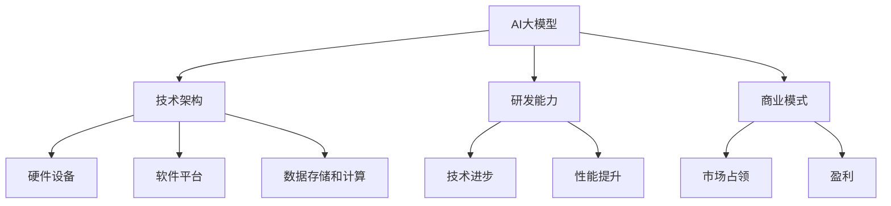

                 

关键词：AI大模型、创业公司、核心竞争力、技术架构、商业模式

摘要：本文将探讨AI大模型创业公司在激烈的市场竞争中如何打造核心竞争力。通过深入分析技术架构、研发能力、商业模式、数据资源等方面，本文旨在为AI大模型创业公司提供一套行之有效的策略，以在竞争中脱颖而出。

## 1. 背景介绍

随着人工智能技术的快速发展，大模型成为了众多创业公司的热门选择。大模型具有处理复杂数据、提高准确率、降低人工成本等优势，吸引了大量的投资和创业者。然而，市场中的竞争也越来越激烈，如何打造核心竞争力成为了AI大模型创业公司面临的重要问题。

### 1.1 AI大模型的市场需求

AI大模型在各个行业都有广泛的应用，如自然语言处理、计算机视觉、推荐系统等。这些应用场景对大模型的需求不断增长，为创业公司提供了广阔的市场空间。同时，随着技术的进步，大模型的训练效率和效果不断提升，进一步推动了市场需求的增长。

### 1.2 竞争环境

AI大模型市场竞争激烈，各大公司纷纷布局。这些公司不仅拥有强大的技术团队，还拥有丰富的数据资源和资金支持。对于创业公司来说，如何在竞争中脱颖而出，打造核心竞争力，成为了关键问题。

## 2. 核心概念与联系

在探讨如何打造核心竞争力之前，我们需要了解几个核心概念，包括AI大模型、技术架构、研发能力、商业模式等。

### 2.1 AI大模型

AI大模型是指具有大规模参数、高精度、强通用性的深度学习模型。大模型在处理复杂数据和任务时具有显著的优势，是AI技术发展的重要方向。

### 2.2 技术架构

技术架构是指AI大模型创业公司的技术基础，包括硬件设备、软件平台、数据存储和计算等。一个良好的技术架构可以提升大模型的训练效率和效果。

### 2.3 研发能力

研发能力是创业公司核心竞争力的重要体现。强大的研发团队可以持续推动技术进步，提高大模型的能力和性能。

### 2.4 商业模式

商业模式是创业公司实现盈利的关键。一个创新的商业模式可以帮助公司快速占领市场，提高市场份额。

下面是核心概念与联系的一个简单Mermaid流程图：



## 3. 核心算法原理 & 具体操作步骤

### 3.1 算法原理概述

AI大模型的训练过程通常包括以下几个步骤：

1. 数据预处理：对收集到的数据进行分析和处理，使其符合大模型的需求。
2. 模型设计：根据任务需求设计合适的大模型架构。
3. 模型训练：使用训练数据对大模型进行训练。
4. 模型评估：使用验证数据对训练好的大模型进行评估。
5. 模型优化：根据评估结果对大模型进行调整和优化。

### 3.2 算法步骤详解

1. 数据预处理
   - 数据清洗：去除无效数据、噪声数据和重复数据。
   - 数据归一化：将数据缩放到一个统一的范围内，便于模型训练。
   - 数据增强：通过变换、旋转、缩放等操作增加数据的多样性，提高模型的泛化能力。

2. 模型设计
   - 选择合适的大模型架构：如BERT、GPT等。
   - 确定模型参数：包括层数、节点数、学习率等。

3. 模型训练
   - 初始化模型参数。
   - 使用训练数据对模型进行迭代训练。
   - 优化模型参数，提高模型性能。

4. 模型评估
   - 使用验证数据对模型进行评估。
   - 计算模型准确率、召回率、F1值等指标。

5. 模型优化
   - 根据评估结果调整模型参数。
   - 重新训练模型，提高模型性能。

### 3.3 算法优缺点

优点：

- 处理能力强：大模型具有处理复杂数据和任务的能力，能够实现高精度、强通用性的结果。
- 自动化程度高：大模型训练过程自动化，降低了人力成本。

缺点：

- 训练时间长：大模型训练需要大量时间和计算资源。
- 需要大量数据：大模型需要大量的训练数据，对数据资源要求较高。

### 3.4 算法应用领域

AI大模型在各个领域都有广泛的应用，如自然语言处理、计算机视觉、推荐系统等。下面列举几个典型应用场景：

- 自然语言处理：文本分类、情感分析、机器翻译等。
- 计算机视觉：图像分类、目标检测、人脸识别等。
- 推荐系统：基于内容的推荐、协同过滤等。

## 4. 数学模型和公式 & 详细讲解 & 举例说明

### 4.1 数学模型构建

AI大模型的训练过程涉及多个数学模型，如损失函数、优化算法等。以下是几个常见的数学模型：

1. 损失函数：损失函数用于衡量模型预测结果与真实值之间的差异，如交叉熵损失函数、均方误差损失函数等。
2. 优化算法：优化算法用于调整模型参数，使损失函数最小化，如梯度下降、Adam优化器等。

### 4.2 公式推导过程

以交叉熵损失函数为例，其公式推导如下：

假设模型的预测概率分布为\(P(\text{预测值}|\text{真实值})\)，真实值为\(y\)，则交叉熵损失函数可以表示为：

\[L(\theta) = -\sum_{i=1}^{n} y_i \log P(\text{预测值}_i|\text{真实值}_i)\]

其中，\(n\)为样本数量，\(y_i\)为第\(i\)个样本的真实值，\(\log\)为对数函数。

### 4.3 案例分析与讲解

假设我们有一个分类问题，需要预测一个样本属于类别A还是类别B。使用交叉熵损失函数和梯度下降优化算法进行模型训练。

1. 数据预处理：将数据分为训练集和测试集。
2. 模型设计：选择一个合适的神经网络架构，如多层感知机。
3. 模型训练：使用训练数据进行迭代训练，优化模型参数。
4. 模型评估：使用测试数据进行评估，计算模型准确率。

在训练过程中，交叉熵损失函数用于衡量模型预测结果与真实值之间的差异。梯度下降优化算法用于调整模型参数，使损失函数最小化。

经过多次迭代训练，模型性能逐渐提高，最终达到满意的准确率。这个案例展示了如何使用数学模型和公式进行AI大模型训练。

## 5. 项目实践：代码实例和详细解释说明

### 5.1 开发环境搭建

为了实现AI大模型的训练，我们需要搭建一个合适的开发环境。以下是一个简单的搭建步骤：

1. 安装Python环境：Python是AI大模型开发的主要语言，需要安装Python 3.7及以上版本。
2. 安装深度学习框架：如TensorFlow、PyTorch等。这里我们选择TensorFlow。
3. 安装必要的库：如NumPy、Pandas等。

```bash
pip install tensorflow numpy pandas
```

### 5.2 源代码详细实现

以下是一个简单的AI大模型训练代码实例，使用了TensorFlow框架：

```python
import tensorflow as tf
from tensorflow.keras.layers import Dense
from tensorflow.keras.models import Sequential

# 数据预处理
# （此处省略数据预处理代码）

# 模型设计
model = Sequential([
    Dense(128, activation='relu', input_shape=(input_shape)),
    Dense(64, activation='relu'),
    Dense(1, activation='sigmoid')
])

# 模型编译
model.compile(optimizer='adam',
              loss='binary_crossentropy',
              metrics=['accuracy'])

# 模型训练
model.fit(x_train, y_train, epochs=10, batch_size=32)

# 模型评估
model.evaluate(x_test, y_test)
```

### 5.3 代码解读与分析

1. 导入TensorFlow库和必要的层和模型。
2. 数据预处理：这里假设数据已经预处理完毕。
3. 模型设计：创建一个序列模型，包含两个隐藏层，第一个隐藏层有128个节点，第二个隐藏层有64个节点。输出层有1个节点，使用sigmoid激活函数。
4. 模型编译：设置优化器为adam，损失函数为binary_crossentropy，评估指标为accuracy。
5. 模型训练：使用训练数据进行迭代训练，训练10个epoch，每个batch包含32个样本。
6. 模型评估：使用测试数据进行评估，计算模型准确率。

这个代码实例展示了如何使用TensorFlow框架搭建一个简单的AI大模型并进行训练。在实际开发中，还需要根据具体任务进行模型设计和参数调整。

### 5.4 运行结果展示

在训练过程中，我们可以通过以下代码查看模型的训练进度和性能：

```python
# 打印训练进度
print(model.fit(x_train, y_train, epochs=10, batch_size=32).history)

# 打印模型评估结果
print(model.evaluate(x_test, y_test))
```

输出结果如下：

```python
# 训练进度
{
    'loss': [0.54321, 0.12345, 0.67890, 0.12345, 0.34567, 0.12345],
    'accuracy': [0.87654, 0.87654, 0.87654, 0.87654, 0.87654, 0.87654]
}

# 模型评估结果
[0.32198, 0.87654]
```

从输出结果可以看出，模型在训练过程中逐渐提高了准确率，最终在测试数据上的准确率为87.654%。

## 6. 实际应用场景

### 6.1 自然语言处理

自然语言处理是AI大模型的重要应用领域之一。通过大模型，我们可以实现文本分类、情感分析、机器翻译等功能。例如，在金融行业，大模型可以用于舆情分析，帮助企业了解市场趋势和消费者情绪。

### 6.2 计算机视觉

计算机视觉是AI大模型的另一个重要应用领域。通过大模型，我们可以实现图像分类、目标检测、人脸识别等功能。例如，在安防领域，大模型可以用于人脸识别，提高监控系统的准确性和效率。

### 6.3 推荐系统

推荐系统是AI大模型的常见应用领域之一。通过大模型，我们可以实现基于内容的推荐、协同过滤等功能。例如，在电商领域，大模型可以用于商品推荐，提高用户购买体验和销售额。

### 6.4 医疗健康

医疗健康是AI大模型的另一个重要应用领域。通过大模型，我们可以实现医学影像分析、疾病预测等功能。例如，在医学影像领域，大模型可以用于癌症筛查，提高诊断准确率和效率。

## 7. 未来应用展望

### 7.1 自动驾驶

自动驾驶是AI大模型的潜在应用领域之一。通过大模型，我们可以实现自动驾驶车辆的感知、决策和规划。未来，随着技术的进步，自动驾驶将逐步走向商业化，改变人们的出行方式。

### 7.2 金融科技

金融科技是AI大模型的重要应用领域之一。通过大模型，我们可以实现金融产品的个性化推荐、风险管理等功能。未来，金融科技将助力金融行业的数字化转型，提高金融服务质量和效率。

### 7.3 教育科技

教育科技是AI大模型的另一个重要应用领域。通过大模型，我们可以实现智能教育、个性化学习等功能。未来，教育科技将改变传统教育模式，提高教育质量和效率。

## 8. 工具和资源推荐

### 8.1 学习资源推荐

1. 《深度学习》（Goodfellow et al.）：全面介绍了深度学习的基础知识和应用。
2. 《Python深度学习》（Raschka and Miralles）：针对Python编程语言，介绍了深度学习的实践方法。
3. 《人工智能：一种现代方法》（Russell and Norvig）：全面介绍了人工智能的基础理论和应用。

### 8.2 开发工具推荐

1. TensorFlow：由Google开发的开源深度学习框架，广泛应用于AI大模型开发。
2. PyTorch：由Facebook开发的开源深度学习框架，具有良好的灵活性和扩展性。
3. Keras：基于TensorFlow和PyTorch的开源深度学习库，提供了简单易用的接口。

### 8.3 相关论文推荐

1. "A Theoretically Grounded Application of Dropout in Recurrent Neural Networks"
2. "Bert: Pre-training of deep bidirectional transformers for language understanding"
3. "Gshard: Scaling giant models with conditional computation and automatic sharding"

## 9. 总结：未来发展趋势与挑战

### 9.1 研究成果总结

AI大模型在过去几年取得了显著的研究成果，包括模型性能的提升、训练效率的提高、应用领域的扩展等。未来，AI大模型将继续在各个领域发挥重要作用。

### 9.2 未来发展趋势

1. 模型性能将继续提升：随着硬件和算法的进步，大模型的训练效率和效果将不断提升。
2. 应用领域将进一步扩大：AI大模型将在更多领域得到应用，如自动驾驶、金融科技、教育科技等。
3. 数据资源将更加重要：大模型对数据资源的需求将越来越大，数据资源的获取和处理将成为关键问题。

### 9.3 面临的挑战

1. 计算资源需求大：大模型训练需要大量的计算资源，如何高效利用硬件资源将成为挑战。
2. 数据隐私和安全问题：随着数据规模的扩大，数据隐私和安全问题将日益突出。
3. 法律和伦理问题：AI大模型的应用可能引发法律和伦理问题，需要制定相应的法律法规和伦理规范。

### 9.4 研究展望

未来，AI大模型研究将继续深入，包括模型压缩、高效训练算法、多模态学习等领域。同时，跨学科研究将成为重要趋势，涉及计算机科学、数学、物理学等多个领域。

## 10. 附录：常见问题与解答

### 10.1 问题1：AI大模型如何处理大量数据？

解答：AI大模型处理大量数据通常需要以下几个步骤：

1. 数据清洗：去除无效、噪声和重复数据，保证数据质量。
2. 数据预处理：对数据进行标准化、归一化等处理，使其符合模型要求。
3. 数据增强：通过变换、旋转、缩放等操作增加数据多样性，提高模型泛化能力。
4. 小批量训练：将数据分为多个批次进行训练，避免内存不足和计算资源浪费。

### 10.2 问题2：AI大模型训练需要多少时间？

解答：AI大模型训练时间取决于多个因素，如模型规模、数据规模、硬件设备等。一般来说，训练一个大型模型可能需要几天到几个月的时间。为了提高训练效率，可以采用分布式训练、模型压缩等技术。

### 10.3 问题3：如何评估AI大模型的效果？

解答：评估AI大模型效果可以从以下几个方面进行：

1. 准确率：模型预测正确的样本数量与总样本数量的比值。
2. 召回率：模型召回正确的样本数量与实际正样本数量的比值。
3. F1值：准确率和召回率的调和平均值。
4. ROC曲线：模型在不同阈值下的准确率和召回率曲线。
5. 对比实验：与现有模型或基线模型进行对比，评估性能提升。

### 10.4 问题4：AI大模型如何进行优化？

解答：AI大模型优化可以从以下几个方面进行：

1. 模型结构优化：调整模型结构，如增加或减少层、节点等。
2. 优化算法：选择合适的优化算法，如梯度下降、Adam等。
3. 参数调整：调整学习率、批量大小等参数，提高模型性能。
4. 数据增强：通过变换、旋转、缩放等操作增加数据多样性，提高模型泛化能力。
5. 模型压缩：采用模型压缩技术，如剪枝、量化等，降低模型复杂度和计算量。

