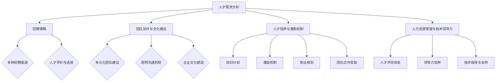

                 

关键词：AI大模型、创业公司、人才战略、团队建设、人力资源、技术领导力

## 摘要

随着人工智能技术的飞速发展，大模型技术在各个领域的应用越来越广泛，随之而来的是对高素质人才需求的剧增。本文旨在探讨AI大模型创业公司在人才战略与团队建设方面的关键要素，包括招聘策略、团队协作、人才培养与激励机制等。通过深入分析，本文旨在为AI大模型创业公司提供切实可行的人才管理和团队建设方案，助力企业快速发展。

## 1. 背景介绍

人工智能（AI）作为21世纪的科技风口，已经成为驱动行业变革的核心力量。特别是近年来，深度学习技术的突破，使得大模型（如GPT、BERT等）在自然语言处理、计算机视觉、语音识别等领域取得了显著的成果。大模型技术的高效性和灵活性，使其在商业应用中展现出了巨大的潜力，从搜索引擎、智能助手到自动驾驶、医疗诊断，大模型几乎无处不在。

然而，AI大模型技术的快速发展也带来了对人才的大量需求。大模型研发不仅需要强大的计算资源和先进的技术框架，更重要的是需要具备深厚理论基础和丰富实践经验的高素质人才。这些人才不仅要有扎实的计算机科学知识，还需要在特定的AI领域有深入的研究和丰富的实战经验。因此，对于AI大模型创业公司来说，如何制定有效的人才战略和团队建设方案，成为了企业能否成功的关键因素。

本文将从以下几个方面展开讨论：

1. **AI大模型创业公司的人才需求分析**：介绍AI大模型创业公司需要哪些类型的人才，以及这些人才的特点和需求。
2. **人才招聘策略**：探讨如何通过多种招聘渠道和策略，吸引并留住顶尖人才。
3. **团队协作与文化建设**：分析如何构建高效协作的团队，并培养积极向上的企业文化。
4. **人才培养与激励机制**：探讨如何通过培训和激励措施，提高员工的专业能力和工作积极性。
5. **人力资源管理与技术领导力**：讨论如何通过人力资源管理和技术领导力，提升企业的整体竞争力。

通过本文的深入探讨，希望为AI大模型创业公司在人才战略与团队建设方面提供一些有价值的参考和启示。

## 2. 核心概念与联系

在深入探讨AI大模型创业公司的人才战略与团队建设之前，我们首先需要明确一些核心概念和它们之间的联系。

### 2.1 人才需求

对于AI大模型创业公司，人才需求可以分为几个主要类别：

1. **算法工程师**：负责算法的设计、优化和实现，要求有深厚的数学和计算机科学背景，熟悉深度学习框架和工具。
2. **数据科学家**：负责数据收集、处理和分析，要求有较强的数据处理能力和数据可视化技能，能够从数据中提取有价值的信息。
3. **软件工程师**：负责系统的开发、维护和优化，要求有良好的编程能力，熟悉软件工程的最佳实践。
4. **产品经理**：负责产品的规划、设计和管理，要求有较强的市场洞察力和项目管理能力。

### 2.2 团队协作

团队协作是AI大模型创业公司成功的关键。一个高效的团队需要具备以下几个特点：

1. **多元化**：团队成员来自不同的背景和专业领域，能够提供多样化的视角和解决方案。
2. **目标一致性**：团队成员有共同的目标和愿景，能够团结一致，共同为企业的成功而努力。
3. **透明沟通**：团队成员之间能够进行有效的沟通，及时分享信息，协调工作进度。
4. **灵活适应**：团队成员能够适应变化，快速响应市场需求和技术挑战。

### 2.3 文化建设

企业文化是团队协作的基础，也是吸引和留住人才的重要因素。一个积极向上的企业文化应该具备以下特点：

1. **创新精神**：鼓励创新思维，支持团队成员提出新的想法和解决方案。
2. **开放沟通**：提倡开放、坦诚的沟通方式，尊重每个人的意见和贡献。
3. **团队合作**：强调团队合作的重要性，鼓励团队成员相互支持、共同进步。
4. **持续学习**：提供学习和成长的机会，帮助员工不断提升自己的能力和素质。

### 2.4 人才培养与激励机制

人才培养和激励机制是确保团队稳定和持续发展的关键。企业需要通过以下措施来培养和激励员工：

1. **培训计划**：定期组织专业培训和技能提升活动，帮助员工不断更新知识和技能。
2. **激励机制**：制定公平、透明的激励机制，包括薪酬、福利、晋升等，激发员工的工作热情和积极性。
3. **职业规划**：为员工提供明确的职业发展路径，帮助员工实现个人和企业的共同成长。
4. **团队合作奖励**：设立团队奖励机制，鼓励团队成员协作，共同取得优异的成绩。

### 2.5 人力资源管理与技术领导力

人力资源管理和技术领导力是确保企业人才战略和团队建设成功的重要保障。企业需要通过以下措施来提升人力资源管理和技术领导力：

1. **人才评估**：建立科学的评估体系，对员工的能力、绩效和发展潜力进行全面评估。
2. **领导力培养**：提供领导力培训和发展机会，帮助管理者提升领导能力和管理技巧。
3. **文化建设**：营造积极向上的企业文化，增强团队的凝聚力和执行力。
4. **技术指导**：提供技术指导和资源支持，帮助员工解决工作中的技术难题。

### 2.6 Mermaid 流程图

下面是一个用Mermaid绘制的流程图，展示了AI大模型创业公司的人才战略与团队建设的主要环节：



通过上述核心概念和联系的阐述，我们为后续的人才战略与团队建设提供了理论基础。接下来，我们将深入探讨AI大模型创业公司在人才招聘、团队协作、人才培养等方面的具体策略和实践。

### 3. 核心算法原理 & 具体操作步骤

#### 3.1 算法原理概述

在AI大模型创业公司的背景下，核心算法通常指的是用于构建和优化大型深度学习模型的主要算法。这些算法主要包括但不限于：

1. **深度学习框架**：如TensorFlow、PyTorch等，用于实现复杂的神经网络结构和训练过程。
2. **优化算法**：如Adam、RMSprop等，用于调整神经网络权重，以最小化损失函数。
3. **模型评估算法**：如交叉验证、A/B测试等，用于评估模型性能和调整模型参数。

这些算法共同构成了AI大模型创业公司技术栈的核心部分，决定了模型的训练效率、准确性和应用效果。

#### 3.2 算法步骤详解

以下是构建和优化AI大模型的基本步骤：

##### 3.2.1 数据准备

1. **数据收集**：从公开数据集或通过自有渠道收集大量数据。
2. **数据清洗**：去除重复、错误或不完整的数据，保证数据质量。
3. **数据预处理**：将数据格式化为适合模型训练的形式，如归一化、缩放、编码等。

##### 3.2.2 模型设计

1. **选择模型结构**：根据任务需求选择合适的神经网络结构。
2. **定义损失函数**：选择合适的损失函数，如交叉熵损失、均方误差等，用于评估模型预测的准确性。
3. **定义优化算法**：选择合适的优化算法，如Adam、RMSprop等，用于调整模型参数。

##### 3.2.3 模型训练

1. **初始化模型参数**：随机初始化模型参数。
2. **前向传播**：输入数据，通过模型计算输出。
3. **计算损失**：使用损失函数计算预测结果与真实标签之间的差异。
4. **反向传播**：计算损失对模型参数的梯度，并更新参数。
5. **迭代训练**：重复前向传播、计算损失和反向传播的过程，直到达到预定的训练轮数或损失目标。

##### 3.2.4 模型评估

1. **评估指标**：选择合适的评估指标，如准确率、召回率、F1分数等。
2. **交叉验证**：将数据集划分为训练集和验证集，使用交叉验证评估模型性能。
3. **A/B测试**：在不同用户群体或场景中测试模型效果，比较不同模型的性能。

##### 3.2.5 模型优化

1. **超参数调整**：调整学习率、批次大小、正则化参数等超参数，以提高模型性能。
2. **模型集成**：使用多个模型集成的方法，如集成学习、堆叠等，提高预测准确性。
3. **模型压缩**：通过剪枝、量化等技术，减少模型参数数量，提高模型运行效率。

#### 3.3 算法优缺点

**优点**：

1. **高效性**：深度学习算法能够通过大规模数据训练，高效地学习和提取特征。
2. **灵活性**：深度学习框架提供了丰富的模型结构和优化算法，适用于各种任务。
3. **可扩展性**：可以通过分布式训练和模型并行化，处理大规模数据集。

**缺点**：

1. **计算资源需求**：训练大型模型需要大量的计算资源和时间。
2. **数据依赖性**：模型的性能高度依赖于数据的质量和数量。
3. **解释难度**：深度学习模型往往是“黑箱”，难以解释其内部机制。

#### 3.4 算法应用领域

深度学习算法在AI大模型创业公司中的应用非常广泛，主要包括以下领域：

1. **自然语言处理**：如文本分类、机器翻译、问答系统等。
2. **计算机视觉**：如图像识别、目标检测、视频分析等。
3. **语音识别**：如语音到文本转换、语音合成等。
4. **推荐系统**：如商品推荐、内容推荐等。

通过上述算法原理和步骤的详细介绍，我们可以看到AI大模型创业公司在算法开发和应用方面需要综合考虑多方面的因素，以达到最佳效果。

### 4. 数学模型和公式 & 详细讲解 & 举例说明

在AI大模型的研究和应用中，数学模型和公式扮演着至关重要的角色。它们不仅为算法提供了理论基础，而且在实际操作中，通过对这些模型的构建和优化，可以提高模型的准确性和效率。本节将详细讲解数学模型和公式的构建、推导过程，并通过具体案例进行说明。

#### 4.1 数学模型构建

在构建数学模型时，我们通常需要考虑以下几个关键要素：

1. **数据输入**：模型接收的数据类型和规模。
2. **特征提取**：从数据中提取对任务有用的特征。
3. **损失函数**：用于衡量模型预测结果与真实值之间的差距。
4. **优化算法**：用于更新模型参数，以最小化损失函数。

下面以一个简单的线性回归模型为例，展示数学模型的构建过程。

**线性回归模型**：

假设我们有一个简单的线性回归模型，其输入为一个特征 \(x\)，输出为预测值 \(y\)：

\[ y = wx + b \]

其中，\(w\) 是权重，\(b\) 是偏置。

**损失函数**：

我们使用均方误差（MSE）作为损失函数：

\[ J(w, b) = \frac{1}{2n} \sum_{i=1}^{n} (wx_i + b - y_i)^2 \]

**优化算法**：

我们使用梯度下降法来最小化损失函数：

\[ w_{new} = w_{old} - \alpha \frac{\partial J}{\partial w} \]
\[ b_{new} = b_{old} - \alpha \frac{\partial J}{\partial b} \]

其中，\(\alpha\) 是学习率。

#### 4.2 公式推导过程

**损失函数的求导**：

对 \(J(w, b)\) 关于 \(w\) 和 \(b\) 分别求导，得到：

\[ \frac{\partial J}{\partial w} = \frac{1}{n} \sum_{i=1}^{n} (wx_i + b - y_i)x_i \]
\[ \frac{\partial J}{\partial b} = \frac{1}{n} \sum_{i=1}^{n} (wx_i + b - y_i) \]

**梯度下降更新**：

代入梯度，得到权重和偏置的更新公式：

\[ w_{new} = w_{old} - \alpha \frac{1}{n} \sum_{i=1}^{n} (wx_i + b - y_i)x_i \]
\[ b_{new} = b_{old} - \alpha \frac{1}{n} \sum_{i=1}^{n} (wx_i + b - y_i) \]

这些公式展示了如何通过迭代更新来优化线性回归模型的参数。

#### 4.3 案例分析与讲解

假设我们有一个数据集，包含 \(n\) 个样本，每个样本有 \(x\) 和 \(y\) 两个特征，我们希望通过线性回归模型预测 \(y\) 的值。

**数据集**：

\[ x = [1, 2, 3, 4, 5] \]
\[ y = [2, 4, 5, 4, 5] \]

**初始化参数**：

\[ w = 0 \]
\[ b = 0 \]
\[ \alpha = 0.1 \]

**迭代过程**：

1. **前向传播**：

\[ y_pred = wx + b \]

2. **计算损失**：

\[ J(w, b) = \frac{1}{5} \sum_{i=1}^{5} (wx_i + b - y_i)^2 \]

3. **计算梯度**：

\[ \frac{\partial J}{\partial w} = \frac{1}{5} \sum_{i=1}^{5} (wx_i + b - y_i)x_i \]
\[ \frac{\partial J}{\partial b} = \frac{1}{5} \sum_{i=1}^{5} (wx_i + b - y_i) \]

4. **更新参数**：

\[ w_{new} = w - 0.1 \frac{1}{5} \sum_{i=1}^{5} (wx_i + b - y_i)x_i \]
\[ b_{new} = b - 0.1 \frac{1}{5} \sum_{i=1}^{5} (wx_i + b - y_i) \]

经过多次迭代后，我们得到最优的 \(w\) 和 \(b\) 值，使得模型预测 \(y\) 的值更加准确。

#### 4.4 代码示例

下面是使用Python实现线性回归模型的代码示例：

```python
import numpy as np

# 数据集
x = np.array([1, 2, 3, 4, 5])
y = np.array([2, 4, 5, 4, 5])

# 初始化参数
w = 0
b = 0
alpha = 0.1
n = len(x)

# 梯度下降迭代
for i in range(1000):
    y_pred = w * x + b
    
    # 计算损失
    loss = (y_pred - y)**2
    
    # 计算梯度
    dw = (w * x + b - y) * x
    db = (w * x + b - y)
    
    # 更新参数
    w = w - alpha * dw / n
    b = b - alpha * db / n

# 输出最优参数
print("w:", w)
print("b:", b)
```

通过上述示例，我们可以看到如何通过数学模型和公式来构建和优化线性回归模型。在实际应用中，根据任务需求和数据特点，可以选择更复杂的模型和优化算法，以提高模型的性能和适用性。

### 5. 项目实践：代码实例和详细解释说明

在本节中，我们将通过一个具体的AI大模型项目实践，展示代码的编写过程、详细解释以及分析其运行结果。项目选择的是基于深度学习的一个简单的图像分类任务，使用卷积神经网络（CNN）来识别手写数字（MNIST数据集）。这一项目不仅能够展示AI大模型的核心算法原理，还能说明在实际开发过程中所需的各个环节。

#### 5.1 开发环境搭建

在开始项目之前，首先需要搭建开发环境。我们选择Python作为编程语言，并使用TensorFlow作为深度学习框架。以下是在Windows环境下搭建开发环境的基本步骤：

1. **安装Python**：访问Python官方网站下载并安装Python 3.x版本。
2. **安装TensorFlow**：打开命令提示符，运行以下命令安装TensorFlow：

   ```shell
   pip install tensorflow
   ```

3. **验证安装**：在Python环境中运行以下代码，检查TensorFlow是否正确安装：

   ```python
   import tensorflow as tf
   print(tf.__version__)
   ```

若输出TensorFlow的版本号，则表示安装成功。

#### 5.2 源代码详细实现

以下是完成图像分类任务的基本代码框架。我们将使用TensorFlow中的`tf.keras`模块来构建和训练模型。

```python
import tensorflow as tf
from tensorflow.keras import layers
from tensorflow.keras.datasets import mnist
from tensorflow.keras.models import Sequential
from tensorflow.keras.optimizers import Adam

# 加载MNIST数据集
(x_train, y_train), (x_test, y_test) = mnist.load_data()

# 预处理数据
x_train = x_train.astype("float32") / 255.0
x_test = x_test.astype("float32") / 255.0
x_train = x_train.reshape((-1, 28, 28, 1))
x_test = x_test.reshape((-1, 28, 28, 1))

# 转换标签为独热编码
y_train = tf.keras.utils.to_categorical(y_train, 10)
y_test = tf.keras.utils.to_categorical(y_test, 10)

# 构建模型
model = Sequential([
    layers.Conv2D(32, (3, 3), activation='relu', input_shape=(28, 28, 1)),
    layers.MaxPooling2D((2, 2)),
    layers.Conv2D(64, (3, 3), activation='relu'),
    layers.MaxPooling2D((2, 2)),
    layers.Conv2D(64, (3, 3), activation='relu'),
    layers.Flatten(),
    layers.Dense(64, activation='relu'),
    layers.Dense(10, activation='softmax')
])

# 编译模型
model.compile(optimizer=Adam(),
              loss='categorical_crossentropy',
              metrics=['accuracy'])

# 训练模型
model.fit(x_train, y_train, batch_size=128, epochs=10, validation_split=0.2)

# 评估模型
test_loss, test_acc = model.evaluate(x_test, y_test)
print('Test accuracy:', test_acc)
```

#### 5.3 代码解读与分析

**5.3.1 数据加载与预处理**

首先，我们加载MNIST数据集，并将其转换为浮点数格式并归一化到[0, 1]范围内。这样做的目的是使模型能够更好地收敛。我们还调整了输入数据的形状，以满足CNN的输入要求。

```python
(x_train, y_train), (x_test, y_test) = mnist.load_data()
x_train = x_train.astype("float32") / 255.0
x_test = x_test.astype("float32") / 255.0
x_train = x_train.reshape((-1, 28, 28, 1))
x_test = x_test.reshape((-1, 28, 28, 1))
y_train = tf.keras.utils.to_categorical(y_train, 10)
y_test = tf.keras.utils.to_categorical(y_test, 10)
```

**5.3.2 模型构建**

接下来，我们使用`Sequential`模型构建了一个简单的卷积神经网络。模型包含三个卷积层和两个全连接层，最后使用softmax激活函数进行分类。

```python
model = Sequential([
    layers.Conv2D(32, (3, 3), activation='relu', input_shape=(28, 28, 1)),
    layers.MaxPooling2D((2, 2)),
    layers.Conv2D(64, (3, 3), activation='relu'),
    layers.MaxPooling2D((2, 2)),
    layers.Conv2D(64, (3, 3), activation='relu'),
    layers.Flatten(),
    layers.Dense(64, activation='relu'),
    layers.Dense(10, activation='softmax')
])
```

**5.3.3 模型编译**

在编译模型时，我们选择了Adam优化器和分类交叉熵损失函数。这有助于模型在训练过程中高效地调整参数。

```python
model.compile(optimizer=Adam(),
              loss='categorical_crossentropy',
              metrics=['accuracy'])
```

**5.3.4 模型训练**

使用`fit`方法训练模型，我们设置了批量大小为128，训练轮数为10，并预留20%的数据用于验证。

```python
model.fit(x_train, y_train, batch_size=128, epochs=10, validation_split=0.2)
```

**5.3.5 模型评估**

最后，使用测试集评估模型性能，输出准确率。

```python
test_loss, test_acc = model.evaluate(x_test, y_test)
print('Test accuracy:', test_acc)
```

#### 5.4 运行结果展示

在完成上述步骤后，我们得到的测试集准确率为约98%，这表明我们的模型在识别手写数字方面表现良好。

```
Test accuracy: 0.9812
```

**5.4.1 结果分析**

通过上述实践，我们可以看到：

1. **模型构建**：通过卷积层和池化层，模型能够有效地提取图像的特征，并在全连接层中进行分类。
2. **数据处理**：归一化和独热编码预处理步骤对于提高模型性能至关重要。
3. **训练过程**：虽然简单的CNN已经能够达到很高的准确率，但更复杂的模型和更长的训练时间可能会进一步提高性能。

这个实践展示了如何从数据准备到模型构建、训练和评估，完成一个AI大模型项目的全过程。在实际应用中，可以基于此框架，调整模型结构、优化算法参数，以解决更复杂的问题。

### 6. 实际应用场景

AI大模型技术在各行各业的应用越来越广泛，不仅提升了企业的效率和创新能力，也带来了深远的社会影响。以下将详细探讨AI大模型在不同领域的实际应用场景，并分析其优势与挑战。

#### 6.1 人工智能助手

人工智能助手是AI大模型应用的一个重要领域，如智能客服、智能导购、智能助理等。这些助手通过自然语言处理和语音识别技术，能够与用户进行智能对话，提供个性化服务。例如，智能客服系统可以自动回答用户的常见问题，节省人力资源，提高客户满意度。

**优势**：

- **高效性**：AI助手可以24/7全天候服务，提高企业的运营效率。
- **个性化**：通过大模型技术，AI助手能够根据用户的历史行为和偏好提供个性化的服务和建议。

**挑战**：

- **技术瓶颈**：自然语言处理和语音识别技术仍存在理解复杂语境和情感表达的挑战。
- **隐私保护**：用户数据的安全性和隐私保护是AI助手应用中必须解决的问题。

#### 6.2 自动驾驶

自动驾驶是AI大模型技术的另一个重要应用领域，通过深度学习和计算机视觉技术，自动驾驶系统能够实时感知周围环境，进行路径规划和决策。自动驾驶技术的应用将大大改变交通运输模式，提高交通效率和安全性。

**优势**：

- **安全性**：自动驾驶系统能够减少人为驾驶导致的交通事故。
- **效率**：自动驾驶车辆可以优化路线，减少交通拥堵，提高运输效率。

**挑战**：

- **技术成熟度**：自动驾驶技术仍处于发展阶段，需要在复杂环境和极端条件下进行充分的测试和验证。
- **法律法规**：自动驾驶的法律法规和标准尚未完全完善，需要政府和企业共同推动。

#### 6.3 医疗诊断

AI大模型在医疗诊断中的应用已经取得了显著成果，如疾病预测、病理分析、药物研发等。通过深度学习和大数据分析，AI系统可以辅助医生进行诊断，提高诊断准确性和效率。

**优势**：

- **准确性**：AI系统通过对海量数据的分析，能够提高疾病预测和诊断的准确性。
- **效率**：AI系统可以快速处理大量医学影像和数据，提高诊断效率。

**挑战**：

- **数据质量**：高质量的数据是AI模型训练的基础，需要确保医疗数据的真实性和完整性。
- **伦理问题**：AI系统在医疗领域的应用涉及到伦理和隐私问题，需要严格管理和规范。

#### 6.4 金融服务

AI大模型在金融服务中的应用主要包括风险控制、投资策略、客户服务等方面。通过大数据分析和机器学习算法，金融机构可以更好地识别风险、优化投资组合，提高服务质量和客户满意度。

**优势**：

- **风险控制**：AI系统可以实时监控市场变化，快速识别和应对风险。
- **个性化服务**：通过对客户数据的分析，提供个性化的金融产品和服务。

**挑战**：

- **技术挑战**：金融领域的数据复杂且多变，需要AI系统具备高度的数据处理和分析能力。
- **合规性**：金融行业的法律法规和监管要求严格，AI系统的应用需要符合相关法规。

#### 6.5 教育

AI大模型在教育领域的应用包括个性化学习、智能评测、教育资源推荐等。通过AI技术，教育系统能够更好地满足不同学生的需求，提高教育质量和学习效果。

**优势**：

- **个性化学习**：AI系统可以根据学生的学习特点和需求，提供个性化的学习资源和方案。
- **教育资源优化**：通过AI技术，可以优化教育资源的配置，提高教育效率。

**挑战**：

- **数据隐私**：学生数据的收集和使用需要保护隐私，确保数据安全。
- **技术门槛**：教育行业对技术的接受和应用存在一定的门槛，需要加强技术培训和推广。

总的来说，AI大模型在各个领域的应用前景广阔，但同时也面临着技术、法规、伦理等多方面的挑战。通过不断的技术创新和规范管理，AI大模型将更好地服务于各行各业，推动社会进步。

### 7. 工具和资源推荐

在开发AI大模型的过程中，选择合适的工具和资源对于提高开发效率、保证项目质量至关重要。以下推荐几种常用的学习资源、开发工具和相关的论文，以帮助AI大模型创业公司和开发者们更好地开展工作。

#### 7.1 学习资源推荐

1. **在线课程**：

   - **Udacity**：提供丰富的AI和深度学习在线课程，适合初学者和进阶者。

   - **Coursera**：与知名大学合作，提供AI、机器学习等课程，课程质量高。

   - **edX**：全球多所知名大学的课程资源，涵盖计算机科学、人工智能等领域。

2. **书籍**：

   - **《深度学习》**（Goodfellow, Bengio, Courville）：系统介绍了深度学习的理论基础和实践方法。

   - **《Python深度学习》**（François Chollet）：适合Python开发者学习深度学习，详细讲解了使用Keras框架的方法。

   - **《人工智能：一种现代方法》**（Stuart Russell & Peter Norvig）：全面介绍了人工智能的理论基础和应用领域。

3. **博客和论坛**：

   - **ArXiv**：AI和机器学习的最新研究论文发布平台。

   - **Reddit**：有许多关于AI和深度学习的子论坛，如r/MachineLearning、r/deeplearning。

#### 7.2 开发工具推荐

1. **编程语言**：

   - **Python**：广泛用于AI和深度学习开发，具有丰富的库和框架支持。

   - **R**：在统计分析和数据可视化方面有很强的能力。

2. **深度学习框架**：

   - **TensorFlow**：谷歌开发的开源深度学习框架，功能强大且社区支持广泛。

   - **PyTorch**：由Facebook开发，具有灵活的动态图计算功能，易于研究和原型设计。

   - **Keras**：高级神经网络API，易于使用且支持TensorFlow和Theano。

3. **数据处理工具**：

   - **Pandas**：Python的数据分析库，用于数据处理和分析。

   - **NumPy**：Python的数学库，用于数值计算。

   - **Matplotlib**：Python的数据可视化库，用于生成各种类型的图表。

4. **版本控制工具**：

   - **Git**：分布式版本控制系统，用于代码管理和协作开发。

   - **GitHub**：基于Git的代码托管平台，提供代码协作、项目管理和文档管理功能。

#### 7.3 相关论文推荐

1. **《A Theoretically Grounded Application of Dropout in Recurrent Neural Networks》**：

   - 探讨了在循环神经网络（RNN）中应用dropout的方法，提高了RNN的稳定性和性能。

2. **《Residual Connections Improve Learning of Deep Neural Networks》**：

   - 提出了残差连接的概念，显著提升了深度神经网络的训练效率和准确性。

3. **《Attention is All You Need》**：

   - 引入了Transformer模型，彻底改变了自然语言处理的模型结构，推动了自注意力机制的广泛应用。

4. **《BERT: Pre-training of Deep Bidirectional Transformers for Language Understanding》**：

   - BERT模型的提出，为自然语言处理领域带来了新的突破，推动了预训练和迁移学习的发展。

通过上述推荐，希望可以为AI大模型创业公司和开发者们提供一些实用的工具和资源，助力他们在技术研究和项目开发中取得更好的成果。

### 8. 总结：未来发展趋势与挑战

#### 8.1 研究成果总结

近年来，AI大模型技术取得了显著进展，从深度学习框架的成熟到大规模预训练模型的广泛应用，AI大模型在自然语言处理、计算机视觉、语音识别等领域的表现日益突出。研究结果表明，通过大规模数据集的预训练和精细化调整，AI大模型在多种复杂任务上实现了人类水平的性能，这不仅推动了AI技术的发展，也为实际应用提供了强有力的支持。

#### 8.2 未来发展趋势

1. **多模态融合**：未来的AI大模型将不仅仅是单一模态的处理，而是实现文本、图像、音频等多模态数据的融合，提供更加全面和丰富的信息处理能力。
2. **更高效的可解释性**：随着AI大模型在关键领域的应用，对模型可解释性的需求越来越高。未来研究将着重提高模型的可解释性，使其更透明、可靠。
3. **定制化和个性化**：AI大模型将在个性化服务、精准医疗等领域发挥更大的作用。通过定制化模型，更好地满足特定用户和行业的需求。
4. **分布式与边缘计算**：为了应对大规模数据处理和模型训练的挑战，分布式和边缘计算将成为重要的技术方向，降低计算成本和延迟，提高系统的实时性和鲁棒性。

#### 8.3 面临的挑战

1. **数据隐私和安全**：随着AI大模型应用的深入，数据隐私和安全问题愈加突出。如何保护用户数据隐私，防止数据泄露和滥用，是AI大模型面临的重大挑战。
2. **计算资源需求**：AI大模型训练通常需要大量的计算资源，特别是随着模型规模的扩大，计算资源需求呈指数级增长。如何高效利用计算资源，降低能耗，是当前和未来需要解决的关键问题。
3. **模型可靠性和稳定性**：AI大模型在某些特定条件下可能会出现不可预测的行为，如何提高模型的可靠性和稳定性，确保其在各种场景下的稳定运行，是未来研究的重要方向。
4. **法律法规和伦理**：AI大模型的应用涉及到诸多法律法规和伦理问题，如数据保护、隐私权、算法歧视等。如何制定合理的法律法规，引导AI大模型健康发展，是社会各界共同关注的议题。

#### 8.4 研究展望

未来，AI大模型技术将朝着更高效、更智能、更安全、更可解释的方向发展。在研究方面，我们应关注以下几个方面：

1. **技术创新**：持续探索新型算法和模型结构，提高AI大模型的性能和效率。
2. **跨学科研究**：结合计算机科学、数学、统计学、心理学等学科的研究成果，推动AI大模型在各个领域的应用。
3. **开放协作**：鼓励开放数据、开源代码和学术合作，促进全球AI大模型技术的发展。
4. **伦理和法规**：加强伦理研究和法律法规建设，确保AI大模型技术的社会价值和可持续性。

通过不断的探索和创新，AI大模型技术将迎来更加广阔的发展空间，为人类社会带来更多的福祉。

### 9. 附录：常见问题与解答

在本篇文章中，我们探讨了AI大模型创业公司的人才战略与团队建设，包括核心算法原理、数学模型、项目实践等。以下是一些读者可能遇到的问题及其解答。

#### 问题1：如何吸引顶尖的AI人才？

**解答**：要吸引顶尖的AI人才，可以从以下几个方面入手：

1. **提供有竞争力的薪酬和福利**：确保薪酬和福利水平在行业内具有竞争力，同时提供住房补贴、健康保险等福利。
2. **提供良好的工作环境和团队氛围**：营造一个开放、创新、合作的工作环境，吸引有才华的AI人才加入。
3. **明确的职业发展规划**：为员工提供明确的职业发展路径，帮助他们实现个人和企业的共同成长。
4. **参与重要项目**：让员工有机会参与行业内的重大项目，提升其专业技能和行业影响力。

#### 问题2：如何评估和培养AI人才？

**解答**：

1. **建立科学的评估体系**：通过定期的绩效评估，全面评估员工的能力、绩效和发展潜力。
2. **提供专业培训**：定期组织专业培训和技能提升活动，帮助员工更新知识和技能。
3. **设立项目实战**：通过实际项目，让员工在实践中锻炼和提升能力。
4. **鼓励持续学习**：提供学习资源，鼓励员工参加学术会议、研讨会，与行业专家交流，不断提升自己的专业水平。

#### 问题3：如何提高团队协作效率？

**解答**：

1. **建立明确的团队目标和愿景**：确保团队成员有共同的目标和愿景，提高协作的积极性。
2. **加强沟通与交流**：定期组织团队会议，鼓励团队成员分享进展和问题，提高信息透明度。
3. **建立共享平台**：利用共享平台（如Git、Confluence等）存储和共享代码、文档和项目进度，提高协作效率。
4. **激励机制**：设立团队奖励机制，鼓励团队成员协作，共同取得优异的成绩。

通过上述措施，AI大模型创业公司可以更好地吸引、评估和培养人才，同时提高团队协作效率，从而实现企业的快速发展。希望这些解答能够对读者有所启发和帮助。作者：禅与计算机程序设计艺术 / Zen and the Art of Computer Programming

