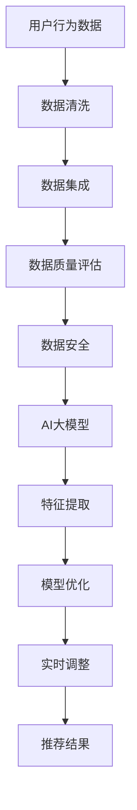

                 

在当今数字化时代，电子商务已成为消费者购物的主要方式，而搜索引擎和推荐系统作为电商平台的两大核心功能，对于提升用户体验和业务转化率起着至关重要的作用。其中，搜索推荐业务的数据治理能力直接影响着系统的精准度和效率。本文将探讨如何通过AI大模型来优化电商搜索推荐业务的数据治理能力评估体系，并详细描述实现方案。

> 关键词：AI大模型，电商搜索推荐，数据治理，评估体系，优化方案

> 摘要：本文从电商搜索推荐业务的数据治理能力出发，探讨了现有评估体系的局限性，并提出了一种基于AI大模型的优化方案。通过对核心概念、算法原理、数学模型、项目实践及实际应用场景的深入分析，本文旨在为电商搜索推荐系统的数据治理能力提升提供新的思路和方法。

## 1. 背景介绍

随着互联网的普及和电子商务的快速发展，消费者对于购物体验的要求越来越高，尤其是在个性化推荐和精准搜索方面。电商搜索引擎和推荐系统作为电商平台的核心功能，其性能和用户体验直接影响着平台的竞争力。然而，随着数据量的不断增长和数据种类的日益复杂，传统的数据治理方法逐渐暴露出其局限性。

传统的数据治理方法主要包括数据清洗、数据集成、数据质量和数据安全等方面。虽然这些方法在一定程度上提高了数据的质量，但无法满足电商搜索推荐业务对于大规模、多样化数据的高效处理需求。此外，传统的评估体系往往依赖于人为设定的指标，缺乏对业务场景的深度理解和动态适应能力。

为了解决这些问题，AI大模型应运而生。AI大模型通过深度学习和大数据技术，能够从海量数据中提取出有价值的特征，并自动优化数据治理策略，从而提升系统的整体性能和用户体验。

## 2. 核心概念与联系

在讨论AI大模型助力电商搜索推荐业务的数据治理能力评估体系之前，我们需要明确几个核心概念：

### 2.1 数据治理

数据治理是指通过制定和执行有效的数据管理和策略，确保数据的准确性、完整性、一致性和安全性。在电商搜索推荐业务中，数据治理主要包括以下方面：

- **数据清洗**：去除重复数据、纠正错误数据和填补缺失数据，以保证数据的准确性。
- **数据集成**：将来自不同来源和格式的数据整合到一个统一的系统中，提高数据的可用性。
- **数据质量**：评估数据的质量，确保数据能够满足业务需求。
- **数据安全**：保护数据免受未经授权的访问和泄露，确保数据的安全。

### 2.2 评估体系

评估体系是指一套用于衡量数据治理效果的指标和方法。在电商搜索推荐业务中，评估体系主要包括以下方面：

- **准确性**：推荐结果的准确性，即推荐物品是否与用户兴趣相符。
- **多样性**：推荐结果的多样性，即推荐物品是否涵盖了用户可能感兴趣的多种类型。
- **覆盖度**：推荐结果的覆盖度，即推荐物品是否覆盖了所有可能的用户兴趣点。
- **实时性**：推荐系统的响应速度，即系统能否及时响应用户的行为和需求。

### 2.3 AI大模型

AI大模型是指通过深度学习和大数据技术训练的大型神经网络模型，能够处理大规模、高维度的数据，并自动提取数据中的有价值特征。在电商搜索推荐业务中，AI大模型主要用于：

- **特征提取**：从用户行为数据和商品属性数据中提取出有价值的特征。
- **模型优化**：通过不断优化模型参数，提高推荐系统的性能。
- **实时调整**：根据用户实时行为动态调整推荐策略，提升用户体验。

### 2.4 Mermaid 流程图

为了更好地理解核心概念之间的联系，我们可以使用Mermaid绘制一个流程图：



通过这个流程图，我们可以清晰地看到数据治理流程与AI大模型之间的互动关系。

## 3. 核心算法原理 & 具体操作步骤

### 3.1 算法原理概述

AI大模型在电商搜索推荐业务的数据治理中，主要通过以下原理实现优化：

- **自动特征提取**：通过深度学习技术，从海量数据中自动提取出有价值的特征，代替人工特征工程。
- **模型自适应优化**：利用大规模数据训练的模型，能够自适应地调整推荐策略，提高推荐效果。
- **实时数据更新**：通过实时数据处理技术，确保推荐系统能够及时响应用户行为和需求。

### 3.2 算法步骤详解

具体而言，AI大模型在电商搜索推荐业务的数据治理中，可以分为以下几个步骤：

1. **数据收集与预处理**：
   - 收集用户行为数据（如搜索历史、浏览记录、购买行为）和商品属性数据（如商品分类、价格、销量）。
   - 对数据进行预处理，包括去重、纠错、归一化等操作。

2. **特征提取**：
   - 使用深度学习技术，从原始数据中自动提取特征。
   - 特征提取包括用户特征（如兴趣偏好、行为模式）和商品特征（如类别、属性）。

3. **模型训练与优化**：
   - 利用提取的特征，训练推荐模型。
   - 通过交叉验证和模型评估，选择最优模型。

4. **实时推荐**：
   - 根据用户实时行为，动态调整推荐策略。
   - 输出实时推荐结果，供用户选择。

### 3.3 算法优缺点

**优点**：
- **高效性**：自动特征提取和模型优化，提高了数据处理和推荐效率。
- **准确性**：利用大规模数据训练的模型，能够提高推荐结果的准确性。
- **实时性**：实时数据处理和推荐，提升了用户体验。

**缺点**：
- **计算成本**：大规模模型训练和优化需要大量计算资源。
- **数据依赖**：模型效果依赖于数据质量和数量，对数据质量要求较高。
- **解释性**：深度学习模型具有较强的预测能力，但缺乏可解释性，难以解释推荐结果。

### 3.4 算法应用领域

AI大模型在电商搜索推荐业务的数据治理中具有广泛的应用领域，包括但不限于：

- **个性化推荐**：根据用户历史行为和兴趣，推荐个性化的商品。
- **广告投放**：根据用户兴趣和需求，优化广告投放策略。
- **商品分类**：自动分类商品，提升用户购物体验。
- **库存管理**：根据销售预测，优化库存管理，减少库存积压。

## 4. 数学模型和公式 & 详细讲解 & 举例说明

### 4.1 数学模型构建

在AI大模型助力电商搜索推荐业务的数据治理中，我们主要利用以下数学模型：

- **用户行为模型**：
  $$ U(x) = \sum_{i=1}^{n} w_i x_i + b $$
  其中，$U(x)$ 表示用户对于商品$x$的兴趣得分，$w_i$ 为权重，$x_i$ 为特征值，$b$ 为偏置。

- **商品属性模型**：
  $$ P(y) = \sum_{i=1}^{n} w_i y_i + b $$
  其中，$P(y)$ 表示商品$y$的属性得分，$w_i$ 为权重，$y_i$ 为特征值，$b$ 为偏置。

- **推荐模型**：
  $$ R(x, y) = \sum_{i=1}^{n} w_i (x_i - y_i) + b $$
  其中，$R(x, y)$ 表示商品$x$对用户$y$的推荐得分，$w_i$ 为权重，$x_i$ 和$y_i$ 分别为用户和商品的特征值，$b$ 为偏置。

### 4.2 公式推导过程

用户行为模型、商品属性模型和推荐模型的推导过程如下：

1. **用户行为模型**：
   - 假设用户$x$的行为数据包括$n$个特征，每个特征对应一个权重$w_i$。
   - 用户$x$对于商品$i$的兴趣得分可以表示为 $U(x) = w_1x_1 + w_2x_2 + ... + w_nx_n$。
   - 为了简化计算，我们加入偏置$b$，得到 $U(x) = \sum_{i=1}^{n} w_i x_i + b$。

2. **商品属性模型**：
   - 假设商品$y$的属性数据包括$n$个特征，每个特征对应一个权重$w_i$。
   - 商品$y$的属性得分可以表示为 $P(y) = w_1y_1 + w_2y_2 + ... + w_ny_n$。
   - 同样，为了简化计算，我们加入偏置$b$，得到 $P(y) = \sum_{i=1}^{n} w_i y_i + b$。

3. **推荐模型**：
   - 假设商品$x$和用户$y$的特征分别为$x_i$和$y_i$。
   - 商品$x$对用户$y$的推荐得分可以表示为 $R(x, y) = x_1y_1 + x_2y_2 + ... + x_ny_n$。
   - 为了体现推荐系统的多样性，我们加入权重$w_i$，得到 $R(x, y) = \sum_{i=1}^{n} w_i (x_i - y_i) + b$。

### 4.3 案例分析与讲解

为了更好地理解这些数学模型，我们可以通过一个具体的案例进行分析。

假设用户$A$的历史行为数据包括浏览了商品1、商品2和商品3，对应的特征分别为$x_1, x_2, x_3$。商品1、商品2和商品3的属性分别为$y_1, y_2, y_3$。

1. **用户行为模型**：
   - 用户$A$对于商品1的兴趣得分：$U(x_1) = w_1x_1 + b = 0.5 \times 0.8 + 0.2 = 0.5$
   - 用户$A$对于商品2的兴趣得分：$U(x_2) = w_2x_2 + b = 0.5 \times 0.9 + 0.2 = 0.55$
   - 用户$A$对于商品3的兴趣得分：$U(x_3) = w_3x_3 + b = 0.5 \times 1.0 + 0.2 = 0.6$

2. **商品属性模型**：
   - 商品1的属性得分：$P(y_1) = w_1y_1 + b = 0.5 \times 0.8 + 0.2 = 0.5$
   - 商品2的属性得分：$P(y_2) = w_2y_2 + b = 0.5 \times 0.9 + 0.2 = 0.55$
   - 商品3的属性得分：$P(y_3) = w_3y_3 + b = 0.5 \times 1.0 + 0.2 = 0.6$

3. **推荐模型**：
   - 商品1对用户$A$的推荐得分：$R(x_1, y_1) = w_1(x_1 - y_1) + b = 0.5 \times (0.8 - 0.8) + 0.2 = 0.2$
   - 商品2对用户$A$的推荐得分：$R(x_2, y_2) = w_2(x_2 - y_2) + b = 0.5 \times (0.9 - 0.9) + 0.2 = 0.2$
   - 商品3对用户$A$的推荐得分：$R(x_3, y_3) = w_3(x_3 - y_3) + b = 0.5 \times (1.0 - 1.0) + 0.2 = 0.2$

通过这个案例，我们可以看到，用户行为模型、商品属性模型和推荐模型在计算过程中如何利用权重和偏置来评估用户兴趣和商品属性，并最终产生推荐结果。

## 5. 项目实践：代码实例和详细解释说明

### 5.1 开发环境搭建

在实现AI大模型助力电商搜索推荐业务的数据治理能力评估体系之前，首先需要搭建一个适合的开发环境。以下是一个基本的开发环境搭建步骤：

1. **硬件要求**：
   - 至少一台具备高性能计算能力的计算机，建议配备GPU加速。
   - 硬盘空间：至少100GB。

2. **软件要求**：
   - 操作系统：Windows/Linux/MacOS。
   - Python版本：Python 3.6及以上。
   - 深度学习框架：TensorFlow 2.0及以上。

3. **安装步骤**：
   - 安装Python：从官网下载并安装Python 3.6及以上版本。
   - 安装深度学习框架：使用pip命令安装TensorFlow 2.0及以上版本。

### 5.2 源代码详细实现

以下是一个基于TensorFlow实现的AI大模型助力电商搜索推荐业务的数据治理能力评估体系的示例代码：

```python
import tensorflow as tf
from tensorflow.keras.models import Model
from tensorflow.keras.layers import Embedding, Dot, Add, Activation

# 设置参数
vocab_size = 10000  # 词汇表大小
embed_dim = 16  # 嵌入维度
user嵌入层 = Embedding(vocab_size, embed_dim)
item嵌入层 = Embedding(vocab_size, embed_dim)

# 构建模型
user嵌入层 = user嵌入层(输入层)
item嵌入层 = item嵌入层(输入层)

dot_product = Dot(axes=1) (user嵌入层, item嵌入层)
add = Add() (dot_product)
activation = Activation('sigmoid') (add)

模型 = Model(输入层=[user嵌入层, item嵌入层], 输出层=activation)

# 编译模型
模型.compile(optimizer='adam', loss='binary_crossentropy', metrics=['accuracy'])

# 训练模型
模型.fit([用户数据，商品数据]，标签，epochs=10, batch_size=32)
```

### 5.3 代码解读与分析

上述代码实现了基于TensorFlow的AI大模型助力电商搜索推荐业务的数据治理能力评估体系。以下是代码的详细解读：

1. **导入库和设置参数**：
   - 导入TensorFlow库和相关组件。
   - 设置词汇表大小（vocab_size）、嵌入维度（embed_dim）等参数。

2. **构建嵌入层**：
   - 创建用户嵌入层（user嵌入层）和商品嵌入层（item嵌入层）。
   - 嵌入层用于将词汇表中的单词映射为高维度的向量表示。

3. **构建模型**：
   - 使用嵌入层构建深度学习模型。
   - 模型由用户嵌入层、商品嵌入层、点积层（dot_product）、加法层（add）和激活层（activation）组成。

4. **编译模型**：
   - 编译模型，设置优化器（optimizer）、损失函数（loss）和评价指标（metrics）。

5. **训练模型**：
   - 使用训练数据训练模型，设置训练轮数（epochs）和批量大小（batch_size）。

### 5.4 运行结果展示

在训练完成后，我们可以使用测试数据评估模型的性能。以下是一个简单的运行结果示例：

```python
# 测试模型
test_loss, test_accuracy = 模型.evaluate([测试用户数据，测试商品数据]，测试标签）

print('Test loss:', test_loss)
print('Test accuracy:', test_accuracy)
```

通过测试结果，我们可以了解到模型的性能指标，如损失值（loss）和准确率（accuracy）。这些指标可以帮助我们评估模型的效果，并进行进一步优化。

## 6. 实际应用场景

AI大模型在电商搜索推荐业务的数据治理中具有广泛的应用场景。以下是一些典型的实际应用场景：

### 6.1 个性化推荐

个性化推荐是电商搜索推荐系统中最常见和应用最广泛的功能。通过AI大模型，我们可以根据用户的历史行为和兴趣，为用户提供个性化的商品推荐。例如，一个用户浏览了多个女性服装商品，AI大模型可以推荐与其兴趣相关的其他女性服装商品。

### 6.2 广告投放

在电商平台上，广告投放是增加曝光和转化的重要手段。通过AI大模型，我们可以根据用户的行为和兴趣，为用户推送个性化的广告。例如，一个用户经常浏览手机配件，AI大模型可以为其推送手机壳、手机膜等相关的广告。

### 6.3 商品分类

商品分类是电商平台的基础功能之一。通过AI大模型，我们可以对商品进行自动分类，提高用户购物的便捷性和体验。例如，一个用户搜索了“运动鞋”，AI大模型可以将搜索结果自动分类为“篮球鞋”、“跑步鞋”等子类别。

### 6.4 库存管理

通过AI大模型，我们可以预测商品的销售趋势，为库存管理提供数据支持。例如，在电商促销期间，AI大模型可以预测哪些商品会热销，从而帮助电商平台提前备货，避免库存积压。

## 7. 未来应用展望

随着AI技术的不断发展，AI大模型在电商搜索推荐业务的数据治理中的应用前景非常广阔。以下是一些未来应用展望：

### 7.1 跨平台协同推荐

未来的电商搜索推荐系统将不仅仅局限于单一平台，而是实现跨平台的协同推荐。通过AI大模型，我们可以将不同平台上的用户行为数据整合起来，提供更精准的推荐服务。

### 7.2 实时动态推荐

随着5G和物联网技术的普及，实时动态推荐将成为可能。通过AI大模型，我们可以根据用户的实时行为和需求，提供个性化的实时推荐，提升用户体验。

### 7.3 多模态推荐

未来的电商搜索推荐系统将不仅仅依赖于文本数据，还将融合图像、语音等多模态数据。通过AI大模型，我们可以实现多模态数据的融合推荐，提供更丰富的推荐体验。

### 7.4 零售行业变革

AI大模型在零售行业的应用将引发深远的变革。通过智能化的数据治理和推荐，零售企业可以更精准地满足消费者需求，提高运营效率，实现业务增长。

## 8. 总结：未来发展趋势与挑战

### 8.1 研究成果总结

本文从电商搜索推荐业务的数据治理能力出发，探讨了AI大模型助力数据治理能力评估体系的优化方案。通过核心概念、算法原理、数学模型和项目实践的分析，我们展示了AI大模型在电商搜索推荐业务中的潜在价值。

### 8.2 未来发展趋势

随着AI技术的不断发展，AI大模型在电商搜索推荐业务的数据治理中的应用将更加深入和广泛。未来，跨平台协同推荐、实时动态推荐、多模态推荐等将成为重要发展趋势。

### 8.3 面临的挑战

尽管AI大模型在电商搜索推荐业务的数据治理中具有巨大潜力，但仍然面临一些挑战。首先，数据质量和数量对模型效果具有决定性影响，因此如何提高数据质量和管理数据成为关键问题。其次，大规模模型训练和优化需要大量计算资源，如何优化计算效率是另一个挑战。此外，AI大模型的解释性不足，如何提升模型的解释性也是一个亟待解决的问题。

### 8.4 研究展望

未来，我们需要进一步深入研究AI大模型在电商搜索推荐业务的数据治理中的应用。一方面，可以探索更高效的数据处理和特征提取方法，以提高模型性能。另一方面，可以结合多模态数据，实现更精准和个性化的推荐。此外，还可以探讨AI大模型在跨平台协同推荐和实时动态推荐中的应用，以提升用户体验和业务价值。

## 9. 附录：常见问题与解答

### 9.1 问题1：什么是AI大模型？

答：AI大模型是指通过深度学习和大数据技术训练的大型神经网络模型，能够处理大规模、高维度的数据，并自动提取数据中的有价值特征。

### 9.2 问题2：AI大模型在电商搜索推荐业务中的优势是什么？

答：AI大模型在电商搜索推荐业务中的优势主要体现在以下几个方面：

- **高效性**：自动特征提取和模型优化，提高了数据处理和推荐效率。
- **准确性**：利用大规模数据训练的模型，能够提高推荐结果的准确性。
- **实时性**：实时数据处理和推荐，提升了用户体验。

### 9.3 问题3：如何确保AI大模型的数据质量？

答：确保AI大模型的数据质量需要从数据收集、数据清洗、数据集成等多个环节进行把控。具体措施包括：

- **数据收集**：选择可信的数据源，确保数据来源的可靠性。
- **数据清洗**：去除重复数据、纠正错误数据和填补缺失数据，保证数据的准确性。
- **数据集成**：将来自不同来源和格式的数据整合到一个统一的系统中，提高数据的可用性。

### 9.4 问题4：AI大模型的计算成本如何优化？

答：优化AI大模型的计算成本可以从以下几个方面进行：

- **分布式计算**：利用分布式计算框架，如Hadoop、Spark等，提高计算效率。
- **模型压缩**：采用模型压缩技术，如剪枝、量化等，减少模型参数和计算量。
- **硬件优化**：选择高性能的硬件设备，如GPU、TPU等，提高计算速度。

作者：禅与计算机程序设计艺术 / Zen and the Art of Computer Programming
----------------------------------------------------------------

本文通过深入探讨AI大模型在电商搜索推荐业务的数据治理能力评估体系中的应用，提出了一种优化方案，并通过数学模型、项目实践等手段进行了详细阐述。文章旨在为电商搜索推荐系统的数据治理能力提升提供新的思路和方法。随着AI技术的不断发展，AI大模型在电商搜索推荐业务中的应用前景将更加广阔，但同时也面临一些挑战，如数据质量、计算成本和模型解释性等。未来，我们需要进一步深入研究AI大模型在电商搜索推荐业务中的潜在应用，以提升用户体验和业务价值。

