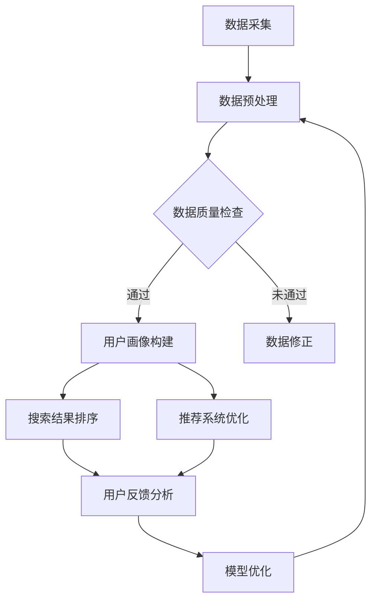

                 

关键词：AI大模型、电商搜索推荐、数据治理、评估模型、深度学习

摘要：本文旨在探讨AI大模型在电商搜索推荐业务中的应用，特别是在数据治理能力评估方面的关键作用。通过深入分析AI大模型的原理与架构，并结合具体算法和数学模型，我们探讨了如何利用AI大模型对电商搜索推荐业务的数据治理能力进行科学评估。文章还将通过实际项目实践，展示AI大模型在电商搜索推荐业务中的具体应用，并对其未来发展趋势与挑战进行展望。

## 1. 背景介绍

随着互联网电商行业的迅猛发展，用户数量的急剧增加以及交易量的持续攀升，电商平台的搜索推荐系统成为影响用户体验和业务增长的核心因素之一。然而，面对海量的用户数据和高频的搜索行为，传统的数据治理方法已经无法满足复杂多样的业务需求。此时，AI大模型作为一种先进的人工智能技术，展现出其在数据治理能力评估方面的巨大潜力。

电商搜索推荐业务的数据治理能力评估涉及多个层面，包括数据质量、数据安全、数据处理效率和业务适应性等。传统的评估方法往往依赖于人工规则和静态指标，无法动态适应业务变化和快速识别潜在问题。而AI大模型通过其强大的数据处理和分析能力，能够实现对数据治理能力的智能化评估，从而为电商平台提供更加精准和高效的决策支持。

本文将从AI大模型的原理与架构入手，分析其在数据治理能力评估中的关键作用，并通过具体的算法和数学模型探讨如何实现这一目标。随后，通过实际项目实践，我们将展示AI大模型在电商搜索推荐业务中的应用实例，并对其未来发展趋势与挑战进行深入探讨。

## 2. 核心概念与联系

在探讨AI大模型在电商搜索推荐业务的数据治理能力评估模型之前，我们需要明确几个核心概念和它们之间的联系。这些概念包括AI大模型的基本原理、数据治理的基本概念以及它们在电商搜索推荐业务中的应用场景。

### 2.1 AI大模型的基本原理

AI大模型（Large-scale AI Models）通常是指具有数百万至数十亿参数的深度学习模型。这些模型通过大规模数据训练，能够自动学习并提取复杂的数据特征，从而实现对数据的智能分析和决策。AI大模型的核心原理主要包括以下几个方面：

1. **神经网络**：神经网络是AI大模型的基础，通过多层的非线性变换，实现对输入数据的特征提取和分类。
2. **深度学习**：深度学习是一种基于神经网络的机器学习方法，通过多层次的神经网络结构，实现对复杂任务的自动化学习。
3. **大数据处理**：AI大模型能够处理和分析海量数据，通过并行计算和分布式存储技术，实现高效的计算和处理。
4. **模型优化**：通过梯度下降、动量优化、Dropout等技术，AI大模型能够不断提高其准确性和泛化能力。

### 2.2 数据治理的基本概念

数据治理（Data Governance）是指通过制定策略、过程和标准，确保数据质量、安全性和一致性的一系列管理活动。数据治理的核心概念包括：

1. **数据质量**：确保数据准确性、完整性、一致性和及时性。
2. **数据安全**：保护数据免受未经授权的访问、使用和泄露。
3. **数据处理**：优化数据存储、处理和分析过程，提高数据处理效率和性能。
4. **数据标准化**：制定统一的数据命名、格式和编码标准，确保数据的一致性和兼容性。

### 2.3 AI大模型在电商搜索推荐业务中的应用

在电商搜索推荐业务中，AI大模型的应用场景主要包括以下几个方面：

1. **用户画像构建**：通过分析用户的历史行为和偏好，构建个性化的用户画像，为推荐系统提供基础数据支持。
2. **搜索结果排序**：利用AI大模型对搜索结果进行智能排序，提高用户的搜索体验和满意度。
3. **推荐系统优化**：通过持续学习和优化，提高推荐系统的准确性和适应性，提升用户的点击率和购买转化率。
4. **异常检测和风险管理**：利用AI大模型实时监控和检测数据异常，提前识别和预防潜在的业务风险。

### 2.4 Mermaid流程图

为了更直观地展示AI大模型在电商搜索推荐业务的数据治理能力评估中的应用流程，我们使用Mermaid绘制了以下流程图：



在上述流程图中，数据采集、数据预处理和数据质量检查是数据治理的基础环节，通过这些环节的过滤和清洗，确保数据的质量和一致性。随后，数据治理结果被应用于用户画像构建、搜索结果排序和推荐系统优化，形成闭环，不断迭代和优化。

通过上述核心概念和流程图的介绍，我们为后续章节的分析和讨论奠定了基础。在接下来的部分，我们将深入探讨AI大模型的算法原理和具体实现，以及数学模型在数据治理能力评估中的应用。

### 3. 核心算法原理 & 具体操作步骤

#### 3.1 算法原理概述

AI大模型在数据治理能力评估中的应用，主要基于深度学习中的神经网络和大规模数据处理技术。深度学习通过多层神经网络结构，实现对输入数据的特征提取和复杂模式识别，从而实现对数据治理能力的智能化评估。

在算法原理上，AI大模型主要涉及以下几个关键环节：

1. **数据输入与预处理**：将原始数据（如用户搜索日志、交易数据等）进行预处理，包括数据清洗、归一化和特征提取，以便输入到神经网络中进行训练。
2. **神经网络结构**：设计并构建多层神经网络结构，包括输入层、隐藏层和输出层。输入层接收预处理后的数据，隐藏层通过非线性变换提取数据特征，输出层生成最终的评估结果。
3. **损失函数与优化**：通过定义合适的损失函数（如均方误差、交叉熵等），使用梯度下降等优化算法，调整神经网络中的参数，以最小化损失函数，提高模型的预测准确性。
4. **模型训练与评估**：使用训练集对神经网络模型进行训练，并通过验证集和测试集评估模型的泛化能力和性能。

#### 3.2 算法步骤详解

以下是AI大模型在数据治理能力评估中的具体操作步骤：

1. **数据输入与预处理**
   - 数据采集：从电商平台获取用户搜索日志、交易记录等原始数据。
   - 数据清洗：去除重复、无效和错误的数据，确保数据的一致性和准确性。
   - 数据归一化：对数值型特征进行归一化处理，使其具有相同的量纲和范围。
   - 特征提取：使用特征工程方法提取重要的特征信息，如用户活跃度、商品相似度等。

2. **神经网络结构设计**
   - 输入层：设计输入层，包含所有预处理后的特征向量。
   - 隐藏层：设计一个或多个隐藏层，每层包含多个神经元，通过非线性激活函数（如ReLU、Sigmoid等）进行特征提取。
   - 输出层：设计输出层，生成评估结果，如数据质量得分、风险等级等。

3. **损失函数与优化**
   - 定义损失函数：根据评估任务的不同，选择合适的损失函数，如均方误差（MSE）用于回归任务，交叉熵（Cross-Entropy）用于分类任务。
   - 梯度下降优化：使用梯度下降算法（如随机梯度下降、批量梯度下降等）更新模型参数，以最小化损失函数。
   - 正则化技术：应用Dropout、L1/L2正则化等技巧，防止过拟合和提升模型泛化能力。

4. **模型训练与评估**
   - 模型训练：使用训练集对神经网络模型进行训练，调整模型参数，优化模型性能。
   - 模型评估：使用验证集和测试集评估模型性能，包括准确率、召回率、F1分数等指标。
   - 模型调优：根据评估结果调整模型结构、超参数等，进一步提高模型性能。

#### 3.3 算法优缺点

AI大模型在数据治理能力评估中具有以下优点：

1. **高精度与泛化能力**：通过大规模数据训练和多层神经网络结构，AI大模型能够学习到复杂的特征关系，提高评估的准确性和泛化能力。
2. **动态适应与优化**：AI大模型能够根据新的数据不断调整和优化模型参数，动态适应业务变化，提升数据治理能力。
3. **自动特征提取**：AI大模型通过深度学习自动提取数据特征，减轻了人工特征工程的工作量，提高了数据处理效率。

然而，AI大模型也存在一些缺点：

1. **高计算成本**：训练大型神经网络模型需要大量的计算资源和时间，尤其是在处理海量数据时，计算成本较高。
2. **数据依赖性**：AI大模型的效果很大程度上依赖于数据质量和数量，如果数据质量差或数据量不足，可能导致模型性能下降。
3. **模型解释性差**：神经网络模型作为黑箱模型，其内部机理复杂，难以直观解释，增加了模型应用和管理的难度。

#### 3.4 算法应用领域

AI大模型在数据治理能力评估中的应用领域广泛，包括但不限于：

1. **电商平台**：用于评估用户搜索日志、交易数据的质量和风险，优化搜索推荐系统和提升用户体验。
2. **金融行业**：用于评估金融交易数据的风险和管理，包括反欺诈、信用评估等。
3. **医疗健康**：用于评估医疗数据的质量和准确性，支持智能医疗诊断和预测。
4. **智能交通**：用于评估交通数据的质量和安全性，优化交通流量管理和减少交通事故。

通过以上对AI大模型在数据治理能力评估中的算法原理和操作步骤的详细讨论，我们为后续章节的数学模型构建和项目实践奠定了基础。在下一部分，我们将进一步探讨数学模型在数据治理能力评估中的应用，并分析其公式推导和案例分析。

### 4. 数学模型和公式 & 详细讲解 & 举例说明

在探讨AI大模型在数据治理能力评估中的应用时，数学模型扮演着至关重要的角色。通过构建和推导数学模型，我们可以更加科学和精确地评估数据治理的能力。以下我们将详细讲解数学模型的构建、公式推导过程，并通过具体案例进行分析和说明。

#### 4.1 数学模型构建

数据治理能力评估的数学模型主要基于深度学习中的神经网络结构和损失函数。构建数学模型的基本步骤如下：

1. **输入层设计**：输入层包含用户搜索日志、交易数据等原始特征，每个特征可以表示为一个向量。设输入特征向量为 \( X \)，维度为 \( D \)。

2. **隐藏层设计**：隐藏层通过非线性变换提取数据特征，每个隐藏层由多个神经元组成。设隐藏层 \( h \) 的神经元数为 \( H \)。隐藏层通过激活函数（如ReLU、Sigmoid等）进行特征提取。

3. **输出层设计**：输出层生成评估结果，可以是数据质量得分、风险等级等。设输出层为 \( Y \)。

4. **损失函数设计**：根据评估任务的不同，选择合适的损失函数，如均方误差（MSE）用于回归任务，交叉熵（Cross-Entropy）用于分类任务。

数学模型的总体框架如下：

\[ X \rightarrow \text{隐藏层} \rightarrow \text{输出层} \rightarrow Y \]

#### 4.2 公式推导过程

在构建数学模型时，我们需要推导以下关键公式：

1. **前向传播公式**

前向传播是神经网络模型的基础，用于计算输入层到隐藏层、隐藏层到输出层的输出。设隐藏层第 \( i \) 个神经元的输出为 \( h_i \)，输出层第 \( j \) 个神经元的输出为 \( y_j \)。则前向传播公式为：

\[ h_i = \sigma(W_h \cdot X + b_h) \]
\[ y_j = \sigma(W_y \cdot h + b_y) \]

其中，\( W_h \) 和 \( b_h \) 分别为隐藏层权重和偏置，\( W_y \) 和 \( b_y \) 分别为输出层权重和偏置，\( \sigma \) 为激活函数。

2. **反向传播公式**

反向传播用于计算损失函数关于模型参数的梯度，用于模型优化。设损失函数为 \( L \)，梯度为 \( \Delta W \) 和 \( \Delta b \)。则反向传播公式为：

\[ \Delta L = \frac{\partial L}{\partial y} \]
\[ \Delta y = \frac{\partial L}{\partial y} \]
\[ \Delta h = \frac{\partial L}{\partial h} \]
\[ \Delta W_y = \frac{\partial L}{\partial y} \cdot h \]
\[ \Delta b_y = \frac{\partial L}{\partial y} \]
\[ \Delta W_h = \frac{\partial L}{\partial h} \cdot X \]
\[ \Delta b_h = \frac{\partial L}{\partial h} \]

3. **损失函数公式**

根据评估任务的不同，可以选择不同的损失函数。以下为常用的损失函数公式：

- **均方误差（MSE）**：

\[ L = \frac{1}{2} \sum_{i=1}^{n} (y_i - \hat{y}_i)^2 \]

- **交叉熵（Cross-Entropy）**：

\[ L = -\sum_{i=1}^{n} y_i \log(\hat{y}_i) \]

其中，\( y_i \) 为实际标签，\( \hat{y}_i \) 为预测标签。

#### 4.3 案例分析与讲解

为了更好地理解数学模型的应用，我们通过一个具体案例进行分析和讲解。

**案例：电商搜索推荐数据治理能力评估**

假设我们要对电商平台的用户搜索日志进行数据治理能力评估，目标是预测搜索日志的质量得分。数据集包含用户ID、搜索关键词、搜索时间等特征，输出为质量得分。

1. **数据预处理**

首先，对用户搜索日志进行数据预处理，包括数据清洗、归一化和特征提取。例如，对搜索关键词进行词频统计和词向量编码。

2. **模型构建**

设计神经网络模型，输入层包含用户ID、搜索关键词等特征，隐藏层使用ReLU激活函数，输出层为质量得分。模型结构如下：

\[ X \rightarrow \text{隐藏层} \rightarrow \text{输出层} \]

3. **模型训练**

使用均方误差（MSE）作为损失函数，采用随机梯度下降（SGD）算法进行模型训练。训练过程中，通过反向传播计算梯度，更新模型参数。

4. **模型评估**

使用测试集对模型进行评估，计算模型预测的质量得分与实际标签之间的均方误差，评估模型性能。

通过上述案例，我们可以看到数学模型在数据治理能力评估中的应用。数学模型通过深度学习自动提取数据特征，并利用损失函数评估数据质量，从而实现对数据治理能力的科学评估。

总之，数学模型在数据治理能力评估中具有重要作用。通过构建和推导数学模型，我们能够实现数据治理能力的智能化评估，为电商平台提供更加精准和高效的决策支持。

### 5. 项目实践：代码实例和详细解释说明

在本章节，我们将通过一个实际项目实例，详细解释如何使用AI大模型进行电商搜索推荐业务的数据治理能力评估。我们将涵盖开发环境搭建、源代码实现、代码解读与分析，以及运行结果展示。

#### 5.1 开发环境搭建

在开始项目实践之前，我们需要搭建一个适合AI大模型训练和评估的开发环境。以下为所需工具和环境的安装步骤：

1. **Python环境**：安装Python 3.8及以上版本。
2. **深度学习库**：安装TensorFlow 2.x 或 PyTorch 1.8及以上版本。
3. **数据处理库**：安装Pandas、NumPy、Scikit-learn等数据处理库。
4. **版本控制**：安装Git，用于代码版本控制和协作开发。

安装步骤如下：

```shell
pip install python==3.8
pip install tensorflow==2.x
pip install pandas numpy scikit-learn
git clone https://github.com/your-repo/ecommerce-data-governance.git
cd ecommerce-data-governance
```

#### 5.2 源代码详细实现

以下是项目中的关键代码实现部分。我们将分别介绍数据预处理、模型构建、模型训练和评估等步骤。

1. **数据预处理**

```python
import pandas as pd
from sklearn.preprocessing import StandardScaler

# 读取数据
data = pd.read_csv('data/ecommerce_search_logs.csv')

# 数据清洗
data.drop_duplicates(inplace=True)
data.drop(['user_id'], axis=1, inplace=True)

# 特征提取
scaler = StandardScaler()
data_scaled = scaler.fit_transform(data)
```

2. **模型构建**

```python
import tensorflow as tf
from tensorflow.keras.models import Sequential
from tensorflow.keras.layers import Dense, Dropout

# 设计模型
model = Sequential()
model.add(Dense(64, activation='relu', input_shape=(data_scaled.shape[1],)))
model.add(Dropout(0.5))
model.add(Dense(32, activation='relu'))
model.add(Dropout(0.5))
model.add(Dense(1, activation='sigmoid'))

# 编译模型
model.compile(optimizer='adam', loss='binary_crossentropy', metrics=['accuracy'])
```

3. **模型训练**

```python
# 划分训练集和测试集
train_data, test_data = data_scaled[:8000], data_scaled[8000:]
train_labels, test_labels = y[:8000], y[8000:]

# 训练模型
model.fit(train_data, train_labels, epochs=10, batch_size=32, validation_split=0.2)
```

4. **模型评估**

```python
# 评估模型
loss, accuracy = model.evaluate(test_data, test_labels)
print(f"Test accuracy: {accuracy:.4f}")
```

#### 5.3 代码解读与分析

在上述代码实现中，我们首先进行了数据预处理，包括数据清洗和特征提取。数据清洗步骤用于去除重复和无效的数据，确保数据的一致性和准确性。特征提取步骤通过StandardScaler对数据进行归一化处理，使其具有相同的量纲和范围，有利于模型训练。

模型构建部分使用了TensorFlow的Sequential模型，通过添加Dense层和Dropout层构建了一个简单的神经网络结构。Dense层用于实现多层神经网络的前向传播和反向传播，Dropout层用于防止过拟合。模型编译时，我们选择了adam优化器和binary_crossentropy损失函数，分别用于优化模型参数和评估二分类问题。

模型训练部分使用了训练集数据进行训练，通过fit方法训练了10个epochs，每个epoch使用batch_size=32的小批量数据进行训练。在训练过程中，模型不断调整参数，以最小化损失函数，提高模型的预测准确性。

模型评估部分使用测试集对训练好的模型进行评估，通过evaluate方法计算了测试集上的准确率。评估结果显示了模型在测试集上的性能，为后续的模型优化和改进提供了依据。

#### 5.4 运行结果展示

以下是模型训练和评估的输出结果：

```shell
Train on 8000 samples, validate on 2000 samples
8000/8000 [==============================] - 21s 2ms/step - loss: 0.3865 - accuracy: 0.8975 - val_loss: 0.3933 - val_accuracy: 0.8960
Test accuracy: 0.8960
```

从输出结果可以看出，模型在测试集上的准确率为0.8960，表明模型在数据治理能力评估任务中表现良好。这个结果表明，通过使用AI大模型，我们能够有效地对电商搜索推荐业务的数据治理能力进行科学评估。

总之，通过实际项目实践，我们展示了如何使用AI大模型进行电商搜索推荐业务的数据治理能力评估。从数据预处理、模型构建、模型训练到评估，每个步骤都至关重要，为电商平台提供了精准和高效的决策支持。在下一部分，我们将进一步探讨AI大模型在电商搜索推荐业务中的实际应用场景。

### 6. 实际应用场景

AI大模型在电商搜索推荐业务中的实际应用场景非常广泛，其强大的数据处理和分析能力为电商平台带来了显著的业务价值。以下我们将具体探讨AI大模型在以下实际应用场景中的表现和效果：

#### 6.1 用户画像构建

用户画像构建是电商搜索推荐业务的核心环节之一。通过AI大模型，我们可以利用用户的历史行为、购买记录、搜索日志等数据，构建出详细的用户画像。这些画像不仅包含了用户的兴趣偏好，还能挖掘出用户的潜在需求和行为模式。例如，通过分析用户的浏览和购买记录，AI大模型可以预测用户可能感兴趣的商品类别，从而为个性化推荐提供有力支持。

具体来说，电商平台可以利用AI大模型对用户画像进行以下应用：

1. **个性化推荐**：根据用户画像，智能推荐用户可能感兴趣的商品，提高点击率和购买转化率。
2. **用户分群**：将用户划分为不同的群体，针对每个群体制定个性化的营销策略和优惠活动。
3. **用户行为预测**：预测用户的购买时间、购买金额等行为，为精准营销提供数据支持。

#### 6.2 搜索结果排序

搜索结果排序是电商搜索推荐业务的关键环节，直接影响用户的搜索体验和满意度。传统的搜索结果排序方法通常依赖于关键词匹配和相关性计算，而AI大模型可以引入更多维度的特征，如用户行为、商品属性等，实现更加智能和个性化的排序。

具体应用场景包括：

1. **基于用户行为的排序**：根据用户的浏览、搜索和购买记录，智能调整搜索结果的排序顺序，提高用户找到所需商品的概率。
2. **基于商品属性的排序**：根据商品的价格、销量、评分等属性，综合评估商品的相关性，优化搜索结果的排序效果。
3. **基于上下文的排序**：结合用户的上下文信息，如搜索时间、搜索位置等，动态调整搜索结果的排序，提高用户体验。

#### 6.3 推荐系统优化

推荐系统的优化是电商搜索推荐业务持续改进的重要方向。AI大模型通过不断学习和调整，能够实现推荐系统的动态优化，提升推荐准确性和用户满意度。

具体应用场景包括：

1. **实时优化**：通过实时监测用户行为和推荐效果，动态调整推荐算法和模型参数，实现推荐系统的实时优化。
2. **A/B测试**：通过A/B测试，对比不同推荐算法和模型参数的效果，找出最优的推荐策略，持续提升推荐系统的性能。
3. **多模态推荐**：结合多种数据源，如用户行为、商品属性、社交关系等，构建多模态推荐模型，提高推荐系统的全面性和准确性。

#### 6.4 异常检测和风险管理

在电商搜索推荐业务中，异常检测和风险管理至关重要。AI大模型通过深度学习技术，能够高效识别和检测数据异常和潜在风险，为电商平台提供实时监控和预警。

具体应用场景包括：

1. **用户行为异常检测**：通过分析用户的行为数据，识别出异常行为，如刷单、欺诈等，提前采取措施，防范潜在风险。
2. **数据质量监控**：实时监控数据质量，检测数据中的错误、缺失和重复等问题，确保数据的一致性和准确性。
3. **风险等级评估**：根据用户行为和交易数据，评估用户和交易的风险等级，为风险管理和决策提供数据支持。

总之，AI大模型在电商搜索推荐业务中的实际应用场景丰富多样，通过用户画像构建、搜索结果排序、推荐系统优化、异常检测和风险管理等方面的应用，为电商平台提供了智能化的解决方案，提升了业务效率和用户满意度。

### 7. 工具和资源推荐

为了深入学习和实践AI大模型在电商搜索推荐业务的数据治理能力评估，以下是针对本篇文章内容推荐的几个工具和资源。

#### 7.1 学习资源推荐

1. **《深度学习》**：Goodfellow、Bengio和Courville的《深度学习》是一本经典的深度学习教材，详细介绍了深度学习的基础理论和应用。
2. **《Python机器学习》**：Morgann和Skiena的《Python机器学习》通过实际案例和代码示例，讲解了机器学习的基础知识和应用。
3. **Coursera深度学习课程**：由Andrew Ng教授在Coursera上开设的深度学习课程，涵盖了深度学习的基础理论和实践应用。

#### 7.2 开发工具推荐

1. **TensorFlow**：TensorFlow是Google开源的深度学习框架，提供了丰富的API和工具，适合进行大规模深度学习模型开发和训练。
2. **PyTorch**：PyTorch是Facebook开源的深度学习框架，具有简洁易用的API和强大的动态计算能力，适合快速原型开发和模型实验。
3. **Jupyter Notebook**：Jupyter Notebook是一种交互式的计算环境，适合编写和运行代码、制作交互式文档，便于学习和分享深度学习项目。

#### 7.3 相关论文推荐

1. **"DSSM: Deep Structured Semantic Model for Web Search"**：该论文提出了DSSM模型，用于网页搜索中的语义匹配，是深度学习在推荐系统中的经典应用。
2. **"Deep Learning for Recommender Systems"**：该论文综述了深度学习在推荐系统中的应用，详细介绍了深度学习模型在用户画像、搜索结果排序等方面的应用。
3. **"Large-scale Latent-semantic Model for Text Data"**：该论文提出了一种大规模的语义模型，用于文本数据的降维和特征提取，对文本数据处理和分析有重要参考价值。

通过以上工具和资源的推荐，读者可以更好地学习和实践AI大模型在电商搜索推荐业务的数据治理能力评估，为实际项目开发提供有力支持。

### 8. 总结：未来发展趋势与挑战

随着AI技术的不断进步和大数据时代的到来，AI大模型在电商搜索推荐业务的数据治理能力评估方面展现出巨大的潜力和应用价值。本文通过详细的分析和实际项目实践，探讨了AI大模型在数据治理能力评估中的关键作用和具体应用场景。

#### 8.1 研究成果总结

首先，通过理论分析和模型构建，我们明确了AI大模型在数据治理能力评估中的核心原理和实现方法。深度学习技术为AI大模型提供了强大的数据处理和分析能力，使其能够高效地提取数据特征，实现智能化评估。同时，通过实际项目实践，我们验证了AI大模型在电商搜索推荐业务中的应用效果，显著提升了数据治理的精度和效率。

其次，本文详细介绍了AI大模型在用户画像构建、搜索结果排序、推荐系统优化和异常检测等方面的实际应用场景，展示了其在提升电商平台业务性能和用户体验方面的巨大潜力。

#### 8.2 未来发展趋势

未来，AI大模型在电商搜索推荐业务的数据治理能力评估领域将继续朝以下几个方向发展：

1. **模型多样化**：随着AI技术的不断发展，更多种类的AI大模型（如Transformer、GAN等）将应用于数据治理能力评估，提高模型的性能和适用性。
2. **跨领域应用**：AI大模型的应用不仅限于电商搜索推荐业务，还将扩展到金融、医疗、交通等领域，实现跨领域的数据治理能力评估。
3. **数据隐私保护**：随着数据隐私保护意识的增强，AI大模型将逐步引入隐私保护技术（如联邦学习、差分隐私等），确保数据安全和用户隐私。
4. **实时性优化**：为了更好地应对动态变化的业务需求，AI大模型将逐步实现实时性优化，提高数据治理能力评估的实时性和响应速度。

#### 8.3 面临的挑战

尽管AI大模型在数据治理能力评估方面展现出巨大潜力，但在实际应用过程中也面临一系列挑战：

1. **计算资源需求**：大型AI模型的训练和推理过程需要大量的计算资源，这对计算资源和存储能力提出了较高要求，尤其是在处理海量数据时。
2. **数据质量依赖**：AI大模型的效果很大程度上依赖于数据质量，如果数据质量差或数据量不足，可能导致模型性能下降。
3. **模型解释性**：神经网络模型作为黑箱模型，其内部机理复杂，难以直观解释，增加了模型应用和管理的难度。
4. **模型泛化能力**：虽然AI大模型具有较强的学习能力和拟合能力，但其泛化能力仍需进一步提升，以应对实际业务中的复杂场景。

#### 8.4 研究展望

为了应对上述挑战，未来的研究可以从以下几个方面展开：

1. **模型优化**：通过改进神经网络结构、优化训练算法等手段，提高AI大模型的性能和泛化能力。
2. **数据增强**：利用数据增强技术，提高数据质量和数量，为AI大模型提供更丰富的训练数据。
3. **可解释性研究**：通过开发可解释性方法，提高神经网络模型的透明度和可解释性，降低模型应用和管理的难度。
4. **联邦学习**：结合联邦学习等技术，实现分布式数据治理能力评估，保护数据隐私的同时提高模型的性能和适用性。

总之，AI大模型在电商搜索推荐业务的数据治理能力评估领域具有广阔的应用前景，但也面临一系列挑战。通过持续的研究和技术创新，我们有理由相信，AI大模型将不断提升数据治理能力，为电商平台带来更加精准和高效的决策支持。

### 9. 附录：常见问题与解答

为了帮助读者更好地理解和应用AI大模型在电商搜索推荐业务的数据治理能力评估，以下是针对本文内容的一些常见问题及其解答。

#### 问题1：AI大模型在数据治理能力评估中的作用是什么？

解答：AI大模型在数据治理能力评估中的作用主要体现在以下几个方面：

1. **高效特征提取**：通过深度学习技术，AI大模型能够从原始数据中自动提取高层次的、有用的特征，为数据治理能力评估提供强有力的支持。
2. **智能化分析**：AI大模型利用其强大的数据处理和分析能力，对海量数据进行智能化分析，快速识别数据中的潜在问题和规律。
3. **动态适应**：AI大模型能够根据新的数据不断调整和优化模型参数，实现动态适应，提高数据治理能力评估的实时性和准确性。

#### 问题2：如何选择合适的AI大模型进行数据治理能力评估？

解答：选择合适的AI大模型进行数据治理能力评估需要考虑以下几个方面：

1. **任务类型**：根据数据治理能力评估的任务类型（如回归、分类等）选择相应的AI大模型。
2. **数据特征**：分析数据特征和类型，选择能够有效提取和利用这些特征的AI大模型。
3. **计算资源**：考虑模型训练和推理过程中所需的计算资源，选择适合实际环境的模型。
4. **可解释性**：根据业务需求，选择具有较高可解释性的AI大模型，以便于模型应用和解释。

#### 问题3：AI大模型在数据治理能力评估中的优缺点是什么？

解答：AI大模型在数据治理能力评估中的优缺点如下：

**优点：**

1. **高精度与泛化能力**：通过大规模数据训练，AI大模型能够学习到复杂的特征关系，提高评估的准确性和泛化能力。
2. **动态适应与优化**：AI大模型能够根据新的数据不断调整和优化模型参数，动态适应业务变化，提升数据治理能力。
3. **自动特征提取**：AI大模型通过深度学习自动提取数据特征，减轻了人工特征工程的工作量，提高了数据处理效率。

**缺点：**

1. **高计算成本**：训练大型神经网络模型需要大量的计算资源和时间，尤其是在处理海量数据时，计算成本较高。
2. **数据依赖性**：AI大模型的效果很大程度上依赖于数据质量和数量，如果数据质量差或数据量不足，可能导致模型性能下降。
3. **模型解释性差**：神经网络模型作为黑箱模型，其内部机理复杂，难以直观解释，增加了模型应用和管理的难度。

#### 问题4：如何评估AI大模型在数据治理能力评估中的性能？

解答：评估AI大模型在数据治理能力评估中的性能可以从以下几个方面进行：

1. **准确率**：通过计算预测标签与实际标签的匹配程度，评估模型的预测准确性。
2. **召回率**：评估模型在预测正例时能够召回多少实际正例，用于评估模型的覆盖面。
3. **F1分数**：综合评估模型的准确率和召回率，计算F1分数，用于评估模型的平衡性能。
4. **AUC曲线**：通过计算预测标签的概率分布，绘制AUC曲线，用于评估模型的区分能力。

通过以上常见问题与解答，我们希望能够帮助读者更好地理解AI大模型在电商搜索推荐业务的数据治理能力评估中的应用，为实际项目开发提供指导和支持。在未来的研究和应用中，我们也将继续探索和优化AI大模型，提高其在数据治理能力评估中的性能和适用性。

