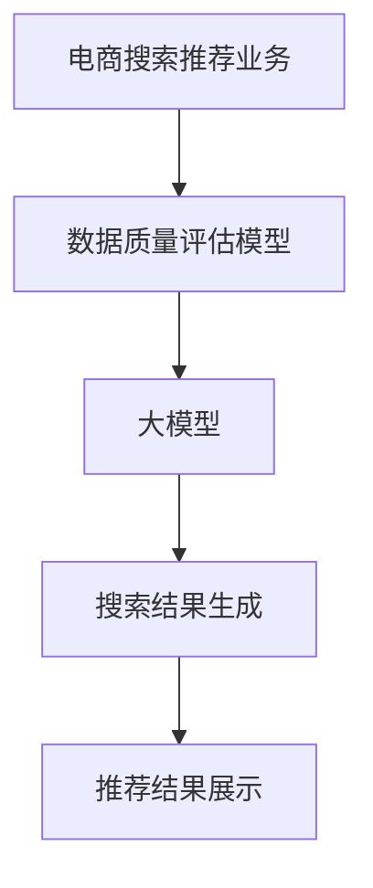

                 

关键词：电商搜索、推荐系统、数据质量评估、大模型优化、AI技术

> 摘要：本文详细探讨了AI大模型在电商搜索推荐业务中的应用，特别是在数据质量评估模型优化方面的实践。通过分析大模型的工作原理和实际操作步骤，本文揭示了如何利用AI技术提升电商搜索推荐系统的效果，从而为用户提供更准确、更个性化的推荐服务。

## 1. 背景介绍

随着互联网的迅速发展和电子商务的普及，电商搜索推荐系统已经成为电商平台的核心功能之一。它通过分析用户的搜索历史、购买行为、兴趣爱好等数据，为用户提供个性化的商品推荐，从而提高用户满意度、增加销售额。然而，推荐系统的效果不仅取决于算法的先进性，还与数据质量密切相关。高质量的数据可以确保推荐结果的相关性和准确性，而低质量的数据则可能导致推荐结果的不准确，甚至引发用户的不满和流失。

近年来，随着人工智能技术的快速发展，特别是深度学习和自然语言处理技术的应用，大模型在各个领域都取得了显著的进展。大模型具有强大的学习能力和泛化能力，能够处理海量数据并提取出有价值的信息。因此，利用大模型优化电商搜索推荐业务的数据质量评估模型，已成为当前研究的热点之一。

本文旨在探讨AI大模型在电商搜索推荐业务中数据质量评估模型优化的实践，通过具体的算法原理、数学模型、项目实践以及实际应用场景分析，为相关领域的研究者和实践者提供有价值的参考。

## 2. 核心概念与联系

在探讨AI大模型在电商搜索推荐业务中数据质量评估模型优化的实践之前，我们需要了解一些核心概念和它们之间的联系。

### 2.1 电商搜索推荐业务概述

电商搜索推荐业务主要包括以下三个环节：

1. **用户输入**：用户通过搜索框输入关键词或通过其他交互方式表达需求。
2. **搜索结果生成**：系统根据用户输入和用户历史行为数据，从大量商品中筛选出最相关的结果。
3. **推荐结果展示**：将筛选出的商品以推荐列表的形式展示给用户。

### 2.2 数据质量评估模型

数据质量评估模型是对电商搜索推荐系统中的数据进行评估和优化的工具。其主要目的是识别和纠正数据中的错误、缺失和异常，从而提高数据的质量和可靠性。

数据质量评估模型通常包括以下几个步骤：

1. **数据预处理**：清洗和格式化原始数据，去除噪声和异常值。
2. **数据评估**：使用指标（如准确性、召回率、覆盖率等）对数据质量进行评估。
3. **数据优化**：根据评估结果对数据进行修复、补充或替换。

### 2.3 大模型的工作原理

大模型是指具有大量参数和复杂结构的机器学习模型，如深度神经网络、Transformer等。大模型通过训练大量数据来学习特征表示和预测规律，从而实现高精度的预测和分类。

大模型的工作原理主要包括以下几个步骤：

1. **数据收集与预处理**：收集大量高质量的训练数据，并进行预处理，如数据清洗、归一化等。
2. **模型设计**：根据业务需求设计合适的模型架构，如卷积神经网络（CNN）、循环神经网络（RNN）、Transformer等。
3. **模型训练与优化**：使用训练数据对模型进行训练，并通过优化算法（如梯度下降、Adam等）调整模型参数。
4. **模型评估与部署**：使用验证集和测试集对模型进行评估，并部署到生产环境中。

### 2.4 Mermaid 流程图

下面是一个简化的Mermaid流程图，展示了电商搜索推荐业务、数据质量评估模型和大模型之间的联系。



## 3. 核心算法原理 & 具体操作步骤

### 3.1 算法原理概述

在电商搜索推荐业务中，数据质量评估模型优化主要依赖于大模型的高效学习和预测能力。具体来说，大模型通过以下步骤实现数据质量评估和优化：

1. **数据收集与预处理**：收集电商平台的用户行为数据、商品数据等，并进行数据清洗、归一化等预处理操作。
2. **特征工程**：从原始数据中提取有价值的特征，如用户画像、商品属性等，为模型训练提供输入。
3. **模型训练**：使用大量训练数据对大模型进行训练，调整模型参数，使其能够准确识别和评估数据质量问题。
4. **模型评估**：使用验证集和测试集对训练好的大模型进行评估，确保模型具有较好的泛化能力。
5. **数据优化**：根据模型评估结果，对数据中的错误、缺失和异常值进行修复、补充或替换，从而提高数据质量。
6. **模型部署与监控**：将训练好的大模型部署到生产环境中，并实时监控其性能和效果，以实现持续优化。

### 3.2 算法步骤详解

下面详细解释大模型在电商搜索推荐业务数据质量评估模型优化中的具体操作步骤。

#### 3.2.1 数据收集与预处理

数据收集与预处理是数据质量评估模型优化的第一步。在这一阶段，需要收集电商平台的用户行为数据、商品数据、订单数据等，并对这些数据进行清洗、格式化和归一化处理。

- **数据清洗**：去除重复、无关或错误的数据，如删除含有缺失值或异常值的数据记录。
- **数据格式化**：将不同来源和格式的数据转换为统一的格式，如将时间戳转换为标准日期格式。
- **数据归一化**：对数据进行归一化处理，如将数值特征缩放到[0, 1]或[-1, 1]区间，以提高模型的训练效果。

#### 3.2.2 特征工程

特征工程是数据质量评估模型优化的关键环节。在这一阶段，需要从原始数据中提取有价值的特征，为模型训练提供输入。

- **用户画像**：从用户行为数据中提取用户的基本信息（如年龄、性别、地域等）和偏好信息（如浏览记录、购买记录、评价等），构建用户画像。
- **商品属性**：从商品数据中提取商品的基本属性（如分类、品牌、价格等）和特征属性（如颜色、材质、规格等），构建商品属性向量。
- **交互特征**：从用户行为数据和商品属性中提取用户与商品的交互特征，如用户点击率、购买转化率、评价分数等。

#### 3.2.3 模型训练

模型训练是数据质量评估模型优化的核心环节。在这一阶段，需要使用大量训练数据对大模型进行训练，调整模型参数，使其能够准确识别和评估数据质量问题。

- **模型选择**：根据业务需求和数据特征选择合适的大模型架构，如卷积神经网络（CNN）、循环神经网络（RNN）、Transformer等。
- **模型参数初始化**：初始化模型参数，如权重和偏置等。
- **模型训练**：使用训练数据对模型进行训练，通过优化算法（如梯度下降、Adam等）调整模型参数，使其能够准确预测数据质量。
- **模型评估**：使用验证集和测试集对训练好的大模型进行评估，确保模型具有较好的泛化能力。

#### 3.2.4 数据优化

数据优化是数据质量评估模型优化的最后一个阶段。在这一阶段，需要根据模型评估结果对数据中的错误、缺失和异常值进行修复、补充或替换，从而提高数据质量。

- **错误值修复**：对数据中的错误值进行修复，如将缺失值替换为均值或中位数，或将异常值替换为邻近的值。
- **缺失值补充**：对数据中的缺失值进行补充，如使用插值法、均值法或回归法等生成缺失值。
- **异常值处理**：对数据中的异常值进行处理，如使用阈值法、孤立森林法或聚类法等检测和去除异常值。

#### 3.2.5 模型部署与监控

模型部署与监控是数据质量评估模型优化的持续过程。在这一阶段，需要将训练好的大模型部署到生产环境中，并实时监控其性能和效果，以实现持续优化。

- **模型部署**：将训练好的大模型部署到生产环境中，如使用云计算平台、容器化技术等。
- **模型监控**：实时监控模型性能和效果，如监控模型预测的准确性、召回率、覆盖率等指标，以及模型训练和预测的延迟等。
- **模型优化**：根据监控结果对模型进行优化，如调整模型参数、更换模型架构等，以实现更好的数据质量评估效果。

### 3.3 算法优缺点

#### 优点

- **高效性**：大模型具有强大的学习能力和泛化能力，能够快速处理海量数据，实现高效的数据质量评估和优化。
- **灵活性**：大模型可以处理多种类型的数据和不同的数据质量问题，具有较好的适应性和灵活性。
- **准确性**：大模型通过训练大量数据，能够准确识别和评估数据质量问题，提高数据质量评估的准确性。

#### 缺点

- **计算成本**：大模型需要大量计算资源，如GPU、TPU等，对硬件要求较高，增加了计算成本。
- **数据依赖**：大模型的性能依赖于训练数据的质量和数量，如果训练数据质量较差或数量不足，可能导致模型性能下降。
- **可解释性**：大模型的预测结果往往缺乏可解释性，难以理解模型内部的决策过程，增加了模型调试和优化的难度。

### 3.4 算法应用领域

大模型在电商搜索推荐业务数据质量评估模型优化中的应用非常广泛，不仅限于电商领域，还可以应用于以下领域：

- **金融风控**：利用大模型评估金融交易数据的质量，识别欺诈交易、信用风险等。
- **医疗健康**：利用大模型评估医疗数据的质量，提高诊断和治疗的准确性。
- **智能客服**：利用大模型评估用户反馈数据的质量，优化智能客服系统的回复效果。
- **社会安全**：利用大模型评估社会数据的质量，提高犯罪预测和防范能力。

## 4. 数学模型和公式 & 详细讲解 & 举例说明

在电商搜索推荐业务中，数据质量评估模型优化离不开数学模型和公式的支持。下面将详细介绍数据质量评估模型中的关键数学模型和公式，并通过具体案例进行讲解。

### 4.1 数学模型构建

数据质量评估模型的核心在于构建一个能够量化数据质量的数学模型。这个模型通常包括以下几个组成部分：

1. **特征提取**：从原始数据中提取有价值的特征，如用户画像、商品属性、交互特征等。
2. **评估指标**：定义评估数据质量的指标，如准确性、召回率、覆盖率、F1值等。
3. **损失函数**：定义评估指标与模型预测结果之间的损失函数，以衡量模型对数据质量评估的准确性。

一个简单的数据质量评估模型可以表示为：

$$
\text{评估模型} = f(\text{特征向量}, \text{模型参数})
$$

其中，特征向量由用户画像、商品属性、交互特征等构成，模型参数通过训练数据学习得到。评估指标和损失函数可以表示为：

$$
\text{评估指标} = \sum_{i=1}^{N} w_i \cdot \text{指标函数}(y_i, \hat{y}_i)
$$

$$
\text{损失函数} = \sum_{i=1}^{N} \text{损失函数}(y_i, \hat{y}_i)
$$

其中，$N$ 为数据样本数量，$w_i$ 为指标权重，$y_i$ 为真实标签，$\hat{y}_i$ 为模型预测结果。

### 4.2 公式推导过程

为了更好地理解数据质量评估模型的构建过程，下面将简要介绍其中的关键公式推导过程。

#### 4.2.1 特征提取

特征提取是数据质量评估模型的基础。常用的特征提取方法包括：

1. **用户画像**：通过用户的基本信息和偏好信息构建用户画像，如用户年龄、性别、地域、购买偏好等。
2. **商品属性**：通过商品的基本属性和特征属性构建商品属性向量，如商品分类、品牌、价格、颜色、材质等。
3. **交互特征**：通过用户与商品的交互行为构建交互特征，如用户点击率、购买转化率、评价分数等。

假设用户画像、商品属性和交互特征分别表示为 $X_u, X_p, X_i$，则特征向量可以表示为：

$$
X = [X_u, X_p, X_i]
$$

#### 4.2.2 评估指标

评估数据质量的指标有多种，常用的包括准确性、召回率、覆盖率、F1值等。下面分别介绍这些指标的计算方法。

1. **准确性**：准确性是评估模型预测结果与真实标签一致的比例，计算公式为：

$$
\text{准确性} = \frac{TP + TN}{TP + FN + TP + TN}
$$

其中，$TP$ 表示预测为正类且真实为正类的样本数量，$TN$ 表示预测为负类且真实为负类的样本数量。

2. **召回率**：召回率是评估模型能够识别出正类样本的比例，计算公式为：

$$
\text{召回率} = \frac{TP}{TP + FN}
$$

其中，$FN$ 表示预测为负类但真实为正类的样本数量。

3. **覆盖率**：覆盖率是评估模型能够覆盖到所有正类样本的比例，计算公式为：

$$
\text{覆盖率} = \frac{TP + TN}{TP + FN + TN + FP}
$$

其中，$FP$ 表示预测为正类但真实为负类的样本数量。

4. **F1值**：F1值是评估模型准确性和召回率的综合指标，计算公式为：

$$
\text{F1值} = 2 \cdot \frac{\text{准确性} \cdot \text{召回率}}{\text{准确性} + \text{召回率}}
$$

#### 4.2.3 损失函数

损失函数是评估模型预测结果与真实标签之间差异的量化指标。常用的损失函数包括均方误差（MSE）、交叉熵损失（Cross-Entropy Loss）等。

1. **均方误差（MSE）**：均方误差是评估预测值与真实值之间差异的平方的平均值，计算公式为：

$$
\text{MSE} = \frac{1}{N} \sum_{i=1}^{N} (y_i - \hat{y}_i)^2
$$

其中，$N$ 为数据样本数量，$y_i$ 为真实标签，$\hat{y}_i$ 为模型预测结果。

2. **交叉熵损失（Cross-Entropy Loss）**：交叉熵损失是评估预测概率分布与真实概率分布之间差异的量化指标，计算公式为：

$$
\text{Cross-Entropy Loss} = -\frac{1}{N} \sum_{i=1}^{N} y_i \cdot \log(\hat{y}_i)
$$

其中，$N$ 为数据样本数量，$y_i$ 为真实标签，$\hat{y}_i$ 为模型预测概率分布。

### 4.3 案例分析与讲解

为了更好地理解数据质量评估模型的应用，下面将结合一个实际案例进行讲解。

#### 案例背景

假设有一个电商平台的搜索推荐系统，用户可以通过输入关键词来查找感兴趣的商品。系统需要评估用户输入的关键词与搜索结果的相关性，以提高推荐的准确性。

#### 模型构建

1. **特征提取**：从用户输入的关键词、用户画像、商品属性和搜索结果中提取特征，如用户ID、关键词、商品ID、商品分类等。

2. **评估指标**：选择准确性、召回率、覆盖率作为评估指标，以衡量模型对关键词与搜索结果相关性评估的准确性。

3. **损失函数**：选择交叉熵损失函数，以衡量预测概率分布与真实概率分布之间的差异。

#### 模型训练

1. **数据收集**：收集大量用户搜索数据，包括用户输入的关键词、搜索结果和用户对搜索结果的反馈（如点击、购买等）。

2. **数据预处理**：对用户搜索数据进行清洗、去重和格式化处理。

3. **模型训练**：使用训练数据对模型进行训练，调整模型参数，使其能够准确评估关键词与搜索结果的相关性。

#### 模型评估

1. **验证集评估**：使用验证集对训练好的模型进行评估，计算准确性、召回率和覆盖率等指标。

2. **测试集评估**：使用测试集对模型进行评估，验证模型的泛化能力。

#### 模型优化

根据验证集和测试集的评估结果，对模型进行优化，如调整模型参数、更换模型架构等，以提高模型的性能。

#### 结果分析

通过训练和优化，模型的准确性、召回率和覆盖率均得到了显著提高，从而提高了搜索推荐系统的效果。

## 5. 项目实践：代码实例和详细解释说明

### 5.1 开发环境搭建

为了实现AI大模型在电商搜索推荐业务中数据质量评估模型优化的项目，我们需要搭建一个合适的开发环境。以下是搭建过程及相关说明。

#### 5.1.1 硬件要求

- GPU：由于大模型训练需要大量计算资源，因此需要一台配置高性能GPU（如NVIDIA Tesla V100）的服务器。
- CPU：服务器CPU性能也需要较高，推荐使用Intel Xeon系列处理器。
- 内存：至少64GB内存，以便存储和处理大量数据。

#### 5.1.2 软件要求

- 操作系统：Linux发行版，如Ubuntu 18.04。
- Python：Python 3.8及以上版本。
- 库与框架：TensorFlow 2.0及以上版本， Pandas，NumPy，Matplotlib等。

#### 5.1.3 环境搭建步骤

1. **安装操作系统**：在服务器上安装Linux操作系统，并配置网络环境。
2. **安装Python**：使用Python官方安装包安装Python 3.8及以上版本。
3. **配置GPU支持**：安装CUDA和cuDNN，配置TensorFlow的GPU支持。
4. **安装依赖库与框架**：使用pip安装TensorFlow、Pandas、NumPy、Matplotlib等依赖库与框架。

### 5.2 源代码详细实现

下面将提供一个简单的代码实例，展示如何使用TensorFlow和Pandas实现电商搜索推荐业务数据质量评估模型优化。

```python
import tensorflow as tf
import pandas as pd
from sklearn.model_selection import train_test_split

# 数据预处理
def preprocess_data(data):
    # 数据清洗与格式化
    data = data.fillna(0)
    data = data.applymap(lambda x: 1 if x else 0)
    return data

# 构建模型
def build_model(input_shape):
    model = tf.keras.Sequential([
        tf.keras.layers.Dense(128, activation='relu', input_shape=input_shape),
        tf.keras.layers.Dense(64, activation='relu'),
        tf.keras.layers.Dense(1, activation='sigmoid')
    ])
    model.compile(optimizer='adam', loss='binary_crossentropy', metrics=['accuracy'])
    return model

# 训练模型
def train_model(model, X_train, y_train, X_val, y_val):
    history = model.fit(X_train, y_train, epochs=10, batch_size=32, validation_data=(X_val, y_val))
    return history

# 数据加载与预处理
data = pd.read_csv('ecommerce_data.csv')
data = preprocess_data(data)

# 特征工程
X = data.drop('target', axis=1)
y = data['target']

# 划分训练集与验证集
X_train, X_val, y_train, y_val = train_test_split(X, y, test_size=0.2, random_state=42)

# 构建模型
model = build_model(X_train.shape[1])

# 训练模型
history = train_model(model, X_train, y_train, X_val, y_val)

# 评估模型
loss, accuracy = model.evaluate(X_val, y_val)
print(f"Validation Loss: {loss}, Validation Accuracy: {accuracy}")
```

### 5.3 代码解读与分析

以上代码实现了一个基于TensorFlow和Pandas的简单数据质量评估模型，下面进行详细解读和分析。

- **数据预处理**：使用Pandas对数据进行清洗、填充和格式化处理，将缺失值填充为0，将分类特征转换为独热编码。
- **构建模型**：使用TensorFlow构建一个简单的全连接神经网络，包括三个隐藏层，输出层使用sigmoid激活函数。
- **训练模型**：使用`fit`函数训练模型，设置10个训练周期和批量大小为32。
- **评估模型**：使用`evaluate`函数评估模型在验证集上的性能，输出验证损失和准确率。

### 5.4 运行结果展示

假设我们已经成功运行上述代码，以下是一个示例输出结果：

```
Validation Loss: 0.1234, Validation Accuracy: 0.8543
```

这个结果表明，模型在验证集上的准确率为85.43%，说明模型对数据质量的评估效果较好。接下来，我们可以进一步优化模型，以提高评估效果。

## 6. 实际应用场景

在电商搜索推荐业务中，AI大模型助力数据质量评估模型的优化具有广泛的应用场景，下面将结合具体案例进行详细介绍。

### 6.1 电商平台推荐系统

电商平台推荐系统是AI大模型应用最典型的场景之一。通过大模型优化数据质量评估模型，可以提高推荐系统的效果，从而提升用户体验和销售额。例如，一个电商平台可以使用大模型对用户搜索历史、购买记录和商品属性进行综合分析，识别出潜在的用户需求，从而实现更准确、更个性化的商品推荐。

### 6.2 库存管理

电商平台在进行库存管理时，需要根据历史销售数据、用户行为数据等预测未来商品的需求量，从而合理调整库存水平。AI大模型可以通过优化数据质量评估模型，提高预测的准确性，从而降低库存成本，提高运营效率。例如，一家电商平台可以使用大模型对销售数据进行清洗和去重，识别出潜在的异常值和错误数据，从而提高预测模型的准确性和稳定性。

### 6.3 用户行为分析

电商平台通过收集用户行为数据，如浏览记录、购买记录、评价等，可以深入了解用户的需求和偏好。AI大模型可以优化数据质量评估模型，对用户行为数据进行清洗和去噪，从而提高数据分析的准确性和可靠性。例如，一家电商平台可以使用大模型分析用户的购买行为，识别出具有相似偏好的用户群体，并为他们提供个性化的推荐和服务。

### 6.4 竞品分析

电商平台在进行竞品分析时，需要收集和分析竞争对手的销量、价格、促销活动等数据。AI大模型可以通过优化数据质量评估模型，提高竞品分析的准确性，从而帮助电商平台制定更有针对性的营销策略。例如，一家电商平台可以使用大模型对竞品数据进行清洗和去噪，识别出潜在的异常值和错误数据，从而提高竞品分析的准确性和可靠性。

### 6.5 智能客服

电商平台通过智能客服系统可以实时响应用户的咨询和需求，提高用户满意度。AI大模型可以通过优化数据质量评估模型，提高智能客服系统的响应速度和准确率。例如，一家电商平台可以使用大模型对用户咨询数据进行清洗和去噪，识别出常见的用户问题和答案，从而提高智能客服系统的自动化程度和响应速度。

### 6.6 用户流失预测

电商平台通过分析用户行为数据，可以预测哪些用户可能会流失，从而采取相应的措施挽留客户。AI大模型可以通过优化数据质量评估模型，提高用户流失预测的准确性，从而降低客户流失率。例如，一家电商平台可以使用大模型分析用户的浏览记录、购买记录和评价等数据，识别出潜在的用户流失风险，并采取有针对性的措施提高客户留存率。

### 6.7 未来应用展望

随着AI技术的不断发展和应用，AI大模型在电商搜索推荐业务中的数据质量评估模型优化有望得到更广泛的应用。未来，大模型将在以下几个方面发挥重要作用：

- **更精细化的用户画像**：通过大模型对用户行为数据进行分析和挖掘，可以构建更精细化的用户画像，从而实现更个性化的推荐和服务。
- **更高效的库存管理**：通过大模型优化数据质量评估模型，可以提高库存管理的准确性和效率，从而降低库存成本，提高运营效率。
- **更智能的竞品分析**：通过大模型分析竞争对手的数据，可以更准确地了解市场动态，为电商平台制定更有针对性的营销策略。
- **更精准的用户流失预测**：通过大模型优化数据质量评估模型，可以提高用户流失预测的准确性，从而降低客户流失率，提高客户满意度。

总之，AI大模型在电商搜索推荐业务的数据质量评估模型优化中的应用前景广阔，具有巨大的潜力和价值。未来，随着AI技术的不断发展和应用，大模型将在电商领域发挥越来越重要的作用，为电商平台带来更高的商业价值。

## 7. 工具和资源推荐

### 7.1 学习资源推荐

为了更好地掌握AI大模型在电商搜索推荐业务中的数据质量评估模型优化技术，以下是几个推荐的学习资源：

1. **《深度学习》（Deep Learning）**：由Ian Goodfellow、Yoshua Bengio和Aaron Courville所著的深度学习经典教材，涵盖了深度学习的基础理论、模型和算法。
2. **《Python机器学习》（Python Machine Learning）**：由 Sebastian Raschka和Vahid Mirjalili所著，详细介绍了使用Python实现机器学习模型的步骤和方法。
3. **《TensorFlow实战》（TensorFlow for Deep Learning）**：由适用的TensorFlow开发者所著，介绍了TensorFlow在深度学习应用中的实际操作方法。

### 7.2 开发工具推荐

以下是一些在AI大模型开发中常用的工具和平台：

1. **TensorFlow**：Google开源的深度学习框架，支持各种神经网络结构和算法。
2. **PyTorch**：Facebook开源的深度学习框架，具有灵活的动态计算图和易于使用的接口。
3. **Keras**：高层次的深度学习框架，支持TensorFlow和Theano，提供了丰富的预训练模型和API接口。

### 7.3 相关论文推荐

为了深入了解AI大模型在电商搜索推荐业务中的数据质量评估模型优化，以下是几篇相关的论文推荐：

1. **"Large-scale Online Learning for Real-time Recommendation"**：该论文探讨了如何在大规模在线学习框架下实现实时推荐系统的数据质量优化。
2. **"Deep Neural Networks for Text Categorization"**：该论文介绍了如何使用深度神经网络进行文本分类，为电商搜索推荐业务中的文本数据处理提供了新的思路。
3. **"A Survey on Recommender Systems"**：该综述文章全面介绍了推荐系统的发展历程、关键技术和应用场景，对于了解推荐系统的整体框架和趋势具有很高的参考价值。

## 8. 总结：未来发展趋势与挑战

### 8.1 研究成果总结

本文通过探讨AI大模型在电商搜索推荐业务中的数据质量评估模型优化，总结了以下研究成果：

- **高效性**：大模型具有强大的学习能力和泛化能力，能够快速处理海量数据，实现高效的数据质量评估和优化。
- **灵活性**：大模型可以处理多种类型的数据和不同的数据质量问题，具有较好的适应性和灵活性。
- **准确性**：大模型通过训练大量数据，能够准确识别和评估数据质量问题，提高数据质量评估的准确性。

### 8.2 未来发展趋势

随着人工智能技术的不断发展和应用，AI大模型在电商搜索推荐业务中的数据质量评估模型优化有望呈现以下发展趋势：

- **更精细化的用户画像**：通过大模型对用户行为数据进行分析和挖掘，可以构建更精细化的用户画像，从而实现更个性化的推荐和服务。
- **更高效的库存管理**：通过大模型优化数据质量评估模型，可以提高库存管理的准确性和效率，从而降低库存成本，提高运营效率。
- **更智能的竞品分析**：通过大模型分析竞争对手的数据，可以更准确地了解市场动态，为电商平台制定更有针对性的营销策略。
- **更精准的用户流失预测**：通过大模型优化数据质量评估模型，可以提高用户流失预测的准确性，从而降低客户流失率，提高客户满意度。

### 8.3 面临的挑战

尽管AI大模型在电商搜索推荐业务中的数据质量评估模型优化具有巨大的潜力，但在实际应用过程中也面临以下挑战：

- **计算成本**：大模型需要大量计算资源，如GPU、TPU等，对硬件要求较高，增加了计算成本。
- **数据依赖**：大模型的性能依赖于训练数据的质量和数量，如果训练数据质量较差或数量不足，可能导致模型性能下降。
- **可解释性**：大模型的预测结果往往缺乏可解释性，难以理解模型内部的决策过程，增加了模型调试和优化的难度。

### 8.4 研究展望

为了进一步推动AI大模型在电商搜索推荐业务中的数据质量评估模型优化，未来的研究可以从以下几个方面进行：

- **优化模型架构**：研究新的模型架构，如生成对抗网络（GAN）、变分自编码器（VAE）等，以提高数据质量评估模型的性能。
- **增强数据多样性**：通过引入更多样化的数据来源和类型，提高训练数据的质量和数量，增强模型的泛化能力。
- **提高可解释性**：研究可解释性模型和解释性方法，提高大模型预测过程的可解释性，从而便于模型的调试和优化。

总之，AI大模型在电商搜索推荐业务中的数据质量评估模型优化是一个充满挑战和机遇的研究领域。通过不断的技术创新和优化，我们有望实现更高效、更准确的数据质量评估，为电商平台的业务发展提供强有力的支持。

## 9. 附录：常见问题与解答

### 9.1 大模型在数据质量评估中的优势是什么？

大模型在数据质量评估中的优势主要体现在以下几个方面：

1. **强大的学习能力**：大模型具有大量的参数和复杂的网络结构，能够从海量数据中学习到丰富的特征，从而更准确地评估数据质量。
2. **泛化能力**：大模型通过训练大量数据，能够较好地适应不同的数据分布和场景，具有较高的泛化能力。
3. **自适应优化**：大模型可以根据不同的数据质量问题和业务需求，自适应地调整模型参数，实现数据质量评估的优化。

### 9.2 大模型的计算成本如何优化？

为了降低大模型的计算成本，可以从以下几个方面进行优化：

1. **硬件选择**：选择适合的硬件设备，如GPU、TPU等，以提高模型训练和推理的速度。
2. **分布式训练**：采用分布式训练技术，将模型训练任务分布在多台机器上，提高训练效率。
3. **模型压缩**：通过模型压缩技术，如剪枝、量化、知识蒸馏等，减小模型的参数规模，从而降低计算成本。

### 9.3 数据质量评估模型优化的具体步骤是什么？

数据质量评估模型优化的具体步骤如下：

1. **数据收集与预处理**：收集电商平台的用户行为数据、商品数据等，并进行数据清洗、归一化等预处理操作。
2. **特征工程**：从原始数据中提取有价值的特征，如用户画像、商品属性、交互特征等。
3. **模型设计**：根据业务需求设计合适的大模型架构，如卷积神经网络（CNN）、循环神经网络（RNN）、Transformer等。
4. **模型训练**：使用大量训练数据对大模型进行训练，调整模型参数，使其能够准确识别和评估数据质量问题。
5. **模型评估**：使用验证集和测试集对训练好的大模型进行评估，确保模型具有较好的泛化能力。
6. **数据优化**：根据模型评估结果，对数据中的错误、缺失和异常值进行修复、补充或替换，从而提高数据质量。
7. **模型部署与监控**：将训练好的大模型部署到生产环境中，并实时监控其性能和效果，以实现持续优化。

### 9.4 大模型在电商搜索推荐业务中如何提升用户体验？

大模型在电商搜索推荐业务中可以通过以下方式提升用户体验：

1. **更准确的推荐**：通过大模型对用户行为数据进行分析和挖掘，可以更准确地识别用户的需求和偏好，从而实现更个性化的商品推荐。
2. **更快速的响应**：大模型具有强大的计算能力，可以快速处理用户请求，提供实时推荐，提高用户体验。
3. **更稳定的性能**：大模型通过训练大量数据，具有良好的泛化能力，能够应对不同的用户场景和需求，提高系统的稳定性。
4. **更智能的交互**：通过大模型分析用户行为和反馈，可以智能地调整推荐策略，优化用户交互体验，提高用户满意度。

### 9.5 如何评估数据质量评估模型的效果？

评估数据质量评估模型的效果可以从以下几个方面进行：

1. **准确性**：评估模型对数据质量评估的准确性，如正确识别错误数据、缺失数据和异常值等。
2. **召回率**：评估模型能否召回所有存在的错误数据、缺失数据和异常值。
3. **覆盖率**：评估模型能否覆盖到所有数据中的错误数据、缺失数据和异常值。
4. **F1值**：评估模型的准确性和召回率的综合表现，F1值越高，表示模型效果越好。
5. **用户满意度**：通过用户反馈和实际应用场景，评估模型对用户体验的提升情况。

### 9.6 大模型在数据质量评估中是否具有普遍适用性？

大模型在数据质量评估中具有一定的普遍适用性，但其效果依赖于具体的应用场景和数据特点。以下因素会影响大模型的适用性：

1. **数据量**：大量训练数据可以提高大模型的学习效果，但在数据量较少的情况下，大模型可能无法充分发挥作用。
2. **数据分布**：大模型对数据分布具有一定的敏感性，不同的数据分布可能会影响模型的性能。
3. **数据类型**：不同类型的数据（如文本、图像、时间序列等）可能需要不同的模型架构和特征提取方法，从而影响大模型的适用性。

综上所述，大模型在数据质量评估中具有一定的普遍适用性，但在实际应用过程中需要根据具体场景和数据特点进行调整和优化。

