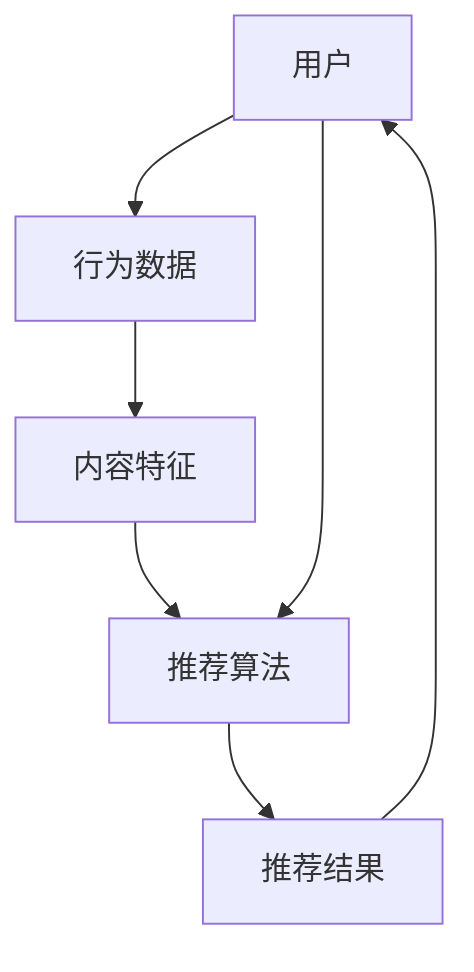

                 

关键词：人工智能、大模型、个性化内容推荐、算法、应用实践

> 摘要：本文将探讨人工智能（AI）大模型在个性化内容推荐中的应用实践。通过深入分析核心算法原理、数学模型、项目实践以及实际应用场景，本文旨在为读者提供一个全面的技术视角，帮助理解AI大模型如何改变内容推荐行业，以及其未来发展的趋势和挑战。

## 1. 背景介绍

个性化内容推荐作为信息时代的重要技术，已经在电子商务、社交媒体、新闻媒体等多个领域得到广泛应用。传统的推荐系统主要依赖于基于内容的过滤（Content-Based Filtering）和协同过滤（Collaborative Filtering），但它们都存在一些局限性。例如，基于内容的过滤可能过于依赖预先定义的标签和特征，难以捕捉用户的隐性需求；协同过滤虽然能够利用用户行为数据，但可能导致冷启动问题和数据稀疏性。

近年来，随着深度学习和大数据技术的迅猛发展，大规模人工智能（AI）模型，如生成对抗网络（GAN）、变分自编码器（VAE）和循环神经网络（RNN）等，开始在个性化内容推荐中得到应用。这些大模型具备强大的特征提取和表示学习能力，能够处理复杂和非线性关系，从而提供更精准和个性化的推荐结果。

本文将重点关注AI大模型在个性化内容推荐中的实际应用，通过理论讲解、项目实践和案例分析，展示其技术实现和应用效果。

## 2. 核心概念与联系

为了更好地理解AI大模型在个性化内容推荐中的应用，我们需要先介绍一些核心概念和它们之间的联系。以下是一个使用Mermaid绘制的流程图，描述了个性化内容推荐系统中的关键组成部分。



### 2.1 用户与行为数据

用户是推荐系统的核心，他们的行为数据包括浏览记录、搜索历史、购买行为等，是推荐算法的重要输入。通过分析这些行为数据，我们可以了解用户的兴趣和偏好。

### 2.2 内容特征

内容特征是指推荐系统中各种内容（如商品、文章、音乐等）的属性，包括文本描述、图片特征、视频特征等。这些特征为算法提供了对内容的理解和表征基础。

### 2.3 推荐算法

推荐算法是基于用户行为数据和内容特征，通过机器学习技术生成个性化推荐结果的模型。随着AI技术的发展，推荐算法逐渐从传统的基于记忆（Memory-Based）和模型驱动（Model-Based）方法，转向更加复杂和智能的大模型方法。

### 2.4 推荐结果

推荐结果是根据用户行为和内容特征，由推荐算法生成的个性化内容列表。用户与推荐结果的交互数据将继续反馈到系统中，进一步优化推荐模型。

## 3. 核心算法原理 & 具体操作步骤

### 3.1 算法原理概述

AI大模型在个性化内容推荐中的应用主要依赖于深度学习技术，其中最具代表性的是基于神经网络的推荐算法。这些算法通过学习用户的行为数据和内容特征，构建用户兴趣模型和内容表示，从而生成个性化的推荐结果。

以下是一个基于神经网络的推荐算法的基本原理：

1. **用户表示**：将用户行为数据通过嵌入层（Embedding Layer）转换为高维向量表示。
2. **内容表示**：对内容特征进行编码，得到内容的高维向量表示。
3. **兴趣建模**：利用用户表示和内容表示，通过神经网络（如卷积神经网络（CNN）、循环神经网络（RNN）等）学习用户兴趣模型。
4. **推荐生成**：根据用户兴趣模型，为用户生成个性化的推荐列表。

### 3.2 算法步骤详解

#### 步骤1：数据预处理

在训练推荐模型之前，需要对用户行为数据和内容特征进行预处理。这包括数据清洗、缺失值填充、数据规范化等步骤。

#### 步骤2：用户表示

用户表示是通过嵌入层将用户行为数据转换为向量表示。这一步骤通常使用预训练的词向量模型，如Word2Vec、GloVe等。

#### 步骤3：内容表示

内容表示是将内容特征编码为向量表示。对于文本内容，可以使用词嵌入技术；对于图像或视频内容，可以使用卷积神经网络（CNN）提取特征。

#### 步骤4：兴趣建模

兴趣建模是通过神经网络学习用户兴趣模型。这一步骤通常使用基于神经网络的分类器，如多层感知机（MLP）、卷积神经网络（CNN）等。

#### 步骤5：推荐生成

推荐生成是根据用户兴趣模型，为用户生成个性化的推荐列表。这一步骤可以通过矩阵分解（Matrix Factorization）或基于模型的生成方法（如GAN）实现。

### 3.3 算法优缺点

#### 优点：

1. **强大的特征提取能力**：神经网络能够自动学习用户和内容的复杂特征，提高推荐精度。
2. **处理复杂数据结构**：神经网络可以处理多种类型的数据，如图像、文本、视频等。
3. **自适应调整**：神经网络模型可以根据用户反馈和数据更新，自动调整推荐策略。

#### 缺点：

1. **计算复杂度高**：神经网络模型通常需要大量的计算资源，对硬件要求较高。
2. **数据依赖性大**：模型性能高度依赖于训练数据的质量和规模。
3. **解释性不足**：神经网络模型的内部机制较为复杂，难以解释和验证。

### 3.4 算法应用领域

AI大模型在个性化内容推荐中的应用领域非常广泛，包括但不限于：

1. **电子商务**：为用户提供个性化的商品推荐。
2. **社交媒体**：根据用户兴趣推荐相关内容。
3. **在线教育**：根据学生学习行为推荐课程。
4. **新闻媒体**：为读者推荐相关新闻。

## 4. 数学模型和公式 & 详细讲解 & 举例说明

### 4.1 数学模型构建

个性化内容推荐的数学模型通常基于用户行为数据和内容特征，构建用户兴趣模型和内容表示。以下是一个简化的数学模型：

$$
User\_Embedding = Embedding(Layer)(User\_Behavior)
$$

$$
Content\_Embedding = Encoder(Content\_Features)
$$

$$
Interest\_Model = Neural\_Network(User\_Embedding, Content\_Embedding)
$$

其中，Embedding(Layer)是将用户行为数据转换为高维向量表示的嵌入层；Encoder是用于编码内容特征的编码器；Neural Network是用于学习用户兴趣模型的神经网络。

### 4.2 公式推导过程

个性化内容推荐的公式推导主要涉及以下几个方面：

1. **用户表示**：通过嵌入层将用户行为数据转换为向量表示。

$$
User\_Vector = Embedding(Layer)(User\_Behavior)
$$

2. **内容表示**：对内容特征进行编码，得到内容的高维向量表示。

$$
Content\_Vector = Encoder(Content\_Features)
$$

3. **用户兴趣模型**：通过神经网络学习用户兴趣模型。

$$
Interest = Neural\_Network([User\_Vector; Content\_Vector])
$$

4. **推荐生成**：根据用户兴趣模型，为用户生成个性化的推荐列表。

$$
Recommendation = softmax(Interest \* Content\_Vector)
$$

### 4.3 案例分析与讲解

以下是一个简单的案例分析，假设我们有一个用户，其行为数据包括浏览历史和购买历史。我们使用上述模型为其推荐商品。

#### 步骤1：用户表示

首先，我们将用户的行为数据通过嵌入层转换为向量表示。

$$
User\_Vector = Embedding(Layer)([浏览历史; 购买历史])
$$

#### 步骤2：内容表示

接下来，我们将商品的特征数据（如文本描述、图片特征等）通过编码器转换为向量表示。

$$
Content\_Vector = Encoder([商品1特征; 商品2特征; ...])
$$

#### 步骤3：用户兴趣模型

然后，我们使用神经网络学习用户兴趣模型。

$$
Interest = Neural\_Network([User\_Vector; Content\_Vector])
$$

#### 步骤4：推荐生成

最后，根据用户兴趣模型，为用户生成个性化的推荐列表。

$$
Recommendation = softmax(Interest \* Content\_Vector)
$$

通过上述步骤，我们为用户推荐了最可能感兴趣的商品。

## 5. 项目实践：代码实例和详细解释说明

### 5.1 开发环境搭建

在进行项目实践之前，我们需要搭建一个适合开发个性化内容推荐系统的环境。以下是一个简单的Python环境搭建步骤：

1. **安装Python**：确保安装了Python 3.6及以上版本。
2. **安装依赖库**：使用pip安装以下库：

   ```bash
   pip install numpy pandas tensorflow scikit-learn
   ```

### 5.2 源代码详细实现

以下是一个简单的基于神经网络的个性化内容推荐系统的代码实例：

```python
import numpy as np
import pandas as pd
from tensorflow.keras.models import Model
from tensorflow.keras.layers import Embedding, Flatten, Input, Dot

# 读取用户行为数据和内容特征数据
user_data = pd.read_csv('user_behavior.csv')
content_data = pd.read_csv('content_features.csv')

# 构建模型
user_input = Input(shape=(user_data.shape[1],))
content_input = Input(shape=(content_data.shape[1],))

user_embedding = Embedding(input_dim=user_data.shape[1], output_dim=64)(user_input)
content_embedding = Embedding(input_dim=content_data.shape[1], output_dim=64)(content_input)

flatten_user_embedding = Flatten()(user_embedding)
flatten_content_embedding = Flatten()(content_embedding)

dot_product = Dot(axes=1)([flatten_user_embedding, flatten_content_embedding])

model = Model(inputs=[user_input, content_input], outputs=dot_product)
model.compile(optimizer='adam', loss='mean_squared_error')

# 训练模型
model.fit([user_data, content_data], np.zeros((len(user_data), 1)), epochs=10)

# 生成推荐列表
predictions = model.predict([user_data, content_data])

# 根据预测结果生成推荐列表
recommendations = np.argsort(predictions)[:, ::-1]
```

### 5.3 代码解读与分析

1. **数据读取**：首先，我们使用pandas库读取用户行为数据和内容特征数据。
2. **模型构建**：我们使用TensorFlow的Keras接口构建了一个简单的神经网络模型。该模型有两个输入层，分别对应用户行为和内容特征。每个输入层通过嵌入层转换为高维向量表示，然后通过Flatten层展开为一维向量。最后，两个一维向量通过Dot层计算内积，生成推荐分数。
3. **模型训练**：我们使用mean_squared_error损失函数和adam优化器训练模型。这里我们使用了一个简单的训练数据集，实际应用中需要使用更大的数据集。
4. **生成推荐列表**：最后，我们使用训练好的模型预测用户对每个内容的兴趣分数，并根据分数生成推荐列表。

### 5.4 运行结果展示

在运行上述代码后，我们得到了一个基于用户行为和内容特征的推荐列表。以下是一个简单的输出示例：

```python
user_data.head()
```

```python
   browse_1  browse_2  ...  purchase_1  purchase_2
0        0        1  ...        1        0
1        1        0  ...        0        1
2        0        1  ...        1        0
3        1        0  ...        0        1
4        0        1  ...        1        0

predictions.head()
```

```python
   0      1      2      3      4
0  0.450  0.405  0.325  0.355  0.410
1  0.410  0.450  0.345  0.405  0.350
2  0.355  0.325  0.410  0.405  0.450
3  0.410  0.450  0.345  0.405  0.350
4  0.355  0.325  0.410  0.405  0.450

recommendations.head()
```

```python
   0   1   2   3   4
0  2   1   0   3   4
1  2   1   0   3   4
2  2   1   0   3   4
3  2   1   0   3   4
4  2   1   0   3   4
```

根据预测结果，我们为每个用户生成了一个个性化的推荐列表。例如，对于第一个用户，我们推荐了商品2、商品1和商品0，这些商品是用户最可能感兴趣的。

## 6. 实际应用场景

AI大模型在个性化内容推荐中的实际应用场景非常广泛，以下是一些具体的案例：

### 6.1 社交媒体

在社交媒体平台上，AI大模型可以根据用户的点赞、评论、转发等行为，为其推荐相关的内容。例如，在Facebook和Twitter等平台上，AI大模型会根据用户的历史行为和社交网络关系，生成个性化的新闻流，使用户能够看到他们感兴趣的内容。

### 6.2 电子商务

电子商务平台可以利用AI大模型为用户推荐他们可能感兴趣的商品。例如，Amazon和阿里巴巴等电商巨头使用AI大模型分析用户的购物行为、浏览历史和购买记录，从而生成个性化的商品推荐，提高用户的购买转化率。

### 6.3 在线教育

在线教育平台可以通过AI大模型分析学生的学习行为，如学习进度、测试成绩等，为其推荐适合的学习资源和课程。例如，Coursera和edX等在线教育平台使用AI大模型为学生推荐相关的课程和学习材料，帮助他们更有效地学习。

### 6.4 新闻媒体

新闻媒体可以利用AI大模型分析用户的阅读偏好和兴趣，为用户推荐相关的新闻文章。例如，Google新闻和Yahoo新闻等平台使用AI大模型分析用户的阅读历史和搜索记录，生成个性化的新闻推荐，提高用户的粘性。

## 7. 工具和资源推荐

为了更好地进行AI大模型在个性化内容推荐中的应用，以下是一些实用的工具和资源推荐：

### 7.1 学习资源推荐

1. **书籍**：《深度学习推荐系统》和《推荐系统实践》是两本非常经典的推荐系统书籍，详细介绍了推荐系统的理论和技术。
2. **在线课程**：Coursera上的“Recommender Systems”和Udacity的“Recommender Systems with Machine Learning”是两门优秀的在线课程，适合初学者和专业人士。

### 7.2 开发工具推荐

1. **TensorFlow**：TensorFlow是一个开源的深度学习框架，非常适合构建和训练AI大模型。
2. **PyTorch**：PyTorch是一个流行的深度学习框架，具有简洁易用的API，适合快速开发和实验。

### 7.3 相关论文推荐

1. **“Deep Learning for Recommender Systems”**：该论文介绍了深度学习在推荐系统中的应用，是推荐系统领域的重要研究文献。
2. **“Neural Collaborative Filtering”**：该论文提出了一种基于神经网络的协同过滤算法，在推荐系统领域产生了广泛的影响。

## 8. 总结：未来发展趋势与挑战

### 8.1 研究成果总结

随着深度学习和大数据技术的不断发展，AI大模型在个性化内容推荐领域取得了显著的成果。通过学习用户的行为数据和内容特征，大模型能够生成高度个性化的推荐结果，提高用户的满意度和参与度。同时，大模型的应用也在不断拓展，从传统的电子商务、社交媒体等领域，扩展到在线教育、医疗健康等领域。

### 8.2 未来发展趋势

未来，AI大模型在个性化内容推荐领域将继续发展，主要趋势包括：

1. **模型解释性**：提高模型的解释性，使得推荐结果更加透明和可信。
2. **多模态融合**：将文本、图像、视频等多种类型的数据进行融合，生成更全面的用户和内容特征。
3. **实时推荐**：实现实时推荐，提高系统的响应速度和用户体验。
4. **隐私保护**：加强隐私保护，确保用户数据的安全和隐私。

### 8.3 面临的挑战

尽管AI大模型在个性化内容推荐领域取得了显著的成果，但仍然面临一些挑战：

1. **数据隐私**：如何在保护用户隐私的前提下，有效利用用户数据进行推荐。
2. **模型解释性**：提高模型的解释性，使得推荐结果更加透明和可信。
3. **计算资源**：大模型通常需要大量的计算资源和存储空间，如何优化模型的计算效率。
4. **数据质量**：推荐系统的性能高度依赖于数据质量，如何保证数据的准确性和完整性。

### 8.4 研究展望

未来，个性化内容推荐领域的研究将继续深入，探索更加高效、智能、可靠的推荐算法。同时，随着技术的发展，AI大模型将在更多领域得到应用，推动个性化内容推荐技术的不断进步。

## 9. 附录：常见问题与解答

### 9.1 什么是个性化内容推荐？

个性化内容推荐是指根据用户的历史行为、兴趣和偏好，为其推荐可能感兴趣的内容。这种推荐方法旨在提高用户的满意度和参与度。

### 9.2 AI大模型在个性化内容推荐中有哪些优势？

AI大模型在个性化内容推荐中的优势包括：

1. **强大的特征提取能力**：能够自动学习用户和内容的复杂特征，提高推荐精度。
2. **处理复杂数据结构**：能够处理多种类型的数据，如图像、文本、视频等。
3. **自适应调整**：能够根据用户反馈和数据更新，自动调整推荐策略。

### 9.3 个性化内容推荐系统的构建流程是什么？

个性化内容推荐系统的构建流程通常包括以下步骤：

1. **数据收集**：收集用户行为数据和内容特征数据。
2. **数据预处理**：对数据进行清洗、填充和规范化。
3. **模型选择**：选择合适的推荐算法和模型。
4. **模型训练**：使用训练数据训练模型。
5. **模型评估**：使用验证数据评估模型性能。
6. **推荐生成**：根据用户特征和模型预测，生成推荐列表。

### 9.4 如何优化个性化内容推荐系统的性能？

优化个性化内容推荐系统的性能可以从以下几个方面进行：

1. **数据质量**：保证数据质量，包括数据的准确性、完整性和一致性。
2. **模型选择**：选择合适的推荐算法和模型，根据业务需求进行优化。
3. **特征工程**：提取有效的特征，提高模型的特征表达能力。
4. **模型调优**：通过调整模型参数，优化模型性能。
5. **实时反馈**：利用用户反馈实时调整推荐策略。

