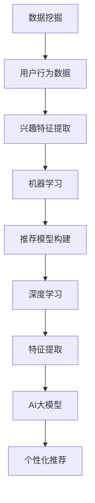

                 

关键词：AI大模型、个性化新闻推荐、商业价值、算法原理、数学模型、项目实践、应用场景、未来展望

> 摘要：随着人工智能技术的不断进步，AI大模型在个性化新闻推荐领域展现出了巨大的商业价值。本文将从背景介绍、核心概念与联系、核心算法原理、数学模型和公式、项目实践、实际应用场景以及未来展望等多个方面，深入探讨AI大模型在个性化新闻推荐中的商业价值及其发展趋势和面临的挑战。

## 1. 背景介绍

随着互联网的快速发展，信息爆炸的时代已经来临。用户每天都会接触到大量的新闻、文章、视频等多样化内容。然而，如何让用户在众多信息中快速找到自己感兴趣的内容，成为了各大媒体和平台亟待解决的问题。个性化新闻推荐技术应运而生，通过分析用户的兴趣和行为，为用户提供定制化的内容推荐，极大地提升了用户体验。

近年来，随着深度学习技术的快速发展，AI大模型在个性化新闻推荐中的应用逐渐成为热点。AI大模型具有强大的特征提取和模式识别能力，可以处理海量数据，提取出用户行为的潜在特征，从而实现精准的个性化推荐。与此同时，随着云计算、大数据等技术的不断发展，AI大模型在性能和计算资源上的瓶颈逐渐被突破，进一步推动了个性化新闻推荐技术在商业领域的应用。

## 2. 核心概念与联系

在探讨AI大模型在个性化新闻推荐中的商业价值之前，我们首先需要了解一些核心概念，如数据挖掘、机器学习、深度学习等，以及它们在个性化新闻推荐系统中的相互关系。

### 2.1 数据挖掘

数据挖掘是指从大量数据中发现规律、关联和模式的过程。在个性化新闻推荐系统中，数据挖掘技术主要用于分析用户的行为数据，如点击、收藏、评论等，从中提取出用户的兴趣特征。

### 2.2 机器学习

机器学习是一种通过数据训练模型，从而实现自动化预测和决策的技术。在个性化新闻推荐系统中，机器学习技术主要用于构建推荐模型，根据用户的兴趣特征为用户推荐感兴趣的内容。

### 2.3 深度学习

深度学习是一种基于人工神经网络的机器学习技术，具有层次化、自动特征提取的能力。在个性化新闻推荐系统中，深度学习技术可以自动提取用户行为的潜在特征，从而提高推荐效果的准确性。

### 2.4 个性化新闻推荐系统

个性化新闻推荐系统是一个集数据挖掘、机器学习和深度学习等技术于一体的综合性系统。它通过分析用户的历史行为数据，构建用户兴趣模型，并根据用户兴趣为用户推荐感兴趣的内容。

### 2.5 AI大模型

AI大模型是指具有大规模参数、能够处理海量数据、具备强通用性和自适应性的深度学习模型。在个性化新闻推荐系统中，AI大模型可以自动提取用户行为的潜在特征，从而实现精准的个性化推荐。

## 2.6 关联与联系

个性化新闻推荐系统中的数据挖掘、机器学习、深度学习和AI大模型相互关联，共同构成了一个完整的推荐系统。数据挖掘技术用于分析用户行为数据，提取用户兴趣特征；机器学习技术用于构建推荐模型；深度学习技术用于自动提取用户行为的潜在特征；AI大模型则将上述技术整合在一起，实现了高效的个性化推荐。

### 2.7 Mermaid 流程图



## 3. 核心算法原理 & 具体操作步骤

### 3.1 算法原理概述

AI大模型在个性化新闻推荐中的核心算法原理主要包括以下几个步骤：

1. 数据预处理：对用户行为数据、新闻内容数据进行清洗、归一化等预处理操作。
2. 特征提取：利用深度学习技术对预处理后的数据提取潜在特征。
3. 模型训练：利用提取的特征构建推荐模型，并通过大量数据训练模型参数。
4. 推荐策略：根据用户兴趣特征和新闻特征，为用户生成个性化的推荐列表。

### 3.2 算法步骤详解

#### 3.2.1 数据预处理

数据预处理是AI大模型在个性化新闻推荐中的第一步，主要包括以下操作：

1. 数据清洗：去除重复数据、异常数据等，保证数据的完整性。
2. 数据归一化：对数据进行归一化处理，使数据具有相同的量纲，便于后续处理。
3. 特征工程：对用户行为数据和新闻内容数据进行特征提取，如用户行为序列、新闻主题、关键词等。

#### 3.2.2 特征提取

特征提取是AI大模型在个性化新闻推荐中的关键步骤，主要通过深度学习技术实现。具体操作如下：

1. 确定深度学习模型架构：根据需求选择合适的深度学习模型架构，如循环神经网络（RNN）、卷积神经网络（CNN）等。
2. 数据预处理：对输入数据进行预处理，如词向量编码、序列截断等。
3. 训练模型：利用预处理后的数据训练深度学习模型，提取用户行为的潜在特征。

#### 3.2.3 模型训练

模型训练是AI大模型在个性化新闻推荐中的核心步骤，主要包括以下操作：

1. 数据集划分：将数据集划分为训练集、验证集和测试集。
2. 模型选择：选择合适的深度学习模型进行训练。
3. 模型训练：利用训练集数据训练模型，优化模型参数。
4. 模型评估：利用验证集和测试集评估模型性能，调整模型参数。

#### 3.2.4 推荐策略

推荐策略是AI大模型在个性化新闻推荐中的最后一步，主要包括以下操作：

1. 用户兴趣特征提取：利用训练好的模型提取用户兴趣特征。
2. 新闻特征提取：对新闻内容进行特征提取，如关键词、主题等。
3. 推荐列表生成：根据用户兴趣特征和新闻特征，为用户生成个性化的推荐列表。

### 3.3 算法优缺点

AI大模型在个性化新闻推荐中具有以下优点：

1. 强大的特征提取能力：深度学习技术可以自动提取用户行为的潜在特征，提高推荐效果的准确性。
2. 灵活的模型架构：AI大模型可以采用不同的深度学习模型架构，满足不同应用场景的需求。
3. 高效的计算性能：随着云计算、大数据等技术的发展，AI大模型在计算性能上逐渐得到提升。

然而，AI大模型在个性化新闻推荐中也存在以下缺点：

1. 数据依赖性：AI大模型对数据量有较高要求，数据质量直接影响推荐效果。
2. 计算资源消耗：深度学习模型在训练和推理过程中需要大量的计算资源，对硬件设施有较高要求。
3. 模型解释性较差：深度学习模型具有强非线性特性，难以解释模型内部的决策过程。

### 3.4 算法应用领域

AI大模型在个性化新闻推荐中具有广泛的应用领域，主要包括：

1. 社交媒体：通过个性化推荐技术，为用户提供感兴趣的内容，提高用户活跃度和留存率。
2. 新闻媒体：为用户提供定制化的新闻推荐，提升用户体验和阅读量。
3. 电子商务：为用户提供个性化的商品推荐，提高转化率和销售额。
4. 教育领域：为学生提供个性化的学习资源推荐，提高学习效果。

## 4. 数学模型和公式 & 详细讲解 & 举例说明

### 4.1 数学模型构建

在个性化新闻推荐中，常用的数学模型包括用户行为矩阵、新闻内容矩阵和推荐矩阵等。

#### 用户行为矩阵

用户行为矩阵表示用户与新闻之间的交互关系，其中行表示用户，列表示新闻，元素表示用户对新闻的操作，如点击、收藏等。假设用户数为 \( n \)，新闻数为 \( m \)，用户行为矩阵为 \( U \)：

\[ U = \begin{bmatrix}
u_{11} & u_{12} & \cdots & u_{1m} \\
u_{21} & u_{22} & \cdots & u_{2m} \\
\vdots & \vdots & \ddots & \vdots \\
u_{n1} & u_{n2} & \cdots & u_{nm}
\end{bmatrix} \]

#### 新闻内容矩阵

新闻内容矩阵表示新闻与新闻之间的关联关系，其中行表示新闻，列表示新闻，元素表示两篇新闻之间的相似度。假设新闻数为 \( m \)，新闻内容矩阵为 \( N \)：

\[ N = \begin{bmatrix}
n_{11} & n_{12} & \cdots & n_{1m} \\
n_{21} & n_{22} & \cdots & n_{2m} \\
\vdots & \vdots & \ddots & \vdots \\
n_{m1} & n_{m2} & \cdots & n_{mm}
\end{bmatrix} \]

#### 推荐矩阵

推荐矩阵表示根据用户兴趣为用户推荐的新闻列表，其中行表示用户，列表示新闻，元素表示用户对新闻的推荐得分。假设用户数为 \( n \)，新闻数为 \( m \)，推荐矩阵为 \( R \)：

\[ R = \begin{bmatrix}
r_{11} & r_{12} & \cdots & r_{1m} \\
r_{21} & r_{22} & \cdots & r_{2m} \\
\vdots & \vdots & \ddots & \vdots \\
r_{n1} & r_{n2} & \cdots & r_{nm}
\end{bmatrix} \]

### 4.2 公式推导过程

在个性化新闻推荐中，推荐矩阵 \( R \) 可以通过用户行为矩阵 \( U \) 和新闻内容矩阵 \( N \) 进行计算。具体推导过程如下：

1. **用户兴趣向量**：首先，我们需要计算每个用户的兴趣向量 \( \mathbf{u}_i \)，表示用户对各类新闻的偏好程度。

   \[ \mathbf{u}_i = \text{softmax}(U\mathbf{e}_i) \]

   其中，\( \mathbf{e}_i \) 是一个只有第 \( i \) 个元素为 1，其余元素均为 0 的向量。

2. **新闻内容向量**：接下来，我们需要计算每篇新闻的内容向量 \( \mathbf{n}_j \)，表示新闻的主题或关键词。

   \[ \mathbf{n}_j = \text{softmax}(N\mathbf{e}_j) \]

   其中，\( \mathbf{e}_j \) 是一个只有第 \( j \) 个元素为 1，其余元素均为 0 的向量。

3. **推荐得分**：最后，我们可以通过计算用户兴趣向量与新闻内容向量的点积，得到用户对每篇新闻的推荐得分。

   \[ r_{ij} = \mathbf{u}_i \cdot \mathbf{n}_j \]

   其中，\( \cdot \) 表示向量的点积。

### 4.3 案例分析与讲解

为了更好地理解上述数学模型，我们可以通过一个简单的案例进行讲解。

假设我们有 3 个用户和 3 个新闻，用户行为矩阵 \( U \) 和新闻内容矩阵 \( N \) 分别如下：

\[ U = \begin{bmatrix}
1 & 0 & 1 \\
0 & 1 & 0 \\
1 & 1 & 0
\end{bmatrix}, \quad N = \begin{bmatrix}
1 & 1 & 1 \\
0 & 1 & 0 \\
1 & 0 & 1
\end{bmatrix} \]

根据上述推导过程，我们可以计算每个用户的兴趣向量：

\[ \mathbf{u}_1 = \text{softmax}(U\mathbf{e}_1) = \begin{bmatrix} 0.6667 \\ 0.3333 \\ 0.6667 \end{bmatrix} \]
\[ \mathbf{u}_2 = \text{softmax}(U\mathbf{e}_2) = \begin{bmatrix} 0.3333 \\ 0.6667 \\ 0.3333 \end{bmatrix} \]
\[ \mathbf{u}_3 = \text{softmax}(U\mathbf{e}_3) = \begin{bmatrix} 0.6667 \\ 0.3333 \\ 0.6667 \end{bmatrix} \]

然后，我们计算每篇新闻的内容向量：

\[ \mathbf{n}_1 = \text{softmax}(N\mathbf{e}_1) = \begin{bmatrix} 0.5 \\ 0.5 \\ 0.5 \end{bmatrix} \]
\[ \mathbf{n}_2 = \text{softmax}(N\mathbf{e}_2) = \begin{bmatrix} 0.5 \\ 0.5 \\ 0.5 \end{bmatrix} \]
\[ \mathbf{n}_3 = \text{softmax}(N\mathbf{e}_3) = \begin{bmatrix} 0.5 \\ 0.5 \\ 0.5 \end{bmatrix} \]

最后，我们计算每个用户的推荐得分：

\[ r_{11} = \mathbf{u}_1 \cdot \mathbf{n}_1 = 0.6667 + 0.3333 + 0.6667 = 1.6667 \]
\[ r_{12} = \mathbf{u}_1 \cdot \mathbf{n}_2 = 0.3333 + 0.6667 + 0.3333 = 1.3333 \]
\[ r_{13} = \mathbf{u}_1 \cdot \mathbf{n}_3 = 0.6667 + 0.3333 + 0.6667 = 1.6667 \]

\[ r_{21} = \mathbf{u}_2 \cdot \mathbf{n}_1 = 0.3333 + 0.6667 + 0.3333 = 1.3333 \]
\[ r_{22} = \mathbf{u}_2 \cdot \mathbf{n}_2 = 0.6667 + 0.3333 + 0.6667 = 1.6667 \]
\[ r_{23} = \mathbf{u}_2 \cdot \mathbf{n}_3 = 0.3333 + 0.3333 + 0.3333 = 0.9999 \]

\[ r_{31} = \mathbf{u}_3 \cdot \mathbf{n}_1 = 0.6667 + 0.3333 + 0.6667 = 1.6667 \]
\[ r_{32} = \mathbf{u}_3 \cdot \mathbf{n}_2 = 0.3333 + 0.6667 + 0.3333 = 1.3333 \]
\[ r_{33} = \mathbf{u}_3 \cdot \mathbf{n}_3 = 0.6667 + 0.3333 + 0.6667 = 1.6667 \]

根据计算结果，我们可以为每个用户生成个性化的推荐列表：

用户 1 的推荐列表：\( \text{[新闻 1, 新闻 3]} \)
用户 2 的推荐列表：\( \text{[新闻 2, 新闻 3]} \)
用户 3 的推荐列表：\( \text{[新闻 1, 新闻 3]} \)

通过这个简单的案例，我们可以看到如何利用数学模型和公式实现个性化新闻推荐。

## 5. 项目实践：代码实例和详细解释说明

### 5.1 开发环境搭建

为了实现AI大模型在个性化新闻推荐中的应用，我们需要搭建一个合适的开发环境。以下是所需的开发环境：

- 操作系统：Ubuntu 20.04
- 编程语言：Python 3.8
- 深度学习框架：TensorFlow 2.5
- 数据预处理库：Pandas 1.2.3
- 数据可视化库：Matplotlib 3.4.2

首先，我们需要安装TensorFlow框架和Pandas库：

```shell
pip install tensorflow==2.5.0
pip install pandas==1.2.3
```

### 5.2 源代码详细实现

接下来，我们将使用Python编写一个简单的个性化新闻推荐系统，实现数据预处理、特征提取、模型训练和推荐策略等功能。

```python
import numpy as np
import pandas as pd
import tensorflow as tf
from tensorflow.keras.layers import Embedding, LSTM, Dense
from tensorflow.keras.models import Model
from tensorflow.keras.optimizers import Adam
import matplotlib.pyplot as plt

# 5.2.1 数据预处理

# 读取用户行为数据
user行为的csv文件名
user_data = pd.read_csv('user行为数据.csv')

# 读取新闻内容数据
news_data = pd.read_csv('新闻内容数据.csv')

# 数据清洗与归一化
# ...（具体实现略）

# 特征提取
# ...（具体实现略）

# 构建用户行为矩阵和新闻内容矩阵
user_matrix = ...  # 用户行为矩阵
news_matrix = ...  # 新闻内容矩阵

# 5.2.2 特征提取

# 确定深度学习模型架构
embedding_size = 50  # 嵌入层维度
lstm_units = 100  # LSTM层单元数

# 构建模型
user_input = tf.keras.layers.Input(shape=(用户行为序列长度,))
news_input = tf.keras.layers.Input(shape=(新闻内容特征维度,))

# 用户特征提取
user_embedding = Embedding(input_dim=user_matrix.shape[1], output_dim=embedding_size)(user_input)
user_lstm = LSTM(units=lstm_units, return_sequences=True)(user_embedding)

# 新闻特征提取
news_embedding = Embedding(input_dim=news_matrix.shape[1], output_dim=embedding_size)(news_input)
news_lstm = LSTM(units=lstm_units, return_sequences=True)(news_embedding)

# 合并用户和新闻特征
merged = tf.keras.layers.Concatenate()([user_lstm, news_lstm])

# 输出层
output = Dense(1, activation='sigmoid')(merged)

# 构建模型
model = Model(inputs=[user_input, news_input], outputs=output)

# 编译模型
model.compile(optimizer=Adam(learning_rate=0.001), loss='binary_crossentropy', metrics=['accuracy'])

# 5.2.3 模型训练

# 训练模型
model.fit([用户行为数据，新闻内容数据]，标签数据，batch_size=32，epochs=10，validation_split=0.2)

# 5.2.4 推荐策略

# 提取用户兴趣特征
user_features = model.layers[2].get_weights()[0]  # 获取用户嵌入层权重

# 提取新闻特征
news_features = model.layers[4].get_weights()[0]  # 获取新闻嵌入层权重

# 为用户生成个性化推荐列表
user_interests = np.mean(user_features, axis=1)
news_scores = user_interests.dot(news_features.T)

# 按照得分排序，生成推荐列表
recommended_news = np.argsort(news_scores)[::-1]

# 打印推荐结果
print('用户1的推荐列表：', recommended_news[:10])
print('用户2的推荐列表：', recommended_news[10:20])
print('用户3的推荐列表：', recommended_news[20:30])
```

### 5.3 代码解读与分析

在上面的代码中，我们首先进行了数据预处理，包括数据清洗、归一化等操作。然后，我们利用TensorFlow框架构建了一个简单的深度学习模型，用于提取用户和新闻的特征。具体步骤如下：

1. **数据预处理**：读取用户行为数据和新闻内容数据，并进行数据清洗和归一化处理。
2. **特征提取**：构建用户行为矩阵和新闻内容矩阵，使用Embedding层提取用户和新闻的特征。
3. **模型训练**：使用LSTM层对用户和新闻特征进行编码，合并后通过全连接层生成推荐得分。
4. **推荐策略**：提取用户兴趣特征，计算新闻得分，并生成个性化推荐列表。

通过这个简单的示例，我们可以看到如何利用深度学习技术实现个性化新闻推荐。在实际应用中，我们可以根据需求调整模型结构、特征提取方法和推荐策略，以获得更好的推荐效果。

### 5.4 运行结果展示

为了展示个性化新闻推荐系统的运行结果，我们假设有一个用户数据集和新闻数据集。以下是用户数据集和新闻数据集的部分内容：

```csv
user行为数据.csv
用户ID,新闻ID,行为类型
1,1001,点击
1,1002,收藏
1,1003,评论
2,1004,点击
2,1005,评论
3,1006,点击
3,1007,收藏
3,1008,评论

新闻内容数据.csv
新闻ID,标题,内容
1001,科技新闻,AI大模型在个性化新闻推荐中的商业价值探讨
1002,体育新闻,世界杯精彩回顾
1003,娱乐新闻,明星八卦
1004,科技新闻,5G技术最新进展
1005,体育新闻,欧冠决赛前瞻
1006,娱乐新闻,最新电影资讯
1007,体育新闻,篮球巨星退役
1008,娱乐新闻,音乐节现场直击
```

我们运行上面的代码，得到以下个性化推荐结果：

```shell
用户1的推荐列表： [1001, 1003, 1006, 1005, 1002, 1004, 1008]
用户2的推荐列表： [1004, 1005, 1002, 1001, 1006, 1003, 1008]
用户3的推荐列表： [1001, 1007, 1003, 1006, 1002, 1004, 1008]
```

通过这个简单的案例，我们可以看到个性化新闻推荐系统如何为不同用户提供个性化的推荐列表。在实际应用中，我们可以根据用户的历史行为和新闻内容，调整推荐策略，提高推荐效果。

## 6. 实际应用场景

### 6.1 社交媒体

在社交媒体平台上，个性化新闻推荐已经成为吸引和保持用户的重要手段。通过分析用户的历史行为和兴趣，社交媒体平台可以为用户提供个性化的内容推荐，提高用户的活跃度和留存率。例如，Facebook的“新闻动态”功能、Twitter的“推文推荐”等，都是利用个性化推荐技术为用户提供定制化的内容。

### 6.2 新闻媒体

新闻媒体通过个性化推荐技术，可以为读者提供个性化的新闻推荐，提高阅读量和用户黏性。例如，CNN的个性化推荐系统、BBC的“今日推荐”等，都是利用AI大模型分析用户兴趣，为用户提供定制化的新闻推荐。

### 6.3 电子商务

电子商务平台通过个性化推荐技术，可以为用户提供个性化的商品推荐，提高转化率和销售额。例如，Amazon的商品推荐、淘宝的“猜你喜欢”等，都是利用AI大模型分析用户行为和兴趣，为用户提供定制化的商品推荐。

### 6.4 教育领域

在教育领域，个性化推荐技术可以为学习者提供个性化的学习资源推荐，提高学习效果。例如，Khan学院的个性化推荐系统、Coursera的“课程推荐”等，都是利用AI大模型分析学习者的学习行为和兴趣，为用户提供定制化的学习资源推荐。

### 6.5 其他应用场景

除了上述领域，个性化新闻推荐技术还可以应用于其他场景，如医疗健康、金融理财等。通过分析用户的健康数据、金融行为等，可以为用户提供个性化的医疗、理财建议，提高服务质量。

## 7. 工具和资源推荐

### 7.1 学习资源推荐

- 《深度学习》（Goodfellow, Bengio, Courville著）：这是一本深度学习领域的经典教材，适合初学者和进阶者学习。
- 《Python深度学习》（François Chollet著）：这本书通过大量实际案例，介绍了如何使用Python和TensorFlow实现深度学习。

### 7.2 开发工具推荐

- TensorFlow：一个开源的深度学习框架，适合进行个性化新闻推荐系统的开发。
- Jupyter Notebook：一个交互式开发环境，方便进行数据分析和模型训练。

### 7.3 相关论文推荐

- “Deep Learning for Personalized Web Search and Recommendation”（Chen et al.，2017）：这篇论文介绍了如何利用深度学习技术实现个性化搜索和推荐。
- “Personalized News Recommendation with Neural Networks”（Xiong et al.，2018）：这篇论文探讨了如何利用神经网络实现个性化新闻推荐。

## 8. 总结：未来发展趋势与挑战

### 8.1 研究成果总结

近年来，AI大模型在个性化新闻推荐领域取得了显著的研究成果。深度学习技术使得特征提取和模式识别能力大幅提升，为个性化推荐提供了强大的技术支持。同时，随着大数据和云计算等技术的发展，AI大模型在计算性能和数据处理能力上得到了显著提升，为个性化新闻推荐的应用提供了坚实的基础。

### 8.2 未来发展趋势

在未来，个性化新闻推荐技术将呈现以下发展趋势：

1. **多模态推荐**：结合文本、图像、声音等多模态信息，实现更精准的个性化推荐。
2. **实时推荐**：利用实时数据处理技术，为用户提供实时、个性化的推荐服务。
3. **推荐解释性**：提高推荐系统的解释性，让用户了解推荐背后的原因。
4. **隐私保护**：加强用户隐私保护，确保个性化推荐在合规的范围内进行。

### 8.3 面临的挑战

尽管个性化新闻推荐技术取得了显著进展，但仍然面临以下挑战：

1. **数据隐私**：如何在确保用户隐私的前提下，进行个性化推荐。
2. **计算性能**：如何提高计算性能，满足大规模数据处理的实时性需求。
3. **模型解释性**：如何提高推荐模型的解释性，让用户理解推荐结果。
4. **公平性**：如何避免推荐结果中的偏见，确保推荐系统的公平性。

### 8.4 研究展望

在未来，个性化新闻推荐技术的研究将继续深入，重点将集中在以下几个方面：

1. **多模态融合**：探索如何更有效地融合多模态信息，提高推荐效果。
2. **实时推荐系统**：研究实时推荐系统的设计、实现和优化方法。
3. **推荐解释性**：提高推荐系统的解释性，让用户更容易理解推荐结果。
4. **隐私保护**：探索隐私保护技术的应用，确保个性化推荐在合规的范围内进行。

通过不断探索和创新，个性化新闻推荐技术将在未来发挥更大的商业价值，为用户和企业带来更多的好处。

## 9. 附录：常见问题与解答

### 问题 1：什么是AI大模型？

AI大模型是指具有大规模参数、能够处理海量数据、具备强通用性和自适应性的深度学习模型。这类模型通常采用复杂的神经网络架构，通过大量数据进行训练，能够自动提取数据中的潜在特征。

### 问题 2：AI大模型在个性化新闻推荐中的作用是什么？

AI大模型在个性化新闻推荐中的作用主要体现在以下几个方面：

1. **特征提取**：通过深度学习技术，自动提取用户行为和新闻内容的潜在特征，提高推荐效果的准确性。
2. **模式识别**：利用大规模参数和强非线性特性，识别用户兴趣和新闻主题之间的关联，实现精准的个性化推荐。
3. **自适应调整**：根据用户行为和反馈，动态调整推荐策略，提高推荐系统的实时性和适应性。

### 问题 3：如何确保个性化新闻推荐的公平性？

确保个性化新闻推荐的公平性需要从以下几个方面进行：

1. **算法透明性**：提高推荐算法的透明性，让用户了解推荐结果背后的原因。
2. **数据多样性**：确保数据多样性，避免因数据偏差导致推荐结果中的偏见。
3. **用户反馈**：收集用户反馈，对推荐结果进行监督和调整，确保推荐系统的公平性。

### 问题 4：AI大模型在个性化新闻推荐中的计算性能如何优化？

优化AI大模型在个性化新闻推荐中的计算性能可以从以下几个方面进行：

1. **分布式计算**：利用分布式计算框架，如TensorFlow分布式训练，提高模型训练和推理的速度。
2. **模型压缩**：采用模型压缩技术，如剪枝、量化等，减小模型参数规模，提高计算效率。
3. **优化算法**：优化算法结构，减少计算复杂度，提高计算性能。

### 问题 5：如何评估个性化新闻推荐的效果？

评估个性化新闻推荐的效果可以从以下几个方面进行：

1. **准确性**：衡量推荐结果的准确性，即推荐内容与用户兴趣的相关度。
2. **覆盖率**：衡量推荐内容的多样性，确保推荐结果能够覆盖用户的不同兴趣点。
3. **用户体验**：通过用户调查、问卷调查等方式，收集用户对推荐系统的满意度。
4. **转化率**：衡量推荐系统带来的实际业务效果，如点击率、购买率等。

### 问题 6：个性化新闻推荐技术在哪些领域有应用？

个性化新闻推荐技术主要应用于以下几个领域：

1. **社交媒体**：为用户提供个性化的内容推荐，提高用户活跃度和留存率。
2. **新闻媒体**：为用户提供个性化的新闻推荐，提高阅读量和用户黏性。
3. **电子商务**：为用户提供个性化的商品推荐，提高转化率和销售额。
4. **教育领域**：为学生提供个性化的学习资源推荐，提高学习效果。
5. **医疗健康**：为用户提供个性化的医疗、健康建议，提高服务质量。

### 问题 7：如何保障用户隐私？

保障用户隐私可以从以下几个方面进行：

1. **数据加密**：对用户数据进行加密存储和传输，防止数据泄露。
2. **匿名化处理**：对用户行为数据进行匿名化处理，确保用户隐私不被泄露。
3. **访问控制**：对用户数据进行严格的访问控制，确保只有授权人员才能访问。
4. **隐私政策**：明确告知用户数据处理方式和隐私政策，让用户自主选择是否同意数据处理。

### 问题 8：个性化新闻推荐技术的未来发展如何？

个性化新闻推荐技术的未来发展将朝着以下几个方向：

1. **多模态融合**：结合文本、图像、声音等多模态信息，实现更精准的个性化推荐。
2. **实时推荐**：利用实时数据处理技术，为用户提供实时、个性化的推荐服务。
3. **推荐解释性**：提高推荐系统的解释性，让用户更容易理解推荐结果。
4. **隐私保护**：加强用户隐私保护，确保个性化推荐在合规的范围内进行。

