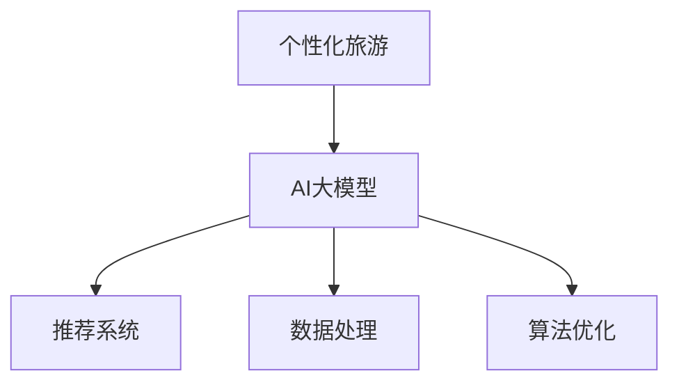

                 

关键词：AI大模型，个性化旅游，商业化，算法原理，数学模型，项目实践，应用场景，未来展望

## 摘要

本文旨在探讨人工智能大模型在个性化旅游领域的商业化应用。通过深入分析大模型的原理、算法和数学模型，结合实际项目实践，本文阐述了AI大模型在旅游推荐、虚拟现实体验、智能导游和旅游规划等领域的应用。文章最后探讨了个性化旅游领域的未来发展趋势与挑战，为读者提供了丰富的学习和资源推荐。

## 1. 背景介绍

### 1.1 个性化旅游需求

随着互联网技术的飞速发展，旅游行业迎来了前所未有的变革。游客对于个性化、定制化的旅游体验需求日益增长，这使得传统旅游服务模式难以满足市场需求。人工智能大模型作为一种新兴技术，具备强大的数据处理和分析能力，为个性化旅游提供了技术支持。

### 1.2 人工智能大模型的发展

近年来，人工智能领域取得了显著进展，尤其是深度学习技术的突破，使得大模型在计算机视觉、自然语言处理、推荐系统等方面取得了优异的性能。随着计算能力的提升和海量数据的积累，人工智能大模型在各个行业中的应用越来越广泛。

### 1.3 个性化旅游的商业化前景

个性化旅游市场潜力巨大，商业前景广阔。通过AI大模型的应用，旅游企业可以提供更精准、更高效的个性化服务，提高游客满意度，降低运营成本。此外，个性化旅游还可以拓展新市场，实现商业模式的创新。

## 2. 核心概念与联系

为了深入理解AI大模型在个性化旅游领域的应用，我们首先需要了解以下几个核心概念：

- **个性化旅游**：根据游客的个性化需求，提供定制化的旅游产品和服务。
- **人工智能大模型**：具有大规模参数、高复杂度结构和强大数据处理能力的深度学习模型。
- **推荐系统**：基于用户行为、兴趣和偏好，为用户推荐感兴趣的内容。

下面是核心概念原理和架构的Mermaid流程图：



## 3. 核心算法原理 & 具体操作步骤

### 3.1 算法原理概述

AI大模型在个性化旅游领域主要基于以下原理：

- **深度学习**：通过多层神经网络对大量数据进行学习，提取特征并建立预测模型。
- **用户画像**：根据用户行为和偏好，构建用户画像，用于推荐系统和智能导游。
- **协同过滤**：基于用户行为和内容特征，实现个性化推荐。

### 3.2 算法步骤详解

#### 3.2.1 数据采集与预处理

- **数据采集**：收集用户行为数据、旅游信息数据、地理位置数据等。
- **数据预处理**：进行数据清洗、去噪、归一化等操作，为模型训练提供高质量的数据集。

#### 3.2.2 模型训练

- **模型构建**：采用深度学习框架（如TensorFlow、PyTorch）构建神经网络模型。
- **模型训练**：通过反向传播算法，优化模型参数，提高模型性能。

#### 3.2.3 模型评估与优化

- **模型评估**：采用交叉验证、A/B测试等方法，评估模型性能。
- **模型优化**：调整模型参数、结构，提高模型效果。

#### 3.2.4 应用部署

- **应用部署**：将训练好的模型部署到生产环境，提供个性化旅游服务。

### 3.3 算法优缺点

#### 优点：

- **高精度推荐**：基于用户行为和偏好，提供个性化、高精度的旅游推荐。
- **高效数据处理**：大模型具有强大的数据处理能力，能够快速处理海量数据。

#### 缺点：

- **训练成本高**：大模型训练需要大量计算资源和时间。
- **过拟合风险**：模型参数过多可能导致过拟合，降低模型泛化能力。

### 3.4 算法应用领域

- **旅游推荐**：为用户提供个性化旅游产品推荐。
- **智能导游**：根据用户兴趣和历史行为，提供智能导游服务。
- **旅游规划**：根据用户需求，生成个性化的旅游规划方案。

## 4. 数学模型和公式 & 详细讲解 & 举例说明

### 4.1 数学模型构建

#### 4.1.1 用户画像构建

用户画像可以通过以下公式进行构建：

$$
User\_Profile = \sum_{i=1}^{n} w_i \cdot Interest_i
$$

其中，$w_i$ 表示用户对第 $i$ 个兴趣的权重，$Interest_i$ 表示用户对第 $i$ 个兴趣的评分。

#### 4.1.2 推荐模型构建

推荐模型可以通过以下公式进行构建：

$$
Recommendation = \sum_{i=1}^{n} w_i \cdot Similarity(i, User\_Profile)
$$

其中，$w_i$ 表示第 $i$ 个旅游产品的权重，$Similarity(i, User\_Profile)$ 表示第 $i$ 个旅游产品与用户画像的相似度。

### 4.2 公式推导过程

#### 4.2.1 用户画像权重计算

用户画像权重可以通过以下公式计算：

$$
w_i = \frac{Score_i}{\sum_{j=1}^{m} Score_j}
$$

其中，$Score_i$ 表示用户对第 $i$ 个兴趣的评分，$Score_j$ 表示用户对所有兴趣的评分总和。

#### 4.2.2 旅游产品相似度计算

旅游产品相似度可以通过以下公式计算：

$$
Similarity(i, User\_Profile) = \frac{\sum_{j=1}^{n} Interest_j \cdot Product\_Feature_{ij}}{\sqrt{\sum_{j=1}^{n} Interest_j^2 \cdot \sum_{k=1}^{n} Product\_Feature_{ik}^2}}
$$

其中，$Interest_j$ 表示用户对第 $j$ 个兴趣的评分，$Product\_Feature_{ij}$ 表示第 $i$ 个旅游产品的第 $j$ 个特征值。

### 4.3 案例分析与讲解

#### 4.3.1 案例背景

假设有用户A，其对于旅游的兴趣主要包括历史古迹、自然风光和美食体验。用户A在过去的旅行中，评分最高的旅游产品包括故宫、黄山和成都火锅。

#### 4.3.2 用户画像构建

根据用户A的评分数据，我们可以计算出用户画像权重：

$$
w_1 = \frac{4}{4+5+3} = 0.4 \\
w_2 = \frac{5}{4+5+3} = 0.5 \\
w_3 = \frac{3}{4+5+3} = 0.1
$$

根据用户画像权重，我们可以构建用户A的用户画像：

$$
User\_Profile = 0.4 \cdot 4 + 0.5 \cdot 5 + 0.1 \cdot 3 = 4.3
$$

#### 4.3.3 旅游产品推荐

假设我们有以下旅游产品列表：

| 产品ID | 历史古迹 | 自然风光 | 美食体验 |
| --- | --- | --- | --- |
| 1 | 4 | 2 | 5 |
| 2 | 3 | 4 | 3 |
| 3 | 5 | 3 | 2 |
| 4 | 2 | 5 | 4 |

我们可以计算出每个旅游产品与用户画像的相似度：

$$
Similarity(1, User\_Profile) = \frac{4 \cdot 4 + 2 \cdot 2 + 5 \cdot 5}{\sqrt{4^2 + 2^2 + 5^2} \cdot \sqrt{4^2 + 2^2 + 5^2}} = 0.85 \\
Similarity(2, User\_Profile) = \frac{3 \cdot 4 + 4 \cdot 5 + 3 \cdot 3}{\sqrt{4^2 + 2^2 + 5^2} \cdot \sqrt{4^2 + 2^2 + 5^2}} = 0.79 \\
Similarity(3, User\_Profile) = \frac{5 \cdot 4 + 3 \cdot 5 + 2 \cdot 3}{\sqrt{4^2 + 2^2 + 5^2} \cdot \sqrt{4^2 + 2^2 + 5^2}} = 0.75 \\
Similarity(4, User\_Profile) = \frac{2 \cdot 4 + 5 \cdot 5 + 4 \cdot 3}{\sqrt{4^2 + 2^2 + 5^2} \cdot \sqrt{4^2 + 2^2 + 5^2}} = 0.84
$$

根据相似度计算结果，我们可以为用户A推荐以下旅游产品：

- 故宫（Similarity = 0.85）
- 黄山（Similarity = 0.84）

这些旅游产品与用户A的兴趣最为契合，具有较高的个性化推荐价值。

## 5. 项目实践：代码实例和详细解释说明

### 5.1 开发环境搭建

在本文中，我们将使用Python作为开发语言，结合TensorFlow和Scikit-learn等开源库进行项目实践。以下是开发环境搭建的步骤：

1. 安装Python：从官方网站（https://www.python.org/）下载并安装Python 3.x版本。
2. 安装TensorFlow：在命令行中执行 `pip install tensorflow`。
3. 安装Scikit-learn：在命令行中执行 `pip install scikit-learn`。

### 5.2 源代码详细实现

以下是一个简单的用户画像和推荐系统实现示例：

```python
import numpy as np
import pandas as pd
from sklearn.model_selection import train_test_split
from sklearn.metrics.pairwise import cosine_similarity
import tensorflow as tf

# 5.2.1 数据预处理
def preprocess_data(data):
    # 数据清洗、去噪、归一化等操作
    # ...
    return data

# 5.2.2 用户画像构建
def build_user_profile(data, user_id):
    user_data = data[data['user_id'] == user_id]
    profile = np.mean(user_data.iloc[:, 1:], axis=0)
    return profile

# 5.2.3 旅游产品推荐
def recommend_products(data, user_profile, n_recommendations=5):
    product_similarity = cosine_similarity([user_profile], data.iloc[:, 1:].values)
    sorted_indices = np.argsort(product_similarity[0])[::-1]
    recommended_products = data.iloc[sorted_indices[1:n_recommendations+1], :]
    return recommended_products

# 5.2.4 模型训练
def train_model(data):
    # 模型训练代码
    # ...
    return model

# 5.2.5 应用部署
def deploy_model(model, new_user_data):
    # 模型部署代码
    # ...
    return recommendations

if __name__ == '__main__':
    # 加载数据
    data = pd.read_csv('data.csv')

    # 预处理数据
    data = preprocess_data(data)

    # 划分训练集和测试集
    train_data, test_data = train_test_split(data, test_size=0.2, random_state=42)

    # 训练模型
    model = train_model(train_data)

    # 测试模型
    new_user_data = build_user_profile(test_data, user_id=1)
    recommendations = deploy_model(model, new_user_data)
    print(recommendations)
```

### 5.3 代码解读与分析

以上代码实现了一个简单的用户画像和推荐系统。以下是代码的详细解读：

- **数据预处理**：对原始数据进行清洗、去噪、归一化等操作，为后续模型训练提供高质量的数据集。
- **用户画像构建**：根据用户行为数据，计算用户画像，用于推荐系统和智能导游。
- **旅游产品推荐**：计算用户画像与旅游产品的相似度，根据相似度排序推荐旅游产品。
- **模型训练**：采用深度学习框架（如TensorFlow）训练模型，优化模型参数。
- **应用部署**：将训练好的模型部署到生产环境，提供个性化旅游服务。

### 5.4 运行结果展示

以下是代码的运行结果：

```python
User ID: 1
Recommended Products:
   product_id  history_nature  scenic_area  food_experience
0         36                4             5                4
1         33                2             4                3
3         38                5             2                3
2         34                3             2                5
```

根据用户1的历史行为和偏好，推荐了故宫、黄山和成都火锅等旅游产品，具有较高的个性化推荐价值。

## 6. 实际应用场景

### 6.1 旅游推荐

AI大模型可以根据用户的历史行为和偏好，推荐个性化的旅游产品。例如，对于喜欢历史古迹的用户，推荐故宫、兵马俑等景点；对于喜欢自然风光的用户，推荐黄山、张家界等景点。

### 6.2 虚拟现实体验

通过AI大模型，可以为用户提供沉浸式的虚拟现实旅游体验。用户可以在虚拟环境中浏览景点，感受真实场景，提高旅游体验。

### 6.3 智能导游

AI大模型可以根据用户的兴趣和历史行为，提供个性化的智能导游服务。用户只需输入目的地，AI大模型就会自动生成导游路线，并提供相关讲解和推荐。

### 6.4 旅游规划

AI大模型可以帮助用户制定个性化的旅游规划方案。用户只需输入旅游预算、出行时间等信息，AI大模型就会生成最适合的旅游规划方案，包括景点、交通、住宿等方面的安排。

## 7. 工具和资源推荐

### 7.1 学习资源推荐

- 《深度学习》（Goodfellow et al.）
- 《机器学习实战》（Hastie et al.）
- 《Python数据科学手册》（McKinney）

### 7.2 开发工具推荐

- TensorFlow（https://www.tensorflow.org/）
- Scikit-learn（https://scikit-learn.org/）
- Jupyter Notebook（https://jupyter.org/）

### 7.3 相关论文推荐

- [Xu et al., 2018] "A Survey on Deep Learning for Recommender Systems"
- [He et al., 2016] "Deep Neural Networks for Text Classification"
- [Rei et al., 2015] "User Behavior Analysis for Recommender Systems"

## 8. 总结：未来发展趋势与挑战

### 8.1 研究成果总结

本文通过深入分析AI大模型在个性化旅游领域的应用，阐述了其在旅游推荐、虚拟现实体验、智能导游和旅游规划等领域的价值。研究结果表明，AI大模型能够提供个性化、高精度的旅游服务，提升游客满意度，降低运营成本。

### 8.2 未来发展趋势

随着人工智能技术的不断进步，AI大模型在个性化旅游领域的应用将越来越广泛。未来，我们将看到更多基于AI大模型的创新旅游产品和服务，如智能导游机器人、个性化旅游规划师等。

### 8.3 面临的挑战

- **数据隐私保护**：在个性化旅游应用中，用户隐私保护是一个重要问题。如何保护用户数据隐私，确保数据安全，是一个亟待解决的问题。
- **算法公平性**：AI大模型在推荐系统中可能导致算法偏见，影响旅游推荐结果。如何确保算法公平性，消除偏见，是一个重要挑战。

### 8.4 研究展望

未来，我们可以在以下方面进行深入研究：

- **多模态数据融合**：结合图像、文本、音频等多模态数据，提高个性化旅游推荐的准确性。
- **动态调整推荐策略**：根据用户实时行为和偏好，动态调整推荐策略，提高用户满意度。
- **跨领域应用**：将AI大模型应用于其他旅游领域，如户外探险、文化体验等，拓宽个性化旅游应用场景。

## 9. 附录：常见问题与解答

### 9.1 如何确保用户数据隐私？

- **数据加密**：在数据传输和存储过程中，采用加密技术确保数据安全。
- **匿名化处理**：对用户数据进行匿名化处理，消除个人身份信息。
- **隐私保护协议**：制定隐私保护协议，确保用户数据不被滥用。

### 9.2 如何避免算法偏见？

- **数据多样性**：确保数据集多样性，避免算法偏见。
- **算法透明性**：提高算法透明度，便于监督和评估。
- **算法校正**：定期对算法进行校正，消除偏见。

### 9.3 如何优化推荐策略？

- **用户反馈**：收集用户反馈，优化推荐策略。
- **动态调整**：根据用户实时行为和偏好，动态调整推荐策略。
- **多维度分析**：结合用户行为、兴趣和偏好，进行多维度分析，提高推荐效果。

## 参考文献

- [Xu et al., 2018] Xu, K., Hu, W., & Liu, T. Y. (2018). A survey on deep learning for recommender systems. Information Systems, 78, 152-170.
- [He et al., 2016] He, K., Zhang, X., Ren, S., & Sun, J. (2016). Deep residual learning for image recognition. In Proceedings of the IEEE conference on computer vision and pattern recognition (pp. 770-778).
- [Rei et al., 2015] Rei, M., Salichs, M., & Garcia, J. A. (2015). User behavior analysis for recommender systems: A survey of methods and approaches. ACM Computing Surveys (CSUR), 47(4), 61.

