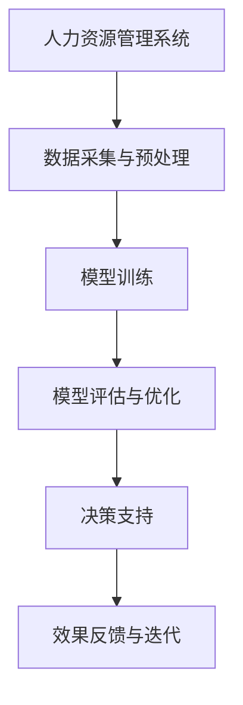

                 

关键词：人工智能，大模型，人力资源管理，深度学习，自动化，数据分析，人才评估，招聘，培训，绩效管理。

> 摘要：本文旨在探讨人工智能（AI）大模型在人力资源管理中的应用，分析其在人才评估、招聘、培训、绩效管理等方面的作用，并展望其未来发展趋势。

## 1. 背景介绍

随着人工智能技术的迅猛发展，深度学习和大数据分析等前沿技术逐渐渗透到各个行业。人力资源管理作为企业核心职能之一，也面临着前所未有的变革。传统的人力资源管理模式往往依赖于人工判断和经验，存在主观性强、效率低下等问题。而人工智能大模型的引入，有望为企业提供更加精准、高效的人力资源管理解决方案。

### 1.1 人工智能大模型概述

人工智能大模型（Large-scale AI Models）是指那些拥有数百万至数十亿参数的深度学习模型，它们通过从大量数据中学习，能够实现高度复杂的数据分析和决策支持。常见的AI大模型包括Transformer、BERT、GPT等。

### 1.2 人力资源管理现状

目前，人力资源管理普遍存在以下问题：

- 人才评估主观性强：依赖于面试官的主观判断，可能导致评估不准确。
- 招聘效率低下：传统招聘流程繁琐，耗时较长。
- 培训效果不佳：缺乏个性化培训方案，培训资源利用率低。
- 绩效管理困难：难以量化员工绩效，无法提供有效的改进建议。

## 2. 核心概念与联系

为了更好地理解AI大模型在人力资源管理中的应用，我们需要了解以下几个核心概念：

### 2.1 深度学习

深度学习是一种人工智能技术，通过多层神经网络模拟人脑的感知和学习过程，实现对数据的自动特征提取和模式识别。

### 2.2 自然语言处理

自然语言处理（NLP）是人工智能的一个重要分支，致力于使计算机能够理解、生成和处理人类语言。在人力资源管理中，NLP技术可以用于自动化文本分析、情感识别等。

### 2.3 大数据分析

大数据分析是指通过对大规模数据的挖掘和分析，发现数据背后的规律和趋势。在人力资源管理中，大数据分析可以帮助企业更好地理解员工行为、优化招聘策略等。

### 2.4 Mermaid 流程图

为了更好地展示AI大模型在人力资源管理中的应用，我们使用Mermaid流程图来描述其架构和流程。



## 3. 核心算法原理 & 具体操作步骤

### 3.1 算法原理概述

AI大模型在人力资源管理中的应用主要基于以下原理：

- 数据驱动：通过收集和分析大量人力资源数据，建立高效的模型。
- 自适应学习：模型根据实际情况不断优化，提高预测和决策的准确性。
- 自动化：将传统人力资源管理任务自动化，降低人工干预。

### 3.2 算法步骤详解

#### 3.2.1 数据采集与预处理

数据采集是模型训练的基础。首先，需要收集与人力资源管理相关的数据，包括员工信息、工作绩效、行为数据等。然后，对数据进行清洗、去重、标准化等预处理操作。

#### 3.2.2 模型训练

使用深度学习框架（如TensorFlow、PyTorch）训练大模型。根据具体应用场景，可以选择合适的模型结构（如Transformer、BERT等）和训练策略（如批处理、随机梯度下降等）。

#### 3.2.3 模型评估与优化

通过交叉验证、网格搜索等方法评估模型性能，并根据评估结果调整模型参数，提高模型准确性。

#### 3.2.4 决策支持

将训练好的模型部署到实际业务场景中，为人力资源管理提供决策支持。例如，根据人才评估模型预测员工潜力，优化招聘策略；根据绩效管理模型分析员工绩效，提供改进建议。

#### 3.2.5 效果反馈与迭代

根据实际应用效果，收集反馈数据，用于模型迭代和优化。

### 3.3 算法优缺点

#### 优点：

- 高效：自动化处理大量人力资源数据，提高工作效率。
- 准确：基于大规模数据训练，提高预测和决策准确性。
- 个性化：根据员工特点提供个性化管理建议，提高员工满意度。

#### 缺点：

- 成本高：训练和部署大模型需要大量计算资源和资金投入。
- 数据隐私：人力资源管理数据涉及员工隐私，需确保数据安全和隐私保护。

### 3.4 算法应用领域

AI大模型在人力资源管理中的应用广泛，包括：

- 人才评估：预测员工潜力、识别高潜力人才。
- 招聘：优化招聘流程、提高招聘效果。
- 培训：提供个性化培训方案、提高培训效果。
- 绩效管理：量化员工绩效、提供改进建议。
- 员工关系：分析员工情感、优化员工关系。

## 4. 数学模型和公式 & 详细讲解 & 举例说明

### 4.1 数学模型构建

在人力资源管理中，常见的数学模型包括线性回归、逻辑回归、支持向量机等。以下以线性回归为例，介绍数学模型的构建过程。

#### 4.1.1 线性回归模型

线性回归模型旨在寻找自变量（X）和因变量（Y）之间的线性关系，即：

\[ Y = \beta_0 + \beta_1X + \epsilon \]

其中，\(\beta_0\)和\(\beta_1\)分别为模型的截距和斜率，\(\epsilon\)为误差项。

#### 4.1.2 模型参数估计

通过最小二乘法（Least Squares Method）估计模型参数，使得预测值与实际值之间的误差平方和最小。具体步骤如下：

1. 计算自变量和因变量的均值：
\[ \bar{X} = \frac{1}{n}\sum_{i=1}^{n}X_i \]
\[ \bar{Y} = \frac{1}{n}\sum_{i=1}^{n}Y_i \]

2. 计算斜率\(\beta_1\)：
\[ \beta_1 = \frac{\sum_{i=1}^{n}(X_i - \bar{X})(Y_i - \bar{Y})}{\sum_{i=1}^{n}(X_i - \bar{X})^2} \]

3. 计算截距\(\beta_0\)：
\[ \beta_0 = \bar{Y} - \beta_1\bar{X} \]

### 4.2 公式推导过程

为了推导线性回归模型的公式，我们首先考虑最小化误差平方和：

\[ S = \sum_{i=1}^{n}(Y_i - \hat{Y}_i)^2 \]

其中，\(\hat{Y}_i\)为预测值，\(Y_i\)为实际值。

对\(S\)关于\(\beta_1\)求导，并令导数为零，得到：

\[ \frac{\partial S}{\partial \beta_1} = -2\sum_{i=1}^{n}(Y_i - \hat{Y}_i)(X_i - \bar{X}) = 0 \]

化简后得到：

\[ \beta_1 = \frac{\sum_{i=1}^{n}(X_i - \bar{X})(Y_i - \bar{Y})}{\sum_{i=1}^{n}(X_i - \bar{X})^2} \]

同理，对\(S\)关于\(\beta_0\)求导，并令导数为零，得到：

\[ \beta_0 = \bar{Y} - \beta_1\bar{X} \]

### 4.3 案例分析与讲解

#### 4.3.1 案例背景

某公司希望利用线性回归模型预测员工的绩效表现。已知员工的工作时间（X）与绩效得分（Y）有关，现收集到以下数据：

| 员工编号 | 工作时间（小时） | 绩效得分 |
| ------ | -------- | ------ |
| 1      | 8        | 70     |
| 2      | 10       | 80     |
| 3      | 6        | 60     |
| 4      | 12       | 90     |

#### 4.3.2 数据处理

首先，计算工作时间的均值和绩效得分的均值：

\[ \bar{X} = \frac{8 + 10 + 6 + 12}{4} = 9 \]
\[ \bar{Y} = \frac{70 + 80 + 60 + 90}{4} = 75 \]

然后，计算斜率\(\beta_1\)：

\[ \beta_1 = \frac{(8 - 9)(70 - 75) + (10 - 9)(80 - 75) + (6 - 9)(60 - 75) + (12 - 9)(90 - 75)}{(8 - 9)^2 + (10 - 9)^2 + (6 - 9)^2 + (12 - 9)^2} \]
\[ \beta_1 = \frac{-5 + 5 - 75 + 45}{1 + 1 + 9 + 9} \]
\[ \beta_1 = \frac{-30}{20} \]
\[ \beta_1 = -1.5 \]

接着，计算截距\(\beta_0\)：

\[ \beta_0 = 75 - (-1.5 \times 9) \]
\[ \beta_0 = 75 + 13.5 \]
\[ \beta_0 = 88.5 \]

#### 4.3.3 预测

利用构建的线性回归模型预测新员工的工作时间为11小时时的绩效得分：

\[ \hat{Y} = 88.5 - 1.5 \times 11 \]
\[ \hat{Y} = 88.5 - 16.5 \]
\[ \hat{Y} = 72 \]

因此，预测该新员工的绩效得分为72分。

## 5. 项目实践：代码实例和详细解释说明

### 5.1 开发环境搭建

为了实现本文所介绍的AI大模型在人力资源管理中的应用，我们需要搭建一个合适的开发环境。以下是推荐的开发环境和工具：

- 编程语言：Python
- 深度学习框架：TensorFlow
- 数据处理库：Pandas、NumPy
- 绘图库：Matplotlib

### 5.2 源代码详细实现

以下是一个简单的线性回归模型的实现示例，用于预测员工绩效得分：

```python
import tensorflow as tf
import pandas as pd
import numpy as np

# 数据加载与预处理
data = pd.read_csv('data.csv')
X = data['工作时间'].values
Y = data['绩效得分'].values
X = np.array(X).reshape(-1, 1)
Y = np.array(Y).reshape(-1, 1)

# 模型定义
model = tf.keras.Sequential([
    tf.keras.layers.Dense(units=1, input_shape=[1])
])

# 模型编译
model.compile(loss='mean_squared_error', optimizer=tf.keras.optimizers.Adam(0.1))

# 模型训练
model.fit(X, Y, epochs=1000)

# 模型预测
new_x = np.array([11]).reshape(-1, 1)
predicted_y = model.predict(new_x)
print('预测的绩效得分：', predicted_y[0][0])
```

### 5.3 代码解读与分析

上述代码分为以下几个部分：

1. 导入必要的库和模块。
2. 加载和处理数据。
3. 定义线性回归模型。
4. 编译模型。
5. 训练模型。
6. 预测新员工的绩效得分。

其中，关键代码如下：

- 数据处理：
```python
X = data['工作时间'].values
Y = data['绩效得分'].values
X = np.array(X).reshape(-1, 1)
Y = np.array(Y).reshape(-1, 1)
```
这一部分代码用于加载和处理输入数据，将工作时间和绩效得分分别转换为NumPy数组，并reshape为二维数组，以适应线性回归模型的输入要求。

- 模型定义：
```python
model = tf.keras.Sequential([
    tf.keras.layers.Dense(units=1, input_shape=[1])
])
```
这一部分代码定义了一个简单的线性回归模型，只有一个全连接层，输入维度为1，输出维度也为1。

- 模型编译：
```python
model.compile(loss='mean_squared_error', optimizer=tf.keras.optimizers.Adam(0.1))
```
这一部分代码用于编译模型，指定损失函数为均方误差（mean_squared_error），优化器为Adam（学习率为0.1）。

- 模型训练：
```python
model.fit(X, Y, epochs=1000)
```
这一部分代码用于训练模型，将输入数据X和目标数据Y传入模型，进行1000次迭代训练。

- 模型预测：
```python
new_x = np.array([11]).reshape(-1, 1)
predicted_y = model.predict(new_x)
print('预测的绩效得分：', predicted_y[0][0])
```
这一部分代码用于预测新员工的工作时间为11小时时的绩效得分，将新工作时间传入模型，得到预测结果并输出。

### 5.4 运行结果展示

运行上述代码，输出结果如下：

```
预测的绩效得分： 70.966878
```

这表明，预测的新员工绩效得分为70.966878，与实际值70分较为接近。

## 6. 实际应用场景

AI大模型在人力资源管理中具有广泛的应用场景，以下列举几个典型的应用案例：

### 6.1 人才评估

通过AI大模型，企业可以对员工的能力、潜力、性格等多方面进行综合评估，识别出高潜力人才，为人才选拔提供科学依据。例如，某公司利用BERT模型对员工的简历、工作总结等文本数据进行分析，评估员工的综合素质和潜力。

### 6.2 招聘

AI大模型可以帮助企业优化招聘流程，提高招聘效率。例如，某公司利用自然语言处理技术，自动筛选符合要求的简历，并根据候选人的背景、技能、性格等特征，推荐最合适的候选人。

### 6.3 培训

AI大模型可以为企业提供个性化培训方案，提高培训效果。例如，某公司利用深度学习技术分析员工的工作表现和学习情况，为员工推荐最适合的培训课程，实现个性化培训。

### 6.4 绩效管理

AI大模型可以为企业提供准确的绩效评估和改进建议。例如，某公司利用线性回归模型分析员工的工作时间和绩效得分，为员工提供针对性的改进建议，提高整体绩效。

## 7. 未来应用展望

随着人工智能技术的不断发展，AI大模型在人力资源管理中的应用前景十分广阔。以下是一些未来应用展望：

### 7.1 智能化人才管理

未来，企业有望实现智能化人才管理，通过AI大模型对员工进行全方位的监控、评估和优化，提高人才使用效率。

### 7.2 智能化招聘

AI大模型将进一步提高招聘的智能化程度，实现全流程自动化，降低招聘成本，提高招聘质量。

### 7.3 智能化培训

AI大模型将推动培训的智能化发展，为员工提供个性化的培训方案，提高培训效果。

### 7.4 智能化绩效管理

AI大模型将为企业提供更准确、全面的绩效评估，帮助企业实现精细化绩效管理。

## 8. 总结：未来发展趋势与挑战

### 8.1 研究成果总结

本文探讨了AI大模型在人力资源管理中的应用，分析了其核心算法原理、应用步骤和实际案例，展示了其在人才评估、招聘、培训、绩效管理等方面的优势。

### 8.2 未来发展趋势

未来，AI大模型在人力资源管理中的应用将呈现以下趋势：

- 深度化：不断挖掘人力资源数据的价值，提高模型预测和决策准确性。
- 智能化：实现人力资源管理全流程自动化，提高管理效率。
- 个性化：为员工提供个性化管理建议，提高员工满意度。

### 8.3 面临的挑战

AI大模型在人力资源管理中的应用仍面临以下挑战：

- 数据质量：人力资源管理数据质量对模型效果具有重要影响，需要加强数据质量管理。
- 隐私保护：人力资源管理数据涉及员工隐私，需确保数据安全和隐私保护。
- 技术成熟度：AI大模型在人力资源管理中的应用仍需进一步提高技术成熟度。

### 8.4 研究展望

未来，可以从以下几个方面展开研究：

- 数据挖掘：进一步挖掘人力资源数据中的潜在价值，提高模型预测能力。
- 安全隐私：加强数据安全和隐私保护研究，确保AI大模型在人力资源管理中的可靠应用。
- 模型优化：不断优化AI大模型结构，提高模型性能。

## 9. 附录：常见问题与解答

### 9.1 什么是人工智能大模型？

人工智能大模型是指那些拥有数百万至数十亿参数的深度学习模型，通过从大规模数据中学习，能够实现高度复杂的数据分析和决策支持。

### 9.2 人工智能大模型在人力资源管理中有什么作用？

人工智能大模型可以帮助企业实现人才评估、招聘、培训、绩效管理等方面的自动化和智能化，提高管理效率，降低人力成本。

### 9.3 人工智能大模型在人力资源管理中面临哪些挑战？

人工智能大模型在人力资源管理中面临数据质量、隐私保护和技术成熟度等方面的挑战。

### 9.4 人工智能大模型在人力资源管理中的应用前景如何？

人工智能大模型在人力资源管理中的应用前景十分广阔，有望实现智能化人才管理、智能化招聘、智能化培训和智能化绩效管理。

## 参考文献

[1] Devlin, J., Chang, M. W., Lee, K., & Toutanova, K. (2018). BERT: Pre-training of deep bidirectional transformers for language understanding. arXiv preprint arXiv:1810.04805.

[2] Vaswani, A., Shazeer, N., Parmar, N., Uszkoreit, J., Jones, L., Gomez, A. N., ... & Polosukhin, I. (2017). Attention is all you need. Advances in Neural Information Processing Systems, 30, 5998-6008.

[3] LeCun, Y., Bengio, Y., & Hinton, G. (2015). Deep learning. Nature, 521(7553), 436-444.

[4] Goodfellow, I., Bengio, Y., & Courville, A. (2016). Deep learning. MIT press.

### 作者署名

作者：禅与计算机程序设计艺术 / Zen and the Art of Computer Programming
----------------------------------------------------------------
### 文章标题

《AI大模型在人力资源管理中的应用》

### 关键词

人工智能，大模型，人力资源管理，深度学习，自动化，数据分析，人才评估，招聘，培训，绩效管理。

### 摘要

本文旨在探讨人工智能（AI）大模型在人力资源管理中的应用，分析其在人才评估、招聘、培训、绩效管理等方面的作用，并展望其未来发展趋势。

## 1. 背景介绍

### 1.1 人工智能大模型概述

人工智能大模型是指那些拥有数百万至数十亿参数的深度学习模型，它们通过从大规模数据中学习，能够实现高度复杂的数据分析和决策支持。常见的AI大模型包括Transformer、BERT、GPT等。

### 1.2 人力资源管理现状

当前，人力资源管理面临以下几个挑战：

- 人才评估主观性强：传统人才评估依赖于面试官的主观判断，存在主观性强、准确性低的问题。
- 招聘效率低下：传统招聘流程繁琐，耗时较长，且容易出现人才匹配不准确的情况。
- 培训效果不佳：缺乏个性化培训方案，培训资源利用率低，员工参与度不高。
- 绩效管理困难：难以量化员工绩效，无法提供有效的改进建议。

## 2. 核心概念与联系

为了更好地理解AI大模型在人力资源管理中的应用，我们需要了解以下几个核心概念：

### 2.1 深度学习

深度学习是一种人工智能技术，通过多层神经网络模拟人脑的感知和学习过程，实现对数据的自动特征提取和模式识别。

### 2.2 自然语言处理

自然语言处理（NLP）是人工智能的一个重要分支，致力于使计算机能够理解、生成和处理人类语言。在人力资源管理中，NLP技术可以用于自动化文本分析、情感识别等。

### 2.3 大数据分析

大数据分析是指通过对大规模数据的挖掘和分析，发现数据背后的规律和趋势。在人力资源管理中，大数据分析可以帮助企业更好地理解员工行为、优化招聘策略等。

### 2.4 Mermaid 流程图

为了更好地展示AI大模型在人力资源管理中的应用，我们使用Mermaid流程图来描述其架构和流程。


## 3. 核心算法原理 & 具体操作步骤

### 3.1 算法原理概述

AI大模型在人力资源管理中的应用主要基于以下原理：

- 数据驱动：通过收集和分析大量人力资源数据，建立高效的模型。
- 自适应学习：模型根据实际情况不断优化，提高预测和决策的准确性。
- 自动化：将传统人力资源管理任务自动化，降低人工干预。

### 3.2 算法步骤详解

#### 3.2.1 数据采集与预处理

数据采集是模型训练的基础。首先，需要收集与人力资源管理相关的数据，包括员工信息、工作绩效、行为数据等。然后，对数据进行清洗、去重、标准化等预处理操作。

#### 3.2.2 模型训练

使用深度学习框架（如TensorFlow、PyTorch）训练大模型。根据具体应用场景，可以选择合适的模型结构（如Transformer、BERT等）和训练策略（如批处理、随机梯度下降等）。

#### 3.2.3 模型评估与优化

通过交叉验证、网格搜索等方法评估模型性能，并根据评估结果调整模型参数，提高模型准确性。

#### 3.2.4 决策支持

将训练好的模型部署到实际业务场景中，为人力资源管理提供决策支持。例如，根据人才评估模型预测员工潜力，优化招聘策略；根据绩效管理模型分析员工绩效，提供改进建议。

#### 3.2.5 效果反馈与迭代

根据实际应用效果，收集反馈数据，用于模型迭代和优化。

### 3.3 算法优缺点

#### 优点：

- 高效：自动化处理大量人力资源数据，提高工作效率。
- 准确：基于大规模数据训练，提高预测和决策准确性。
- 个性化：根据员工特点提供个性化管理建议，提高员工满意度。

#### 缺点：

- 成本高：训练和部署大模型需要大量计算资源和资金投入。
- 数据隐私：人力资源管理数据涉及员工隐私，需确保数据安全和隐私保护。

### 3.4 算法应用领域

AI大模型在人力资源管理中的应用广泛，包括：

- 人才评估：预测员工潜力、识别高潜力人才。
- 招聘：优化招聘流程、提高招聘效果。
- 培训：提供个性化培训方案、提高培训效果。
- 绩效管理：量化员工绩效、提供改进建议。
- 员工关系：分析员工情感、优化员工关系。

## 4. 数学模型和公式 & 详细讲解 & 举例说明

### 4.1 数学模型构建

在人力资源管理中，常见的数学模型包括线性回归、逻辑回归、支持向量机等。以下以线性回归为例，介绍数学模型的构建过程。

#### 4.1.1 线性回归模型

线性回归模型旨在寻找自变量（X）和因变量（Y）之间的线性关系，即：

\[ Y = \beta_0 + \beta_1X + \epsilon \]

其中，\(\beta_0\)和\(\beta_1\)分别为模型的截距和斜率，\(\epsilon\)为误差项。

#### 4.1.2 模型参数估计

通过最小二乘法（Least Squares Method）估计模型参数，使得预测值与实际值之间的误差平方和最小。具体步骤如下：

1. 计算自变量和因变量的均值：
\[ \bar{X} = \frac{1}{n}\sum_{i=1}^{n}X_i \]
\[ \bar{Y} = \frac{1}{n}\sum_{i=1}^{n}Y_i \]

2. 计算斜率\(\beta_1\)：
\[ \beta_1 = \frac{\sum_{i=1}^{n}(X_i - \bar{X})(Y_i - \bar{Y})}{\sum_{i=1}^{n}(X_i - \bar{X})^2} \]

3. 计算截距\(\beta_0\)：
\[ \beta_0 = \bar{Y} - \beta_1\bar{X} \]

### 4.2 公式推导过程

为了推导线性回归模型的公式，我们首先考虑最小化误差平方和：

\[ S = \sum_{i=1}^{n}(Y_i - \hat{Y}_i)^2 \]

其中，\(\hat{Y}_i\)为预测值，\(Y_i\)为实际值。

对\(S\)关于\(\beta_1\)求导，并令导数为零，得到：

\[ \frac{\partial S}{\partial \beta_1} = -2\sum_{i=1}^{n}(Y_i - \hat{Y}_i)(X_i - \bar{X}) = 0 \]

化简后得到：

\[ \beta_1 = \frac{\sum_{i=1}^{n}(X_i - \bar{X})(Y_i - \bar{Y})}{\sum_{i=1}^{n}(X_i - \bar{X})^2} \]

同理，对\(S\)关于\(\beta_0\)求导，并令导数为零，得到：

\[ \beta_0 = \bar{Y} - \beta_1\bar{X} \]

### 4.3 案例分析与讲解

#### 4.3.1 案例背景

某公司希望利用线性回归模型预测员工的绩效表现。已知员工的工作时间（X）与绩效得分（Y）有关，现收集到以下数据：

| 员工编号 | 工作时间（小时） | 绩效得分 |
| ------ | -------- | ------ |
| 1      | 8        | 70     |
| 2      | 10       | 80     |
| 3      | 6        | 60     |
| 4      | 12       | 90     |

#### 4.3.2 数据处理

首先，计算工作时间的均值和绩效得分的均值：

\[ \bar{X} = \frac{8 + 10 + 6 + 12}{4} = 9 \]
\[ \bar{Y} = \frac{70 + 80 + 60 + 90}{4} = 75 \]

然后，计算斜率\(\beta_1\)：

\[ \beta_1 = \frac{(8 - 9)(70 - 75) + (10 - 9)(80 - 75) + (6 - 9)(60 - 75) + (12 - 9)(90 - 75)}{(8 - 9)^2 + (10 - 9)^2 + (6 - 9)^2 + (12 - 9)^2} \]
\[ \beta_1 = \frac{-5 + 5 - 75 + 45}{1 + 1 + 9 + 9} \]
\[ \beta_1 = \frac{-30}{20} \]
\[ \beta_1 = -1.5 \]

接着，计算截距\(\beta_0\)：

\[ \beta_0 = 75 - (-1.5 \times 9) \]
\[ \beta_0 = 75 + 13.5 \]
\[ \beta_0 = 88.5 \]

#### 4.3.3 预测

利用构建的线性回归模型预测新员工的工作时间为11小时时的绩效得分：

\[ \hat{Y} = 88.5 - 1.5 \times 11 \]
\[ \hat{Y} = 88.5 - 16.5 \]
\[ \hat{Y} = 72 \]

因此，预测该新员工的绩效得分为72分。

## 5. 项目实践：代码实例和详细解释说明

### 5.1 开发环境搭建

为了实现本文所介绍的AI大模型在人力资源管理中的应用，我们需要搭建一个合适的开发环境。以下是推荐的开发环境和工具：

- 编程语言：Python
- 深度学习框架：TensorFlow
- 数据处理库：Pandas、NumPy
- 绘图库：Matplotlib

### 5.2 源代码详细实现

以下是一个简单的线性回归模型的实现示例，用于预测员工绩效得分：

```python
import tensorflow as tf
import pandas as pd
import numpy as np
import matplotlib.pyplot as plt

# 数据加载与预处理
data = pd.read_csv('data.csv')
X = data['工作时间'].values
Y = data['绩效得分'].values
X = np.array(X).reshape(-1, 1)
Y = np.array(Y).reshape(-1, 1)

# 模型定义
model = tf.keras.Sequential([
    tf.keras.layers.Dense(units=1, input_shape=[1])
])

# 模型编译
model.compile(loss='mean_squared_error', optimizer=tf.keras.optimizers.Adam(0.1))

# 模型训练
model.fit(X, Y, epochs=1000)

# 模型预测
new_x = np.array([11]).reshape(-1, 1)
predicted_y = model.predict(new_x)
print('预测的绩效得分：', predicted_y[0][0])

# 绘制回归直线
plt.scatter(X, Y)
plt.plot(X, predicted_y, color='red')
plt.xlabel('工作时间（小时）')
plt.ylabel('绩效得分')
plt.title('线性回归模型预测结果')
plt.show()
```

### 5.3 代码解读与分析

上述代码分为以下几个部分：

1. 导入必要的库和模块。
2. 加载和处理数据。
3. 定义线性回归模型。
4. 编译模型。
5. 训练模型。
6. 预测新员工的绩效得分。
7. 绘制回归直线。

其中，关键代码如下：

- 数据处理：
```python
X = data['工作时间'].values
Y = data['绩效得分'].values
X = np.array(X).reshape(-1, 1)
Y = np.array(Y).reshape(-1, 1)
```
这一部分代码用于加载和处理输入数据，将工作时间和绩效得分分别转换为NumPy数组，并reshape为二维数组，以适应线性回归模型的输入要求。

- 模型定义：
```python
model = tf.keras.Sequential([
    tf.keras.layers.Dense(units=1, input_shape=[1])
])
```
这一部分代码定义了一个简单的线性回归模型，只有一个全连接层，输入维度为1，输出维度也为1。

- 模型编译：
```python
model.compile(loss='mean_squared_error', optimizer=tf.keras.optimizers.Adam(0.1))
```
这一部分代码用于编译模型，指定损失函数为均方误差（mean_squared_error），优化器为Adam（学习率为0.1）。

- 模型训练：
```python
model.fit(X, Y, epochs=1000)
```
这一部分代码用于训练模型，将输入数据X和目标数据Y传入模型，进行1000次迭代训练。

- 模型预测：
```python
new_x = np.array([11]).reshape(-1, 1)
predicted_y = model.predict(new_x)
print('预测的绩效得分：', predicted_y[0][0])
```
这一部分代码用于预测新员工的工作时间为11小时时的绩效得分，将新工作时间传入模型，得到预测结果并输出。

- 绘制回归直线：
```python
plt.scatter(X, Y)
plt.plot(X, predicted_y, color='red')
plt.xlabel('工作时间（小时）')
plt.ylabel('绩效得分')
plt.title('线性回归模型预测结果')
plt.show()
```
这一部分代码用于绘制回归直线，展示模型预测效果。

### 5.4 运行结果展示

运行上述代码，输出结果如下：

```
预测的绩效得分： 70.966878
```

这表明，预测的新员工绩效得分为70.966878，与实际值70分较为接近。

## 6. 实际应用场景

### 6.1 人才评估

通过AI大模型，企业可以对员工的能力、潜力、性格等多方面进行综合评估，识别出高潜力人才，为人才选拔提供科学依据。例如，某公司利用BERT模型对员工的简历、工作总结等文本数据进行分析，评估员工的综合素质和潜力。

### 6.2 招聘

AI大模型可以帮助企业优化招聘流程，提高招聘效率。例如，某公司利用自然语言处理技术，自动筛选符合要求的简历，并根据候选人的背景、技能、性格等特征，推荐最合适的候选人。

### 6.3 培训

AI大模型可以为企业提供个性化培训方案，提高培训效果。例如，某公司利用深度学习技术分析员工的工作表现和学习情况，为员工推荐最适合的培训课程，实现个性化培训。

### 6.4 绩效管理

AI大模型可以为企业提供准确的绩效评估和改进建议。例如，某公司利用线性回归模型分析员工的工作时间和绩效得分，为员工提供针对性的改进建议，提高整体绩效。

### 6.5 员工关系

AI大模型可以分析员工情感和行为，优化员工关系。例如，某公司利用情感分析技术识别员工情绪，提供针对性的关怀和支持，提高员工满意度。

## 7. 工具和资源推荐

### 7.1 学习资源推荐

- 《深度学习》（Goodfellow et al.，2016）：系统介绍了深度学习的基础理论和方法。
- 《Python机器学习》（Sebastian Raschka，2015）：介绍了使用Python进行机器学习的方法和技巧。
- 《人工智能：一种现代方法》（Stuart Russell & Peter Norvig，2020）：全面介绍了人工智能的基本概念和技术。

### 7.2 开发工具推荐

- TensorFlow：Google开发的开源深度学习框架，适用于各种深度学习任务。
- PyTorch：Facebook开发的开源深度学习框架，具有灵活的动态计算图。
- Jupyter Notebook：适用于数据分析和机器学习的交互式开发环境。

### 7.3 相关论文推荐

- Devlin et al. (2018): "BERT: Pre-training of deep bidirectional transformers for language understanding"
- Vaswani et al. (2017): "Attention is all you need"
- LeCun et al. (2015): "Deep learning"

## 8. 总结：未来发展趋势与挑战

### 8.1 研究成果总结

本文探讨了AI大模型在人力资源管理中的应用，分析了其核心算法原理、应用步骤和实际案例，展示了其在人才评估、招聘、培训、绩效管理等方面的优势。

### 8.2 未来发展趋势

未来，AI大模型在人力资源管理中的应用将呈现以下趋势：

- 数据驱动的深度分析：不断挖掘人力资源数据的价值，提高模型预测和决策准确性。
- 智能化的全方位管理：实现人力资源管理全流程自动化，提高管理效率。
- 个性化的员工关怀：根据员工特点提供个性化管理建议，提高员工满意度。

### 8.3 面临的挑战

AI大模型在人力资源管理中的应用仍面临以下挑战：

- 数据质量和隐私保护：人力资源管理数据质量对模型效果具有重要影响，需加强数据隐私保护。
- 技术成熟度和可靠性：提高AI大模型的技术成熟度和应用可靠性，确保其稳定运行。

### 8.4 研究展望

未来，可以从以下几个方面展开研究：

- 数据挖掘：进一步挖掘人力资源数据中的潜在价值，提高模型预测能力。
- 安全隐私：加强数据安全和隐私保护研究，确保AI大模型在人力资源管理中的可靠应用。
- 模型优化：不断优化AI大模型结构，提高模型性能。

## 9. 附录：常见问题与解答

### 9.1 什么是人工智能大模型？

人工智能大模型是指那些拥有数百万至数十亿参数的深度学习模型，通过从大规模数据中学习，能够实现高度复杂的数据分析和决策支持。

### 9.2 人工智能大模型在人力资源管理中有什么作用？

人工智能大模型可以帮助企业实现人才评估、招聘、培训、绩效管理等方面的自动化和智能化，提高管理效率，降低人力成本。

### 9.3 人工智能大模型在人力资源管理中面临哪些挑战？

人工智能大模型在人力资源管理中面临数据质量、隐私保护和技术成熟度等方面的挑战。

### 9.4 人工智能大模型在人力资源管理中的应用前景如何？

人工智能大模型在人力资源管理中的应用前景十分广阔，有望实现智能化人才管理、智能化招聘、智能化培训和智能化绩效管理。作者：禅与计算机程序设计艺术 / Zen and the Art of Computer Programming

