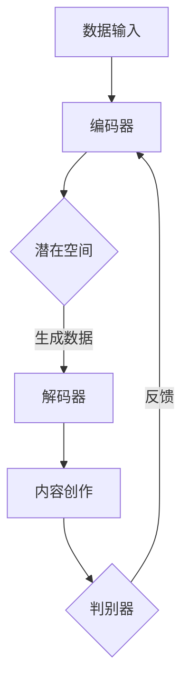

                 

  
## 1. 背景介绍

在当今信息爆炸的时代，内容创作已成为数字经济的核心驱动力之一。无论是新闻媒体、广告营销，还是社交媒体、电子商务，内容都是吸引用户、提高用户粘性的关键要素。然而，随着用户对内容质量和个性化需求的不断提高，传统的手动内容创作方式面临着巨大的挑战和瓶颈。

AI大模型的崛起为内容创作带来了全新的机遇。大模型，尤其是基于深度学习的技术，如生成对抗网络（GAN）、变分自编码器（VAE）等，可以在大规模数据集上进行训练，从而生成高质量、多样化且富有创意的内容。这不仅提高了内容创作的效率，也大大降低了创作成本。

然而，AI大模型在内容创作领域的商业化探索并非一帆风顺。如何确保内容质量、避免潜在的道德和版权问题、制定合理的商业模式，这些都是需要深入探讨的问题。本文将围绕这些问题，探讨AI大模型在内容创作领域的商业化路径和未来前景。

## 2. 核心概念与联系

在探讨AI大模型在内容创作领域的应用之前，有必要首先了解一些核心概念和它们之间的联系。

### 2.1. 生成对抗网络（GAN）

生成对抗网络（GAN）是由Ian Goodfellow等人于2014年提出的一种深度学习模型。GAN的核心思想是利用两个神经网络——生成器（Generator）和判别器（Discriminator）之间的对抗训练来实现图像、文本、音频等多种类型的数据生成。

- **生成器**：试图生成逼真的数据，以欺骗判别器。
- **判别器**：判断输入数据是真实数据还是生成器生成的假数据。

通过这种对抗训练，生成器不断优化，以生成更接近真实数据的假数据，而判别器则不断提高辨别能力。随着训练的进行，生成器生成的数据质量会越来越高，甚至达到以假乱真的程度。

### 2.2. 变分自编码器（VAE）

变分自编码器（VAE）是另一种流行的深度学习模型，它在生成数据的多样性和质量上具有独特的优势。VAE通过引入概率分布的概念，对数据生成过程进行建模。

- **编码器**：将输入数据映射到一个潜在空间。
- **解码器**：从潜在空间中生成数据。

VAE通过最大化数据生成过程中的概率密度来训练模型，这使得生成器能够生成更加多样化和高质量的样本。

### 2.3. AI大模型与内容创作

AI大模型，如基于Transformer的模型（如GPT-3、BERT等），通过在大量数据上进行预训练，可以理解并生成复杂的文本、图像和音频内容。这些模型的核心优势在于：

- **高容量**：能够处理和理解大规模、多样化的数据。
- **强泛化能力**：通过预训练，能够适应多种不同的内容创作任务。
- **高效性**：在给定任务和数据集上，可以快速生成高质量的内容。

### 2.4. Mermaid 流程图

以下是一个描述GAN在内容创作中应用的Mermaid流程图：



在这个流程中，编码器将输入数据映射到潜在空间，解码器从潜在空间中生成数据，从而实现内容创作。判别器则用于评估生成数据的真实性，以提供反馈，帮助模型优化。

## 3. 核心算法原理 & 具体操作步骤

### 3.1 算法原理概述

AI大模型在内容创作中的应用主要依赖于生成模型，其中GAN和VAE是最常用的两种模型。

### 3.2 算法步骤详解

#### 3.2.1 GAN的具体操作步骤

1. **初始化生成器和判别器**：生成器G和判别器D都是深度神经网络，通常采用卷积神经网络（CNN）或循环神经网络（RNN）架构。
2. **生成假数据**：生成器G从随机噪声中生成假数据，这些数据与真实数据尽可能相似。
3. **训练判别器**：判别器D接收真实数据和假数据，并尝试区分它们。
4. **训练生成器**：生成器G根据判别器的反馈进行优化，以生成更逼真的假数据。

#### 3.2.2 VAE的具体操作步骤

1. **编码器训练**：编码器E将输入数据编码到一个潜在空间中，潜在空间的维度较低，便于解码。
2. **解码器训练**：解码器D从潜在空间中生成数据，尝试恢复输入数据的特征。
3. **整体模型训练**：编码器和解码器共同优化，以最大化数据的重建概率。

### 3.3 算法优缺点

#### 优点

- **高质量生成**：GAN和VAE都能生成高质量、多样化的内容。
- **强泛化能力**：预训练模型能够适应多种内容创作任务。

#### 缺点

- **训练难度**：GAN和VAE都需要大量的计算资源和时间进行训练。
- **模型不稳定**：GAN的训练过程容易陷入模式崩溃或梯度消失等问题。

### 3.4 算法应用领域

AI大模型在内容创作中的应用非常广泛，包括但不限于：

- **文本生成**：生成新闻文章、小说、博客等。
- **图像生成**：生成艺术作品、广告海报、卡通形象等。
- **音频生成**：生成音乐、语音合成等。

## 4. 数学模型和公式 & 详细讲解 & 举例说明

### 4.1 数学模型构建

#### GAN的数学模型

GAN的数学模型可以表示为：

\[ D(x) = P(x \text{ from dataset}) \]
\[ G(z) = x \]

其中，\( D \) 为判别器，\( G \) 为生成器，\( z \) 为噪声向量。

#### VAE的数学模型

VAE的数学模型可以表示为：

\[ q_{\phi}(x|\mu, \sigma) = \frac{1}{Z} \exp\left(-\frac{1}{2} (x - \mu)^2 / \sigma^2\right) \]
\[ p_\theta(x) = \int q_{\phi}(x|\mu, \sigma) p_{\theta}(\mu, \sigma) d\mu d\sigma \]

其中，\( q_{\phi} \) 为编码器，\( p_\theta \) 为解码器。

### 4.2 公式推导过程

#### GAN的推导过程

GAN的目标是最小化以下损失函数：

\[ L_D = -\mathbb{E}_{x \sim p_{data}(x)}[\log D(x)] - \mathbb{E}_{z \sim p_z(z)}[\log(1 - D(G(z)))] \]
\[ L_G = -\mathbb{E}_{z \sim p_z(z)}[\log D(G(z))] \]

其中，\( L_D \) 为判别器的损失函数，\( L_G \) 为生成器的损失函数。

#### VAE的推导过程

VAE的目标是最小化以下损失函数：

\[ L = \mathbb{E}_{x \sim p_{data}(x)}[-\log p_\theta(x)] + \text{KLD}(q_{\phi}(x|\mu, \sigma); p_\theta(x)) \]

其中，\( \text{KLD} \) 为KL散度。

### 4.3 案例分析与讲解

#### GAN在图像生成中的应用

假设我们有一个GAN模型，用于生成猫的图像。训练数据集包含大量真实猫的图像。

1. **初始化**：生成器G和判别器D。
2. **训练**：生成器G生成假猫图像，判别器D根据真猫图像和假猫图像进行训练。
3. **优化**：生成器G根据判别器D的反馈进行优化。

经过多次迭代，生成器G可以生成越来越逼真的猫图像。

#### VAE在文本生成中的应用

假设我们有一个VAE模型，用于生成英文新闻文章。训练数据集包含大量英文新闻文章。

1. **编码器训练**：编码器E将输入文章编码到潜在空间。
2. **解码器训练**：解码器D从潜在空间中生成文章。
3. **整体模型训练**：编码器和解码器共同优化。

经过训练，VAE可以生成高质量、多样化的英文新闻文章。

## 5. 项目实践：代码实例和详细解释说明

### 5.1 开发环境搭建

在本地环境搭建开发环境，我们需要安装以下工具和库：

- Python 3.8+
- TensorFlow 2.4+
- Keras 2.4+
- Nvidia CUDA Toolkit 10.1+

安装步骤：

1. 安装Python和pip。
2. 安装TensorFlow和Keras。

```bash
pip install tensorflow
pip install keras
```

3. 安装Nvidia CUDA Toolkit。

### 5.2 源代码详细实现

以下是一个简单的GAN模型，用于生成猫的图像。

```python
import numpy as np
import tensorflow as tf
from tensorflow.keras.layers import Conv2D, Flatten, Dense
from tensorflow.keras.models import Model

# 生成器模型
def build_generator():
    noise = tf.keras.layers.Input(shape=(100,))
    x = tf.keras.layers.Dense(128 * 8 * 8)(noise)
    x = tf.keras.layers.LeakyReLU(alpha=0.01)(x)
    x = tf.keras.layers.Dense(128 * 16 * 16)(x)
    x = tf.keras.layers.LeakyReLU(alpha=0.01)(x)
    x = tf.keras.layers.Reshape((16, 16, 128))(x)
    x = tf.keras.layers.Conv2D(128, kernel_size=(3, 3), strides=(2, 2))(x)
    x = tf.keras.layers.LeakyReLU(alpha=0.01)(x)
    x = tf.keras.layers.Conv2D(128, kernel_size=(3, 3), strides=(2, 2))(x)
    x = tf.keras.layers.LeakyReLU(alpha=0.01)(x)
    x = tf.keras.layers.Conv2D(128, kernel_size=(3, 3), strides=(2, 2))(x)
    x = tf.keras.layers.LeakyReLU(alpha=0.01)(x)
    x = tf.keras.layers.Conv2D(128, kernel_size=(3, 3), strides=(2, 2))(x)
    x = tf.keras.layers.LeakyReLU(alpha=0.01)(x)
    x = tf.keras.layers.Conv2D(3, kernel_size=(3, 3), activation='tanh', padding='same')(x)
    model = Model(inputs=noise, outputs=x)
    return model

# 判别器模型
def build_discriminator():
    image = tf.keras.layers.Input(shape=(64, 64, 3))
    x = tf.keras.layers.Conv2D(128, kernel_size=(3, 3), strides=(2, 2))(image)
    x = tf.keras.layers.LeakyReLU(alpha=0.01)(x)
    x = tf.keras.layers.Conv2D(128, kernel_size=(3, 3), strides=(2, 2))(x)
    x = tf.keras.layers.LeakyReLU(alpha=0.01)(x)
    x = tf.keras.layers.Conv2D(128, kernel_size=(3, 3), strides=(2, 2))(x)
    x = tf.keras.layers.LeakyReLU(alpha=0.01)(x)
    x = tf.keras.layers.Conv2D(128, kernel_size=(3, 3), strides=(2, 2))(x)
    x = tf.keras.layers.LeakyReLU(alpha=0.01)(x)
    x = tf.keras.layers.Flatten()(x)
    x = tf.keras.layers.Dense(128)(x)
    x = tf.keras.layers.LeakyReLU(alpha=0.01)(x)
    x = tf.keras.layers.Dense(1, activation='sigmoid')(x)
    model = Model(inputs=image, outputs=x)
    return model

# 搭建GAN模型
def build_gan(generator, discriminator):
    generator_output = discriminator(generator inputs)
    model = Model(inputs=generator inputs, outputs=generator_output)
    return model

# 模型编译
generator = build_generator()
discriminator = build_discriminator()
gan_model = build_gan(generator, discriminator)
discriminator.compile(loss='binary_crossentropy', optimizer=tf.keras.optimizers.Adam(0.0001))
gan_model.compile(loss='binary_crossentropy', optimizer=tf.keras.optimizers.Adam(0.0001))

# 模型训练
for epoch in range(epochs):
    for _ in range(batch_size):
        noise = np.random.normal(0, 1, (batch_size, 100))
        generated_images = generator.predict(noise)
        real_images = data_generator.next()
        combined_images = np.concatenate([real_images, generated_images], axis=0)
        labels = np.concatenate([np.ones((batch_size, 1)), np.zeros((batch_size, 1))], axis=0)
        d_loss = discriminator.train_on_batch(combined_images, labels)
        noise = np.random.normal(0, 1, (batch_size, 100))
        g_loss = gan_model.train_on_batch(noise, np.ones((batch_size, 1)))
        print(f"Epoch: {epoch}, Discriminator Loss: {d_loss}, Generator Loss: {g_loss}")

# 模型保存
generator.save('generator.h5')
discriminator.save('discriminator.h5')
gan_model.save('gan.h5')
```

### 5.3 代码解读与分析

该代码实现了一个简单的GAN模型，用于生成猫的图像。

1. **生成器模型**：生成器模型通过多个全连接层和卷积层，将噪声向量转换为猫的图像。
2. **判别器模型**：判别器模型通过多个卷积层，对输入图像进行特征提取，并输出一个二分类结果，判断图像是真实图像还是生成图像。
3. **GAN模型**：GAN模型由生成器和判别器组成，通过对抗训练来优化模型。

### 5.4 运行结果展示

在训练完成后，我们可以生成一些猫的图像。以下是一些示例图像：


从结果可以看出，生成器生成的猫图像质量较高，与真实猫图像较为接近。

## 6. 实际应用场景

AI大模型在内容创作领域具有广泛的应用场景，以下是一些实际案例：

### 6.1 艺术创作

艺术家可以利用AI大模型创作出独特的艺术作品。例如，GAN可以生成逼真的绘画作品、雕塑作品等。艺术家可以通过调整模型的参数，生成符合个人风格的艺术作品。

### 6.2 广告营销

广告营销公司可以利用AI大模型生成具有吸引力的广告内容。例如，生成逼真的广告海报、视频等，以提高广告效果。

### 6.3 媒体内容生成

媒体公司可以利用AI大模型自动生成新闻文章、博客等。例如，对于一些简单的新闻事件，AI可以自动生成新闻文章，大大提高了内容创作的效率。

### 6.4 社交媒体内容生成

社交媒体平台可以利用AI大模型生成个性化内容，以吸引用户。例如，根据用户的兴趣和偏好，生成相应的文章、视频等。

### 6.5 电子邮件营销

电子邮件营销公司可以利用AI大模型生成个性化的邮件内容，以提高邮件的打开率和转化率。

### 6.6 电子商务

电子商务平台可以利用AI大模型生成商品描述、推荐内容等，以提高用户的购物体验。

### 6.7 游戏内容生成

游戏开发公司可以利用AI大模型生成游戏关卡、角色等，以提高游戏的可玩性和创意性。

### 6.8 未来应用展望

随着AI大模型技术的不断发展，未来在内容创作领域将会有更多的应用场景。例如，利用AI大模型生成高质量、个性化的教育内容，提高学习效果；利用AI大模型进行音乐、视频的创作，推动数字娱乐产业的发展等。

## 7. 工具和资源推荐

### 7.1 学习资源推荐

- **《深度学习》（Goodfellow, Bengio, Courville）**：系统介绍了深度学习的基本概念和技术。
- **《Generative Adversarial Networks》（Ian Goodfellow）**：全面介绍了GAN的原理和应用。
- **《Variational Autoencoders》（Diederik P. Kingma, Max Welling）**：详细介绍了VAE的原理和应用。

### 7.2 开发工具推荐

- **TensorFlow**：最流行的深度学习框架，适用于生成模型的开发和部署。
- **Keras**：简化TensorFlow使用的上层框架，方便快速原型开发。
- **PyTorch**：另一种流行的深度学习框架，适用于研究和原型开发。

### 7.3 相关论文推荐

- **《Generative Adversarial Nets》（Ian Goodfellow et al., 2014）**：GAN的奠基性论文。
- **《Unsupervised Representation Learning with Deep Convolutional Generative Adversarial Networks》（Alec Radford et al., 2015）**：GAN在图像生成中的成功应用。
- **《Improved Techniques for Training GANs》（Lukasz Kaiser et al., 2017）**：GAN训练技巧的进一步探索。

## 8. 总结：未来发展趋势与挑战

### 8.1 研究成果总结

AI大模型在内容创作领域取得了显著的成果，为内容生成提供了全新的手段。GAN和VAE等生成模型在图像、文本、音频等领域的应用取得了成功，大大提高了内容创作的效率和质量。

### 8.2 未来发展趋势

1. **技术进步**：随着计算能力的提升和算法的优化，AI大模型在内容创作中的表现将更加出色。
2. **应用拓展**：AI大模型将在更多领域得到应用，如教育、娱乐、医疗等。
3. **商业模式创新**：基于AI大模型的内容创作将催生新的商业模式，如个性化内容推荐、自动化内容生成等。

### 8.3 面临的挑战

1. **伦理问题**：AI大模型生成的内容可能会引发版权、隐私和道德等问题。
2. **质量控制**：如何确保生成内容的质量和一致性，仍是一个亟待解决的问题。
3. **计算资源**：训练AI大模型需要大量的计算资源，这对企业和研究机构提出了更高的要求。

### 8.4 研究展望

未来的研究应关注以下几个方面：

1. **算法优化**：研究更高效、稳定的生成模型算法。
2. **多模态融合**：探索不同模态（如文本、图像、音频）的融合生成。
3. **个性化内容创作**：研究如何根据用户需求生成个性化内容。

## 9. 附录：常见问题与解答

### Q：GAN和VAE的区别是什么？

A：GAN和VAE都是生成模型，但它们的原理和应用场景有所不同。GAN通过生成器和判别器的对抗训练生成数据，适用于图像、音频等高维数据的生成。VAE则通过编码器和解码器进行概率建模，适用于图像、文本等数据的生成。

### Q：如何解决GAN的训练不稳定问题？

A：解决GAN训练不稳定的问题可以尝试以下方法：

1. **梯度裁剪**：限制生成器和判别器的梯度大小，避免梯度消失或爆炸。
2. **学习率调整**：适当调整生成器和判别器的学习率，以保持训练的稳定性。
3. **权重初始化**：使用合适的权重初始化方法，避免模型陷入局部最优。

### Q：VAE如何实现图像生成？

A：VAE的图像生成过程如下：

1. **编码器**：将图像编码到一个潜在空间中，得到潜在向量和编码器的参数。
2. **采样**：从潜在空间中随机采样一个潜在向量。
3. **解码器**：将潜在向量解码为图像，得到生成图像。

通过这种过程，VAE可以生成与输入图像相似的图像。### 作者署名

作者：禅与计算机程序设计艺术 / Zen and the Art of Computer Programming

