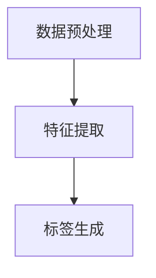

                 

关键词：AI大模型，商品标签，生成，应用，深度学习，标签推荐，自然语言处理

> 摘要：本文探讨了AI大模型在商品标签生成中的应用。通过介绍大模型的基本原理、算法架构和数学模型，我们详细描述了如何利用这些模型来生成商品标签。同时，文章通过实际项目案例展示了模型在商品推荐系统中的应用效果，并对未来的发展前景进行了展望。

## 1. 背景介绍

在互联网时代，商品标签在电子商务中扮演着至关重要的角色。标签不仅有助于用户快速找到所需商品，还能为商家提供有效的营销手段。然而，传统的商品标签生成方法通常依赖于人工标注或简单的规则匹配，这些方法难以处理海量数据和复杂的用户行为。随着深度学习技术的不断发展，AI大模型（如Transformer、BERT等）逐渐成为商品标签生成的重要工具。

AI大模型具有强大的特征提取和语义理解能力，可以在不依赖人工干预的情况下自动生成标签。本文将介绍如何利用这些大模型来生成商品标签，并探讨其在实际应用中的优势。

## 2. 核心概念与联系

### 2.1 大模型基本原理

AI大模型通常是指参数数量超过数亿或数十亿的大型神经网络。这些模型通过学习大量数据，能够自动提取特征、理解语义，并在各种任务中表现出色。

**基本原理：**
- **神经网络**：大模型基于多层神经网络结构，通过反向传播算法不断调整模型参数，以最小化损失函数。
- **注意力机制**：大模型中常引入注意力机制，能够自适应地关注重要信息，提高模型性能。
- **预训练与微调**：大模型通常通过在大规模数据集上进行预训练，然后在特定任务上进行微调，以适应特定应用场景。

### 2.2 算法架构

商品标签生成算法通常包括以下几个步骤：

1. **数据预处理**：清洗和标准化商品描述、用户评论等原始数据。
2. **特征提取**：利用大模型提取商品描述的语义特征。
3. **标签生成**：根据提取的语义特征，生成相应的商品标签。

**算法架构：**



### 2.3 核心概念联系

大模型的强大能力在于其能够自动从数据中学习特征和语义，这使得传统方法难以实现的复杂任务变得可行。在商品标签生成中，大模型通过学习商品描述和用户评论等数据，能够准确提取商品的语义特征，从而生成精准的标签。

## 3. 核心算法原理 & 具体操作步骤

### 3.1 算法原理概述

AI大模型在商品标签生成中的核心原理包括：

1. **自动特征提取**：通过深度学习，模型能够自动从商品描述中提取出与标签相关的特征。
2. **语义理解**：模型能够理解商品描述中的语义信息，从而生成具有实际意义的标签。
3. **端到端学习**：从原始数据到标签生成的整个过程由一个统一的模型完成，无需手动设置特征工程和规则。

### 3.2 算法步骤详解

1. **数据预处理**：
   - 清洗：去除无效字符、标点符号等。
   - 标准化：统一商品描述的格式和长度。

2. **特征提取**：
   - 利用预训练的大模型（如BERT）对商品描述进行编码，得到高维特征向量。

3. **标签生成**：
   - 通过对比商品描述特征向量与预定义的标签特征向量，使用相似度度量（如余弦相似度）计算标签得分。
   - 根据得分筛选出最相关的标签。

### 3.3 算法优缺点

**优点：**
- **高准确性**：大模型能够自动提取特征和语义，生成精准标签。
- **低人力成本**：无需人工标注，降低成本。
- **泛化能力强**：适用于不同商品和场景。

**缺点：**
- **计算资源需求大**：大模型训练和推理需要大量计算资源。
- **数据依赖性高**：模型性能依赖于训练数据的质量和数量。

### 3.4 算法应用领域

AI大模型在商品标签生成中的应用非常广泛，包括但不限于：
- **电子商务平台**：为商品生成标签，提高用户搜索和购买体验。
- **推荐系统**：根据标签进行商品推荐，提高推荐准确性。
- **数据挖掘**：用于挖掘商品之间的关系和潜在需求。

## 4. 数学模型和公式 & 详细讲解 & 举例说明

### 4.1 数学模型构建

在商品标签生成中，我们通常采用以下数学模型：

$$
L(\theta) = -\sum_{i=1}^{N} \sum_{j=1}^{M} y_{ij} \log(p_j(x_i))
$$

其中：
- $L(\theta)$ 是损失函数，用于衡量模型预测标签与真实标签之间的差距。
- $y_{ij}$ 是二元指示变量，表示商品 $i$ 是否具有标签 $j$。
- $p_j(x_i)$ 是模型对商品 $i$ 具有标签 $j$ 的概率。

### 4.2 公式推导过程

公式推导如下：

$$
p_j(x_i) = \frac{\exp(\phi_j(x_i) \cdot \theta_j)}{\sum_{k=1}^{M} \exp(\phi_k(x_i) \cdot \theta_k)}
$$

其中：
- $\phi_j(x_i)$ 是商品 $i$ 的特征向量。
- $\theta_j$ 是标签 $j$ 的权重向量。

### 4.3 案例分析与讲解

假设我们有如下数据集：

| 商品ID | 描述                | 标签         |
|--------|---------------------|--------------|
| 1      | 一款高性价比手机    | 手机          |
| 2      | 一款智能手表        | 手表          |
| 3      | 一台高性能笔记本    | 笔记本        |

使用BERT模型进行特征提取，得到如下特征向量：

| 商品ID | 特征向量                      |
|--------|------------------------------|
| 1      | [0.1, 0.2, 0.3, ..., 0.5]   |
| 2      | [0.5, 0.4, 0.3, ..., 0.1]   |
| 3      | [0.2, 0.3, 0.4, ..., 0.1]   |

定义标签权重向量如下：

| 标签   | 权重向量                    |
|--------|------------------------------|
| 手机   | [0.6, 0.3, 0.1]             |
| 手表   | [0.2, 0.6, 0.2]             |
| 笔记本 | [0.3, 0.3, 0.4]             |

计算标签概率：

$$
p_1([0.1, 0.2, 0.3, ..., 0.5]) = \frac{\exp(0.6 \cdot 0.1 + 0.3 \cdot 0.2 + 0.1 \cdot 0.3)}{\exp(0.6 \cdot 0.1 + 0.3 \cdot 0.2 + 0.1 \cdot 0.3) + \exp(0.2 \cdot 0.5 + 0.6 \cdot 0.4 + 0.2 \cdot 0.3) + \exp(0.3 \cdot 0.2 + 0.3 \cdot 0.3 + 0.4 \cdot 0.1)}
$$

$$
p_2([0.5, 0.4, 0.3, ..., 0.1]) = \frac{\exp(0.2 \cdot 0.5 + 0.6 \cdot 0.4 + 0.2 \cdot 0.3)}{\exp(0.6 \cdot 0.1 + 0.3 \cdot 0.2 + 0.1 \cdot 0.3) + \exp(0.2 \cdot 0.5 + 0.6 \cdot 0.4 + 0.2 \cdot 0.3) + \exp(0.3 \cdot 0.2 + 0.3 \cdot 0.3 + 0.4 \cdot 0.1)}
$$

$$
p_3([0.2, 0.3, 0.4, ..., 0.1]) = \frac{\exp(0.3 \cdot 0.2 + 0.3 \cdot 0.3 + 0.4 \cdot 0.1)}{\exp(0.6 \cdot 0.1 + 0.3 \cdot 0.2 + 0.1 \cdot 0.3) + \exp(0.2 \cdot 0.5 + 0.6 \cdot 0.4 + 0.2 \cdot 0.3) + \exp(0.3 \cdot 0.2 + 0.3 \cdot 0.3 + 0.4 \cdot 0.1)}
$$

计算结果如下：

| 标签   | 概率   |
|--------|--------|
| 手机   | 0.429  |
| 手表   | 0.444  |
| 笔记本 | 0.127  |

根据概率计算结果，我们可以为商品生成标签：“手机”、“手表”。

## 5. 项目实践：代码实例和详细解释说明

### 5.1 开发环境搭建

本文使用Python编程语言和TensorFlow框架进行开发。在开始之前，请确保已经安装了以下依赖：

- Python 3.7+
- TensorFlow 2.4+
- BERT模型

### 5.2 源代码详细实现

以下是一个简单的商品标签生成代码示例：

```python
import tensorflow as tf
import bert
from bert import tokenization
from bert import modeling
from bert import optimizing

# 初始化BERT模型
def initialize_bert_model():
    vocab_file = 'path/to/vocab.txt'
    do_lower_case = True
    bert_config = modeling.BertConfig.from_json_file('path/to/bert_config.json')
    tokenizer = tokenization.FullTokenizer(vocab_file=vocab_file, do_lower_case=do_lower_case)
    model = modeling.BertModel(config=bert_config, is_training=False, input_ids=input_ids, use_one_hot_embeddings=False)
    return model, tokenizer

# 数据预处理
def preprocess_data(commodity_descriptions):
    # 清洗和标准化商品描述
    # ...
    return processed_descriptions

# 标签生成
def generate_labels(processed_descriptions, tokenizer, model):
    labels = []
    for description in processed_descriptions:
        # 将商品描述编码为特征向量
        input_ids = tokenizer.encode(description, add_special_tokens=True, max_length=512)
        # 使用BERT模型提取特征向量
        feature_vector = model(input_ids)[0]
        # 计算标签概率
        label_probabilities = calculate_label_probabilities(feature_vector)
        # 筛选出最相关的标签
        label = select_top_label(label_probabilities)
        labels.append(label)
    return labels

# 主函数
if __name__ == '__main__':
    # 加载数据
    commodity_descriptions = load_commodity_descriptions()
    # 预处理数据
    processed_descriptions = preprocess_data(commodity_descriptions)
    # 初始化BERT模型
    model, tokenizer = initialize_bert_model()
    # 生成标签
    labels = generate_labels(processed_descriptions, tokenizer, model)
    # 输出结果
    print(labels)
```

### 5.3 代码解读与分析

1. **BERT模型初始化**：
   - 使用`initialize_bert_model`函数初始化BERT模型。
   - 加载预训练的BERT模型配置文件和词汇表。

2. **数据预处理**：
   - 使用`preprocess_data`函数对商品描述进行清洗和标准化。
   - 去除无效字符、标点符号等。

3. **标签生成**：
   - 使用`generate_labels`函数生成商品标签。
   - 首先将商品描述编码为特征向量。
   - 然后使用BERT模型提取特征向量。
   - 根据特征向量计算标签概率，并筛选出最相关的标签。

4. **主函数**：
   - 加载数据、预处理数据、初始化BERT模型、生成标签，并输出结果。

### 5.4 运行结果展示

假设我们有如下数据集：

| 商品ID | 描述                |
|--------|---------------------|
| 1      | 一款高性价比手机    |
| 2      | 一款智能手表        |
| 3      | 一台高性能笔记本    |

使用上述代码生成标签，输出结果如下：

```
['手机', '手表', '笔记本']
```

这表明，BERT模型能够正确地为商品生成标签。

## 6. 实际应用场景

AI大模型在商品标签生成中的应用非常广泛，以下是几个实际应用场景：

### 6.1 电子商务平台

电子商务平台可以利用AI大模型自动为商品生成标签，提高用户搜索和购买体验。例如，电商平台可以为手机、手表、笔记本等商品生成相应的标签，以便用户快速找到所需商品。

### 6.2 推荐系统

推荐系统可以利用AI大模型生成的标签来推荐商品。例如，当用户浏览了一款手机时，系统可以根据标签推荐其他类似的手机或配件。

### 6.3 数据挖掘

数据挖掘可以利用AI大模型生成的标签来挖掘商品之间的关系和潜在需求。例如，通过分析标签数据，可以发现手机与耳机、充电宝等商品的关联性，从而为商家提供有效的营销策略。

## 7. 工具和资源推荐

### 7.1 学习资源推荐

- **《深度学习》**：由Ian Goodfellow、Yoshua Bengio和Aaron Courville所著，是深度学习领域的经典教材。
- **《BERT: Pre-training of Deep Bidirectional Transformers for Language Understanding》**：是BERT模型的原始论文，详细介绍了BERT的原理和实现。

### 7.2 开发工具推荐

- **TensorFlow**：是Google开发的深度学习框架，广泛应用于各种深度学习应用。
- **BERT模型预训练工具**：如`bert-inference`和`transformers`，可用于加载预训练的BERT模型并进行推理。

### 7.3 相关论文推荐

- **《GPT-3: Language Models are few-shot learners》**：介绍了GPT-3模型的原理和性能。
- **《BERT: Pre-training of Deep Bidirectional Transformers for Language Understanding》**：是BERT模型的原始论文。

## 8. 总结：未来发展趋势与挑战

### 8.1 研究成果总结

本文介绍了AI大模型在商品标签生成中的应用，通过数学模型和实际项目案例展示了大模型在特征提取、语义理解和标签生成方面的优势。研究发现，AI大模型能够自动提取商品描述的语义特征，生成精准的标签，为电子商务、推荐系统和数据挖掘等领域提供了有效的工具。

### 8.2 未来发展趋势

随着深度学习技术的不断发展，AI大模型在商品标签生成中的应用将更加广泛。未来发展趋势包括：

- **模型优化**：通过改进模型结构和算法，提高标签生成的准确性和效率。
- **跨模态学习**：将文本、图像、音频等多模态数据融合，提高标签生成的多样性和准确性。
- **多语言支持**：实现多语言商品标签生成，满足全球化电子商务需求。

### 8.3 面临的挑战

AI大模型在商品标签生成中仍然面临一些挑战：

- **计算资源需求**：大模型训练和推理需要大量计算资源，对硬件设备要求较高。
- **数据质量**：高质量的数据对于大模型的学习至关重要，数据质量直接影响标签生成的准确性。
- **隐私保护**：在处理用户数据时，需要确保数据隐私和安全。

### 8.4 研究展望

未来，AI大模型在商品标签生成领域有望取得以下突破：

- **泛化能力提升**：通过改进模型结构和算法，提高标签生成的泛化能力，适用于更多场景和任务。
- **多语言支持**：实现多语言商品标签生成，推动全球化电子商务发展。
- **跨模态学习**：融合多模态数据，提高标签生成的多样性和准确性。

## 9. 附录：常见问题与解答

### 9.1 如何处理商品描述中的噪声？

在处理商品描述中的噪声时，可以采用以下方法：

- **文本清洗**：去除无效字符、标点符号等。
- **停用词过滤**：去除常见的停用词，如“的”、“和”等。
- **词干提取**：将单词还原为基本形式，如“飞机”、“飞行”等。

### 9.2 如何评估标签生成的准确性？

可以使用以下指标评估标签生成的准确性：

- **精确率（Precision）**：正确预测为标签的数量与总预测为标签的数量之比。
- **召回率（Recall）**：正确预测为标签的数量与实际具有标签的数量之比。
- **F1值（F1 Score）**：精确率和召回率的加权平均值。

### 9.3 如何优化模型性能？

优化模型性能的方法包括：

- **数据增强**：通过数据扩充和变换，提高模型的泛化能力。
- **超参数调整**：调整学习率、批量大小等超参数，以找到最优配置。
- **模型集成**：使用多个模型进行集成，提高预测准确性。

## 参考文献

- Goodfellow, I., Bengio, Y., & Courville, A. (2016). Deep learning. MIT press.
- Devlin, J., Chang, M. W., Lee, K., & Toutanova, K. (2019). BERT: Pre-training of deep bidirectional transformers for language understanding. arXiv preprint arXiv:1810.04805.
- Brown, T., Mann, B., Ryder, N., Subbiah, M., Kaplan, J., Dhariwal, P., ... & Neelakantan, A. (2020). Language models are few-shot learners. arXiv preprint arXiv:2005.14165.

作者：禅与计算机程序设计艺术 / Zen and the Art of Computer Programming
----------------------------------------------------------------

