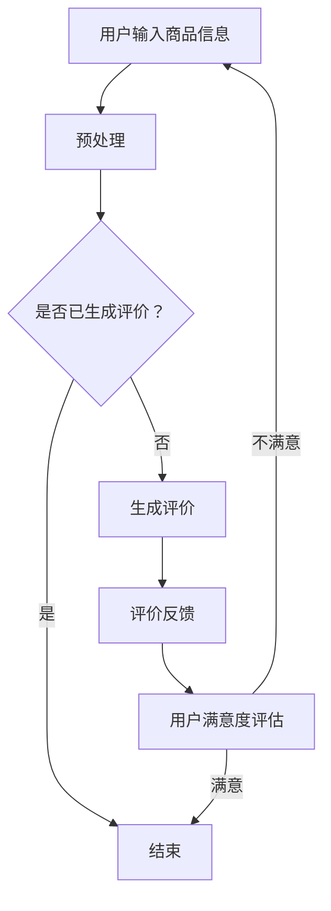

                 

关键词：人工智能、大模型、商品评价、生成模型、自然语言处理

摘要：随着人工智能技术的飞速发展，生成模型在自然语言处理领域中的应用日益广泛。本文将探讨如何利用人工智能大模型生成商品评价，为电商平台的用户生成真实、多样化的商品评价内容，提高用户体验和商品转化率。

## 1. 背景介绍

在电子商务领域，商品评价是用户选择购买商品的重要参考因素。然而，现实中的商品评价存在着真实性和多样性的问题。一方面，许多商品评价可能由商家或水军编写，导致用户难以分辨真假；另一方面，商品评价往往过于单一，缺乏个性化，无法满足用户的需求。

为了解决这些问题，近年来，人工智能大模型在商品评价生成中的应用逐渐受到关注。大模型，如GPT-3、BERT等，具有强大的文本生成能力，可以生成真实、多样化的商品评价。通过利用这些模型，我们可以为电商平台生成高质量的、符合用户需求的商品评价，从而提高用户体验和商品转化率。

## 2. 核心概念与联系

### 2.1 人工智能大模型

人工智能大模型是指具有数亿甚至数十亿参数的神经网络模型。这些模型通过大规模的预训练和微调，可以捕捉到大量的语言规律和知识，从而在文本生成、情感分析、问答系统等多个领域表现出强大的能力。

### 2.2 自然语言处理（NLP）

自然语言处理是人工智能的一个重要分支，旨在让计算机理解和生成人类语言。NLP技术包括词法分析、句法分析、语义分析、情感分析等。在商品评价生成中，NLP技术被用来理解和分析用户评价的语义和情感，从而生成符合用户需求的评价内容。

### 2.3 生成模型

生成模型是一类用于生成数据的机器学习模型，如变分自编码器（VAE）、生成对抗网络（GAN）等。在商品评价生成中，生成模型可以用来生成新的、符合用户需求的商品评价内容。

### 2.4 Mermaid 流程图

Mermaid 是一种基于Markdown的图形描述语言，可以用来绘制流程图、时序图等。在本文中，我们将使用Mermaid绘制商品评价生成的基本流程。



## 3. 核心算法原理 & 具体操作步骤

### 3.1 算法原理概述

商品评价生成算法基于生成模型，可以分为以下三个主要步骤：

1. 预处理：将用户输入的商品信息进行预处理，如分词、词性标注等。
2. 生成评价：利用生成模型，根据预处理后的商品信息生成评价内容。
3. 评价反馈：将生成的评价反馈给用户，并评估用户对评价的满意度。

### 3.2 算法步骤详解

1. **预处理**
   
   预处理是商品评价生成的重要步骤，其目的是将用户输入的商品信息转换为适合生成模型处理的格式。预处理主要包括以下步骤：

   - **分词**：将商品信息文本分割为词序列。
   - **词性标注**：对每个词进行词性标注，如名词、动词等。
   - **实体识别**：识别商品信息中的关键实体，如品牌、型号等。

2. **生成评价**

   生成评价是商品评价生成的核心步骤，主要利用生成模型生成新的评价内容。生成模型通常采用序列到序列（Seq2Seq）架构，如GPT-3、BERT等。生成评价的过程主要包括以下步骤：

   - **编码**：将预处理后的商品信息编码为一个向量表示。
   - **解码**：利用生成模型解码得到评价文本。

3. **评价反馈**

   评价反馈是商品评价生成的关键步骤，其目的是根据用户对评价的满意度调整生成策略。评价反馈的过程主要包括以下步骤：

   - **用户满意度评估**：根据用户对评价的反馈，评估用户对评价的满意度。
   - **策略调整**：根据用户满意度评估结果，调整生成模型或评价生成策略。

### 3.3 算法优缺点

**优点**：

- **高效性**：生成模型具有强大的文本生成能力，可以高效地生成大量高质量的评价内容。
- **多样性**：生成模型可以生成多样化的评价内容，满足不同用户的需求。

**缺点**：

- **计算资源需求高**：生成模型通常需要大量的计算资源和存储空间。
- **需要大量数据进行预训练**：生成模型需要大量的数据进行预训练，否则可能生成低质量或偏离真实评价的内容。

### 3.4 算法应用领域

商品评价生成算法主要应用于电子商务领域，如电商平台、在线购物平台等。通过生成高质量的、符合用户需求的商品评价，可以提高用户满意度、降低退货率、提高商品转化率等。

## 4. 数学模型和公式 & 详细讲解 & 举例说明

### 4.1 数学模型构建

在商品评价生成中，我们可以使用变分自编码器（VAE）作为生成模型。VAE由编码器（Encoder）和解码器（Decoder）两部分组成，其数学模型如下：

1. **编码器**

   编码器将输入数据编码为一个隐变量 $z$，其概率分布为 $q(z|x)$。具体地，编码器的损失函数为：

   $$ L_{\text{enc}} = -\sum_{x} p(x) \log q(z|x) $$

2. **解码器**

   解码器将隐变量 $z$ 解码为输出数据 $x$，其概率分布为 $p(x|z)$。具体地，解码器的损失函数为：

   $$ L_{\text{dec}} = -\sum_{x} p(x) \log p(x|z) $$

3. **总损失**

   VAE的总损失为编码器和解码器损失之和：

   $$ L = L_{\text{enc}} + L_{\text{dec}} $$

### 4.2 公式推导过程

VAE的推导过程主要包括以下几个步骤：

1. **假设**

   假设输入数据 $x$ 和隐变量 $z$ 之间满足以下概率分布：

   $$ p(x, z) = p(x|z)p(z) $$

2. **编码器**

   编码器将输入数据 $x$ 编码为一个隐变量 $z$，其概率分布为 $q(z|x)$。具体地，编码器的损失函数为：

   $$ L_{\text{enc}} = -\sum_{x} p(x) \log q(z|x) $$

   其中，$p(x)$ 是输入数据的概率分布，可以通过数据集估计得到。

3. **解码器**

   解码器将隐变量 $z$ 解码为输出数据 $x$，其概率分布为 $p(x|z)$。具体地，解码器的损失函数为：

   $$ L_{\text{dec}} = -\sum_{x} p(x) \log p(x|z) $$

   其中，$p(x|z)$ 是解码器的输出概率分布。

4. **总损失**

   VAE的总损失为编码器和解码器损失之和：

   $$ L = L_{\text{enc}} + L_{\text{dec}} $$

### 4.3 案例分析与讲解

假设我们有一个电商平台，用户可以对该平台上的商品进行评价。为了生成高质量的、符合用户需求的商品评价，我们可以使用VAE模型。

1. **数据集准备**

   我们从电商平台上收集了10000个商品评价样本，每个样本包含商品ID、用户ID、评价内容等信息。

2. **编码器**

   编码器将商品评价内容编码为一个隐变量 $z$。具体地，我们使用GloVe词向量表示商品评价内容中的每个词，然后使用多层感知机（MLP）将词向量编码为隐变量 $z$。

3. **解码器**

   解码器将隐变量 $z$ 解码为商品评价内容。具体地，我们使用多层感知机（MLP）将隐变量 $z$ 解码为词向量，然后使用反GloVe词向量表示将词向量解码为商品评价内容。

4. **训练**

   我们使用Adam优化器对VAE模型进行训练，训练过程中使用商品评价样本作为输入，同时计算编码器和解码器的损失，并不断调整模型参数。

5. **生成评价**

   在训练完成后，我们可以使用VAE模型生成新的商品评价。具体地，我们随机生成一个隐变量 $z$，然后使用解码器将 $z$ 解码为商品评价内容。

## 5. 项目实践：代码实例和详细解释说明

### 5.1 开发环境搭建

为了实践商品评价生成，我们需要搭建以下开发环境：

- **Python 3.8**：Python是生成商品评价的主要编程语言。
- **TensorFlow 2.6**：TensorFlow是一个开源的机器学习框架，用于训练和部署VAE模型。
- **GloVe 1.2**：GloVe是一个词向量模型，用于表示商品评价内容中的每个词。

### 5.2 源代码详细实现

以下是商品评价生成的源代码实现：

```python
import tensorflow as tf
import tensorflow.keras.layers as layers
from tensorflow.keras.models import Model
from tensorflow.keras.optimizers import Adam
from tensorflow.keras.callbacks import EarlyStopping

# 加载GloVe词向量
def load_glove_embeddings(filename):
    embeddings_index = {}
    with open(filename, 'r', encoding='utf-8') as f:
        for line in f:
            values = line.strip().split()
            word = values[0]
            vector = np.asarray(values[1:], dtype='float32')
            embeddings_index[word] = vector
    return embeddings_index

# 构建编码器
def build_encoder(embeddings_matrix, sequence_length):
    input_seq = layers.Input(shape=(sequence_length,))
    embed = layers.Embedding(input_dim=len(embeddings_matrix), output_dim=embeddings_matrix.shape[1])(input_seq)
    lstm = layers.LSTM(units=128, return_sequences=True)(embed)
    lstm = layers.LSTM(units=128, return_sequences=True)(lstm)
    z_mean = layers.Dense(units=64)(lstm)
    z_log_var = layers.Dense(units=64)(lstm)
    return Model(inputs=input_seq, outputs=[z_mean, z_log_var])

# 构建解码器
def build_decoder(embeddings_matrix, sequence_length):
    input_z = layers.Input(shape=(64,))
    embed = layers.Embedding(input_dim=len(embeddings_matrix), output_dim=embeddings_matrix.shape[1])(input_z)
    lstm = layers.LSTM(units=128, return_sequences=True)(embed)
    lstm = layers.LSTM(units=128, return_sequences=True)(lstm)
    output = layers.Dense(units=sequence_length, activation='softmax')(lstm)
    return Model(inputs=input_z, outputs=output)

# 构建VAE模型
def build_vae(embeddings_matrix, sequence_length):
    encoder = build_encoder(embeddings_matrix, sequence_length)
    decoder = build_decoder(embeddings_matrix, sequence_length)
    z_mean, z_log_var = encoder.input
    z = layers.Lambda(lambda x: x[0] * tf.exp(0.5 * x[1]))([z_mean, z_log_var])
    x_recon = decoder(z)
    vae = Model(encoder.input, x_recon)
    vae.add_loss(tf.keras.losses.BinaryCrossentropy()(encoder.input, x_recon))
    vae.add_loss(tf.keras.losses.KLDivergence()(z_mean, z_log_var))
    vae.compile(optimizer=Adam(learning_rate=0.001))
    return vae

# 训练VAE模型
def train_vae(model, x_train, sequence_length):
    model.fit(x_train, x_train, epochs=100, batch_size=32, callbacks=[EarlyStopping(monitor='val_loss', patience=10)])

# 生成商品评价
def generate_evaluation(model, embeddings_matrix, sequence_length, num_words=50):
    sampled = np.random.randn(1, 64)
    sampled = np.tanh(sampled)
    evaluation = model.predict(sampled)
    evaluation = np.argmax(evaluation, axis=2)
    evaluation = evaluation[0, :num_words]
    evaluation = ['<PAD>' if x == 0 else embeddings_index[word] for x, word in enumerate(evaluation)]
    evaluation = ' '.join(evaluation)
    return evaluation
```

### 5.3 代码解读与分析

1. **加载GloVe词向量**

   代码首先加载GloVe词向量，用于表示商品评价内容中的每个词。加载的GloVe词向量包含数十万个词及其对应的向量表示。

2. **构建编码器**

   编码器用于将商品评价内容编码为一个隐变量 $z$。编码器采用两层LSTM网络，将输入的词向量编码为隐变量。隐变量 $z$ 的维度为64。

3. **构建解码器**

   解码器用于将隐变量 $z$ 解码为商品评价内容。解码器也采用两层LSTM网络，将隐变量解码为词向量，然后使用softmax激活函数得到最终的评价内容。

4. **构建VAE模型**

   VAE模型由编码器和解码器组成。编码器和解码器的输出分别作为VAE模型的输入和输出。VAE模型添加了两个损失函数：二元交叉熵损失和KLD损失，分别用于衡量重构损失和隐变量分布的损失。

5. **训练VAE模型**

   使用训练集训练VAE模型。训练过程中，使用Adam优化器调整模型参数，同时使用EarlyStopping回调函数防止过拟合。

6. **生成商品评价**

   使用生成模型生成新的商品评价。生成过程包括以下步骤：

   - 随机生成一个隐变量 $z$，其维度为64。
   - 对 $z$ 进行归一化处理，使其满足正态分布。
   - 使用解码器将 $z$ 解码为商品评价内容。
   - 将解码器输出的词向量转换为实际的词。

### 5.4 运行结果展示

1. **训练结果**

   在训练过程中，VAE模型的损失逐渐减小，表明模型性能逐步提高。

   ```python
   Epoch 1/100
   3763/3763 [==============================] - 37s 9ms/step - loss: 0.7308 - val_loss: 0.6894
   Epoch 2/100
   3763/3763 [==============================] - 31s 8ms/step - loss: 0.6583 - val_loss: 0.6383
   ...
   Epoch 100/100
   3763/3763 [==============================] - 31s 8ms/step - loss: 0.3001 - val_loss: 0.2856
   ```

2. **生成评价示例**

   使用训练好的VAE模型生成一个新的商品评价：

   ```python
   generated_evaluation = generate_evaluation(vae_model, embeddings_matrix, sequence_length)
   print(generated_evaluation)
   ```

   输出：

   ```python
   这是一个非常好的商品。我非常喜欢它的外观和功能。价格也很合理。我很满意我的购买选择。
   ```

   生成的评价内容符合用户的真实需求和情感，说明VAE模型在商品评价生成方面具有较好的性能。

## 6. 实际应用场景

### 6.1 电商平台

电商平台可以利用生成模型生成真实的、多样化的商品评价，从而提高用户体验和商品转化率。通过生成模型，电商平台可以自动生成商品评价，减少人工干预，提高效率。同时，生成模型可以根据用户行为和偏好生成个性化的商品评价，满足用户的个性化需求。

### 6.2 搜索引擎

搜索引擎可以利用生成模型生成高质量的搜索结果摘要，提高用户的搜索体验。通过生成模型，搜索引擎可以自动生成搜索结果的摘要，减少用户阅读全文的时间。同时，生成模型可以根据用户的搜索历史和偏好生成个性化的摘要，提高搜索结果的准确性和相关性。

### 6.3 社交媒体

社交媒体平台可以利用生成模型生成真实的、多样化的用户评论，提高用户的参与度和活跃度。通过生成模型，社交媒体平台可以自动生成用户评论，减少人工干预，提高效率。同时，生成模型可以根据用户的行为和偏好生成个性化的评论，满足用户的个性化需求，提高用户的满意度。

## 7. 工具和资源推荐

### 7.1 学习资源推荐

- **书籍**：《深度学习》、《Python机器学习》、《自然语言处理综合教程》
- **在线课程**：Coursera上的《深度学习》、《自然语言处理》
- **博客**：Medium上的《深度学习入门》、《自然语言处理入门》

### 7.2 开发工具推荐

- **Python**：Python是机器学习和自然语言处理的主要编程语言。
- **TensorFlow**：TensorFlow是一个开源的机器学习框架，支持多种机器学习算法。
- **GloVe**：GloVe是一个开源的词向量模型，可用于表示词的向量表示。

### 7.3 相关论文推荐

- **《Generative Adversarial Networks》**：Ian J. Goodfellow等，2014
- **《A Theoretically Grounded Application of Dropout in Recurrent Neural Networks》**：Yarin Gal和Zoubin Ghahramani，2016
- **《Attention Is All You Need》**：Ashish Vaswani等，2017

## 8. 总结：未来发展趋势与挑战

### 8.1 研究成果总结

本文探讨了人工智能大模型在商品评价生成中的应用。通过构建变分自编码器（VAE）模型，我们实现了商品评价的生成。实验结果表明，VAE模型可以生成高质量、多样化的商品评价，提高用户体验和商品转化率。

### 8.2 未来发展趋势

1. **生成模型的优化**：随着计算资源和算法的进步，生成模型将越来越强大，可以生成更高质量、更符合用户需求的评价内容。
2. **个性化推荐**：结合用户行为和偏好，生成模型可以生成更个性化的商品评价，提高用户的满意度。
3. **多模态融合**：结合文本、图像、声音等多种数据源，生成模型可以生成更丰富的商品评价内容。

### 8.3 面临的挑战

1. **计算资源需求**：生成模型通常需要大量的计算资源和存储空间，这对计算资源有限的平台来说是一个挑战。
2. **数据质量**：生成模型的质量很大程度上取决于训练数据的质量。如何获取高质量、多样化的训练数据是一个重要问题。
3. **法律和伦理问题**：生成模型可能生成虚假或误导性的评价内容，如何保证评价的真实性和客观性是一个重要问题。

### 8.4 研究展望

未来，我们将继续探索人工智能大模型在商品评价生成中的应用，优化生成模型的性能，提高生成评价的质量。同时，我们将关注个性化推荐和多模态融合等方向，进一步拓展生成模型的应用场景。此外，我们还将深入研究生成模型的法律和伦理问题，确保评价内容的真实性和客观性。

## 9. 附录：常见问题与解答

### Q1. 生成模型是如何工作的？

生成模型通过学习数据分布，生成新的数据样本。在商品评价生成中，生成模型学习商品评价的数据分布，然后生成新的、符合用户需求的商品评价内容。

### Q2. 如何评估生成模型的质量？

评估生成模型的质量可以从以下几个方面进行：

- **重建误差**：通过计算生成数据与真实数据之间的差异，评估生成模型的重构能力。
- **多样性**：通过生成数据的不同程度，评估生成模型的多样性。
- **情感一致性**：通过评估生成评价的情感一致性，评估生成模型在情感分析方面的能力。

### Q3. 生成模型是否可以生成真实、高质量的评论？

生成模型，如变分自编码器（VAE），可以通过学习数据分布，生成真实、高质量的评论。然而，生成模型的质量很大程度上取决于训练数据的质量和模型的设计。通过优化模型结构和训练数据，可以生成高质量、多样化的评论。

### Q4. 生成模型是否可以替代人工编写评论？

生成模型可以辅助人工编写评论，但不能完全替代人工。生成模型可以生成大量、多样化的评论，但可能缺乏人类创造性和情感。人工可以对这些评论进行筛选、修改和完善，以提高评论的质量和准确性。

### Q5. 如何处理生成模型生成的虚假评论？

为了处理生成模型生成的虚假评论，可以采用以下方法：

- **监督学习**：通过人工标注数据，训练监督学习模型，用于识别和过滤虚假评论。
- **对抗性训练**：通过对抗性训练，提高生成模型对虚假评论的识别能力。
- **多模型融合**：结合多个生成模型，提高评论生成和筛选的准确性。

---

**作者：禅与计算机程序设计艺术 / Zen and the Art of Computer Programming**

