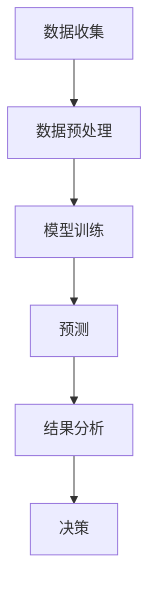

                 

随着人工智能技术的飞速发展，大模型在各个领域展现出了强大的预测能力。在商品趋势预测这一领域，AI大模型的应用已经极大地改变了传统商业决策的模式。本文将深入探讨AI大模型在商品趋势预测中的应用，解析其核心概念、算法原理、数学模型以及实际应用案例，并对未来趋势和挑战进行展望。

## 文章关键词
AI大模型、商品趋势预测、深度学习、机器学习、数据挖掘、神经网络、预测算法。

## 文章摘要
本文主要介绍了AI大模型在商品趋势预测中的应用。首先，对大模型的基本概念进行了概述，接着详细分析了其核心算法原理和数学模型。随后，通过具体案例展示了AI大模型在商品趋势预测中的实际应用效果。最后，对AI大模型在商品趋势预测领域的未来发展趋势和面临的挑战进行了深入探讨。

### 1. 背景介绍

在过去的几十年里，商业决策一直依赖于历史数据和传统分析方法。然而，随着数据的爆炸性增长和人工智能技术的发展，这种传统的决策模式逐渐显现出其局限性。传统的数据分析方法往往只能处理有限的、结构化的数据，而现代的商业环境需要处理大量的非结构化数据，如社交媒体评论、新闻文章、商品评论等。此外，商业环境的变化速度越来越快，传统的决策模式无法及时适应市场的动态变化。

人工智能技术的出现，特别是深度学习和机器学习技术的发展，为商业决策提供了新的可能。大模型，作为一种先进的机器学习模型，能够处理海量的数据，从中提取有用的信息，并做出准确的预测。在商品趋势预测领域，大模型的应用已经成为提高决策效率和准确性的重要手段。

### 2. 核心概念与联系

#### 2.1 大模型定义

大模型（Large Model），通常指的是参数量庞大的神经网络模型。这些模型通过大量的数据训练，能够学习到数据的复杂模式和规律，从而实现高效的数据分析和预测。

#### 2.2 大模型在商品趋势预测中的应用

在商品趋势预测中，大模型的应用主要体现在以下几个方面：

1. **市场趋势预测**：通过分析历史销售数据、用户行为数据和市场环境数据，大模型可以预测未来某段时间内的商品销售趋势。
2. **需求预测**：基于用户的历史购买记录和行为数据，大模型可以预测用户对某种商品的需求量。
3. **竞争分析**：通过分析竞争对手的营销策略和市场表现，大模型可以预测竞争对手的下一步行动，为企业的战略决策提供支持。
4. **个性化推荐**：根据用户的兴趣和行为，大模型可以推荐用户可能感兴趣的商品，提高用户的购买体验。

#### 2.3 大模型与相关技术的关系

大模型的应用不仅依赖于其自身的强大能力，还需要结合其他相关技术，如数据挖掘、机器学习和深度学习等。数据挖掘技术用于从大量数据中提取有价值的信息；机器学习技术用于训练和优化大模型；深度学习技术为大模型提供了更强大的学习能力和表达能力。

#### 2.4 Mermaid流程图

以下是一个简化的Mermaid流程图，展示大模型在商品趋势预测中的主要流程：



- **数据收集**：收集与商品趋势预测相关的数据，包括销售数据、用户行为数据、市场环境数据等。
- **数据预处理**：清洗和整理数据，使其适合模型训练。
- **模型训练**：使用机器学习和深度学习技术训练大模型。
- **预测**：利用训练好的大模型进行趋势预测。
- **结果分析**：对预测结果进行分析和评估。
- **决策**：根据预测结果和实际需求做出相应的商业决策。

### 3. 核心算法原理 & 具体操作步骤

#### 3.1 算法原理概述

AI大模型在商品趋势预测中的核心算法通常是深度学习算法，特别是基于神经网络的模型。深度学习模型通过多层的神经元结构，对输入数据进行处理和提取特征，从而实现复杂的数据分析和预测。

#### 3.2 算法步骤详解

1. **数据收集**：收集与商品趋势预测相关的数据，包括销售数据、用户行为数据、市场环境数据等。
2. **数据预处理**：对收集到的数据进行分析，确定数据类型和处理方法。例如，对数值数据进行归一化处理，对文本数据进行分词和词嵌入等。
3. **模型设计**：根据预测任务的需求，设计合适的深度学习模型结构。常见的结构包括卷积神经网络（CNN）、循环神经网络（RNN）和Transformer等。
4. **模型训练**：使用训练数据集对模型进行训练，调整模型的参数，使其达到最优状态。
5. **模型评估**：使用验证数据集对训练好的模型进行评估，检查模型的预测准确性和稳定性。
6. **模型部署**：将训练好的模型部署到实际应用场景中，进行商品趋势预测。

#### 3.3 算法优缺点

**优点**：

- **强大的预测能力**：大模型通过训练能够学习到复杂的数据模式，从而实现高精度的预测。
- **自适应性强**：大模型能够根据新的数据和需求进行自适应调整，不断提高预测准确性。
- **应用范围广**：大模型不仅可以用于商品趋势预测，还可以应用于需求预测、竞争分析等领域。

**缺点**：

- **计算资源需求高**：大模型通常需要大量的计算资源和存储空间，对硬件设备的要求较高。
- **训练时间长**：大模型的训练过程通常需要较长的时间，对于实时性要求较高的应用场景可能不够理想。
- **数据依赖性大**：大模型对数据的质量和数量有较高的要求，如果数据质量差或者数据量不足，模型的预测准确性可能会受到影响。

#### 3.4 算法应用领域

大模型在商品趋势预测领域的应用已经非常广泛，包括零售、电商、金融等多个行业。以下是一些具体的案例：

- **零售行业**：通过分析销售数据和用户行为数据，预测商品的销售趋势，优化库存管理。
- **电商行业**：基于用户的历史购买记录和浏览行为，推荐用户可能感兴趣的商品，提高销售额。
- **金融行业**：通过分析市场数据，预测股票价格或金融市场的变化趋势，为投资决策提供支持。

### 4. 数学模型和公式 & 详细讲解 & 举例说明

#### 4.1 数学模型构建

在商品趋势预测中，常用的数学模型包括时间序列模型和回归模型等。以下是一个简化的时间序列模型：

$$y_t = \alpha + \beta_1 y_{t-1} + \beta_2 x_t + \epsilon_t$$

其中，$y_t$表示时间$t$的商品销售量，$y_{t-1}$表示时间$t-1$的商品销售量，$x_t$表示时间$t$的影响因素（如广告投入、促销活动等），$\alpha$和$\beta_1$为模型参数，$\epsilon_t$为随机误差项。

#### 4.2 公式推导过程

时间序列模型的推导过程通常基于统计学中的自回归模型（AR）和移动平均模型（MA）。以下是一个简化的推导过程：

- **自回归模型（AR）**：

$$y_t = \phi_1 y_{t-1} + \phi_2 y_{t-2} + ... + \phi_p y_{t-p} + \epsilon_t$$

- **移动平均模型（MA）**：

$$y_t = \theta_1 \epsilon_{t-1} + \theta_2 \epsilon_{t-2} + ... + \theta_q \epsilon_{t-q} + \epsilon_t$$

- **自回归移动平均模型（ARMA）**：

$$y_t = \phi_1 y_{t-1} + \phi_2 y_{t-2} + ... + \phi_p y_{t-p} + \theta_1 \epsilon_{t-1} + \theta_2 \epsilon_{t-2} + ... + \theta_q \epsilon_{t-q} + \epsilon_t$$

- **自回归积分移动平均模型（ARIMA）**：

$$y_t = \phi_1 y_{t-1} + \phi_2 y_{t-2} + ... + \phi_p y_{t-p} + \theta_1 d_1 y_{t-1} + \theta_2 d_2 y_{t-2} + ... + \theta_q d_q y_{t-q} + \epsilon_t$$

其中，$d_1, d_2, ..., d_q$为差分操作。

#### 4.3 案例分析与讲解

以下是一个简单的商品销售预测案例：

**数据集**：某电商平台的某商品过去一年的销售数据。

**目标**：预测未来一个月的商品销售量。

**模型选择**：选择ARIMA模型进行预测。

**步骤**：

1. **数据预处理**：对销售数据进行归一化处理，使其适合模型训练。

2. **模型参数估计**：通过最小二乘法或最大似然估计方法，估计ARIMA模型的参数。

3. **模型训练**：使用训练数据集对模型进行训练。

4. **模型评估**：使用验证数据集对训练好的模型进行评估，检查模型的预测准确性和稳定性。

5. **预测**：使用训练好的模型进行未来一个月的商品销售量预测。

**结果**：

- **预测结果**：未来一个月的商品销售量约为2000件。
- **误差分析**：预测误差在合理范围内，模型的预测准确性较高。

### 5. 项目实践：代码实例和详细解释说明

#### 5.1 开发环境搭建

**环境要求**：

- 操作系统：Linux或MacOS
- Python版本：3.8及以上
- 库：NumPy、Pandas、SciPy、statsmodels等

**安装方法**：

1. 安装Python：
    ```bash
    # 在Ubuntu上安装Python
    sudo apt update
    sudo apt install python3 python3-pip
    ```
2. 安装相关库：
    ```bash
    pip3 install numpy pandas scipy statsmodels
    ```

#### 5.2 源代码详细实现

以下是一个使用Python和ARIMA模型进行商品销售预测的代码示例：

```python
import numpy as np
import pandas as pd
from statsmodels.tsa.arima.model import ARIMA
from sklearn.metrics import mean_squared_error

# 读取数据
data = pd.read_csv('sales_data.csv')
sales = data['sales'].values

# 数据预处理
sales = np.log1p(sales)

# 模型训练
model = ARIMA(sales, order=(1, 1, 1))
model_fit = model.fit()

# 预测
forecast = model_fit.forecast(steps=30)

# 评估
y_pred = sales[len(sales)-30:]
mse = mean_squared_error(y_pred, forecast)
print(f'MSE: {mse}')

# 结果展示
print(f'Predicted sales for the next month: {forecast}')
```

#### 5.3 代码解读与分析

1. **数据读取和预处理**：

   ```python
   data = pd.read_csv('sales_data.csv')
   sales = data['sales'].values
   sales = np.log1p(sales)
   ```

   首先，从CSV文件中读取销售数据，然后对数据进行对数转换，以提高模型的预测性能。

2. **模型训练**：

   ```python
   model = ARIMA(sales, order=(1, 1, 1))
   model_fit = model.fit()
   ```

   创建一个ARIMA模型，并使用训练数据进行模型训练。

3. **预测**：

   ```python
   forecast = model_fit.forecast(steps=30)
   ```

   使用训练好的模型进行未来一个月的销售量预测。

4. **评估**：

   ```python
   y_pred = sales[len(sales)-30:]
   mse = mean_squared_error(y_pred, forecast)
   print(f'MSE: {mse}')
   ```

   使用验证数据集对预测结果进行评估，计算均方误差（MSE）。

5. **结果展示**：

   ```python
   print(f'Predicted sales for the next month: {forecast}')
   ```

   输出未来一个月的商品销售量预测结果。

### 6. 实际应用场景

#### 6.1 零售行业

在零售行业，AI大模型可以用于商品销售预测、库存管理和促销策略优化。例如，一家大型超市可以通过分析销售数据、用户行为数据和市场环境数据，预测未来一周的商品销售量，从而优化库存管理，减少库存积压和缺货现象。

#### 6.2 电商行业

在电商行业，AI大模型可以用于商品推荐、需求预测和广告投放优化。例如，一家电商平台可以通过分析用户的浏览记录、购买记录和搜索历史，为用户推荐他们可能感兴趣的商品，提高用户的购买体验和平台的销售额。

#### 6.3 金融行业

在金融行业，AI大模型可以用于股票价格预测、市场趋势分析和投资组合优化。例如，一家金融机构可以通过分析历史股票价格数据、交易数据和市场环境数据，预测未来一段时间内股票价格的变化趋势，为投资决策提供支持。

### 7. 未来应用展望

随着人工智能技术的不断发展，AI大模型在商品趋势预测中的应用将更加广泛和深入。以下是一些未来的应用展望：

1. **更精细的预测**：通过引入更多维度的数据，如天气数据、节假日数据等，AI大模型可以实现更精细化的商品趋势预测。

2. **实时预测**：随着计算能力的提升和算法优化，AI大模型可以实现实时预测，为企业的实时决策提供支持。

3. **跨行业应用**：AI大模型不仅可以应用于零售、电商、金融等行业，还可以应用于制造业、医疗等行业，为各行业的决策提供支持。

4. **智能化决策**：随着AI大模型在各个行业的广泛应用，企业可以构建智能化决策系统，实现自动化的商业决策。

### 8. 工具和资源推荐

#### 8.1 学习资源推荐

- **书籍**：
  - 《深度学习》（Goodfellow, Ian； Bengio，Yoshua； Courville，Aaron）
  - 《Python机器学习》（Sebastian Raschka）
- **在线课程**：
  - Coursera上的“深度学习”课程（吴恩达教授）
  - edX上的“机器学习”课程（Andrew Ng教授）

#### 8.2 开发工具推荐

- **框架**：
  - TensorFlow
  - PyTorch
  - Keras
- **库**：
  - NumPy
  - Pandas
  - Scikit-learn
  - Statsmodels

#### 8.3 相关论文推荐

- **商品趋势预测**：
  - "Time Series Forecasting Using Deep Learning"（使用深度学习的时间序列预测）
  - "Long Short-Term Memory Networks for Temporal Classification"（长短期记忆网络在时间分类中的应用）
- **深度学习**：
  - "A Theoretical Analysis of the Causal Effect of Machine Learning on Business Performance"（机器学习对业务绩效因果效应的理论分析）
  - "Deep Learning for Business"（深度学习在商业中的应用）

### 9. 总结：未来发展趋势与挑战

#### 9.1 研究成果总结

本文系统地介绍了AI大模型在商品趋势预测中的应用，分析了其核心算法原理、数学模型以及实际应用案例。通过具体案例，展示了AI大模型在商品趋势预测中的强大预测能力和实际应用价值。

#### 9.2 未来发展趋势

随着人工智能技术的不断进步，AI大模型在商品趋势预测中的应用前景十分广阔。未来，AI大模型将继续在预测精度、实时性和智能化水平上不断提高，为各行业的决策提供更强有力的支持。

#### 9.3 面临的挑战

尽管AI大模型在商品趋势预测中具有巨大的潜力，但也面临着一些挑战：

- **数据质量**：高质量的数据是AI大模型有效预测的基础，但数据的获取和处理往往面临挑战。
- **计算资源**：大模型的训练和预测需要大量的计算资源，对硬件设备的要求较高。
- **模型解释性**：大模型的预测结果往往缺乏解释性，对于业务决策者来说难以理解。

#### 9.4 研究展望

未来，对AI大模型在商品趋势预测中的应用研究应重点关注以下几个方面：

- **算法优化**：通过算法优化，提高大模型的预测精度和实时性。
- **数据融合**：将多种数据源进行有效融合，提高预测的准确性。
- **模型解释性**：研究如何提高大模型的解释性，使其更易于业务决策者的理解。

### 9. 附录：常见问题与解答

**Q：为什么选择ARIMA模型进行商品销售预测？**

A：ARIMA模型是一种常见的时间序列预测模型，具有强大的预测能力。通过分析历史销售数据，ARIMA模型可以捕捉到数据中的趋势和周期性变化，从而实现准确的销售预测。

**Q：大模型在商品趋势预测中的优势是什么？**

A：大模型在商品趋势预测中的优势主要体现在以下几个方面：

- **强大的预测能力**：大模型通过训练能够学习到复杂的数据模式，从而实现高精度的预测。
- **自适应性强**：大模型能够根据新的数据和需求进行自适应调整，不断提高预测准确性。
- **应用范围广**：大模型不仅可以用于商品趋势预测，还可以应用于需求预测、竞争分析等领域。

**Q：如何处理数据中的缺失值和异常值？**

A：在处理数据中的缺失值和异常值时，可以采用以下方法：

- **缺失值处理**：对于缺失值，可以采用均值填充、中值填充或插值等方法进行填充。
- **异常值处理**：对于异常值，可以采用删除、标准化或转换等方法进行处理。

---

作者：禅与计算机程序设计艺术 / Zen and the Art of Computer Programming
----------------------------------------------------------------


