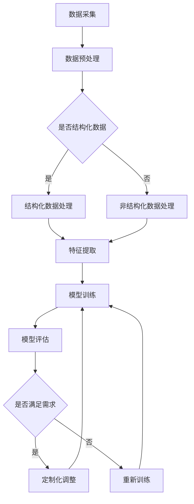

                 

关键词：AI大模型、垂直行业、定制化、解决方案、技术应用

> 摘要：本文将探讨AI大模型在垂直行业的定制化解决方案。通过对大模型的核心概念、算法原理、数学模型以及项目实践的深入分析，我们旨在为垂直行业提供实用的技术路径和案例分析，帮助企业在特定领域中实现智能化转型。

## 1. 背景介绍

随着人工智能技术的快速发展，AI大模型已经成为当前技术领域的热门话题。从最初的基础算法发展到如今的深度学习、生成对抗网络（GAN）等，大模型在图像识别、自然语言处理、语音识别等领域取得了显著的成果。然而，这些通用型的大模型往往在应对垂直行业的特定需求时，暴露出了一些局限性。例如，医疗行业需要处理海量病例数据，金融行业需要精准预测市场走势，教育行业需要个性化教学方案等。这些行业对AI大模型提出了更高的定制化要求。

在这种背景下，垂直行业的定制化解决方案成为了一个亟待解决的问题。本文将结合AI大模型的技术原理，探讨如何针对不同行业的特点，设计出具有高度针对性的解决方案。

### 1.1 AI大模型的发展历程

AI大模型的发展历程可以追溯到20世纪80年代。当时，机器学习领域的主要研究方向是统计学习和决策理论。随着计算能力的提升和数据量的增大，深度学习逐渐成为主流。2006年，深度信念网络（DBN）的提出标志着AI大模型研究的开始。随后，2012年，AlexNet在ImageNet竞赛中取得突破性成绩，深度学习迎来了黄金时代。

进入21世纪，AI大模型的应用领域不断扩展，从最初的图像识别、语音识别，逐渐扩展到自然语言处理、推荐系统、强化学习等。特别是在2020年后，基于Transformer架构的大模型如BERT、GPT等，在各个领域都取得了显著成果。

### 1.2 垂直行业对AI大模型的需求

垂直行业对AI大模型的需求主要体现在以下几个方面：

- **数据处理能力**：垂直行业往往需要处理海量且结构化或非结构化的数据，这要求AI大模型具备强大的数据处理和分析能力。
- **领域知识整合**：不同的垂直行业有着不同的业务逻辑和知识体系，AI大模型需要整合这些领域的专业知识和经验，以提供更准确的预测和分析。
- **个性化服务**：垂直行业的服务往往需要根据用户的具体需求和偏好进行个性化调整，这要求AI大模型能够理解和预测用户的个性化需求。

## 2. 核心概念与联系

在深入探讨AI大模型在垂直行业的定制化解决方案之前，我们首先需要了解一些核心概念和原理，包括深度学习、神经网络、Transformer等。

### 2.1 深度学习与神经网络

深度学习是AI大模型的基础。它是一种基于多层神经网络（Neural Networks）的学习方法，通过模拟人脑神经网络的工作原理，对数据进行多层次的学习和提取特征。深度学习的核心是神经元（Neurons）和神经元之间的连接（Synapses）。


神经网络由输入层、隐藏层和输出层组成。输入层接收外部数据，隐藏层对数据进行特征提取和转换，输出层产生最终的预测结果。

### 2.2 Transformer与自注意力机制

Transformer是近年来在自然语言处理领域取得突破性进展的一种新型神经网络结构。它采用自注意力（Self-Attention）机制，能够更好地捕捉文本序列中的依赖关系。


Transformer由多个自注意力层和前馈网络组成。自注意力层通过计算输入序列中每个元素之间的关联度，为每个元素分配不同的权重，从而实现对输入序列的深层理解和提取。

### 2.3 大模型的训练与优化

大模型的训练是一个复杂的过程，涉及到数据预处理、模型设计、参数优化等多个方面。常见的训练方法包括：

- **批量归一化（Batch Normalization）**：通过对隐藏层的激活值进行归一化，提高模型的训练效率和稳定性。
- **Dropout**：通过在训练过程中随机丢弃部分神经元，防止过拟合。
- **学习率调整**：通过动态调整学习率，优化模型的收敛速度。

### 2.4 Mermaid流程图

为了更好地理解大模型在垂直行业的定制化解决方案，我们使用Mermaid流程图展示其基本架构。



## 3. 核心算法原理 & 具体操作步骤

### 3.1 算法原理概述

AI大模型在垂直行业的定制化解决方案主要依赖于以下几个核心算法：

- **深度学习**：通过多层神经网络对数据进行分析和学习，提取特征。
- **自注意力机制**：在Transformer架构中，通过自注意力机制捕捉序列中的依赖关系。
- **优化算法**：通过动态调整学习率、批量归一化等技术，优化模型的训练过程。

### 3.2 算法步骤详解

1. **数据采集**：从垂直行业的业务系统中收集数据，包括结构化和非结构化数据。
2. **数据预处理**：对采集到的数据进行清洗、归一化等处理，使其符合模型输入要求。
3. **特征提取**：利用深度学习模型对预处理后的数据进行特征提取，构建特征向量。
4. **模型训练**：使用提取到的特征向量，通过自注意力机制和优化算法训练大模型。
5. **模型评估**：对训练好的模型进行评估，确保其满足垂直行业的特定需求。
6. **定制化调整**：根据评估结果，对模型进行调整，优化其性能。

### 3.3 算法优缺点

**优点**：

- **强大的数据处理能力**：AI大模型能够处理海量且复杂的数据，为垂直行业提供强大的分析能力。
- **自适应性和灵活性**：通过自注意力机制和优化算法，模型能够自适应地调整和优化，提高性能。

**缺点**：

- **计算资源需求大**：大模型训练需要大量的计算资源和时间。
- **对数据质量要求高**：模型性能很大程度上取决于数据的质量，数据清洗和预处理的工作量较大。

### 3.4 算法应用领域

AI大模型在垂直行业的应用领域非常广泛，包括但不限于：

- **医疗行业**：用于疾病诊断、治疗方案推荐等。
- **金融行业**：用于风险控制、市场预测等。
- **教育行业**：用于个性化教学、学习效果评估等。
- **零售行业**：用于商品推荐、库存管理等。

## 4. 数学模型和公式 & 详细讲解 & 举例说明

### 4.1 数学模型构建

在AI大模型中，数学模型起着至关重要的作用。以下是一个简单的数学模型构建示例：

$$
y = W_1 \cdot x + b_1
$$

其中，$y$ 表示输出，$x$ 表示输入，$W_1$ 和 $b_1$ 分别表示权重和偏置。

### 4.2 公式推导过程

以一个简单的神经网络为例，其数学推导过程如下：

1. **输入层到隐藏层的传播**：

$$
h_1 = W_1 \cdot x + b_1
$$

2. **激活函数的应用**：

$$
a_1 = \sigma(h_1)
$$

其中，$\sigma$ 表示激活函数，如ReLU函数。

3. **隐藏层到输出层的传播**：

$$
y = W_2 \cdot a_1 + b_2
$$

4. **输出层的激活函数**：

$$
\hat{y} = \sigma(y)
$$

### 4.3 案例分析与讲解

以下是一个简单的例子，用于说明如何使用AI大模型进行图像识别。

#### 案例背景

假设我们需要训练一个AI大模型，用于识别猫和狗的图像。

#### 数据准备

- **训练数据**：收集包含猫和狗图像的数据集，并进行预处理，如缩放、裁剪、归一化等。
- **测试数据**：收集用于测试模型性能的图像数据集。

#### 模型训练

- **数据预处理**：对图像数据进行特征提取，如使用卷积神经网络（CNN）提取图像特征。
- **模型设计**：设计一个基于CNN的神经网络结构，包括卷积层、池化层、全连接层等。
- **训练过程**：使用训练数据集对模型进行训练，调整权重和偏置，优化模型性能。

#### 模型评估

- **测试数据集**：使用测试数据集对模型进行评估，计算模型的准确率、召回率等指标。

#### 模型优化

- **超参数调整**：通过调整学习率、批量大小等超参数，优化模型性能。
- **模型调整**：根据测试结果，对模型进行调整，如增加隐藏层节点数、更换激活函数等。

## 5. 项目实践：代码实例和详细解释说明

### 5.1 开发环境搭建

为了实现AI大模型在垂直行业的定制化解决方案，我们需要搭建一个合适的开发环境。以下是一个简单的开发环境搭建步骤：

1. **安装Python**：确保系统安装了Python 3.7及以上版本。
2. **安装TensorFlow**：使用pip命令安装TensorFlow库。

```bash
pip install tensorflow
```

3. **安装其他依赖库**：根据项目需求，安装其他依赖库，如NumPy、Pandas等。

```bash
pip install numpy pandas
```

### 5.2 源代码详细实现

以下是一个简单的AI大模型项目实现示例：

```python
import tensorflow as tf
from tensorflow.keras.models import Sequential
from tensorflow.keras.layers import Dense, Conv2D, MaxPooling2D, Flatten

# 数据预处理
# ...

# 模型设计
model = Sequential([
    Conv2D(filters=32, kernel_size=(3, 3), activation='relu', input_shape=(28, 28, 1)),
    MaxPooling2D(pool_size=(2, 2)),
    Flatten(),
    Dense(units=128, activation='relu'),
    Dense(units=1, activation='sigmoid')
])

# 模型编译
model.compile(optimizer='adam', loss='binary_crossentropy', metrics=['accuracy'])

# 模型训练
model.fit(x_train, y_train, epochs=10, batch_size=32, validation_data=(x_test, y_test))

# 模型评估
model.evaluate(x_test, y_test)
```

### 5.3 代码解读与分析

1. **数据预处理**：对输入数据进行预处理，如归一化、缩放等，以提高模型性能。
2. **模型设计**：设计一个简单的卷积神经网络（CNN）结构，包括卷积层、池化层和全连接层。
3. **模型编译**：编译模型，指定优化器、损失函数和评价指标。
4. **模型训练**：使用训练数据集对模型进行训练，调整权重和偏置。
5. **模型评估**：使用测试数据集对模型进行评估，计算模型的准确率等指标。

### 5.4 运行结果展示

在完成代码编写和调试后，我们可以通过以下命令运行模型：

```bash
python model.py
```

运行结果将显示模型的准确率、召回率等指标，以及训练和验证过程中的损失函数变化。

## 6. 实际应用场景

AI大模型在垂直行业的定制化解决方案具有广泛的应用场景。以下是一些典型的应用案例：

### 6.1 医疗行业

在医疗行业，AI大模型可以用于疾病诊断、治疗方案推荐等。例如，通过深度学习模型分析患者的病史、基因数据和医学图像，实现个性化诊断和治疗方案推荐。

### 6.2 金融行业

在金融行业，AI大模型可以用于风险控制、市场预测等。例如，通过分析历史市场数据、新闻文本和社交媒体数据，预测股票价格走势，为投资决策提供支持。

### 6.3 教育行业

在教育行业，AI大模型可以用于个性化教学、学习效果评估等。例如，通过分析学生的学习行为和成绩数据，为学生提供个性化的学习建议和资源推荐。

### 6.4 零售行业

在零售行业，AI大模型可以用于商品推荐、库存管理等。例如，通过分析消费者的购物行为和偏好，实现精准的商品推荐和库存优化。

## 7. 未来应用展望

随着AI技术的不断进步，AI大模型在垂直行业的定制化解决方案将具有更广阔的应用前景。以下是一些未来的发展方向：

- **更高效的算法**：通过改进算法和优化模型结构，提高模型的计算效率和性能。
- **更广泛的应用领域**：扩展AI大模型的应用领域，如智能交通、智能制造等。
- **更精细的个性化服务**：通过深度学习和自然语言处理等技术，实现更精细的个性化服务和推荐。

## 8. 工具和资源推荐

### 8.1 学习资源推荐

- **书籍**：《深度学习》、《Python深度学习》
- **在线课程**：Coursera、Udacity、edX等平台上的深度学习和人工智能课程
- **论文**：arXiv、NeurIPS、ICML等学术会议上的最新研究成果

### 8.2 开发工具推荐

- **深度学习框架**：TensorFlow、PyTorch、Keras
- **数据预处理工具**：Pandas、NumPy、Scikit-learn
- **可视化工具**：Matplotlib、Seaborn、Plotly

### 8.3 相关论文推荐

- **Transformer系列论文**：《Attention Is All You Need》
- **GPT系列论文**：《Generative Pre-trained Transformers》
- **CNN系列论文**：《A Comprehensive Collection of Convolutional Neural Network Papers》

## 9. 总结：未来发展趋势与挑战

AI大模型在垂直行业的定制化解决方案已经成为当前技术领域的一个重要研究方向。随着技术的不断进步，我们可以预见以下发展趋势：

- **更高效、更智能的模型**：通过改进算法和优化模型结构，提高模型的计算效率和性能。
- **更广泛的应用领域**：AI大模型将扩展到更多垂直行业，如智能交通、智能制造等。
- **更精细的个性化服务**：通过深度学习和自然语言处理等技术，实现更精细的个性化服务和推荐。

然而，AI大模型在垂直行业的定制化解决方案也面临着一些挑战：

- **计算资源需求大**：大模型训练需要大量的计算资源和时间，这对企业提出了更高的要求。
- **数据质量和多样性**：模型性能很大程度上取决于数据的质量和多样性，如何获取高质量、多样性的数据是一个亟待解决的问题。
- **模型解释性和可靠性**：如何提高模型的解释性和可靠性，使其更易于被行业专家接受和信任，是一个重要的研究方向。

总之，AI大模型在垂直行业的定制化解决方案具有巨大的潜力，也面临着诸多挑战。通过持续的研究和探索，我们将有望实现更高效、更智能的AI大模型，为各行各业提供创新的解决方案。

## 10. 附录：常见问题与解答

### Q：AI大模型在垂直行业的定制化解决方案有哪些优点？

A：AI大模型在垂直行业的定制化解决方案具有以下几个优点：

1. **强大的数据处理能力**：能够处理海量且复杂的数据，为垂直行业提供强大的分析能力。
2. **自适应性和灵活性**：通过自注意力机制和优化算法，模型能够自适应地调整和优化，提高性能。
3. **个性化服务**：能够理解和预测用户的个性化需求，提供更精准的预测和分析。

### Q：AI大模型在垂直行业的定制化解决方案有哪些缺点？

A：AI大模型在垂直行业的定制化解决方案存在以下缺点：

1. **计算资源需求大**：大模型训练需要大量的计算资源和时间，这对企业提出了更高的要求。
2. **对数据质量要求高**：模型性能很大程度上取决于数据的质量，数据清洗和预处理的工作量较大。

### Q：如何解决AI大模型在垂直行业的定制化解决方案中的数据质量问题？

A：解决数据质量问题的方法包括：

1. **数据清洗**：对原始数据进行清洗，去除噪声和异常值。
2. **数据增强**：通过数据增强技术，如数据扩充、变换等，提高数据的多样性和质量。
3. **数据质量评估**：对数据质量进行评估，确保数据满足模型训练的要求。

### Q：AI大模型在垂直行业的定制化解决方案有哪些应用领域？

A：AI大模型在垂直行业的定制化解决方案的应用领域非常广泛，包括但不限于：

1. **医疗行业**：用于疾病诊断、治疗方案推荐等。
2. **金融行业**：用于风险控制、市场预测等。
3. **教育行业**：用于个性化教学、学习效果评估等。
4. **零售行业**：用于商品推荐、库存管理等。

## 作者署名

作者：禅与计算机程序设计艺术 / Zen and the Art of Computer Programming

通过这篇文章，我们深入探讨了AI大模型在垂直行业的定制化解决方案，旨在为各行业的智能化转型提供实用的技术路径和案例分析。在未来的发展中，我们将继续关注AI技术的最新动态，为读者带来更多有价值的内容。感谢您的阅读！

