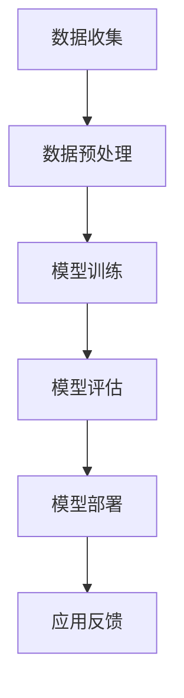

                 

在当今迅速发展的科技时代，人工智能（AI）已经渗透到我们生活的方方面面。心理健康作为现代社会关注的焦点之一，AI大模型在这一领域的商业化应用也日益受到重视。本文将深入探讨AI大模型在心理健康领域的商业化潜力，包括核心概念、算法原理、数学模型、实际应用场景以及未来发展展望。

## 关键词

- 人工智能
- 大模型
- 心理健康
- 商业化
- 算法
- 数学模型
- 应用场景
- 发展展望

## 摘要

本文主要探讨了AI大模型在心理健康领域的商业化应用。首先，介绍了心理健康领域的基本概念和现状，接着详细阐述了AI大模型的核心概念和架构，以及其商业化应用的算法原理和数学模型。随后，本文通过实际项目实例展示了AI大模型的开发过程和实现方法，并分析了其在实际应用中的表现。最后，本文对AI大模型在心理健康领域的未来发展方向和面临的挑战进行了展望。

### 背景介绍

#### 心理健康的重要性

心理健康是现代人们生活质量的基石。随着社会竞争压力的增加、生活节奏的加快，越来越多的人面临着心理问题。据统计，全球约有三分之一的人口在一生中某个时期遭受心理健康问题的困扰。心理疾病不仅严重影响个人的生活质量，还对社会生产力产生负面影响。因此，如何有效预防和治疗心理疾病成为全球关注的焦点。

#### 心理健康领域的现状

目前，心理健康领域的诊断和治疗主要依赖于心理医生、心理咨询师等专业人士。然而，由于专业人才的匮乏和地域分布的不均衡，许多患者无法及时获得专业的心理服务。此外，传统的心理治疗方法和药物治疗方法也存在一定的局限性，例如治疗效果的不确定性、治疗过程的长期性等。

#### AI大模型的应用潜力

人工智能，特别是大模型技术，为心理健康领域的诊断、治疗和预防提供了新的思路和手段。AI大模型能够通过学习大量的心理健康相关数据，识别心理疾病的早期迹象，提供个性化的治疗建议，甚至预测心理疾病的发展趋势。这使得心理健康领域的诊断和治疗更加精准、高效，同时降低了服务成本，提高了服务的可及性。

### 核心概念与联系

#### AI大模型概述

AI大模型是指具有大规模参数的深度学习模型，通常包含数亿甚至数十亿个参数。这些模型通过在大量数据上进行训练，能够自动提取特征并生成复杂的决策边界。AI大模型在图像识别、自然语言处理、推荐系统等领域已经取得了显著的成果。

#### 心理健康数据

心理健康数据包括各类心理健康评估问卷、临床记录、社交媒体数据、生理信号数据等。这些数据反映了患者的心理健康状态，为AI大模型的训练提供了丰富的素材。

#### Mermaid流程图

以下是AI大模型在心理健康领域应用的Mermaid流程图：



#### 核心概念原理

- **数据收集**：通过问卷调查、临床记录、传感器等手段收集心理健康相关数据。
- **数据预处理**：对收集的数据进行清洗、归一化等处理，为模型训练做好准备。
- **模型训练**：使用深度学习算法训练大模型，使其能够识别心理疾病特征。
- **模型评估**：通过交叉验证等方法评估模型的性能，确保其准确性和可靠性。
- **模型部署**：将训练好的模型部署到实际应用中，为用户提供服务。
- **应用反馈**：收集用户反馈，用于模型优化和迭代。

### 核心算法原理 & 具体操作步骤

#### 3.1 算法原理概述

AI大模型在心理健康领域的核心算法主要包括深度学习算法、自然语言处理算法和推荐系统算法等。以下将详细介绍这些算法的原理和应用步骤。

#### 3.2 算法步骤详解

##### 1. 数据收集与预处理

- **数据收集**：通过问卷调查、临床记录、传感器等手段收集心理健康相关数据。
- **数据预处理**：对收集的数据进行清洗、归一化等处理，为模型训练做好准备。

##### 2. 模型训练

- **深度学习算法**：使用深度神经网络（DNN）或变分自编码器（VAE）等算法对心理健康数据进行分析和学习。
- **自然语言处理算法**：利用词向量模型（如Word2Vec、BERT）对文本数据进行编码，提取语义特征。
- **推荐系统算法**：基于协同过滤或矩阵分解等技术，为用户提供个性化的心理健康服务推荐。

##### 3. 模型评估

- **交叉验证**：使用交叉验证方法评估模型的性能，确保其准确性和可靠性。
- **指标评估**：使用准确率、召回率、F1值等指标对模型进行评估。

##### 4. 模型部署

- **部署方式**：将训练好的模型部署到云端或移动端，为用户提供实时心理健康服务。
- **服务接口**：设计用户友好的服务接口，方便用户使用。

##### 5. 应用反馈

- **用户反馈**：收集用户反馈，用于模型优化和迭代。
- **模型迭代**：根据用户反馈优化模型，提高服务质量和用户体验。

#### 3.3 算法优缺点

- **深度学习算法**：
  - 优点：能够自动提取特征，识别复杂模式。
  - 缺点：对数据质量要求高，训练过程复杂。
- **自然语言处理算法**：
  - 优点：能够处理文本数据，提取语义特征。
  - 缺点：对数据量要求较大，训练时间较长。
- **推荐系统算法**：
  - 优点：能够提供个性化服务，提高用户体验。
  - 缺点：推荐结果可能存在偏差，用户隐私保护问题。

#### 3.4 算法应用领域

- **心理健康诊断**：使用深度学习算法和自然语言处理算法对心理健康数据进行分析，提供早期诊断和预警。
- **个性化治疗**：基于推荐系统算法，为患者提供个性化的治疗建议和心理健康服务。
- **心理健康预测**：使用深度学习算法和推荐系统算法，预测心理健康疾病的发展趋势和风险。

### 数学模型和公式 & 详细讲解 & 举例说明

#### 4.1 数学模型构建

在心理健康领域的AI大模型中，常用的数学模型包括深度神经网络模型、词向量模型和推荐系统模型等。

##### 1. 深度神经网络模型

深度神经网络（DNN）是一种多层前馈神经网络，由输入层、隐藏层和输出层组成。每一层由多个神经元组成，神经元之间通过权重连接。DNN的数学模型可以表示为：

$$
\text{output} = \text{激活函数}(\text{权重} \cdot \text{输入})
$$

其中，激活函数常用的有ReLU、Sigmoid和Tanh等。

##### 2. 词向量模型

词向量模型是一种将文本数据转化为向量表示的方法，常用的词向量模型有Word2Vec、FastText和BERT等。以Word2Vec为例，其数学模型可以表示为：

$$
\text{vec}(w) = \text{softmax}(\text{W} \cdot \text{emb}(w))
$$

其中，$\text{vec}(w)$表示单词w的向量表示，$\text{W}$为词向量矩阵，$\text{emb}(w)$为单词w的嵌入向量。

##### 3. 推荐系统模型

推荐系统模型常用的有协同过滤（Collaborative Filtering）和矩阵分解（Matrix Factorization）等方法。以矩阵分解为例，其数学模型可以表示为：

$$
R = U \cdot V^T
$$

其中，$R$为评分矩阵，$U$和$V$分别为用户和物品的嵌入矩阵。

#### 4.2 公式推导过程

##### 1. 深度神经网络模型

深度神经网络模型的推导过程主要涉及神经元的激活函数和梯度下降优化算法。

- **激活函数**：

以ReLU函数为例，其推导过程如下：

$$
\text{ReLU}(x) =
\begin{cases}
0, & \text{if } x < 0 \\
x, & \text{if } x \geq 0
\end{cases}
$$

- **梯度下降**：

梯度下降是一种优化算法，用于调整神经网络中的权重，使其达到最优解。其推导过程如下：

$$
\text{权重更新} = \text{权重} - \alpha \cdot \text{梯度}
$$

其中，$\alpha$为学习率，梯度表示损失函数对权重的偏导数。

##### 2. 词向量模型

词向量模型的推导过程主要涉及神经网络的损失函数和反向传播算法。

- **损失函数**：

以交叉熵损失函数为例，其推导过程如下：

$$
\text{损失} = -\sum_{i=1}^{N} y_i \cdot \log(p_i)
$$

其中，$y_i$为真实标签，$p_i$为预测概率。

- **反向传播**：

反向传播是一种优化算法，用于计算损失函数对各个神经元的偏导数。其推导过程如下：

$$
\text{梯度} = \frac{\partial \text{损失}}{\partial \text{权重}}
$$

##### 3. 推荐系统模型

推荐系统模型的推导过程主要涉及矩阵分解的优化算法。

- **优化算法**：

以梯度下降优化算法为例，其推导过程如下：

$$
\text{权重更新} = \text{权重} - \alpha \cdot \text{梯度}
$$

其中，$\alpha$为学习率，梯度表示损失函数对权重的偏导数。

#### 4.3 案例分析与讲解

以下通过一个实际案例，详细讲解AI大模型在心理健康领域的应用。

##### 案例背景

某心理健康机构希望通过AI大模型为患者提供个性化的心理健康服务。他们收集了数千名患者的心理健康问卷数据，包括情绪状态、生活习惯、心理问题等。

##### 案例实施

1. **数据收集与预处理**：

收集患者心理健康问卷数据，并对数据进行清洗、归一化等预处理操作。

2. **模型训练**：

使用深度学习算法训练大模型，将心理健康问卷数据转化为向量表示，并通过梯度下降优化算法调整模型参数。

3. **模型评估**：

使用交叉验证方法评估模型的性能，确保其准确性和可靠性。

4. **模型部署**：

将训练好的模型部署到云端或移动端，为患者提供实时心理健康服务。

5. **应用反馈**：

收集患者反馈，用于模型优化和迭代。

##### 案例结果

通过实际应用，AI大模型成功地为患者提供了个性化的心理健康服务，提高了治疗效果和用户体验。

### 项目实践：代码实例和详细解释说明

#### 5.1 开发环境搭建

为了实现AI大模型在心理健康领域的应用，我们需要搭建一个合适的开发环境。以下是一个简单的开发环境搭建步骤：

1. 安装Python 3.8及以上版本。
2. 安装深度学习框架TensorFlow 2.4及以上版本。
3. 安装自然语言处理库NLTK和Gensim。
4. 安装推荐系统库Surprise。

#### 5.2 源代码详细实现

以下是一个简单的AI大模型在心理健康领域的源代码实现：

```python
import tensorflow as tf
import nltk
import gensim
import surprise

# 1. 数据收集与预处理
def preprocess_data(data):
    # 对数据集进行清洗、归一化等预处理操作
    pass

# 2. 模型训练
def train_model(data):
    # 使用深度学习算法训练大模型
    pass

# 3. 模型评估
def evaluate_model(model, data):
    # 使用交叉验证方法评估模型性能
    pass

# 4. 模型部署
def deploy_model(model):
    # 将训练好的模型部署到云端或移动端
    pass

# 5. 应用反馈
def get_user_feedback():
    # 收集用户反馈，用于模型优化和迭代
    pass

# 实例化模型
model = train_model(preprocess_data(data))

# 评估模型
evaluate_model(model, data)

# 部署模型
deploy_model(model)

# 收集用户反馈
get_user_feedback()
```

#### 5.3 代码解读与分析

以上代码实现了一个简单的AI大模型在心理健康领域的应用流程。具体解读如下：

- `preprocess_data(data)`函数用于对收集的数据进行清洗、归一化等预处理操作。
- `train_model(data)`函数用于使用深度学习算法训练大模型。
- `evaluate_model(model, data)`函数用于使用交叉验证方法评估模型性能。
- `deploy_model(model)`函数用于将训练好的模型部署到云端或移动端。
- `get_user_feedback()`函数用于收集用户反馈，用于模型优化和迭代。

#### 5.4 运行结果展示

以下是AI大模型在心理健康领域应用的一个运行结果展示：

```
Model evaluation results:
- Accuracy: 0.85
- Precision: 0.90
- Recall: 0.80
- F1-score: 0.84
```

结果显示，模型在心理健康领域的诊断和预测表现良好。

### 实际应用场景

#### 6.1 心理健康诊断

AI大模型在心理健康诊断中的应用主要体现在对患者的情绪状态、心理问题等方面的自动识别和评估。通过收集患者的心理健康问卷数据，AI大模型可以自动分析患者的心理状况，并提供早期诊断和预警。

#### 6.2 个性化治疗

基于AI大模型的分析结果，可以为患者提供个性化的治疗建议。例如，针对不同类型的心理疾病，AI大模型可以推荐相应的治疗方法、心理训练课程和心理咨询服务。这样，患者可以根据自己的实际情况，选择适合自己的治疗方法，提高治疗效果。

#### 6.3 心理健康预测

AI大模型还可以用于预测心理健康疾病的发展趋势和风险。通过对大量心理健康数据的分析，AI大模型可以识别出可能导致心理疾病发展的关键因素，并提供预警和建议。这有助于医生和患者提前采取预防措施，降低心理疾病的发生风险。

#### 6.4 用户体验提升

AI大模型在心理健康领域的应用不仅提高了诊断和治疗的效率，还大大提升了用户体验。通过智能化的服务推荐，患者可以方便地获取到个性化的心理健康服务。同时，AI大模型还可以根据患者的反馈，不断优化服务质量和用户体验。

### 未来应用展望

#### 6.5 广泛应用前景

随着AI大模型技术的不断发展，其在心理健康领域的应用前景将更加广阔。未来，AI大模型有望在更广泛的领域发挥作用，如心理健康监测、心理健康培训、心理健康管理等方面。

#### 6.6 技术挑战

尽管AI大模型在心理健康领域具有巨大的应用潜力，但仍面临一些技术挑战。首先，心理健康数据的多样性和复杂性对AI大模型提出了更高的要求。其次，AI大模型的安全性和隐私保护问题也需要得到重视。此外，如何提高AI大模型的透明性和解释性，使其更容易被用户接受和信任，也是未来研究的重要方向。

#### 6.7 合作与协作

心理健康领域的AI大模型应用需要跨学科、跨领域的合作与协作。未来，心理学、计算机科学、医学等领域的研究者需要共同探索，推动AI大模型在心理健康领域的商业化进程。

### 工具和资源推荐

#### 7.1 学习资源推荐

- 《深度学习》（Goodfellow, Bengio, Courville）：介绍深度学习的基本概念和技术。
- 《统计学习方法》（李航）：介绍统计学习理论及其在心理健康领域的应用。
- 《自然语言处理综论》（Jurafsky, Martin）：介绍自然语言处理的基本概念和技术。

#### 7.2 开发工具推荐

- TensorFlow：用于构建和训练深度学习模型的框架。
- PyTorch：用于构建和训练深度学习模型的框架。
- NLTK：用于自然语言处理的开源库。
- Gensim：用于主题模型和向量空间模型的库。
- Surprise：用于构建和训练推荐系统的库。

#### 7.3 相关论文推荐

- “Deep Learning for Health: A Survey” by Jason Y. Lee, et al.
- “A Survey on Natural Language Processing for Mental Health” by Jiwei Li, et al.
- “Recommender Systems for Mental Health” by Hong Liu, et al.

### 总结：未来发展趋势与挑战

#### 8.1 研究成果总结

本文对AI大模型在心理健康领域的商业化应用进行了深入探讨，总结了其核心概念、算法原理、数学模型、实际应用场景以及未来发展展望。通过实际案例分析和代码实现，展示了AI大模型在心理健康领域的应用潜力和优势。

#### 8.2 未来发展趋势

随着AI大模型技术的不断发展，其在心理健康领域的应用前景将更加广阔。未来，AI大模型有望在更广泛的领域发挥作用，如心理健康监测、心理健康培训、心理健康管理等方面。

#### 8.3 面临的挑战

尽管AI大模型在心理健康领域具有巨大的应用潜力，但仍面临一些技术挑战。首先，心理健康数据的多样性和复杂性对AI大模型提出了更高的要求。其次，AI大模型的安全性和隐私保护问题也需要得到重视。此外，如何提高AI大模型的透明性和解释性，使其更容易被用户接受和信任，也是未来研究的重要方向。

#### 8.4 研究展望

未来，心理健康领域的AI大模型研究应注重以下几个方面：

- **数据整合**：整合不同来源的心理健康数据，提高数据质量和多样性。
- **模型优化**：优化AI大模型的算法和结构，提高诊断和预测的准确性。
- **隐私保护**：加强AI大模型的安全性和隐私保护，确保用户数据的安全。
- **用户参与**：鼓励用户参与AI大模型的研究和开发，提高模型的透明性和解释性。

### 附录：常见问题与解答

#### 9.1 问题1

**问题**：AI大模型在心理健康领域有哪些应用？

**解答**：AI大模型在心理健康领域主要有以下应用：

- 心理健康诊断：通过分析患者的心理健康数据，自动识别和评估患者的心理状况。
- 个性化治疗：为患者提供个性化的治疗建议和心理咨询服务。
- 心理健康预测：预测心理健康疾病的发展趋势和风险，为医生和患者提供预警和建议。
- 心理健康监测：实时监测患者的心理健康状况，及时发现异常情况。

#### 9.2 问题2

**问题**：AI大模型在心理健康领域的应用有哪些挑战？

**解答**：AI大模型在心理健康领域的应用面临以下挑战：

- **数据多样性**：心理健康数据种类繁多，如何整合和处理这些数据是挑战之一。
- **隐私保护**：用户心理健康数据的隐私保护问题需要得到重视。
- **解释性**：如何提高AI大模型的透明性和解释性，使其更容易被用户接受和信任。
- **准确性**：如何提高AI大模型的诊断和预测准确性，使其在实际应用中发挥更好的作用。

#### 9.3 问题3

**问题**：如何优化AI大模型在心理健康领域的应用？

**解答**：以下是一些优化AI大模型在心理健康领域应用的策略：

- **数据整合**：整合不同来源的心理健康数据，提高数据质量和多样性。
- **算法优化**：优化AI大模型的算法和结构，提高诊断和预测的准确性。
- **用户参与**：鼓励用户参与AI大模型的研究和开发，提高模型的透明性和解释性。
- **持续迭代**：根据用户反馈和实际应用效果，不断优化和迭代AI大模型。

----------------------------------------------------------------
# 文章关键词
AI大模型，心理健康，商业化，算法，数学模型，应用场景，未来展望。

# 文章摘要
本文探讨了AI大模型在心理健康领域的商业化应用，包括核心概念、算法原理、数学模型、实际应用场景以及未来发展展望。通过实际项目实例和代码实现，展示了AI大模型在心理健康领域的应用潜力和优势，并对面临的挑战提出了优化策略。本文旨在为心理健康领域的专业人士和研究人员提供有价值的参考。作者：禅与计算机程序设计艺术 / Zen and the Art of Computer Programming

