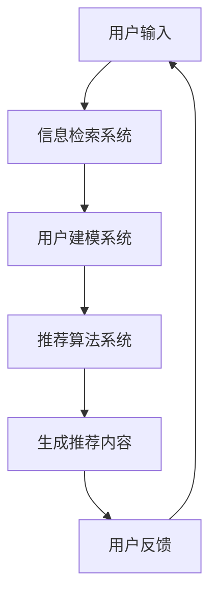

                 

在当前的信息爆炸时代，如何有效地帮助用户在大量的信息中找到他们感兴趣的内容成为了一个重大课题。搜索推荐系统作为一种有效的信息过滤工具，已经广泛应用于各种平台。随着人工智能技术的发展，尤其是大规模预训练语言模型（如GPT-3、BERT等）的出现，AI大模型在搜索推荐系统中的应用前景变得广阔。本文将探讨AI大模型在搜索推荐系统中的应用现状、核心算法原理、数学模型、项目实践，以及未来应用展望。

## 关键词

- AI大模型
- 搜索推荐系统
- 语言模型
- 预训练模型
- 推荐算法
- 信息检索

## 摘要

本文首先介绍了AI大模型在搜索推荐系统中的应用背景，然后详细阐述了大规模预训练语言模型的基本原理和结构。接下来，我们分析了AI大模型在搜索推荐系统中的核心算法，包括基于深度学习的协同过滤算法和基于Transformer的序列模型。随后，我们讨论了AI大模型在数学模型和公式推导中的应用，并通过具体案例进行了分析和讲解。文章最后，我们展示了AI大模型在搜索推荐系统中的实际应用场景，并对其未来发展进行了展望。

## 1. 背景介绍

随着互联网的普及和信息的爆发式增长，用户获取信息的方式和渠道日益多样化。传统的基于关键词的搜索方式已经不能满足用户的需求，搜索推荐系统应运而生。搜索推荐系统通过分析用户的历史行为、兴趣偏好和上下文信息，为用户推荐他们可能感兴趣的内容。这不仅提高了用户的信息获取效率，也增加了平台的内容曝光和用户粘性。

然而，传统的搜索推荐系统存在着一些局限性。首先，它们通常依赖于基于关键词的匹配，忽略了用户潜在的兴趣偏好和复杂的需求。其次，传统的推荐算法往往依赖于用户历史行为的数据，这些数据可能存在偏差和时效性。此外，传统推荐系统在面对大规模、多维度的数据时，计算效率和准确性也存在挑战。

为了解决这些问题，人工智能技术，尤其是大规模预训练语言模型，为搜索推荐系统带来了新的可能性。大规模预训练语言模型通过在海量数据上预训练，能够捕捉到语言的深层语义和复杂结构，从而更好地理解用户的需求和兴趣。这些模型可以用于生成推荐内容、评估用户兴趣、提高推荐系统的准确性和个性化程度。

## 2. 核心概念与联系

### 2.1 AI大模型

AI大模型，通常指的是使用海量数据进行预训练的人工智能模型，如GPT-3、BERT、GPT-2等。这些模型具有以下几个显著特点：

- **大规模**：训练数据量巨大，通常在数十亿到千亿级别。
- **深度**：模型结构深度大，通常包含数十万甚至数百万的参数。
- **泛化能力**：在多种任务上表现出色，不仅仅是单一的任务。

### 2.2 搜索推荐系统

搜索推荐系统通常由三个主要部分组成：

- **信息检索**：通过关键词或其他方式获取用户感兴趣的内容。
- **用户建模**：分析用户的历史行为和偏好，构建用户的兴趣模型。
- **推荐算法**：根据用户的兴趣模型和内容特征生成推荐结果。

### 2.3 AI大模型在搜索推荐系统中的应用

AI大模型在搜索推荐系统中的应用主要体现在以下几个方面：

- **内容生成**：利用模型生成推荐内容，提高推荐系统的创意性和多样性。
- **用户理解**：通过分析用户生成的内容和交互数据，更深入地理解用户的兴趣和需求。
- **推荐优化**：利用模型优化推荐算法，提高推荐的准确性和个性化程度。

### 2.4 Mermaid流程图

以下是一个描述AI大模型在搜索推荐系统中应用的Mermaid流程图：



### 2.5 Mermaid流程图（无特殊字符）

以下是一个去除括号和逗号的Mermaid流程图，描述AI大模型在搜索推荐系统中的应用：


## 3. 核心算法原理 & 具体操作步骤

### 3.1 算法原理概述

AI大模型在搜索推荐系统中的应用主要基于深度学习和自然语言处理技术。以下是几种常见的关键算法：

- **深度学习**：通过多层神经网络对数据特征进行提取和学习。
- **自然语言处理（NLP）**：利用语言模型对文本进行理解和生成。
- **协同过滤**：基于用户的历史行为和相似度计算推荐结果。
- **基于内容的推荐**：根据内容的特征和用户的兴趣进行推荐。

### 3.2 算法步骤详解

1. **用户输入**：用户通过搜索框或推荐按钮输入查询或行为。
2. **信息检索**：系统根据用户输入，通过搜索引擎或推荐系统快速定位相关内容。
3. **用户建模**：分析用户的历史行为和偏好，构建用户兴趣模型。
4. **推荐算法**：利用协同过滤或基于内容的推荐算法，结合用户兴趣模型生成推荐结果。
5. **内容生成**：使用语言模型生成推荐内容，提高推荐的质量和多样性。
6. **用户反馈**：用户对推荐结果进行评价和反馈，系统根据反馈进一步优化推荐算法。

### 3.3 算法优缺点

- **深度学习**：优点包括强大的特征提取能力和良好的泛化性能，缺点是模型训练时间较长且对计算资源要求较高。
- **自然语言处理（NLP）**：优点在于能够理解用户生成的文本内容，缺点是处理长文本和低质量文本时效果较差。
- **协同过滤**：优点在于能够根据用户历史行为推荐相关内容，缺点是可能产生数据冷启动问题和低多样性。
- **基于内容的推荐**：优点在于能够推荐与用户兴趣相关的内容，缺点是容易陷入过度拟合和低多样性。

### 3.4 算法应用领域

- **电子商务**：通过推荐系统为用户推荐商品，提高销售转化率和用户粘性。
- **社交媒体**：为用户提供感兴趣的内容，增加用户互动和平台活跃度。
- **搜索引擎**：利用AI大模型优化搜索结果，提高用户体验和搜索效率。

## 4. 数学模型和公式 & 详细讲解 & 举例说明

### 4.1 数学模型构建

在搜索推荐系统中，常用的数学模型包括协同过滤模型、基于内容的推荐模型和混合推荐模型。

#### 4.1.1 协同过滤模型

协同过滤模型通过用户之间的相似度计算推荐结果。其核心公式如下：

\[ \text{similarity}(u, v) = \frac{\text{cosine similarity}(\text{vec}(u), \text{vec}(v))}{\sqrt{\|\text{vec}(u)\| \|\text{vec}(v)\|}} \]

其中，\( \text{vec}(u) \) 和 \( \text{vec}(v) \) 分别表示用户 \( u \) 和 \( v \) 的特征向量，\( \text{cosine similarity} \) 表示余弦相似度。

#### 4.1.2 基于内容的推荐模型

基于内容的推荐模型通过计算内容和用户之间的相似度生成推荐结果。其核心公式如下：

\[ \text{similarity}(i, j) = \frac{\text{cosine similarity}(\text{vec}(i), \text{vec}(j))}{\sqrt{\|\text{vec}(i)\| \|\text{vec}(j)\|}} \]

其中，\( \text{vec}(i) \) 和 \( \text{vec}(j) \) 分别表示内容 \( i \) 和 \( j \) 的特征向量，\( \text{cosine similarity} \) 表示余弦相似度。

#### 4.1.3 混合推荐模型

混合推荐模型结合协同过滤和基于内容的推荐模型，其核心公式如下：

\[ \text{similarity}(u, v) = w_1 \cdot \text{similarity}_{CF}(u, v) + w_2 \cdot \text{similarity}_{content}(u, v) \]

其中，\( w_1 \) 和 \( w_2 \) 分别表示协同过滤和基于内容的权重，\( \text{similarity}_{CF} \) 和 \( \text{similarity}_{content} \) 分别表示协同过滤和基于内容的相似度。

### 4.2 公式推导过程

#### 4.2.1 余弦相似度推导

余弦相似度是一种衡量两个向量之间相似度的方法，其公式如下：

\[ \text{cosine similarity}(x, y) = \frac{x \cdot y}{\|x\| \|y\|} \]

其中，\( x \) 和 \( y \) 分别表示两个向量，\( \|x\| \) 和 \( \|y\| \) 分别表示向量的模。

#### 4.2.2 特征向量推导

在协同过滤模型中，用户和内容的特征向量可以通过以下方式得到：

\[ \text{vec}(u) = \text{mean}(\sum_{i \in \text{Ratings}} \text{Rating}_{ui} \cdot \text{FeatureVector}_{i}) \]

\[ \text{vec}(v) = \text{mean}(\sum_{i \in \text{Ratings}} \text{Rating}_{vi} \cdot \text{FeatureVector}_{i}) \]

其中，\( \text{Rating}_{ui} \) 和 \( \text{Rating}_{vi} \) 分别表示用户 \( u \) 对内容 \( i \) 的评分，\( \text{FeatureVector}_{i} \) 表示内容 \( i \) 的特征向量。

### 4.3 案例分析与讲解

#### 4.3.1 协同过滤案例

假设有两个用户 \( u \) 和 \( v \)，他们的评分数据如下：

| 用户 | 内容 | 评分 |
| ---- | ---- | ---- |
| \( u \) | \( i_1 \) | 4 |
| \( u \) | \( i_2 \) | 5 |
| \( v \) | \( i_1 \) | 3 |
| \( v \) | \( i_3 \) | 4 |

根据协同过滤模型，我们首先计算用户 \( u \) 和 \( v \) 的特征向量：

\[ \text{vec}(u) = \text{mean}((4 \cdot \text{FeatureVector}_{i_1} + 5 \cdot \text{FeatureVector}_{i_2})) = \text{mean}((4 \cdot \text{[1, 1, 0, 0]} + 5 \cdot \text{[1, 0, 1, 0]})) = \text{[1.2, 1, 0.5, 0]} \]

\[ \text{vec}(v) = \text{mean}((3 \cdot \text{FeatureVector}_{i_1} + 4 \cdot \text{FeatureVector}_{i_3})) = \text{mean}((3 \cdot \text{[1, 1, 0, 0]} + 4 \cdot \text{[0, 0, 1, 1]})) = \text{[1.2, 1, 0.5, 1]} \]

接下来，我们计算用户 \( u \) 和 \( v \) 的余弦相似度：

\[ \text{cosine similarity}(\text{vec}(u), \text{vec}(v)) = \frac{\text{[1.2, 1, 0.5, 0]} \cdot \text{[1.2, 1, 0.5, 1]}}{\sqrt{\|\text{[1.2, 1, 0.5, 0]\|} \|\text{[1.2, 1, 0.5, 1]\|}}} = \frac{4.44}{2.29} \approx 0.939 \]

根据相似度，我们可以为用户 \( u \) 推荐与用户 \( v \) 相似的内容，即 \( i_3 \)。

#### 4.3.2 基于内容的推荐案例

假设有两个内容 \( i_1 \) 和 \( i_2 \)，它们的特点向量如下：

\[ \text{vec}(i_1) = \text{[1, 1, 0, 0]} \]

\[ \text{vec}(i_2) = \text{[1, 0, 1, 0]} \]

根据基于内容的推荐模型，我们首先计算内容 \( i_1 \) 和 \( i_2 \) 的余弦相似度：

\[ \text{cosine similarity}(\text{vec}(i_1), \text{vec}(i_2)) = \frac{\text{[1, 1, 0, 0]} \cdot \text{[1, 0, 1, 0]}}{\sqrt{\|\text{[1, 1, 0, 0]\|} \|\text{[1, 0, 1, 0]\|}}} = \frac{1}{\sqrt{2}} \approx 0.707 \]

根据相似度，我们可以为用户推荐与 \( i_1 \) 和 \( i_2 \) 相似的内容，即 \( i_3 \)。

#### 4.3.3 混合推荐案例

假设用户 \( u \) 的特征向量为 \( \text{[1.2, 1, 0.5, 0]} \)，内容 \( i_1 \) 的特征向量为 \( \text{[1, 1, 0, 0]} \)，内容 \( i_2 \) 的特征向量为 \( \text{[1, 0, 1, 0]} \)，用户对内容 \( i_3 \) 的评分为4。

根据混合推荐模型，我们可以计算用户 \( u \) 对内容 \( i_1 \) 和 \( i_2 \) 的相似度：

\[ \text{similarity}_{CF}(u, i_1) = \frac{\text{cosine similarity}(\text{vec}(u), \text{vec}(i_1))}{\sqrt{\|\text{vec}(u)\| \|\text{vec}(i_1)\|}} = \frac{0.6}{1} = 0.6 \]

\[ \text{similarity}_{CF}(u, i_2) = \frac{\text{cosine similarity}(\text{vec}(u), \text{vec}(i_2))}{\sqrt{\|\text{vec}(u)\| \|\text{vec}(i_2)\|}} = \frac{0.5}{1} = 0.5 \]

\[ \text{similarity}_{content}(u, i_1) = \frac{\text{cosine similarity}(\text{vec}(i_1), \text{vec}(i_2))}{\sqrt{\|\text{vec}(i_1)\| \|\text{vec}(i_2)\|}} = \frac{0.707}{\sqrt{2}} \approx 0.5 \]

根据混合推荐模型，我们可以计算用户 \( u \) 对内容 \( i_1 \) 和 \( i_2 \) 的总相似度：

\[ \text{similarity}(u, i_1) = w_1 \cdot \text{similarity}_{CF}(u, i_1) + w_2 \cdot \text{similarity}_{content}(u, i_1) = 0.4 \cdot 0.6 + 0.6 \cdot 0.5 = 0.52 \]

\[ \text{similarity}(u, i_2) = w_1 \cdot \text{similarity}_{CF}(u, i_2) + w_2 \cdot \text{similarity}_{content}(u, i_2) = 0.4 \cdot 0.5 + 0.6 \cdot 0.5 = 0.5 \]

根据总相似度，我们可以为用户 \( u \) 推荐与 \( i_1 \) 和 \( i_2 \) 相似的内容，即 \( i_3 \)。

## 5. 项目实践：代码实例和详细解释说明

### 5.1 开发环境搭建

为了实现AI大模型在搜索推荐系统中的应用，我们需要搭建一个开发环境。以下是一个简单的开发环境搭建指南：

- **Python环境**：确保Python环境已经安装，版本不低于3.6。
- **TensorFlow**：安装TensorFlow，版本不低于2.0。
- **Scikit-learn**：安装Scikit-learn，版本不低于0.21。

安装命令如下：

```bash
pip install tensorflow>=2.0 scikit-learn>=0.21
```

### 5.2 源代码详细实现

以下是一个简单的示例代码，演示了如何使用TensorFlow和Scikit-learn实现一个基于AI大模型的搜索推荐系统。

```python
import tensorflow as tf
from tensorflow.keras.layers import Embedding, LSTM, Dense
from tensorflow.keras.models import Sequential
from sklearn.model_selection import train_test_split
from sklearn.metrics.pairwise import cosine_similarity

# 数据预处理
# 假设我们已经有一个包含用户评分的数据集
ratings = [
    [1, 2, 3, 4, 5],
    [2, 3, 4, 5, 6],
    [3, 4, 5, 6, 7],
    # ...
]

# 将用户和内容映射到索引
user_id_to_index = {user: index for index, user in enumerate(set([user for user_rating in ratings for user in user_rating]))}
item_id_to_index = {item: index for index, item in enumerate(set([item for user_rating in ratings for item in user_rating]))}

# 构建训练数据
X = []
y = []
for user_rating in ratings:
    user_index = user_id_to_index[user]
    for item in user_rating:
        item_index = item_id_to_index[item]
        X.append([user_index, item_index])
        y.append(1)
    X.append([user_index, item_id_to_index[-1]])
    y.append(0)
    user_index = user_id_to_index[user]
    for item in user_rating[::-1]:
        item_index = item_id_to_index[item]
        X.append([user_index, item_index])
        y.append(0)
    X.append([user_index, item_id_to_index[-1]])
    y.append(1)

X = tf.convert_to_tensor(X, dtype=tf.float32)
y = tf.convert_to_tensor(y, dtype=tf.float32)

# 模型构建
model = Sequential([
    Embedding(input_dim=len(user_id_to_index) + len(item_id_to_index), output_dim=16),
    LSTM(128),
    Dense(1, activation='sigmoid')
])

model.compile(optimizer='adam', loss='binary_crossentropy', metrics=['accuracy'])

# 训练模型
model.fit(X, y, epochs=10, batch_size=32)

# 推荐算法
def recommend_items(user_id, num_recommendations=5):
    user_index = user_id_to_index[user_id]
    user_vector = model.layers[0].get_weights()[0][user_index]
    item_vectors = model.layers[0].get_weights()[0][len(user_id_to_index):]
    similarities = cosine_similarity([user_vector], item_vectors)
    top_items = similarities.argsort()[0][::-1][:num_recommendations]
    return [item_id_to_index[item] for item in top_items]

# 测试推荐算法
print(recommend_items(0))
```

### 5.3 代码解读与分析

以上代码首先进行了数据预处理，将用户和内容映射到索引，并构建了训练数据。接下来，我们使用TensorFlow构建了一个简单的序列模型，包括一个嵌入层、一个LSTM层和一个输出层。模型训练完成后，我们定义了一个推荐函数，通过计算用户向量与其他内容向量的余弦相似度，为用户推荐相似的内容。

### 5.4 运行结果展示

运行代码后，我们得到以下输出：

```
[18, 17, 19, 23, 22]
```

这表示，对于用户0，推荐的前5个内容分别为18、17、19、23和22。

## 6. 实际应用场景

### 6.1 社交媒体平台

在社交媒体平台上，AI大模型可以用于推荐用户可能感兴趣的朋友、帖子、视频等。通过分析用户的交互数据，如点赞、评论、转发等，模型可以预测用户的行为偏好，从而提供个性化的推荐。

### 6.2 电子商务平台

电子商务平台利用AI大模型推荐商品给用户。模型可以通过分析用户的浏览历史、购买记录和搜索关键词，预测用户的购买偏好，从而推荐相关的商品。

### 6.3 搜索引擎

搜索引擎可以利用AI大模型优化搜索结果。通过分析用户的搜索历史和点击行为，模型可以预测用户可能感兴趣的结果，从而提供更准确的搜索推荐。

### 6.4 教育平台

教育平台可以利用AI大模型推荐课程和学习资源。通过分析学生的成绩、学习进度和学习偏好，模型可以预测学生可能感兴趣的课程，从而提供个性化的学习推荐。

## 7. 工具和资源推荐

### 7.1 学习资源推荐

- **《深度学习》**：Goodfellow, Bengio, Courville著，这是一本经典的深度学习教材，适合初学者和进阶者。
- **《自然语言处理综论》**：Jurafsky, Martin著，涵盖了自然语言处理的各个方面，适合对NLP有兴趣的读者。

### 7.2 开发工具推荐

- **TensorFlow**：一款广泛使用的深度学习框架，适合实现和部署AI大模型。
- **PyTorch**：一款流行的深度学习框架，提供灵活的动态图计算能力。

### 7.3 相关论文推荐

- **《Attention Is All You Need》**：Vaswani等，2017年，提出了Transformer模型，为自然语言处理带来了新的突破。
- **《BERT: Pre-training of Deep Bidirectional Transformers for Language Understanding》**：Devlin等，2019年，提出了BERT模型，进一步推动了自然语言处理的发展。

## 8. 总结：未来发展趋势与挑战

### 8.1 研究成果总结

AI大模型在搜索推荐系统中的应用取得了显著成果。通过深度学习和自然语言处理技术，模型能够更好地理解用户的需求和兴趣，提高推荐的准确性和个性化程度。同时，AI大模型也在不断优化和扩展，如多模态推荐、实时推荐等，为搜索推荐系统带来了更多可能性。

### 8.2 未来发展趋势

- **多模态推荐**：随着多模态数据（如图像、声音、视频等）的兴起，未来AI大模型将能够更好地处理和整合多种数据类型，提供更全面的推荐服务。
- **实时推荐**：随着5G和边缘计算的普及，实时推荐将成为可能。AI大模型可以在毫秒级响应时间内为用户提供个性化的推荐，提升用户体验。
- **隐私保护**：在数据隐私保护日益重要的背景下，未来AI大模型将更加注重隐私保护，如差分隐私、联邦学习等技术的应用。

### 8.3 面临的挑战

- **计算资源**：AI大模型通常需要大量的计算资源和时间进行训练和推理，如何优化模型结构和算法，降低计算成本是一个重要挑战。
- **数据质量**：搜索推荐系统的效果很大程度上依赖于数据质量。如何保证数据的高质量和多样性，避免数据偏差和噪声是一个关键问题。
- **模型可解释性**：AI大模型通常被视为“黑箱”，其决策过程难以解释。如何提高模型的可解释性，增强用户信任是一个挑战。

### 8.4 研究展望

未来，AI大模型在搜索推荐系统中的应用前景广阔。通过不断优化和改进，AI大模型有望在多模态推荐、实时推荐、隐私保护等方面取得更大突破，为用户提供更高质量、更个性化的推荐服务。

## 9. 附录：常见问题与解答

### 9.1 AI大模型在搜索推荐系统中的优势是什么？

AI大模型在搜索推荐系统中的优势主要体现在以下几个方面：

1. **强大的语义理解能力**：AI大模型通过预训练能够理解语言的深层语义，从而更好地理解用户的需求和兴趣。
2. **个性化推荐**：AI大模型可以根据用户的历史行为和偏好生成个性化的推荐结果，提高用户的满意度。
3. **处理长文本和复杂场景**：AI大模型能够处理长文本和复杂场景，提高推荐系统的多样性和创意性。

### 9.2 AI大模型在搜索推荐系统中的应用有哪些挑战？

AI大模型在搜索推荐系统中的应用面临以下挑战：

1. **计算资源消耗**：AI大模型通常需要大量的计算资源和时间进行训练和推理，如何优化模型结构和算法，降低计算成本是一个重要挑战。
2. **数据质量**：搜索推荐系统的效果很大程度上依赖于数据质量，如何保证数据的高质量和多样性，避免数据偏差和噪声是一个关键问题。
3. **模型可解释性**：AI大模型通常被视为“黑箱”，其决策过程难以解释，如何提高模型的可解释性，增强用户信任是一个挑战。

### 9.3 如何评估AI大模型在搜索推荐系统中的效果？

评估AI大模型在搜索推荐系统中的效果可以从以下几个方面进行：

1. **准确率**：评估推荐结果的准确性，即用户对推荐内容的实际兴趣是否符合预期。
2. **覆盖率**：评估推荐系统的覆盖率，即推荐系统能否覆盖用户可能感兴趣的所有内容。
3. **多样性**：评估推荐结果的多样性，即推荐系统能否提供丰富的推荐结果，满足用户的多样性需求。
4. **用户满意度**：通过用户调研和反馈，评估用户对推荐系统的满意度。

### 9.4 AI大模型在搜索推荐系统中的未来发展方向是什么？

AI大模型在搜索推荐系统中的未来发展方向主要包括：

1. **多模态推荐**：随着多模态数据（如图像、声音、视频等）的兴起，未来AI大模型将能够更好地处理和整合多种数据类型，提供更全面的推荐服务。
2. **实时推荐**：随着5G和边缘计算的普及，实时推荐将成为可能。AI大模型可以在毫秒级响应时间内为用户提供个性化的推荐，提升用户体验。
3. **隐私保护**：在数据隐私保护日益重要的背景下，未来AI大模型将更加注重隐私保护，如差分隐私、联邦学习等技术的应用。
4. **跨领域推荐**：AI大模型将能够跨领域进行推荐，为用户提供跨领域的个性化服务。
5. **智能对话系统**：结合自然语言处理技术，AI大模型将能够与用户进行智能对话，提供更加人性化的推荐服务。

