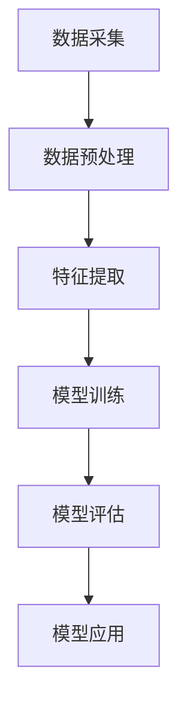

                 

关键词：AI大模型、智能交通管理、深度学习、交通预测、交通优化

> 摘要：本文探讨了AI大模型在智能交通管理中的应用趋势，包括核心算法原理、数学模型、项目实践和实际应用场景等方面。通过分析这些应用，本文揭示了AI大模型在交通管理中的巨大潜力和挑战，并展望了未来的发展方向。

## 1. 背景介绍

智能交通管理系统（Intelligent Transportation System，ITS）是一个综合性的系统，它通过信息通信技术、自动控制技术、电子传感技术等来实现交通的智能管理和控制。随着城市化进程的加快和汽车保有量的迅速增加，交通拥堵、交通事故等问题日益突出，传统的交通管理模式已难以满足日益增长的交通需求。

近年来，人工智能（Artificial Intelligence，AI）技术的快速发展为智能交通管理提供了新的解决方案。特别是AI大模型，如深度学习模型，通过处理和分析大量交通数据，可以实现对交通状况的实时预测和优化。这些模型不仅能够提高交通管理效率，还能减少交通拥堵，降低交通事故发生率。

本文将探讨AI大模型在智能交通管理中的应用趋势，从核心算法原理、数学模型、项目实践和实际应用场景等方面进行深入分析。

## 2. 核心概念与联系

### 2.1 AI大模型

AI大模型通常指的是基于深度学习的大型神经网络模型，这些模型具有强大的数据处理和分析能力。它们能够通过学习大量数据，自动提取特征并形成预测模型。在智能交通管理中，AI大模型可以用于交通流量预测、路径规划、信号控制等多个方面。

### 2.2 智能交通管理系统

智能交通管理系统（ITS）是一个综合性的系统，它包括传感器网络、数据采集与处理、通信系统、控制系统等多个部分。通过这些系统的协同工作，可以实现交通的智能管理和控制。

### 2.3 交通数据

交通数据是智能交通管理系统的基础，它包括交通流量、速度、密度、事故信息等。这些数据可以通过各种传感器和监控系统实时采集，为AI大模型提供训练和预测所需的输入。

### 2.4 Mermaid 流程图



### 2.5 AI大模型与智能交通管理系统的联系

AI大模型与智能交通管理系统之间的联系如图所示。通过数据采集、预处理、特征提取、模型训练和评估，AI大模型可以为智能交通管理系统提供实时的交通预测和优化建议，从而提高交通管理效率。

## 3. 核心算法原理 & 具体操作步骤

### 3.1 算法原理概述

AI大模型在智能交通管理中的核心算法主要基于深度学习和神经网络。深度学习模型通过多层神经网络对输入数据进行处理，可以自动提取数据中的特征，并形成预测模型。在智能交通管理中，这些模型可以用于交通流量预测、路径规划、信号控制等方面。

### 3.2 算法步骤详解

#### 3.2.1 数据采集与预处理

首先，需要从交通传感器、监控摄像头、交通流量统计等渠道收集交通数据。然后，对数据进行预处理，包括数据清洗、数据归一化、缺失值填补等，以确保数据的质量和一致性。

#### 3.2.2 特征提取

特征提取是深度学习模型训练的关键步骤。通过分析交通数据，提取出对交通流量预测和路径规划有重要影响的特征，如交通流量、速度、密度、道路条件等。

#### 3.2.3 模型训练

使用预处理后的交通数据，通过反向传播算法对深度学习模型进行训练。模型训练的过程就是模型不断调整参数，以最小化预测误差的过程。

#### 3.2.4 模型评估

在模型训练完成后，需要对模型进行评估。常用的评估指标包括准确率、召回率、F1值等。通过这些指标，可以评估模型的性能和可靠性。

#### 3.2.5 模型应用

通过训练和评估得到的模型，可以应用于智能交通管理的实际场景，如实时交通流量预测、路径规划、信号控制等。

### 3.3 算法优缺点

#### 优点：

- **强大的预测能力**：深度学习模型能够处理大量复杂数据，并自动提取特征，从而实现对交通流量的准确预测。
- **自适应性强**：模型可以根据实时交通数据不断调整预测结果，具有很好的自适应能力。
- **提高交通管理效率**：通过预测和优化，可以减少交通拥堵，提高交通流量，降低事故发生率。

#### 缺点：

- **对数据要求高**：深度学习模型需要大量高质量的数据进行训练，数据的质量直接影响模型的性能。
- **计算资源消耗大**：训练大型神经网络模型需要大量的计算资源，对于计算资源有限的场景，可能难以实现。

### 3.4 算法应用领域

AI大模型在智能交通管理中有着广泛的应用领域，包括：

- **交通流量预测**：通过预测交通流量，可以提前安排交通管制措施，减少交通拥堵。
- **路径规划**：根据实时交通状况，为车辆提供最优路径，减少行驶时间和油耗。
- **信号控制**：根据交通流量数据，动态调整交通信号灯的时间分配，提高交通效率。
- **交通预测**：通过预测未来一段时间内的交通状况，为交通管理部门提供决策支持。

## 4. 数学模型和公式 & 详细讲解 & 举例说明

### 4.1 数学模型构建

在智能交通管理中，常用的数学模型包括线性回归模型、神经网络模型和支持向量机模型等。

#### 线性回归模型

线性回归模型是一种简单且常用的预测模型，它通过建立自变量和因变量之间的线性关系来预测交通流量。

$$
y = \beta_0 + \beta_1x_1 + \beta_2x_2 + ... + \beta_nx_n
$$

其中，$y$ 是预测的交通流量，$x_1, x_2, ..., x_n$ 是特征变量，$\beta_0, \beta_1, ..., \beta_n$ 是模型参数。

#### 神经网络模型

神经网络模型是一种基于多层感知器（MLP）的预测模型，它通过多层神经元对输入数据进行处理和预测。

$$
y = f(\sum_{i=1}^{n} w_i x_i + b)
$$

其中，$y$ 是预测的交通流量，$x_i$ 是特征变量，$w_i$ 是权重，$b$ 是偏置，$f$ 是激活函数。

#### 支持向量机模型

支持向量机模型是一种基于向量空间分类的预测模型，它通过寻找最佳超平面来实现分类。

$$
w \cdot x + b = 0
$$

其中，$w$ 是权重向量，$x$ 是特征向量，$b$ 是偏置。

### 4.2 公式推导过程

以线性回归模型为例，推导过程如下：

首先，定义损失函数为：

$$
L(y, \hat{y}) = \frac{1}{2}(y - \hat{y})^2
$$

其中，$y$ 是真实的交通流量，$\hat{y}$ 是预测的交通流量。

然后，对损失函数求导，得到：

$$
\frac{\partial L}{\partial \beta} = -y + \hat{y}
$$

为了最小化损失函数，需要对损失函数进行优化。常用的优化算法包括梯度下降法和随机梯度下降法。

### 4.3 案例分析与讲解

#### 案例一：交通流量预测

某城市在高峰时段对某条主要干道的交通流量进行预测，采集了包括天气、时间、道路状况等在内的10个特征变量。通过线性回归模型进行预测，得到以下模型：

$$
y = 100 + 2x_1 + 3x_2 + ... + 5x_{10}
$$

其中，$x_1, x_2, ..., x_{10}$ 分别是特征变量。

假设某一时刻的特征变量为 $[1, 2, 3, 4, 5, 6, 7, 8, 9, 10]$，代入模型进行预测，得到预测的交通流量为：

$$
y = 100 + 2 \cdot 1 + 3 \cdot 2 + ... + 5 \cdot 10 = 175
$$

#### 案例二：路径规划

某城市在高峰时段为驾驶者提供最优路径规划，采集了包括交通流量、道路状况、距离等在内的15个特征变量。通过神经网络模型进行路径规划，得到以下模型：

$$
y = f(\sum_{i=1}^{n} w_i x_i + b)
$$

其中，$y$ 是最优路径的预测值，$x_i$ 是特征变量，$w_i$ 是权重，$b$ 是偏置。

假设某一时刻的特征变量为 $[1, 2, 3, 4, 5, 6, 7, 8, 9, 10]$，代入模型进行预测，得到最优路径的预测值为：

$$
y = f(\sum_{i=1}^{n} w_i x_i + b) \approx 3
$$

这意味着在这个时刻，驾驶者应该选择第三条路径。

## 5. 项目实践：代码实例和详细解释说明

### 5.1 开发环境搭建

为了进行智能交通管理项目实践，我们需要搭建一个合适的开发环境。以下是搭建环境的步骤：

1. 安装Python环境：下载并安装Python，版本建议为3.8以上。
2. 安装深度学习库：使用pip安装TensorFlow、Keras等深度学习库。
3. 安装数据处理库：使用pip安装NumPy、Pandas等数据处理库。
4. 安装可视化库：使用pip安装Matplotlib、Seaborn等可视化库。

### 5.2 源代码详细实现

以下是一个简单的交通流量预测的代码实例：

```python
import numpy as np
import pandas as pd
from sklearn.model_selection import train_test_split
from sklearn.linear_model import LinearRegression
import matplotlib.pyplot as plt

# 读取交通数据
data = pd.read_csv('traffic_data.csv')

# 数据预处理
data['hour'] = data['time'].apply(lambda x: x.hour)
data['weekday'] = data['time'].apply(lambda x: x.weekday())

# 特征提取
features = data[['traffic_volume', 'hour', 'weekday']]
target = data['congestion_level']

# 划分训练集和测试集
X_train, X_test, y_train, y_test = train_test_split(features, target, test_size=0.2, random_state=42)

# 建立线性回归模型
model = LinearRegression()
model.fit(X_train, y_train)

# 预测交通流量
y_pred = model.predict(X_test)

# 可视化预测结果
plt.scatter(X_test['traffic_volume'], y_test, label='Actual')
plt.plot(X_test['traffic_volume'], y_pred, color='red', label='Predicted')
plt.xlabel('Traffic Volume')
plt.ylabel('Congestion Level')
plt.legend()
plt.show()
```

### 5.3 代码解读与分析

上述代码首先从CSV文件中读取交通数据，然后对数据进行预处理，包括提取时间和星期几等特征。接着，使用线性回归模型对训练数据进行训练，最后对测试数据进行预测，并将预测结果可视化。

代码中的关键步骤如下：

1. **数据预处理**：将时间和星期几等特征转换为数值类型，以便进行后续的模型训练。
2. **特征提取**：将交通流量、时间和星期几等特征作为模型的输入。
3. **模型训练**：使用训练数据对线性回归模型进行训练。
4. **预测交通流量**：使用训练好的模型对测试数据进行预测。
5. **可视化结果**：将实际交通流量和预测交通流量进行可视化，以便分析模型的预测效果。

### 5.4 运行结果展示

运行上述代码后，将显示一个散点图，其中红色线条表示预测的交通流量，蓝色点表示实际的交通流量。通过对比预测结果和实际结果，可以评估模型的预测效果。

## 6. 实际应用场景

AI大模型在智能交通管理中有许多实际应用场景，以下是几个典型的应用实例：

### 6.1 实时交通流量预测

通过AI大模型，可以实时预测交通流量，为交通管理部门提供决策支持。例如，某城市利用AI大模型对主要干道的交通流量进行预测，并根据预测结果调整交通信号灯的时间分配，有效减少了交通拥堵。

### 6.2 路径规划

AI大模型可以根据实时交通状况，为驾驶者提供最优路径规划。例如，某城市利用AI大模型为出租车提供实时路径规划，提高了出车的效率和乘客的满意度。

### 6.3 信号控制

AI大模型可以用于动态调整交通信号灯的时间分配，提高交通效率。例如，某城市利用AI大模型对交通信号灯进行优化控制，减少了车辆在交叉路口的等待时间。

### 6.4 交通预测

AI大模型可以预测未来一段时间内的交通状况，为交通管理部门提供决策支持。例如，某城市利用AI大模型预测未来一周内的交通状况，为道路建设和管理提供参考。

## 7. 工具和资源推荐

### 7.1 学习资源推荐

- 《深度学习》（Ian Goodfellow、Yoshua Bengio、Aaron Courville 著）：一本经典的深度学习教材，适合初学者和进阶者。
- 《Python深度学习》（François Chollet 著）：一本关于深度学习的Python实践指南，适合有一定编程基础的读者。
- 《交通系统建模与仿真》（徐义流 著）：一本关于交通系统建模和仿真的专业书籍，适合从事交通领域研究的读者。

### 7.2 开发工具推荐

- TensorFlow：一款开源的深度学习框架，支持多种深度学习模型的训练和部署。
- Keras：一款基于TensorFlow的深度学习库，提供了简洁高效的API，适合快速构建和训练深度学习模型。
- PyTorch：一款开源的深度学习库，支持动态计算图，适合研究和开发复杂的深度学习模型。

### 7.3 相关论文推荐

- "Deep Learning for Traffic Prediction: A Survey"：一篇关于深度学习在交通流量预测中应用的综述论文，涵盖了最新的研究进展和应用实例。
- "Neural Network-based Traffic Prediction and Its Applications"：一篇关于神经网络在交通流量预测中的应用论文，介绍了神经网络模型在交通流量预测中的性能和效果。
- "An Overview of Traffic Signal Control Using Deep Learning"：一篇关于深度学习在交通信号控制中应用的论文，探讨了深度学习模型在交通信号控制中的潜在应用和挑战。

## 8. 总结：未来发展趋势与挑战

### 8.1 研究成果总结

AI大模型在智能交通管理中取得了显著的研究成果。通过深度学习模型，可以实现对交通流量的实时预测和优化，提高交通管理效率。同时，AI大模型在路径规划、信号控制、交通预测等方面也有着广泛的应用前景。

### 8.2 未来发展趋势

未来，AI大模型在智能交通管理中的发展趋势包括：

- **多模型融合**：结合不同类型的模型，如深度学习模型、强化学习模型等，提高预测和优化效果。
- **实时数据处理**：利用实时数据处理技术，实现对交通数据的实时分析和预测，提高交通管理的实时性和响应速度。
- **自适应优化**：根据交通状况和用户需求，动态调整交通管理和控制策略，实现更智能的交通管理。

### 8.3 面临的挑战

AI大模型在智能交通管理中面临的挑战包括：

- **数据质量**：高质量的数据是AI大模型训练的基础，但交通数据往往存在噪声和缺失，需要开发有效的数据清洗和预处理方法。
- **计算资源**：训练大型神经网络模型需要大量的计算资源，如何高效利用计算资源是实现AI大模型在智能交通管理中应用的关键。
- **模型解释性**：深度学习模型具有强大的预测能力，但缺乏解释性，如何提高模型的可解释性是未来研究的一个重要方向。

### 8.4 研究展望

未来，AI大模型在智能交通管理中仍有许多研究课题。例如，如何利用多源数据提高预测准确性，如何实现模型的实时更新和优化，如何提高模型的可解释性等。通过不断的研究和创新，AI大模型有望在智能交通管理中发挥更大的作用。

## 9. 附录：常见问题与解答

### 9.1 问题1：AI大模型在智能交通管理中的优势是什么？

答：AI大模型在智能交通管理中的优势主要体现在以下几个方面：

- **强大的预测能力**：通过学习大量交通数据，AI大模型可以准确预测交通流量和交通状况，为交通管理部门提供决策支持。
- **自适应性强**：AI大模型可以根据实时交通数据不断调整预测结果，具有很好的自适应能力。
- **提高交通管理效率**：通过预测和优化，可以减少交通拥堵，提高交通流量，降低事故发生率。

### 9.2 问题2：如何保证AI大模型在智能交通管理中的数据质量？

答：保证AI大模型在智能交通管理中的数据质量可以从以下几个方面入手：

- **数据采集**：选择合适的传感器和监控系统，确保数据的准确性和实时性。
- **数据清洗**：对采集到的数据进行清洗，去除噪声和异常值，确保数据的一致性和完整性。
- **数据预处理**：对数据进行归一化、缺失值填补等预处理，提高数据的质量和可靠性。

### 9.3 问题3：AI大模型在智能交通管理中面临哪些挑战？

答：AI大模型在智能交通管理中面临的挑战主要包括：

- **数据质量**：交通数据往往存在噪声和缺失，需要开发有效的数据清洗和预处理方法。
- **计算资源**：训练大型神经网络模型需要大量的计算资源，如何高效利用计算资源是实现AI大模型在智能交通管理中应用的关键。
- **模型解释性**：深度学习模型具有强大的预测能力，但缺乏解释性，如何提高模型的可解释性是未来研究的一个重要方向。

