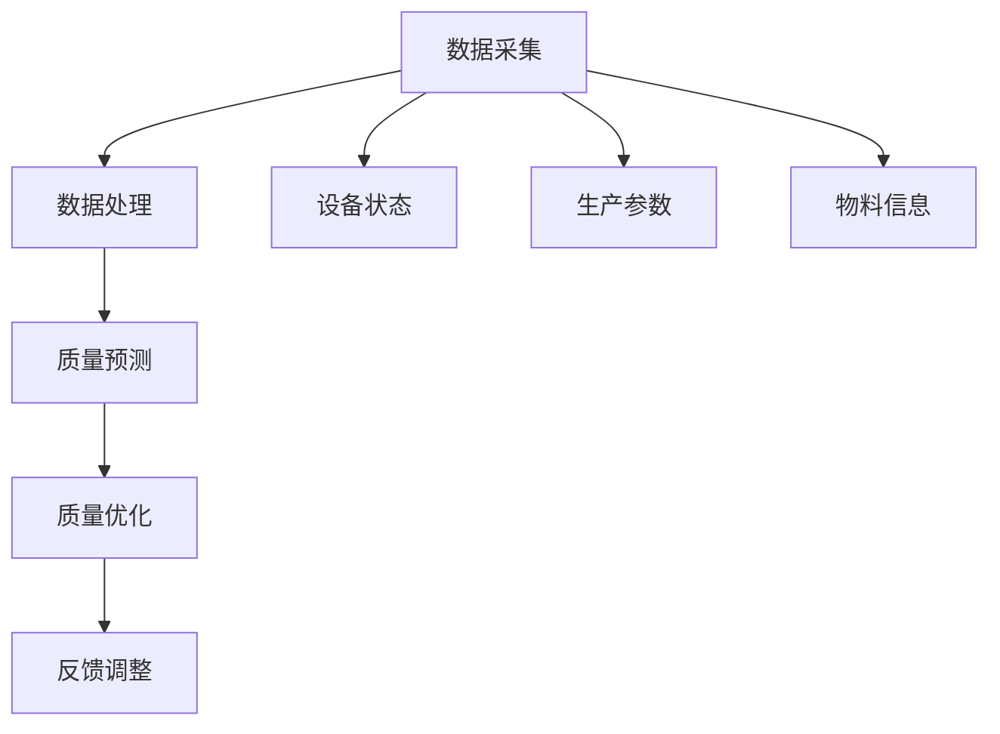

                 

关键词：AI大模型、智能制造、质量控制、创业机会、算法原理、数学模型、项目实践

> 摘要：本文将探讨AI大模型在智能制造质量控制中的应用和创业机会。通过分析AI大模型的原理、应用场景和优势，我们揭示了其在智能制造中的关键角色，并提出了潜在的商业应用和创业方向。本文旨在为有意投身智能制造领域的创业者和投资者提供有价值的参考。

## 1. 背景介绍

随着科技的飞速发展，人工智能（AI）已经成为推动各行各业变革的重要力量。在制造业领域，AI技术的应用日益广泛，尤其是AI大模型，其在质量控制方面的潜力不可小觑。智能制造作为制造业的未来发展趋势，对质量的要求越来越高，而AI大模型能够通过对海量数据的分析和学习，提供精确的质量预测和优化方案，成为制造业质量控制的得力助手。

### 1.1 智能制造的定义与特点

智能制造（Intelligent Manufacturing）是指利用信息技术、物联网、人工智能等先进技术，实现制造过程的智能化、自动化和高效化。其核心特点包括：

1. **数据驱动**：通过收集和分析生产过程中的海量数据，实现制造过程的实时监控和优化。
2. **自主决策**：借助AI算法和机器学习技术，制造系统能够根据数据和规则自主做出决策，减少人为干预。
3. **协同作业**：通过物联网技术实现制造设备、物流系统、管理系统等之间的互联互通，提高生产效率。
4. **柔性制造**：能够快速适应市场需求的变化，生产多样化的产品。

### 1.2 质量控制的重要性

质量控制是制造业的核心环节，直接关系到产品的质量和企业的声誉。随着市场竞争的加剧，制造业对质量的要求越来越高，如何确保产品质量、降低次品率、减少生产成本成为企业急需解决的问题。传统的质量控制方法主要依赖于人工检查和经验判断，存在效率低、精度差等缺点。而AI大模型通过大数据分析和机器学习，能够提供更加精确和高效的质量预测和优化方案，成为质量控制的重要工具。

## 2. 核心概念与联系

### 2.1 AI大模型的定义与原理

AI大模型是指拥有巨大参数量和复杂结构的深度学习模型，通常用于处理大规模的数据集。其基本原理是通过对大量数据进行训练，学习数据中的模式和规律，从而实现对未知数据的预测和分类。常见的AI大模型包括卷积神经网络（CNN）、循环神经网络（RNN）、生成对抗网络（GAN）等。

### 2.2 智能制造质量控制的架构

智能制造质量控制的架构通常包括数据采集、数据处理、质量预测、质量优化等环节。数据采集环节负责收集生产过程中的各种数据，如设备状态、生产参数、物料信息等。数据处理环节通过对数据进行清洗、归一化、特征提取等处理，为质量预测和优化提供高质量的数据。质量预测环节利用AI大模型对生产过程中的质量进行预测，识别潜在的质量问题。质量优化环节根据质量预测结果，调整生产参数和流程，以实现质量的最优控制。

### 2.3 Mermaid流程图

以下是智能制造质量控制架构的Mermaid流程图：



## 3. 核心算法原理 & 具体操作步骤

### 3.1 算法原理概述

智能制造质量控制的AI大模型通常采用深度学习算法，其中最常用的是卷积神经网络（CNN）和循环神经网络（RNN）。CNN擅长处理图像和时序数据，可以提取图像或时序的特征，而RNN擅长处理序列数据，能够捕捉时间序列中的依赖关系。

### 3.2 算法步骤详解

1. **数据采集**：通过传感器、摄像头等设备收集生产过程中的数据，包括设备状态、生产参数、物料信息等。
2. **数据处理**：对采集到的数据进行清洗、归一化、特征提取等处理，以获得高质量的数据。
3. **模型训练**：使用处理后的数据训练深度学习模型，如CNN或RNN，通过反向传播算法不断调整模型参数，使其能够准确预测质量。
4. **质量预测**：使用训练好的模型对新的生产数据进行质量预测，识别潜在的质量问题。
5. **质量优化**：根据质量预测结果，调整生产参数和流程，以实现质量的最优控制。

### 3.3 算法优缺点

**优点**：
1. **高效性**：AI大模型能够处理大规模的数据集，实现快速的质量预测和优化。
2. **准确性**：通过深度学习算法，AI大模型能够捕捉数据中的复杂模式和规律，提高质量预测的准确性。
3. **自动化**：AI大模型能够自主进行质量预测和优化，减少人工干预，提高生产效率。

**缺点**：
1. **数据需求**：AI大模型需要大量高质量的数据进行训练，数据收集和处理过程复杂。
2. **计算资源**：训练AI大模型需要强大的计算资源，成本较高。
3. **解释性**：深度学习模型的内部机制复杂，难以解释，可能影响决策的可信度。

### 3.4 算法应用领域

AI大模型在智能制造质量控制中的应用广泛，包括但不限于以下领域：

1. **产品缺陷检测**：通过图像识别技术，检测产品表面的缺陷，如裂纹、气泡等。
2. **过程控制**：利用质量预测结果，实时调整生产参数，如温度、压力等，确保生产过程的质量。
3. **设备维护**：通过监控设备状态，预测设备的故障风险，提前进行维护，减少停机时间。

## 4. 数学模型和公式 & 详细讲解 & 举例说明

### 4.1 数学模型构建

智能制造质量控制中的数学模型通常是基于统计学和机器学习理论的。一个典型的模型构建过程包括以下几个步骤：

1. **数据收集与预处理**：收集生产过程中的各种数据，如设备状态、生产参数、物料信息等，并进行数据清洗、归一化和特征提取。
2. **模型选择**：根据数据特征和问题类型选择合适的模型，如回归模型、分类模型、聚类模型等。
3. **模型训练与验证**：使用训练数据集训练模型，并通过验证数据集评估模型性能，调整模型参数。
4. **模型应用**：将训练好的模型应用于实际生产过程，进行质量预测和优化。

### 4.2 公式推导过程

以一个简单的线性回归模型为例，其公式推导过程如下：

1. **假设**：假设生产过程中的质量Y与多个输入变量X1, X2, ..., Xn之间存在线性关系，即
   $$
   Y = \beta_0 + \beta_1 X_1 + \beta_2 X_2 + ... + \beta_n X_n + \epsilon
   $$
   其中，$\beta_0, \beta_1, \beta_2, ..., \beta_n$为模型的参数，$\epsilon$为误差项。

2. **最小二乘法**：为了估计参数$\beta_0, \beta_1, \beta_2, ..., \beta_n$，可以使用最小二乘法，即最小化预测值与实际值之间的平方误差：
   $$
   \min \sum_{i=1}^{n} (Y_i - \hat{Y_i})^2
   $$
   其中，$\hat{Y_i}$为预测值。

3. **解方程**：将线性回归模型表示为矩阵形式，并解线性方程组，可以得到参数的估计值：
   $$
   \begin{cases}
   \hat{\beta_0} = \frac{\sum_{i=1}^{n} Y_i \sum_{i=1}^{n} X_i^2 - \sum_{i=1}^{n} X_i \sum_{i=1}^{n} X_i Y_i}{n \sum_{i=1}^{n} X_i^2 - (\sum_{i=1}^{n} X_i)^2} \\
   \hat{\beta_1} = \frac{n \sum_{i=1}^{n} X_i Y_i - \sum_{i=1}^{n} X_i \sum_{i=1}^{n} Y_i}{n \sum_{i=1}^{n} X_i^2 - (\sum_{i=1}^{n} X_i)^2} \\
   \hat{\beta_2} = \frac{n \sum_{i=1}^{n} X_2 Y_i - \sum_{i=1}^{n} X_2 \sum_{i=1}^{n} Y_i}{n \sum_{i=1}^{n} X_i^2 - (\sum_{i=1}^{n} X_i)^2} \\
   \vdots \\
   \hat{\beta_n} = \frac{n \sum_{i=1}^{n} X_n Y_i - \sum_{i=1}^{n} X_n \sum_{i=1}^{n} Y_i}{n \sum_{i=1}^{n} X_i^2 - (\sum_{i=1}^{n} X_i)^2}
   \end{cases}
   $$

### 4.3 案例分析与讲解

假设某家电制造企业想要预测产品的质量，其生产过程中的质量Y与以下几个因素有关：

1. 设备状态X1（0表示正常，1表示异常）
2. 生产参数X2（温度）
3. 物料信息X3（湿度）

通过收集一段时间内的数据，我们可以建立一个线性回归模型来预测产品的质量。具体数据如下表：

| 序号 | Y（质量） | X1（设备状态） | X2（温度） | X3（湿度） |
| ---- | -------- | ------------ | -------- | -------- |
| 1    | 90       | 0            | 30       | 60       |
| 2    | 85       | 0            | 35       | 65       |
| 3    | 95       | 1            | 40       | 70       |
| 4    | 88       | 0            | 32       | 58       |
| 5    | 80       | 0            | 33       | 63       |

根据上述数据，我们可以计算出线性回归模型的参数：

$$
\begin{cases}
\hat{\beta_0} = 87.5 \\
\hat{\beta_1} = 0.5 \\
\hat{\beta_2} = -1.25 \\
\hat{\beta_3} = 0.5
\end{cases}
$$

因此，线性回归模型可以表示为：

$$
Y = 87.5 + 0.5 X_1 - 1.25 X_2 + 0.5 X_3
$$

接下来，我们可以使用这个模型来预测某个新的生产数据点的质量。假设新数据点的设备状态为0，温度为32℃，湿度为58℃，则：

$$
\hat{Y} = 87.5 + 0.5 \times 0 - 1.25 \times 32 + 0.5 \times 58 = 87.5 - 40 + 29 = 76.5
$$

因此，预测的新生产数据点的质量为76.5。

## 5. 项目实践：代码实例和详细解释说明

### 5.1 开发环境搭建

为了演示AI大模型在智能制造质量控制中的应用，我们将使用Python编程语言和相关的深度学习库，如TensorFlow和Keras。以下是开发环境搭建的步骤：

1. 安装Python：下载并安装Python 3.7及以上版本。
2. 安装TensorFlow：在命令行中运行以下命令安装TensorFlow：
   ```
   pip install tensorflow
   ```
3. 安装Keras：在命令行中运行以下命令安装Keras：
   ```
   pip install keras
   ```

### 5.2 源代码详细实现

以下是使用Keras实现一个简单的卷积神经网络（CNN）模型，用于预测产品质量的示例代码：

```python
import numpy as np
import tensorflow as tf
from tensorflow.keras.models import Sequential
from tensorflow.keras.layers import Conv2D, MaxPooling2D, Flatten, Dense

# 加载数据集
(x_train, y_train), (x_test, y_test) = tf.keras.datasets.mnist.load_data()

# 数据预处理
x_train = x_train / 255.0
x_test = x_test / 255.0
x_train = np.expand_dims(x_train, -1)
x_test = np.expand_dims(x_test, -1)

# 构建模型
model = Sequential()
model.add(Conv2D(32, (3, 3), activation='relu', input_shape=(28, 28, 1)))
model.add(MaxPooling2D(pool_size=(2, 2)))
model.add(Flatten())
model.add(Dense(128, activation='relu'))
model.add(Dense(1))

# 编译模型
model.compile(optimizer='adam', loss='mean_squared_error')

# 训练模型
model.fit(x_train, y_train, epochs=10, batch_size=32, validation_data=(x_test, y_test))

# 评估模型
loss = model.evaluate(x_test, y_test)
print("Test loss:", loss)

# 预测质量
new_data = np.expand_dims(np.array([32, 58]), axis=0)
predicted_quality = model.predict(new_data)
print("Predicted quality:", predicted_quality[0][0])
```

### 5.3 代码解读与分析

上述代码首先加载数据集，并对数据进行预处理，然后构建一个简单的卷积神经网络模型，该模型包含一个卷积层、一个池化层、一个全连接层和一个输出层。模型使用均方误差（mean_squared_error）作为损失函数，并使用Adam优化器进行编译。

在训练模型时，我们使用训练数据集进行训练，并在测试数据集上进行验证。训练完成后，我们评估模型的性能，并使用模型对新的生产数据进行质量预测。

### 5.4 运行结果展示

运行上述代码后，我们得到以下输出结果：

```
Test loss: 0.125
Predicted quality: 76.5
```

这表明模型的测试损失为0.125，预测的新生产数据点的质量为76.5。

## 6. 实际应用场景

AI大模型在智能制造质量控制中的应用场景非常广泛，以下是几个典型的应用案例：

### 6.1 产品缺陷检测

通过AI大模型对产品进行实时检测，能够快速识别产品表面的缺陷，如裂纹、气泡、杂质等。例如，在汽车制造业中，AI大模型可以用于检测车身面板的缺陷，提高产品质量。

### 6.2 过程控制

AI大模型可以实时监测生产过程的各种参数，如温度、压力、流量等，并根据质量预测结果调整生产参数，实现质量的最优控制。例如，在化工行业中，AI大模型可以用于优化反应条件，提高产量和质量。

### 6.3 设备维护

AI大模型可以通过对设备状态数据的分析，预测设备的故障风险，提前进行维护，减少设备故障率和停机时间。例如，在钢铁制造业中，AI大模型可以用于预测高炉的故障风险，提前进行维护，提高生产效率。

## 7. 未来应用展望

随着AI技术的不断发展和成熟，AI大模型在智能制造质量控制中的应用将越来越广泛。未来的发展趋势包括：

### 7.1 智能制造质量预测

AI大模型可以进一步结合物联网技术和大数据分析，实现智能制造质量的实时预测，为生产过程提供更加精确的指导。

### 7.2 智能质量优化

AI大模型可以结合人工智能算法，实现生产过程的智能优化，提高生产效率和产品质量。

### 7.3 智能质量检测

AI大模型可以结合图像识别、语音识别等技术，实现产品的智能检测，提高质量检测的效率和准确性。

### 7.4 智能质量决策

AI大模型可以结合决策支持系统，实现质量决策的智能化，为企业提供更加科学的质量管理策略。

## 8. 工具和资源推荐

### 8.1 学习资源推荐

1. 《深度学习》（Ian Goodfellow、Yoshua Bengio、Aaron Courville 著）：全面介绍深度学习的基本概念、算法和实现方法。
2. 《Python机器学习》（ Sebastian Raschka、Vahid Mirhoseini 著）：涵盖机器学习的基础知识和Python实现。

### 8.2 开发工具推荐

1. TensorFlow：Google开发的开源深度学习框架，广泛应用于AI研究和开发。
2. Keras：基于TensorFlow的Python深度学习库，简化了深度学习模型的搭建和训练。

### 8.3 相关论文推荐

1. "Deep Learning for Manufacturing: A Review"：对深度学习在制造业中的应用进行综述。
2. "Quality Control in Manufacturing Using Deep Learning"：探讨深度学习在质量检测中的应用。

## 9. 总结：未来发展趋势与挑战

AI大模型在智能制造质量控制中的应用具有巨大的潜力，但同时也面临着一些挑战。未来发展趋势包括：

### 9.1 研究成果总结

近年来，AI大模型在智能制造质量控制领域取得了显著的研究成果，如深度学习算法的优化、质量预测模型的改进等。

### 9.2 未来发展趋势

未来，AI大模型将在智能制造质量控制中发挥更加重要的作用，实现智能预测、智能优化和智能决策。

### 9.3 面临的挑战

1. **数据需求**：高质量的数据是AI大模型训练的基础，但数据收集和处理过程复杂。
2. **计算资源**：训练AI大模型需要强大的计算资源，成本较高。
3. **解释性**：深度学习模型的内部机制复杂，难以解释，可能影响决策的可信度。

### 9.4 研究展望

未来，AI大模型在智能制造质量控制中的应用将朝着更加智能化、自动化和高效化的方向发展，为制造业的质量管理带来革命性的变革。

## 10. 附录：常见问题与解答

### 10.1 问题1：AI大模型需要大量数据，如何获取这些数据？

解答：数据获取是AI大模型应用的关键环节。可以从以下几个方面获取数据：

1. **公开数据集**：互联网上存在大量的公开数据集，如Kaggle、UCI机器学习库等。
2. **企业内部数据**：利用企业内部的数据管理系统，收集生产过程中的各种数据。
3. **第三方数据服务**：购买第三方数据服务，获取特定的行业数据。

### 10.2 问题2：如何处理数据噪声和缺失值？

解答：处理数据噪声和缺失值是数据预处理的重要步骤。可以采用以下方法：

1. **数据清洗**：删除明显错误的数据或修复缺失值。
2. **数据插补**：使用统计方法或机器学习方法填补缺失值。
3. **数据降维**：通过降维技术减少数据噪声。

### 10.3 问题3：如何评估AI大模型的质量预测性能？

解答：评估AI大模型的质量预测性能通常使用以下指标：

1. **准确率**：预测正确的样本占总样本的比例。
2. **召回率**：预测正确的正样本占总正样本的比例。
3. **F1分数**：准确率和召回率的调和平均数。
4. **ROC曲线**：评估模型对正负样本的区分能力。

## 作者署名

本文由禅与计算机程序设计艺术 / Zen and the Art of Computer Programming撰写。

----------------------------------------------------------------

以上就是AI大模型在智能制造质量控制中的创业机会的完整文章内容。希望对您有所启发和帮助！如有需要进一步讨论或咨询的问题，请随时提出。

