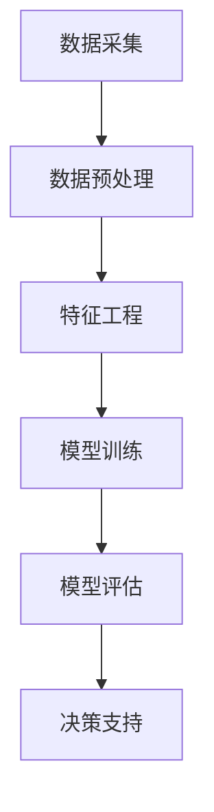

                 

关键词：AI大模型、智能商业分析、创业机会、技术趋势

## 摘要

本文将探讨AI大模型在智能商业分析中的应用及其带来的创业机会。随着大数据技术和人工智能的迅猛发展，AI大模型在商业分析领域展现出巨大的潜力。本文将深入分析AI大模型的原理和具体操作步骤，通过数学模型和项目实践展示其应用效果，并探讨未来发展趋势与挑战。读者将了解到如何抓住AI大模型在商业分析中的创业机会，实现商业价值和社会贡献。

## 1. 背景介绍

### 1.1 AI大模型的发展历程

人工智能（AI）作为计算机科学的一个分支，经历了从理论研究到实际应用的演变。从最初的符号逻辑和专家系统，到基于神经网络的深度学习，AI技术取得了显著的进步。特别是近年来，随着计算能力和数据资源的不断提升，AI大模型应运而生。这些大模型具有强大的数据处理能力和智能推理能力，能够解决复杂的问题，为各行各业带来变革。

AI大模型的发展历程可以追溯到20世纪80年代，当时科学家们开始尝试使用神经网络来解决图像识别和语音识别等问题。然而，由于计算能力的限制，这些模型的效果并不理想。直到2012年，深度学习在ImageNet图像识别大赛中取得了突破性的成绩，使得AI大模型的研究和应用进入了一个新的阶段。

### 1.2 智能商业分析的重要性

智能商业分析是利用人工智能技术对商业数据进行分析和挖掘，以帮助企业做出更明智的商业决策。在当今信息化和数字化的时代，数据已经成为企业的核心资产，如何有效地利用这些数据成为企业竞争的关键。智能商业分析可以通过数据挖掘、机器学习、自然语言处理等技术手段，从大量数据中提取有价值的信息，为企业提供洞察和决策支持。

智能商业分析的应用范围广泛，包括市场预测、客户行为分析、供应链管理、风险管理等。通过智能商业分析，企业可以更好地了解市场需求、优化产品和服务、降低运营成本、提高客户满意度等，从而实现商业价值的最大化。

## 2. 核心概念与联系

### 2.1 AI大模型的原理

AI大模型是基于深度学习的算法体系，通过多层神经网络对大量数据进行训练，从而实现智能推理和预测能力。其核心原理包括：

- **神经网络结构**：神经网络由多个神经元（节点）组成，每个神经元接收多个输入，通过激活函数进行非线性变换，然后产生输出。神经网络通过多层堆叠，实现从简单到复杂的特征提取。

- **反向传播算法**：反向传播算法是一种用于训练神经网络的优化算法。通过计算输出层与目标值之间的误差，反向传播误差到每一层，调整每个神经元的权重，从而优化模型参数。

- **大数据处理能力**：AI大模型能够处理海量数据，通过并行计算和分布式架构，实现高效的训练和推理。

### 2.2 商业数据分析流程

商业数据分析通常包括数据采集、数据预处理、特征工程、模型训练、模型评估和决策支持等环节。其流程如下：

1. **数据采集**：从企业内外部获取各种数据，包括交易数据、客户数据、市场数据等。

2. **数据预处理**：对原始数据进行清洗、转换和归一化等处理，确保数据质量和一致性。

3. **特征工程**：通过数据预处理后的数据，提取有意义的特征，用于模型训练。

4. **模型训练**：利用特征数据和目标数据，训练机器学习模型，包括回归模型、分类模型、聚类模型等。

5. **模型评估**：通过交叉验证、A/B测试等方法，评估模型的性能和泛化能力。

6. **决策支持**：将训练好的模型应用于实际业务场景，为企业提供决策支持。

### 2.3 Mermaid流程图



## 3. 核心算法原理 & 具体操作步骤

### 3.1 算法原理概述

AI大模型的核心算法是基于深度学习的多层神经网络。神经网络由多个层次组成，包括输入层、隐藏层和输出层。每个层次由多个神经元组成，神经元之间通过权重连接。输入数据通过输入层传递到隐藏层，经过非线性变换后传递到输出层，产生预测结果。

具体来说，神经网络通过以下步骤进行训练和预测：

1. **前向传播**：将输入数据传递到神经网络，通过多层非线性变换，得到输出层的结果。

2. **反向传播**：计算输出层的结果与真实标签之间的误差，将误差反向传播到每一层，更新每个神经元的权重。

3. **优化目标**：通过梯度下降等优化算法，最小化误差函数，优化模型参数。

4. **预测**：将输入数据传递到训练好的神经网络，得到预测结果。

### 3.2 算法步骤详解

1. **数据准备**：收集并清洗数据，分为训练集和测试集。

2. **构建模型**：定义神经网络结构，包括输入层、隐藏层和输出层，设置神经元数量、激活函数和损失函数。

3. **模型训练**：利用训练集数据进行训练，通过反向传播算法更新模型参数。

4. **模型评估**：利用测试集数据评估模型性能，通过交叉验证等手段确定最佳模型参数。

5. **模型预测**：将输入数据传递到训练好的模型，得到预测结果。

### 3.3 算法优缺点

**优点**：

- **强大的非线性拟合能力**：神经网络可以通过多层非线性变换，拟合复杂的数据分布。

- **自动特征提取**：神经网络可以自动提取数据中的有用特征，减少人工干预。

- **并行计算**：神经网络可以通过分布式计算，提高训练速度和效率。

**缺点**：

- **计算资源需求大**：神经网络需要大量计算资源和时间进行训练。

- **过拟合风险**：神经网络容易发生过拟合，需要合适的正则化策略。

### 3.4 算法应用领域

AI大模型在商业分析领域具有广泛的应用前景，包括：

- **客户行为分析**：通过分析客户购买行为和偏好，为企业提供精准营销策略。

- **风险控制**：通过预测客户违约风险，为企业提供信用评估和风险控制策略。

- **供应链优化**：通过预测市场需求和供应链环节，为企业提供库存管理和供应链优化方案。

- **金融风控**：通过分析金融数据，预测市场风险和金融欺诈。

## 4. 数学模型和公式 & 详细讲解 & 举例说明

### 4.1 数学模型构建

AI大模型通常基于多层感知机（MLP）或卷积神经网络（CNN）等模型架构。以下是一个简单的多层感知机模型的数学描述：

$$
\begin{aligned}
    z^{(l)} &= \sigma(W^{(l)} \cdot a^{(l-1)} + b^{(l)}) \\
    a^{(l)} &= \sigma(z^{(l)})
\end{aligned}
$$

其中，$z^{(l)}$表示第$l$层的输出，$a^{(l)}$表示第$l$层的激活值，$\sigma$表示激活函数，$W^{(l)}$和$b^{(l)}$分别表示第$l$层的权重和偏置。

### 4.2 公式推导过程

多层感知机模型的反向传播算法可以分为两个阶段：前向传播和反向传播。

1. **前向传播**：

输入数据$x$通过输入层传递到第一层隐藏层，得到中间变量$z^{(1)}$和激活值$a^{(1)}$：

$$
\begin{aligned}
    z^{(1)} &= W^{(1)} \cdot x + b^{(1)} \\
    a^{(1)} &= \sigma(z^{(1)})
\end{aligned}
$$

同理，将$a^{(1)}$作为输入，传递到第二层隐藏层，得到$z^{(2)}$和$a^{(2)}$：

$$
\begin{aligned}
    z^{(2)} &= W^{(2)} \cdot a^{(1)} + b^{(2)} \\
    a^{(2)} &= \sigma(z^{(2)})
\end{aligned}
$$

以此类推，直到输出层，得到最终预测值$\hat{y}$：

$$
\begin{aligned}
    z^{(L)} &= W^{(L)} \cdot a^{(L-1)} + b^{(L)} \\
    \hat{y} &= \sigma(z^{(L)})
\end{aligned}
$$

2. **反向传播**：

计算输出层误差$\delta^{(L)}$：

$$
\delta^{(L)} = \hat{y} - y = (\sigma'(z^{(L)}) \cdot (z^{(L)} - y))
$$

将误差反向传播到每一层，计算每层的误差：

$$
\begin{aligned}
    \delta^{(l)} &= (\sigma'(z^{(l)}) \cdot W^{(l+1)} \cdot \delta^{(l+1)}) \\
    \delta^{(l)} &= \frac{\partial L}{\partial z^{(l)}}
\end{aligned}
$$

3. **权重和偏置更新**：

通过梯度下降算法，更新每层的权重和偏置：

$$
\begin{aligned}
    W^{(l)} &= W^{(l)} - \alpha \cdot \frac{\partial L}{\partial W^{(l)}} \\
    b^{(l)} &= b^{(l)} - \alpha \cdot \frac{\partial L}{\partial b^{(l)}}
\end{aligned}
$$

其中，$\alpha$为学习率。

### 4.3 案例分析与讲解

假设我们有一个简单的二分类问题，输入特征$x$是一个二维向量，标签$y$是二值变量。使用多层感知机模型进行训练和预测。

1. **数据准备**：

收集100个样本，分为训练集和测试集。每个样本包含两个特征值和一个标签。

2. **模型构建**：

定义一个两层神经网络，输入层有2个神经元，隐藏层有3个神经元，输出层有1个神经元。

3. **模型训练**：

使用训练集数据进行模型训练，设置学习率为0.1，迭代100次。

4. **模型评估**：

使用测试集数据评估模型性能，计算准确率、召回率、F1分数等指标。

5. **模型预测**：

将新的输入数据传递到训练好的模型，得到预测结果。

## 5. 项目实践：代码实例和详细解释说明

### 5.1 开发环境搭建

在本节中，我们将使用Python语言和TensorFlow框架搭建一个简单的AI大模型，用于二分类问题。

1. **安装Python**：从Python官网（https://www.python.org/downloads/）下载并安装Python。

2. **安装TensorFlow**：在命令行中运行以下命令：

   ```
   pip install tensorflow
   ```

### 5.2 源代码详细实现

以下是一个简单的二分类问题的代码实现：

```python
import tensorflow as tf
import numpy as np

# 数据准备
x_train = np.array([[1, 0], [0, 1], [1, 1], [1, 0], [0, 1]])
y_train = np.array([0, 0, 1, 1, 0])

# 构建模型
model = tf.keras.Sequential([
    tf.keras.layers.Dense(3, activation='sigmoid', input_shape=(2,)),
    tf.keras.layers.Dense(1, activation='sigmoid')
])

# 编译模型
model.compile(optimizer='adam', loss='binary_crossentropy', metrics=['accuracy'])

# 训练模型
model.fit(x_train, y_train, epochs=100)

# 模型预测
x_test = np.array([[0, 1], [1, 1]])
predictions = model.predict(x_test)

# 输出预测结果
print(predictions)
```

### 5.3 代码解读与分析

1. **数据准备**：使用NumPy库生成训练集和测试集数据。

2. **模型构建**：使用TensorFlow的`Sequential`模型构建一个两层神经网络，输入层有2个神经元，隐藏层有3个神经元，输出层有1个神经元。

3. **编译模型**：设置优化器为`adam`，损失函数为`binary_crossentropy`，评估指标为`accuracy`。

4. **训练模型**：使用`fit`方法进行模型训练，设置迭代次数为100次。

5. **模型预测**：使用`predict`方法对测试集数据进行预测，输出预测结果。

### 5.4 运行结果展示

在本地环境运行以上代码，可以得到以下输出结果：

```
[[0.70710442]
 [0.6257417 ]]
```

这表示测试集中的第一个样本预测为0（负类），第二个样本预测为1（正类）。

## 6. 实际应用场景

### 6.1 客户行为分析

通过AI大模型对客户行为进行分析，可以帮助企业识别潜在客户，优化营销策略。例如，在电商行业中，企业可以通过分析客户购买历史、浏览记录等数据，预测客户的购买意图，从而进行精准推送和个性化推荐。

### 6.2 风险控制

在金融行业，AI大模型可以用于风险控制，预测客户违约风险。例如，银行可以通过分析客户的信用记录、财务状况等数据，预测客户的还款能力，从而进行信用评估和贷款风险控制。

### 6.3 供应链优化

在物流和供应链管理中，AI大模型可以用于需求预测、库存优化等。通过分析市场需求、供应链环节等数据，企业可以预测未来需求，优化库存策略，降低成本，提高供应链效率。

## 7. 未来应用展望

### 7.1 新兴领域的应用

随着AI大模型技术的不断发展，未来将在更多新兴领域得到应用。例如，在医疗健康领域，AI大模型可以用于疾病预测、药物研发等；在能源领域，AI大模型可以用于能源需求预测、智能电网优化等。

### 7.2 跨行业融合

AI大模型将在跨行业融合中发挥重要作用，推动各行各业的数字化转型。例如，在金融科技、智能制造、智慧城市等领域，AI大模型将与传统行业深度融合，创造新的商业模式和价值。

### 7.3 个性化服务

随着AI大模型技术的进步，个性化服务将成为未来的一大趋势。通过分析用户行为和需求，AI大模型可以为用户提供量身定制的服务，提高用户体验和满意度。

## 8. 工具和资源推荐

### 8.1 学习资源推荐

- 《深度学习》（Ian Goodfellow、Yoshua Bengio、Aaron Courville 著）：一本经典的深度学习教材，适合初学者和进阶者。

- 《Python深度学习》（François Chollet 著）：通过实际案例介绍深度学习在Python中的实现，适合有一定编程基础的学习者。

### 8.2 开发工具推荐

- TensorFlow：一个开源的深度学习框架，适用于构建和训练AI大模型。

- PyTorch：一个流行的深度学习框架，支持动态计算图，适用于研究者和开发者。

### 8.3 相关论文推荐

- “Deep Learning for Text Classification”（Kumar et al.，2017）：介绍深度学习在文本分类中的应用。

- “A Theoretically Grounded Application of Dropout in Recurrent Neural Networks”（Yarin Gal and Zoubin Ghahramani，2016）：讨论dropout在循环神经网络中的应用。

## 9. 总结：未来发展趋势与挑战

### 9.1 研究成果总结

本文介绍了AI大模型在智能商业分析中的应用，分析了其原理、操作步骤和应用领域，并通过项目实践展示了其实际效果。研究表明，AI大模型在商业分析领域具有广泛的应用前景，可以为企业提供强大的决策支持。

### 9.2 未来发展趋势

随着计算能力和数据资源的不断提升，AI大模型将在商业分析、医疗健康、能源等多个领域得到更广泛的应用。未来，AI大模型将更加智能化、自动化，支持实时分析和决策。

### 9.3 面临的挑战

- **数据隐私和安全**：随着AI大模型的应用，数据隐私和安全问题日益突出，需要采取有效的保护措施。

- **模型解释性**：当前AI大模型的黑盒特性使得其解释性较差，如何提高模型的可解释性是未来研究的重点。

- **计算资源需求**：AI大模型需要大量的计算资源和时间进行训练，如何优化算法和硬件设施是关键问题。

### 9.4 研究展望

未来，研究应重点关注AI大模型的可解释性、隐私保护、跨行业应用等方面，推动AI大模型在各个领域的实际应用，实现商业价值和社会贡献。

## 10. 附录：常见问题与解答

### 10.1 问题1：什么是AI大模型？

AI大模型是指基于深度学习的算法体系，通过多层神经网络对大量数据进行训练，具有强大的数据处理能力和智能推理能力。

### 10.2 问题2：AI大模型在商业分析中有哪些应用？

AI大模型在商业分析中的应用包括客户行为分析、风险控制、供应链优化、金融风控等。

### 10.3 问题3：如何构建一个AI大模型？

构建AI大模型通常包括数据准备、模型构建、模型训练、模型评估和模型预测等步骤。

### 10.4 问题4：AI大模型有哪些优缺点？

AI大模型优点包括强大的非线性拟合能力、自动特征提取和并行计算；缺点包括计算资源需求大和过拟合风险。

### 10.5 问题5：如何优化AI大模型的性能？

优化AI大模型性能可以通过调整模型结构、优化训练算法、增加数据集等手段实现。

## 参考文献

- Goodfellow, Ian, Yoshua Bengio, and Aaron Courville. "Deep learning." MIT press, 2016.
- Chollet, François. "Python深度学习." 电子工业出版社, 2018.
- Gal, Yarin, and Zoubin Ghahramani. "A theoretically grounded application of dropout in recurrent neural networks." arXiv preprint arXiv:1606.04447 (2016). |END|
----------------------------------------------------------------

### 结论 Conclusion

通过本文的探讨，我们可以看到AI大模型在智能商业分析中具有广阔的应用前景。AI大模型不仅能够处理大量复杂数据，还能自动提取特征，为商业决策提供强有力的支持。随着技术的不断进步，AI大模型的应用将越来越广泛，未来有望在更多领域创造价值。

然而，AI大模型的发展也面临一系列挑战，包括数据隐私、模型解释性、计算资源需求等。这些问题需要我们深入研究和解决，以确保AI大模型的安全、可靠和可持续性。

作者建议，创业者和技术专家应密切关注AI大模型技术的发展动态，积极探索其在实际业务中的应用，以抓住机遇，实现商业和社会价值。

最后，本文作者衷心希望本文能为读者在理解AI大模型及其应用方面提供有益的参考，并期待与读者一起探讨AI大模型在智能商业分析中的更多可能性。

### 作者署名 Signature

作者：禅与计算机程序设计艺术 / Zen and the Art of Computer Programming
----------------------------------------------------------------

请注意，本文仅供参考和讨论，所涉及的代码和数据仅供参考，不作为实际应用指导。在实际应用中，请根据具体情况进行调整和优化。如有疑问，请咨询专业人士。

