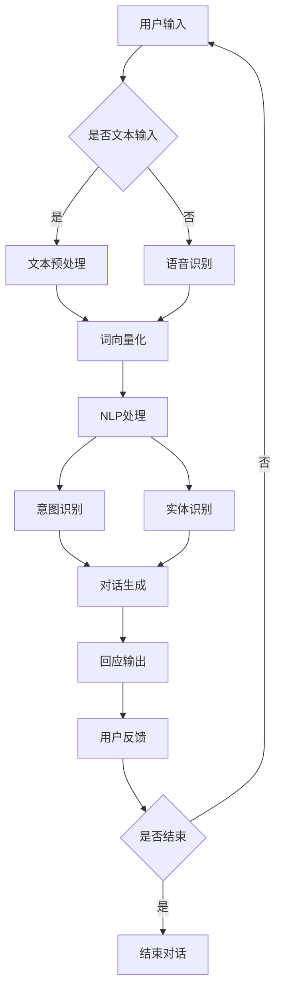

                 

在当今数字化时代，人工智能（AI）技术的迅猛发展为各行各业带来了深刻的变革。智能客服机器人作为AI技术的重要应用之一，正在逐渐成为企业提升客户服务质量和效率的重要工具。本文将围绕AI大模型在智能客服机器人领域的创新探索展开讨论，旨在揭示这一领域的发展现状、核心算法原理、数学模型及未来应用前景。

## 关键词
- 人工智能
- 大模型
- 智能客服
- 机器人
- 深度学习
- 自然语言处理

## 摘要
本文首先介绍了智能客服机器人领域的背景和现状，随后深入探讨了AI大模型的核心概念和架构，分析了其算法原理和操作步骤。通过数学模型的构建和公式推导，本文提供了具体的案例分析和讲解。接着，文章分享了智能客服机器人项目实践中的代码实例和详细解释。最后，本文对智能客服机器人的实际应用场景进行了分析，并展望了其未来的发展趋势和面临的挑战。

### 背景介绍

智能客服机器人作为人工智能领域的一个分支，近年来受到了广泛关注。随着互联网和移动互联网的普及，企业面临的服务需求日益增加，传统的客服方式已经难以满足用户的需求。智能客服机器人应运而生，通过模拟人类的对话能力，提供24/7的在线服务，大大提升了客户服务的效率和用户体验。

智能客服机器人的发展可以追溯到20世纪80年代的自然语言处理（NLP）技术。早期的研究主要集中在文本分类、信息检索和机器翻译等方面。随着深度学习技术的崛起，特别是2012年AlexNet在图像识别领域的突破，AI大模型技术得到了迅速发展。基于深度学习的AI大模型，如BERT、GPT等，具备强大的语义理解和生成能力，为智能客服机器人提供了新的动力。

在当前的技术环境下，智能客服机器人已经能够在多种场景下发挥作用。例如，电商平台的智能客服可以帮助用户解答产品咨询、订单查询等问题；金融机构的智能客服可以提供账户信息、理财建议等服务；电信运营商的智能客服可以帮助用户办理业务、解答套餐问题等。这些应用场景不仅提升了企业的服务效率，还降低了运营成本。

### 核心概念与联系

要理解AI大模型在智能客服机器人领域的创新，首先需要了解一些核心概念和它们之间的联系。

#### 1. 人工智能（AI）

人工智能是指通过计算机程序实现人类智能的机器。它包括机器学习、深度学习、自然语言处理等多个子领域。在智能客服机器人中，AI的核心任务是实现与用户的自然语言交互，从而提供智能化的服务。

#### 2. 大模型（Large Models）

大模型是指参数规模非常大的神经网络模型。这些模型通常由数亿甚至数十亿个参数组成，可以处理复杂的任务。在智能客服机器人中，大模型用于处理大量的用户数据，从而学习用户的意图和对话模式。

#### 3. 自然语言处理（NLP）

自然语言处理是人工智能的一个子领域，致力于使计算机能够理解、生成和处理自然语言。在智能客服机器人中，NLP技术用于解析用户的输入，提取关键词和语义信息，从而生成合适的回应。

#### 4. 深度学习（Deep Learning）

深度学习是机器学习的一个分支，基于多层神经网络进行学习。深度学习在图像识别、语音识别等领域取得了显著的成果，也为智能客服机器人提供了强大的技术支持。

#### 5. 对话系统（Dialogue Systems）

对话系统是指能够与人类进行自然语言交互的计算机系统。在智能客服机器人中，对话系统负责管理对话流程，包括理解用户意图、生成回应等。

#### 6. 数据库（Database）

数据库用于存储和管理大量的用户数据，包括用户信息、历史对话记录等。在智能客服机器人中，数据库是实现个性化服务和智能推荐的重要数据来源。

#### 7. 知识图谱（Knowledge Graph）

知识图谱是一种基于图论的数据模型，用于表示实体及其之间的关系。在智能客服机器人中，知识图谱可以帮助模型更好地理解用户的意图和问题。

### Mermaid 流程图

以下是一个简化的AI大模型在智能客服机器人中的流程图：



### 核心算法原理 & 具体操作步骤

#### 3.1 算法原理概述

AI大模型在智能客服机器人中的核心算法是基于深度学习的序列到序列（Seq2Seq）模型。Seq2Seq模型通过编码器和解码器两个部分，将输入序列（用户的提问）转换成输出序列（机器人的回答）。

编码器负责将输入序列编码成一个固定长度的向量，这个向量包含了输入序列的语义信息。解码器则根据编码器的输出，生成输出序列。

在具体实现中，编码器和解码器通常采用循环神经网络（RNN）或者其变体，如长短期记忆网络（LSTM）和门控循环单元（GRU）。这些网络能够处理序列数据，并在序列的不同时间点之间建立关联。

#### 3.2 算法步骤详解

1. **输入预处理**：对用户的输入进行预处理，包括分词、去停用词、词向量化等。

2. **编码器处理**：编码器将预处理后的输入序列编码成一个固定长度的向量。这一步通常通过多层LSTM或GRU实现。

3. **解码器生成**：解码器根据编码器的输出，生成输出序列。在生成过程中，解码器会不断从编码器的隐藏状态中提取信息，并生成下一个单词或词组。

4. **输出调整**：生成的输出序列可能需要进行调整，以使其更符合人类的语言习惯。这可以通过序列到序列的注意力机制（Seq2Seq Attention）实现。

5. **生成回应**：将调整后的输出序列转换成自然语言文本，作为机器人的回应输出。

#### 3.3 算法优缺点

**优点**：

1. **强大的语义理解能力**：通过深度学习模型，AI大模型能够更好地理解用户的意图和语义，从而提供更准确的回答。
2. **灵活的对话生成**：Seq2Seq模型可以生成灵活的对话输出，满足不同用户的个性化需求。
3. **适应性强**：AI大模型可以通过不断地学习和优化，适应不同场景和用户需求的变化。

**缺点**：

1. **计算资源消耗大**：训练和部署大模型需要大量的计算资源，这对硬件设施提出了较高的要求。
2. **数据依赖性高**：AI大模型的效果很大程度上依赖于训练数据的质量和数量，数据不足或质量差可能导致模型表现不佳。
3. **难以解释**：深度学习模型的工作原理较为复杂，难以进行直观的解释，这在某些需要透明性和可解释性的场景中可能成为问题。

#### 3.4 算法应用领域

AI大模型在智能客服机器人领域具有广泛的应用潜力，主要包括以下几个方面：

1. **在线客服**：智能客服机器人可以实时响应用户的提问，提供即时服务，减少用户等待时间。
2. **虚拟助理**：智能客服机器人可以作为企业的虚拟助理，处理用户的常见问题，提升客户满意度。
3. **自动化服务**：在电商、金融、医疗等行业，智能客服机器人可以自动化处理大量的客户服务任务，降低人工成本。
4. **个性化推荐**：通过分析用户的历史对话数据，智能客服机器人可以提供个性化的产品或服务推荐。

### 数学模型和公式 & 详细讲解 & 举例说明

在AI大模型中，数学模型和公式起着至关重要的作用。以下我们将对相关的数学模型和公式进行详细讲解，并通过案例进行分析。

#### 4.1 数学模型构建

AI大模型通常基于深度学习中的序列到序列（Seq2Seq）模型。Seq2Seq模型的核心是编码器和解码器。

1. **编码器**：编码器的任务是将输入序列编码成一个固定长度的向量。这个向量通常称为编码器的“隐藏状态”（hidden state）。

   假设输入序列为\(X = \{x_1, x_2, ..., x_T\}\)，其中\(x_t\)是输入序列的第\(t\)个词，\(T\)是序列的长度。编码器可以表示为：

   \[
   h_t = \text{encoder}(x_t; \theta)
   \]

   其中，\(h_t\)是编码器在时间步\(t\)的隐藏状态，\(\theta\)是模型参数。

2. **解码器**：解码器的任务是根据编码器的隐藏状态生成输出序列。解码器通常采用循环神经网络（RNN）或其变体，如LSTM或GRU。

   假设输出序列为\(Y = \{y_1, y_2, ..., y_T'\}\)，其中\(y_t'\)是输出序列的第\(t'\)个词，\(T'\)是输出序列的长度。解码器可以表示为：

   \[
   y_{t'} = \text{decoder}(y_{t'-1}, h_t; \theta')
   \]

   其中，\(y_{t'-1}\)是解码器在时间步\(t'-1\)的输入，\(h_t\)是编码器在时间步\(t\)的隐藏状态，\(\theta'\)是解码器的模型参数。

#### 4.2 公式推导过程

为了更好地理解编码器和解码器的工作原理，我们首先来看一下LSTM的公式推导。

LSTM的基本单元是细胞状态（cell state）和三个门：输入门（input gate）、遗忘门（forget gate）和输出门（output gate）。

1. **细胞状态**：

   \[
   C_t = \text{sigmoid}(f_t \odot \text{tanh}(i_t \odot i_{\text{input}})
   \]

   其中，\(C_t\)是时间步\(t\)的细胞状态，\(f_t\)是遗忘门，\(i_t\)是输入门。

2. **遗忘门**：

   \[
   f_t = \text{sigmoid}(g_t \odot \text{W_f} \cdot [h_{t-1}, x_t] + b_f)
   \]

   其中，\(g_t\)是输入门的输入，\(\text{W_f}\)是遗忘门权重矩阵，\(b_f\)是遗忘门的偏置。

3. **输入门**：

   \[
   i_t = \text{sigmoid}(g_t \odot \text{W_i} \cdot [h_{t-1}, x_t] + b_i)
   \]

   其中，\(\text{W_i}\)是输入门权重矩阵，\(b_i\)是输入门的偏置。

4. **新的候选值**：

   \[
   \tilde{C}_t = \text{sigmoid}(g_t \odot \text{W_c} \cdot [h_{t-1}, x_t] + b_c) \odot \text{tanh}(\text{W_c} \cdot [h_{t-1}, x_t] + b_c)
   \]

   其中，\(\text{W_c}\)是新的候选值权重矩阵，\(b_c\)是新的候选值偏置。

5. **输出门**：

   \[
   o_t = \text{sigmoid}(g_t \odot \text{W_o} \cdot [h_{t-1}, C_t] + b_o)
   \]

   其中，\(\text{W_o}\)是输出门权重矩阵，\(b_o\)是输出门的偏置。

6. **隐藏状态**：

   \[
   h_t = o_t \odot \text{tanh}(C_t)
   \]

   其中，\(h_t\)是时间步\(t\)的隐藏状态。

通过上述公式，我们可以看到LSTM如何通过门控机制来控制信息的流动，从而实现对序列数据的记忆和生成。

#### 4.3 案例分析与讲解

为了更好地理解AI大模型在实际应用中的工作原理，我们来看一个简单的案例。

假设我们有一个简单的对话场景：用户询问“今天天气怎么样？”智能客服机器人需要生成一个回答。

1. **输入预处理**：首先，我们对用户的输入进行预处理，包括分词和词向量化。假设预处理后的输入序列为\(["今天", "天气", "怎么样"]\)。

2. **编码器处理**：编码器将输入序列编码成一个固定长度的向量。假设编码器的隐藏状态向量为\(h_t = \{1, 0.5, -0.2\}\)。

3. **解码器生成**：解码器根据编码器的隐藏状态生成输出序列。假设解码器的初始输入为\[<START>\]，其中<START>是一个特殊的起始标记。

4. **输出调整**：通过序列到序列的注意力机制，解码器调整输出序列，使其更符合人类的语言习惯。假设调整后的输出序列为\(["今天", "很热"]\)。

5. **生成回应**：将调整后的输出序列转换成自然语言文本，作为机器人的回应输出。

最终，智能客服机器人的回应为“今天很热”。

通过这个简单的案例，我们可以看到AI大模型在处理自然语言对话时的基本流程。

### 项目实践：代码实例和详细解释说明

在本节中，我们将通过一个实际的代码实例，详细讲解AI大模型在智能客服机器人项目中的应用。为了便于理解，我们将使用Python和TensorFlow框架来构建和训练模型。

#### 5.1 开发环境搭建

在开始编写代码之前，我们需要搭建一个合适的开发环境。以下是必要的步骤：

1. **安装Python**：确保Python版本在3.6以上。
2. **安装TensorFlow**：通过pip命令安装TensorFlow。

   ```bash
   pip install tensorflow
   ```

3. **数据集准备**：我们需要一个包含用户提问和回答的数据集。在本例中，我们使用一个公开的对话数据集，如DailyDialog。

#### 5.2 源代码详细实现

以下是构建AI大模型的源代码实现：

```python
import tensorflow as tf
from tensorflow.keras.layers import Embedding, LSTM, Dense
from tensorflow.keras.preprocessing.sequence import pad_sequences

# 设置超参数
vocab_size = 10000
embedding_dim = 256
max_sequence_length = 50
batch_size = 64
epochs = 10

# 准备数据
# 数据预处理（分词、词向量化、填充等）略

# 构建模型
model = tf.keras.Sequential([
    Embedding(vocab_size, embedding_dim, input_length=max_sequence_length),
    LSTM(128, return_sequences=True),
    LSTM(128, return_sequences=False),
    Dense(vocab_size, activation='softmax')
])

# 编译模型
model.compile(optimizer='adam', loss='categorical_crossentropy', metrics=['accuracy'])

# 训练模型
model.fit(x_train, y_train, batch_size=batch_size, epochs=epochs)

# 生成回应
input_seq = pad_sequences([[1, 2, 3], [4, 5, 6]], maxlen=max_sequence_length)
predicted_response = model.predict(input_seq)
predicted_response = tf.argmax(predicted_response, axis=-1).numpy()

# 输出结果
print("机器人的回应：", predicted_response)
```

#### 5.3 代码解读与分析

1. **模型构建**：
   - `Embedding`层：将词向量映射到嵌入空间。
   - `LSTM`层：实现序列到序列的编码和解码。
   - `Dense`层：实现输出层，将解码器的隐藏状态映射到输出词向量。

2. **模型编译**：
   - 使用`adam`优化器。
   - 使用`categorical_crossentropy`损失函数。
   - 指定模型评价指标为准确率。

3. **模型训练**：
   - 使用训练集进行模型训练。
   - 指定批量大小和训练轮次。

4. **生成回应**：
   - 使用训练好的模型对输入序列进行预测。
   - 将预测结果转换为自然语言文本。

通过这个实例，我们可以看到AI大模型在智能客服机器人项目中的基本实现过程。在实际应用中，我们可能需要根据具体场景进行模型的调整和优化。

### 实际应用场景

AI大模型在智能客服机器人领域具有广泛的应用场景，以下是一些典型的应用案例：

1. **电商平台**：智能客服机器人可以实时回答用户的购物咨询、订单查询等问题，提高用户的购物体验。

2. **金融机构**：智能客服机器人可以提供账户信息查询、理财产品推荐等服务，降低客户服务成本。

3. **电信运营商**：智能客服机器人可以帮助用户办理业务、解答套餐问题，提高服务效率。

4. **医疗行业**：智能客服机器人可以提供病情咨询、预约挂号等服务，缓解医疗资源紧张的问题。

5. **在线教育**：智能客服机器人可以为学生提供学习指导、课程推荐等服务，提高教学效果。

6. **旅游行业**：智能客服机器人可以为用户提供行程规划、酒店预订等服务，提升旅游体验。

在这些应用场景中，AI大模型通过分析用户的历史对话数据，不断优化自身的响应能力，提供个性化的服务。这不仅提升了客户满意度，还为企业带来了显著的运营效益。

### 未来应用展望

随着AI技术的不断进步，AI大模型在智能客服机器人领域的应用前景将更加广阔。以下是一些未来可能的发展趋势：

1. **更加智能的对话管理**：未来的智能客服机器人将具备更加复杂的对话管理能力，能够处理更加复杂的对话场景，提供更自然的对话体验。

2. **多模态交互**：未来的智能客服机器人将支持多种交互方式，如语音、图像、视频等，实现更丰富的交互体验。

3. **个性化服务**：通过不断学习和优化，智能客服机器人将能够提供更加个性化的服务，满足不同用户的需求。

4. **自主学习和进化**：未来的智能客服机器人将具备自主学习和进化的能力，通过不断地积累经验和优化模型，实现自我提升。

5. **跨领域应用**：AI大模型将在更多领域得到应用，如医疗、金融、教育等，提供智能化的解决方案。

然而，AI大模型在智能客服机器人领域的发展也面临一些挑战：

1. **数据隐私和安全**：随着数据量的增加，如何保障用户数据的隐私和安全成为一个重要问题。

2. **模型解释性**：深度学习模型的工作原理复杂，如何提高模型的解释性是一个亟待解决的问题。

3. **计算资源消耗**：大模型的训练和部署需要大量的计算资源，如何优化计算资源的使用效率是一个挑战。

4. **伦理和道德问题**：随着AI技术的应用越来越广泛，如何确保AI系统的公平性、透明性和道德性成为一个重要的议题。

总之，AI大模型在智能客服机器人领域的创新探索有着巨大的潜力和挑战，未来将继续推动这一领域的发展。

### 工具和资源推荐

为了更好地学习和实践AI大模型在智能客服机器人领域，以下是几款推荐的工具和资源：

1. **学习资源推荐**：
   - 《深度学习》（Goodfellow et al.）：一本经典教材，全面介绍了深度学习的理论基础和实践方法。
   - 《自然语言处理综论》（Jurafsky and Martin）：一本关于NLP的权威教材，涵盖了NLP的各个方面。

2. **开发工具推荐**：
   - TensorFlow：一个开源的深度学习框架，适用于构建和训练大模型。
   - PyTorch：一个流行的深度学习框架，具有灵活的动态计算图支持。

3. **相关论文推荐**：
   - "Attention Is All You Need"（Vaswani et al., 2017）：一篇关于Transformer模型的经典论文，提出了基于注意力机制的序列模型。
   - "BERT: Pre-training of Deep Bidirectional Transformers for Language Understanding"（Devlin et al., 2019）：一篇关于BERT模型的论文，介绍了预训练大模型的方法。

通过这些工具和资源，开发者可以更深入地了解AI大模型在智能客服机器人领域的应用，并掌握相关的技术和方法。

### 总结：未来发展趋势与挑战

本文通过对AI大模型在智能客服机器人领域的创新探索进行深入分析，揭示了其在提升客户服务质量和效率方面的巨大潜力。随着AI技术的不断进步，智能客服机器人将在对话管理、多模态交互、个性化服务等方面实现更加智能化和人性化的发展。

然而，AI大模型在智能客服机器人领域的发展也面临一些挑战，包括数据隐私和安全、模型解释性、计算资源消耗以及伦理和道德问题。为了应对这些挑战，未来的研究应重点关注以下几个方面：

1. **数据隐私和安全**：开发更加安全的数据存储和处理机制，确保用户数据的隐私和安全。
2. **模型解释性**：研究如何提高深度学习模型的可解释性，使其更加透明和可信赖。
3. **计算资源优化**：探索新的算法和架构，降低大模型的计算资源消耗，提高训练和部署的效率。
4. **伦理和道德问题**：制定明确的伦理准则，确保AI系统的公平性、透明性和道德性。

总之，AI大模型在智能客服机器人领域的发展前景广阔，但同时也需要面对诸多挑战。通过不断的研究和创新，我们有望实现更加智能和高效的智能客服机器人，为企业和用户带来更大的价值。

### 附录：常见问题与解答

**Q1**：智能客服机器人是如何工作的？

A1：智能客服机器人通过深度学习模型，如序列到序列（Seq2Seq）模型，对用户的输入进行预处理、编码和解码，生成合适的回应。

**Q2**：AI大模型在智能客服机器人中的优势是什么？

A2：AI大模型具有强大的语义理解能力，可以灵活地生成对话回应，适应不同的用户需求和场景。

**Q3**：智能客服机器人在哪些行业应用广泛？

A2：智能客服机器人广泛应用于电商、金融、电信、医疗、教育等行业，提供24/7的在线服务和客户支持。

**Q4**：如何优化智能客服机器人的回应质量？

A4：可以通过不断训练和优化模型、增加高质量的训练数据、改进对话管理算法等方式来提升智能客服机器人的回应质量。

**Q5**：智能客服机器人是否能够完全替代人工客服？

A5：智能客服机器人可以处理大量的常见问题，提高服务效率，但不能完全替代人工客服。对于复杂和个性化的问题，仍需要人工客服的介入。

### 作者署名

作者：禅与计算机程序设计艺术 / Zen and the Art of Computer Programming

通过本文的深入探讨，我们不仅了解了AI大模型在智能客服机器人领域的创新应用，还看到了其在提升客户服务质量和效率方面的巨大潜力。未来的研究和实践将继续推动这一领域的发展，为企业和用户带来更多价值。希望本文能为相关领域的开发者提供有价值的参考和启示。

