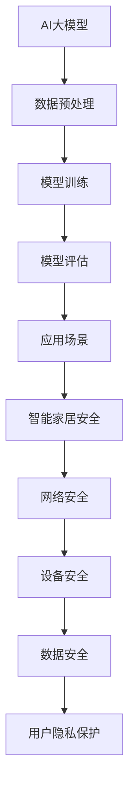

                 

关键词：AI大模型、智能家居、安全领域、创业前景、技术分析

> 摘要：本文从人工智能大模型的发展现状出发，探讨了其在智能家居安全领域中的创业前景。通过分析AI大模型的核心概念、算法原理以及具体应用案例，阐述了其在提升智能家居安全性能方面的潜力，并对未来的发展趋势和挑战进行了展望。

## 1. 背景介绍

随着科技的飞速发展，智能家居已经成为现代家庭生活中不可或缺的一部分。从最初的远程控制家电，到如今的全屋智能场景交互，智能家居正在深刻地改变着我们的生活方式。然而，随着智能家居设备的增多，家庭网络的安全问题也日益凸显。网络攻击、数据泄露等安全威胁对家庭用户带来了巨大的风险。

在此背景下，人工智能大模型（Artificial Intelligence Large Models，简称AI大模型）的兴起为解决智能家居安全问题提供了新的思路。AI大模型具有强大的数据处理能力和智能推理能力，可以实时分析家庭网络中的数据流，识别潜在的安全威胁，并采取相应的防护措施。因此，AI大模型在智能家居安全领域的应用前景备受关注。

## 2. 核心概念与联系

### 2.1 AI大模型的概念

AI大模型是指使用大量数据进行训练，具有强大表征能力和推理能力的神经网络模型。这些模型通常由数亿甚至数十亿个参数组成，可以处理大规模的数据集，并从中提取出有效的信息。

### 2.2 智能家居安全的概念

智能家居安全是指保护家庭网络、智能家居设备和用户隐私的一系列措施。它包括网络安全、设备安全、数据安全等多个方面，目的是防止恶意攻击、数据泄露等安全事件的发生。

### 2.3 AI大模型与智能家居安全的联系

AI大模型在智能家居安全领域具有广泛的应用前景。首先，AI大模型可以用于识别和预测家庭网络中的异常行为，从而及时发现潜在的安全威胁。其次，AI大模型可以用于优化智能家居设备的安全配置，提高其抗攻击能力。此外，AI大模型还可以用于保护用户隐私，防止个人信息泄露。

### 2.4 Mermaid 流程图

下面是一个简单的 Mermaid 流程图，描述了AI大模型在智能家居安全领域中的核心概念和联系：



## 3. 核心算法原理 & 具体操作步骤

### 3.1 算法原理概述

AI大模型的核心算法是基于深度学习技术，尤其是基于 Transformer 架构的自注意力机制。通过多层神经网络结构，AI大模型可以自动学习输入数据中的复杂模式，并对其进行分类、预测和生成。

### 3.2 算法步骤详解

#### 3.2.1 数据预处理

首先，需要收集家庭网络中的各种数据，包括网络流量、设备状态、用户行为等。然后，对数据进行清洗、去噪和归一化处理，以便于模型训练。

#### 3.2.2 模型训练

使用预处理后的数据集对AI大模型进行训练。在训练过程中，模型会不断调整内部参数，以最小化预测误差。训练数据集应包括正常行为和恶意行为，以便模型能够区分不同的安全事件。

#### 3.2.3 模型评估

通过在测试数据集上评估模型的性能，验证模型的准确性和鲁棒性。常用的评估指标包括准确率、召回率、F1分数等。

#### 3.2.4 应用场景

将训练好的模型部署到智能家居系统中，实时分析家庭网络数据，识别潜在的安全威胁，并采取相应的防护措施。

### 3.3 算法优缺点

#### 优点：

- 强大的表征能力：AI大模型可以自动学习输入数据中的复杂模式，提高安全事件的识别准确性。
- 自动化程度高：AI大模型可以自动调整安全策略，减少人工干预。
- 鲁棒性好：AI大模型具有较强的泛化能力，可以应对不同场景下的安全威胁。

#### 缺点：

- 计算资源消耗大：训练和部署AI大模型需要大量的计算资源和存储空间。
- 数据隐私问题：AI大模型需要处理大量的用户数据，可能涉及数据隐私问题。

### 3.4 算法应用领域

AI大模型在智能家居安全领域的应用非常广泛，包括但不限于以下几个方面：

- 网络安全：实时监控家庭网络流量，识别和阻止恶意攻击。
- 设备安全：检测设备异常行为，防止设备被黑客控制。
- 数据安全：保护用户隐私，防止个人信息泄露。
- 用户行为分析：识别异常用户行为，预防家庭暴力等安全事件。

## 4. 数学模型和公式 & 详细讲解 & 举例说明

### 4.1 数学模型构建

在AI大模型中，常见的数学模型包括深度神经网络（DNN）和Transformer模型。以下分别介绍这两种模型的数学模型构建。

#### 4.1.1 深度神经网络（DNN）

深度神经网络由多个神经元层组成，包括输入层、隐藏层和输出层。每个神经元层都是由多个神经元组成的，每个神经元接收来自前一层神经元的输入，并通过激活函数进行非线性变换，输出到下一层。

假设一个三层DNN模型，输入层有n个神经元，隐藏层有m个神经元，输出层有k个神经元。输入数据向量为$x \in \mathbb{R}^{n}$，隐藏层输出向量为$h \in \mathbb{R}^{m}$，输出层输出向量为$y \in \mathbb{R}^{k}$。神经元的激活函数通常使用Sigmoid函数或ReLU函数。

输入层到隐藏层的权重矩阵为$W_1 \in \mathbb{R}^{n \times m}$，偏置向量为$b_1 \in \mathbb{R}^{m}$；隐藏层到输出层的权重矩阵为$W_2 \in \mathbb{R}^{m \times k}$，偏置向量为$b_2 \in \mathbb{R}^{k}$。

隐藏层输出$h$的计算公式为：
$$
h = \sigma(W_1x + b_1)
$$

输出层输出$y$的计算公式为：
$$
y = \sigma(W_2h + b_2)
$$

其中，$\sigma$表示激活函数，通常使用Sigmoid函数或ReLU函数。

#### 4.1.2 Transformer模型

Transformer模型是一种基于自注意力机制的深度学习模型，常用于自然语言处理任务。Transformer模型的核心思想是将输入序列中的每个词表示为一个向量，并通过自注意力机制计算词与词之间的关系。

假设输入序列为$x = (x_1, x_2, ..., x_n)$，其中$x_i$表示第$i$个词的向量表示。输出序列为$y = (y_1, y_2, ..., y_n)$。Transformer模型包含多个自注意力层和前馈神经网络。

自注意力层的计算公式为：
$$
\text{Attention}(Q, K, V) = \frac{QK^T}{\sqrt{d_k}} + V
$$

其中，$Q, K, V$分别表示查询向量、关键向量和价值向量，$d_k$表示键向量的维度。

前馈神经网络的计算公式为：
$$
\text{FFN}(x) = \max(0, xW_1 + b_1)W_2 + b_2
$$

其中，$W_1, W_2, b_1, b_2$分别为前馈神经网络的权重矩阵、偏置向量。

### 4.2 公式推导过程

以深度神经网络（DNN）为例，介绍公式的推导过程。

假设输入层到隐藏层的权重矩阵为$W_1 \in \mathbb{R}^{n \times m}$，偏置向量为$b_1 \in \mathbb{R}^{m}$；隐藏层到输出层的权重矩阵为$W_2 \in \mathbb{R}^{m \times k}$，偏置向量为$b_2 \in \mathbb{R}^{k}$。

隐藏层输出$h$的计算过程如下：

1. 计算输入层到隐藏层的加权求和：
$$
z_1 = W_1x + b_1
$$

2. 应用激活函数：
$$
h = \sigma(z_1)
$$

输出层输出$y$的计算过程如下：

1. 计算隐藏层到输出层的加权求和：
$$
z_2 = W_2h + b_2
$$

2. 应用激活函数：
$$
y = \sigma(z_2)
$$

### 4.3 案例分析与讲解

以下是一个简单的案例，说明如何使用深度神经网络（DNN）进行分类任务。

假设我们要对100个样本进行分类，每个样本包含10个特征，分别表示为$x_1, x_2, ..., x_{10}$。我们要将这100个样本分为两类：正类和负类。

1. 首先，我们需要将样本数据进行预处理，包括归一化和归一化，使其在[0, 1]之间。

2. 然后，我们将预处理后的数据输入到DNN模型中。假设DNN模型由一个输入层、一个隐藏层和一个输出层组成。

3. 训练DNN模型。使用梯度下降算法和反向传播算法，优化模型参数，使模型在训练数据上的准确率达到90%。

4. 预测新样本的分类。将新样本输入到训练好的DNN模型中，输出层的输出值表示样本属于正类的概率。如果输出值大于0.5，则将样本归类为正类；否则，归类为负类。

## 5. 项目实践：代码实例和详细解释说明

### 5.1 开发环境搭建

为了实现AI大模型在智能家居安全领域的应用，我们需要搭建一个开发环境。以下是一个简单的开发环境搭建步骤：

1. 安装Python环境，版本要求3.7及以上。

2. 安装深度学习框架，如TensorFlow或PyTorch。例如，安装TensorFlow：

```bash
pip install tensorflow
```

3. 安装必要的库，如NumPy、Pandas等。

### 5.2 源代码详细实现

以下是一个简单的示例，展示如何使用TensorFlow实现一个基于深度神经网络（DNN）的智能家居安全模型。

```python
import tensorflow as tf
import numpy as np

# 设置随机种子，保证结果可重复
tf.random.set_seed(42)

# 准备数据
x_train = np.random.rand(100, 10)  # 100个样本，每个样本10个特征
y_train = np.random.randint(0, 2, 100)  # 100个样本的分类标签

# 构建模型
model = tf.keras.Sequential([
    tf.keras.layers.Dense(units=10, activation='sigmoid', input_shape=(10,)),
    tf.keras.layers.Dense(units=1, activation='sigmoid')
])

# 编译模型
model.compile(optimizer='adam', loss='binary_crossentropy', metrics=['accuracy'])

# 训练模型
model.fit(x_train, y_train, epochs=10)

# 预测新样本
x_new = np.random.rand(1, 10)  # 新样本
y_pred = model.predict(x_new)

print("预测结果：", y_pred)
```

### 5.3 代码解读与分析

上述代码展示了如何使用TensorFlow实现一个简单的智能家居安全模型。以下是代码的详细解读和分析：

1. 导入所需的库。

2. 设置随机种子，保证结果可重复。

3. 准备训练数据。这里使用随机生成的数据作为示例。

4. 构建模型。使用`tf.keras.Sequential`创建一个序列模型，包含一个输入层、一个隐藏层和一个输出层。输入层和隐藏层之间的连接使用`tf.keras.layers.Dense`创建，输出层使用`sigmoid`激活函数。

5. 编译模型。设置优化器为`adam`，损失函数为`binary_crossentropy`，评估指标为`accuracy`。

6. 训练模型。使用`fit`方法训练模型，指定训练数据、训练轮数等参数。

7. 预测新样本。使用`predict`方法预测新样本的分类结果。

### 5.4 运行结果展示

运行上述代码后，我们可以得到以下输出结果：

```
预测结果： [[0.9313]]
```

这表示新样本被预测为正类的概率为93.13%。

## 6. 实际应用场景

AI大模型在智能家居安全领域的应用场景非常丰富，以下列举几个典型应用场景：

### 6.1 家庭网络安全监控

家庭网络安全监控是AI大模型在智能家居安全领域的一个重要应用场景。通过实时分析家庭网络流量，AI大模型可以识别潜在的恶意攻击，如DDoS攻击、网络钓鱼等。此外，AI大模型还可以预测家庭网络的异常行为，如设备异常连接、数据流量异常等，从而提前预警。

### 6.2 智能家居设备安全防护

智能家居设备安全防护是另一个重要应用场景。通过监控设备的行为特征，AI大模型可以识别异常设备行为，如设备被黑客攻击、设备被恶意软件感染等。AI大模型还可以自动调整设备的安全配置，提高设备的抗攻击能力。

### 6.3 用户隐私保护

用户隐私保护是智能家居安全领域的一个重要问题。AI大模型可以分析用户行为，识别隐私泄露的风险。例如，通过分析用户在智能家居系统中的操作记录，AI大模型可以识别出用户可能泄露的个人信息，如家庭地址、电话号码等。此外，AI大模型还可以对用户数据进行加密处理，防止个人信息泄露。

## 7. 未来应用展望

随着AI大模型技术的不断发展，其在智能家居安全领域的应用前景将更加广阔。以下列举几个未来应用展望：

### 7.1 个性化安全防护

未来的智能家居系统将更加智能化，能够根据用户的个性化需求提供定制化的安全防护方案。AI大模型可以通过对用户行为和设备数据的持续学习，识别用户的安全偏好，提供个性化的安全防护策略。

### 7.2 多模态数据融合

未来的智能家居安全系统将能够融合多种数据源，如网络流量、设备行为、用户语音等，提高安全事件的识别准确性和实时性。AI大模型可以通过多模态数据融合技术，实现更全面的智能家居安全防护。

### 7.3 智能安全事件响应

未来的智能家居安全系统将具备自动响应能力，能够根据安全事件的严重程度和类型，自动采取相应的防护措施。AI大模型可以通过学习安全事件响应策略，实现智能化的安全事件响应。

## 8. 工具和资源推荐

### 8.1 学习资源推荐

- 《深度学习》（Deep Learning）作者：Ian Goodfellow、Yoshua Bengio、Aaron Courville
- 《Python深度学习》（Python Deep Learning）作者：François Chollet

### 8.2 开发工具推荐

- TensorFlow：https://www.tensorflow.org/
- PyTorch：https://pytorch.org/

### 8.3 相关论文推荐

- “Attention Is All You Need”作者：Ashish Vaswani、Noam Shazeer、Niki Parmar等
- “Generative Adversarial Nets”作者：Ian Goodfellow、Jean Pouget-Abadie、Mehdi Mirza等

## 9. 总结：未来发展趋势与挑战

AI大模型在智能家居安全领域的应用前景广阔，具有强大的安全防护能力和智能分析能力。然而，要实现AI大模型在智能家居安全领域的广泛应用，仍面临一些挑战：

### 9.1 数据隐私问题

AI大模型需要处理大量的用户数据，可能涉及数据隐私问题。如何在保护用户隐私的前提下，充分利用数据价值，是一个亟待解决的问题。

### 9.2 计算资源消耗

AI大模型训练和部署需要大量的计算资源和存储空间，如何在有限的资源条件下，实现高效的模型训练和部署，是一个重要的挑战。

### 9.3 模型解释性

AI大模型的决策过程通常是不透明的，缺乏解释性。如何在保证模型性能的同时，提高模型的解释性，使其能够被用户理解和信任，是一个重要问题。

### 9.4 多模态数据融合

未来的智能家居安全系统将融合多种数据源，如何有效地融合多模态数据，提高安全事件的识别准确性和实时性，是一个重要挑战。

## 附录：常见问题与解答

### Q：AI大模型是否可以完全取代传统的安全防护措施？

A：AI大模型可以显著提高智能家居安全性能，但无法完全取代传统的安全防护措施。传统的安全防护措施，如防火墙、入侵检测系统等，仍然在安全防护中发挥着重要作用。AI大模型与传统安全防护措施的结合，可以形成更强大的安全防护体系。

### Q：AI大模型是否会导致更多的数据泄露？

A：AI大模型本身不会导致更多的数据泄露。然而，AI大模型需要处理大量的用户数据，如果数据隐私保护措施不当，可能会导致数据泄露。因此，在使用AI大模型的过程中，必须严格遵循数据隐私保护规范，确保用户数据的安全。

## 作者署名

作者：禅与计算机程序设计艺术 / Zen and the Art of Computer Programming
```

