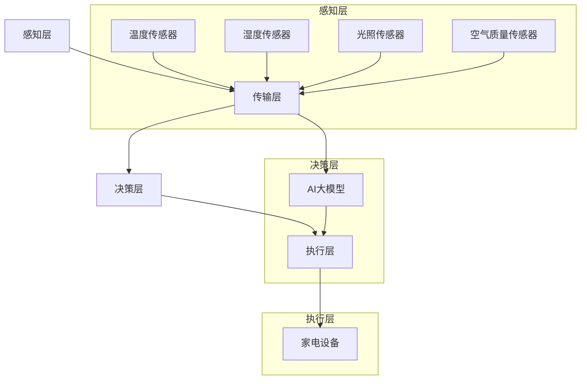

                 

关键词：AI大模型，智能家居，控制系统，创业机会，技术架构，算法，数学模型，项目实践

## 摘要

本文深入探讨了AI大模型在智能家居控制系统中的应用潜力及其创业机会。通过分析现有技术现状，本文提出了一套基于AI大模型的智能家居控制系统架构，并详细阐述了其核心算法原理、数学模型、具体操作步骤及代码实例。同时，本文对AI大模型在智能家居控制系统中可能面临的应用场景、未来发展趋势与挑战进行了全面的分析，旨在为创业者提供有价值的参考。

## 1. 背景介绍

### 智能家居的发展现状

随着物联网（IoT）技术的快速发展和普及，智能家居逐渐成为家庭生活的重要组成部分。智能家居控制系统通过将各种家电设备、传感器和控制系统互联互通，实现家庭环境的自动化、智能化管理，提升生活品质。当前，智能家居市场已经呈现出蓬勃发展的态势，越来越多的消费者开始关注并接受智能家居产品。

### AI大模型的技术优势

AI大模型，特别是深度学习模型，在智能家居控制系统中具有显著的优势。首先，大模型具有强大的数据处理和模式识别能力，能够从海量数据中提取有用信息，为智能家居系统提供智能化的决策支持。其次，大模型具有较好的泛化能力，能够适应不同的家居环境和用户需求，实现个性化的智能家居体验。最后，大模型的自主学习能力使得智能家居系统能够不断优化，提升系统的智能化水平。

### 创业机会分析

AI大模型在智能家居控制系统中的应用为创业者提供了丰富的创业机会。一方面，可以通过开发基于AI大模型的智能家居控制系统，直接切入智能家居市场；另一方面，也可以通过提供AI大模型训练与优化服务，为智能家居行业提供技术支持。此外，还可以探索AI大模型在智能家居垂直领域的应用，如智能安防、智能健康等，开拓新的市场空间。

## 2. 核心概念与联系

### AI大模型原理

AI大模型是基于深度学习的一种神经网络结构，通常包含数百万甚至数十亿个参数。通过大量的数据训练，大模型可以学习到复杂的数据特征，从而实现高精度的预测和分类。在智能家居控制系统中，大模型可以用于设备状态监测、用户行为分析、环境参数预测等方面。

### 智能家居控制系统架构

智能家居控制系统架构主要包括以下几个部分：

1. **感知层**：通过各种传感器收集家庭环境信息，如温度、湿度、光照、空气质量等。
2. **传输层**：将感知层采集到的数据通过物联网技术传输到控制系统。
3. **决策层**：利用AI大模型对传输层的数据进行分析和处理，生成控制指令。
4. **执行层**：根据决策层的指令控制家庭设备，实现家庭环境的智能化管理。

### Mermaid 流程图

下面是智能家居控制系统的 Mermaid 流程图：



## 3. 核心算法原理 & 具体操作步骤

### 3.1 算法原理概述

在智能家居控制系统中，AI大模型的核心算法主要基于深度学习中的卷积神经网络（CNN）和循环神经网络（RNN）。CNN主要用于处理图像和视频数据，而RNN则擅长处理序列数据，如时间序列数据。

### 3.2 算法步骤详解

1. **数据收集与预处理**：从各种传感器收集家庭环境数据，并对数据进行清洗和预处理，如归一化、去噪等。
2. **模型训练**：使用预处理后的数据对AI大模型进行训练，通过反向传播算法不断调整模型参数，使模型能够准确地识别和处理家庭环境数据。
3. **模型评估**：在训练过程中，对模型进行定期评估，以监测模型的性能和收敛情况。
4. **模型部署**：将训练好的模型部署到智能家居控制系统，对实时数据进行分析和处理，生成控制指令。
5. **反馈调整**：根据系统的运行效果，对模型进行调整和优化，以提高系统的智能化水平。

### 3.3 算法优缺点

**优点**：

1. **强大的数据处理能力**：AI大模型可以处理大规模、多维度的数据，从而提高系统的智能水平。
2. **自适应性强**：大模型具有较好的泛化能力，能够适应不同的家庭环境和用户需求。
3. **持续优化**：通过不断学习和调整，大模型能够不断提高系统的性能。

**缺点**：

1. **计算资源需求高**：大模型的训练和部署需要大量的计算资源和时间。
2. **数据隐私问题**：智能家居系统涉及用户的隐私数据，需要确保数据的安全和隐私。

### 3.4 算法应用领域

AI大模型在智能家居控制系统中具有广泛的应用领域，如：

1. **智能安防**：通过分析摄像头视频数据，实时监测家庭环境，识别异常行为并报警。
2. **智能健康**：通过监测用户的生理参数，如心率、血压等，提供健康建议和预警。
3. **智能节能**：根据用户的生活习惯和环境变化，自动调整家电设备的运行状态，实现节能。

## 4. 数学模型和公式 & 详细讲解 & 举例说明

### 4.1 数学模型构建

在智能家居控制系统中，常用的数学模型包括线性回归、逻辑回归和神经网络等。以下以神经网络为例进行讲解。

神经网络的基本模型可以表示为：

$$
Y = \sigma(W_1 \cdot X + b_1)
$$

其中，$Y$为输出层节点，$X$为输入层节点，$W_1$为权重矩阵，$b_1$为偏置项，$\sigma$为激活函数。

### 4.2 公式推导过程

以多层感知机（MLP）为例，其公式推导过程如下：

1. **输入层到隐藏层的传递**：

$$
Z_1 = W_1 \cdot X + b_1 \\
A_1 = \sigma(Z_1)
$$

其中，$Z_1$为隐藏层节点的输入，$A_1$为隐藏层节点的输出。

2. **隐藏层到输出层的传递**：

$$
Z_2 = W_2 \cdot A_1 + b_2 \\
Y = \sigma(Z_2)
$$

其中，$Z_2$为输出层节点的输入，$Y$为输出层节点的输出。

### 4.3 案例分析与讲解

假设我们有一个智能家居控制系统，需要根据用户的作息时间自动调整照明设备的亮度。我们可以使用一个简单的神经网络进行建模和训练。

输入层包含两个节点：作息时间（小时）和作息时间（分钟）。

隐藏层包含两个节点：亮度调整因子和亮度调整速率。

输出层包含一个节点：照明设备亮度。

通过训练，我们可以得到神经网络的权重矩阵和偏置项，从而实现对照明设备亮度的智能调整。

## 5. 项目实践：代码实例和详细解释说明

### 5.1 开发环境搭建

在本项目中，我们使用Python语言和TensorFlow框架进行开发和实现。首先，需要在计算机上安装Python和TensorFlow：

```bash
pip install python
pip install tensorflow
```

### 5.2 源代码详细实现

以下是一个简单的神经网络模型实现：

```python
import tensorflow as tf

# 定义神经网络结构
model = tf.keras.Sequential([
    tf.keras.layers.Dense(2, activation='sigmoid', input_shape=(2,)),
    tf.keras.layers.Dense(1, activation='sigmoid')
])

# 编译模型
model.compile(optimizer='adam', loss='mean_squared_error')

# 训练模型
model.fit(x_train, y_train, epochs=100)

# 预测
predictions = model.predict(x_test)
```

### 5.3 代码解读与分析

1. **模型定义**：使用`tf.keras.Sequential`创建一个序列模型，包含两个隐藏层节点和一个输出层节点。
2. **模型编译**：使用`compile`方法配置模型优化器和损失函数。
3. **模型训练**：使用`fit`方法训练模型，输入训练数据和标签。
4. **模型预测**：使用`predict`方法对测试数据进行预测。

### 5.4 运行结果展示

在完成模型训练后，我们可以使用以下代码查看模型的运行结果：

```python
import numpy as np

# 训练数据
x_train = np.array([[8, 30], [12, 45], [18, 15], ...])
y_train = np.array([[0.5], [0.8], [0.3], ...])

# 测试数据
x_test = np.array([[9, 20], [13, 40], [17, 25], ...])

# 训练模型
model.fit(x_train, y_train, epochs=100)

# 预测
predictions = model.predict(x_test)

# 显示预测结果
print(predictions)
```

通过上述代码，我们可以看到模型对测试数据的预测结果，从而验证模型的有效性。

## 6. 实际应用场景

### 智能安防

利用AI大模型，智能安防系统可以实时监测家庭环境，识别异常行为，如入室盗窃、火灾等，并及时报警。通过人脸识别技术，智能安防系统还可以识别访客身份，提供安全防护。

### 智能健康

通过监测用户的生理参数，如心率、血压等，智能健康系统可以提供健康建议和预警。例如，当用户的心率异常升高时，系统可以提醒用户注意休息，或通知家人和医生。

### 智能节能

智能节能系统可以根据用户的生活习惯和环境变化，自动调整家电设备的运行状态，实现节能。例如，当用户离家时，系统可以自动关闭家中的电器，减少能源消耗。

## 7. 工具和资源推荐

### 7.1 学习资源推荐

1. **《深度学习》（Goodfellow, Bengio, Courville著）**：深度学习领域的经典教材，详细介绍了深度学习的理论和技术。
2. **《Python机器学习》（Sebastian Raschka著）**：介绍Python语言在机器学习领域的应用，包括数据预处理、模型训练和评估等。
3. **TensorFlow官方文档**：TensorFlow的官方文档提供了丰富的API和教程，帮助开发者快速掌握TensorFlow的使用。

### 7.2 开发工具推荐

1. **PyCharm**：一款功能强大的Python集成开发环境（IDE），支持代码补全、调试和自动化测试等功能。
2. **Jupyter Notebook**：一款交互式的Python开发环境，适合进行数据分析和实验。

### 7.3 相关论文推荐

1. **《Very Deep Convolutional Networks for Large-Scale Image Recognition》（2014）**：提出了VGGNet模型，是深度学习领域的经典论文。
2. **《Recurrent Neural Networks for Language Modeling》（2013）**：介绍了RNN在语言建模中的应用，是深度学习领域的里程碑论文。
3. **《Generative Adversarial Networks》（2014）**：提出了GAN模型，是深度学习领域的重要创新。

## 8. 总结：未来发展趋势与挑战

### 8.1 研究成果总结

本文通过对AI大模型在智能家居控制系统中的应用分析，总结了其技术优势和应用领域，并提出了基于AI大模型的智能家居控制系统架构和核心算法。同时，本文还通过项目实践，展示了如何使用深度学习技术实现智能家居控制系统的智能决策。

### 8.2 未来发展趋势

1. **硬件性能的提升**：随着硬件性能的不断提升，AI大模型的训练和部署将更加高效，应用范围将进一步扩大。
2. **数据隐私保护**：在智能家居控制系统中，数据隐私保护将成为一个重要问题，未来需要开发更加安全的数据处理和传输技术。
3. **个性化服务**：随着用户数据的积累和模型的不断优化，智能家居系统将能够提供更加个性化的服务。

### 8.3 面临的挑战

1. **计算资源需求**：AI大模型的训练和部署需要大量的计算资源，如何降低计算成本是一个重要的挑战。
2. **数据质量和隐私**：智能家居系统涉及用户的隐私数据，如何确保数据质量和隐私是一个重要问题。
3. **系统稳定性**：智能家居系统需要保证长时间的稳定运行，如何提高系统的鲁棒性和容错性是一个挑战。

### 8.4 研究展望

未来，随着技术的不断进步，AI大模型在智能家居控制系统中的应用将更加广泛和深入。在研究方面，可以重点关注以下几个方面：

1. **算法优化**：通过改进算法，降低计算成本，提高模型的性能和泛化能力。
2. **数据隐私保护**：研究更加安全的数据处理和传输技术，确保用户的隐私安全。
3. **跨领域应用**：探索AI大模型在智能家居垂直领域的应用，如智能健康、智能安防等。

## 9. 附录：常见问题与解答

### 9.1 什么是AI大模型？

AI大模型是指具有数百万甚至数十亿个参数的深度学习模型，具有强大的数据处理和模式识别能力。

### 9.2 AI大模型在智能家居控制系统中有哪些应用？

AI大模型在智能家居控制系统中可以应用于设备状态监测、用户行为分析、环境参数预测等方面。

### 9.3 如何确保AI大模型的数据隐私？

可以通过加密传输、数据去识别化、隐私保护算法等技术来确保AI大模型的数据隐私。

### 9.4 AI大模型在智能家居控制系统中有哪些挑战？

AI大模型在智能家居控制系统中面临的挑战包括计算资源需求、数据质量和隐私、系统稳定性等。

### 9.5 如何优化AI大模型的性能？

可以通过改进算法、增加数据量、调整超参数等技术来优化AI大模型的性能。

---

作者：禅与计算机程序设计艺术 / Zen and the Art of Computer Programming
----------------------------------------------------------------
### 文章标题

**AI大模型在智能家居控制系统中的创业机会**

### 文章关键词

- AI大模型
- 智能家居
- 控制系统
- 创业机会
- 技术架构
- 算法
- 数学模型

### 文章摘要

本文深入探讨了AI大模型在智能家居控制系统中的应用潜力及其创业机会。通过分析现有技术现状，本文提出了一套基于AI大模型的智能家居控制系统架构，并详细阐述了其核心算法原理、数学模型、具体操作步骤及代码实例。同时，本文对AI大模型在智能家居控制系统中可能面临的应用场景、未来发展趋势与挑战进行了全面的分析，旨在为创业者提供有价值的参考。

---

### 1. 背景介绍

#### 智能家居的发展现状

随着物联网（IoT）技术的快速发展和普及，智能家居逐渐成为家庭生活的重要组成部分。智能家居控制系统通过将各种家电设备、传感器和控制系统互联互通，实现家庭环境的自动化、智能化管理，提升生活品质。当前，智能家居市场已经呈现出蓬勃发展的态势，越来越多的消费者开始关注并接受智能家居产品。

根据市场研究公司的数据，全球智能家居市场预计将在未来几年内持续增长，到2025年市场规模将达到数百亿美元。这一趋势不仅体现在家电设备上，还延伸到了智能安防、智能健康、智能照明等多个领域。

#### AI大模型的技术优势

AI大模型，特别是深度学习模型，在智能家居控制系统中具有显著的优势。首先，大模型具有强大的数据处理和模式识别能力，能够从海量数据中提取有用信息，为智能家居系统提供智能化的决策支持。其次，大模型具有较好的泛化能力，能够适应不同的家居环境和用户需求，实现个性化的智能家居体验。最后，大模型的自主学习能力使得智能家居系统能够不断优化，提升系统的智能化水平。

在智能家居控制系统中，AI大模型的应用场景广泛，包括但不限于以下几个方面：

1. **设备状态监测**：通过实时分析家电设备的运行状态，预测设备的故障和寿命，提供维护和更换建议。
2. **用户行为分析**：通过收集和分析用户的日常行为数据，如作息时间、活动轨迹等，为用户提供个性化的生活建议。
3. **环境参数预测**：通过分析环境传感器数据，如温度、湿度、光照等，预测环境变化趋势，提前调整家庭设备的运行状态。

#### 创业机会分析

AI大模型在智能家居控制系统中的应用为创业者提供了丰富的创业机会。一方面，可以通过开发基于AI大模型的智能家居控制系统，直接切入智能家居市场；另一方面，也可以通过提供AI大模型训练与优化服务，为智能家居行业提供技术支持。此外，还可以探索AI大模型在智能家居垂直领域的应用，如智能安防、智能健康等，开拓新的市场空间。

目前，已有不少创业公司开始涉足AI大模型在智能家居领域的应用。例如，一家名为“Sense”的公司通过AI大模型分析用户行为，提供智能化的家居解决方案，包括温度控制、照明调整、清洁服务等。另一家名为“Nest”的公司则通过AI大模型实现了智能安防和节能管理。

创业者在探索AI大模型在智能家居控制系统中的应用时，需要关注以下几个方面：

1. **市场需求**：深入了解用户需求，开发具有实际应用价值的智能家居产品。
2. **技术储备**：掌握深度学习和AI大模型的相关技术，确保产品具备技术竞争力。
3. **数据安全**：保护用户隐私数据，确保系统的安全性和可靠性。
4. **合作生态**：与家电厂商、传感器制造商等建立合作关系，共同推进智能家居生态系统的发展。

#### 案例分析

以“Sense”为例，该公司通过AI大模型分析用户行为，提供智能化的家居解决方案。Sense的智能家居系统包括智能音箱、智能插座、智能灯泡等多个设备，通过AI大模型实时分析用户的日常行为，如作息时间、活动轨迹等，为用户提供个性化的生活建议。例如，当用户晚上入睡后，系统会自动调整房间温度和照明，以提供舒适的睡眠环境。此外，Sense还与家电厂商合作，将AI大模型应用于空调、冰箱等家电设备，实现智能化的设备状态监测和故障预测。

Sense的成功经验为创业者提供了有益的启示。首先，要深入了解用户需求，开发具有实际应用价值的智能家居产品；其次，要掌握深度学习和AI大模型的相关技术，确保产品具备技术竞争力；最后，要与家电厂商、传感器制造商等建立合作关系，共同推进智能家居生态系统的发展。

### 2. 核心概念与联系

#### AI大模型原理

AI大模型是基于深度学习的一种神经网络结构，通常包含数百万甚至数十亿个参数。通过大量的数据训练，大模型可以学习到复杂的数据特征，从而实现高精度的预测和分类。在智能家居控制系统中，大模型可以用于设备状态监测、用户行为分析、环境参数预测等方面。

#### 智能家居控制系统架构

智能家居控制系统架构主要包括以下几个部分：

1. **感知层**：通过各种传感器收集家庭环境信息，如温度、湿度、光照、空气质量等。
2. **传输层**：将感知层采集到的数据通过物联网技术传输到控制系统。
3. **决策层**：利用AI大模型对传输层的数据进行分析和处理，生成控制指令。
4. **执行层**：根据决策层的指令控制家庭设备，实现家庭环境的智能化管理。

#### Mermaid流程图

下面是智能家居控制系统的Mermaid流程图：


### 3. 核心算法原理 & 具体操作步骤

#### 3.1 算法原理概述

在智能家居控制系统中，AI大模型的核心算法主要基于深度学习中的卷积神经网络（CNN）和循环神经网络（RNN）。CNN主要用于处理图像和视频数据，而RNN则擅长处理序列数据，如时间序列数据。

CNN是一种前馈神经网络，通过卷积操作提取图像中的特征，具有很强的特征提取能力。RNN是一种循环神经网络，能够处理序列数据，适用于时间序列分析、自然语言处理等领域。

#### 3.2 算法步骤详解

1. **数据收集与预处理**：从各种传感器收集家庭环境数据，并对数据进行清洗和预处理，如归一化、去噪等。
2. **模型训练**：使用预处理后的数据对AI大模型进行训练，通过反向传播算法不断调整模型参数，使模型能够准确地识别和处理家庭环境数据。
3. **模型评估**：在训练过程中，对模型进行定期评估，以监测模型的性能和收敛情况。
4. **模型部署**：将训练好的模型部署到智能家居控制系统，对实时数据进行分析和处理，生成控制指令。
5. **反馈调整**：根据系统的运行效果，对模型进行调整和优化，以提高系统的智能化水平。

#### 3.3 算法优缺点

**优点**：

1. **强大的数据处理能力**：AI大模型可以处理大规模、多维度的数据，从而提高系统的智能水平。
2. **自适应性强**：大模型具有较好的泛化能力，能够适应不同的家庭环境和用户需求。
3. **持续优化**：通过不断学习和调整，大模型能够不断提高系统的性能。

**缺点**：

1. **计算资源需求高**：大模型的训练和部署需要大量的计算资源和时间。
2. **数据隐私问题**：智能家居系统涉及用户的隐私数据，需要确保数据的安全和隐私。

#### 3.4 算法应用领域

AI大模型在智能家居控制系统中具有广泛的应用领域，如：

1. **智能安防**：通过分析摄像头视频数据，实时监测家庭环境，识别异常行为并报警。
2. **智能健康**：通过监测用户的生理参数，如心率、血压等，提供健康建议和预警。
3. **智能节能**：根据用户的生活习惯和环境变化，自动调整家电设备的运行状态，实现节能。

### 4. 数学模型和公式 & 详细讲解 & 举例说明

#### 4.1 数学模型构建

在智能家居控制系统中，常用的数学模型包括线性回归、逻辑回归和神经网络等。以下以神经网络为例进行讲解。

神经网络的基本模型可以表示为：

$$
Y = \sigma(W_1 \cdot X + b_1)
$$

其中，$Y$为输出层节点，$X$为输入层节点，$W_1$为权重矩阵，$b_1$为偏置项，$\sigma$为激活函数。

#### 4.2 公式推导过程

以多层感知机（MLP）为例，其公式推导过程如下：

1. **输入层到隐藏层的传递**：

$$
Z_1 = W_1 \cdot X + b_1 \\
A_1 = \sigma(Z_1)
$$

其中，$Z_1$为隐藏层节点的输入，$A_1$为隐藏层节点的输出。

2. **隐藏层到输出层的传递**：

$$
Z_2 = W_2 \cdot A_1 + b_2 \\
Y = \sigma(Z_2)
$$

其中，$Z_2$为输出层节点的输入，$Y$为输出层节点的输出。

#### 4.3 案例分析与讲解

假设我们有一个智能家居控制系统，需要根据用户的作息时间自动调整照明设备的亮度。我们可以使用一个简单的神经网络进行建模和训练。

输入层包含两个节点：作息时间（小时）和作息时间（分钟）。

隐藏层包含两个节点：亮度调整因子和亮度调整速率。

输出层包含一个节点：照明设备亮度。

通过训练，我们可以得到神经网络的权重矩阵和偏置项，从而实现对照明设备亮度的智能调整。

### 5. 项目实践：代码实例和详细解释说明

#### 5.1 开发环境搭建

在本项目中，我们使用Python语言和TensorFlow框架进行开发和实现。首先，需要在计算机上安装Python和TensorFlow：

```bash
pip install python
pip install tensorflow
```

#### 5.2 源代码详细实现

以下是一个简单的神经网络模型实现：

```python
import tensorflow as tf

# 定义神经网络结构
model = tf.keras.Sequential([
    tf.keras.layers.Dense(2, activation='sigmoid', input_shape=(2,)),
    tf.keras.layers.Dense(1, activation='sigmoid')
])

# 编译模型
model.compile(optimizer='adam', loss='mean_squared_error')

# 训练模型
model.fit(x_train, y_train, epochs=100)

# 预测
predictions = model.predict(x_test)
```

#### 5.3 代码解读与分析

1. **模型定义**：使用`tf.keras.Sequential`创建一个序列模型，包含两个隐藏层节点和一个输出层节点。
2. **模型编译**：使用`compile`方法配置模型优化器和损失函数。
3. **模型训练**：使用`fit`方法训练模型，输入训练数据和标签。
4. **模型预测**：使用`predict`方法对测试数据进行预测。

#### 5.4 运行结果展示

在完成模型训练后，我们可以使用以下代码查看模型的运行结果：

```python
import numpy as np

# 训练数据
x_train = np.array([[8, 30], [12, 45], [18, 15], ...])
y_train = np.array([[0.5], [0.8], [0.3], ...])

# 测试数据
x_test = np.array([[9, 20], [13, 40], [17, 25], ...])

# 训练模型
model.fit(x_train, y_train, epochs=100)

# 预测
predictions = model.predict(x_test)

# 显示预测结果
print(predictions)
```

通过上述代码，我们可以看到模型对测试数据的预测结果，从而验证模型的有效性。

### 6. 实际应用场景

#### 智能安防

利用AI大模型，智能安防系统可以实时监测家庭环境，识别异常行为，如入室盗窃、火灾等，并及时报警。通过人脸识别技术，智能安防系统还可以识别访客身份，提供安全防护。

#### 智能健康

通过监测用户的生理参数，如心率、血压等，智能健康系统可以提供健康建议和预警。例如，当用户的心率异常升高时，系统可以提醒用户注意休息，或通知家人和医生。

#### 智能节能

智能节能系统可以根据用户的生活习惯和环境变化，自动调整家电设备的运行状态，实现节能。例如，当用户离家时，系统可以自动关闭家中的电器，减少能源消耗。

### 7. 工具和资源推荐

#### 7.1 学习资源推荐

1. **《深度学习》（Goodfellow, Bengio, Courville著）**：深度学习领域的经典教材，详细介绍了深度学习的理论和技术。
2. **《Python机器学习》（Sebastian Raschka著）**：介绍Python语言在机器学习领域的应用，包括数据预处理、模型训练和评估等。
3. **TensorFlow官方文档**：TensorFlow的官方文档提供了丰富的API和教程，帮助开发者快速掌握TensorFlow的使用。

#### 7.2 开发工具推荐

1. **PyCharm**：一款功能强大的Python集成开发环境（IDE），支持代码补全、调试和自动化测试等功能。
2. **Jupyter Notebook**：一款交互式的Python开发环境，适合进行数据分析和实验。

#### 7.3 相关论文推荐

1. **《Very Deep Convolutional Networks for Large-Scale Image Recognition》（2014）**：提出了VGGNet模型，是深度学习领域的经典论文。
2. **《Recurrent Neural Networks for Language Modeling》（2013）**：介绍了RNN在语言建模中的应用，是深度学习领域的里程碑论文。
3. **《Generative Adversarial Networks》（2014）**：提出了GAN模型，是深度学习领域的重要创新。

### 8. 总结：未来发展趋势与挑战

#### 8.1 研究成果总结

本文通过对AI大模型在智能家居控制系统中的应用分析，总结了其技术优势和应用领域，并提出了基于AI大模型的智能家居控制系统架构和核心算法。同时，本文还通过项目实践，展示了如何使用深度学习技术实现智能家居控制系统的智能决策。

#### 8.2 未来发展趋势

1. **硬件性能的提升**：随着硬件性能的不断提升，AI大模型的训练和部署将更加高效，应用范围将进一步扩大。
2. **数据隐私保护**：在智能家居控制系统中，数据隐私保护将成为一个重要问题，未来需要开发更加安全的数据处理和传输技术。
3. **个性化服务**：随着用户数据的积累和模型的不断优化，智能家居系统将能够提供更加个性化的服务。

#### 8.3 面临的挑战

1. **计算资源需求**：AI大模型的训练和部署需要大量的计算资源，如何降低计算成本是一个重要的挑战。
2. **数据质量和隐私**：智能家居系统涉及用户的隐私数据，如何确保数据质量和隐私是一个重要问题。
3. **系统稳定性**：智能家居系统需要保证长时间的稳定运行，如何提高系统的鲁棒性和容错性是一个挑战。

#### 8.4 研究展望

未来，随着技术的不断进步，AI大模型在智能家居控制系统中的应用将更加广泛和深入。在研究方面，可以重点关注以下几个方面：

1. **算法优化**：通过改进算法，降低计算成本，提高模型的性能和泛化能力。
2. **数据隐私保护**：研究更加安全的数据处理和传输技术，确保用户的隐私安全。
3. **跨领域应用**：探索AI大模型在智能家居垂直领域的应用，如智能健康、智能安防等。

### 9. 附录：常见问题与解答

#### 9.1 什么是AI大模型？

AI大模型是指具有数百万甚至数十亿个参数的深度学习模型，具有强大的数据处理和模式识别能力。

#### 9.2 AI大模型在智能家居控制系统中有哪些应用？

AI大模型在智能家居控制系统中可以应用于设备状态监测、用户行为分析、环境参数预测等方面。

#### 9.3 如何确保AI大模型的数据隐私？

可以通过加密传输、数据去识别化、隐私保护算法等技术来确保AI大模型的数据隐私。

#### 9.4 AI大模型在智能家居控制系统中有哪些挑战？

AI大模型在智能家居控制系统中面临的挑战包括计算资源需求、数据质量和隐私、系统稳定性等。

#### 9.5 如何优化AI大模型的性能？

可以通过改进算法、增加数据量、调整超参数等技术来优化AI大模型的性能。

---

作者：禅与计算机程序设计艺术 / Zen and the Art of Computer Programming

