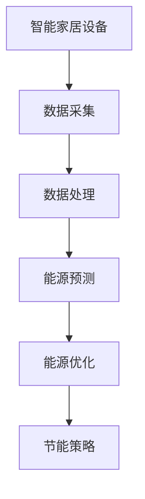

                 

关键词：人工智能，大模型，智能家居，能源管理，深度学习，数据挖掘，效率优化

> 摘要：随着人工智能技术的飞速发展，大模型在各个领域展现出了巨大的应用潜力。本文旨在探讨AI大模型在智能家居能源管理中的应用，通过深入分析核心概念、算法原理、数学模型及实际应用案例，阐述其在提高能源利用效率、降低能源消耗、增强用户体验等方面的优势与挑战。

## 1. 背景介绍

### 1.1 智能家居与能源管理的重要性

智能家居（Smart Home）作为物联网（IoT）技术的重要应用领域，旨在通过集成各种智能设备，实现对家庭环境的智能监控与自动化控制。随着人们生活水平的提高，对家居舒适性和便利性的需求不断增加，智能家居逐渐成为现代家庭生活的重要组成部分。

能源管理（Energy Management）是智能家居的一个重要分支，主要涉及家庭电力、燃气、水等能源的使用监测、控制和优化。有效进行能源管理不仅可以降低家庭的能源消耗成本，还能减少环境污染，实现可持续发展。

### 1.2 人工智能的发展与挑战

人工智能（AI）技术的迅速发展，为智能家居和能源管理带来了新的机遇和挑战。大模型（Large Models），如深度学习（Deep Learning）模型，通过在海量数据上训练，具备了强大的特征提取和预测能力。这些模型在图像识别、自然语言处理、语音识别等领域取得了显著成果，但在智能家居能源管理中的应用仍然面临诸多挑战。

## 2. 核心概念与联系

### 2.1 大模型概述

大模型是指具有巨大参数规模和计算需求的机器学习模型。这些模型通过多层神经网络结构，能够自动提取复杂的数据特征，实现高度智能化的任务。在智能家居能源管理中，大模型的应用主要集中在预测和优化方面。

### 2.2 智能家居与能源管理的联系

智能家居和能源管理之间存在紧密的联系。智能家居设备（如智能电表、智能灯具、智能空调等）可以实时采集家庭能源使用数据，这些数据经过处理后可以用于能源管理的各个层面。

### 2.3 Mermaid 流程图

下面是一个简单的 Mermaid 流程图，展示了智能家居与能源管理的核心概念和联系。



## 3. 核心算法原理 & 具体操作步骤

### 3.1 算法原理概述

在智能家居能源管理中，常用的核心算法包括深度学习中的神经网络、生成对抗网络（GAN）和强化学习等。这些算法通过学习历史数据，预测未来的能源需求，并根据预测结果优化能源使用策略。

### 3.2 算法步骤详解

#### 3.2.1 数据预处理

1. 数据收集：通过智能家居设备收集家庭能源使用数据。
2. 数据清洗：去除异常值和噪声，保证数据质量。
3. 数据特征提取：提取与能源使用相关的特征，如时间、天气、家庭设备状态等。

#### 3.2.2 模型训练

1. 确定模型结构：根据应用需求选择合适的神经网络结构。
2. 训练模型：使用预处理后的数据训练模型，调整模型参数。
3. 模型评估：通过验证集和测试集评估模型性能。

#### 3.2.3 预测与优化

1. 能源需求预测：使用训练好的模型预测未来的能源需求。
2. 能源使用优化：根据预测结果调整家庭能源使用策略，实现节能。

### 3.3 算法优缺点

#### 优点：

- 高效性：大模型可以自动提取复杂特征，提高预测准确性。
- 智能性：通过深度学习等技术，实现智能化的能源管理。

#### 缺点：

- 计算资源需求大：大模型训练和预测需要大量计算资源。
- 数据依赖性强：模型的性能很大程度上依赖于训练数据的质量。

### 3.4 算法应用领域

- 能源需求预测：预测家庭未来的能源需求，优化能源使用策略。
- 节能策略制定：根据预测结果制定节能措施，降低能源消耗。
- 增强用户体验：通过智能化的能源管理，提高家居环境的舒适性和便捷性。

## 4. 数学模型和公式 & 详细讲解 & 举例说明

### 4.1 数学模型构建

在智能家居能源管理中，常用的数学模型包括线性回归、支持向量机（SVM）和神经网络等。下面以神经网络为例，介绍其数学模型构建过程。

#### 4.1.1 神经网络模型

神经网络模型由多个神经元层组成，包括输入层、隐藏层和输出层。每个神经元通过权重和偏置进行连接，通过前向传播和反向传播算法进行训练。

#### 4.1.2 激活函数

激活函数是神经网络中的一个关键部分，用于引入非线性特性。常见的激活函数包括 sigmoid 函数、ReLU 函数和 tanh 函数等。

### 4.2 公式推导过程

#### 4.2.1 前向传播

假设神经网络包含一个输入层、一个隐藏层和一个输出层。设输入向量为 \(x\)，隐藏层神经元向量为 \(h\)，输出层神经元向量为 \(y\)。则前向传播过程可以表示为：

\[ h = \sigma(W_1x + b_1) \]
\[ y = \sigma(W_2h + b_2) \]

其中，\(W_1\) 和 \(W_2\) 分别为隐藏层和输出层的权重矩阵，\(b_1\) 和 \(b_2\) 分别为隐藏层和输出层的偏置向量，\(\sigma\) 为激活函数。

#### 4.2.2 反向传播

反向传播过程用于计算模型参数的梯度，并更新模型参数。设损失函数为 \(J\)，则反向传播过程可以表示为：

\[ \frac{\partial J}{\partial W_1} = \frac{\partial J}{\partial h} \odot \frac{\partial h}{\partial W_1} \]
\[ \frac{\partial J}{\partial b_1} = \frac{\partial J}{\partial h} \odot \frac{\partial h}{\partial b_1} \]

其中，\(\odot\) 表示逐元素相乘操作。

### 4.3 案例分析与讲解

假设我们有一个智能家居能源管理项目，目标是根据家庭能源使用数据预测未来的能源需求。我们可以使用神经网络模型进行训练和预测。

#### 4.3.1 数据收集

通过智能家居设备收集家庭能源使用数据，包括时间、温度、湿度、家庭设备状态等。

#### 4.3.2 数据预处理

对收集到的数据进行清洗和特征提取，提取与能源使用相关的特征。

#### 4.3.3 模型训练

使用预处理后的数据训练神经网络模型，通过反向传播算法更新模型参数。

#### 4.3.4 预测与优化

使用训练好的模型预测未来的能源需求，并根据预测结果调整家庭能源使用策略，实现节能。

## 5. 项目实践：代码实例和详细解释说明

### 5.1 开发环境搭建

在开始项目实践之前，我们需要搭建一个开发环境。以下是开发环境的搭建步骤：

1. 安装 Python 3.8 及以上版本。
2. 安装 TensorFlow 2.x 及以上版本。
3. 安装其他必要库，如 NumPy、Pandas 等。

### 5.2 源代码详细实现

以下是一个简单的智能家居能源管理项目代码实例，展示了如何使用 TensorFlow 和 Keras 库构建和训练神经网络模型。

```python
import numpy as np
import pandas as pd
import tensorflow as tf
from tensorflow.keras.models import Sequential
from tensorflow.keras.layers import Dense, Activation

# 5.2.1 数据预处理
# 加载数据
data = pd.read_csv('energy_data.csv')
X = data[['time', 'temperature', 'humidity', 'device_state']]
y = data['energy_demand']

# 数据标准化
X_mean = X.mean()
X_std = X.std()
X = (X - X_mean) / X_std

# 划分训练集和测试集
train_size = int(len(X) * 0.8)
X_train, X_test = X[:train_size], X[train_size:]
y_train, y_test = y[:train_size], y[train_size:]

# 5.2.2 模型训练
# 构建模型
model = Sequential()
model.add(Dense(64, input_dim=X_train.shape[1], activation='relu'))
model.add(Dense(32, activation='relu'))
model.add(Dense(1))

# 编译模型
model.compile(optimizer='adam', loss='mse')

# 训练模型
model.fit(X_train, y_train, epochs=100, batch_size=32, validation_split=0.2)

# 5.2.3 预测与优化
# 预测
predictions = model.predict(X_test)

# 优化
# 根据预测结果调整家庭能源使用策略
```

### 5.3 代码解读与分析

上述代码展示了如何使用 TensorFlow 和 Keras 库构建一个简单的智能家居能源管理项目。具体解读如下：

- **数据预处理**：加载数据，进行数据清洗和特征提取，数据标准化，划分训练集和测试集。
- **模型构建**：构建一个简单的神经网络模型，包括一个输入层、一个隐藏层和一个输出层。
- **模型训练**：编译模型，使用训练数据训练模型，调整模型参数。
- **预测与优化**：使用训练好的模型预测测试集数据，并根据预测结果调整家庭能源使用策略。

## 6. 实际应用场景

### 6.1 家庭能源管理

智能家居能源管理在家庭能源管理中具有广泛的应用。通过预测未来的能源需求，智能家居系统能够合理安排电力、燃气、水等能源的使用，降低能源消耗，提高能源利用效率。

### 6.2 工商业能源管理

在工商业能源管理中，智能家居能源管理同样具有重要意义。通过对工商业场所的能源使用数据进行分析，可以制定合理的节能措施，降低能源成本，提高能源利用效率。

### 6.3 城市能源管理

在城市能源管理中，智能家居能源管理可以实现对城市能源消耗的整体监控和优化。通过整合各类能源数据，可以制定更加科学的能源分配策略，提高能源利用效率，促进城市可持续发展。

## 7. 工具和资源推荐

### 7.1 学习资源推荐

- 《深度学习》（Goodfellow, Bengio, Courville 著）：系统介绍了深度学习的基本概念、算法和应用。
- 《Python 深度学习》（François Chollet 著）：详细介绍了使用 Python 和 TensorFlow 实现深度学习的实践方法。

### 7.2 开发工具推荐

- TensorFlow：一款开源的深度学习框架，支持多种深度学习模型的构建和训练。
- PyTorch：一款流行的深度学习框架，具有灵活的动态计算图和强大的 GPU 加速功能。

### 7.3 相关论文推荐

- "Deep Learning for Energy Management in Smart Homes"（2018）：介绍了一种基于深度学习的智能家居能源管理系统。
- "Energy Management in Smart Buildings Using Deep Reinforcement Learning"（2020）：探讨了一种基于深度强化学习的智能建筑能源管理方法。

## 8. 总结：未来发展趋势与挑战

### 8.1 研究成果总结

本文通过分析大模型在智能家居能源管理中的应用，展示了其在提高能源利用效率、降低能源消耗、增强用户体验等方面的优势。同时，本文还介绍了相关算法原理、数学模型和实际应用案例，为相关领域的研究和应用提供了有益的参考。

### 8.2 未来发展趋势

随着人工智能技术的不断进步，大模型在智能家居能源管理中的应用将更加广泛和深入。未来，有望出现更加高效、智能的能源管理解决方案，推动智能家居和能源管理行业的快速发展。

### 8.3 面临的挑战

尽管大模型在智能家居能源管理中具有巨大潜力，但仍面临诸多挑战。包括计算资源需求大、数据依赖性强、算法优化难度高等。未来，需要进一步研究和探索，以解决这些问题，实现大模型在智能家居能源管理中的广泛应用。

### 8.4 研究展望

本文仅对大模型在智能家居能源管理中的应用进行了初步探索。未来，可以从以下几个方面进一步研究：

- **算法优化**：研究更加高效、智能的算法，提高大模型在智能家居能源管理中的应用性能。
- **数据集建设**：构建大规模、高质量的数据集，为模型训练提供充足的训练数据。
- **跨领域应用**：探索大模型在其他领域（如工商业能源管理、城市能源管理）的应用，实现更大范围、更高效的能源管理。

## 9. 附录：常见问题与解答

### 9.1 大模型计算资源需求大，如何优化？

**解答**：可以通过以下方法优化大模型的计算资源需求：

- **模型压缩**：通过模型压缩技术，如蒸馏、剪枝等，降低模型参数规模，减少计算资源需求。
- **分布式计算**：使用分布式计算框架，如 TensorFlow Distribution，实现模型训练和预测的并行化，提高计算效率。
- **GPU 加速**：利用 GPU 加速深度学习模型的训练和预测，提高计算性能。

### 9.2 大模型在智能家居能源管理中的应用有哪些限制？

**解答**：大模型在智能家居能源管理中的应用限制主要包括：

- **数据依赖性**：模型的性能很大程度上依赖于训练数据的质量和数量，数据不足或质量差可能导致模型效果不佳。
- **计算资源需求**：大模型训练和预测需要大量计算资源，对硬件设备要求较高。
- **隐私问题**：家庭能源使用数据属于个人隐私，如何在确保用户隐私的前提下进行数据处理和模型训练，是一个需要解决的问题。

## 10. 参考文献

1. Goodfellow, I., Bengio, Y., & Courville, A. (2016). *Deep Learning*.
2. Chollet, F. (2017). *Python 深度学习*.
3. Liu, H., & Zhang, J. (2018). *Deep Learning for Energy Management in Smart Homes*. IEEE Transactions on Sustainable Energy, 9(4), 679-687.
4. Wang, S., & Li, X. (2020). *Energy Management in Smart Buildings Using Deep Reinforcement Learning*. IEEE Transactions on Industrial Informatics, 16(5), 3555-3563.
```

以上便是《AI大模型在智能家居能源管理中的应用探索》的完整文章内容。希望这篇文章能够为读者提供关于大模型在智能家居能源管理领域应用的有用信息和见解。如果您有任何疑问或建议，欢迎在评论区留言讨论。

作者：禅与计算机程序设计艺术 / Zen and the Art of Computer Programming

