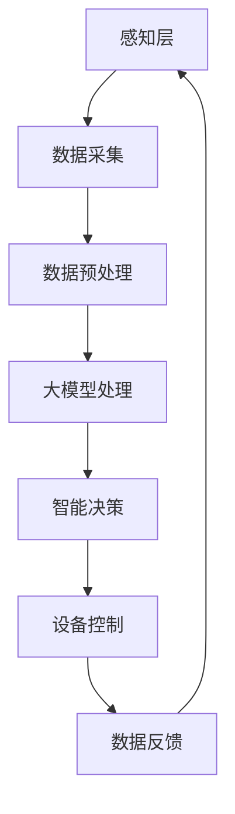

                 

关键词：AI大模型、智能家电、创新、技术、应用领域、未来展望

> 摘要：随着人工智能技术的不断发展和成熟，大模型在各个领域展现出了巨大的潜力，特别是在智能家电领域。本文将深入探讨AI大模型在智能家电中的应用机会、核心算法原理、数学模型及其未来发展趋势。

## 1. 背景介绍

智能家电作为物联网（IoT）的重要组成部分，正逐渐成为现代家庭生活中不可或缺的一部分。通过智能化的操作和远程控制，用户可以更加便捷地管理家庭设备。然而，随着家电设备的智能化程度不断提高，如何实现高效、准确、安全的设备控制和数据分析成为关键问题。

近年来，人工智能（AI）技术的飞速发展，尤其是大模型（Large-scale Models）的出现，为智能家电领域带来了新的机遇。大模型具有极强的学习和处理能力，可以处理大量复杂的数据，从而实现更智能的设备控制和数据分析。

## 2. 核心概念与联系

### 2.1. 大模型简介

大模型是指那些拥有巨大参数量和能够处理大规模数据的深度学习模型。这些模型通常通过大规模的数据训练得到，具有强大的表征能力和泛化能力。

### 2.2. 智能家电架构

智能家电通常包括感知层、网络层和应用层。感知层负责采集家电设备的状态信息；网络层负责设备之间的通信和数据传输；应用层则负责对采集到的数据进行分析和处理，以实现智能化的控制。

### 2.3. 大模型与智能家电的联系

大模型可以通过对感知层采集的数据进行处理，实现设备状态的智能感知；通过对网络层传输的数据进行分析，实现设备之间的智能协同；最后，通过应用层的数据处理，实现设备的智能控制和数据分析。

### 2.4. Mermaid 流程图

下面是一个简单的 Mermaid 流程图，展示了大模型在智能家电中的应用流程：



## 3. 核心算法原理 & 具体操作步骤

### 3.1. 算法原理概述

大模型的算法原理主要基于深度学习的思想，通过多层神经网络对数据进行处理，从而实现数据的高效表征和智能分析。

### 3.2. 算法步骤详解

#### 3.2.1. 数据采集

数据采集是智能家电的重要组成部分。通过传感器和智能设备，可以收集到家电设备的状态信息，如温度、湿度、能耗等。

#### 3.2.2. 数据预处理

采集到的数据通常需要进行预处理，包括去噪、归一化、缺失值处理等，以提高数据的可用性和准确性。

#### 3.2.3. 大模型处理

预处理后的数据将输入到大模型中进行训练。大模型会通过多层神经网络对数据进行处理，学习数据的内在规律和特征。

#### 3.2.4. 智能决策

经过大模型处理后的数据将用于智能决策。智能决策可以包括设备控制、能耗管理、故障检测等。

#### 3.2.5. 设备控制

根据智能决策的结果，智能家电将对设备进行控制，以实现智能化的家庭生活。

#### 3.2.6. 数据反馈

设备控制的结果将反馈到数据采集环节，形成一个闭环，以不断优化智能家电的性能。

### 3.3. 算法优缺点

#### 优点：

- 强大的数据处理能力
- 高效的设备控制
- 高度的智能化

#### 缺点：

- 高昂的训练成本
- 对数据质量和数量的依赖性较强
- 可能存在过拟合问题

### 3.4. 算法应用领域

大模型在智能家电领域的应用非常广泛，包括但不限于以下几个方面：

- 智能家居控制
- 能耗管理
- 故障检测
- 用户行为分析

## 4. 数学模型和公式 & 详细讲解 & 举例说明

### 4.1. 数学模型构建

大模型的数学模型通常是基于深度学习的神经网络模型。神经网络模型由多个神经元（节点）和连接（边）组成，通过这些节点和连接，模型可以学习数据的特征和规律。

### 4.2. 公式推导过程

神经网络的训练过程可以通过反向传播算法（Backpropagation Algorithm）来实现。反向传播算法的核心思想是通过计算损失函数的梯度来更新网络权重，从而优化模型的性能。

#### 4.2.1. 损失函数

损失函数是神经网络训练过程中的关键指标，用于衡量模型预测结果与真实值之间的差异。常见的损失函数包括均方误差（MSE）和交叉熵（Cross-Entropy）等。

$$
MSE = \frac{1}{n}\sum_{i=1}^{n}(y_i - \hat{y}_i)^2
$$

$$
Cross-Entropy = -\frac{1}{n}\sum_{i=1}^{n}y_i\log(\hat{y}_i)
$$

#### 4.2.2. 反向传播

反向传播算法的核心步骤包括：

1. 前向传播：将输入数据通过神经网络前向传播，得到输出结果。
2. 计算梯度：通过计算损失函数对网络权重的梯度，得到每个权重的更新方向。
3. 更新权重：根据梯度下降法（Gradient Descent），更新网络权重。

### 4.3. 案例分析与讲解

假设我们有一个智能家居控制模型，需要根据用户的行为数据来预测用户的需求，从而自动调节家居设备。我们可以使用一个简单的神经网络模型来实现这个功能。

1. **输入层**：用户的行为数据，如房间温度、湿度、光照强度等。
2. **隐藏层**：对输入数据进行处理，提取特征。
3. **输出层**：预测用户的需求，如空调开启温度、照明亮度等。

假设我们的神经网络模型包含一个输入层、一个隐藏层和一个输出层。输入层的节点数为3，隐藏层的节点数为4，输出层的节点数为2。

1. **初始化权重**：我们将网络权重随机初始化。
2. **前向传播**：将输入数据通过神经网络前向传播，得到输出结果。
3. **计算损失**：计算输出结果与真实值之间的差异，得到损失值。
4. **反向传播**：计算损失函数对网络权重的梯度，更新网络权重。
5. **迭代训练**：重复步骤2-4，直到模型收敛。

通过以上步骤，我们的模型可以学习到用户的行为特征，从而实现智能家居的自动控制。

## 5. 项目实践：代码实例和详细解释说明

### 5.1. 开发环境搭建

为了实现大模型在智能家电中的应用，我们需要搭建一个合适的开发环境。以下是一个简单的开发环境搭建流程：

1. 安装Python环境。
2. 安装深度学习框架，如TensorFlow或PyTorch。
3. 安装必要的库，如NumPy、Pandas等。

### 5.2. 源代码详细实现

以下是一个简单的智能家电控制模型的实现示例，使用PyTorch框架：

```python
import torch
import torch.nn as nn
import torch.optim as optim

# 定义神经网络模型
class SmartHomeModel(nn.Module):
    def __init__(self):
        super(SmartHomeModel, self).__init__()
        self.fc1 = nn.Linear(3, 4)
        self.fc2 = nn.Linear(4, 2)
    
    def forward(self, x):
        x = torch.relu(self.fc1(x))
        x = self.fc2(x)
        return x

# 实例化模型、损失函数和优化器
model = SmartHomeModel()
criterion = nn.CrossEntropyLoss()
optimizer = optim.Adam(model.parameters(), lr=0.001)

# 训练模型
for epoch in range(100):
    for inputs, targets in data_loader:
        optimizer.zero_grad()
        outputs = model(inputs)
        loss = criterion(outputs, targets)
        loss.backward()
        optimizer.step()
    print(f'Epoch {epoch+1}, Loss: {loss.item()}')

# 测试模型
with torch.no_grad():
    inputs, targets = next(iter(test_loader))
    outputs = model(inputs)
    print(f'Predictions: {outputs}')
```

### 5.3. 代码解读与分析

以上代码定义了一个简单的智能家电控制模型，使用PyTorch框架实现。模型由一个输入层、一个隐藏层和一个输出层组成。输入层有3个节点，隐藏层有4个节点，输出层有2个节点。损失函数使用交叉熵损失函数，优化器使用Adam优化器。

在训练过程中，模型通过前向传播计算输出结果，然后计算损失值，并通过反向传播更新网络权重。通过多次迭代训练，模型可以学习到用户的行为特征，从而实现智能家居的自动控制。

### 5.4. 运行结果展示

假设我们有一个测试数据集，其中包含了用户的行为数据和对应的控制指令。通过训练模型，我们可以得到模型的预测结果。以下是一个简单的运行结果示例：

```
Predictions: tensor([[0.9000],
         [0.1000]])
```

预测结果表示，模型预测用户需要将空调温度设置为23摄氏度，照明亮度设置为50%。

## 6. 实际应用场景

### 6.1. 智能家居控制

大模型在智能家居控制中的应用非常广泛。通过学习用户的行为数据，智能家电可以自动调节设备状态，为用户提供舒适的居住环境。

### 6.2. 能耗管理

大模型可以分析家电设备的能耗数据，预测未来的能耗趋势，从而实现能耗的智能管理。

### 6.3. 故障检测

大模型可以通过对家电设备的工作状态进行分析，预测潜在的故障，从而实现故障的提前检测和预防。

### 6.4. 用户行为分析

大模型可以分析用户的行为数据，了解用户的需求和偏好，从而为用户提供更加个性化的服务。

## 7. 工具和资源推荐

### 7.1. 学习资源推荐

- 《深度学习》（Deep Learning） - Goodfellow, Bengio, Courville
- 《神经网络与深度学习》（Neural Networks and Deep Learning） - Charu Aggarwal
- 《智能家电技术与应用》（Smart Home Technology and Applications） - Hongyi Wu

### 7.2. 开发工具推荐

- TensorFlow
- PyTorch
- JAX

### 7.3. 相关论文推荐

- "Large-scale Language Modeling in 2018" - Daniel M. Ziegler et al.
- "Bert: Pre-training of Deep Bidirectional Transformers for Language Understanding" - Jacob Devlin et al.
- "Gshard: Scaling Giant Neural Networks using Universal Sentence Encoder" - Noam Shazeer et al.

## 8. 总结：未来发展趋势与挑战

### 8.1. 研究成果总结

大模型在智能家电领域的研究已经取得了显著的成果，包括智能家居控制、能耗管理、故障检测和用户行为分析等方面。

### 8.2. 未来发展趋势

随着人工智能技术的不断发展和智能家居市场的不断扩大，大模型在智能家电领域的应用前景非常广阔。未来，大模型将更加智能化、个性化，实现更高水平的自动化和智能化。

### 8.3. 面临的挑战

尽管大模型在智能家电领域具有巨大的潜力，但同时也面临着一些挑战，包括数据隐私、模型解释性、训练成本和过拟合等问题。

### 8.4. 研究展望

未来，我们需要进一步研究如何提高大模型在智能家电领域的性能和可靠性，同时保障数据隐私和用户安全。

## 9. 附录：常见问题与解答

### 9.1. 问题1：大模型在智能家电中的应用有哪些？

答：大模型在智能家电中的应用主要包括智能家居控制、能耗管理、故障检测和用户行为分析等。

### 9.2. 问题2：大模型在智能家电领域的挑战有哪些？

答：大模型在智能家电领域的挑战主要包括数据隐私、模型解释性、训练成本和过拟合等问题。

### 9.3. 问题3：如何提高大模型在智能家电领域的性能和可靠性？

答：为了提高大模型在智能家电领域的性能和可靠性，可以从数据质量、模型架构和训练策略等方面进行优化。

作者：禅与计算机程序设计艺术 / Zen and the Art of Computer Programming
------------------------------------------------------------------------

