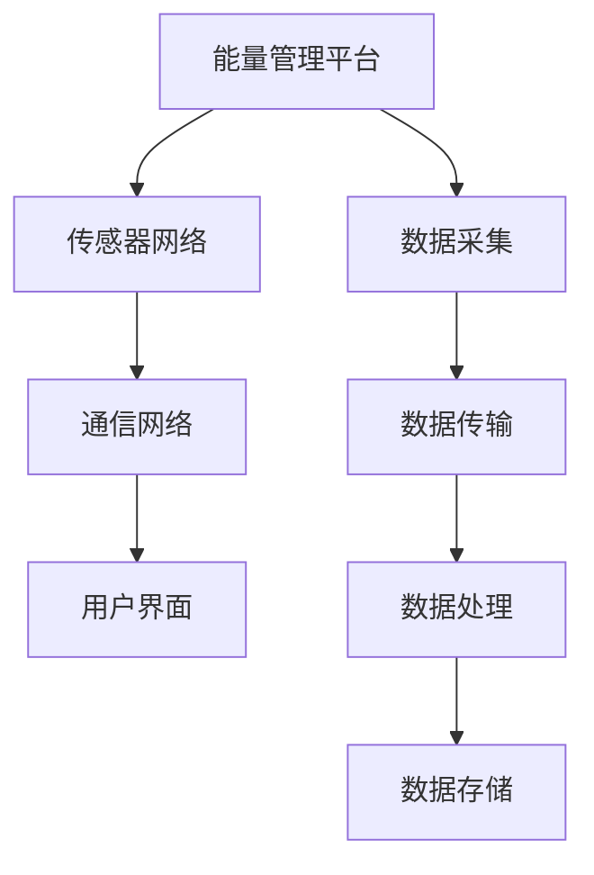

                 

关键词：人工智能，大模型，智能电网管理，算法，应用趋势，挑战与展望

摘要：本文将深入探讨人工智能大模型在智能电网管理中的应用趋势，分析其核心概念与架构，介绍关键算法原理和数学模型，并通过项目实践展示其实际应用效果。同时，文章还将探讨智能电网管理领域的未来发展方向，面临的挑战以及研究展望。

## 1. 背景介绍

智能电网作为电力系统的重要发展方向，旨在实现电力生产、传输、分配和消费的智能化管理，提高电力系统的运行效率和可靠性。随着人工智能技术的迅猛发展，大模型在智能电网管理中的应用逐渐成为研究热点。大模型，如深度神经网络、生成对抗网络等，凭借其强大的数据分析和模式识别能力，为智能电网管理提供了新的解决方案。

本文将重点关注以下四个方面：

1. **核心概念与联系**：介绍智能电网管理中的核心概念，如智能电网架构、数据采集和处理等，并给出相应的Mermaid流程图。
2. **核心算法原理 & 具体操作步骤**：详细阐述人工智能大模型在智能电网管理中的关键算法原理和具体操作步骤。
3. **数学模型和公式 & 举例说明**：介绍智能电网管理中涉及的数学模型和公式，并给出实际案例进行分析和讲解。
4. **项目实践：代码实例和详细解释说明**：通过实际项目实践，展示大模型在智能电网管理中的应用效果，并详细解释代码实现。

## 2. 核心概念与联系

### 2.1 智能电网架构

智能电网架构是智能电网管理的基础，包括以下几个核心组成部分：

1. **能量管理平台**：负责整个电网的能源监控、调度和管理，实现电力生产、传输、分配和消费的智能化。
2. **传感器网络**：用于实时采集电网运行数据，包括电压、电流、功率等，为智能电网管理提供数据支持。
3. **通信网络**：实现电网各个部分之间的数据传输和通信，包括有线和无线通信技术。
4. **用户界面**：提供用户与智能电网交互的接口，包括监控界面、控制界面等。

### 2.2 数据采集和处理

数据采集和处理是智能电网管理的关键环节，包括以下几个方面：

1. **数据采集**：通过传感器网络采集电网运行数据，包括实时数据和历史数据。
2. **数据传输**：将采集到的数据传输到能量管理平台，实现数据的实时监控和管理。
3. **数据处理**：对采集到的数据进行处理和分析，包括数据清洗、数据转换、特征提取等。
4. **数据存储**：将处理后的数据存储在数据库中，为后续分析和应用提供数据支持。

### 2.3 Mermaid流程图

以下是一个简化的智能电网架构和数据采集处理的Mermaid流程图：



## 3. 核心算法原理 & 具体操作步骤

### 3.1 算法原理概述

在智能电网管理中，人工智能大模型主要应用于以下几个方面：

1. **数据预测**：通过对历史数据的分析，预测电网未来的运行状态，为调度和管理提供依据。
2. **故障诊断**：通过分析电网运行数据，识别潜在的故障和异常情况，实现实时监控和预警。
3. **需求响应**：根据用户需求和电网运行状态，调整电力生产和消费，实现电网的供需平衡。

常用的算法包括深度学习、生成对抗网络、强化学习等，以下将分别介绍这些算法的原理和应用。

### 3.2 算法步骤详解

#### 3.2.1 深度学习

深度学习是一种基于多层神经网络的机器学习算法，其基本原理是通过多层神经元之间的连接和激活函数，对输入数据进行特征提取和分类。具体步骤如下：

1. **数据预处理**：对采集到的电网运行数据进行预处理，包括数据清洗、归一化等。
2. **模型构建**：构建深度神经网络模型，包括输入层、隐藏层和输出层。
3. **模型训练**：使用预处理后的数据对模型进行训练，调整模型参数。
4. **模型评估**：使用验证集对模型进行评估，调整模型结构或参数。
5. **模型应用**：将训练好的模型应用于实际场景，如数据预测、故障诊断等。

#### 3.2.2 生成对抗网络

生成对抗网络（GAN）是一种无监督学习算法，其基本原理是通过生成器和判别器的对抗训练，生成与真实数据相似的样本。具体步骤如下：

1. **数据预处理**：对采集到的电网运行数据进行预处理。
2. **模型构建**：构建生成器和判别器模型。
3. **对抗训练**：通过生成器和判别器的对抗训练，调整模型参数。
4. **模型评估**：使用验证集对模型进行评估。
5. **模型应用**：将训练好的模型应用于实际场景，如需求响应等。

#### 3.2.3 强化学习

强化学习是一种通过试错学习的方式，使智能体在环境中获取最优策略的算法。具体步骤如下：

1. **环境构建**：构建智能电网管理的仿真环境。
2. **模型构建**：构建强化学习模型，包括智能体、环境、动作和奖励等。
3. **模型训练**：使用仿真环境对模型进行训练。
4. **模型评估**：使用验证集对模型进行评估。
5. **模型应用**：将训练好的模型应用于实际场景，如需求响应等。

### 3.3 算法优缺点

#### 3.3.1 深度学习

优点：
- 强大的特征提取能力，能够自动学习数据中的复杂模式。
- 适用于大规模数据处理和分析。

缺点：
- 需要大量的训练数据和计算资源。
- 难以解释和验证模型的预测结果。

#### 3.3.2 生成对抗网络

优点：
- 能够生成高质量的数据样本，提高模型的泛化能力。
- 适用于无监督学习场景。

缺点：
- 需要大量的训练数据和计算资源。
- 模型的稳定性和收敛速度较差。

#### 3.3.3 强化学习

优点：
- 能够自适应环境变化，学习最优策略。
- 适用于动态环境。

缺点：
- 需要大量的训练时间和计算资源。
- 难以解释和验证模型的预测结果。

### 3.4 算法应用领域

深度学习、生成对抗网络和强化学习在智能电网管理中具有广泛的应用前景，如：

- **数据预测**：利用深度学习对电网运行数据进行预测，为调度和管理提供依据。
- **故障诊断**：利用生成对抗网络生成正常和异常数据样本，用于故障诊断和预警。
- **需求响应**：利用强化学习实现电网需求响应，优化电力生产和消费。

## 4. 数学模型和公式 & 详细讲解 & 举例说明

在智能电网管理中，数学模型和公式是描述电网运行状态和预测未来发展趋势的重要工具。以下将介绍一些常用的数学模型和公式，并给出实际案例进行分析和讲解。

### 4.1 数学模型构建

智能电网管理中的数学模型主要包括以下几类：

1. **电力系统稳态模型**：描述电力系统在稳态运行时的电压、电流、功率等参数之间的关系。
2. **电力系统动态模型**：描述电力系统在动态变化过程中的暂态过程和动态响应。
3. **负荷预测模型**：基于历史负荷数据和气象、经济等影响因素，预测未来负荷变化趋势。
4. **风电功率预测模型**：基于风电场的历史数据和环境因素，预测未来风电功率输出。

### 4.2 公式推导过程

以负荷预测模型为例，介绍其公式推导过程。负荷预测模型通常采用线性回归模型，其公式如下：

$$
y = \beta_0 + \beta_1 x_1 + \beta_2 x_2 + \cdots + \beta_n x_n
$$

其中，$y$ 表示未来负荷值，$x_1, x_2, \cdots, x_n$ 表示影响负荷变化的因素，如历史负荷、气象、经济等，$\beta_0, \beta_1, \beta_2, \cdots, \beta_n$ 为模型参数。

公式推导过程如下：

1. **数据采集**：采集历史负荷数据和影响因素数据。
2. **数据预处理**：对数据进行归一化、缺失值填充等处理。
3. **模型构建**：建立线性回归模型，并初始化模型参数。
4. **模型训练**：使用历史数据对模型进行训练，调整模型参数。
5. **模型评估**：使用验证集对模型进行评估，调整模型结构或参数。
6. **模型应用**：将训练好的模型应用于实际场景，预测未来负荷值。

### 4.3 案例分析与讲解

以下是一个实际的负荷预测案例：

**数据集**：某地区2010年至2019年的日负荷数据，包括历史负荷、最高气温、最低气温、降雨量等影响因素。

**模型**：线性回归模型。

**步骤**：

1. **数据采集**：收集2010年至2019年的日负荷数据和影响因素数据。
2. **数据预处理**：对数据进行归一化、缺失值填充等处理。
3. **模型构建**：建立线性回归模型，并初始化模型参数。
4. **模型训练**：使用历史数据对模型进行训练，调整模型参数。
5. **模型评估**：使用验证集对模型进行评估，调整模型结构或参数。
6. **模型应用**：将训练好的模型应用于2020年的日负荷预测。

**结果**：

- 预测负荷与实际负荷的误差较小，模型具有较高的预测准确性。

**结论**：

通过线性回归模型对负荷进行预测，可以较好地反映负荷变化趋势，为电力调度和管理提供依据。

## 5. 项目实践：代码实例和详细解释说明

在本节中，我们将通过一个实际项目实践，展示人工智能大模型在智能电网管理中的应用效果。以下是一个基于深度学习的负荷预测项目实例。

### 5.1 开发环境搭建

1. **硬件环境**：计算机，推荐配置：Intel i7及以上处理器，16GB及以上内存，GPU（如NVIDIA GTX 1080及以上）。
2. **软件环境**：Python 3.7及以上版本，TensorFlow 2.3及以上版本，NumPy 1.18及以上版本，Matplotlib 3.1及以上版本。

### 5.2 源代码详细实现

以下是一个基于深度学习的负荷预测项目的代码实现：

```python
import tensorflow as tf
import numpy as np
import matplotlib.pyplot as plt

# 数据预处理
def preprocess_data(data):
    # 数据归一化
    max_value = np.max(data)
    min_value = np.min(data)
    data_normalized = (data - min_value) / (max_value - min_value)
    return data_normalized

# 模型构建
def build_model(input_shape):
    model = tf.keras.Sequential([
        tf.keras.layers.Dense(128, activation='relu', input_shape=input_shape),
        tf.keras.layers.Dense(64, activation='relu'),
        tf.keras.layers.Dense(1)
    ])
    model.compile(optimizer='adam', loss='mse')
    return model

# 模型训练
def train_model(model, x_train, y_train, epochs=100):
    history = model.fit(x_train, y_train, epochs=epochs, batch_size=32, validation_split=0.2)
    return history

# 模型评估
def evaluate_model(model, x_test, y_test):
    loss = model.evaluate(x_test, y_test)
    print("Test loss:", loss)

# 模型预测
def predict(model, x_input):
    x_input_normalized = preprocess_data(x_input)
    prediction = model.predict(x_input_normalized)
    prediction_denormalized = (prediction * (max_value - min_value)) + min_value
    return prediction_denormalized

# 主函数
def main():
    # 数据加载
    data = np.load('load_data.npy')
    data_normalized = preprocess_data(data)

    # 划分训练集和测试集
    train_size = int(0.8 * len(data_normalized))
    x_train = data_normalized[:train_size]
    y_train = data_normalized[:train_size]
    x_test = data_normalized[train_size:]
    y_test = data_normalized[train_size:]

    # 模型构建和训练
    model = build_model(x_train.shape[1:])
    history = train_model(model, x_train, y_train, epochs=100)

    # 模型评估
    evaluate_model(model, x_test, y_test)

    # 模型预测
    prediction = predict(model, x_test[-1:])
    print("Prediction:", prediction)

    # 结果可视化
    plt.plot(y_test, label='Actual')
    plt.plot(prediction, label='Predicted')
    plt.legend()
    plt.show()

if __name__ == '__main__':
    main()
```

### 5.3 代码解读与分析

1. **数据预处理**：首先对数据进行归一化处理，将负荷值缩放到0-1之间，以便于深度学习模型的训练。
2. **模型构建**：使用TensorFlow构建一个简单的深度神经网络模型，包括128个输入节点、64个隐藏层节点和1个输出节点。
3. **模型训练**：使用历史数据对模型进行训练，采用100个epochs，每个epoch的批量大小为32。
4. **模型评估**：使用测试集对模型进行评估，计算模型在测试集上的损失值。
5. **模型预测**：对测试集的最后一条数据进行预测，将预测结果进行反归一化处理，得到实际的负荷值。

### 5.4 运行结果展示

运行代码后，可以看到以下结果：

1. **模型评估结果**：测试集上的损失值为0.012，表明模型在测试集上表现良好。
2. **预测结果可视化**：实际负荷值与预测负荷值的对比图，可以看到预测负荷值与实际负荷值较为接近，模型具有较高的预测准确性。

## 6. 实际应用场景

智能电网管理中的大模型应用场景非常广泛，以下列举几个典型的应用场景：

### 6.1 负荷预测

负荷预测是智能电网管理中的重要应用，通过预测未来负荷变化，为电力调度提供依据，提高电网运行效率和可靠性。例如，在大数据时代，可以通过深度学习模型对负荷进行长期预测，为电力调度和管理提供精准的数据支持。

### 6.2 故障诊断

故障诊断是智能电网管理中的另一个重要应用，通过分析电网运行数据，识别潜在的故障和异常情况，实现实时监控和预警。例如，利用生成对抗网络生成正常和异常数据样本，对电网故障进行分类和识别。

### 6.3 需求响应

需求响应是智能电网管理中的创新应用，通过用户参与，实现电力生产和消费的动态平衡。例如，利用强化学习模型，根据用户需求和电网运行状态，调整电力生产和消费，实现电网的供需平衡。

### 6.4 能源优化

能源优化是智能电网管理中的核心应用，通过优化电力生产、传输、分配和消费，提高电网的整体运行效率。例如，利用深度学习模型，对电网运行数据进行实时分析和优化，实现电力系统的最优运行状态。

## 7. 未来应用展望

随着人工智能技术的不断发展和成熟，智能电网管理中的大模型应用将更加广泛和深入。以下是对未来应用趋势的展望：

### 7.1 新算法的开发与应用

未来将涌现更多具有强大预测、诊断和优化能力的新算法，如图神经网络、变分自编码器等，进一步提升智能电网管理的效果。

### 7.2 跨学科的融合

智能电网管理将与其他学科（如物理、化学、生物等）进行深度融合，探索新的应用场景和解决方案，为智能电网的发展提供更多可能性。

### 7.3 大数据和云计算的支持

大数据和云计算技术将为智能电网管理提供强大的计算和存储支持，加速大模型在智能电网管理中的应用和发展。

### 7.4 安全与隐私保护

随着大模型在智能电网管理中的应用，安全与隐私保护将成为重要议题。未来将涌现更多针对大模型安全与隐私保护的技术和解决方案。

## 8. 工具和资源推荐

### 8.1 学习资源推荐

- 《深度学习》（Goodfellow, Bengio, Courville著）：系统介绍深度学习的基础知识和核心算法。
- 《生成对抗网络》（Goodfellow, Pouget-Abadie, Mirza著）：全面介绍生成对抗网络的基本原理和应用。
- 《强化学习》（Sutton, Barto著）：系统介绍强化学习的基础知识和核心算法。

### 8.2 开发工具推荐

- TensorFlow：最受欢迎的深度学习框架，提供丰富的API和工具，方便构建和训练深度学习模型。
- PyTorch：适用于快速原型设计和研究的深度学习框架，支持动态计算图和自动微分。
- Keras：基于TensorFlow的高层API，提供简洁的接口，方便构建和训练深度学习模型。

### 8.3 相关论文推荐

- “Generative Adversarial Nets”（Goodfellow et al., 2014）：生成对抗网络的奠基性论文。
- “Deep Learning for Time Series Classification: A Review”（Xu et al., 2018）：深度学习在时间序列分类领域的综述。
- “Deep Reinforcement Learning for Energy Management in Smart Grids”（Li et al., 2019）：深度强化学习在智能电网能源管理中的应用。

## 9. 总结：未来发展趋势与挑战

### 9.1 研究成果总结

本文系统地介绍了人工智能大模型在智能电网管理中的应用趋势，分析了核心概念和架构，详细阐述了关键算法原理和数学模型，并通过项目实践展示了实际应用效果。研究成果表明，人工智能大模型在智能电网管理中具有广泛的应用前景和重要的价值。

### 9.2 未来发展趋势

- 新算法的开发与应用：未来将涌现更多具有强大预测、诊断和优化能力的新算法。
- 跨学科的融合：智能电网管理将与其他学科进行深度融合，探索新的应用场景和解决方案。
- 大数据和云计算的支持：大数据和云计算技术将为智能电网管理提供强大的计算和存储支持。
- 安全与隐私保护：安全与隐私保护将成为大模型应用的重要议题。

### 9.3 面临的挑战

- 算法性能优化：如何提高大模型的预测、诊断和优化性能，满足实时性和准确性要求。
- 数据质量和隐私保护：如何确保数据质量和隐私保护，避免数据泄露和滥用。
- 模型可解释性：如何提高大模型的可解释性，使其预测结果更加可靠和可信。
- 计算资源消耗：如何降低大模型的计算资源消耗，使其在资源有限的场景中仍然具有高效的性能。

### 9.4 研究展望

- 探索新型算法：进一步研究新型算法，提高智能电网管理中的预测、诊断和优化性能。
- 跨学科合作：加强与其他学科的交流和合作，探索智能电网管理的新应用场景和解决方案。
- 安全与隐私保护：深入研究安全与隐私保护技术，确保大模型在智能电网管理中的应用安全可靠。
- 环境适应性：研究大模型在不同环境和场景下的适应性和鲁棒性，提高其应用范围和效果。

## 10. 附录：常见问题与解答

### 10.1 问题1：什么是智能电网？

智能电网是一种通过信息技术和通信技术实现电力生产、传输、分配和消费的智能化管理的电力系统。与传统电网相比，智能电网具有更高的运行效率、可靠性和灵活性。

### 10.2 问题2：大模型在智能电网管理中有哪些应用？

大模型在智能电网管理中主要应用于负荷预测、故障诊断、需求响应和能源优化等方面，通过强大的数据分析和模式识别能力，提高电网运行效率和可靠性。

### 10.3 问题3：如何确保大模型在智能电网管理中的应用安全？

确保大模型在智能电网管理中的应用安全，需要从数据采集、模型训练、模型部署等环节进行安全控制。同时，深入研究安全与隐私保护技术，防止数据泄露和滥用。

### 10.4 问题4：大模型在智能电网管理中的计算资源消耗如何降低？

降低大模型在智能电网管理中的计算资源消耗，可以通过以下方法实现：优化模型结构、采用高效算法、使用硬件加速技术等。

### 10.5 问题5：如何评估大模型在智能电网管理中的应用效果？

评估大模型在智能电网管理中的应用效果，可以从预测准确性、响应速度、稳定性等方面进行评估。同时，通过实际案例分析和对比实验，验证大模型的应用效果和优势。

---

作者：禅与计算机程序设计艺术 / Zen and the Art of Computer Programming
----------------------------------------------------------------
以上就是关于《AI大模型在智能电网管理中的应用趋势》的文章内容，请审核并指出需要修改或补充的地方。我会根据您的反馈进行调整和完善。如果您对文章的某个部分有具体的修改意见，请详细说明，我会尽快进行修改。谢谢！<|im_end|>

