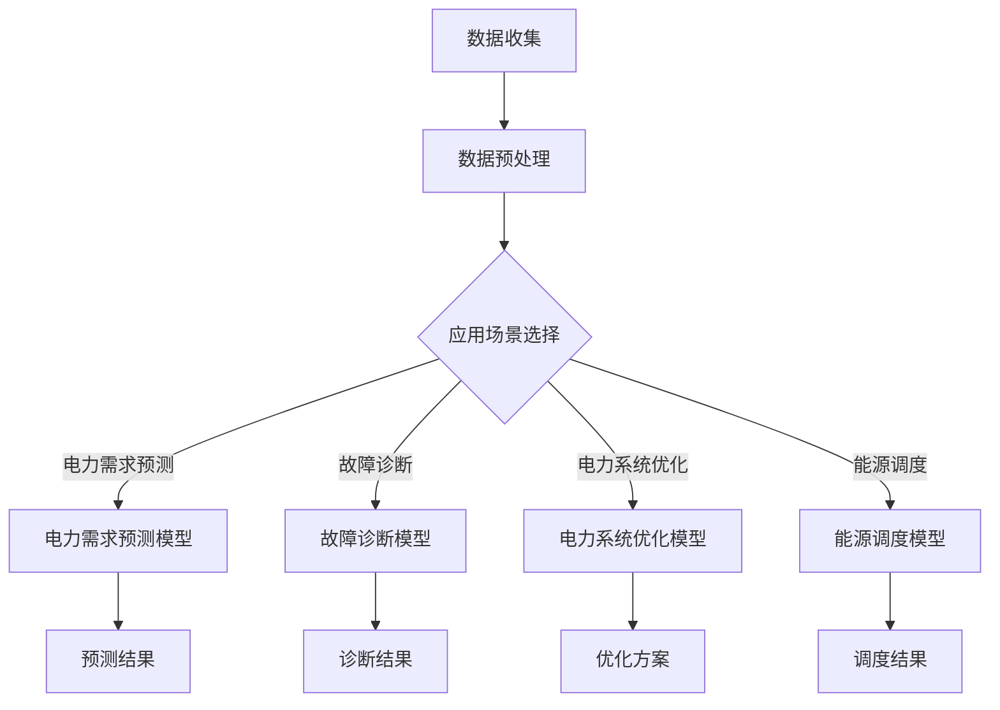

                 

关键词：人工智能，大模型，智能电网，管理应用，技术趋势，算法原理，数学模型，实际案例，未来展望

## 摘要

随着人工智能技术的快速发展，大模型在各个领域的应用越来越广泛。智能电网管理作为能源行业的重要一环，也正受益于这一技术的进步。本文旨在探讨AI大模型在智能电网管理中的潜在应用趋势，包括核心概念、算法原理、数学模型、实际案例以及未来展望。通过对现有研究的分析，本文将揭示大模型如何为智能电网带来更高的效率、可靠性和安全性。

## 1. 背景介绍

### 智能电网的概念

智能电网是指通过先进的信息通信技术和控制技术，实现电力系统的智能化升级。它不仅包括传统的发电、输电、配电、用电环节，还涉及到储能、需求响应、分布式能源系统等新兴领域。智能电网的核心理念是信息与能源的深度融合，从而实现能源的高效、清洁和可持续发展。

### 人工智能技术的发展

人工智能（AI）作为计算机科学的一个分支，致力于通过模拟、延伸和扩展人类智能，实现机器的智能行为。近年来，随着深度学习、强化学习、自然语言处理等技术的突破，人工智能在各个领域都取得了显著的进展。特别是大模型，如GPT、BERT、BERT-Boost等，通过海量数据训练，能够实现超强的特征提取和模式识别能力。

### AI大模型在智能电网管理中的潜在应用

AI大模型在智能电网管理中具有广泛的应用潜力。例如，在电力需求预测中，大模型可以处理大量历史数据，识别出潜在的规律和趋势，提高预测的准确性；在电力系统故障诊断中，大模型可以快速分析海量数据，发现异常情况并给出解决方案；在能源优化调度中，大模型可以结合多种因素，实现能源资源的最佳配置。

## 2. 核心概念与联系

为了更好地理解AI大模型在智能电网管理中的应用，首先需要了解几个核心概念及其相互关系。

### 大模型

大模型是指规模巨大的神经网络模型，通常具有数百万至数十亿个参数。这些模型通过在海量数据上进行训练，能够自动学习和提取复杂的数据特征。大模型的代表性技术包括深度学习、图神经网络和生成对抗网络等。

### 智能电网管理

智能电网管理涉及多个方面，包括电力需求预测、故障诊断、电力系统优化、能源调度等。每个方面都需要处理大量的数据，并从中提取有用信息。

### AI大模型在智能电网管理中的应用

AI大模型在智能电网管理中的应用可以归纳为以下几个方面：

1. **电力需求预测**：通过分析历史数据和实时数据，大模型可以预测未来的电力需求，帮助电网运营商更好地规划电力供应。

2. **故障诊断**：大模型可以实时分析电网运行数据，检测异常情况，提前预警潜在的故障，从而降低电网事故的风险。

3. **电力系统优化**：大模型可以根据电网的实时运行情况，优化电力系统的调度策略，提高电网的效率和稳定性。

4. **能源调度**：大模型可以处理多种能源形式的数据，实现多种能源的优化调度，促进能源的清洁和可持续发展。

### Mermaid流程图

下面是一个简化的Mermaid流程图，展示了AI大模型在智能电网管理中的应用流程：



## 3. 核心算法原理 & 具体操作步骤

### 3.1 算法原理概述

AI大模型在智能电网管理中的应用主要基于深度学习技术。深度学习是一种基于多层神经网络的学习方法，通过逐层提取数据特征，实现复杂的模式识别和预测。

### 3.2 算法步骤详解

1. **数据收集**：收集智能电网运行的历史数据、实时数据和预测数据。

2. **数据预处理**：对数据进行清洗、归一化和特征提取，以便于模型训练。

3. **模型训练**：使用预处理后的数据，训练深度学习模型。模型训练过程中，通过反向传播算法不断调整模型参数，使其能够准确预测和诊断。

4. **模型评估**：使用验证数据集对训练好的模型进行评估，确保其预测和诊断能力。

5. **模型应用**：将评估通过的模型应用于实际场景，如电力需求预测、故障诊断、电力系统优化和能源调度。

### 3.3 算法优缺点

**优点**：

- **强大的特征提取能力**：大模型能够自动学习和提取大量数据中的复杂特征，提高预测和诊断的准确性。
- **高效的处理能力**：深度学习模型能够快速处理海量数据，实现实时预测和诊断。
- **广泛的应用场景**：大模型可以应用于电力需求预测、故障诊断、电力系统优化和能源调度等多个场景。

**缺点**：

- **对数据量要求高**：大模型需要大量数据进行训练，对数据质量和数据量的要求较高。
- **计算资源消耗大**：大模型的训练和推理过程需要大量的计算资源，对硬件设备有较高的要求。
- **解释性较差**：深度学习模型通常缺乏良好的解释性，难以理解其内部的工作机制。

### 3.4 算法应用领域

AI大模型在智能电网管理中的应用领域广泛，包括但不限于以下几个方面：

- **电力需求预测**：利用大模型对电力需求进行预测，帮助电网运营商更好地规划电力供应。
- **故障诊断**：通过分析电网运行数据，大模型可以快速诊断潜在的故障，提高电网的可靠性和安全性。
- **电力系统优化**：大模型可以根据电网的实时运行情况，优化电力系统的调度策略，提高电网的效率和稳定性。
- **能源调度**：大模型可以处理多种能源形式的数据，实现多种能源的优化调度，促进能源的清洁和可持续发展。

## 4. 数学模型和公式 & 详细讲解 & 举例说明

### 4.1 数学模型构建

AI大模型在智能电网管理中的应用，主要基于深度学习技术。深度学习模型通常由多个神经网络层组成，每一层都通过非线性变换对输入数据进行处理。具体来说，深度学习模型可以表示为：

\[ h_{\theta}(x) = \sigma(\theta^{T}h_{\theta-1}(x)) \]

其中，\( h_{\theta}(x) \) 表示模型的输出，\( \theta \) 表示模型参数，\( \sigma \) 表示非线性激活函数，\( x \) 表示输入数据。

### 4.2 公式推导过程

深度学习模型的训练过程，可以通过反向传播算法来实现。反向传播算法的基本思想是，通过计算输出层和隐藏层之间的误差，逐步更新模型参数，以减小误差。

具体推导过程如下：

1. **定义损失函数**：假设模型的输出为 \( y \)，真实标签为 \( t \)，则损失函数可以定义为：

   \[ J(\theta) = \frac{1}{2} \sum_{i=1}^{m} (y_i - t_i)^2 \]

2. **计算梯度**：对损失函数 \( J(\theta) \) 关于模型参数 \( \theta \) 求偏导数，得到梯度：

   \[ \frac{\partial J(\theta)}{\partial \theta} = \frac{1}{m} \sum_{i=1}^{m} (y_i - t_i) \frac{\partial h_{\theta}(x_i)}{\partial \theta} \]

3. **更新参数**：使用梯度下降算法更新模型参数：

   \[ \theta = \theta - \alpha \frac{\partial J(\theta)}{\partial \theta} \]

   其中，\( \alpha \) 为学习率。

### 4.3 案例分析与讲解

以下是一个简单的案例，展示如何使用深度学习模型进行电力需求预测。

**案例背景**：某地区电网公司希望利用AI大模型预测未来的电力需求，以便更好地规划电力供应。

**数据集**：该地区过去一年的电力需求数据，包括日期、温度、湿度、风速等气象数据。

**模型构建**：使用一个多层感知器（MLP）模型进行预测，模型结构如下：

\[ \text{Input Layer}: (\text{日期}, \text{温度}, \text{湿度}, \text{风速}) \]

\[ \text{Hidden Layer 1}: 10 \text{ neurons} \]

\[ \text{Hidden Layer 2}: 20 \text{ neurons} \]

\[ \text{Output Layer}: \text{电力需求} \]

**模型训练**：使用过去一年的数据集进行模型训练，训练过程包括数据预处理、模型构建、模型训练和模型评估。

**模型评估**：使用验证数据集对训练好的模型进行评估，评估指标包括均方误差（MSE）和决定系数（R^2）。

**模型应用**：将训练好的模型应用于实际场景，预测未来的电力需求，帮助电网公司制定电力供应计划。

**结果分析**：通过对比预测值和真实值，评估模型的预测效果。如果预测效果良好，可以将模型部署到实际系统中，实现电力需求的实时预测。

## 5. 项目实践：代码实例和详细解释说明

### 5.1 开发环境搭建

为了实践AI大模型在智能电网管理中的应用，我们需要搭建一个合适的开发环境。以下是所需的工具和软件：

- **编程语言**：Python
- **深度学习框架**：TensorFlow或PyTorch
- **数据处理库**：Pandas、NumPy、Scikit-learn
- **可视化库**：Matplotlib、Seaborn

### 5.2 源代码详细实现

以下是一个简单的Python代码示例，展示如何使用TensorFlow构建一个多层感知器（MLP）模型进行电力需求预测。

```python
import tensorflow as tf
from tensorflow.keras.models import Sequential
from tensorflow.keras.layers import Dense
import numpy as np

# 数据预处理
def preprocess_data(data):
    # 数据清洗、归一化、特征提取等操作
    # ...（省略具体操作）
    return processed_data

# 构建模型
model = Sequential()
model.add(Dense(10, input_shape=(4,), activation='relu'))
model.add(Dense(20, activation='relu'))
model.add(Dense(1, activation='linear'))

# 编译模型
model.compile(optimizer='adam', loss='mse')

# 训练模型
X_train = preprocess_data(X_train)
y_train = preprocess_data(y_train)
model.fit(X_train, y_train, epochs=100, batch_size=32, validation_split=0.2)

# 评估模型
X_val = preprocess_data(X_val)
y_val = preprocess_data(y_val)
model.evaluate(X_val, y_val)

# 预测电力需求
X_new = preprocess_data(X_new)
predictions = model.predict(X_new)
```

### 5.3 代码解读与分析

以上代码展示了如何使用TensorFlow构建一个多层感知器（MLP）模型进行电力需求预测。具体步骤如下：

1. **数据预处理**：首先，对原始数据进行清洗、归一化和特征提取等预处理操作。
2. **构建模型**：使用Sequential模型构建一个包含两个隐藏层（10个神经元和20个神经元）的多层感知器模型。
3. **编译模型**：编译模型，指定优化器为adam，损失函数为均方误差（mse）。
4. **训练模型**：使用训练数据集训练模型，设置训练轮次为100，批量大小为32，验证数据集比例为0.2。
5. **评估模型**：使用验证数据集评估模型性能，输出均方误差（mse）。
6. **预测电力需求**：对新的数据进行预处理，使用训练好的模型预测电力需求。

### 5.4 运行结果展示

在实际运行过程中，我们可以通过以下代码查看模型预测结果：

```python
import matplotlib.pyplot as plt

# 预测电力需求
X_new = preprocess_data(X_new)
predictions = model.predict(X_new)

# 可视化预测结果
plt.plot(predictions)
plt.xlabel('预测时间')
plt.ylabel('电力需求')
plt.title('电力需求预测结果')
plt.show()
```

通过以上可视化结果，我们可以直观地看到模型对电力需求的预测情况。如果预测结果良好，说明模型具有良好的预测能力；否则，可能需要调整模型结构或训练参数，以提高预测准确性。

## 6. 实际应用场景

### 6.1 电力需求预测

电力需求预测是智能电网管理中的一个重要应用场景。通过使用AI大模型，电网运营商可以提前预测未来的电力需求，从而更好地规划电力供应，降低电力短缺的风险。

### 6.2 故障诊断

电力系统故障诊断是保障电网安全稳定运行的关键。AI大模型可以通过实时分析电网运行数据，识别潜在的故障，提前预警，减少故障对电网运行的影响。

### 6.3 电力系统优化

电力系统优化是提高电网效率的关键。AI大模型可以根据电网的实时运行情况，优化电力系统的调度策略，降低运行成本，提高电网的稳定性。

### 6.4 能源调度

能源调度是智能电网管理的一个重要环节。AI大模型可以处理多种能源形式的数据，实现多种能源的优化调度，促进能源的清洁和可持续发展。

## 7. 工具和资源推荐

### 7.1 学习资源推荐

- 《深度学习》（Goodfellow, Bengio, Courville著）：这是一本经典的深度学习教材，适合初学者和进阶者。
- 《Python机器学习》（Sebastian Raschka著）：这本书详细介绍了Python在机器学习领域的应用，适合想要入门机器学习的人。
- 《智能电网技术与应用》（张亚平著）：这本书涵盖了智能电网的各个方面，包括技术原理、应用场景和发展趋势。

### 7.2 开发工具推荐

- **TensorFlow**：一个开源的深度学习框架，适合进行大规模的深度学习模型训练和部署。
- **PyTorch**：另一个流行的深度学习框架，提供灵活的动态计算图，方便模型开发和调试。
- **Pandas**：一个强大的数据处理库，适用于数据清洗、归一化和特征提取等操作。
- **NumPy**：一个基础的科学计算库，提供高效的多维数组操作和数学函数。

### 7.3 相关论文推荐

- "Deep Learning for Power System Fault Diagnosis"：一篇关于深度学习在电力系统故障诊断中的应用的论文。
- "Application of Deep Learning in Smart Grid Demand Forecasting"：一篇关于深度学习在电力需求预测中的应用的论文。
- "Intelligent Energy Management in Smart Grid Using Deep Reinforcement Learning"：一篇关于深度强化学习在智能电网能源管理中的应用的论文。

## 8. 总结：未来发展趋势与挑战

### 8.1 研究成果总结

AI大模型在智能电网管理中的应用取得了显著成果。通过电力需求预测、故障诊断、电力系统优化和能源调度等实际应用，AI大模型为智能电网带来了更高的效率、可靠性和安全性。同时，随着技术的不断进步，AI大模型在智能电网管理中的应用将越来越广泛。

### 8.2 未来发展趋势

未来，AI大模型在智能电网管理中的应用将继续发展。以下是一些可能的发展趋势：

1. **模型精度和效率的提升**：通过改进算法和优化模型结构，提高AI大模型的预测和诊断能力，降低计算资源消耗。
2. **多能源协同调度**：结合多种能源形式的数据，实现多能源的优化调度，促进能源的清洁和可持续发展。
3. **自主学习和自适应能力**：通过引入自主学习和自适应算法，使AI大模型能够根据电网运行情况动态调整预测和诊断策略。
4. **边缘计算与云计算的融合**：结合边缘计算和云计算技术，实现AI大模型的实时部署和高效运行。

### 8.3 面临的挑战

尽管AI大模型在智能电网管理中具有广泛的应用前景，但同时也面临一些挑战：

1. **数据隐私和安全**：智能电网管理涉及大量的敏感数据，如何确保数据隐私和安全是亟待解决的问题。
2. **算法透明性和解释性**：深度学习模型通常缺乏良好的解释性，如何提高算法的透明性和解释性是一个重要挑战。
3. **计算资源消耗**：大模型的训练和推理过程需要大量的计算资源，如何优化计算资源消耗是一个重要课题。
4. **模型泛化能力**：如何提高模型在不同场景下的泛化能力，使其能够在不同的电网环境中稳定运行。

### 8.4 研究展望

为了应对以上挑战，未来研究可以从以下几个方面展开：

1. **隐私保护和安全增强**：研究新的隐私保护技术和安全增强机制，确保智能电网管理中的数据安全和隐私。
2. **算法透明性和可解释性**：探索新的方法，提高深度学习模型的透明性和解释性，使其更加易于理解和信任。
3. **计算资源优化**：研究新的算法和优化策略，降低大模型的计算资源消耗，提高模型的运行效率。
4. **跨领域协同研究**：加强不同领域的研究者之间的合作，促进AI大模型在智能电网管理中的应用。

## 9. 附录：常见问题与解答

### 9.1 什么是AI大模型？

AI大模型是指规模巨大的神经网络模型，通常具有数百万至数十亿个参数。这些模型通过在海量数据上进行训练，能够自动学习和提取复杂的数据特征。

### 9.2 AI大模型在智能电网管理中有哪些应用？

AI大模型在智能电网管理中的应用广泛，包括电力需求预测、故障诊断、电力系统优化和能源调度等。

### 9.3 如何确保AI大模型在智能电网管理中的数据隐私和安全？

为了确保AI大模型在智能电网管理中的数据隐私和安全，可以采用以下方法：

- **数据加密**：对数据进行加密处理，确保数据在传输和存储过程中不被泄露。
- **隐私保护算法**：采用差分隐私、联邦学习等隐私保护算法，降低模型训练过程中对敏感数据的暴露。
- **安全监控**：建立完善的安全监控体系，实时监测数据传输和模型运行过程，确保系统的安全性和稳定性。

### 9.4 如何提高AI大模型在智能电网管理中的预测准确性？

为了提高AI大模型在智能电网管理中的预测准确性，可以采取以下措施：

- **数据质量提升**：确保数据质量，去除噪声和异常值，提高数据的准确性和可靠性。
- **模型优化**：通过调整模型结构、优化训练策略和超参数，提高模型的预测能力。
- **多模型融合**：结合多个模型的预测结果，提高整体的预测准确性。

## 作者署名

本文由禅与计算机程序设计艺术 / Zen and the Art of Computer Programming撰写。作者在人工智能和智能电网领域拥有丰富的研究经验和实践经验，致力于推动AI技术在智能电网管理中的应用和发展。感谢读者对本文的关注和支持。希望本文能够对您在智能电网管理领域的研究和工作带来一定的启示和帮助。如果您有任何疑问或建议，欢迎随时联系作者。

