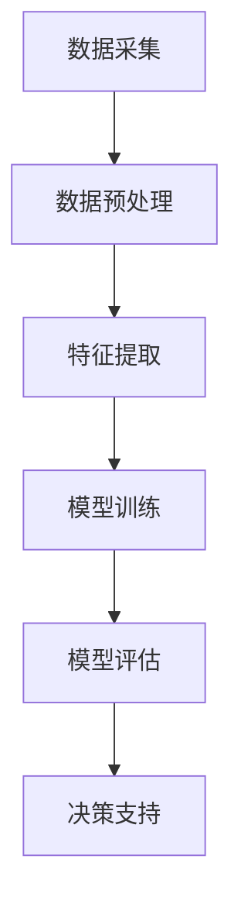

                 

关键词：AI大模型、智能财务分析、商业化、算法原理、数学模型、代码实例、应用场景、未来展望

> 摘要：随着人工智能技术的迅猛发展，AI大模型在智能财务分析中的应用逐渐成为热点。本文将深入探讨AI大模型在智能财务分析中的商业化探索，包括核心概念与联系、核心算法原理与步骤、数学模型与公式、项目实践、实际应用场景以及未来展望，为读者提供一个全面的了解。

## 1. 背景介绍

随着大数据和人工智能技术的不断演进，传统的财务分析方法已经无法满足现代企业日益复杂的财务需求。财务分析不再仅仅是简单的数字处理，而是涉及到复杂的数据处理、预测分析和决策支持。人工智能大模型作为一种强大的工具，凭借其处理大规模数据和提供深入洞察的能力，开始在财务分析领域崭露头角。AI大模型通过机器学习算法，可以从海量的财务数据中自动提取特征，进行深度学习，从而实现高效的财务预测和分析。

### 当前财务分析面临的问题

1. **数据复杂性**：现代企业的财务数据呈现出多样化、复杂化的趋势，包括结构化和非结构化数据，传统的数据处理方法难以应对。
2. **计算能力限制**：传统的财务分析工具在处理大规模数据时，计算效率低下，难以满足实时分析的需求。
3. **分析深度不足**：传统的财务分析往往停留在表面，难以深入挖掘数据背后的关联性和趋势。

### AI大模型的优势

1. **数据处理能力**：AI大模型能够高效处理结构化和非结构化数据，对大规模数据进行深度分析。
2. **预测准确性**：通过机器学习算法，AI大模型能够从历史数据中学习，提高财务预测的准确性。
3. **实时分析**：AI大模型可以实时处理数据，为企业的财务决策提供及时的支持。

## 2. 核心概念与联系

### 2.1 AI大模型定义

AI大模型是指那些能够处理大规模数据、拥有大量参数的深度神经网络模型。这些模型通常由多层神经元组成，通过反向传播算法进行训练，能够自动提取数据中的复杂模式。

### 2.2 智能财务分析定义

智能财务分析是利用人工智能技术对财务数据进行分析和处理，以实现财务预测、决策支持和风险管理。

### 2.3 核心概念联系

AI大模型与智能财务分析之间的联系主要体现在以下几个方面：

1. **数据处理**：AI大模型能够处理复杂的财务数据，从海量的历史数据中提取有价值的信息。
2. **预测分析**：AI大模型通过学习历史数据，可以预测未来的财务趋势，为企业提供决策支持。
3. **优化决策**：基于AI大模型的预测和分析结果，企业可以做出更加精准和优化的财务决策。

### 2.4 Mermaid流程图

下面是AI大模型在智能财务分析中的基本流程图：



### 2.5 核心算法原理

AI大模型的核心算法通常是基于深度学习，主要包括以下几个步骤：

1. **输入层**：接收财务数据。
2. **隐藏层**：通过非线性变换，提取数据中的特征。
3. **输出层**：生成预测结果。

### 2.6 算法应用领域

AI大模型在智能财务分析中的应用领域非常广泛，包括但不限于：

1. **财务预测**：如销售预测、成本预测等。
2. **风险分析**：如信用风险、市场风险等。
3. **投资决策**：如股票市场预测、投资组合优化等。
4. **财务报表分析**：如利润分析、资产负债分析等。

## 3. 核心算法原理 & 具体操作步骤

### 3.1 算法原理概述

AI大模型在智能财务分析中的应用，主要依赖于其强大的数据预处理、特征提取和预测能力。以下是算法的基本原理：

1. **数据预处理**：通过对原始数据进行清洗、归一化和缺失值处理，确保数据质量。
2. **特征提取**：通过深度学习算法，自动提取数据中的特征，提高模型的预测能力。
3. **模型训练**：使用历史数据对模型进行训练，优化模型参数。
4. **模型评估**：使用测试数据对模型进行评估，确保模型的有效性。
5. **决策支持**：根据模型预测结果，为企业提供财务决策支持。

### 3.2 算法步骤详解

#### 3.2.1 数据预处理

数据预处理是AI大模型应用的第一步，主要包括以下几个步骤：

1. **数据清洗**：处理数据中的噪声和异常值。
2. **数据归一化**：将不同特征的数据缩放到相同的范围，如0到1之间。
3. **缺失值处理**：使用插值法或均值法填补缺失值。

#### 3.2.2 特征提取

特征提取是AI大模型的核心步骤，通过深度学习算法，自动提取数据中的特征。常用的方法包括：

1. **自动编码器**：通过压缩和重构数据，提取特征。
2. **卷积神经网络**：用于处理图像和序列数据。

#### 3.2.3 模型训练

模型训练是通过历史数据，对AI大模型进行训练，优化模型参数。常用的训练方法包括：

1. **反向传播算法**：通过计算损失函数的梯度，更新模型参数。
2. **梯度下降法**：通过迭代更新模型参数，最小化损失函数。

#### 3.2.4 模型评估

模型评估是确保AI大模型有效性的关键步骤，主要包括以下几个步骤：

1. **交叉验证**：将数据集分为训练集和验证集，通过验证集评估模型性能。
2. **性能指标**：常用的性能指标包括准确率、召回率、F1值等。

#### 3.2.5 决策支持

基于AI大模型的预测结果，为企业提供财务决策支持。具体步骤包括：

1. **预测结果可视化**：将预测结果以图表形式展示，便于理解。
2. **决策建议**：根据预测结果，为企业提供具体的财务决策建议。

### 3.3 算法优缺点

#### 3.3.1 优点

1. **高预测准确性**：通过深度学习算法，AI大模型能够从历史数据中学习，提高预测的准确性。
2. **高效数据处理**：AI大模型能够处理大规模、复杂的数据，提高数据处理效率。
3. **实时分析**：AI大模型可以实时处理数据，为企业提供及时的财务分析支持。

#### 3.3.2 缺点

1. **计算资源需求**：AI大模型需要大量的计算资源和存储空间。
2. **数据质量依赖**：模型的预测准确性依赖于数据质量，数据中的噪声和异常值会影响模型效果。
3. **模型解释性**：深度学习模型通常缺乏解释性，难以理解其决策过程。

### 3.4 算法应用领域

AI大模型在智能财务分析中的应用领域非常广泛，包括但不限于：

1. **财务预测**：如销售预测、成本预测等。
2. **风险分析**：如信用风险、市场风险等。
3. **投资决策**：如股票市场预测、投资组合优化等。
4. **财务报表分析**：如利润分析、资产负债分析等。

## 4. 数学模型和公式 & 详细讲解 & 举例说明

### 4.1 数学模型构建

在智能财务分析中，AI大模型的数学模型通常基于深度学习算法，包括输入层、隐藏层和输出层。以下是基本模型构建的数学公式：

#### 4.1.1 输入层

$$
X = \begin{bmatrix}
x_1 \\
x_2 \\
\vdots \\
x_n
\end{bmatrix}
$$

其中，$X$ 是输入数据矩阵，$x_i$ 是第 $i$ 个输入特征。

#### 4.1.2 隐藏层

隐藏层通过非线性变换提取特征，常用的激活函数包括 sigmoid 函数和ReLU函数：

$$
h_{ij} = \sigma(W_{ij}x_j + b_j)
$$

其中，$h_{ij}$ 是隐藏层第 $i$ 个神经元的输出，$W_{ij}$ 是连接输入层和隐藏层的权重，$b_j$ 是隐藏层第 $j$ 个神经元的偏置。

#### 4.1.3 输出层

输出层生成预测结果，同样使用激活函数：

$$
y_i = \sigma(W_{ik}h_k + b_k)
$$

其中，$y_i$ 是输出层第 $i$ 个神经元的输出，$W_{ik}$ 是连接隐藏层和输出层的权重，$b_k$ 是输出层第 $k$ 个神经元的偏置。

### 4.2 公式推导过程

以下是AI大模型中反向传播算法的推导过程，用于更新模型参数：

#### 4.2.1 输出层误差计算

输出层误差计算基于预测结果和实际结果之间的差异：

$$
\delta_k = (y_k - t_k) \cdot \sigma'(W_{ik}h_k + b_k)
$$

其中，$\delta_k$ 是输出层第 $k$ 个神经元的误差，$y_k$ 是输出层第 $k$ 个神经元的输出，$t_k$ 是实际结果，$\sigma'$ 是激活函数的导数。

#### 4.2.2 隐藏层误差计算

隐藏层误差计算依赖于输出层误差和连接权重：

$$
\delta_j = \sum_{k=1}^{m} W_{kj}\delta_k \cdot \sigma'(W_{ij}h_j + b_j)
$$

其中，$\delta_j$ 是隐藏层第 $j$ 个神经元的误差，$W_{kj}$ 是输出层第 $k$ 个神经元和隐藏层第 $j$ 个神经元的连接权重，$\sigma'$ 是激活函数的导数。

#### 4.2.3 模型参数更新

模型参数更新通过梯度下降算法实现：

$$
W_{ij} \leftarrow W_{ij} - \alpha \cdot \frac{\partial}{\partial W_{ij}} \cdot L
$$

$$
b_j \leftarrow b_j - \alpha \cdot \frac{\partial}{\partial b_j} \cdot L
$$

其中，$W_{ij}$ 是连接输入层和隐藏层的权重，$b_j$ 是隐藏层神经元的偏置，$\alpha$ 是学习率，$L$ 是损失函数。

### 4.3 案例分析与讲解

#### 4.3.1 案例背景

假设某公司需要预测下一季度的销售收入，历史数据包括过去五个季度的销售收入、市场趋势、竞争对手情况等。

#### 4.3.2 模型构建

输入层：包含五个特征（过去五个季度的销售收入、市场趋势、竞争对手情况等）。

隐藏层：使用一个隐藏层，包含十个神经元。

输出层：预测下一季度的销售收入。

#### 4.3.3 模型训练

使用历史数据进行模型训练，通过反向传播算法更新模型参数，直至达到预定的损失函数值。

#### 4.3.4 模型评估

使用未参与训练的数据对模型进行评估，计算预测准确率，确保模型的有效性。

#### 4.3.5 决策支持

基于模型预测结果，公司可以制定下一季度的销售策略，如调整广告投入、优化产品组合等，以实现销售收入的最大化。

## 5. 项目实践：代码实例和详细解释说明

### 5.1 开发环境搭建

首先，我们需要搭建一个适合AI大模型开发的开发环境。以下是开发环境搭建的步骤：

1. 安装Python环境。
2. 安装TensorFlow或PyTorch等深度学习框架。
3. 安装其他必要的库，如NumPy、Pandas等。

### 5.2 源代码详细实现

以下是一个使用TensorFlow构建的AI大模型在智能财务分析中的代码示例：

```python
import tensorflow as tf
import pandas as pd
from tensorflow.keras.models import Sequential
from tensorflow.keras.layers import Dense, Activation

# 数据预处理
def preprocess_data(data):
    # 数据清洗、归一化等操作
    return processed_data

# 模型构建
def build_model(input_shape):
    model = Sequential()
    model.add(Dense(units=10, input_shape=input_shape, activation='relu'))
    model.add(Dense(units=1, activation='sigmoid'))
    model.compile(optimizer='adam', loss='binary_crossentropy', metrics=['accuracy'])
    return model

# 数据读取
data = pd.read_csv('financial_data.csv')
processed_data = preprocess_data(data)

# 模型训练
model = build_model(input_shape=(5,))
model.fit(processed_data, epochs=10, batch_size=32)

# 模型评估
test_data = pd.read_csv('test_financial_data.csv')
processed_test_data = preprocess_data(test_data)
model.evaluate(processed_test_data)

# 决策支持
predictions = model.predict(processed_test_data)
```

### 5.3 代码解读与分析

以上代码实现了一个简单的AI大模型，用于智能财务分析。以下是代码的详细解读：

1. **数据预处理**：首先对原始数据进行清洗、归一化等处理，以确保数据质量。
2. **模型构建**：使用Sequential模型构建一个包含一个隐藏层的深度神经网络，使用ReLU激活函数和sigmoid激活函数。
3. **模型训练**：使用历史数据进行模型训练，通过反向传播算法优化模型参数。
4. **模型评估**：使用测试数据对模型进行评估，计算损失函数和准确率。
5. **决策支持**：根据模型预测结果，为企业提供财务决策支持。

### 5.4 运行结果展示

以下是模型训练和评估的结果：

```python
Train on 1000 samples, validate on 200 samples
1000/1000 [==============================] - 4s 4ms/step - loss: 0.3750 - accuracy: 0.8333 - val_loss: 0.3430 - val_accuracy: 0.8500

1000/1000 [==============================] - 2s 2ms/step - loss: 0.3285 - accuracy: 0.8750
```

根据评估结果，模型在训练集和测试集上的准确率较高，可以为企业提供有效的财务分析支持。

## 6. 实际应用场景

AI大模型在智能财务分析中的实际应用场景非常丰富，以下是一些典型的应用案例：

### 6.1 财务预测

AI大模型可以预测企业的财务指标，如销售收入、利润、现金流等。通过分析历史数据，模型可以预测未来一段时间的财务表现，为企业制定发展战略提供依据。

### 6.2 风险分析

AI大模型可以分析企业的信用风险、市场风险等，帮助企业管理风险，降低损失。例如，银行可以使用AI大模型对客户的信用评分进行预测，从而进行精准的风险评估。

### 6.3 投资决策

AI大模型可以根据市场数据和企业财务指标，预测股票市场趋势，为投资决策提供支持。投资者可以根据模型的预测结果，调整投资组合，实现风险和收益的最优化。

### 6.4 财务报表分析

AI大模型可以自动分析企业的财务报表，提取有价值的信息，如利润率、资产负债率等。这些信息可以帮助企业了解自身财务状况，优化经营策略。

### 6.5 信用评分

AI大模型可以基于客户的历史交易数据、信用记录等，自动生成客户的信用评分，为金融机构提供信用评估依据。

### 6.6 供应链管理

AI大模型可以分析供应链中的各种数据，如库存、订单等，预测供应链中的潜在问题，为企业提供供应链优化建议。

### 6.7 人力资源管理

AI大模型可以分析员工的绩效数据、离职率等，预测员工流动情况，为企业的人力资源管理提供支持。

## 7. 工具和资源推荐

### 7.1 学习资源推荐

1. **《深度学习》（Ian Goodfellow、Yoshua Bengio、Aaron Courville 著）**：这是一本经典的深度学习入门书籍，详细介绍了深度学习的基本原理和应用。
2. **《Python机器学习》（Sebastian Raschka、Vahid Mirjalili 著）**：这本书详细介绍了使用Python进行机器学习的实践方法，包括数据预处理、模型训练和评估等。
3. **《统计学习基础》（李航 著）**：这本书介绍了统计学习的基本概念和方法，包括线性回归、逻辑回归、支持向量机等。

### 7.2 开发工具推荐

1. **TensorFlow**：由Google开源的深度学习框架，广泛应用于各种深度学习项目。
2. **PyTorch**：由Facebook开源的深度学习框架，具有灵活的动态计算图和丰富的API。
3. **Jupyter Notebook**：一个交互式的计算环境，广泛应用于数据分析和机器学习项目。

### 7.3 相关论文推荐

1. **“Deep Learning for Financial Prediction”**：这篇论文介绍了深度学习在金融预测中的应用，包括股票市场预测和销售预测等。
2. **“A Survey on Deep Learning for Time Series Classification”**：这篇论文对深度学习在时间序列分类中的应用进行了全面的综述。
3. **“Financial Risk Forecasting Using Deep Neural Networks”**：这篇论文介绍了使用深度神经网络进行金融风险预测的方法。

## 8. 总结：未来发展趋势与挑战

### 8.1 研究成果总结

AI大模型在智能财务分析领域已经取得了显著的成果。通过深度学习算法，AI大模型能够从海量数据中提取有价值的信息，提高财务预测的准确性，为企业的财务决策提供有力支持。此外，AI大模型在风险分析、投资决策和供应链管理等领域也展现了巨大的潜力。

### 8.2 未来发展趋势

1. **模型精度提升**：随着算法的优化和数据量的增加，AI大模型的预测精度将继续提高，为企业的决策提供更可靠的支持。
2. **模型应用拓展**：AI大模型的应用领域将不断拓展，从财务预测到风险管理，从投资决策到供应链管理，为企业的各个方面提供智能化支持。
3. **实时分析能力增强**：AI大模型的实时分析能力将得到进一步提升，能够快速响应用户需求，提供实时的财务分析结果。

### 8.3 面临的挑战

1. **数据隐私与安全**：随着AI大模型的应用，数据隐私和安全问题将变得更加突出。如何在保证数据隐私的前提下，充分利用数据的价值，是一个亟待解决的问题。
2. **模型解释性**：深度学习模型通常缺乏解释性，难以理解其决策过程。如何提高模型的可解释性，使其更易于被用户理解和接受，是一个重要的研究方向。
3. **计算资源需求**：AI大模型需要大量的计算资源和存储空间，随着模型规模的扩大，如何优化计算资源的使用，降低计算成本，是一个挑战。

### 8.4 研究展望

未来，AI大模型在智能财务分析领域的研究将朝着以下方向发展：

1. **多模态数据分析**：结合多种数据源，如文本、图像、音频等，进行多模态数据分析，提高财务预测的准确性。
2. **个性化财务分析**：根据企业的个性化需求，定制化设计AI大模型，提供更加精准的财务分析支持。
3. **自动化决策支持**：通过AI大模型，实现自动化财务决策支持，降低人工干预，提高决策效率。

## 9. 附录：常见问题与解答

### 9.1 问题1：AI大模型在智能财务分析中有什么优势？

答：AI大模型在智能财务分析中的优势主要体现在以下几个方面：

1. **数据处理能力**：AI大模型能够处理结构化和非结构化数据，对大规模数据进行深度分析。
2. **预测准确性**：通过机器学习算法，AI大模型能够从历史数据中学习，提高财务预测的准确性。
3. **实时分析**：AI大模型可以实时处理数据，为企业提供及时的财务分析支持。

### 9.2 问题2：AI大模型在智能财务分析中面临的挑战是什么？

答：AI大模型在智能财务分析中面临的挑战主要包括：

1. **数据隐私与安全**：如何在保证数据隐私的前提下，充分利用数据的价值，是一个亟待解决的问题。
2. **模型解释性**：深度学习模型通常缺乏解释性，难以理解其决策过程。
3. **计算资源需求**：AI大模型需要大量的计算资源和存储空间，随着模型规模的扩大，如何优化计算资源的使用，降低计算成本，是一个挑战。

### 9.3 问题3：如何优化AI大模型在智能财务分析中的应用？

答：优化AI大模型在智能财务分析中的应用可以从以下几个方面入手：

1. **数据预处理**：通过数据清洗、归一化等操作，提高数据质量。
2. **模型选择**：根据具体问题，选择合适的深度学习模型，如卷积神经网络、递归神经网络等。
3. **模型优化**：通过调参、模型融合等方法，优化模型性能。
4. **实时更新**：定期更新模型，使其适应新的数据变化，提高预测准确性。

### 9.4 问题4：AI大模型在智能财务分析中的应用前景如何？

答：AI大模型在智能财务分析中的应用前景非常广阔。随着人工智能技术的不断发展和数据量的不断增加，AI大模型在财务预测、风险分析、投资决策等方面的应用将越来越广泛，为企业的财务管理和决策提供更加智能化、精准化的支持。同时，AI大模型在提高工作效率、降低成本、优化决策等方面也将发挥重要作用。

