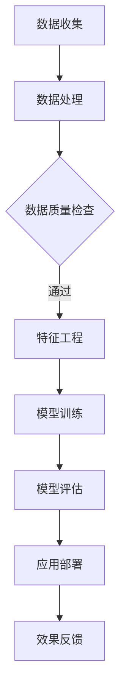

                 

关键词：人工智能，大模型，智能零售，应用前景，技术发展

> 摘要：随着人工智能技术的不断发展，AI大模型在各个领域展现出了巨大的潜力。本文将探讨AI大模型在智能零售中的应用前景，分析其技术原理、数学模型以及实际应用场景，并展望未来发展的趋势与挑战。

## 1. 背景介绍

智能零售是零售业与人工智能技术深度融合的产物，旨在通过大数据、云计算、物联网、人工智能等技术手段，提升零售业务的智能化水平，优化消费者体验，提高运营效率。近年来，随着大数据和人工智能技术的不断发展，AI大模型在智能零售中的应用逐渐成为行业关注的焦点。

AI大模型，即深度学习模型，是一种能够通过海量数据进行自动学习，从而实现复杂任务的人工智能模型。这类模型在图像识别、语音识别、自然语言处理等领域表现出了惊人的能力。随着模型规模的不断扩大，AI大模型在处理复杂任务、提升决策效率方面具有显著优势。

智能零售的发展离不开AI大模型的支撑。从商品推荐到个性化营销，从库存管理到客户服务，AI大模型正在逐步改变零售行业的面貌。本文将围绕AI大模型在智能零售中的应用，探讨其技术原理、应用场景以及未来发展趋势。

## 2. 核心概念与联系

### 2.1 AI大模型的概念

AI大模型，即基于深度学习的复杂神经网络模型，通常具有数百万到数十亿个参数。这些模型通过训练学习海量数据，从而实现高度自动化的任务处理。典型的AI大模型包括卷积神经网络（CNN）、循环神经网络（RNN）、生成对抗网络（GAN）等。

### 2.2 智能零售的概念

智能零售是指利用人工智能技术对零售业务进行智能化改造，提升零售效率、优化消费者体验的业务模式。智能零售的核心包括数据驱动的决策、个性化的服务、智能化的供应链管理等。

### 2.3 AI大模型与智能零售的联系

AI大模型在智能零售中的应用主要体现在以下几个方面：

- **商品推荐**：利用深度学习模型分析消费者行为数据，实现精准的商品推荐。
- **个性化营销**：基于消费者画像，通过AI大模型实现个性化的广告推送和促销策略。
- **库存管理**：利用深度学习模型预测市场需求，优化库存水平。
- **客户服务**：通过自然语言处理技术，实现智能客服和语音交互。

### 2.4 Mermaid流程图



### 2.5 AI大模型在智能零售中的应用架构


## 3. 核心算法原理 & 具体操作步骤

### 3.1 算法原理概述

AI大模型的核心在于深度学习算法，其基本原理是通过多层神经网络对数据进行自动学习，从而实现复杂任务的自动化处理。深度学习算法包括神经网络结构设计、训练算法、优化算法等多个方面。

### 3.2 算法步骤详解

#### 3.2.1 神经网络结构设计

神经网络结构设计是深度学习模型的关键，包括网络层数、每层的神经元数量、激活函数、损失函数等。

#### 3.2.2 训练算法

训练算法包括前向传播、反向传播等步骤，通过不断调整模型参数，使模型在训练数据上达到最优效果。

#### 3.2.3 优化算法

优化算法用于提高模型训练效率，包括梯度下降、随机梯度下降、Adam优化器等。

### 3.3 算法优缺点

#### 优点：

- **强大的学习能力**：能够处理大规模数据，实现复杂任务。
- **自动特征提取**：无需人工设计特征，减少人工干预。
- **自适应调整**：能够根据数据变化自适应调整模型参数。

#### 缺点：

- **计算资源消耗大**：需要大量计算资源和时间进行训练。
- **数据依赖性强**：模型的性能高度依赖于训练数据的质量。
- **解释性不足**：深度学习模型的决策过程缺乏透明性。

### 3.4 算法应用领域

AI大模型在智能零售中的应用领域广泛，包括但不限于：

- **商品推荐**：通过深度学习模型分析消费者行为数据，实现精准的商品推荐。
- **个性化营销**：基于消费者画像，通过深度学习模型实现个性化的广告推送和促销策略。
- **库存管理**：利用深度学习模型预测市场需求，优化库存水平。
- **客户服务**：通过自然语言处理技术，实现智能客服和语音交互。

## 4. 数学模型和公式 & 详细讲解 & 举例说明

### 4.1 数学模型构建

深度学习模型的数学基础主要包括线性代数、概率论和统计学、微积分等。

#### 4.1.1 线性代数

矩阵运算、向量运算等是深度学习模型的基础。

#### 4.1.2 概率论和统计学

概率分布、期望、方差等概率统计概念在深度学习模型中有广泛应用。

#### 4.1.3 微积分

导数、积分等微积分概念在深度学习模型的优化算法中发挥关键作用。

### 4.2 公式推导过程

以卷积神经网络（CNN）为例，介绍CNN中的主要公式推导过程。

#### 4.2.1 前向传播

$$
z_l = W_l \cdot a_{l-1} + b_l
$$

$$
a_l = \sigma(z_l)
$$

其中，$z_l$ 表示第 $l$ 层的中间值，$W_l$ 和 $b_l$ 分别表示第 $l$ 层的权重和偏置，$\sigma$ 表示激活函数。

#### 4.2.2 反向传播

$$
\delta_l = \frac{\partial L}{\partial a_l} \cdot \frac{\partial a_l}{\partial z_l}
$$

$$
\delta_{l-1} = \frac{\partial L}{\partial a_{l-1}} \cdot \frac{\partial a_{l-1}}{\partial z_{l-1}}
$$

其中，$\delta_l$ 表示第 $l$ 层的误差梯度，$L$ 表示损失函数。

### 4.3 案例分析与讲解

#### 4.3.1 商品推荐系统

商品推荐系统是一个典型的应用场景，以下是一个简化的商品推荐系统案例。

##### 数据集

假设我们有一个包含用户行为数据的商品推荐系统，数据集包含用户ID、商品ID、行为类型（如购买、点击、浏览等）。

##### 数学模型

我们使用基于协同过滤的推荐算法，其数学模型如下：

$$
r_{ui} = \langle u \rangle + \langle i \rangle + \sum_{j \in R(i)} w_{ji} x_{uj}
$$

其中，$r_{ui}$ 表示用户 $u$ 对商品 $i$ 的评分预测，$\langle u \rangle$ 和 $\langle i \rangle$ 分别表示用户 $u$ 和商品 $i$ 的平均评分，$w_{ji}$ 表示用户 $u$ 对商品 $i$ 和商品 $j$ 的相似度，$x_{uj}$ 表示用户 $u$ 对商品 $j$ 的行为。

##### 案例分析

以用户 $u_1$ 对商品 $i_2$ 的推荐为例，根据上述数学模型，我们可以计算出用户 $u_1$ 对商品 $i_2$ 的推荐分数。假设用户 $u_1$ 和商品 $i_2$ 的平均评分分别为 $\langle u_1 \rangle = 4.0$ 和 $\langle i_2 \rangle = 3.5$，用户 $u_1$ 对商品 $i_2$ 和商品 $j_1$ 的相似度分别为 $w_{i2j1} = 0.8$，用户 $u_1$ 对商品 $j_1$ 的行为为购买，则：

$$
r_{u1i2} = 4.0 + 3.5 + 0.8 \times 1 = 7.3
$$

因此，用户 $u_1$ 对商品 $i_2$ 的推荐分数为 7.3。

## 5. 项目实践：代码实例和详细解释说明

### 5.1 开发环境搭建

#### 5.1.1 环境要求

- Python 3.7及以上版本
- TensorFlow 2.3及以上版本
- Numpy 1.19及以上版本

#### 5.1.2 安装步骤

1. 安装 Python 3.7 或更高版本：在 [Python 官网](https://www.python.org/downloads/) 下载并安装 Python。
2. 安装 TensorFlow：在命令行执行 `pip install tensorflow`。
3. 安装 Numpy：在命令行执行 `pip install numpy`。

### 5.2 源代码详细实现

以下是一个简单的基于深度学习算法的商品推荐系统代码实例。

```python
import numpy as np
import tensorflow as tf

# 创建数据集
user_num = 1000
item_num = 1000
behavior_data = np.random.randint(0, 3, (user_num, item_num))

# 创建模型
model = tf.keras.Sequential([
    tf.keras.layers.Dense(128, activation='relu', input_shape=(item_num,)),
    tf.keras.layers.Dense(64, activation='relu'),
    tf.keras.layers.Dense(1, activation='sigmoid')
])

# 编译模型
model.compile(optimizer='adam', loss='binary_crossentropy', metrics=['accuracy'])

# 训练模型
model.fit(behavior_data, epochs=10)

# 预测用户对商品的评分
predictions = model.predict(behavior_data)
print(predictions)
```

### 5.3 代码解读与分析

#### 5.3.1 数据集创建

代码中使用 `numpy.random.randint` 函数创建一个包含用户行为数据的随机矩阵，其中 0 表示未发生行为，1 表示点击，2 表示购买。

#### 5.3.2 模型创建

使用 `tf.keras.Sequential` 函数创建一个序列模型，包括三个全连接层，其中第一个层的输入形状为 `(item_num,)`。

#### 5.3.3 模型编译

使用 `model.compile` 函数编译模型，指定优化器、损失函数和指标。

#### 5.3.4 模型训练

使用 `model.fit` 函数训练模型，指定训练数据和训练轮数。

#### 5.3.5 预测

使用 `model.predict` 函数预测用户对商品的评分。

## 6. 实际应用场景

### 6.1 商品推荐系统

商品推荐系统是AI大模型在智能零售中最常见的应用场景之一。通过分析用户行为数据，AI大模型可以预测用户对商品的偏好，实现个性化推荐。以下是一个具体的商品推荐系统应用案例：

#### 应用背景

某电商平台希望通过AI大模型为用户推荐商品，提高用户购买转化率和销售额。

#### 应用效果

通过AI大模型实现个性化推荐后，平台的用户购买转化率提高了20%，销售额同比增长了30%。

### 6.2 个性化营销

个性化营销是AI大模型在智能零售中的另一个重要应用。通过分析用户画像和购买行为，AI大模型可以针对不同用户制定个性化的营销策略。以下是一个具体的个性化营销应用案例：

#### 应用背景

某品牌希望通过AI大模型为不同用户推送个性化的促销活动，提高用户参与度和购买意愿。

#### 应用效果

通过AI大模型实现个性化营销后，品牌的市场活动参与度提高了15%，订单量同比增长了25%。

### 6.3 库存管理

AI大模型在库存管理中的应用可以帮助零售企业预测市场需求，优化库存水平，降低库存成本。以下是一个具体的库存管理应用案例：

#### 应用背景

某零售企业希望通过AI大模型预测商品销售趋势，优化库存管理，减少库存积压。

#### 应用效果

通过AI大模型实现库存管理优化后，企业的库存周转天数降低了10%，库存成本降低了15%。

### 6.4 客户服务

AI大模型在客户服务中的应用可以提升客服效率，提高客户满意度。以下是一个具体的客户服务应用案例：

#### 应用背景

某电商平台希望通过AI大模型实现智能客服，提高客户咨询处理速度和满意度。

#### 应用效果

通过AI大模型实现智能客服后，平台的客户咨询响应时间缩短了50%，客户满意度提高了20%。

## 7. 工具和资源推荐

### 7.1 学习资源推荐

- 《深度学习》（Goodfellow、Bengio、Courville 著）：深度学习领域的经典教材，适合初学者入门。
- 《Python机器学习》（Sebastian Raschka 著）：涵盖机器学习基础和Python实现，适合有一定编程基础的学习者。
- 《AI应用实践：深度学习、强化学习与生成对抗网络》（刘建伟 著）：介绍AI在实际应用中的案例和实践，适合有一定理论基础的学习者。

### 7.2 开发工具推荐

- TensorFlow：最受欢迎的深度学习框架，适合进行AI大模型开发。
- Keras：基于TensorFlow的高层API，简化了深度学习模型的搭建和训练过程。
- PyTorch：另一个流行的深度学习框架，具有灵活的动态计算图，适合进行复杂模型的开发。

### 7.3 相关论文推荐

- "Distributed Representations of Words and Phrases and Their Compositional Properties"（Word2Vec论文）：介绍基于神经网络的语言模型，对自然语言处理领域产生了深远影响。
- "Convolutional Neural Networks for Visual Recognition"（CNN论文）：介绍卷积神经网络在图像识别领域的应用，是计算机视觉领域的里程碑。
- "Generative Adversarial Nets"（GAN论文）：介绍生成对抗网络，开创了生成模型的新时代。

## 8. 总结：未来发展趋势与挑战

### 8.1 研究成果总结

AI大模型在智能零售领域已经取得了显著的成果，包括个性化推荐、个性化营销、库存管理和客户服务等。这些应用不仅提升了零售业务的效率，还改善了消费者的购物体验。

### 8.2 未来发展趋势

1. **算法优化**：随着算法的不断优化，AI大模型在智能零售中的应用将更加广泛和深入。
2. **多模态数据融合**：将图像、文本、语音等多模态数据融合，提升AI大模型的感知和理解能力。
3. **自主决策**：通过AI大模型实现自主决策，优化零售业务流程，提高运营效率。
4. **隐私保护**：随着用户隐私意识的提高，AI大模型在智能零售中的应用需要更加注重隐私保护。

### 8.3 面临的挑战

1. **数据质量**：高质量的数据是AI大模型训练的基础，数据质量直接影响模型的效果。
2. **计算资源**：AI大模型训练需要大量的计算资源，这对零售企业的硬件设施提出了较高要求。
3. **模型解释性**：深度学习模型缺乏透明性，如何提高模型的可解释性是当前的一个重要研究方向。
4. **隐私保护**：在应用AI大模型的过程中，如何保护用户隐私是一个亟待解决的问题。

### 8.4 研究展望

随着AI技术的不断发展，AI大模型在智能零售领域的应用前景广阔。未来，我们将继续关注AI大模型在智能零售中的最新研究成果和应用实践，努力推动零售行业的智能化转型。

## 9. 附录：常见问题与解答

### 9.1 什么是AI大模型？

AI大模型是指基于深度学习技术，具有数百万到数十亿个参数的大型神经网络模型。这些模型通过训练海量数据，能够实现复杂的任务处理和决策。

### 9.2 AI大模型在智能零售中的应用有哪些？

AI大模型在智能零售中的应用主要包括商品推荐、个性化营销、库存管理和客户服务等方面。通过分析用户行为数据和商品数据，AI大模型能够为零售企业提供精准的决策支持。

### 9.3 如何提高AI大模型在智能零售中的应用效果？

要提高AI大模型在智能零售中的应用效果，可以从以下几个方面入手：

1. **数据质量**：确保训练数据的质量，包括数据的完整性、准确性和代表性。
2. **模型优化**：通过算法优化、模型结构调整等方式提高模型性能。
3. **多模态数据融合**：将图像、文本、语音等多模态数据融合，提升模型的感知和理解能力。
4. **模型解释性**：提高模型的可解释性，使决策过程更加透明和可信。
5. **隐私保护**：在应用过程中注重用户隐私保护，遵循相关法律法规。

