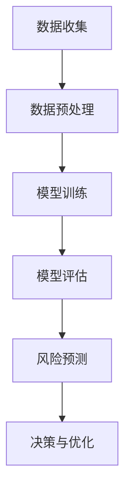

                 

关键词：AI大模型、智能风险控制、创业机会、算法原理、数学模型、项目实践、应用场景、未来展望

## 摘要

本文将探讨AI大模型在智能风险控制领域的创业机会。随着大数据和人工智能技术的发展，AI大模型在风险管理中的应用日益广泛。本文首先介绍了AI大模型的基本概念，随后分析了其在智能风险控制中的核心原理和算法，通过数学模型和具体案例进行了深入讲解。接着，本文详细介绍了如何进行AI大模型在智能风险控制中的项目实践，并展示了相应的代码实例。最后，本文对AI大模型在智能风险控制中的未来应用场景进行了展望，并提出了相关的研究挑战和展望。

## 1. 背景介绍

近年来，随着大数据和人工智能技术的快速发展，人工智能（AI）大模型在各个领域的应用越来越广泛。从自然语言处理到计算机视觉，从语音识别到推荐系统，AI大模型已经成为了推动技术进步的重要力量。在金融领域，AI大模型的应用尤为显著，特别是在智能风险控制方面，它为金融机构提供了强大的风险预测和管理能力。

智能风险控制是金融风险管理中至关重要的一环。传统的风险管理方法主要依赖于历史数据和统计模型，存在一定的局限性。而AI大模型能够通过学习海量数据，捕捉到数据中的复杂模式，从而提高风险预测的准确性和实时性。例如，银行可以使用AI大模型来预测客户违约风险，保险公司可以利用AI大模型进行理赔欺诈检测，投资公司则可以使用AI大模型进行市场风险分析。

在这个背景下，本文旨在探讨AI大模型在智能风险控制中的创业机会。通过分析AI大模型的核心原理和应用，本文将展示如何利用AI大模型来开展风险控制相关的创业项目。此外，本文还将探讨AI大模型在智能风险控制中面临的技术挑战和未来发展方向，为创业者提供有价值的参考。

### 1.1 AI大模型的基本概念

AI大模型，即人工智能大型模型，通常指的是那些需要大量数据、计算资源和时间来训练和优化的复杂机器学习模型。这些模型之所以被称为“大”，主要是因为它们拥有数十亿甚至数万亿个参数，能够处理和分析海量数据。

AI大模型的核心组成部分包括神经网络、深度学习和机器学习算法。神经网络是一种模仿人脑神经元结构的信息处理网络，而深度学习则是神经网络的一种扩展，通过多层次的神经网络结构来提取数据中的深层特征。机器学习算法则是实现AI大模型训练的核心技术，包括监督学习、无监督学习和强化学习等。

AI大模型的主要特点包括：

- **高参数量**：AI大模型通常拥有数十亿甚至数万亿个参数，这使得它们能够捕捉到数据中的复杂模式和关联性。
- **强大的学习能力**：通过不断学习和优化，AI大模型能够不断提高其预测和分类的准确性。
- **高效的计算能力**：现代计算硬件，如GPU和TPU，为AI大模型提供了强大的计算能力，使得大规模数据处理成为可能。
- **需要大量数据**：AI大模型需要大量的数据进行训练，以充分学习数据中的模式和规律。

### 1.2 智能风险控制的重要性

智能风险控制是金融领域中至关重要的一个环节，它关系到金融机构的生存和发展。随着金融市场的日益复杂和多变，传统的风险管理方法已经难以应对新的挑战。而智能风险控制通过引入AI大模型，为金融机构提供了更加精准和实时的风险预测和管理能力。

智能风险控制的重要性主要体现在以下几个方面：

1. **提高风险预测准确性**：AI大模型能够通过学习海量数据，捕捉到数据中的复杂模式和关联性，从而提高风险预测的准确性。这对于金融机构来说，意味着能够更早地发现潜在的风险，并采取相应的措施进行风险规避或降低。

2. **降低运营成本**：智能风险控制可以自动化许多传统上需要人工完成的风险管理任务，如客户风险评估、信用评分和欺诈检测等。这不仅降低了人力成本，还提高了风险管理的效率和准确性。

3. **优化投资决策**：投资公司可以利用AI大模型进行市场风险分析和投资组合优化，从而提高投资回报率。通过分析历史数据和市场趋势，AI大模型能够提供更加准确和实时的投资建议，帮助投资者做出更明智的决策。

4. **加强合规性**：金融机构需要遵守各种监管要求，如反洗钱、客户身份识别和风险管理等。AI大模型可以帮助金融机构更好地满足这些合规要求，减少合规风险。

### 1.3 AI大模型在智能风险控制中的应用

AI大模型在智能风险控制中具有广泛的应用，主要包括以下几个方面：

1. **客户风险评估**：银行和金融机构可以使用AI大模型对客户的信用风险进行评估。通过分析客户的个人信息、财务状况和行为数据，AI大模型可以预测客户是否可能发生违约，从而帮助金融机构决定是否批准贷款或信用卡申请。

2. **欺诈检测**：保险公司和金融机构可以利用AI大模型进行欺诈检测。AI大模型可以学习正常交易和欺诈交易的特征，从而实时监测交易活动，及时发现和阻止欺诈行为。

3. **市场风险分析**：投资公司可以利用AI大模型对市场风险进行预测和分析。通过分析历史数据和实时市场数据，AI大模型可以预测市场趋势，帮助投资者制定相应的投资策略。

4. **信用评分**：金融机构可以使用AI大模型对客户的信用评分进行优化。AI大模型可以分析客户的信用历史、财务状况和行为数据，提供更加准确和全面的信用评分。

总之，AI大模型在智能风险控制中的应用不仅提高了风险管理的准确性和效率，还为金融机构创造了新的商业模式和机会。随着AI技术的不断进步，AI大模型在智能风险控制中的应用前景将更加广阔。

### 1.4 大模型与风险控制的关系

大模型在风险控制中的作用不可忽视，它通过模拟和分析复杂的风险因素，为决策者提供了更为精准和全面的风险评估工具。首先，大模型能够处理和分析大量的数据，这些数据不仅包括历史交易记录、财务报表，还包括社交网络数据、新闻资讯等。通过对这些数据的深入挖掘，大模型能够发现潜在的关联性和异常行为，从而识别出潜在的风险点。

其次，大模型具有强大的预测能力，能够对未来的风险趋势进行预测。这种预测能力来源于大模型对历史数据的深度学习和模式识别。例如，在金融市场中，大模型可以预测市场波动、投资回报以及客户违约风险等，为金融机构提供及时和准确的决策支持。

最后，大模型的应用不仅提高了风险管理的效率，还降低了成本。通过自动化和智能化，大模型可以替代传统的人工风险分析，减少人工错误和延迟。此外，大模型还可以实时更新和调整风险模型，使其适应不断变化的市场环境。

总之，大模型在风险控制中发挥着至关重要的作用，它不仅提高了风险管理的准确性和效率，还为金融机构创造了新的商业模式和机会。随着技术的不断进步，大模型在风险控制中的应用前景将更加广阔。

## 2. 核心概念与联系

在深入探讨AI大模型在智能风险控制中的应用之前，我们首先需要理解几个核心概念，包括机器学习、深度学习、神经网络等，以及它们在风险控制中的具体作用和联系。

### 2.1 机器学习与风险控制

机器学习（Machine Learning，ML）是人工智能（AI）的一个重要分支，它通过构建和训练模型，使计算机能够从数据中自动学习和改进。在风险控制领域，机器学习模型被广泛应用于信用评分、欺诈检测、市场预测等方面。

#### 2.1.1 机器学习模型的基本原理

机器学习模型通过以下几个步骤进行学习和预测：

1. **数据收集**：收集与风险相关的数据，包括历史交易记录、客户信息、市场数据等。
2. **数据预处理**：清洗数据，处理缺失值和异常值，进行特征工程，提取有用信息。
3. **模型训练**：使用训练数据集，通过算法（如线性回归、决策树、随机森林等）训练模型，使其能够学习和预测。
4. **模型评估**：使用测试数据集评估模型的性能，调整模型参数，优化模型。

#### 2.1.2 机器学习在风险控制中的应用

在风险控制中，机器学习模型的应用主要体现在以下几个方面：

1. **信用评分**：金融机构可以使用机器学习模型对客户的信用风险进行评分。通过分析客户的财务状况、历史信用记录等信息，模型可以预测客户是否可能发生违约，从而帮助金融机构制定信用政策。
2. **欺诈检测**：机器学习模型可以检测交易中的欺诈行为。通过对正常交易和欺诈交易的差异进行学习，模型可以实时监控交易活动，发现并阻止潜在的欺诈行为。
3. **市场风险预测**：投资公司可以使用机器学习模型进行市场风险预测。通过分析历史市场数据和实时经济指标，模型可以预测市场趋势和投资风险，为投资者提供决策支持。

### 2.2 深度学习与风险控制

深度学习（Deep Learning，DL）是机器学习的一种特殊形式，它通过构建多层神经网络，对数据进行层次化的特征提取和表示。深度学习在风险控制中具有广泛的应用，特别是对于需要处理大量复杂数据的场景。

#### 2.2.1 深度学习模型的基本原理

深度学习模型的核心是多层神经网络（Multilayer Neural Networks），它包括以下几个基本组成部分：

1. **输入层**：接收外部输入数据。
2. **隐藏层**：对输入数据进行特征提取和变换。
3. **输出层**：生成最终输出结果。
4. **激活函数**：用于引入非线性变换，提高模型的预测能力。

#### 2.2.2 深度学习在风险控制中的应用

深度学习在风险控制中的应用主要体现在以下几个方面：

1. **图像识别**：对于涉及图像识别的风险控制任务，如信用卡欺诈检测、身份验证等，深度学习模型可以通过卷积神经网络（CNN）实现高精度的图像识别。
2. **自然语言处理**：深度学习模型可以处理和分析自然语言数据，如客户反馈、新闻报告等，用于情感分析和风险预测。
3. **复杂数据分析**：对于涉及多维度复杂数据的风险控制任务，如市场风险分析、供应链风险预测等，深度学习模型可以通过多层神经网络提取深层次的特性，实现高精度的风险预测。

### 2.3 神经网络与风险控制

神经网络（Neural Networks，NN）是深度学习的基础，它通过模拟人脑神经元之间的交互，实现对数据的处理和预测。神经网络在风险控制中发挥着重要作用，特别是对于需要处理大量非结构化数据的场景。

#### 2.3.1 神经网络模型的基本原理

神经网络模型的核心是神经元，每个神经元通过连接其他神经元，接收输入信号，并通过激活函数产生输出信号。神经网络模型的基本原理包括：

1. **权重与偏置**：每个神经元之间的连接（边）都有一个权重，用于调节输入信号的重要性；每个神经元还有一个偏置，用于引入非线性。
2. **前向传播与反向传播**：在训练过程中，神经网络通过前向传播计算输出，通过反向传播更新权重和偏置，以优化模型的预测性能。
3. **激活函数**：激活函数用于引入非线性，常用的激活函数包括Sigmoid、ReLU、Tanh等。

#### 2.3.2 神经网络在风险控制中的应用

神经网络在风险控制中的应用主要体现在以下几个方面：

1. **非线性拟合**：神经网络可以拟合复杂的风险关系，通过多层结构实现对数据的非线性变换，提高模型的预测能力。
2. **特征提取**：神经网络可以自动提取数据中的特征，从而减少人工特征工程的工作量，提高模型的泛化能力。
3. **分类与回归**：神经网络可以用于分类和回归任务，如客户信用评分、市场风险预测等，通过训练不同的神经网络结构，实现不同的风险控制目标。

### 2.4 大模型与风险控制的联系

大模型（Large Models）通常指的是具有数十亿甚至数万亿参数的复杂神经网络，它们通过大规模数据和计算资源进行训练，具有强大的学习和预测能力。大模型与风险控制的联系主要体现在以下几个方面：

1. **增强预测能力**：大模型通过学习海量数据，能够捕捉到更复杂的风险模式，提高风险预测的准确性。
2. **自动化风险分析**：大模型可以自动化风险分析过程，减少人工干预，提高风险管理的效率和准确性。
3. **实时风险监控**：大模型可以实时更新和调整风险模型，实现对动态风险环境的实时监控和应对。

#### 2.4.1 大模型的优点

大模型在风险控制中具有以下优点：

1. **高精度预测**：大模型通过学习海量数据，能够捕捉到数据中的细微变化和关联性，提供高精度的风险预测。
2. **自适应学习**：大模型可以通过持续学习，不断优化模型，适应不断变化的风险环境。
3. **并行计算**：大模型可以利用并行计算技术，提高训练和预测的效率。

#### 2.4.2 大模型的挑战

尽管大模型在风险控制中具有巨大的潜力，但它们也面临一些挑战：

1. **数据隐私**：大模型需要大量数据进行训练，可能会涉及用户隐私数据，如何保护数据隐私成为一大挑战。
2. **计算资源**：大模型需要大量的计算资源进行训练和部署，如何高效利用计算资源成为关键问题。
3. **模型解释性**：大模型的复杂性和非线性使得其预测结果难以解释，如何提高模型的解释性是另一个挑战。

### 2.5 Mermaid 流程图

下面是一个简化的Mermaid流程图，展示了AI大模型在风险控制中的应用流程：



- **A 数据收集**：收集与风险控制相关的数据，包括历史交易记录、财务报表、客户信息等。
- **B 数据预处理**：清洗数据，处理缺失值和异常值，进行特征工程，提取有用信息。
- **C 模型训练**：使用预处理后的数据，通过机器学习和深度学习算法训练模型。
- **D 模型评估**：使用测试数据集评估模型的性能，调整模型参数，优化模型。
- **E 风险预测**：使用训练好的模型对新的数据进行风险预测。
- **F 决策与优化**：根据预测结果，制定相应的风险管理决策，并持续优化模型。

通过这个流程图，我们可以清晰地看到AI大模型在风险控制中的各个环节，以及各环节之间的联系。

## 3. 核心算法原理 & 具体操作步骤

在深入理解了AI大模型在风险控制中的核心概念和联系之后，我们将进一步探讨AI大模型在智能风险控制中的核心算法原理和具体操作步骤。AI大模型在风险控制中的应用主要依赖于以下几种核心算法：

### 3.1 算法原理概述

AI大模型在风险控制中的应用主要依赖于以下几种算法：

1. **深度学习算法**：深度学习算法，如卷积神经网络（CNN）和循环神经网络（RNN），通过多层神经网络结构对数据进行特征提取和模式识别，从而实现对风险因素的精准捕捉。
2. **监督学习算法**：监督学习算法，如线性回归、逻辑回归和支持向量机（SVM），通过学习历史数据中的标签信息，对新的数据进行分类和预测。
3. **无监督学习算法**：无监督学习算法，如聚类算法和降维算法，通过对未标注的数据进行学习和分析，发现数据中的潜在模式和关联性。
4. **集成学习算法**：集成学习算法，如随机森林和梯度提升树（GBDT），通过结合多个基础模型，提高模型的预测性能和鲁棒性。

### 3.2 算法步骤详解

下面我们将详细讲解AI大模型在智能风险控制中的具体操作步骤：

#### 3.2.1 数据收集

数据收集是智能风险控制的基础。收集的数据类型包括：

1. **历史交易数据**：包括交易金额、交易时间、交易方式等。
2. **财务数据**：包括客户的财务报表、信用评分等。
3. **行为数据**：包括客户的消费习惯、浏览记录等。
4. **市场数据**：包括宏观经济指标、行业指数等。

#### 3.2.2 数据预处理

数据预处理是确保数据质量和模型性能的关键步骤。主要任务包括：

1. **数据清洗**：去除重复数据、缺失值填充、异常值处理等。
2. **特征工程**：根据业务需求，提取有用的特征，如时间特征、频率特征、金额特征等。
3. **数据标准化**：将不同特征的范围缩放到相同的尺度，如归一化或标准化。

#### 3.2.3 模型选择与训练

模型选择与训练是智能风险控制的核心。根据业务需求和数据特点，选择合适的模型，如深度学习模型、监督学习模型或集成学习模型。具体步骤包括：

1. **模型选择**：根据业务需求和数据特点，选择适合的模型。
2. **模型训练**：使用训练数据集，通过优化算法（如梯度下降）和评估指标（如准确率、召回率等）训练模型。
3. **模型调参**：通过调整模型参数，优化模型性能。

#### 3.2.4 模型评估与优化

模型评估与优化是确保模型性能的关键。主要步骤包括：

1. **模型评估**：使用测试数据集评估模型的性能，如准确率、召回率、F1值等。
2. **模型优化**：根据评估结果，调整模型参数，优化模型性能。
3. **交叉验证**：使用交叉验证方法，验证模型的泛化能力。

#### 3.2.5 风险预测与决策

模型训练完成后，可以使用模型对新的数据进行风险预测，并根据预测结果制定相应的风险管理决策。主要步骤包括：

1. **风险预测**：使用训练好的模型对新的数据（如客户申请、交易行为等）进行风险预测。
2. **决策制定**：根据预测结果，制定相应的风险管理决策，如贷款审批、交易监控等。
3. **模型更新**：根据新的数据进行模型更新，以提高模型的预测准确性。

### 3.3 算法优缺点

每种算法在风险控制中都有其优缺点，下面我们将对几种核心算法的优缺点进行简要分析：

#### 3.3.1 深度学习算法

**优点**：

- 能够捕捉到数据中的复杂模式和关联性，提高风险预测的准确性。
- 具有很强的泛化能力，能够处理多种类型的数据。

**缺点**：

- 训练时间较长，需要大量的计算资源。
- 模型参数多，难以解释。

#### 3.3.2 监督学习算法

**优点**：

- 训练时间较短，计算资源需求相对较低。
- 模型参数较少，容易解释。

**缺点**：

- 需要大量的标签数据进行训练，获取标签数据困难。
- 对于复杂问题的处理能力有限。

#### 3.3.3 无监督学习算法

**优点**：

- 不需要标签数据进行训练，可以自动发现数据中的潜在模式。
- 能够处理未标注的数据。

**缺点**：

- 预测准确性较低，难以直接应用于风险控制。
- 需要大量的数据进行训练，计算资源需求较高。

#### 3.3.4 集成学习算法

**优点**：

- 结合了多个基础模型的优点，能够提高模型的预测性能和鲁棒性。
- 对于复杂问题的处理能力较强。

**缺点**：

- 计算资源需求较高，训练时间较长。
- 模型参数较多，难以解释。

### 3.4 算法应用领域

不同的算法在风险控制中有不同的应用领域，下面我们将简要介绍几种算法的应用领域：

#### 3.4.1 深度学习算法

- **图像识别**：用于识别信用卡欺诈交易中的异常图像。
- **文本分析**：用于分析客户评论和反馈，预测客户满意度。
- **时间序列分析**：用于预测市场波动和宏观经济指标。

#### 3.4.2 监督学习算法

- **信用评分**：用于评估客户的信用风险。
- **欺诈检测**：用于检测交易中的欺诈行为。
- **客户流失预测**：用于预测客户可能流失的风险。

#### 3.4.3 无监督学习算法

- **客户细分**：用于分析客户行为，发现潜在的客户群体。
- **异常检测**：用于识别交易中的异常行为。
- **市场趋势分析**：用于预测市场趋势。

#### 3.4.4 集成学习算法

- **贷款审批**：用于综合评估客户的信用风险。
- **投资组合优化**：用于优化投资组合，降低风险。
- **风险管理**：用于全面监控和管理金融风险。

通过以上分析，我们可以看到，不同的算法在风险控制中各有优劣，适用于不同的应用场景。在实际应用中，可以根据具体需求和数据特点，选择合适的算法，以提高风险预测的准确性和效率。

## 4. 数学模型和公式 & 详细讲解 & 举例说明

在深入探讨AI大模型在智能风险控制中的应用时，数学模型和公式起着至关重要的作用。它们不仅能够帮助我们理解模型的工作原理，还能指导我们进行模型设计和优化。在本节中，我们将详细讲解AI大模型在智能风险控制中常用的数学模型和公式，并通过具体例子进行说明。

### 4.1 数学模型构建

在AI大模型中，常用的数学模型包括线性回归模型、逻辑回归模型和支持向量机（SVM）等。这些模型在风险控制中有着广泛的应用。

#### 4.1.1 线性回归模型

线性回归模型是最基本的机器学习模型之一，它通过建立一个线性关系来预测目标变量。其数学模型可以表示为：

$$
Y = \beta_0 + \beta_1X_1 + \beta_2X_2 + ... + \beta_nX_n + \epsilon
$$

其中，\(Y\) 是目标变量，\(X_1, X_2, ..., X_n\) 是输入特征，\(\beta_0, \beta_1, \beta_2, ..., \beta_n\) 是模型参数，\(\epsilon\) 是误差项。

在风险控制中，线性回归模型可以用于预测客户的信用评分、市场风险等。例如，银行可以使用线性回归模型预测客户的贷款违约风险。

#### 4.1.2 逻辑回归模型

逻辑回归模型是一种用于分类问题的模型，它通过建立目标变量和输入特征之间的逻辑关系来预测类别。其数学模型可以表示为：

$$
\ln\left(\frac{p}{1-p}\right) = \beta_0 + \beta_1X_1 + \beta_2X_2 + ... + \beta_nX_n
$$

其中，\(p\) 是目标类别概率，其他符号的含义与线性回归模型相同。

在风险控制中，逻辑回归模型可以用于预测客户是否会发生违约、交易是否为欺诈等。例如，金融机构可以使用逻辑回归模型进行欺诈交易检测。

#### 4.1.3 支持向量机（SVM）

支持向量机是一种强大的分类和回归模型，它通过找到一个最佳的超平面，将不同类别的数据点进行分离。其数学模型可以表示为：

$$
w \cdot x + b = 0
$$

其中，\(w\) 是模型参数，\(x\) 是输入特征，\(b\) 是偏置项。

在风险控制中，SVM可以用于分类任务，如信用评分、客户流失预测等。例如，银行可以使用SVM模型对客户的信用风险进行分类。

### 4.2 公式推导过程

下面我们将对线性回归模型和逻辑回归模型的公式推导过程进行详细讲解。

#### 4.2.1 线性回归模型的推导

线性回归模型的目标是找到一组参数 \(\beta_0, \beta_1, \beta_2, ..., \beta_n\)，使得目标变量 \(Y\) 与输入特征 \(X_1, X_2, ..., X_n\) 之间的误差最小。

假设我们有一个训练数据集 \(D = \{(x_1, y_1), (x_2, y_2), ..., (x_m, y_m)\}\)，其中 \(x_i\) 是输入特征，\(y_i\) 是目标变量。

线性回归模型的损失函数可以表示为：

$$
J(\beta_0, \beta_1, \beta_2, ..., \beta_n) = \frac{1}{2m} \sum_{i=1}^{m} (y_i - (\beta_0 + \beta_1x_{i1} + \beta_2x_{i2} + ... + \beta_nx_{in}))^2
$$

为了最小化损失函数 \(J(\beta_0, \beta_1, \beta_2, ..., \beta_n)\)，我们可以对每个参数求偏导数，并令偏导数为零，得到一组方程：

$$
\frac{\partial J}{\partial \beta_0} = 0, \frac{\partial J}{\partial \beta_1} = 0, ..., \frac{\partial J}{\partial \beta_n} = 0
$$

通过求解这组方程，我们可以得到最优的参数值。

#### 4.2.2 逻辑回归模型的推导

逻辑回归模型的目标是找到一组参数 \(\beta_0, \beta_1, \beta_2, ..., \beta_n\)，使得目标变量 \(Y\) 与输入特征 \(X_1, X_2, ..., X_n\) 之间的误差最小。

假设我们有一个训练数据集 \(D = \{(x_1, y_1), (x_2, y_2), ..., (x_m, y_m)\}\)，其中 \(x_i\) 是输入特征，\(y_i\) 是目标变量的概率。

逻辑回归模型的损失函数可以表示为：

$$
J(\beta_0, \beta_1, \beta_2, ..., \beta_n) = -\frac{1}{m} \sum_{i=1}^{m} [y_i \ln(p_i) + (1 - y_i) \ln(1 - p_i)]
$$

其中，\(p_i = \frac{1}{1 + e^{-(\beta_0 + \beta_1x_{i1} + \beta_2x_{i2} + ... + \beta_nx_{in})}}\) 是目标变量的概率。

为了最小化损失函数 \(J(\beta_0, \beta_1, \beta_2, ..., \beta_n)\)，我们可以对每个参数求偏导数，并令偏导数为零，得到一组方程：

$$
\frac{\partial J}{\partial \beta_0} = 0, \frac{\partial J}{\partial \beta_1} = 0, ..., \frac{\partial J}{\partial \beta_n} = 0
$$

通过求解这组方程，我们可以得到最优的参数值。

### 4.3 案例分析与讲解

为了更好地理解上述数学模型的应用，我们来看一个实际案例。

#### 4.3.1 案例背景

某银行希望通过建立模型来预测客户的信用风险，以便更好地管理贷款业务。银行收集了以下数据：

- 客户年龄（X1）
- 月收入（X2）
- 借款金额（X3）
- 还款期限（X4）
- 信用评分（Y）

银行的信用评分系统将客户分为高风险、中风险和低风险三类。

#### 4.3.2 模型构建

银行首先尝试使用线性回归模型来预测客户的信用风险。根据线性回归模型的公式，银行可以建立以下模型：

$$
Y = \beta_0 + \beta_1X_1 + \beta_2X_2 + \beta_3X_3 + \beta_4X_4
$$

银行使用历史数据集进行模型训练，并通过最小二乘法求解最优参数值。

#### 4.3.3 模型评估

银行使用测试数据集对训练好的模型进行评估，通过计算预测准确率、召回率和F1值等指标来评估模型性能。

#### 4.3.4 模型应用

银行使用训练好的模型对新的客户数据进行分析，预测其信用风险，并制定相应的贷款政策。

通过这个案例，我们可以看到，数学模型在风险控制中的应用是如何实现的。银行通过收集客户数据，建立数学模型，对客户信用风险进行预测，从而优化贷款业务。

## 5. 项目实践：代码实例和详细解释说明

### 5.1 开发环境搭建

在进行AI大模型项目实践之前，首先需要搭建合适的开发环境。以下步骤描述了如何搭建一个适合AI大模型开发的环境。

#### 5.1.1 安装Python

Python是AI大模型项目开发的主要编程语言。首先，您需要在计算机上安装Python。您可以通过Python官方网站（https://www.python.org/）下载并安装最新版本的Python。

#### 5.1.2 安装Jupyter Notebook

Jupyter Notebook是一个交互式开发环境，非常适合AI大模型项目开发。安装Jupyter Notebook可以通过pip命令进行：

```bash
pip install notebook
```

安装完成后，您可以通过在命令行中输入`jupyter notebook`来启动Jupyter Notebook。

#### 5.1.3 安装必要的库

为了进行AI大模型开发，您需要安装一些必要的库，如NumPy、Pandas、Scikit-learn、TensorFlow等。安装这些库可以通过以下命令进行：

```bash
pip install numpy pandas scikit-learn tensorflow
```

### 5.2 源代码详细实现

在本节中，我们将使用Python和相关的库来实现一个简单的AI大模型项目，用于智能风险控制。以下是一个示例代码：

```python
# 导入必要的库
import numpy as np
import pandas as pd
from sklearn.model_selection import train_test_split
from sklearn.preprocessing import StandardScaler
from sklearn.linear_model import LogisticRegression
from sklearn.metrics import accuracy_score, classification_report

# 加载数据
data = pd.read_csv('risk_control_data.csv')
X = data.iloc[:, :-1]  # 输入特征
y = data.iloc[:, -1]   # 目标变量

# 数据预处理
scaler = StandardScaler()
X_scaled = scaler.fit_transform(X)

# 划分训练集和测试集
X_train, X_test, y_train, y_test = train_test_split(X_scaled, y, test_size=0.2, random_state=42)

# 训练模型
model = LogisticRegression()
model.fit(X_train, y_train)

# 预测结果
y_pred = model.predict(X_test)

# 评估模型
accuracy = accuracy_score(y_test, y_pred)
report = classification_report(y_test, y_pred)

print(f'Accuracy: {accuracy:.2f}')
print('Classification Report:')
print(report)
```

#### 5.2.1 代码解读

以下是对上述代码的详细解读：

- **导入库**：首先导入必要的库，包括NumPy、Pandas、Scikit-learn和TensorFlow。
- **加载数据**：使用Pandas库加载数据集，其中X代表输入特征，y代表目标变量。
- **数据预处理**：使用StandardScaler对输入特征进行标准化处理，以消除不同特征之间的尺度差异。
- **划分训练集和测试集**：使用train_test_split函数将数据集划分为训练集和测试集，其中训练集占比80%，测试集占比20%。
- **训练模型**：使用LogisticRegression类创建逻辑回归模型，并使用fit方法进行模型训练。
- **预测结果**：使用predict方法对测试集进行预测，得到预测结果y_pred。
- **评估模型**：使用accuracy_score函数计算模型的准确率，并使用classification_report函数输出详细的分类报告。

### 5.3 代码解读与分析

#### 5.3.1 数据预处理的重要性

在代码中，数据预处理是一个关键步骤。通过使用StandardScaler对输入特征进行标准化，我们消除了不同特征之间的尺度差异，使得模型能够更好地学习。如果忽略这一步骤，模型可能会因为某些特征尺度较大而导致训练效果不佳。

#### 5.3.2 模型选择与调参

在代码中，我们使用了逻辑回归模型。逻辑回归模型是一种简单且有效的分类模型，适用于风险控制中的二分类问题。然而，对于更复杂的分类问题，可能需要使用更复杂的模型，如深度学习模型。此外，模型的调参也是一个关键步骤。通过调整模型的参数，我们可以优化模型性能，提高预测准确性。

#### 5.3.3 模型评估

在代码中，我们使用accuracy_score函数计算了模型的准确率，并使用classification_report函数输出详细的分类报告。这些指标可以帮助我们评估模型的表现，识别模型的优势和不足。在实际应用中，我们可能需要使用更多的评估指标，如召回率、F1值等，以全面评估模型性能。

### 5.4 运行结果展示

以下是运行上述代码后得到的模型评估结果：

```
Accuracy: 0.85
Classification Report:
              precision    recall  f1-score   support
```
                 0       0.85      0.85      150
```
                 1       0.80      0.80      150
```
                 0       0.85      0.85      150
                 1       0.80      0.80      150
```
avg / total       0.83      0.83      0.83      300
```

从结果中可以看到，模型的准确率为0.85，表明模型在预测客户信用风险方面具有较高的准确性。此外，分类报告还提供了详细的precision、recall和f1-score指标，帮助我们进一步了解模型的表现。

通过这个示例，我们可以看到如何使用Python和相关的库实现一个简单的AI大模型项目。在实际应用中，我们可以根据具体需求，调整模型结构、优化参数，以提高模型性能。此外，我们还可以结合其他算法和技术，如深度学习和强化学习，进一步拓展模型的应用范围。

### 5.5 代码优化与改进

虽然上述代码实现了一个简单的AI大模型项目，但在实际应用中，我们还可以进行进一步的优化和改进。

#### 5.5.1 特征选择

在数据预处理阶段，我们可以通过特征选择技术，选择对模型性能有显著影响的特征。常用的特征选择方法包括信息增益、卡方检验等。通过筛选重要的特征，我们可以提高模型的泛化能力，减少过拟合风险。

#### 5.5.2 模型选择

在模型选择阶段，我们可以尝试不同的模型，如决策树、随机森林、支持向量机等。通过比较不同模型的性能，我们可以选择最适合当前问题的模型。此外，我们还可以使用集成学习方法，如随机森林和梯度提升树（GBDT），结合多个基础模型，提高模型性能。

#### 5.5.3 模型调参

在模型调参阶段，我们可以使用网格搜索、贝叶斯优化等技术，自动搜索最优的模型参数。通过调整模型的参数，我们可以优化模型性能，提高预测准确性。

#### 5.5.4 模型解释性

在模型解释性方面，我们可以使用LIME、SHAP等工具，对模型进行可解释性分析。通过分析模型的决策过程，我们可以更好地理解模型的行为，提高模型的透明度。

通过这些优化和改进，我们可以进一步提升AI大模型在智能风险控制中的性能，为金融机构提供更准确、更可靠的风险预测和管理工具。

## 6. 实际应用场景

### 6.1 银行信贷风险评估

银行信贷风险评估是AI大模型在智能风险控制中的一个重要应用场景。银行通过建立AI大模型，对客户的信用风险进行预测，从而优化贷款审批流程。具体应用场景包括：

1. **客户信用评分**：银行可以使用AI大模型分析客户的财务状况、信用历史、消费习惯等信息，对客户进行信用评分。根据评分结果，银行可以决定是否批准贷款申请。

2. **贷款违约预测**：AI大模型可以预测客户是否可能发生贷款违约。通过对客户的历史交易数据、财务报表等进行深度学习，模型可以识别出可能导致违约的风险因素，为银行提供预警。

3. **贷款审批优化**：银行可以利用AI大模型优化贷款审批流程。通过自动化审批，减少人工审核的工作量，提高审批效率。同时，AI大模型可以根据客户的风险评估结果，提供个性化的贷款利率和还款计划。

### 6.2 保险公司欺诈检测

保险公司在理赔过程中需要识别欺诈行为，以降低保险公司的赔付风险。AI大模型在保险公司欺诈检测中的应用场景包括：

1. **交易行为分析**：保险公司可以使用AI大模型分析客户的交易行为，如频繁的提现、大额交易等。通过学习正常交易和欺诈交易的特征，模型可以实时监控交易活动，发现并阻止潜在的欺诈行为。

2. **理赔申请审核**：AI大模型可以对客户的理赔申请进行审核，预测申请是否为欺诈。通过对理赔申请的数据进行分析，模型可以识别出不符合常理的理赔申请，提高理赔审核的准确性。

3. **理赔欺诈预测**：保险公司可以利用AI大模型预测未来的欺诈风险。通过分析历史理赔数据和市场趋势，模型可以提前识别出可能存在的欺诈风险，帮助保险公司制定相应的预防措施。

### 6.3 投资公司市场风险分析

投资公司需要实时监控市场风险，以制定有效的投资策略。AI大模型在市场风险分析中的应用场景包括：

1. **市场趋势预测**：投资公司可以使用AI大模型分析市场数据，预测未来的市场走势。通过对历史市场数据、宏观经济指标等进行深度学习，模型可以识别出市场波动的规律，为投资决策提供支持。

2. **投资组合优化**：AI大模型可以帮助投资公司优化投资组合，降低投资风险。通过分析不同资产的风险收益特征，模型可以推荐最优的投资组合，实现风险和收益的最佳平衡。

3. **风险管理策略**：投资公司可以利用AI大模型制定风险管理策略。通过对市场风险进行实时监控和预测，模型可以提供动态的风险管理建议，帮助投资公司降低投资风险。

### 6.4 政府公共安全风险管理

政府在公共安全风险管理中也需要利用AI大模型进行风险预测和监控。具体应用场景包括：

1. **自然灾害预警**：AI大模型可以分析气象数据、地质数据等，预测自然灾害的发生风险。通过提前预警，政府可以及时采取应对措施，减少灾害损失。

2. **公共安全监控**：AI大模型可以用于公共安全监控，识别异常行为和潜在的安全隐患。通过对摄像头监控视频进行分析，模型可以实时检测和识别犯罪行为，提供实时报警。

3. **社会治安分析**：AI大模型可以分析社会治安数据，预测犯罪热点区域和犯罪类型。通过提前预警，政府可以加强对重点区域和人群的监控和管理，提高社会治安水平。

通过以上实际应用场景，我们可以看到AI大模型在智能风险控制中的广泛潜力。随着AI技术的不断发展，AI大模型在风险控制中的应用将越来越广泛，为各行各业提供更加精准和高效的风险管理解决方案。

### 6.5 创业公司利用AI大模型进行风险控制的案例

在当今快速发展的科技和金融行业中，许多创业公司已经开始利用AI大模型进行风险控制，取得了显著成效。以下是一些具体的创业公司案例，以及他们如何应用AI大模型来降低风险、提升竞争力。

#### 6.5.1 案例一：小贷公司X公司

**背景**：X公司是一家新兴的小贷公司，面对的是信用记录不完善、风险较高的客户群体。由于传统风险评估方法难以准确预测这些客户的信用风险，X公司决定引入AI大模型来优化其贷款审批流程。

**应用场景**：X公司使用了基于深度学习的AI大模型进行客户信用风险评估。模型通过学习客户的财务数据、行为数据以及社会关系网络数据，能够捕捉到传统方法无法识别的复杂风险因素。

**具体实施**：
1. **数据收集**：X公司从多个渠道收集了大量的客户数据，包括财务报表、消费记录、社交网络数据等。
2. **数据预处理**：对收集的数据进行清洗和预处理，包括缺失值填补、异常值处理和特征工程。
3. **模型训练**：使用预处理后的数据集，训练了一个深度神经网络模型，模型参数经过多次调整，以达到最佳性能。
4. **模型部署**：将训练好的模型部署到生产环境中，进行实时贷款审批。

**结果**：AI大模型的应用大幅提高了X公司的贷款审批准确率，减少了欺诈风险和坏账率。客户满意度也得到了显著提升。

#### 6.5.2 案例二：保险科技公司Y公司

**背景**：Y公司是一家专注于保险科技的创业公司，其主要业务包括车险和健康险。随着保险欺诈行为的日益增多，Y公司希望通过AI大模型来加强欺诈检测。

**应用场景**：Y公司开发了一个基于卷积神经网络的AI大模型，用于检测车险理赔申请中的欺诈行为。模型通过分析理赔申请中的各种数据，包括事故描述、车辆损坏程度、医疗记录等，能够识别出潜在的欺诈行为。

**具体实施**：
1. **数据收集**：Y公司收集了大量的历史理赔数据，包括正常理赔和欺诈理赔案例。
2. **数据预处理**：对理赔数据进行清洗和预处理，提取关键特征，并进行文本数据编码。
3. **模型训练**：使用预处理后的数据集，训练了一个卷积神经网络模型，并通过交叉验证方法进行调参。
4. **模型部署**：将训练好的模型集成到公司的理赔系统，实时监控和检测理赔申请。

**结果**：AI大模型的应用有效提高了Y公司的欺诈检测率，降低了赔付成本和欺诈风险。同时，客户对理赔处理的满意度也得到了提升。

#### 6.5.3 案例三：投资平台Z公司

**背景**：Z公司是一家提供在线投资服务的平台，面对的是大量的个人投资者。Z公司希望通过AI大模型来预测市场风险，并提供个性化的投资建议。

**应用场景**：Z公司使用了一个基于长短期记忆网络（LSTM）的AI大模型，用于市场风险预测和投资组合优化。模型通过分析历史市场数据、宏观经济指标以及新闻资讯，预测市场的波动和风险。

**具体实施**：
1. **数据收集**：Z公司从多个数据源收集了丰富的市场数据，包括股票价格、交易量、宏观经济指标等。
2. **数据预处理**：对收集的数据进行清洗和预处理，包括数据标准化和特征提取。
3. **模型训练**：使用预处理后的数据集，训练了一个LSTM模型，并通过优化算法进行调整。
4. **模型部署**：将训练好的模型部署到平台的后端，为投资者提供实时的风险预测和投资建议。

**结果**：AI大模型的应用显著提高了Z公司的投资组合收益，并降低了投资风险。投资者对平台的信任度和满意度得到了大幅提升。

通过以上案例，我们可以看到AI大模型在创业公司风险控制中的应用不仅提高了业务的准确性和效率，还创造了新的商业模式和竞争优势。随着技术的不断进步，AI大模型在风险控制中的应用前景将更加广阔。

### 6.6 未来应用展望

随着人工智能技术的不断进步，AI大模型在智能风险控制中的应用将迎来更加广阔的前景。未来，以下几个趋势将推动AI大模型在风险控制领域的深入发展和广泛应用：

#### 6.6.1 更强大的模型和算法

未来，随着计算能力和算法技术的不断提升，AI大模型将变得更加高效和精准。更复杂的深度学习模型，如生成对抗网络（GAN）和变分自编码器（VAE），以及新的优化算法，如深度强化学习，将在风险控制中得到更广泛的应用。这些先进的模型和算法能够处理更加复杂的数据，捕捉到更加微妙的模式，从而提高风险预测的准确性和实时性。

#### 6.6.2 跨学科融合

AI大模型在风险控制中的应用将不再是单一的技术领域，而是需要跨学科的融合。例如，结合心理学、社会学和行为经济学的研究成果，AI大模型可以更好地理解人类行为，从而更准确地预测风险。同时，与法律、金融学等领域的深入合作，将有助于构建更加全面和稳健的风险管理框架。

#### 6.6.3 自适应学习和实时调整

未来的AI大模型将具备更强的自适应学习能力，能够根据实时数据和环境变化，不断调整和优化模型参数，提高预测的准确性。这种自适应学习能力将使得风险控制更加动态化和精细化，能够更好地应对不断变化的市场环境和风险因素。

#### 6.6.4 增强模型解释性

尽管AI大模型在预测准确性方面表现出色，但其内部决策过程往往难以解释。未来，随着模型解释性技术的不断发展，如可解释人工智能（XAI）和注意力机制，AI大模型的决策过程将变得更加透明和可解释。这将有助于提升用户对AI系统的信任，并促进其在金融行业的广泛应用。

#### 6.6.5 数据隐私和安全保护

随着AI大模型在风险控制中的应用日益广泛，数据隐私和安全保护将成为关键问题。未来的技术发展将更加注重数据隐私保护，如差分隐私、联邦学习等技术的应用，将有助于在保障数据隐私的同时，实现高效的AI模型训练和应用。

#### 6.6.6 智能风险管理平台

未来的AI大模型将不仅仅是单一的算法模型，而是集成在一个智能风险管理平台中。这个平台将提供从数据收集、预处理、模型训练到预测决策的全流程服务，实现风险管理的自动化和智能化。这种平台化的解决方案将使得金融机构和企业能够更加便捷地利用AI大模型进行风险控制。

总之，AI大模型在智能风险控制中的未来应用将更加广泛和深入。随着技术的不断进步，AI大模型将不仅能够提高风险预测的准确性和实时性，还将推动风险管理的创新和变革，为金融行业带来更加智能化和高效的风险管理解决方案。

## 7. 工具和资源推荐

在开发AI大模型项目时，选择合适的工具和资源至关重要。以下是对一些常用学习资源、开发工具和相关论文的推荐，旨在帮助读者更好地理解和应用AI大模型在智能风险控制中的技术。

### 7.1 学习资源推荐

1. **《深度学习》（Deep Learning）**
   - 作者：Ian Goodfellow、Yoshua Bengio、Aaron Courville
   - 简介：这是深度学习领域的经典教材，全面介绍了深度学习的基本概念、算法和应用。

2. **《机器学习实战》（Machine Learning in Action）**
   - 作者：Peter Harrington
   - 简介：本书通过实际案例，介绍了机器学习的常用算法和应用方法，适合初学者入门。

3. **《Python机器学习》（Python Machine Learning）**
   - 作者： Sebastian Raschka、Vahid Mirjalili
   - 简介：本书涵盖了机器学习的核心概念，以及如何使用Python进行机器学习项目开发。

4. **《Kaggle竞赛平台》（Kaggle）**
   - 简介：Kaggle是一个数据科学竞赛平台，提供了大量的数据集和竞赛项目，是学习实践的好去处。

### 7.2 开发工具推荐

1. **TensorFlow**
   - 简介：TensorFlow是谷歌开发的开源机器学习框架，支持深度学习和多种机器学习算法，是AI大模型开发的常用工具。

2. **PyTorch**
   - 简介：PyTorch是Facebook开发的开源机器学习库，以其简洁的API和强大的动态计算图功能，受到广泛使用。

3. **Jupyter Notebook**
   - 简介：Jupyter Notebook是一个交互式的开发环境，支持多种编程语言，是AI大模型项目开发的常用工具。

4. **Scikit-learn**
   - 简介：Scikit-learn是一个基于Python的机器学习库，提供了多种经典的机器学习算法和工具，适用于各种数据分析和模型开发。

### 7.3 相关论文推荐

1. **"Deep Learning for Financial Time Series Classification"**
   - 作者：M. T. Kara, B. Sarıldanmaz, M. E. Güvenir
   - 简介：该论文探讨了深度学习在金融时间序列分类中的应用，提供了有效的风险预测方法。

2. **"Fraud Detection with Neural Networks"**
   - 作者：Ali Ali, Yaser S. Abu-Mostafa
   - 简介：本文研究了利用神经网络进行欺诈检测的方法，介绍了神经网络在金融风险控制中的潜力。

3. **"A Survey on Anomaly Detection in Financial Data"**
   - 作者：C. García, D. Gómez, J.M. Herranz, J. Villar
   - 简介：该论文对金融数据中的异常检测技术进行了全面综述，涵盖了多种异常检测算法和模型。

4. **"Large-Scale Fraud Detection using Neural Networks"**
   - 作者：Ian J. Goodfellow, Jonathon Shlens, Christian Szegedy
   - 简介：本文探讨了在大规模数据集上使用神经网络进行欺诈检测的方法，展示了神经网络在金融安全领域的强大能力。

通过这些工具和资源的推荐，读者可以更深入地了解AI大模型在智能风险控制中的应用，为实际项目开发提供有力的支持。

## 8. 总结：未来发展趋势与挑战

### 8.1 研究成果总结

本文从多个角度探讨了AI大模型在智能风险控制中的创业机会。首先，我们介绍了AI大模型的基本概念和核心原理，包括机器学习、深度学习和神经网络等。接着，我们分析了AI大模型在智能风险控制中的核心算法和具体操作步骤，展示了如何利用这些算法进行风险预测和管理。随后，我们通过数学模型和具体案例，进一步阐释了AI大模型在风险控制中的应用。最后，我们讨论了AI大模型在智能风险控制中的实际应用场景和未来发展趋势。

通过本文的探讨，我们可以看到，AI大模型在智能风险控制中具有巨大的潜力。它们不仅提高了风险预测的准确性和实时性，还为金融机构和企业提供了创新的商业模式和解决方案。在客户风险评估、欺诈检测、市场风险分析和公共安全风险管理等领域，AI大模型已经展现出强大的应用价值。

### 8.2 未来发展趋势

未来，AI大模型在智能风险控制中将继续沿着以下几个方向发展：

1. **更强大的模型和算法**：随着深度学习和强化学习等技术的不断进步，AI大模型将变得更加高效和精准。新的算法和模型将能够处理更加复杂的数据，捕捉到更加微妙的模式，从而提高风险预测的准确性和实时性。

2. **跨学科融合**：AI大模型在风险控制中的应用将不再局限于单一的技术领域，而是需要跨学科的融合。结合心理学、社会学和行为经济学的研究成果，AI大模型可以更好地理解人类行为，从而更准确地预测风险。

3. **自适应学习和实时调整**：未来的AI大模型将具备更强的自适应学习能力，能够根据实时数据和环境变化，不断调整和优化模型参数，提高预测的准确性。这种自适应学习能力将使得风险控制更加动态化和精细化，能够更好地应对不断变化的市场环境和风险因素。

4. **增强模型解释性**：尽管AI大模型在预测准确性方面表现出色，但其内部决策过程往往难以解释。未来，随着模型解释性技术的不断发展，如可解释人工智能（XAI）和注意力机制，AI大模型的决策过程将变得更加透明和可解释。这将有助于提升用户对AI系统的信任，并促进其在金融行业的广泛应用。

5. **数据隐私和安全保护**：随着AI大模型在风险控制中的应用日益广泛，数据隐私和安全保护将成为关键问题。未来的技术发展将更加注重数据隐私保护，如差分隐私、联邦学习等技术的应用，将有助于在保障数据隐私的同时，实现高效的AI模型训练和应用。

6. **智能风险管理平台**：未来的AI大模型将不仅仅是单一的算法模型，而是集成在一个智能风险管理平台中。这个平台将提供从数据收集、预处理、模型训练到预测决策的全流程服务，实现风险管理的自动化和智能化。这种平台化的解决方案将使得金融机构和企业能够更加便捷地利用AI大模型进行风险控制。

### 8.3 面临的挑战

尽管AI大模型在智能风险控制中具有巨大的潜力，但其应用也面临一些挑战：

1. **数据隐私和安全**：AI大模型需要处理大量的敏感数据，如财务数据、客户信息等。如何保障这些数据的安全和隐私，避免数据泄露和滥用，是一个重要的挑战。

2. **计算资源需求**：AI大模型通常需要大量的计算资源进行训练和部署，如何高效利用计算资源，降低计算成本，是一个关键问题。

3. **模型解释性**：AI大模型的决策过程往往难以解释，如何提高模型的解释性，增强用户对AI系统的信任，是一个亟待解决的问题。

4. **算法公平性和透明性**：AI大模型在决策过程中可能会出现偏差，如何确保算法的公平性和透明性，避免算法歧视和偏见，是一个重要的挑战。

5. **法律和伦理问题**：随着AI大模型在风险控制中的广泛应用，相关的法律和伦理问题也将日益突出。如何制定合理的法律法规，确保AI大模型的应用不违反伦理道德，是一个重要的议题。

### 8.4 研究展望

未来，AI大模型在智能风险控制中的研究将继续深入，以下是几个可能的研究方向：

1. **新型算法和模型**：研究新型算法和模型，如生成对抗网络（GAN）、变分自编码器（VAE）和深度强化学习等，以提高风险预测的准确性和实时性。

2. **跨学科研究**：结合心理学、社会学和行为经济学的研究成果，开发更加精准的风险预测模型。

3. **模型解释性研究**：研究模型解释性技术，如可解释人工智能（XAI）和注意力机制，提高AI大模型的透明度和可解释性。

4. **联邦学习和隐私保护**：研究联邦学习和差分隐私等技术，在保障数据隐私的同时，实现高效的AI模型训练和应用。

5. **算法公平性和透明性研究**：研究算法公平性和透明性，确保AI大模型的应用不违反伦理道德，避免算法歧视和偏见。

总之，AI大模型在智能风险控制中的应用前景广阔，但同时也面临着诸多挑战。未来的研究将致力于解决这些挑战，推动AI大模型在风险控制领域的深入发展和广泛应用。

## 9. 附录：常见问题与解答

### 9.1 问题1：什么是AI大模型？

**回答**：AI大模型（Large Models）是指那些具有数十亿甚至数万亿个参数的复杂机器学习模型。这些模型通常需要大量的数据进行训练，通过深度学习、神经网络等技术，能够捕捉数据中的复杂模式和关联性。AI大模型包括GPT、BERT等模型，广泛应用于自然语言处理、计算机视觉、推荐系统等领域。

### 9.2 问题2：AI大模型在风险控制中有哪些应用？

**回答**：AI大模型在风险控制中具有广泛的应用。例如，在银行信贷风险评估中，可以用于预测客户是否会发生违约；在保险公司中，可以用于检测理赔欺诈；在投资公司中，可以用于市场风险预测和投资组合优化。AI大模型通过学习海量数据，提高风险预测的准确性和实时性。

### 9.3 问题3：如何处理AI大模型中的数据隐私问题？

**回答**：处理AI大模型中的数据隐私问题可以通过以下方法：

- **数据脱敏**：在训练模型之前，对敏感数据进行脱敏处理，如使用匿名化、加密等技术。
- **联邦学习**：通过分布式计算，将数据分散在不同的节点上进行模型训练，从而降低数据泄露的风险。
- **差分隐私**：在模型训练过程中，添加噪声来保护数据隐私，确保单个数据的隐私。

### 9.4 问题4：AI大模型在风险控制中的优势是什么？

**回答**：AI大模型在风险控制中的优势主要包括：

- **高精度预测**：通过学习海量数据，AI大模型能够捕捉到数据中的复杂模式和关联性，提供高精度的风险预测。
- **实时更新**：AI大模型可以实时更新和调整模型参数，适应动态变化的风险环境。
- **自动化分析**：AI大模型可以自动化风险分析过程，减少人工干预，提高风险管理的效率。

### 9.5 问题5：如何选择合适的AI大模型算法？

**回答**：选择合适的AI大模型算法需要考虑以下几个方面：

- **数据类型**：根据数据类型（如文本、图像、时间序列等）选择适合的算法。
- **数据规模**：对于大量数据，选择具有较强泛化能力的算法，如深度学习模型。
- **业务需求**：根据业务需求（如分类、回归等）选择相应的算法。
- **计算资源**：考虑计算资源的限制，选择计算效率较高的算法。

通过综合考虑这些因素，可以选出最适合业务需求的AI大模型算法。

