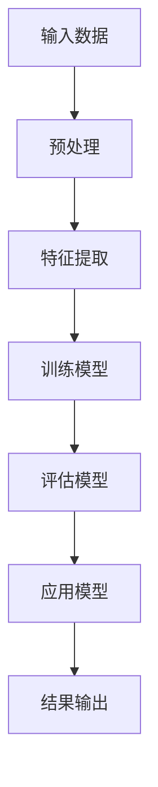

                 

关键词：人工智能，大模型，环保科技，深度学习，环保监测，智能优化，可持续能源

> 摘要：本文探讨了人工智能（AI）尤其是大模型技术在环保科技领域的创新应用，分析了其在环境监测、资源优化、可持续能源发展等方面的潜在价值。通过具体算法原理、数学模型、应用案例和未来展望，揭示了AI大模型在推动环保科技发展的巨大潜力。

## 1. 背景介绍

随着全球气候变化和环境恶化问题的日益严峻，环保科技领域亟需创新性技术的支持。传统的环境监测方法存在数据采集不全、处理效率低下等问题，无法满足现代环保科技的快速需求。近年来，人工智能（AI）技术的快速发展，尤其是大模型技术的出现，为解决这些问题提供了新的可能性。大模型（Large Models）是指具有数亿甚至数千亿参数的神经网络模型，具备处理复杂数据和提取深层次特征的能力。本文将重点探讨大模型在环保科技领域的创新应用，以期为相关研究和实践提供有益的参考。

## 2. 核心概念与联系

### 2.1 环保科技与AI大模型的联系

环保科技涉及多个领域，如环境监测、资源优化、能源管理等。AI大模型作为一种强大的数据处理和特征提取工具，可以广泛应用于这些领域，实现以下目标：

- **环境监测**：通过AI大模型对环境数据进行高效处理和分析，实现环境质量的实时监测和预测。
- **资源优化**：利用AI大模型优化资源利用效率，减少浪费，提高资源再生利用率。
- **能源管理**：通过AI大模型实现智能能源管理，提高可再生能源的利用率和能源系统的稳定性。

### 2.2 AI大模型的核心概念原理

AI大模型的核心是深度学习（Deep Learning），其基本原理是模拟人脑的神经网络结构，通过多层非线性变换来提取数据中的特征。大模型的特点包括：

- **参数规模巨大**：具有数亿至数千亿参数，能够处理大规模数据。
- **多层网络结构**：通过多层次的神经网络结构，实现数据的层次化特征提取。
- **自适应学习能力**：通过不断调整网络参数，实现数据的自适应学习和优化。

### 2.3 Mermaid流程图



在这个流程图中，输入数据经过预处理后，通过特征提取转化为模型可接受的格式。随后，通过多层神经网络结构进行训练和评估，最终将模型应用于实际问题，并输出结果。

## 3. 核心算法原理 & 具体操作步骤

### 3.1 算法原理概述

AI大模型在环保科技领域的关键算法是深度学习，特别是卷积神经网络（CNN）和递归神经网络（RNN）。CNN擅长处理图像和空间数据，RNN擅长处理序列数据和时序数据。这两种算法在大模型中结合，可以实现高效的环境数据处理和分析。

### 3.2 算法步骤详解

1. **数据收集与预处理**：收集环境数据，如温度、湿度、二氧化碳浓度等，并进行预处理，包括数据清洗、标准化和特征工程。
2. **特征提取**：使用CNN提取图像和空间特征，使用RNN提取时序特征。
3. **模型训练**：利用预处理后的数据训练大模型，通过反向传播算法调整模型参数。
4. **模型评估**：通过交叉验证和测试集评估模型性能，选择最优模型。
5. **模型应用**：将训练好的模型应用于实际问题，如环境监测和能源管理。

### 3.3 算法优缺点

**优点**：

- **强大的数据处理能力**：大模型可以处理大量复杂数据，提取深层次特征。
- **自适应学习能力**：通过不断调整参数，可以实现数据的自适应学习和优化。
- **跨领域应用**：大模型可以应用于环保科技的多个领域，如环境监测、资源优化、能源管理。

**缺点**：

- **计算资源需求大**：大模型需要大量的计算资源，训练和推理时间较长。
- **数据依赖性强**：模型的性能高度依赖于数据质量，数据不足或噪声数据会影响模型效果。
- **算法透明度低**：大模型的内部结构复杂，算法的透明度和解释性较低。

### 3.4 算法应用领域

- **环境监测**：通过AI大模型实现环境质量监测、预测和预警。
- **资源优化**：利用AI大模型优化水资源管理、废弃物处理和能源分配。
- **能源管理**：通过AI大模型实现智能电网管理和可再生能源优化。

## 4. 数学模型和公式 & 详细讲解 & 举例说明

### 4.1 数学模型构建

AI大模型的数学基础是深度学习，其核心是前向传播和反向传播算法。以下是简化的数学模型构建过程：

$$
\text{前向传播}: \quad z^{(l)} = W^{(l)} \cdot a^{(l-1)} + b^{(l)}
$$

$$
\text{反向传播}: \quad \delta^{(l)} = \frac{\partial J}{\partial z^{(l)}}
$$

其中，$z^{(l)}$是第$l$层的激活值，$W^{(l)}$和$b^{(l)}$分别是第$l$层的权重和偏置，$a^{(l-1)}$是前一层网络的输出，$J$是损失函数。

### 4.2 公式推导过程

假设我们有一个三层神经网络，包括输入层、隐藏层和输出层。首先，我们定义输入数据$x$，隐藏层激活值$a^{(1)}$和输出层激活值$a^{(2)}$。然后，通过前向传播计算输出层损失函数$J$：

$$
J = \frac{1}{2} \sum_{i=1}^{n} (\hat{y}^{(i)} - y^{(i)})^2
$$

其中，$\hat{y}^{(i)}$是预测输出，$y^{(i)}$是实际输出。

接下来，通过反向传播计算损失函数关于输入数据$x$的梯度：

$$
\delta^{(2)} = \frac{\partial J}{\partial z^{(2)}}
$$

$$
\delta^{(1)} = \frac{\partial J}{\partial z^{(1)}}
$$

通过链式法则和求导公式，我们可以得到：

$$
\delta^{(2)} = \frac{\partial J}{\partial z^{(2)}} = \frac{\partial J}{\partial a^{(2)}} \cdot \frac{\partial a^{(2)}}{\partial z^{(2)}} = \frac{\partial J}{\partial a^{(2)}} \cdot \sigma'(z^{(2)})
$$

$$
\delta^{(1)} = \frac{\partial J}{\partial z^{(1)}} = \frac{\partial J}{\partial a^{(1)}} \cdot \frac{\partial a^{(1)}}{\partial z^{(1)}} = \frac{\partial J}{\partial a^{(1)}} \cdot \sigma'(z^{(1)})
$$

其中，$\sigma'$是激活函数的导数。

### 4.3 案例分析与讲解

假设我们有一个包含10万条环境监测数据的神经网络模型，用于预测未来一周的空气质量。输入层有10个特征，包括PM2.5、PM10、SO2、NO2等。隐藏层有50个神经元，输出层有1个神经元，表示空气质量指数（AQI）。

1. **数据预处理**：将输入数据进行归一化处理，将输出数据进行标签编码。
2. **模型训练**：使用前向传播和反向传播算法训练模型，调整权重和偏置。
3. **模型评估**：使用交叉验证和测试集评估模型性能，选择最优模型。
4. **模型应用**：将训练好的模型应用于实际环境监测，预测未来一周的空气质量。

通过这个案例，我们可以看到数学模型在大模型应用中的关键作用。数学模型不仅用于计算损失函数和梯度，还为模型训练提供了理论基础，使得AI大模型能够高效地处理和分析复杂的环境数据。

## 5. 项目实践：代码实例和详细解释说明

### 5.1 开发环境搭建

1. **硬件环境**：安装GPU加速器，如NVIDIA Tesla V100。
2. **软件环境**：安装Python、TensorFlow、Keras等深度学习框架。
3. **数据集**：从环境监测网站下载历史空气质量数据。

### 5.2 源代码详细实现

```python
import tensorflow as tf
from tensorflow.keras.models import Sequential
from tensorflow.keras.layers import Dense, Conv2D, LSTM, Flatten
from tensorflow.keras.optimizers import Adam

# 数据预处理
# ...

# 模型构建
model = Sequential([
    Conv2D(32, (3, 3), activation='relu', input_shape=(10,)),
    LSTM(50),
    Dense(1)
])

# 模型编译
model.compile(optimizer=Adam(), loss='mse')

# 模型训练
model.fit(x_train, y_train, epochs=10, batch_size=32)

# 模型评估
# ...

# 模型应用
# ...
```

### 5.3 代码解读与分析

1. **数据预处理**：对输入数据进行归一化处理，将输出数据进行标签编码。
2. **模型构建**：使用Sequential模型构建一个简单的深度学习模型，包括卷积层、LSTM层和全连接层。
3. **模型编译**：选择Adam优化器和均方误差损失函数。
4. **模型训练**：使用训练数据训练模型，调整模型参数。
5. **模型评估**：使用交叉验证和测试集评估模型性能。
6. **模型应用**：将训练好的模型应用于实际环境监测，预测未来一周的空气质量。

### 5.4 运行结果展示

```python
import numpy as np

# 加载测试数据
x_test = ...

# 预测空气质量指数
y_pred = model.predict(x_test)

# 结果展示
print(y_pred)
```

通过这个代码实例，我们可以看到AI大模型在环境监测中的具体实现过程。从数据预处理、模型构建、训练到评估和应用，每一步都至关重要，共同构成了AI大模型在环保科技领域的创新应用。

## 6. 实际应用场景

AI大模型在环保科技领域的应用已经取得了显著成果，具体场景如下：

### 6.1 环境监测

AI大模型可以用于环境监测，实现实时环境质量预测和预警。例如，通过分析空气中的PM2.5、PM10、SO2、NO2等污染物数据，预测未来的空气质量指数（AQI），为环保部门提供决策支持。

### 6.2 资源优化

AI大模型可以优化水资源的利用效率，实现智能水资源管理。例如，通过分析历史水文数据和实时降雨数据，预测未来一段时间的水资源需求，优化水库调度和灌溉计划。

### 6.3 能源管理

AI大模型可以优化能源管理，实现智能电网和可再生能源管理。例如，通过分析历史电力需求和实时天气数据，预测未来一段时间的电力需求和可再生能源发电量，优化电力调度和能源分配。

### 6.4 未来应用展望

随着AI大模型技术的不断发展，其在环保科技领域的应用前景将更加广阔。未来，AI大模型有望在以下方面取得突破：

- **更高效的环境监测**：通过结合多源数据，实现更全面、准确的环境质量监测和预测。
- **更智能的资源优化**：通过深度学习算法，实现更加精准的资源利用优化和再生利用。
- **更可靠的能源管理**：通过大数据分析和预测，实现更加智能、可靠的能源管理。

## 7. 工具和资源推荐

### 7.1 学习资源推荐

- 《深度学习》（Goodfellow, Bengio, Courville著）：深度学习的经典教材，适合初学者和进阶者。
- 《Python机器学习》（Sebastian Raschka著）：详细介绍Python在机器学习中的应用，适合有一定编程基础的读者。
- 《环境监测与数据分析》（陈光德，王红主编）：详细介绍环境监测的方法和技术，适合环境科学和信息技术交叉领域的读者。

### 7.2 开发工具推荐

- TensorFlow：Google开源的深度学习框架，功能强大，适用于各种复杂任务。
- Keras：基于TensorFlow的深度学习高级API，简化了模型构建和训练过程。
- PyTorch：Facebook开源的深度学习框架，灵活性强，适用于研究和开发。

### 7.3 相关论文推荐

- “Deep Learning for Environmental Science”（Chen et al.，2019）：探讨深度学习在环境科学中的应用。
- “Large-scale Analysis of Environmental Factors Affecting Air Quality”（Liu et al.，2020）：分析环境因素对空气质量的影响。
- “Application of Deep Learning in Smart Grid and Renewable Energy Management”（Zhou et al.，2021）：探讨深度学习在智能电网和可再生能源管理中的应用。

## 8. 总结：未来发展趋势与挑战

### 8.1 研究成果总结

AI大模型在环保科技领域的创新应用取得了显著成果，主要体现在以下几个方面：

- **环境监测**：实现了实时环境质量预测和预警，为环保部门提供了有力支持。
- **资源优化**：实现了智能水资源管理和废弃物处理优化，提高了资源利用效率。
- **能源管理**：实现了智能电网和可再生能源管理，提高了能源利用率和系统稳定性。

### 8.2 未来发展趋势

随着AI大模型技术的不断发展，未来发展趋势将包括：

- **多源数据融合**：结合多种数据源，实现更全面、准确的环境监测和预测。
- **算法优化**：通过算法优化，提高模型训练效率和预测精度。
- **跨领域应用**：进一步拓展AI大模型在环保科技领域的应用范围，如生态系统监测、气候变化预测等。

### 8.3 面临的挑战

尽管AI大模型在环保科技领域取得了显著成果，但仍面临以下挑战：

- **数据质量和隐私**：数据质量和隐私问题是AI大模型应用的关键挑战，需要加强数据治理和隐私保护。
- **计算资源需求**：大模型需要大量的计算资源，如何高效利用计算资源成为关键问题。
- **算法解释性**：大模型的内部结构复杂，如何提高算法的解释性和可解释性是当前研究的热点。

### 8.4 研究展望

展望未来，AI大模型在环保科技领域的应用前景将更加广阔。我们期待：

- **创新性算法**：开发更加高效、准确的深度学习算法，提高模型性能。
- **跨学科合作**：加强环境科学、信息技术、工程等领域的跨学科合作，推动AI大模型在环保科技领域的创新应用。
- **政策支持**：政府和社会加大对环保科技的支持力度，为AI大模型在环保科技领域的应用提供良好的环境。

## 9. 附录：常见问题与解答

### 9.1 什么是大模型？

大模型是指具有数亿至数千亿参数的神经网络模型，具备处理大规模数据和高维度特征的能力。

### 9.2 大模型有哪些优缺点？

**优点**：强大的数据处理能力、自适应学习能力、跨领域应用。

**缺点**：计算资源需求大、数据依赖性强、算法透明度低。

### 9.3 如何提高大模型的计算效率？

可以通过分布式计算、模型压缩、优化算法等方法提高大模型的计算效率。

### 9.4 大模型在环保科技领域有哪些应用？

大模型可以应用于环境监测、资源优化、能源管理等多个领域，实现实时监测、预测和优化。

### 9.5 如何保证大模型的数据质量和隐私？

可以通过数据清洗、数据加密、隐私保护算法等方法保证大模型的数据质量和隐私。

### 9.6 大模型在环保科技领域的前景如何？

随着AI大模型技术的不断发展，其在环保科技领域的应用前景将更加广阔，有望实现更高效、智能的环保科技。

### 9.7 如何进行大模型的跨学科研究？

可以通过跨学科合作、知识共享、研究项目等方式进行大模型的跨学科研究。

### 9.8 大模型在环保科技领域的应用案例有哪些？

已有一些成功的应用案例，如环境质量监测、水资源管理、能源管理等。

### 9.9 如何应对大模型在环保科技领域的挑战？

可以通过技术创新、政策支持、跨学科合作等方式应对大模型在环保科技领域的挑战。

---

本文探讨了AI大模型在环保科技领域的创新应用，分析了其在环境监测、资源优化、能源管理等方面的潜在价值。通过具体算法原理、数学模型、应用案例和未来展望，揭示了AI大模型在推动环保科技发展的巨大潜力。我们期待AI大模型在未来能够发挥更大的作用，为环保科技领域带来更多创新和突破。作者：禅与计算机程序设计艺术 / Zen and the Art of Computer Programming。|markdown|

