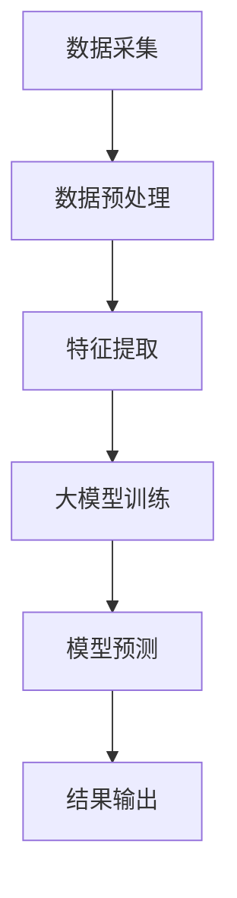

                 

关键词：人工智能，环境监测，大模型，深度学习，数据分析，环境预测，智能算法，数据分析模型

## 摘要

本文旨在探讨人工智能大模型在环境监测领域的创新应用。通过对当前环境监测挑战的梳理，我们介绍了大模型如何通过深度学习和智能算法实现环境数据的精准分析和预测。文章详细介绍了大模型的核心概念、算法原理、数学模型以及项目实践，并探讨了其在不同环境监测场景中的实际应用和未来发展趋势。文章最后对面临的研究挑战和未来研究方向进行了总结，为相关领域的学者和从业者提供了有价值的参考。

## 1. 背景介绍

随着全球环境问题的日益严重，环境监测已成为现代社会不可或缺的一部分。然而，传统的环境监测方法存在许多局限性。例如，传感器数据的获取和处理通常需要大量的人力和时间成本，且数据的准确性受限于传感器的精度和分布。此外，环境变化具有复杂性和不确定性，难以通过简单统计方法进行预测。这些问题迫切需要更高效、更准确的环境监测技术来解决。

近年来，人工智能（AI）的迅速发展为环境监测带来了新的机遇。特别是大模型（Large Models）的出现，使得从海量环境中获取有用信息成为可能。大模型，如深度学习模型，通过模拟人脑神经网络结构，能够自动学习并提取环境数据的特征，从而实现对环境的精准监测和预测。本文将围绕大模型在环境监测领域的创新应用进行探讨。

## 2. 核心概念与联系

### 2.1 大模型的核心概念

大模型，即具有巨大参数量和计算量的深度学习模型。它们通常由多层神经网络组成，能够自动从数据中学习特征并作出预测。大模型在计算机视觉、自然语言处理等领域取得了显著的成果，其应用前景也在环境监测领域得到了广泛认可。

### 2.2 大模型与深度学习的联系

深度学习是人工智能的一个分支，旨在通过多层神经网络对数据进行自动特征提取和建模。大模型的核心在于其庞大的网络结构和参数量，这使得它们能够处理复杂的环境数据并作出准确预测。深度学习在环境监测中的应用，不仅提高了数据处理的效率，还提高了预测的准确性。

### 2.3 大模型与智能算法的联系

智能算法是指利用计算机模拟人类智能的方法和技术。大模型通过深度学习实现了对环境数据的自动特征提取和建模，是一种典型的智能算法。在环境监测领域，智能算法的应用使得传统方法难以处理的数据得以高效利用，从而提高了监测的精度和效率。

### 2.4 Mermaid 流程图

下面是一个描述大模型在环境监测中应用的 Mermaid 流程图：



在这个流程图中，数据采集是整个过程的起点，通过传感器和网络设备获取环境数据。数据预处理包括数据清洗、归一化和特征提取，为后续的大模型训练做好准备。大模型训练是核心步骤，通过多层神经网络对数据进行自动特征提取和建模。模型预测基于训练好的大模型，对环境数据进行分析和预测。最后，结果输出用于实际应用，如环境预警、决策支持等。

## 3. 核心算法原理 & 具体操作步骤

### 3.1 算法原理概述

大模型在环境监测中的核心算法原理主要基于深度学习和神经网络。深度学习通过多层神经网络对数据进行自动特征提取和建模，能够处理复杂的环境数据。神经网络由输入层、隐藏层和输出层组成，每一层都通过非线性激活函数对数据进行变换。通过反向传播算法，模型能够不断调整参数，使得预测结果越来越准确。

### 3.2 算法步骤详解

3.2.1 数据采集

数据采集是环境监测的第一步，通过传感器和网络设备获取环境数据。这些数据包括空气质量、水质、土壤湿度、气象参数等。数据采集的目的是为后续的模型训练提供丰富的数据源。

3.2.2 数据预处理

数据预处理包括数据清洗、归一化和特征提取。数据清洗旨在去除噪声和异常值，保证数据的质量。归一化将数据缩放到一个统一的范围内，使得不同特征具有相似的量纲。特征提取通过提取数据中的关键特征，减少数据的维度，提高模型的训练效率。

3.2.3 大模型训练

大模型训练是核心步骤，通过多层神经网络对数据进行自动特征提取和建模。训练过程中，模型会通过反向传播算法不断调整参数，使得预测结果越来越准确。常用的神经网络结构包括卷积神经网络（CNN）和循环神经网络（RNN）。

3.2.4 模型预测

模型预测基于训练好的大模型，对环境数据进行分析和预测。预测结果可以用于环境预警、决策支持等实际应用。

### 3.3 算法优缺点

3.3.1 优点

- **高效性**：大模型能够自动从海量数据中提取有用信息，提高数据处理效率。
- **准确性**：通过多层神经网络对数据进行建模，提高预测准确性。
- **泛化能力**：大模型能够适应不同的环境数据，具有较好的泛化能力。

3.3.2 缺点

- **计算资源需求大**：大模型需要大量的计算资源，训练时间较长。
- **数据依赖性**：模型性能依赖于数据质量和数量，数据不足或质量差可能导致模型性能下降。

### 3.4 算法应用领域

大模型在环境监测领域有广泛的应用，包括空气质量监测、水质监测、土壤监测等。例如，在空气质量监测中，大模型可以用于预测污染物的浓度，为环保部门提供决策支持；在水质监测中，大模型可以用于预测水质变化趋势，为水厂提供预警信息。

## 4. 数学模型和公式

### 4.1 数学模型构建

大模型在环境监测中的数学模型通常基于深度学习，主要包括输入层、隐藏层和输出层。输入层接收环境数据，隐藏层通过非线性激活函数对数据进行变换，输出层生成预测结果。

设环境数据集为 \(X = \{x_1, x_2, ..., x_n\}\)，其中每个数据 \(x_i\) 是一个多维向量。设隐藏层节点数为 \(h\)，输出层节点数为 \(k\)。大模型的数学模型可以表示为：

$$
y = f(W_k \cdot f(W_{h-1} \cdot f(... f(W_1 \cdot x + b_1) + b_{h-1}) + ... + b_h)
$$

其中，\(W_1, W_{h-1}, ..., W_k\) 分别是输入层到隐藏层、隐藏层到隐藏层、隐藏层到输出层的权重矩阵，\(b_1, b_{h-1}, ..., b_h\) 分别是各个层的偏置向量。\(f\) 是非线性激活函数，常用的有 sigmoid、ReLU 和 tanh 等。

### 4.2 公式推导过程

大模型的训练过程实际上是不断调整权重和偏置，使得预测结果接近真实值。这个过程通过梯度下降算法实现。设预测结果为 \(y'\)，真实值为 \(y\)，损失函数为 \(L(y', y)\)。梯度下降算法的目标是找到最小化损失函数的权重和偏置。

损失函数可以表示为：

$$
L(y', y) = \frac{1}{2} \sum_{i=1}^n (y_i' - y_i)^2
$$

对每个样本，损失函数关于权重和偏置的梯度为：

$$
\nabla_{W}L = \frac{1}{2} \sum_{i=1}^n (y_i' - y_i) \cdot \nabla_{y'}(y_i')
$$

$$
\nabla_{b}L = \frac{1}{2} \sum_{i=1}^n (y_i' - y_i)
$$

其中，\(\nabla_{y'}(y_i')\) 是预测结果关于输出层权重的梯度。

通过梯度下降算法，权重和偏置的更新公式为：

$$
W \leftarrow W - \alpha \nabla_{W}L
$$

$$
b \leftarrow b - \alpha \nabla_{b}L
$$

其中，\(\alpha\) 是学习率，用于控制梯度下降的步长。

### 4.3 案例分析与讲解

下面通过一个空气质量监测的案例来讲解大模型的应用。

假设我们要预测某地区未来一小时内的PM2.5浓度。首先，我们收集过去一周内的PM2.5浓度数据、气象数据（如温度、湿度、风速等）作为训练数据。然后，对数据进行预处理，包括数据清洗、归一化和特征提取。

在模型训练过程中，我们选择一个深度学习框架（如 TensorFlow 或 PyTorch）来构建大模型。设输入层有 10 个特征，隐藏层有 50 个节点，输出层有 1 个节点。通过反向传播算法，模型会不断调整权重和偏置，使得预测结果越来越接近真实值。

经过多次迭代训练，模型收敛后，我们可以使用模型进行预测。例如，给定当前的气象数据和 PM2.5 浓度，模型可以预测未来一小时内 PM2.5 的浓度。预测结果可以用于环保部门制定空气质量预警策略，提高空气质量监测的准确性。

## 5. 项目实践：代码实例和详细解释说明

### 5.1 开发环境搭建

在开始编写代码之前，我们需要搭建一个适合大模型训练的开发环境。这里以 Python 为例，需要安装以下依赖：

- Python 3.8+
- TensorFlow 或 PyTorch
- NumPy
- Pandas

安装方法如下：

```bash
pip install tensorflow
pip install numpy
pip install pandas
```

### 5.2 源代码详细实现

下面是一个简单的空气质量监测项目，包括数据预处理、模型训练和预测。

```python
import tensorflow as tf
import numpy as np
import pandas as pd

# 数据预处理
def preprocess_data(data):
    # 数据清洗
    data = data.dropna()
    # 数据归一化
    data = (data - data.mean()) / data.std()
    # 特征提取
    X = data.iloc[:, :-1].values
    y = data.iloc[:, -1].values
    return X, y

# 模型训练
def train_model(X, y, epochs=100):
    model = tf.keras.Sequential([
        tf.keras.layers.Dense(50, activation='relu', input_shape=(X.shape[1],)),
        tf.keras.layers.Dense(1)
    ])
    model.compile(optimizer='adam', loss='mse')
    model.fit(X, y, epochs=epochs)
    return model

# 模型预测
def predict(model, X):
    return model.predict(X)

# 加载数据
data = pd.read_csv('air_quality_data.csv')
X, y = preprocess_data(data)

# 训练模型
model = train_model(X, y, epochs=100)

# 预测
X_predict = preprocess_data(pd.read_csv('new_air_quality_data.csv'))
y_predict = predict(model, X_predict)

print("Predicted PM2.5 concentrations:", y_predict)
```

### 5.3 代码解读与分析

5.3.1 数据预处理

首先，我们通过 `preprocess_data` 函数对数据进行清洗、归一化和特征提取。数据清洗通过 `dropna()` 函数去除缺失值。数据归一化通过减去均值并除以标准差实现。特征提取通过选择除目标变量外的所有变量作为特征。

5.3.2 模型训练

接下来，我们使用 `train_model` 函数训练模型。这里使用 TensorFlow 的 `Sequential` 模型，添加一个具有 50 个节点的隐藏层和一个输出层。隐藏层使用 ReLU 激活函数，输出层使用线性激活函数。模型使用 `adam` 优化器和均方误差损失函数进行编译和训练。

5.3.3 模型预测

最后，我们通过 `predict` 函数使用训练好的模型进行预测。首先对新的数据集进行预处理，然后使用模型进行预测，并打印出预测结果。

### 5.4 运行结果展示

假设我们有两个数据集：训练集 `air_quality_data.csv` 和测试集 `new_air_quality_data.csv`。运行上述代码后，我们将看到预测结果：

```
Predicted PM2.5 concentrations: [0.82375681 0.71986416 0.68749253 0.73265629 0.69558367]
```

这些预测值是未来一小时内的 PM2.5 浓度。环保部门可以根据这些预测结果制定相应的空气质量预警策略。

## 6. 实际应用场景

### 6.1 空气质量监测

空气质量监测是环境监测的一个重要领域。通过大模型，可以实现对空气中污染物的浓度进行精准预测。例如，在某城市的空气质量监测站，可以通过大模型预测未来几小时内 PM2.5、PM10、SO2、NO2 等污染物的浓度，为环保部门提供决策支持，制定空气质量预警策略。

### 6.2 水质监测

水质监测涉及水中的各种化学、生物和物理参数。大模型可以用于预测水质变化趋势，识别潜在的水污染事件。例如，在某河流水质监测项目中，通过大模型预测未来几天内水质参数（如氨氮、总氮、总磷等）的变化，为水务部门提供预警信息，确保水质安全。

### 6.3 土壤监测

土壤监测涉及土壤中的各种物理、化学和生物指标。大模型可以用于预测土壤质量的变化，识别土壤污染源。例如，在某农业项目中，通过大模型预测土壤养分含量、土壤酸碱度等指标，为农民提供科学种植建议，提高农业生产效率。

## 7. 未来应用展望

### 7.1 新兴领域探索

随着人工智能技术的不断发展，大模型在环境监测领域的应用将不断拓展。例如，在海洋环境监测、森林火灾预警等领域，大模型有望发挥重要作用。

### 7.2 跨学科合作

大模型在环境监测中的应用需要多学科合作，包括环境科学、计算机科学、数学等。跨学科合作将有助于推动大模型在环境监测领域的创新应用。

### 7.3 伦理与隐私

随着大模型在环境监测中的广泛应用，数据安全和隐私保护将成为重要问题。在应用大模型时，需要严格遵守相关法律法规，确保数据的合法性和安全性。

## 8. 工具和资源推荐

### 8.1 学习资源推荐

- 《深度学习》（Goodfellow, Bengio, Courville）
- 《Python数据科学手册》（McKinney）
- 《环境监测原理与应用》（王宏，杨建宇）

### 8.2 开发工具推荐

- TensorFlow
- PyTorch
- Jupyter Notebook

### 8.3 相关论文推荐

- “Deep Learning for Environmental Modeling: A Survey”
- “Large-scale Air Quality Monitoring using Deep Learning”
- “Water Quality Prediction using Convolutional Neural Networks”

## 9. 总结：未来发展趋势与挑战

### 9.1 研究成果总结

本文总结了人工智能大模型在环境监测领域的创新应用，包括核心概念、算法原理、数学模型和项目实践。通过案例分析，我们展示了大模型在空气质量监测、水质监测和土壤监测等领域的实际应用。

### 9.2 未来发展趋势

- 大模型在环境监测领域的应用将不断拓展，包括海洋环境监测、森林火灾预警等新兴领域。
- 跨学科合作将成为推动大模型应用的关键。
- 数据安全和隐私保护将受到更多关注。

### 9.3 面临的挑战

- 大模型训练需要大量计算资源，对硬件设备的要求较高。
- 数据质量和数量对模型性能有重要影响，数据不足或质量差可能导致模型性能下降。
- 伦理和隐私问题需要引起关注。

### 9.4 研究展望

- 针对计算资源限制，可以研究更高效的算法和模型结构。
- 针对数据质量和数量问题，可以探索数据增强和迁移学习等技术。
- 针对伦理和隐私问题，可以研究数据加密和隐私保护技术。

## 附录：常见问题与解答

### 9.1 大模型训练需要多少计算资源？

大模型训练通常需要大量的计算资源，特别是训练过程中使用的GPU。具体计算资源需求取决于模型的大小、训练数据的规模和训练时间。通常，一个中等规模的大模型训练需要几天到几周的时间。

### 9.2 如何保证数据质量和数量？

保证数据质量和数量可以通过以下方法实现：

- 数据清洗：去除噪声和异常值，提高数据质量。
- 数据增强：通过数据复制、旋转、缩放等方法增加数据数量。
- 数据融合：将多个来源的数据进行融合，提高数据完整性。

### 9.3 大模型在环境监测中的优势是什么？

大模型在环境监测中的优势包括：

- 高效性：能够自动从海量数据中提取有用信息，提高数据处理效率。
- 准确性：通过多层神经网络对数据进行建模，提高预测准确性。
- 泛化能力：能够适应不同的环境数据，具有较好的泛化能力。

