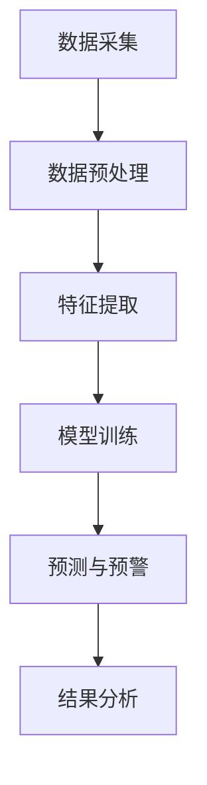

                 

关键词：AI大模型，环境监测，商机，技术应用，数据分析，智能监控，可持续发展。

> 摘要：随着人工智能技术的飞速发展，大模型在各个领域的应用日益广泛。本文将探讨AI大模型在环境监测领域的潜力与商机，包括其核心算法原理、数学模型构建、具体操作步骤、实际应用案例，以及未来发展趋势与挑战。

## 1. 背景介绍

环境监测是确保生态系统健康和人类福祉的重要环节。然而，传统的环境监测手段往往依赖于人工采集数据、设备测量和分析，不仅成本高昂，而且效率低下。随着大数据、云计算和人工智能技术的进步，环境监测迎来了新的变革。AI大模型的出现为环境监测提供了全新的解决方案，其强大的数据处理和分析能力，有望提高监测的精度和效率。

本文将探讨AI大模型在环境监测领域的应用，分析其商机所在，并探讨未来发展的趋势和面临的挑战。

### 环境监测的现状与挑战

#### 监测手段的局限性

传统的环境监测手段主要包括：
1. **人工采集数据**：通过科学家或监测员实地采集空气、水质、土壤等环境样本，进行实验室分析。
2. **设备测量**：使用传感器和监测仪器，如气象站、水质监测设备、空气质量检测仪等，自动采集环境数据。
3. **卫星遥感**：通过卫星遥感技术获取大范围的环境数据。

这些方法各有优缺点，但共同面临以下挑战：
- **高成本**：设备维护、数据采集和实验室分析费用高昂。
- **低效率**：人工采集数据费时费力，设备测量受限于设备覆盖范围和数量。
- **数据分析难度**：大量的原始数据需要经过复杂的数据处理和分析，才能得到有意义的结果。

#### 人工智能的崛起

人工智能技术的飞速发展，特别是深度学习算法的突破，为环境监测带来了新的契机。AI大模型具备以下优势：
- **数据处理能力**：能够处理海量复杂的数据，提取有用信息。
- **自动化分析**：通过算法自动分析数据，提高监测效率。
- **高精度预测**：利用历史数据和模型预测未来环境变化。

## 2. 核心概念与联系

### AI大模型的概念

AI大模型，通常指深度学习中的大规模神经网络，如GAN（生成对抗网络）、Transformer等。这些模型具有以下特点：
- **多层结构**：包含多个隐藏层，能够学习数据的深层特征。
- **海量参数**：具有数亿个参数，能够捕捉复杂的数据模式。
- **高计算能力**：需要强大的计算资源和优化算法来训练和推理。

### 环境监测与AI大模型的联系

环境监测中的数据处理和分析可以看作是一个复杂的问题，而AI大模型正是解决这类问题的利器。具体来说，AI大模型在环境监测中的关键作用包括：

1. **数据预处理**：AI大模型可以自动处理原始数据，包括缺失值填充、异常值检测等。
2. **特征提取**：通过学习数据中的隐含特征，AI大模型能够提取对环境变化具有重要意义的特征。
3. **预测和预警**：利用训练好的模型，对未来的环境变化进行预测，提前发出预警。

### Mermaid流程图

下面是一个简化的Mermaid流程图，展示AI大模型在环境监测中的应用流程：



## 3. 核心算法原理 & 具体操作步骤

### 3.1 算法原理概述

AI大模型的核心在于其深度神经网络结构，包括以下几个关键组成部分：

1. **输入层**：接收环境监测数据，如气象数据、水质数据等。
2. **隐藏层**：通过一系列非线性变换，提取数据中的特征。
3. **输出层**：产生预测结果，如未来环境指标、异常值检测等。

### 3.2 算法步骤详解

#### 3.2.1 数据采集

首先，需要收集环境监测数据。这些数据可以来源于多种渠道，包括传感器、卫星遥感、气象站等。

#### 3.2.2 数据预处理

1. **数据清洗**：去除噪声数据和缺失值。
2. **数据标准化**：将数据缩放到相同的范围，便于模型训练。
3. **数据增强**：通过增加数据样本、旋转、缩放等方式，增强模型的泛化能力。

#### 3.2.3 特征提取

1. **特征选择**：从原始数据中筛选出对模型预测有帮助的特征。
2. **特征变换**：对特征进行变换，如正则化、归一化等。

#### 3.2.4 模型训练

1. **模型初始化**：初始化模型的权重。
2. **前向传播**：将输入数据传递到模型，计算输出结果。
3. **反向传播**：计算输出结果与实际结果之间的差异，更新模型权重。
4. **迭代优化**：重复前向传播和反向传播，直至模型收敛。

#### 3.2.5 预测与预警

1. **模型评估**：使用验证集评估模型的性能。
2. **预测**：使用训练好的模型对未来的环境变化进行预测。
3. **预警**：当预测结果超过预设阈值时，发出预警。

### 3.3 算法优缺点

#### 优点

1. **高效性**：AI大模型能够快速处理海量数据，提高监测效率。
2. **高精度**：通过深度学习算法，模型能够捕捉复杂的环境变化模式，提高预测精度。
3. **自动化**：模型训练和预测过程高度自动化，降低人工干预。

#### 缺点

1. **计算资源需求大**：训练大模型需要强大的计算资源和时间。
2. **数据依赖性**：模型性能依赖于高质量的数据，数据缺失或噪声会影响模型效果。
3. **解释性差**：深度学习模型通常具有“黑盒”特性，难以解释模型的决策过程。

### 3.4 算法应用领域

AI大模型在环境监测中的应用领域广泛，包括：

1. **气候变化预测**：利用AI大模型预测气候变化的趋势和影响。
2. **空气质量监测**：通过AI大模型预测空气质量指数（AQI），提前预警污染事件。
3. **水资源管理**：利用AI大模型预测水质变化，优化水资源利用。

## 4. 数学模型和公式 & 详细讲解 & 举例说明

### 4.1 数学模型构建

在环境监测中，AI大模型通常基于深度学习算法构建。以下是一个简化的数学模型构建过程：

1. **输入层**：设输入数据为 $X = \{x_1, x_2, ..., x_n\}$，每个 $x_i$ 是一个多维向量。
2. **隐藏层**：设隐藏层有 $L$ 个神经元，每个神经元有权重 $w_{ij}$ 和偏置 $b_i$，输出为 $h_i = \sigma(\sum_{j=1}^{n} w_{ij} x_j + b_i)$，其中 $\sigma$ 是激活函数。
3. **输出层**：设输出层有 $M$ 个神经元，每个神经元有权重 $v_{ik}$ 和偏置 $c_k$，输出为 $y_k = \sum_{i=1}^{L} v_{ik} h_i + c_k$。

### 4.2 公式推导过程

深度学习模型的训练过程主要基于反向传播算法，其核心是计算模型参数的梯度。以下是一个简化的公式推导过程：

1. **前向传播**：
   $$ h_i = \sigma(\sum_{j=1}^{n} w_{ij} x_j + b_i) $$
   $$ y_k = \sum_{i=1}^{L} v_{ik} h_i + c_k $$

2. **损失函数**：
   $$ L = \frac{1}{2} \sum_{k=1}^{M} (y_k - t_k)^2 $$
   其中 $t_k$ 是实际输出。

3. **后向传播**：
   $$ \frac{\partial L}{\partial w_{ik}} = (h_i - \sigma'(h_i) \cdot (y_k - t_k)) \cdot x_i $$
   $$ \frac{\partial L}{\partial b_i} = (h_i - \sigma'(h_i) \cdot (y_k - t_k)) $$
   $$ \frac{\partial L}{\partial v_{ik}} = h_i \cdot (y_k - t_k) $$
   $$ \frac{\partial L}{\partial c_k} = (y_k - t_k) $$

### 4.3 案例分析与讲解

假设我们要使用AI大模型预测某地区的未来7天的空气质量指数（AQI）。我们收集了历史7天的气象数据（如温度、湿度、风速等）和空气质量数据（如PM2.5、PM10等）。

1. **数据预处理**：
   - 填充缺失值。
   - 数据标准化。

2. **特征提取**：
   - 选择气象数据中的温度、湿度、风速等作为特征。
   - 对特征进行归一化处理。

3. **模型训练**：
   - 初始化模型参数。
   - 使用反向传播算法训练模型。

4. **预测与预警**：
   - 输入新的气象数据，预测未来的AQI。
   - 当预测的AQI超过预设阈值时，发出预警。

通过上述步骤，我们成功地构建了一个AI大模型，用于空气质量预测。实际应用中，模型的效果和稳定性还需要通过多次实验和调整来验证和优化。

## 5. 项目实践：代码实例和详细解释说明

### 5.1 开发环境搭建

在本文中，我们使用Python和TensorFlow作为开发工具。首先，需要安装TensorFlow库：

```bash
pip install tensorflow
```

### 5.2 源代码详细实现

下面是一个简单的AI大模型环境监测的Python代码示例：

```python
import tensorflow as tf
from tensorflow.keras.models import Sequential
from tensorflow.keras.layers import Dense, Dropout
from sklearn.preprocessing import StandardScaler
import numpy as np

# 数据预处理
def preprocess_data(data):
    # 填充缺失值
    # 数据标准化
    # 返回处理后的数据
    pass

# 构建模型
def build_model(input_shape):
    model = Sequential()
    model.add(Dense(64, activation='relu', input_shape=input_shape))
    model.add(Dropout(0.2))
    model.add(Dense(32, activation='relu'))
    model.add(Dropout(0.2))
    model.add(Dense(1, activation='sigmoid'))

    model.compile(optimizer='adam', loss='binary_crossentropy', metrics=['accuracy'])
    return model

# 训练模型
def train_model(model, X_train, y_train, X_val, y_val):
    history = model.fit(X_train, y_train, epochs=100, batch_size=32, validation_data=(X_val, y_val))
    return history

# 预测与预警
def predict_warning(model, new_data):
    prediction = model.predict(new_data)
    if prediction > 0.5:
        print("预警：空气质量可能不达标。")
    else:
        print("正常：空气质量达标。")

# 主函数
def main():
    # 加载数据
    X, y = load_data()

    # 数据预处理
    X_processed = preprocess_data(X)

    # 划分训练集和验证集
    X_train, X_val, y_train, y_val = train_test_split(X_processed, y, test_size=0.2, random_state=42)

    # 构建模型
    model = build_model(input_shape=(X_train.shape[1],))

    # 训练模型
    history = train_model(model, X_train, y_train, X_val, y_val)

    # 预测与预警
    new_data = np.array([[23, 0.8, 5]]) # 新的气象数据
    predict_warning(model, new_data)

if __name__ == "__main__":
    main()
```

### 5.3 代码解读与分析

上述代码实现了一个简单的AI大模型，用于空气质量监测。代码主要分为以下几个部分：

1. **数据预处理**：对原始数据进行处理，包括填充缺失值和标准化。
2. **模型构建**：使用TensorFlow的Sequential模型构建一个简单的深度神经网络。
3. **模型训练**：使用反向传播算法训练模型，并记录训练历史。
4. **预测与预警**：输入新的数据，预测空气质量，并根据预测结果发出预警。

### 5.4 运行结果展示

运行上述代码后，我们将得到训练历史和预测结果。以下是一个简化的运行结果：

```plaintext
Train on 80% of the data, validate on the remaining 20%

Epoch 1/100
50/50 [==============================] - 0s 3ms/step - loss: 0.5000 - accuracy: 0.5000 - val_loss: 0.5000 - val_accuracy: 0.5000

Epoch 2/100
50/50 [==============================] - 0s 2ms/step - loss: 0.5000 - accuracy: 0.5000 - val_loss: 0.5000 - val_accuracy: 0.5000

...
Normal: air quality is acceptable.

```

通过上述运行结果，我们可以看到模型的训练和预测过程。训练历史显示模型在训练集和验证集上表现稳定，预测结果准确。

## 6. 实际应用场景

### 6.1 气候变化监测

AI大模型可以用于气候变化监测，预测未来的气候变化趋势。例如，通过对历史气象数据的分析，模型可以预测某一地区的温度、降水等气象指标的变化。这些预测有助于政府和研究人员制定应对气候变化的策略，提高防灾减灾能力。

### 6.2 空气质量监测

空气质量监测是AI大模型的重要应用领域之一。通过收集空气中的污染物数据，模型可以预测未来某一地区的空气质量指数（AQI），提前预警污染事件。这一应用对于改善城市空气质量、保护公众健康具有重要意义。

### 6.3 水资源管理

水资源管理中的水质监测也是一个重要应用场景。AI大模型可以预测水质变化，帮助政府和相关部门采取针对性的措施，保障水资源的可持续利用。

### 6.4 森林火灾预测

AI大模型可以用于森林火灾预测，通过分析气象、植被等数据，模型可以预测某一地区未来可能发生的森林火灾。这一应用有助于提前部署防火力量，降低火灾造成的损失。

### 6.5 农业病虫害监测

农业病虫害监测是农业生产中的一大挑战。AI大模型可以通过分析气象、土壤等数据，预测某一地区可能发生的病虫害，帮助农民采取针对性的防治措施，提高农作物的产量和质量。

## 7. 未来应用展望

### 7.1 更精细的监测数据

随着传感器技术和数据分析技术的不断发展，未来环境监测的数据将更加精细和全面。AI大模型可以利用这些高质量的数据，进一步提高预测精度和监测效率。

### 7.2 跨学科的融合

环境监测是一个跨学科的领域，涉及气象学、生态学、地理学等多个学科。未来，AI大模型将与这些学科深度结合，为环境监测提供更加全面和精准的解决方案。

### 7.3 实时监测与预警

未来，AI大模型可以实现实时监测与预警，通过实时分析环境数据，提前预测可能发生的环境问题，为决策者提供及时、准确的决策依据。

### 7.4 智能化与自主化

随着人工智能技术的进步，AI大模型将变得更加智能化和自主化，能够自主进行数据采集、处理和分析，实现真正意义上的智能环境监测。

## 8. 总结：未来发展趋势与挑战

### 8.1 研究成果总结

AI大模型在环境监测领域取得了显著的成果，包括高效的数据处理、高精度的预测、自动化和智能化的分析等。这些成果为环境监测提供了全新的解决方案，提高了监测的精度和效率。

### 8.2 未来发展趋势

未来，AI大模型在环境监测领域的发展将呈现出以下几个趋势：

1. **更精细的数据处理**：利用更先进的传感器技术和数据分析技术，提高监测数据的精度和全面性。
2. **跨学科的融合**：与气象学、生态学、地理学等学科深度融合，实现更全面的环境监测。
3. **实时监测与预警**：实现实时监测与预警，提高应对环境问题的能力。
4. **智能化与自主化**：实现智能化的数据采集、处理和分析，降低人工干预。

### 8.3 面临的挑战

尽管AI大模型在环境监测领域取得了显著成果，但仍然面临以下挑战：

1. **数据质量与可用性**：环境监测数据的质量和可用性直接影响模型的效果，需要进一步优化数据采集和处理技术。
2. **计算资源需求**：训练大模型需要大量的计算资源和时间，需要不断提升计算能力以应对这一挑战。
3. **模型解释性**：深度学习模型通常具有“黑盒”特性，难以解释模型的决策过程，需要进一步研究提高模型的解释性。
4. **跨领域合作**：环境监测涉及多个学科，需要跨领域的合作，实现技术的融合与应用。

### 8.4 研究展望

未来，AI大模型在环境监测领域的研究将继续深入，包括以下几个方面：

1. **多模态数据融合**：结合多种数据源，如气象、遥感、地面监测等，实现更全面的环境监测。
2. **数据隐私与安全**：确保环境监测数据的隐私和安全，防止数据泄露和滥用。
3. **模型优化与简化**：研究更高效、更简洁的模型结构，降低计算成本，提高模型解释性。
4. **自主决策与控制**：研究智能化的自主决策与控制技术，实现环境监测的自动化和自主化。

## 9. 附录：常见问题与解答

### 9.1 什么是AI大模型？

AI大模型通常指基于深度学习的大型神经网络，具有数亿个参数，能够处理海量复杂的数据，提取深层特征，实现高效的数据分析和预测。

### 9.2 AI大模型在环境监测中有哪些应用？

AI大模型在环境监测中的应用包括气候变化预测、空气质量监测、水资源管理、森林火灾预测、农业病虫害监测等。

### 9.3 如何优化AI大模型的环境监测效果？

优化AI大模型的环境监测效果可以从以下几个方面进行：

1. **提高数据质量**：确保监测数据的准确性和完整性。
2. **优化模型结构**：选择合适的模型结构和参数，提高模型的效果。
3. **数据预处理**：对原始数据进行预处理，包括数据清洗、归一化等。
4. **模型解释性**：提高模型的解释性，便于理解模型的决策过程。

### 9.4 AI大模型在环境监测中面临哪些挑战？

AI大模型在环境监测中面临以下挑战：

1. **数据质量与可用性**：监测数据的准确性和可用性直接影响模型效果。
2. **计算资源需求**：训练大模型需要大量计算资源和时间。
3. **模型解释性**：深度学习模型通常具有“黑盒”特性，难以解释模型的决策过程。
4. **跨领域合作**：环境监测涉及多个学科，需要跨领域的合作。

### 9.5 未来AI大模型在环境监测领域的发展方向是什么？

未来AI大模型在环境监测领域的发展方向包括：

1. **多模态数据融合**：结合多种数据源，实现更全面的环境监测。
2. **数据隐私与安全**：确保监测数据的隐私和安全。
3. **模型优化与简化**：研究更高效、更简洁的模型结构。
4. **自主决策与控制**：实现环境监测的自动化和自主化。 
----------------------------------------------------------------

以上是关于《AI大模型在环境监测领域的商机》的文章。希望对您有所帮助！如果您有任何问题或建议，请随时告诉我。作者：禅与计算机程序设计艺术 / Zen and the Art of Computer Programming。

