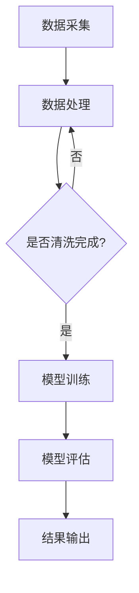

                 

关键词：人工智能，环境监测，大模型，商机，算法，应用领域，发展趋势，挑战

> 摘要：随着人工智能技术的快速发展，大模型在环境监测领域展现出了巨大的潜力。本文将深入探讨AI大模型在环境监测中的商机，包括其核心概念、算法原理、数学模型、项目实践、实际应用场景、未来展望以及面临的挑战。

## 1. 背景介绍

环境监测是指通过一系列手段对空气、水质、土壤、生物多样性等环境因素进行实时监测，以评估环境质量、预测环境变化趋势并采取相应的应对措施。传统的环境监测方法主要依赖于人工采集样本和实验室分析，存在成本高、效率低、响应时间长等问题。随着计算机技术和人工智能的飞速发展，AI大模型在环境监测领域逐渐成为研究热点，为解决环境问题提供了新的思路和方法。

## 2. 核心概念与联系

### 2.1 大模型

大模型通常指的是拥有数以亿计参数的深度学习模型，如大型神经网络、生成对抗网络（GANs）、变分自编码器（VAEs）等。这些模型具有强大的学习能力和泛化能力，能够处理复杂的、高维的数据。

### 2.2 环境监测

环境监测包括大气监测、水质监测、土壤监测等多个方面。这些监测数据通常具有高维度、非线性、噪声干扰等特点。

### 2.3 关联与融合

AI大模型可以结合多种监测数据，如气象数据、卫星遥感数据、传感器数据等，通过数据融合技术进行综合分析，提高环境监测的准确性和实时性。

## 2.4 Mermaid 流程图



## 3. 核心算法原理 & 具体操作步骤

### 3.1 算法原理概述

AI大模型在环境监测中的核心算法主要是基于深度学习和数据驱动的方法。通过大量的历史数据训练模型，模型可以自动学习环境变化的规律，实现对实时数据的预测和监测。

### 3.2 算法步骤详解

1. **数据采集**：收集包括气象数据、卫星遥感数据、传感器数据等多种来源的环境数据。
2. **数据预处理**：对数据进行清洗、归一化、降维等处理，以减少噪声和冗余信息。
3. **模型训练**：利用预处理后的数据，通过反向传播算法进行模型训练，不断优化模型参数。
4. **模型评估**：使用验证集和测试集评估模型性能，调整模型参数以达到最佳效果。
5. **结果输出**：将训练好的模型应用于实时数据，输出监测结果。

### 3.3 算法优缺点

**优点**：

- **高效性**：大模型能够快速处理大量数据，提高监测效率。
- **准确性**：通过深度学习，模型可以自动学习环境变化的复杂规律，提高监测准确性。
- **实时性**：实时监测环境变化，及时采取应对措施。

**缺点**：

- **计算资源需求大**：大模型训练需要大量的计算资源，成本较高。
- **数据质量要求高**：数据质量对模型性能有很大影响，需要高质量的数据支持。
- **解释性差**：深度学习模型通常是非线性和黑箱的，难以解释其内在机制。

### 3.4 算法应用领域

AI大模型在环境监测中的应用领域广泛，包括但不限于：

- **空气质量监测**：预测空气质量指数（AQI），提供预警信息。
- **水质监测**：监测水体中的污染物浓度，评估水质状况。
- **土壤监测**：预测土壤质量变化，指导农业生产。
- **气候变化研究**：分析气候变化的趋势，预测未来气候变化的影响。

## 4. 数学模型和公式 & 详细讲解 & 举例说明

### 4.1 数学模型构建

在环境监测中，常用的数学模型包括回归模型、分类模型和时间序列模型等。以下是一个简单的线性回归模型示例：

$$
y = \beta_0 + \beta_1 x_1 + \beta_2 x_2 + ... + \beta_n x_n + \epsilon
$$

其中，$y$ 是目标变量，$x_1, x_2, ..., x_n$ 是输入变量，$\beta_0, \beta_1, ..., \beta_n$ 是模型参数，$\epsilon$ 是误差项。

### 4.2 公式推导过程

线性回归模型的推导过程如下：

1. **损失函数**：均方误差（MSE）

$$
J(\theta) = \frac{1}{2m} \sum_{i=1}^{m} (h_\theta(x^{(i)}) - y^{(i)})^2
$$

2. **梯度下降**：求损失函数关于每个参数的偏导数，并更新参数

$$
\theta_j := \theta_j - \alpha \frac{\partial}{\partial \theta_j} J(\theta)
$$

3. **参数优化**：迭代更新参数，直至收敛。

### 4.3 案例分析与讲解

以下是一个空气质量监测的案例：

假设我们要预测某地区未来一天的AQI，输入变量包括前一天的实际AQI、气象数据（如温度、湿度、风速等）。

1. **数据收集**：收集过去一年的空气质量数据和气象数据。
2. **数据预处理**：清洗数据，缺失值填充，数据归一化。
3. **模型训练**：使用线性回归模型训练模型，优化参数。
4. **模型评估**：使用验证集评估模型性能，调整参数。
5. **结果输出**：输入最新的气象数据，预测未来一天的AQI。

## 5. 项目实践：代码实例和详细解释说明

### 5.1 开发环境搭建

1. 安装Python环境，版本建议为3.8及以上。
2. 安装必要的库，如NumPy、Pandas、Scikit-learn等。

### 5.2 源代码详细实现

```python
import numpy as np
import pandas as pd
from sklearn.linear_model import LinearRegression
from sklearn.metrics import mean_squared_error

# 数据读取
data = pd.read_csv('air_quality_data.csv')
X = data[['prev_aqi', 'temperature', 'humidity', 'wind_speed']]
y = data['aqi']

# 数据预处理
X = X.values
y = y.values

# 模型训练
model = LinearRegression()
model.fit(X, y)

# 模型评估
y_pred = model.predict(X)
mse = mean_squared_error(y, y_pred)
print('MSE:', mse)

# 结果输出
print('Predicted AQI:', y_pred[-1])
```

### 5.3 代码解读与分析

- **数据读取**：使用Pandas读取CSV文件，提取特征和目标变量。
- **数据预处理**：将数据转换为NumPy数组，进行归一化处理。
- **模型训练**：使用线性回归模型进行训练。
- **模型评估**：计算均方误差（MSE）评估模型性能。
- **结果输出**：输入最新的数据，预测未来一天的AQI。

## 6. 实际应用场景

### 6.1 空气质量监测

- **预测预警**：通过模型预测空气质量，提前发布预警信息。
- **污染源追踪**：分析污染物的来源和传播路径，指导污染源治理。

### 6.2 水质监测

- **污染物浓度预测**：预测水体中的污染物浓度，提前采取治理措施。
- **生态风险评估**：评估污染物对生态环境的影响，制定保护措施。

### 6.3 土壤监测

- **土壤质量预测**：预测土壤质量变化，指导农业生产。
- **化肥使用优化**：根据土壤质量变化，优化化肥使用策略。

### 6.4 气候变化研究

- **气候变化趋势预测**：预测未来气候变化趋势，为政策制定提供依据。
- **自然灾害预警**：预测可能发生的自然灾害，提前采取应对措施。

## 7. 工具和资源推荐

### 7.1 学习资源推荐

- 《深度学习》（Goodfellow, Bengio, Courville）
- 《统计学习方法》（李航）
- 《模式识别与机器学习》（Bishops）

### 7.2 开发工具推荐

- Jupyter Notebook：便于编写和运行代码。
- TensorFlow：强大的深度学习框架。
- Scikit-learn：丰富的机器学习算法库。

### 7.3 相关论文推荐

- "Deep Learning for Environmental Applications: A Review"（2020）
- "AI for Environmental Sustainability"（2018）
- "A Comprehensive Review of Machine Learning Methods for Environmental Monitoring"（2016）

## 8. 总结：未来发展趋势与挑战

### 8.1 研究成果总结

AI大模型在环境监测领域已经取得了一系列重要成果，包括预测空气质量、水质监测、土壤监测等。这些成果为解决环境问题提供了新的方法和思路。

### 8.2 未来发展趋势

- **数据融合与多模态学习**：结合多种监测数据和传感器数据，提高监测准确性。
- **实时监测与预测**：实现实时监测和预测，提高应对环境变化的能力。
- **可解释性研究**：提高模型的可解释性，便于理解其内在机制。

### 8.3 面临的挑战

- **数据质量与隐私**：高质量的数据是模型训练的关键，同时需要保护数据隐私。
- **计算资源与成本**：大模型训练需要大量计算资源，成本较高。
- **模型泛化能力**：提高模型在不同场景下的泛化能力。

### 8.4 研究展望

未来，AI大模型在环境监测领域的发展将更加多元化和深入化，为解决环境问题提供更加智能和高效的解决方案。

## 9. 附录：常见问题与解答

### 9.1 什么是大模型？

大模型通常指的是拥有数以亿计参数的深度学习模型，如大型神经网络、生成对抗网络（GANs）、变分自编码器（VAEs）等。

### 9.2 大模型在环境监测中有哪些应用？

大模型在环境监测中的应用包括空气质量预测、水质监测、土壤监测、气候变化研究等。

### 9.3 大模型训练需要哪些数据？

大模型训练需要高质量、多维度的环境数据，包括气象数据、卫星遥感数据、传感器数据等。

### 9.4 大模型的训练成本高吗？

是的，大模型训练需要大量的计算资源，成本较高。但可以通过分布式计算、模型压缩等方法降低成本。

---

作者：禅与计算机程序设计艺术 / Zen and the Art of Computer Programming
------------------------------------------------------------------


