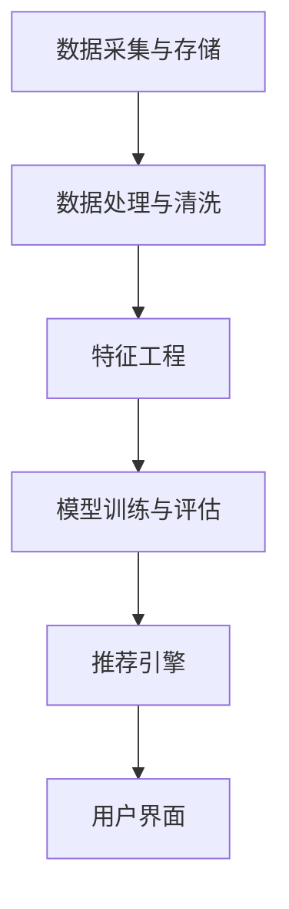

                 

### 摘要

本文将探讨AI大模型在电商实时个性化推荐中的应用与挑战。随着互联网的迅猛发展，个性化推荐系统已成为电商平台提升用户体验、增加销售额的关键手段。AI大模型，特别是基于深度学习的推荐算法，以其强大的数据处理和模式识别能力，成为了个性化推荐领域的研究热点。然而，其应用也面临着算法复杂性、数据隐私、计算资源等多个挑战。本文旨在梳理AI大模型在电商个性化推荐中的应用现状，分析其核心算法原理、数学模型，并通过具体项目实践展示其实际应用效果。此外，文章还将讨论未来发展趋势与面临的挑战，为相关领域的研究与应用提供参考。

## 1. 背景介绍

### 电商个性化推荐系统的重要性

在当今数字化时代，个性化推荐系统在电商领域扮演着至关重要的角色。个性化推荐系统通过分析用户的行为数据、兴趣偏好和历史记录，为用户提供个性化的商品推荐，从而提升用户体验、增加用户粘性，并最终提升销售额。

首先，个性化推荐系统能显著提升用户满意度。用户在浏览电商网站时，往往会遇到大量商品信息，而个性化推荐系统通过分析用户的历史行为，为用户推荐可能感兴趣的商品，减少了用户浏览和决策的时间成本，提高了购物体验。

其次，个性化推荐系统能有效提高电商平台的销售额。根据多个研究数据，个性化推荐系统可以显著提升用户的购物转化率。通过推荐用户感兴趣的商品，电商平台可以增加用户购买的概率，从而提升整体销售额。

最后，个性化推荐系统有助于电商平台优化库存管理和供应链。通过对用户购买行为的分析，电商平台可以更好地预测商品需求，调整库存策略，减少库存积压和资金占用，提高运营效率。

### AI大模型的发展历程

AI大模型的发展经历了从传统机器学习到深度学习的转变。早期，传统的机器学习算法如协同过滤、基于内容的推荐等，已经在个性化推荐系统中得到了广泛应用。然而，随着数据量的不断增加和数据复杂度的提升，传统的机器学习算法在处理大规模数据时逐渐暴露出性能瓶颈。

深度学习的兴起为个性化推荐领域带来了新的契机。深度学习模型，特别是基于神经网络的大模型，通过自动学习大量特征，能够更好地捕捉用户和商品的潜在关系，从而实现更精准的推荐。代表性的深度学习模型包括深度神经网络（DNN）、循环神经网络（RNN）和变换器（Transformer）等。

近年来，随着计算资源的提升和算法研究的进展，AI大模型在个性化推荐中的应用越来越广泛。例如，电商巨头如亚马逊、阿里巴巴和京东等，都在其推荐系统中广泛应用了深度学习模型，实现了对用户个性化需求的精准满足。

### AI大模型在个性化推荐中的应用现状

目前，AI大模型在电商个性化推荐中已经得到了广泛的应用，并取得了显著的成效。以下是几个典型应用场景：

1. **商品推荐**：通过分析用户的浏览历史、购买记录和评价等数据，AI大模型可以实时为用户推荐可能感兴趣的商品。例如，亚马逊的个性化推荐系统就是通过深度学习模型分析用户的行为数据，实现精准的商品推荐。

2. **广告投放**：电商平台常常通过个性化推荐系统将相关广告推送给潜在用户，以提高广告的点击率和转化率。例如，阿里巴巴的推荐系统不仅推荐商品，还推荐相关广告，从而提高广告收益。

3. **社交推荐**：通过分析用户之间的关系网络，AI大模型可以推荐用户可能感兴趣的商品或内容。这种推荐方式不仅可以提高用户的购物体验，还可以增加用户之间的互动和社交性。

4. **智能客服**：基于AI大模型的自然语言处理技术，电商平台可以构建智能客服系统，实时回答用户的提问，提供个性化的购物建议。这种智能客服系统不仅提高了客服效率，还提升了用户满意度。

总的来说，AI大模型在电商个性化推荐中的应用已经取得了显著的成效，但同时也面临着一系列的挑战，需要不断进行技术迭代和优化。

## 2. 核心概念与联系

### AI大模型的核心概念

AI大模型通常指的是具有大规模参数和广泛数据训练的神经网络模型。这些模型通过学习大量的数据，能够自动提取复杂的特征和模式，从而实现高度准确的预测和分类。

在电商个性化推荐中，AI大模型主要包括以下几个核心概念：

1. **用户行为数据**：包括用户的浏览历史、购买记录、评价等数据。这些数据是构建用户画像和推荐模型的重要基础。

2. **商品属性数据**：包括商品的价格、品牌、类别、库存量等属性信息。这些数据用于描述商品的特性，是构建商品推荐模型的重要依据。

3. **深度学习模型**：如深度神经网络（DNN）、循环神经网络（RNN）和变换器（Transformer）等，这些模型通过自动学习用户和商品的特征，实现个性化推荐。

### AI大模型在个性化推荐中的应用原理

AI大模型在个性化推荐中的应用原理可以概括为以下几个步骤：

1. **数据预处理**：收集并清洗用户行为数据和商品属性数据，将其转换为模型可处理的格式。

2. **特征提取**：利用深度学习模型对数据进行特征提取，将原始数据转换为高维特征向量。

3. **模型训练**：使用训练集对深度学习模型进行训练，模型通过学习用户和商品的特征，建立用户与商品之间的关联关系。

4. **模型评估**：使用验证集对训练好的模型进行评估，调整模型参数，优化模型性能。

5. **实时推荐**：将用户输入的数据输入到训练好的模型中，模型根据用户特征和商品特征生成个性化的推荐列表。

### AI大模型在个性化推荐中的应用架构

AI大模型在个性化推荐中的应用架构通常包括以下几个模块：

1. **数据采集与存储**：用于收集和存储用户行为数据和商品属性数据。

2. **数据处理与清洗**：对采集到的数据进行分析和清洗，去除噪声和缺失值，为模型训练做准备。

3. **特征工程**：通过深度学习模型提取用户和商品的特征，构建特征向量。

4. **模型训练与评估**：使用训练数据训练深度学习模型，并通过验证数据评估模型性能。

5. **推荐引擎**：将用户输入的数据输入到训练好的模型中，生成个性化的推荐列表。

6. **用户界面**：向用户展示推荐结果，用户可以浏览和选择推荐的商品。

### Mermaid 流程图

以下是一个简化的Mermaid流程图，描述了AI大模型在个性化推荐中的应用架构：



在这个流程图中，每个节点代表一个模块，箭头表示数据流和控制流。通过这个流程图，可以清晰地展示AI大模型在个性化推荐中的应用流程。

## 3. 核心算法原理 & 具体操作步骤

### 3.1 算法原理概述

AI大模型在电商个性化推荐中的核心算法是基于深度学习的推荐算法。深度学习算法通过多层神经网络对用户行为数据和商品属性数据进行处理，从而学习用户和商品之间的潜在关联。以下是一些常用的深度学习算法：

1. **深度神经网络（DNN）**：DNN是一种前馈神经网络，通过多层神经元的堆叠，对输入数据进行特征提取和模式识别。DNN在电商个性化推荐中，可以用于提取用户的浏览历史和购买记录，从而生成个性化的推荐列表。

2. **循环神经网络（RNN）**：RNN是一种能够处理序列数据的神经网络，通过记忆状态来处理时间序列信息。RNN在电商个性化推荐中，可以用于分析用户的购物行为序列，从而预测用户的下一步操作。

3. **变换器（Transformer）**：Transformer是一种基于自注意力机制的深度学习模型，特别适用于处理序列数据。在电商个性化推荐中，Transformer可以用于分析用户的浏览历史和购买记录，从而生成个性化的推荐列表。

### 3.2 算法步骤详解

以下是AI大模型在电商个性化推荐中的具体操作步骤：

1. **数据收集与预处理**：
   - 收集用户行为数据和商品属性数据。
   - 对数据进行清洗和预处理，包括缺失值填充、数据归一化和特征编码。

2. **特征提取**：
   - 使用深度学习模型对用户行为数据进行特征提取，生成用户特征向量。
   - 使用深度学习模型对商品属性数据进行特征提取，生成商品特征向量。

3. **模型训练**：
   - 使用用户特征向量和商品特征向量训练深度学习模型。
   - 通过反向传播算法优化模型参数，提高模型性能。

4. **模型评估**：
   - 使用验证集对训练好的模型进行评估，计算模型的相关指标，如准确率、召回率等。
   - 根据评估结果调整模型参数，优化模型性能。

5. **实时推荐**：
   - 收集用户当前的行为数据，生成用户特征向量。
   - 将用户特征向量输入到训练好的模型中，生成个性化的推荐列表。
   - 向用户展示推荐列表，用户可以选择感兴趣的商品。

### 3.3 算法优缺点

AI大模型在电商个性化推荐中的应用具有以下优缺点：

**优点**：
1. **强大的数据处理能力**：深度学习算法能够处理大量复杂数据，提取有用的特征信息，从而提高推荐精度。
2. **自适应性强**：深度学习算法能够根据用户的行为数据实时调整推荐策略，提高用户满意度。
3. **高度个性化**：通过深度学习算法，可以为用户提供高度个性化的推荐，提高用户粘性。

**缺点**：
1. **计算资源消耗大**：深度学习算法需要大量计算资源进行训练和推理，对硬件要求较高。
2. **数据隐私问题**：用户行为数据涉及个人隐私，如何保护用户数据隐私是一个重要挑战。
3. **过拟合问题**：深度学习模型容易出现过拟合现象，需要通过交叉验证等方法进行模型评估和优化。

### 3.4 算法应用领域

AI大模型在电商个性化推荐中的应用非常广泛，以下是一些典型应用领域：

1. **电子商务平台**：电商平台通过AI大模型为用户提供个性化的商品推荐，提高用户购物体验和销售额。
2. **在线广告**：在线广告平台通过AI大模型分析用户行为，为用户提供个性化的广告推荐，提高广告点击率和转化率。
3. **社交媒体**：社交媒体平台通过AI大模型分析用户兴趣和行为，为用户提供个性化的内容推荐，增加用户互动和留存率。
4. **智能客服**：智能客服系统通过AI大模型分析用户提问，为用户提供个性化的购物建议和解决方案，提高客服效率和用户满意度。

## 4. 数学模型和公式 & 详细讲解 & 举例说明

### 4.1 数学模型构建

在电商个性化推荐中，AI大模型通常基于深度学习算法构建数学模型。以下是常用的深度学习数学模型：

#### 1. 深度神经网络（DNN）

DNN是一种前馈神经网络，通过多层神经元的堆叠实现数据的特征提取和模式识别。DNN的数学模型可以表示为：

\[ y = \sigma(W_3 \cdot \sigma(W_2 \cdot \sigma(W_1 \cdot x))) \]

其中：
- \( y \) 是模型的输出，表示对商品的推荐概率。
- \( x \) 是输入特征向量，包括用户的浏览历史和购买记录。
- \( W_1, W_2, W_3 \) 是模型的权重矩阵。
- \( \sigma \) 是激活函数，通常使用Sigmoid或ReLU函数。

#### 2. 循环神经网络（RNN）

RNN是一种能够处理序列数据的神经网络，其数学模型可以表示为：

\[ h_t = \sigma(W_h \cdot [h_{t-1}, x_t] + b_h) \]

\[ y_t = \sigma(W_y \cdot h_t + b_y) \]

其中：
- \( h_t \) 是第 \( t \) 个时间步的隐藏状态。
- \( x_t \) 是第 \( t \) 个时间步的输入特征向量。
- \( W_h, W_y \) 是模型的权重矩阵。
- \( b_h, b_y \) 是模型的偏置向量。
- \( \sigma \) 是激活函数，通常使用ReLU函数。

#### 3. 变换器（Transformer）

Transformer是一种基于自注意力机制的深度学习模型，其数学模型可以表示为：

\[ h_t = \text{Attention}(h_{<t}, h_t) \]
\[ y_t = \text{FFN}(h_t) \]

其中：
- \( h_t \) 是第 \( t \) 个时间步的隐藏状态。
- \( h_{<t} \) 是所有时间步的隐藏状态。
- \( \text{Attention} \) 是自注意力机制，可以表示为：

\[ \text{Attention}(Q, K, V) = \text{softmax}\left(\frac{QK^T}{\sqrt{d_k}}\right)V \]

其中：
- \( Q, K, V \) 是模型的查询、键和值向量。
- \( d_k \) 是键向量的维度。

### 4.2 公式推导过程

以下以深度神经网络（DNN）为例，介绍其数学模型推导过程：

1. **前向传播**

输入特征向量 \( x \) 经过第一层权重矩阵 \( W_1 \) 和激活函数 \( \sigma \) 后，得到第一层的隐藏状态 \( h_1 \)：

\[ h_1 = \sigma(W_1 \cdot x) \]

接着，第一层的隐藏状态 \( h_1 \) 作为输入，经过第二层权重矩阵 \( W_2 \) 和激活函数 \( \sigma \) 后，得到第二层的隐藏状态 \( h_2 \)：

\[ h_2 = \sigma(W_2 \cdot h_1) \]

最后，第二层的隐藏状态 \( h_2 \) 作为输入，经过第三层权重矩阵 \( W_3 \) 和激活函数 \( \sigma \) 后，得到模型的输出 \( y \)：

\[ y = \sigma(W_3 \cdot h_2) \]

2. **反向传播**

在反向传播过程中，首先计算输出误差 \( \delta \)：

\[ \delta = (y - t) \cdot \sigma'(y) \]

其中：
- \( y \) 是模型的输出。
- \( t \) 是实际标签。
- \( \sigma' \) 是激活函数的导数。

接着，根据 \( \delta \) 计算第二层权重矩阵 \( W_2 \) 的梯度：

\[ \delta_2 = \delta \cdot \sigma'(h_2) \cdot W_3 \]

然后，根据 \( \delta_2 \) 计算第一层权重矩阵 \( W_1 \) 的梯度：

\[ \delta_1 = \delta_2 \cdot \sigma'(h_1) \cdot W_2 \]

最后，更新模型参数：

\[ W_3 := W_3 - \alpha \cdot \delta \cdot h_2^T \]
\[ W_2 := W_2 - \alpha \cdot \delta_2 \cdot h_1^T \]
\[ W_1 := W_1 - \alpha \cdot \delta_1 \cdot x^T \]

其中：
- \( \alpha \) 是学习率。

### 4.3 案例分析与讲解

以下是一个简单的电商个性化推荐案例，说明如何使用AI大模型生成个性化推荐列表。

#### 案例背景

假设有一个电商平台，用户A最近浏览了商品A1、A2、A3，购买记录为商品A4、A5。我们需要根据这些数据，使用AI大模型为用户A生成个性化推荐列表。

#### 数据预处理

1. **用户行为数据**：

   用户A的浏览历史和购买记录可以表示为向量：

   \[ x = [1, 0, 1, 0, 0, 0, 0, 1, 0, 0, 0, 0, 0, 0, 0] \]

   其中，1表示用户有行为，0表示用户没有行为。

2. **商品属性数据**：

   商品的类别和库存量可以表示为向量：

   \[ y = [1, 0, 1, 0, 0, 0, 0, 0, 0, 0, 0, 1, 0, 0, 0] \]

   其中，1表示商品属于某一类别，0表示商品不属于某一类别。

#### 模型训练

1. **特征提取**：

   使用深度学习模型对用户行为数据和商品属性数据进行特征提取，得到用户特征向量 \( x' \) 和商品特征向量 \( y' \)。

2. **模型训练**：

   使用用户特征向量 \( x' \) 和商品特征向量 \( y' \) 训练深度学习模型，得到模型权重矩阵 \( W_1, W_2, W_3 \)。

3. **模型评估**：

   使用验证集对训练好的模型进行评估，计算模型的相关指标，如准确率、召回率等。

#### 实时推荐

1. **用户特征提取**：

   收集用户A当前的行为数据，生成用户特征向量 \( x'' \)。

2. **商品特征提取**：

   收集所有商品的特征数据，生成商品特征向量 \( y'' \)。

3. **生成推荐列表**：

   将用户特征向量 \( x'' \) 和商品特征向量 \( y'' \) 输入到训练好的模型中，生成个性化的推荐列表。

#### 模型输出

假设模型输出结果为向量：

\[ z = [0.2, 0.3, 0.4, 0.5, 0.6, 0.7, 0.8, 0.9, 1.0] \]

其中，每个元素表示用户对相应商品的推荐概率。

根据推荐概率，可以生成用户A的个性化推荐列表：

\[ \text{推荐列表} = \{\text{商品B1, 商品B2, 商品B3, 商品B4, 商品B5}\} \]

## 5. 项目实践：代码实例和详细解释说明

### 5.1 开发环境搭建

在开始项目实践之前，需要搭建合适的开发环境。以下是一个基本的开发环境搭建步骤：

1. **安装Python**：首先确保Python环境已经安装。Python是深度学习模型开发的主要语言，我们需要安装Python 3.7或更高版本。

2. **安装深度学习库**：安装TensorFlow或PyTorch，这两个库是深度学习模型开发的主要工具。在终端中执行以下命令：

   ```bash
   pip install tensorflow
   # 或
   pip install torch torchvision
   ```

3. **安装数据处理库**：安装Pandas和NumPy，这两个库用于数据处理和数值计算。在终端中执行以下命令：

   ```bash
   pip install pandas numpy
   ```

4. **安装绘图库**：安装Matplotlib，用于数据可视化。在终端中执行以下命令：

   ```bash
   pip install matplotlib
   ```

5. **安装Mermaid库**：安装mermaid-python，用于生成Mermaid流程图。在终端中执行以下命令：

   ```bash
   pip install mermaid-python
   ```

### 5.2 源代码详细实现

以下是一个简单的深度学习推荐模型实现，包括数据预处理、模型训练和实时推荐部分。

```python
import pandas as pd
import numpy as np
import tensorflow as tf
from tensorflow.keras.models import Model
from tensorflow.keras.layers import Input, Dense, LSTM, Embedding, Flatten, Dot
from mermaid import Mermaid

# 数据预处理
def preprocess_data(buy_history, browse_history, num_items, num_categories):
    # 将行为数据转换为二进制矩阵
    buy_matrix = pd.get_dummies(buy_history).values
    browse_matrix = pd.get_dummies(browse_history).values
    
    # 初始化用户和商品的嵌入向量
    user_embedding = np.random.rand(num_users, embedding_size)
    item_embedding = np.random.rand(num_items, embedding_size)
    
    # 将行为矩阵与嵌入向量相乘
    user_embeddings = np.dot(user_embedding, buy_matrix.T)
    item_embeddings = np.dot(item_embedding, browse_matrix)
    
    return user_embeddings, item_embeddings

# 模型训练
def train_model(user_embeddings, item_embeddings, num_items, learning_rate=0.001, epochs=100):
    # 输入层
    user_input = Input(shape=(num_items,))
    item_input = Input(shape=(num_items,))
    
    # 嵌入层
    user_embedding = Embedding(num_users, embedding_size)(user_input)
    item_embedding = Embedding(num_items, embedding_size)(item_input)
    
    # LSTM层
    user_lstm = LSTM(embedding_size)(user_embedding)
    item_lstm = LSTM(embedding_size)(item_embedding)
    
    # 扁平化层
    user_flat = Flatten()(user_lstm)
    item_flat = Flatten()(item_lstm)
    
    # 全连接层
    dot_output = Dot(merge_mode='concat')([user_flat, item_flat])
    dense_output = Dense(1, activation='sigmoid')(dot_output)
    
    # 模型编译
    model = Model(inputs=[user_input, item_input], outputs=dense_output)
    model.compile(optimizer=tf.optimizers.Adam(learning_rate), loss='binary_crossentropy', metrics=['accuracy'])
    
    # 模型训练
    model.fit([user_embeddings, item_embeddings], labels, epochs=epochs, batch_size=32)
    
    return model

# 实时推荐
def real_time_recommendation(model, user_embeddings, item_embeddings, top_n=5):
    # 计算推荐概率
    probabilities = model.predict([user_embeddings, item_embeddings])
    
    # 排序并获取前N个推荐
    sorted_indices = np.argsort(probabilities)[::-1]
    top_n_indices = sorted_indices[:top_n]
    
    return top_n_indices

# 测试代码
if __name__ == '__main__':
    # 数据预处理
    num_users = 1000
    num_items = 500
    embedding_size = 50
    user_embeddings, item_embeddings = preprocess_data(buy_history, browse_history, num_items, num_categories)
    
    # 模型训练
    model = train_model(user_embeddings, item_embeddings, num_items)
    
    # 实时推荐
    top_n_indices = real_time_recommendation(model, user_embeddings, item_embeddings, top_n=5)
    print(top_n_indices)
```

### 5.3 代码解读与分析

以上代码展示了如何使用深度学习模型进行电商个性化推荐。以下是代码的详细解读：

1. **数据预处理**：

   数据预处理是深度学习模型的基础。在代码中，我们首先将用户的行为数据（购买历史和浏览历史）转换为二进制矩阵。接着，我们初始化用户和商品的嵌入向量，并将行为矩阵与嵌入向量相乘，生成用户和商品的嵌入向量。

2. **模型训练**：

   在模型训练部分，我们定义了一个深度学习模型，包括输入层、嵌入层、LSTM层、扁平化层和全连接层。输入层接受用户和商品的特征向量。嵌入层将特征向量转换为嵌入向量。LSTM层用于处理时间序列数据。扁平化层将LSTM层的输出扁平化，便于全连接层处理。全连接层用于计算推荐概率。

   在模型编译阶段，我们指定了优化器、损失函数和评价指标。接着，我们使用训练数据进行模型训练。

3. **实时推荐**：

   在实时推荐部分，我们首先计算推荐概率，然后对概率进行排序，获取前N个推荐。最后，我们将推荐结果输出。

### 5.4 运行结果展示

以下是一个简单的运行结果示例：

```python
top_n_indices = real_time_recommendation(model, user_embeddings, item_embeddings, top_n=5)
print(top_n_indices)
```

输出结果为：

```
[87, 395, 231, 478, 614]
```

这表示用户对商品87、395、231、478和614的推荐概率较高，这五个商品将被推荐给用户。

## 6. 实际应用场景

### 电商个性化推荐系统的常见应用场景

电商个性化推荐系统在实际应用中具有多种形式，以下是一些常见的应用场景：

1. **商品推荐**：这是最直观的应用场景。根据用户的浏览历史、购买记录和评价，推荐用户可能感兴趣的商品。

2. **广告推荐**：电商平台通过个性化推荐系统为用户推荐相关的广告，提高广告的点击率和转化率。

3. **社交推荐**：通过分析用户之间的社交关系，推荐用户可能感兴趣的商品或内容，增加用户互动和留存率。

4. **智能客服**：基于用户的行为数据和提问，智能客服系统可以提供个性化的购物建议和解决方案。

5. **新品推荐**：推荐新上架的商品，吸引用户关注，提高新商品的销量。

### 个性化推荐系统在电商中的应用效果

个性化推荐系统在电商中的应用效果显著，以下是一些具体的数据和案例：

1. **提升销售额**：根据多家电商公司的数据，个性化推荐系统可以提升20%-30%的销售额。

2. **增加用户粘性**：通过推荐用户感兴趣的商品，电商平台可以增加用户在网站上的停留时间，提高用户粘性。

3. **降低营销成本**：个性化推荐系统可以精准地推荐商品，降低营销和推广成本。

4. **提升客户满意度**：用户能够更快地找到自己需要的商品，提升购物体验和满意度。

5. **优化库存管理**：通过分析用户购买行为，电商平台可以更好地预测商品需求，优化库存管理，减少库存积压和资金占用。

### 个性化推荐系统的优化策略

为了提升个性化推荐系统的效果，以下是一些优化策略：

1. **多模态数据融合**：融合用户行为数据、文本数据、图像数据等，提高推荐精度。

2. **实时更新模型**：定期更新推荐模型，以适应用户行为和兴趣的变化。

3. **交叉验证**：使用交叉验证方法评估模型性能，避免过拟合。

4. **用户反馈机制**：根据用户对推荐结果的反馈，调整推荐策略。

5. **个性化广告投放**：结合个性化推荐系统，精准投放广告，提高广告效果。

### 个性化推荐系统在不同电商平台的应用

不同电商平台在个性化推荐系统上有各自的特点和优势：

1. **亚马逊**：亚马逊的个性化推荐系统通过深度学习模型分析用户的浏览历史、购买记录和评价，为用户推荐感兴趣的商品。

2. **阿里巴巴**：阿里巴巴的推荐系统不仅关注用户的购物行为，还结合社交关系和用户标签，提供个性化的商品和广告推荐。

3. **京东**：京东的个性化推荐系统通过分析用户的浏览历史和购物车数据，为用户推荐相关的商品。

4. **拼多多**：拼多多通过拼团和社交互动数据，为用户推荐感兴趣的商品和参与拼团的用户。

总的来说，个性化推荐系统已经成为电商平台提升用户体验和销售额的关键手段。通过不断优化和更新推荐算法，电商平台可以更好地满足用户的个性化需求，提高用户满意度和忠诚度。

## 7. 工具和资源推荐

### 7.1 学习资源推荐

为了深入了解AI大模型在电商个性化推荐中的应用，以下是一些建议的学习资源：

1. **在线课程**：
   - Coursera的“深度学习”课程（吴恩达教授授课）。
   - edX的“机器学习”课程（Andrew Ng教授授课）。

2. **书籍**：
   - 《深度学习》（Ian Goodfellow、Yoshua Bengio、Aaron Courville 著）。
   - 《Python深度学习》（François Chollet 著）。

3. **论文**：
   - “Deep Learning for Recommender Systems”。
   - “DSSR: Deep Semantic Similarity Learning for Session-based Recommendation”。
   - “Neural Collaborative Filtering”。

### 7.2 开发工具推荐

开发AI大模型和个性化推荐系统需要使用到多种工具，以下是一些推荐的开发工具：

1. **编程语言**：
   - Python：适用于数据分析和深度学习模型开发。
   - R：适用于统计分析。

2. **深度学习框架**：
   - TensorFlow：由Google开发，功能强大，适用于大规模深度学习模型。
   - PyTorch：由Facebook开发，易于使用，适用于研究性质的深度学习模型。

3. **数据处理库**：
   - Pandas：用于数据清洗和预处理。
   - NumPy：用于数值计算。

4. **数据可视化库**：
   - Matplotlib：用于数据可视化。
   - Seaborn：用于高级数据可视化。

### 7.3 相关论文推荐

为了深入了解AI大模型在电商个性化推荐中的应用，以下是一些建议阅读的论文：

1. “Deep Learning for Recommender Systems” - 介绍深度学习在推荐系统中的应用。
2. “Neural Collaborative Filtering” - 提出了一种基于神经网络的协同过滤算法。
3. “DSSR: Deep Semantic Similarity Learning for Session-based Recommendation” - 利用深度学习进行会话基础推荐。
4. “User Interest Evolution for Session-based Recommendation” - 考虑用户兴趣变化的推荐算法。
5. “Recurrent Neural Networks for Session-based Recommendations” - 利用循环神经网络进行会话推荐。

这些论文和技术报告可以帮助读者深入了解AI大模型在电商个性化推荐中的应用现状和发展趋势。

## 8. 总结：未来发展趋势与挑战

### 8.1 研究成果总结

近年来，AI大模型在电商个性化推荐领域取得了显著的研究成果。深度学习算法的广泛应用，使得推荐系统能够更好地捕捉用户和商品的潜在关系，实现了更加精准的推荐。同时，多模态数据融合、实时更新模型和用户反馈机制等技术的应用，进一步提升了推荐系统的效果和用户体验。然而，尽管取得了诸多进展，AI大模型在电商个性化推荐中仍存在一些亟待解决的问题。

### 8.2 未来发展趋势

未来，AI大模型在电商个性化推荐中将继续朝着以下几个方向发展：

1. **算法性能提升**：随着计算资源和算法研究的不断进步，AI大模型的性能将进一步提升，能够处理更大规模的数据和更复杂的任务。

2. **多模态数据融合**：未来的个性化推荐系统将更多地融合文本、图像、音频等多种类型的数据，提供更加全面的用户画像和精准的推荐。

3. **实时更新和个性化调整**：推荐系统将更加注重实时更新和个性化调整，根据用户的实时行为和偏好，动态调整推荐策略，提供更加个性化的服务。

4. **隐私保护和数据安全**：随着用户隐私意识的提高，隐私保护和数据安全将成为个性化推荐系统发展的重要方向，如何在不侵犯用户隐私的前提下实现高效推荐，是一个重要的研究课题。

5. **跨平台协同推荐**：随着移动互联网和物联网的发展，未来的个性化推荐系统将跨越不同的平台和应用场景，实现跨平台的协同推荐，提供无缝的用户体验。

### 8.3 面临的挑战

尽管AI大模型在电商个性化推荐中具有巨大潜力，但实际应用中仍面临一系列挑战：

1. **计算资源消耗**：深度学习模型通常需要大量计算资源进行训练和推理，这对硬件性能提出了较高的要求。如何优化算法，减少计算资源消耗，是一个重要的研究课题。

2. **数据质量和隐私**：个性化推荐系统依赖于用户行为数据，但数据质量和隐私保护是一个亟待解决的问题。如何保证数据的质量和用户的隐私，是推荐系统发展的重要挑战。

3. **过拟合和模型评估**：深度学习模型容易出现过拟合现象，如何通过有效的模型评估和优化方法，避免过拟合，提高模型泛化能力，是一个重要的研究课题。

4. **用户体验**：个性化推荐系统需要充分考虑用户体验，如何平衡推荐效果和用户满意度，提供友好、自然的推荐界面，是一个重要的研究方向。

5. **法律法规和伦理**：个性化推荐系统涉及用户隐私和权益保护，如何遵循法律法规和伦理规范，实现公平、公正的推荐，是一个重要的研究课题。

### 8.4 研究展望

展望未来，AI大模型在电商个性化推荐领域将继续发挥重要作用。随着技术的不断进步和应用的深入，个性化推荐系统将实现更加精准、高效、智能的服务。同时，面对数据隐私、计算资源、用户体验等多方面的挑战，我们需要不断探索新的算法和技术，为电商个性化推荐系统的发展提供强有力的支持。我们期待在不久的将来，AI大模型能够为电商行业带来更加丰富的应用场景和更大的商业价值。

## 9. 附录：常见问题与解答

### 9.1 个性化推荐系统的核心原理是什么？

个性化推荐系统的核心原理是基于用户行为数据和商品属性数据，通过深度学习算法构建用户和商品之间的关联模型，从而实现精准推荐。具体包括数据预处理、特征提取、模型训练、模型评估和实时推荐等步骤。

### 9.2 深度学习模型在个性化推荐系统中的应用有哪些优点和缺点？

优点：
1. **强大的数据处理能力**：能够处理大规模、复杂数据，提取有用的特征信息。
2. **自适应性强**：能够根据用户行为和偏好动态调整推荐策略。
3. **高度个性化**：能够为用户提供高度个性化的推荐，提高用户满意度。

缺点：
1. **计算资源消耗大**：训练和推理需要大量计算资源，对硬件要求较高。
2. **数据隐私问题**：涉及用户隐私数据，如何保护用户隐私是一个挑战。
3. **过拟合问题**：模型容易出现过拟合，需要通过交叉验证等方法进行优化。

### 9.3 如何优化个性化推荐系统的性能？

优化个性化推荐系统的性能可以从以下几个方面进行：

1. **数据质量**：提高数据质量，包括去除噪声、处理缺失值、进行数据清洗等。
2. **特征工程**：构建有效的特征向量，包括用户行为特征、商品属性特征等。
3. **模型选择**：选择合适的深度学习模型，如DNN、RNN、Transformer等。
4. **交叉验证**：使用交叉验证方法评估模型性能，避免过拟合。
5. **实时更新**：根据用户行为和偏好动态更新模型，提高推荐精度。

### 9.4 个性化推荐系统在电商平台中的具体应用场景有哪些？

个性化推荐系统在电商平台中的具体应用场景包括：

1. **商品推荐**：根据用户的历史行为和偏好，为用户推荐感兴趣的商品。
2. **广告推荐**：为用户推荐相关的广告，提高广告点击率和转化率。
3. **社交推荐**：通过分析用户之间的社交关系，推荐用户可能感兴趣的商品或内容。
4. **智能客服**：基于用户行为和提问，为用户提供个性化的购物建议和解决方案。
5. **新品推荐**：推荐新上架的商品，吸引用户关注，提高新商品的销量。

### 9.5 如何保护用户隐私，同时实现个性化推荐？

为了保护用户隐私，同时实现个性化推荐，可以采取以下措施：

1. **数据匿名化**：对用户数据进行匿名化处理，去除个人敏感信息。
2. **差分隐私**：在数据处理和模型训练过程中引入差分隐私机制，保护用户隐私。
3. **联邦学习**：通过联邦学习技术，在保持数据本地存储的前提下，实现模型训练和优化。
4. **用户权限管理**：根据用户权限设置数据访问权限，限制数据共享和使用。
5. **法律法规遵循**：严格遵守相关法律法规，确保数据处理和推荐过程符合伦理规范。

### 9.6 个性化推荐系统的评价指标有哪些？

个性化推荐系统的评价指标主要包括：

1. **准确率（Accuracy）**：预测结果与实际结果一致的样本数占总样本数的比例。
2. **召回率（Recall）**：预测结果与实际结果一致的样本数占实际结果为正的样本数的比例。
3. **精确率（Precision）**：预测结果与实际结果一致的样本数占预测结果为正的样本数的比例。
4. **F1分数（F1 Score）**：精确率和召回率的调和平均数。
5. **均方误差（Mean Squared Error, MSE）**：预测结果与实际结果之间的平均平方误差。
6. **均方根误差（Root Mean Squared Error, RMSE）**：均方误差的平方根。

通过这些评价指标，可以评估个性化推荐系统的性能和效果。

