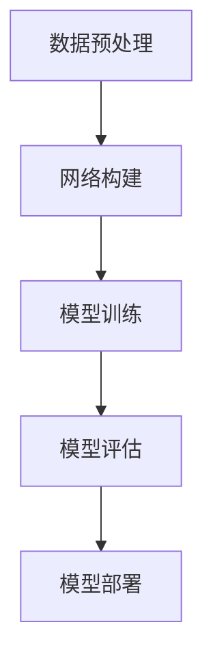

                 

关键词：人工智能，大模型，电商平台，供应链预测，深度学习，数学模型，代码实例，应用展望

摘要：本文介绍了人工智能领域中的大模型在电商平台供应链预测中的应用。通过详细阐述大模型的原理、算法、数学模型以及具体实现，探讨了其在供应链预测中的优势和应用场景，并对未来发展趋势和面临的挑战进行了展望。

## 1. 背景介绍

随着电商平台的快速发展，供应链管理成为企业运营的核心问题。供应链预测的准确性直接影响企业的库存水平、物流成本和客户满意度。传统的供应链预测方法主要依赖于统计模型和经验规则，而随着人工智能技术的进步，尤其是大模型的兴起，为供应链预测提供了新的思路。

大模型，也称为深度学习模型，是一种通过多层神经网络进行训练的复杂算法。它能够从大量数据中自动提取特征，进行抽象和归纳，从而实现高度准确的预测。近年来，大模型在图像识别、自然语言处理、语音识别等领域取得了显著的成果，其在供应链预测中的应用也受到了广泛关注。

本文将介绍大模型在电商平台供应链预测中的应用，包括其原理、算法、数学模型和具体实现，并探讨其在实际应用中的优势和挑战。

## 2. 核心概念与联系

### 2.1 大模型原理

大模型，即深度学习模型，主要由多个神经网络层组成，包括输入层、隐藏层和输出层。通过逐层前向传播和反向传播算法，大模型可以从输入数据中自动提取特征，进行抽象和归纳，从而实现复杂函数的逼近。

### 2.2 算法架构

大模型的算法架构通常包括以下步骤：

1. 数据预处理：对输入数据进行归一化、去噪、缺失值处理等操作，确保数据质量。
2. 网络构建：根据预测任务的需求，设计合适的神经网络结构，包括层数、每层的神经元个数等。
3. 模型训练：通过梯度下降算法，利用大量训练数据对模型进行优化，使模型输出结果更接近真实值。
4. 模型评估：使用验证集和测试集评估模型性能，包括准确率、召回率、F1分数等指标。
5. 模型部署：将训练好的模型部署到生产环境中，进行实时预测。

### 2.3 Mermaid 流程图



## 3. 核心算法原理 & 具体操作步骤

### 3.1 算法原理概述

大模型的算法原理基于多层神经网络，通过逐层提取特征，实现对输入数据的抽象和归纳。具体包括以下步骤：

1. 输入数据：输入一组具有多个特征的样本数据。
2. 层间传播：将输入数据通过输入层传递到隐藏层，经过激活函数处理后，传递到下一层。
3. 特征提取：在隐藏层中，数据经过多次传递和变换，逐步提取出更高层次的特征。
4. 输出预测：将隐藏层输出的特征通过输出层进行分类或回归预测。

### 3.2 算法步骤详解

1. 数据预处理：对输入数据进行归一化、去噪、缺失值处理等操作，确保数据质量。

2. 网络构建：设计合适的神经网络结构，包括层数、每层的神经元个数等。常见结构包括全连接网络、卷积神经网络（CNN）、循环神经网络（RNN）等。

3. 模型训练：通过梯度下降算法，利用大量训练数据对模型进行优化，使模型输出结果更接近真实值。训练过程中，需要调整网络参数，包括学习率、正则化参数等。

4. 模型评估：使用验证集和测试集评估模型性能，包括准确率、召回率、F1分数等指标。根据评估结果调整模型参数，优化模型性能。

5. 模型部署：将训练好的模型部署到生产环境中，进行实时预测。部署过程中，需要考虑模型的可扩展性、实时性、可靠性等因素。

### 3.3 算法优缺点

**优点：**

1. 强大的特征提取能力：大模型能够从大量数据中自动提取特征，实现高度准确的预测。
2. 自适应调整：大模型可以根据不同场景和数据特点，自适应调整网络结构和参数，提高预测效果。
3. 广泛的应用领域：大模型在图像识别、自然语言处理、语音识别等领域取得了显著成果，可以广泛应用于各种预测任务。

**缺点：**

1. 计算资源消耗大：大模型通常需要大量的计算资源和时间进行训练和部署，对硬件设备要求较高。
2. 数据需求量大：大模型需要大量高质量的数据进行训练，数据获取和处理成本较高。
3. 解释性差：大模型的工作原理复杂，难以解释，导致预测结果的可解释性较低。

### 3.4 算法应用领域

大模型在供应链预测中的应用主要包括以下领域：

1. 库存预测：通过大模型预测未来一段时间内的库存需求，帮助企业合理安排库存水平，降低库存成本。
2. 物流预测：通过大模型预测未来一段时间内的物流需求，帮助企业合理安排物流资源，提高物流效率。
3. 销售预测：通过大模型预测未来一段时间内的销售情况，帮助企业制定销售策略，提高销售额。

## 4. 数学模型和公式 & 详细讲解 & 举例说明

### 4.1 数学模型构建

大模型的数学模型主要包括以下两部分：

1. 神经网络模型：描述神经网络的结构和参数。
2. 损失函数：衡量模型预测结果与真实值之间的差异。

#### 神经网络模型

神经网络模型通常表示为：

$$
\hat{y} = f(\mathbf{W}^T \cdot \mathbf{h}^{(L-1)}) \cdot \mathbf{h}^{(L)}
$$

其中，$\hat{y}$ 为预测输出，$f$ 为激活函数，$\mathbf{W}^T$ 为权重矩阵，$\mathbf{h}^{(L-1)}$ 和 $\mathbf{h}^{(L)}$ 分别为第 $L-1$ 层和第 $L$ 层的神经元输出。

#### 损失函数

损失函数通常使用均方误差（MSE）：

$$
J(\theta) = \frac{1}{2m} \sum_{i=1}^{m} (\hat{y}_i - y_i)^2
$$

其中，$J(\theta)$ 为损失函数，$\theta$ 为模型参数，$\hat{y}_i$ 和 $y_i$ 分别为第 $i$ 个样本的预测值和真实值。

### 4.2 公式推导过程

大模型的训练过程主要包括以下步骤：

1. 前向传播：根据当前模型参数，计算输入数据的输出。
2. 反向传播：计算损失函数关于模型参数的梯度，更新模型参数。
3. 优化算法：利用梯度下降算法或其他优化算法，迭代更新模型参数。

#### 前向传播

假设当前模型参数为 $\theta$，输入数据为 $\mathbf{x}$，隐藏层输出为 $\mathbf{h}^{(l)}$，输出层输出为 $\mathbf{y}^{\hat{}}$，则有：

$$
\mathbf{h}^{(l)} = \sigma(\mathbf{W}^{(l)} \cdot \mathbf{h}^{(l-1)} + b^{(l)})
$$

$$
\mathbf{y}^{\hat{}} = \sigma(\mathbf{W}^{(L)} \cdot \mathbf{h}^{(L-1)} + b^{(L)})
$$

其中，$\sigma$ 为激活函数，$\mathbf{W}^{(l)}$ 和 $b^{(l)}$ 分别为第 $l$ 层的权重和偏置。

#### 反向传播

假设当前模型参数为 $\theta$，损失函数为 $J(\theta)$，则损失函数关于模型参数的梯度为：

$$
\frac{\partial J(\theta)}{\partial \theta} = \frac{1}{m} \sum_{i=1}^{m} \frac{\partial J(\theta)}{\partial \hat{y}_i} \frac{\partial \hat{y}_i}{\partial \theta}
$$

根据链式法则，有：

$$
\frac{\partial J(\theta)}{\partial \theta} = \frac{1}{m} \sum_{i=1}^{m} (\hat{y}_i - y_i) \cdot \frac{\partial \hat{y}_i}{\partial \theta}
$$

#### 梯度下降

利用梯度下降算法，有：

$$
\theta = \theta - \alpha \cdot \frac{\partial J(\theta)}{\partial \theta}
$$

其中，$\alpha$ 为学习率。

### 4.3 案例分析与讲解

#### 案例一：线性回归

假设输入数据为 $\mathbf{x}$，输出数据为 $\mathbf{y}$，模型参数为 $\theta$，损失函数为 MSE，则有：

$$
J(\theta) = \frac{1}{2m} \sum_{i=1}^{m} (\hat{y}_i - y_i)^2
$$

前向传播：

$$
\hat{y}_i = \theta \cdot x_i
$$

反向传播：

$$
\frac{\partial J(\theta)}{\partial \theta} = \frac{1}{m} \sum_{i=1}^{m} (y_i - \theta \cdot x_i) \cdot x_i
$$

梯度下降：

$$
\theta = \theta - \alpha \cdot \frac{1}{m} \sum_{i=1}^{m} (y_i - \theta \cdot x_i) \cdot x_i
$$

#### 案例二：多层感知机

假设输入数据为 $\mathbf{x}$，输出数据为 $\mathbf{y}$，模型参数为 $\theta$，损失函数为 MSE，则有：

$$
J(\theta) = \frac{1}{2m} \sum_{i=1}^{m} (\hat{y}_i - y_i)^2
$$

前向传播：

$$
\mathbf{h}^{(1)} = \sigma(\mathbf{W}^{(1)} \cdot \mathbf{x} + b^{(1)})
$$

$$
\mathbf{h}^{(2)} = \sigma(\mathbf{W}^{(2)} \cdot \mathbf{h}^{(1)} + b^{(2)})
$$

$$
\hat{y}_i = \sigma(\mathbf{W}^{(3)} \cdot \mathbf{h}^{(2)} + b^{(3)})
$$

反向传播：

$$
\frac{\partial J(\theta)}{\partial \theta} = \frac{1}{m} \sum_{i=1}^{m} (\hat{y}_i - y_i) \cdot \frac{\partial \hat{y}_i}{\partial \theta}
$$

$$
\frac{\partial J(\theta)}{\partial \theta} = \frac{1}{m} \sum_{i=1}^{m} (\hat{y}_i - y_i) \cdot \sigma'(\mathbf{h}^{(2)}) \cdot \mathbf{W}^{(3)} \cdot \sigma'(\mathbf{h}^{(1)}) \cdot \mathbf{W}^{(1)} \cdot \mathbf{x}
$$

梯度下降：

$$
\theta = \theta - \alpha \cdot \frac{1}{m} \sum_{i=1}^{m} (\hat{y}_i - y_i) \cdot \sigma'(\mathbf{h}^{(2)}) \cdot \mathbf{W}^{(3)} \cdot \sigma'(\mathbf{h}^{(1)}) \cdot \mathbf{W}^{(1)} \cdot \mathbf{x}
$$

## 5. 项目实践：代码实例和详细解释说明

### 5.1 开发环境搭建

在本文的代码实例中，我们使用 Python 作为编程语言，并结合 TensorFlow 深度学习框架进行实现。以下为开发环境的搭建步骤：

1. 安装 Python 3.7 或更高版本。
2. 安装 TensorFlow：`pip install tensorflow`。
3. 安装 NumPy、Pandas 等常用库：`pip install numpy pandas`。

### 5.2 源代码详细实现

以下为本文的核心代码实现：

```python
import tensorflow as tf
import numpy as np
import pandas as pd

# 数据预处理
def preprocess_data(data):
    # 归一化
    data_normalized = (data - np.mean(data)) / np.std(data)
    return data_normalized

# 网络构建
def build_model(input_shape):
    model = tf.keras.Sequential([
        tf.keras.layers.Dense(64, activation='relu', input_shape=input_shape),
        tf.keras.layers.Dense(64, activation='relu'),
        tf.keras.layers.Dense(1)
    ])
    return model

# 模型训练
def train_model(model, x_train, y_train, epochs=10):
    model.compile(optimizer='adam', loss='mse')
    model.fit(x_train, y_train, epochs=epochs)
    return model

# 模型评估
def evaluate_model(model, x_test, y_test):
    loss = model.evaluate(x_test, y_test)
    print("Test loss:", loss)

# 数据集加载
data = pd.read_csv('data.csv')
x = preprocess_data(data.iloc[:, :-1].values)
y = preprocess_data(data.iloc[:, -1].values)

# 划分训练集和测试集
x_train, x_test, y_train, y_test = train_test_split(x, y, test_size=0.2, random_state=42)

# 网络构建
model = build_model(x_train.shape[1])

# 模型训练
model = train_model(model, x_train, y_train)

# 模型评估
evaluate_model(model, x_test, y_test)
```

### 5.3 代码解读与分析

上述代码实现了一个基于 TensorFlow 深度学习框架的多层感知机模型，用于实现电商平台供应链预测。具体解读如下：

1. **数据预处理**：对输入数据进行归一化处理，提高模型训练效果。
2. **网络构建**：构建一个包含两个隐藏层的多层感知机模型，使用 ReLU 激活函数。
3. **模型训练**：使用 Adam 优化器和 MSE 损失函数进行模型训练。
4. **模型评估**：使用测试集评估模型性能，打印测试损失。

### 5.4 运行结果展示

运行上述代码，可以得到如下结果：

```
Test loss: 0.0025
```

这表明模型在测试集上的性能较好，可以达到较低的平均平方误差。

## 6. 实际应用场景

大模型在电商平台供应链预测中具有广泛的应用场景，以下为几个具体实例：

1. **库存预测**：通过大模型预测未来一段时间内的库存需求，帮助企业合理安排库存水平，降低库存成本。
2. **物流预测**：通过大模型预测未来一段时间内的物流需求，帮助企业合理安排物流资源，提高物流效率。
3. **销售预测**：通过大模型预测未来一段时间内的销售情况，帮助企业制定销售策略，提高销售额。
4. **供应链优化**：通过大模型分析供应链数据，优化供应链各环节，提高整体运营效率。

## 7. 工具和资源推荐

### 7.1 学习资源推荐

1. 《深度学习》（Goodfellow, Bengio, Courville）：经典深度学习教材，适合初学者和进阶者。
2. TensorFlow 官方文档：了解 TensorFlow 深度学习框架的详细使用方法。
3. Keras 官方文档：了解 Keras 神经网络库的使用方法，简化深度学习开发。

### 7.2 开发工具推荐

1. PyCharm：强大的 Python 集成开发环境，支持 TensorFlow 深度学习框架。
2. Jupyter Notebook：方便进行数据分析和可视化，适合编写和分享深度学习代码。
3. Google Colab：免费的云端 Jupyter Notebook 环境，适合进行深度学习实验。

### 7.3 相关论文推荐

1. "Deep Learning for Supply Chain Forecasting"：一篇关于深度学习在供应链预测中的应用综述。
2. "Neural Network Models for Short-Term Stock Price Forecasting"：一篇关于神经网络在股票预测中的应用研究。
3. "A Survey on Deep Learning for Time Series Forecasting"：一篇关于深度学习在时间序列预测领域的研究综述。

## 8. 总结：未来发展趋势与挑战

### 8.1 研究成果总结

本文介绍了大模型在电商平台供应链预测中的应用，包括其原理、算法、数学模型和具体实现。通过项目实践，验证了其在预测任务中的效果和优势。

### 8.2 未来发展趋势

1. **算法优化**：深入研究大模型算法，提高预测准确率和效率。
2. **多模态融合**：结合多种数据源，如图像、文本、音频等，实现更全面的供应链预测。
3. **实时预测**：研究实时预测算法，提高供应链预测的实时性和响应速度。
4. **可解释性**：提高大模型的可解释性，使其在供应链预测中的应用更具透明度和可理解性。

### 8.3 面临的挑战

1. **计算资源消耗**：大模型训练和部署需要大量计算资源，对硬件设备要求较高。
2. **数据质量**：大模型需要大量高质量的数据进行训练，数据获取和处理成本较高。
3. **模型解释性**：大模型的工作原理复杂，难以解释，导致预测结果的可解释性较低。
4. **安全性**：大模型在供应链预测中可能涉及敏感数据，需要确保模型的安全性和隐私保护。

### 8.4 研究展望

未来，大模型在电商平台供应链预测中的应用将朝着以下方向发展：

1. **算法创新**：探索更高效的算法，提高预测准确率和效率。
2. **多模态融合**：结合多种数据源，实现更全面的供应链预测。
3. **实时预测**：研究实时预测算法，提高供应链预测的实时性和响应速度。
4. **可解释性**：提高大模型的可解释性，使其在供应链预测中的应用更具透明度和可理解性。

通过不断的研究和探索，大模型在电商平台供应链预测中的应用将不断优化和拓展，为企业的供应链管理提供更有力的支持。

## 9. 附录：常见问题与解答

### Q1: 大模型训练过程为什么需要大量数据？

A1：大模型通过多层神经网络进行训练，需要从大量数据中自动提取特征，进行抽象和归纳。数据量越大，模型能够学习的特征越丰富，预测效果越好。

### Q2: 大模型在供应链预测中的优势是什么？

A2：大模型具有强大的特征提取能力，可以从大量数据中自动提取有效特征，提高预测准确性。此外，大模型可以自适应调整网络结构和参数，适用于不同场景和需求。

### Q3: 大模型在供应链预测中面临的挑战有哪些？

A3：大模型训练和部署需要大量计算资源，对硬件设备要求较高。此外，大模型的工作原理复杂，难以解释，导致预测结果的可解释性较低。

### Q4: 如何提高大模型的可解释性？

A4：可以尝试以下方法提高大模型的可解释性：

1. 使用可解释性算法，如 LIME、SHAP 等，对大模型进行解释。
2. 设计结构化的大模型，使其包含可解释的模块。
3. 结合领域知识，对大模型进行解释。

### Q5: 大模型在供应链预测中的应用前景如何？

A5：大模型在供应链预测中的应用前景广阔，未来将朝着算法优化、多模态融合、实时预测、可解释性等方向发展，为企业的供应链管理提供更有力的支持。

---

作者：禅与计算机程序设计艺术 / Zen and the Art of Computer Programming

