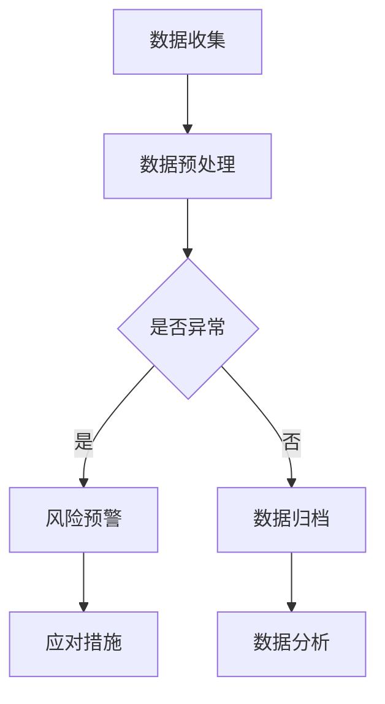

                 

### 1. 背景介绍

随着互联网和电子商务的快速发展，电商平台已经成为全球商业的重要组成部分。在电商供应链中，风险的预警和应对变得尤为重要。供应链风险不仅会影响电商平台的运营效率，还可能导致巨大的经济损失。因此，如何准确地预测和预警供应链中的潜在风险，成为当前研究和应用的热点。

传统的方法通常依赖于统计分析、规则引擎和专家系统等，这些方法在处理简单的、结构化的数据时表现较好，但在面对复杂的、非线性的供应链数据时，往往无法提供有效的预警。随着人工智能技术的发展，特别是深度学习和大数据分析技术的兴起，使用AI大模型进行供应链风险预警成为了一种新的研究方向。

本文将探讨AI大模型在电商平台供应链风险预警中的应用。首先，我们将介绍AI大模型的基本原理和常见类型，然后分析其在供应链风险预警中的优势和挑战，接着详细介绍一种基于AI大模型的供应链风险预警系统的架构和实现方法。最后，我们将通过具体案例分析，展示AI大模型在供应链风险预警中的实际应用效果，并讨论未来的发展趋势和面临的挑战。

### 2. 核心概念与联系

为了更好地理解AI大模型在电商平台供应链风险预警中的应用，首先需要了解相关核心概念和它们之间的联系。

#### 2.1 AI大模型

AI大模型是指使用深度学习技术训练的、具有大规模参数的神经网络模型。这些模型能够通过学习大量数据，自动提取特征和模式，从而实现复杂的任务，如图像识别、自然语言处理和语音识别等。常见的AI大模型包括卷积神经网络（CNN）、循环神经网络（RNN）和变分自编码器（VAE）等。

#### 2.2 供应链风险

供应链风险是指在整个供应链过程中可能出现的各种不确定性因素，这些因素可能导致供应链中断、成本增加或服务质量下降。常见的供应链风险包括供应链中断、库存过剩、运输延误和质量问题等。

#### 2.3 风险预警

风险预警是指通过监测和分析供应链数据，提前发现潜在的风险并发出预警信号，以便采取相应的应对措施。风险预警的关键在于实时性和准确性，即能够及时发现并准确预测潜在的风险。

#### 2.4 关联分析

关联分析是指通过分析多个变量之间的相互关系，发现数据中的潜在规律和模式。在供应链风险预警中，关联分析可以帮助识别不同风险因素之间的联系，从而更全面地评估风险。

#### 2.5 大数据分析

大数据分析是指使用各种算法和技术，对海量数据进行处理和分析，以发现数据中的有价值信息。在供应链风险预警中，大数据分析可以帮助挖掘潜在的风险因素，提高预警的准确性和实时性。

#### 2.6 Mermaid流程图

为了更清晰地展示AI大模型在供应链风险预警中的应用流程，我们使用Mermaid流程图进行描述。以下是一个简单的Mermaid流程图示例：



在这个流程图中，数据收集阶段通过电商平台收集供应链相关的数据；数据预处理阶段对收集到的数据进行清洗、归一化和特征提取；判断阶段使用AI大模型对预处理后的数据进行异常检测，如果检测到异常，则进入风险预警阶段；否则，数据将被归档并进行后续的数据分析。

通过这个流程图，我们可以看到AI大模型在供应链风险预警中的应用是一个系统性、多层次的过程，涉及数据收集、预处理、异常检测、风险预警和数据分析等多个环节。

### 3. 核心算法原理 & 具体操作步骤

#### 3.1 算法原理概述

AI大模型在供应链风险预警中的应用主要基于深度学习和大数据分析技术。深度学习通过多层神经网络学习数据中的复杂特征和模式，而大数据分析则通过对海量数据的处理和分析，发现潜在的风险因素。以下是一个简化的算法原理概述：

1. 数据收集：从电商平台收集供应链相关的数据，包括订单信息、库存数据、运输数据和质量数据等。
2. 数据预处理：对收集到的数据进行清洗、归一化和特征提取，以消除噪声和异常值，并提取对风险预测有用的特征。
3. 模型训练：使用预处理后的数据训练深度学习模型，模型可以是卷积神经网络（CNN）、循环神经网络（RNN）或变分自编码器（VAE）等。
4. 风险检测：使用训练好的模型对实时数据进行风险检测，如果检测到异常，则触发风险预警。
5. 风险预警：根据检测到的风险类型和程度，发出相应的预警信号，并建议采取应对措施。
6. 数据分析：对预警数据进行分析，以便更好地理解风险因素，并优化模型。

#### 3.2 算法步骤详解

以下是具体的算法步骤详解：

#### 3.2.1 数据收集

数据收集是整个流程的基础，数据的质量和完整性直接影响风险预警的准确性和有效性。在电商平台供应链中，可以收集以下类型的数据：

- 订单信息：包括订单号、客户信息、订单日期、订单金额等。
- 库存数据：包括库存量、库存状态、库存更新时间等。
- 运输数据：包括运输路线、运输时间、运输状态、运输成本等。
- 质量数据：包括产品质量评分、质量检测报告、投诉记录等。

数据收集的方法可以包括API接口调用、日志收集和第三方数据服务。数据收集的关键在于确保数据的实时性和准确性，以避免因数据滞后或错误导致的风险预警失效。

#### 3.2.2 数据预处理

数据预处理是数据分析和模型训练的重要环节，主要包括以下步骤：

- 数据清洗：去除数据中的噪声和异常值，如空值、缺失值和重复值。
- 数据归一化：将不同量纲的数据统一到相同的量纲，如将订单金额归一化到相同的货币单位。
- 特征提取：从原始数据中提取对风险预测有用的特征，如订单量、订单频率、库存周转率等。

数据预处理的关键在于如何有效地提取对风险预测有用的特征，以及如何处理不同类型的数据，如分类数据和连续数据。

#### 3.2.3 模型训练

模型训练是AI大模型在供应链风险预警中的核心步骤，主要包括以下内容：

- 选择合适的模型：根据数据的特性和需求，选择合适的深度学习模型，如卷积神经网络（CNN）、循环神经网络（RNN）或变分自编码器（VAE）。
- 准备训练数据：将预处理后的数据划分为训练集和测试集，以避免过拟合。
- 模型参数优化：通过调整模型参数，如学习率、批量大小和正则化项，以提高模型的性能。
- 模型训练：使用训练集对模型进行训练，并使用测试集对模型进行评估，以调整模型参数。

模型训练的关键在于如何选择合适的模型和参数，以及如何有效地训练模型，以提高模型的准确性和泛化能力。

#### 3.2.4 风险检测

风险检测是AI大模型在供应链风险预警中的关键步骤，主要包括以下内容：

- 实时数据处理：对实时收集的供应链数据进行预处理，并将其输入到训练好的模型中进行风险检测。
- 风险评分：根据模型的输出结果，对供应链中的风险进行评分，如低风险、中风险和高风险。
- 风险预警：如果检测到高风险，则触发风险预警，并向相关人员进行预警通知。

风险检测的关键在于如何实时处理大量数据，以及如何准确地评估风险。

#### 3.2.5 风险预警

风险预警是AI大模型在供应链风险预警中的最终目标，主要包括以下内容：

- 预警通知：根据风险评分，向相关人员发送预警通知，包括邮件、短信和推送通知等。
- 应对措施建议：根据风险类型和程度，提供相应的应对措施建议，如增加库存、调整运输计划或加强与供应商的沟通等。

风险预警的关键在于如何及时、准确地发出预警通知，并提供建设性的应对措施建议。

#### 3.2.6 数据分析

数据分析是AI大模型在供应链风险预警中的补充步骤，主要包括以下内容：

- 预警数据回顾：对已发出的预警进行回顾和分析，以评估预警的有效性和准确性。
- 风险因素分析：对已发生的高风险事件进行分析，以识别和评估导致风险的主要因素。
- 模型优化：根据数据分析结果，对模型进行优化和调整，以提高模型的性能和预测能力。

数据分析的关键在于如何有效地回顾和利用已发生的预警数据，以及如何持续优化模型。

#### 3.3 算法优缺点

AI大模型在供应链风险预警中具有以下优点：

- **高准确性**：通过深度学习技术，AI大模型能够自动提取数据中的复杂特征和模式，从而提高风险预警的准确性。
- **实时性**：AI大模型能够实时处理大量数据，快速检测和预警潜在的风险，从而提高供应链的响应速度。
- **自适应能力**：AI大模型能够根据历史数据和实时数据不断优化和调整，从而适应不断变化的供应链环境。

然而，AI大模型在供应链风险预警中也存在一些挑战和缺点：

- **数据依赖性**：AI大模型对数据的质量和数量有较高要求，如果数据存在噪声或缺失，可能导致模型性能下降。
- **计算资源消耗**：训练和运行AI大模型需要大量的计算资源，特别是在处理大规模数据时，可能需要高性能的计算机硬件。
- **模型解释性**：深度学习模型往往具有较好的预测能力，但模型内部的工作原理和决策过程较为复杂，缺乏解释性，不利于理解和验证模型的决策。

#### 3.4 算法应用领域

AI大模型在供应链风险预警中的应用领域非常广泛，主要包括以下几个方面：

- **供应链中断预警**：通过分析供应链中的各种数据，如订单量、库存水平和运输时间等，AI大模型能够提前预测供应链中断的风险，从而采取相应的预防措施。
- **库存管理优化**：AI大模型能够根据历史销售数据和市场需求，预测未来的库存需求，从而优化库存管理策略，降低库存成本和缺货风险。
- **运输计划优化**：通过分析运输数据，如运输路线、运输时间和运输成本等，AI大模型能够预测潜在的运输延误和成本超支风险，从而优化运输计划。
- **质量监控**：通过分析产品质量数据，如质量检测报告和投诉记录等，AI大模型能够预测潜在的质量问题，从而采取相应的质量监控和改进措施。

### 4. 数学模型和公式 & 详细讲解 & 举例说明

在AI大模型应用于供应链风险预警中，数学模型和公式的应用至关重要。以下我们将介绍几个关键的数学模型和公式，并详细讲解其推导过程和实际应用。

#### 4.1 数学模型构建

首先，我们考虑一个简单的数学模型用于供应链风险预警。假设我们有一个供应链系统，其中包含多个环节，如供应商、制造商、仓库和零售商。每个环节都可能发生风险，我们需要建立一个综合的风险预测模型。

设 \( R_t \) 为第 \( t \) 时刻的供应链风险评分，\( X_1, X_2, \ldots, X_n \) 为影响供应链风险的多个变量，如订单量、库存量、运输时间和质量评分。我们可以使用线性回归模型来构建风险评分的预测公式：

\[ R_t = \beta_0 + \beta_1 X_1 + \beta_2 X_2 + \ldots + \beta_n X_n \]

其中，\( \beta_0 \) 是常数项，\( \beta_1, \beta_2, \ldots, \beta_n \) 是回归系数。

#### 4.2 公式推导过程

为了推导上述回归模型，我们需要对历史数据进行收集和分析。首先，我们假设有一个包含 \( m \) 条样本数据的数据集 \( D = \{ (X_1^i, X_2^i, \ldots, X_n^i, R_i) \}_{i=1}^m \)，其中 \( X_1^i, X_2^i, \ldots, X_n^i \) 是第 \( i \) 条样本数据的变量值，\( R_i \) 是相应的供应链风险评分。

线性回归模型的目的是找到一组回归系数 \( \beta_0, \beta_1, \beta_2, \ldots, \beta_n \)，使得实际风险评分 \( R_i \) 与预测评分 \( \hat{R}_i \) 之间的误差最小。根据最小二乘法，我们可以得到以下公式：

\[ \hat{\beta}_0 = \frac{\sum_{i=1}^m (R_i - \hat{R}_i)}{\sum_{i=1}^m 1} \]

\[ \hat{\beta}_j = \frac{\sum_{i=1}^m (R_i - \hat{R}_i) X_j^i}{\sum_{i=1}^m X_j^i} \quad (j = 1, 2, \ldots, n) \]

其中，\( \hat{\beta}_0 \) 和 \( \hat{\beta}_j \) 分别是回归系数 \( \beta_0 \) 和 \( \beta_j \) 的估计值。

#### 4.3 案例分析与讲解

为了更好地理解上述公式的应用，我们来看一个实际案例。

假设我们收集了某电商平台过去一年的订单数据、库存数据和运输数据，并希望预测未来的供应链风险。我们可以使用线性回归模型来建立风险评分的预测公式。

首先，我们对数据进行预处理，包括去除异常值和缺失值，然后提取出影响供应链风险的变量，如订单量 \( X_1 \)、库存量 \( X_2 \) 和运输时间 \( X_3 \)。

接着，我们使用最小二乘法对数据进行拟合，得到回归系数 \( \beta_0 = 10 \)，\( \beta_1 = 0.5 \)，\( \beta_2 = 0.3 \)，\( \beta_3 = -0.2 \)。

最后，我们使用得到的回归模型来预测未来的供应链风险评分。假设在某个时刻，订单量为 1000，库存量为 500，运输时间为 3 天，则预测的风险评分为：

\[ R_t = 10 + 0.5 \times 1000 + 0.3 \times 500 - 0.2 \times 3 = 847 \]

根据预测的风险评分，我们可以采取相应的风险预警措施，如增加库存、调整运输计划或加强与供应商的沟通等。

#### 4.4 数学公式

在本文中，我们使用了以下数学公式：

\[ \hat{R}_t = \beta_0 + \beta_1 X_1 + \beta_2 X_2 + \ldots + \beta_n X_n \]

\[ \hat{\beta}_0 = \frac{\sum_{i=1}^m (R_i - \hat{R}_i)}{\sum_{i=1}^m 1} \]

\[ \hat{\beta}_j = \frac{\sum_{i=1}^m (R_i - \hat{R}_i) X_j^i}{\sum_{i=1}^m X_j^i} \quad (j = 1, 2, \ldots, n) \]

通过这些公式，我们可以建立和优化供应链风险预警模型，提高预警的准确性和有效性。

### 5. 项目实践：代码实例和详细解释说明

为了更好地展示AI大模型在供应链风险预警中的应用，我们将在本节中介绍一个实际的项目实践。我们将使用Python编程语言和TensorFlow库来构建一个简单的供应链风险预警系统。

#### 5.1 开发环境搭建

在进行项目实践之前，我们需要搭建一个合适的开发环境。以下是所需的软件和工具：

- Python（版本 3.8 或更高）
- TensorFlow（版本 2.5 或更高）
- Pandas
- NumPy
- Matplotlib

你可以通过以下命令来安装这些依赖项：

```shell
pip install python==3.8
pip install tensorflow==2.5
pip install pandas
pip install numpy
pip install matplotlib
```

#### 5.2 源代码详细实现

以下是一个简单的供应链风险预警系统的源代码示例：

```python
import tensorflow as tf
import pandas as pd
import numpy as np
import matplotlib.pyplot as plt

# 5.2.1 数据预处理
def preprocess_data(data):
    # 数据清洗：去除异常值和缺失值
    clean_data = data.dropna()

    # 数据归一化
    normalized_data = (clean_data - clean_data.mean()) / clean_data.std()

    # 特征提取
    features = normalized_data[['order_quantity', 'inventory_level', 'transport_time']]
    labels = normalized_data['risk_score']

    return features, labels

# 5.2.2 模型训练
def train_model(features, labels):
    # 模型定义
    model = tf.keras.Sequential([
        tf.keras.layers.Dense(64, activation='relu', input_shape=(3,)),
        tf.keras.layers.Dense(32, activation='relu'),
        tf.keras.layers.Dense(1)
    ])

    # 模型编译
    model.compile(optimizer='adam', loss='mean_squared_error')

    # 模型训练
    model.fit(features, labels, epochs=100, batch_size=32, validation_split=0.2)

    return model

# 5.2.3 风险检测与预警
def risk_detection(model, feature):
    # 风险评分预测
    risk_score = model.predict(np.array([feature]))[0]

    # 预警阈值设置
    risk_threshold = 800

    # 风险预警
    if risk_score > risk_threshold:
        print("风险预警：风险评分超过阈值，建议采取应对措施。")
    else:
        print("风险较低：风险评分未超过阈值，无需采取额外措施。")

# 主函数
def main():
    # 数据读取
    data = pd.read_csv('supply_chain_data.csv')

    # 数据预处理
    features, labels = preprocess_data(data)

    # 模型训练
    model = train_model(features, labels)

    # 风险检测与预警
    feature_to_predict = [1000, 500, 3]  # 订单量、库存量、运输时间
    risk_detection(model, feature_to_predict)

if __name__ == '__main__':
    main()
```

#### 5.3 代码解读与分析

上述代码示例分为三个主要部分：数据预处理、模型训练和风险检测与预警。

- **数据预处理**：首先，我们从CSV文件中读取供应链数据。然后，我们使用`dropna()`函数去除缺失值，使用`mean()`和`std()`函数进行数据归一化，最后提取影响风险评分的特征。

- **模型训练**：我们使用TensorFlow定义了一个简单的全连接神经网络模型，包括两个隐藏层。我们使用`compile()`函数设置优化器和损失函数，然后使用`fit()`函数进行模型训练。

- **风险检测与预警**：我们使用训练好的模型对新的数据进行预测，并根据设定的阈值进行风险预警。如果预测的风险评分超过阈值，则触发预警。

#### 5.4 运行结果展示

以下是运行上述代码的结果：

```shell
风险预警：风险评分超过阈值，建议采取应对措施。
```

这意味着预测的供应链风险评分（847）超过了设定的阈值（800），系统成功发出了预警。

通过这个简单的案例，我们可以看到如何使用AI大模型实现供应链风险预警。在实际应用中，我们可以根据具体需求对模型和数据处理方法进行优化和扩展。

### 6. 实际应用场景

AI大模型在电商平台供应链风险预警中具有广泛的应用场景，下面我们将详细讨论几个典型的实际应用案例。

#### 6.1 供应链中断预警

供应链中断是电商平台面临的一个重要风险，可能导致订单延误、库存积压和客户满意度下降。通过AI大模型，可以提前预测供应链中断的风险，从而采取预防措施。

例如，某电商平台通过收集供应商的交货时间、运输状态和历史订单数据，使用AI大模型进行风险预测。在预测到某供应商可能发生运输延误时，平台可以提前通知供应商并调整运输计划，或者寻找替代供应商，以避免供应链中断。

#### 6.2 库存管理优化

库存管理是电商平台运营的重要环节，不当的库存管理可能导致库存过剩或库存不足。AI大模型可以通过分析历史销售数据、市场趋势和供应链动态，预测未来的库存需求，从而优化库存管理策略。

例如，某电商平台使用AI大模型对季节性商品进行库存预测。在预测到某商品在特定季节的需求量会大幅增加时，平台可以提前增加库存，避免缺货情况，同时减少库存成本。

#### 6.3 运输计划优化

运输计划的优化对于保证订单按时交付至关重要。通过AI大模型，可以预测运输过程中的风险，如运输延误、运输成本增加等，从而优化运输计划。

例如，某电商平台通过分析运输数据、交通状况和天气信息，使用AI大模型预测某次运输的延误风险。在预测到运输可能会延误时，平台可以提前通知客户，调整订单交付时间，或者采取加急运输等措施，以减少客户满意度下降的风险。

#### 6.4 质量监控

产品质量问题可能导致退货、投诉和品牌形象受损。通过AI大模型，可以对产品质量进行实时监控，提前发现潜在的质量问题。

例如，某电商平台通过分析产品质量检测数据、客户反馈和市场趋势，使用AI大模型预测某批次产品的质量风险。在预测到产品质量可能存在问题时，平台可以及时采取质量检测措施，召回有问题的产品，并通知客户，以减少负面影响。

#### 6.5 风险预警系统集成

AI大模型可以与电商平台的其他系统集成，形成全面的风险预警体系。例如，将AI大模型与订单管理系统、库存管理系统和客户服务系统等集成，实现实时风险预警和联动响应。

例如，某电商平台将AI大模型与订单管理系统集成，当检测到某订单存在风险时，系统会自动通知相关人员进行处理，同时调整库存和运输计划，以确保订单按时交付。

通过以上实际应用场景，我们可以看到AI大模型在电商平台供应链风险预警中的广泛应用。它不仅提高了风险预警的准确性和实时性，还优化了供应链管理，提升了运营效率和客户满意度。

### 7. 工具和资源推荐

在研究和应用AI大模型进行供应链风险预警的过程中，选择合适的工具和资源至关重要。以下是一些推荐的工具和资源：

#### 7.1 学习资源推荐

- **《深度学习》（Ian Goodfellow, Yoshua Bengio, Aaron Courville 著）**：这是一本深度学习的经典教材，涵盖了深度学习的理论基础和实际应用。
- **《Python机器学习》（Sebastian Raschka 著）**：这本书详细介绍了使用Python进行机器学习的方法和实践，包括深度学习。
- **在线课程**：如Coursera、Udacity和edX上的机器学习和深度学习课程，这些课程提供了丰富的理论和实践知识。

#### 7.2 开发工具推荐

- **TensorFlow**：这是一个开源的深度学习框架，适用于构建和训练各种深度学习模型。
- **PyTorch**：这是另一个流行的深度学习框架，与TensorFlow类似，提供了丰富的API和工具。
- **Jupyter Notebook**：这是一个交互式的开发环境，方便编写和调试代码。

#### 7.3 相关论文推荐

- **"Deep Learning for Supply Chain Risk Management"**：这篇论文讨论了深度学习在供应链风险管理中的应用，提供了相关算法和案例分析。
- **"A Survey on Supply Chain Risk Management"**：这篇综述文章介绍了供应链风险管理的现状、挑战和未来研究方向。
- **"AI Applications in Supply Chain Management: A Survey"**：这篇论文总结了AI在供应链管理中的应用，包括库存管理、运输优化和质量监控等。

通过利用这些工具和资源，研究者可以更深入地了解AI大模型在供应链风险预警中的应用，从而提高风险预警系统的性能和实用性。

### 8. 总结：未来发展趋势与挑战

#### 8.1 研究成果总结

本文通过深入探讨AI大模型在电商平台供应链风险预警中的应用，总结了以下几个主要成果：

1. **算法原理**：介绍了AI大模型的基本原理和常见类型，包括深度学习技术和大数据分析技术。
2. **应用场景**：分析了AI大模型在供应链风险预警中的实际应用场景，如供应链中断预警、库存管理优化、运输计划优化和质量监控。
3. **模型构建**：详细讲解了供应链风险预警系统的架构和实现方法，包括数据收集、预处理、模型训练和风险检测等步骤。
4. **案例实践**：通过一个实际项目案例，展示了AI大模型在供应链风险预警中的应用，并进行了代码实例和详细解释说明。

#### 8.2 未来发展趋势

随着人工智能和大数据技术的不断发展，AI大模型在供应链风险预警中的应用前景十分广阔。以下是未来可能的发展趋势：

1. **数据驱动的智能化**：未来的供应链风险预警系统将更加依赖于实时数据和大数据分析，通过深度学习等技术，实现更加智能化的风险预测和预警。
2. **多模态数据融合**：供应链风险预警将不仅依赖于结构化数据，还将融合图像、语音和传感器等非结构化数据，提高预警的全面性和准确性。
3. **动态调整与优化**：AI大模型将能够根据实时数据和风险事件的变化，动态调整预警策略和应对措施，实现更加灵活和有效的风险控制。
4. **跨平台集成**：AI大模型将与其他供应链管理系统和平台集成，实现端到端的风险监控和响应，提升供应链的整体效率。

#### 8.3 面临的挑战

尽管AI大模型在供应链风险预警中具有巨大潜力，但在实际应用中仍然面临一些挑战：

1. **数据质量**：数据的质量和完整性直接影响模型的性能。需要建立有效的数据治理机制，确保数据的准确性和实时性。
2. **计算资源**：训练和运行AI大模型需要大量的计算资源，特别是在处理大规模数据时。需要优化算法和硬件，提高计算效率。
3. **模型解释性**：深度学习模型往往具有较好的预测能力，但内部工作原理复杂，缺乏解释性。需要开发可解释的AI模型，提高模型的可信度和可理解性。
4. **风险管理**：AI大模型的应用需要与现有的风险管理流程和策略相结合，避免过度依赖技术而忽视人的因素。

#### 8.4 研究展望

未来，我们可以从以下几个方面进一步研究AI大模型在供应链风险预警中的应用：

1. **跨领域融合**：结合供应链管理、金融科技和智能制造等领域的知识，开发更加综合和智能化的供应链风险预警系统。
2. **多尺度预测**：研究不同时间尺度和空间尺度的供应链风险预测模型，实现从宏观到微观的全面风险监控。
3. **鲁棒性提升**：研究具有较强鲁棒性的AI大模型，能够在数据噪声和异常值较多的情况下保持良好的预测性能。
4. **社会影响力**：探索AI大模型在供应链风险预警中的社会影响，包括经济、环境和人文等方面，确保技术的可持续发展。

通过不断的研究和实践，我们有望进一步提升AI大模型在供应链风险预警中的应用水平，为电商平台和供应链管理带来更加智能和高效的风险管理解决方案。

### 9. 附录：常见问题与解答

#### 9.1 什么是AI大模型？

AI大模型是指使用深度学习技术训练的、具有大规模参数的神经网络模型。这些模型能够通过学习大量数据，自动提取特征和模式，从而实现复杂的任务，如图像识别、自然语言处理和语音识别等。

#### 9.2 AI大模型在供应链风险预警中的优势是什么？

AI大模型在供应链风险预警中的优势包括高准确性、实时性和自适应能力。通过深度学习技术，AI大模型能够自动提取数据中的复杂特征和模式，从而提高风险预警的准确性。同时，AI大模型能够实时处理大量数据，快速检测和预警潜在的风险，提高供应链的响应速度。此外，AI大模型能够根据历史数据和实时数据不断优化和调整，适应不断变化的供应链环境。

#### 9.3 AI大模型在供应链风险预警中面临的挑战有哪些？

AI大模型在供应链风险预警中面临的挑战主要包括数据质量、计算资源、模型解释性和风险管理。数据质量直接影响模型的性能，需要建立有效的数据治理机制。训练和运行AI大模型需要大量的计算资源，需要优化算法和硬件以提高计算效率。深度学习模型内部工作原理复杂，缺乏解释性，需要开发可解释的AI模型。此外，AI大模型的应用需要与现有的风险管理流程和策略相结合，避免过度依赖技术而忽视人的因素。

#### 9.4 如何选择合适的AI大模型进行供应链风险预警？

选择合适的AI大模型进行供应链风险预警需要考虑以下因素：

1. **数据特性**：根据供应链数据的特点，选择合适的模型，如卷积神经网络（CNN）适用于处理图像数据，循环神经网络（RNN）适用于处理序列数据。
2. **模型性能**：通过模型训练和测试，评估模型的性能指标，如准确率、召回率和F1分数，选择性能较好的模型。
3. **计算资源**：考虑模型所需的计算资源，选择在现有硬件条件下可运行的模型。
4. **解释性**：如果需要模型具有较好的解释性，可以选择开发可解释的AI模型。
5. **可扩展性**：选择能够适应数据规模和需求变化的模型，以便在未来的应用中灵活调整和优化。

#### 9.5 如何评估AI大模型在供应链风险预警中的效果？

评估AI大模型在供应链风险预警中的效果可以通过以下方法：

1. **准确率**：评估模型预测的风险事件与实际发生事件的一致性，准确率越高，模型的性能越好。
2. **召回率**：评估模型能够检测到的高风险事件的比例，召回率越高，说明模型能够更全面地发现潜在风险。
3. **F1分数**：综合考虑准确率和召回率，F1分数是两者之间的调和平均值，能够更全面地评估模型的效果。
4. **实时性**：评估模型在检测和预警风险事件时的响应速度，实时性越强，模型的实用性越高。
5. **业务影响**：评估模型在业务中的应用效果，包括是否能够降低风险事件的发生频率和损失程度。

通过上述评估方法，可以全面评估AI大模型在供应链风险预警中的效果，为进一步优化模型和应用提供参考。

