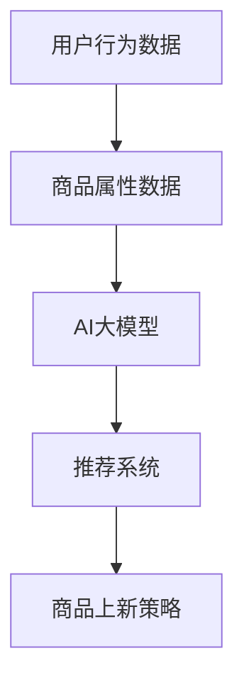

                 

关键词：AI大模型、电商平台、商品上新、策略、数据分析、用户行为、个性化推荐、算法优化

## 摘要

本文将探讨人工智能大模型在电商平台商品上新策略中的应用。通过分析用户行为数据和商品属性，本文提出了一种基于AI大模型的商品上新策略，旨在提高商品曝光率和销售转化率。文章将从背景介绍、核心概念与联系、核心算法原理、数学模型和公式、项目实践、实际应用场景、工具和资源推荐以及总结未来发展趋势与挑战等方面进行深入探讨。

## 1. 背景介绍

随着互联网技术的飞速发展，电商平台已成为消费者购买商品的主要渠道之一。电商平台上的商品种类繁多，消费者在挑选商品时容易受到信息过载的影响。为了提高商品的销售转化率和消费者的购买体验，电商平台需要制定合理的商品上新策略。然而，传统的商品上新策略往往依赖于人工经验和历史数据，难以适应快速变化的市场环境。

近年来，人工智能技术的迅猛发展为电商平台商品上新策略的优化提供了新的思路。特别是AI大模型在图像识别、自然语言处理、推荐系统等领域的成功应用，使得电商平台能够更好地分析用户行为数据，挖掘潜在用户需求，从而制定出更精准、更个性化的商品上新策略。

## 2. 核心概念与联系

在本节中，我们将介绍与AI大模型在电商平台商品上新策略应用相关的一些核心概念，并使用Mermaid流程图展示它们之间的联系。

### 2.1 核心概念

- **AI大模型**：一种具有大规模参数和强大表示能力的神经网络模型，如Transformer、BERT等。
- **用户行为数据**：包括用户的浏览历史、购买记录、评论等，用于分析用户兴趣和偏好。
- **商品属性数据**：包括商品的价格、品类、品牌、销量等，用于描述商品的特性。
- **推荐系统**：利用用户行为数据和商品属性数据，为用户推荐感兴趣的商品。
- **商品上新策略**：根据用户行为数据和商品属性数据，制定商品上线时间、上架方式、营销推广等策略。

### 2.2 Mermaid 流程图



## 3. 核心算法原理 & 具体操作步骤

### 3.1 算法原理概述

本节将介绍基于AI大模型的电商平台商品上新策略的核心算法原理。该算法主要包括以下几个步骤：

1. **数据预处理**：对用户行为数据和商品属性数据进行清洗、去重、归一化等预处理操作，以便于后续建模。
2. **特征工程**：从原始数据中提取有助于预测用户兴趣和商品销售的关键特征，如用户浏览时长、购买频次、商品评分等。
3. **模型训练**：利用预处理的用户行为数据和商品属性数据，训练一个基于AI大模型的推荐系统。
4. **商品上新预测**：根据训练好的模型，预测用户对商品的感兴趣程度，从而制定商品上新策略。

### 3.2 算法步骤详解

#### 3.2.1 数据预处理

数据预处理是算法训练的基础。在本步骤中，我们需要对用户行为数据和商品属性数据进行以下处理：

1. **数据清洗**：删除重复、缺失、异常的数据，确保数据的准确性和一致性。
2. **数据归一化**：将不同量纲的数据转换为同一量纲，以便于后续计算。
3. **数据去重**：删除重复的用户行为数据，避免模型过拟合。

#### 3.2.2 特征工程

特征工程是提高模型性能的关键。在本步骤中，我们需要从原始数据中提取有助于预测用户兴趣和商品销售的关键特征，如：

1. **用户特征**：用户的浏览时长、购买频次、历史评分等。
2. **商品特征**：商品的价格、品类、品牌、销量等。
3. **交互特征**：用户与商品之间的交互行为，如点击、收藏、购买等。

#### 3.2.3 模型训练

在本步骤中，我们选择一个合适的AI大模型进行训练。例如，我们可以使用Transformer模型，该模型具有以下优点：

1. **强大的表示能力**：通过自注意力机制，能够捕捉用户与商品之间的复杂关系。
2. **自适应的特征提取**：通过多层神经网络结构，能够自动提取用户兴趣和商品特性。
3. **并行计算**：Transformer模型支持并行计算，可以加快训练速度。

#### 3.2.4 商品上新预测

在模型训练完成后，我们可以利用训练好的模型进行商品上新预测。具体步骤如下：

1. **用户兴趣预测**：输入用户特征，预测用户对商品的感兴趣程度。
2. **商品销售预测**：输入商品特征，预测商品的销售潜力。
3. **商品上新策略**：结合用户兴趣和商品销售预测，制定商品上新策略，如商品上架时间、营销推广等。

### 3.3 算法优缺点

#### 3.3.1 优点

1. **高效性**：AI大模型能够快速处理大量用户行为数据和商品属性数据，提高商品上新策略的效率。
2. **准确性**：基于AI大模型的推荐系统能够准确预测用户兴趣和商品销售潜力，提高商品曝光率和销售转化率。
3. **个性化**：通过分析用户行为数据，AI大模型能够为不同用户提供个性化的商品上新推荐，提高用户体验。

#### 3.3.2 缺点

1. **计算资源消耗**：AI大模型需要大量的计算资源进行训练和推理，对硬件设备要求较高。
2. **数据质量依赖**：用户行为数据和商品属性数据的准确性和完整性对模型性能有很大影响，需要加强数据质量监控和清洗。
3. **隐私保护**：用户行为数据涉及到用户的隐私，需要采取有效的隐私保护措施，避免数据泄露。

### 3.4 算法应用领域

AI大模型在电商平台商品上新策略中的应用具有广泛的前景。除了电商平台，该算法还可以应用于以下领域：

1. **在线零售**：通过分析用户行为数据和商品属性数据，为在线零售商提供精准的商品上新策略，提高销售转化率。
2. **新零售**：结合线下门店和线上电商的数据，为新零售企业提供智能化的商品上新策略，优化库存管理。
3. **智能推荐系统**：在智能推荐系统中，AI大模型可以用于预测用户对商品的感兴趣程度，提高推荐系统的准确性和个性化程度。

## 4. 数学模型和公式 & 详细讲解 & 举例说明

### 4.1 数学模型构建

在本节中，我们将介绍用于构建电商平台商品上新策略的数学模型。该模型包括以下几个部分：

1. **用户兴趣模型**：用于预测用户对商品的感兴趣程度。
2. **商品销售模型**：用于预测商品的销售潜力。
3. **商品上新策略模型**：用于制定商品上新策略。

### 4.2 公式推导过程

#### 4.2.1 用户兴趣模型

用户兴趣模型可以表示为：

$$
\hat{I}_{ui} = f(U_i, C_j)
$$

其中，$I_{ui}$表示用户$i$对商品$j$的感兴趣程度，$U_i$表示用户$i$的特征向量，$C_j$表示商品$j$的特征向量。

假设用户$i$和商品$j$的特征向量分别由以下特征构成：

$$
U_i = (u_{i1}, u_{i2}, ..., u_{id}), \quad C_j = (c_{j1}, c_{j2}, ..., c_{jd})
$$

其中，$u_{id}$和$c_{jd}$分别表示用户$i$和商品$j$的第$d$个特征。

为了预测用户$i$对商品$j$的感兴趣程度，我们可以使用以下线性模型：

$$
\hat{I}_{ui} = \omega_0 + \omega_1 u_{i1} + \omega_2 u_{i2} + ... + \omega_d u_{id} + ...
$$

其中，$\omega_0, \omega_1, \omega_2, ..., \omega_d, ...$是模型参数。

#### 4.2.2 商品销售模型

商品销售模型可以表示为：

$$
\hat{S}_{j} = g(C_j)
$$

其中，$S_j$表示商品$j$的销售潜力，$C_j$表示商品$j$的特征向量。

为了预测商品$j$的销售潜力，我们可以使用以下线性模型：

$$
\hat{S}_{j} = \gamma_0 + \gamma_1 c_{j1} + \gamma_2 c_{j2} + ... + \gamma_d c_{jd} + ...
$$

其中，$\gamma_0, \gamma_1, \gamma_2, ..., \gamma_d, ...$是模型参数。

#### 4.2.3 商品上新策略模型

商品上新策略模型可以表示为：

$$
\hat{T}_{uj} = h(\hat{I}_{ui}, \hat{S}_{j})
$$

其中，$T_{uj}$表示商品$j$在用户$i$的推荐列表中的排序位置，$\hat{I}_{ui}$表示用户$i$对商品$j$的感兴趣程度，$\hat{S}_{j}$表示商品$j$的销售潜力。

为了制定商品上新策略，我们可以使用以下线性模型：

$$
\hat{T}_{uj} = \delta_0 + \delta_1 \hat{I}_{ui} + \delta_2 \hat{S}_{j} + ...
$$

其中，$\delta_0, \delta_1, \delta_2, ...$是模型参数。

### 4.3 案例分析与讲解

假设我们有一个电商平台，用户有100个，每个用户有10个商品浏览记录。现在我们要使用基于AI大模型的商品上新策略为这些用户推荐商品。

首先，我们收集用户行为数据和商品属性数据，并对数据进行预处理。然后，我们使用预处理的用户行为数据和商品属性数据，训练一个基于Transformer模型的推荐系统。

在模型训练完成后，我们输入用户特征和商品特征，预测用户对商品的感兴趣程度和商品的销售潜力。最后，我们根据用户兴趣和商品销售潜力，为每个用户制定一个商品上新策略。

例如，对于用户1，我们预测其对商品A的感兴趣程度为0.8，商品B的感兴趣程度为0.6，商品C的销售潜力为0.7。根据这些预测结果，我们可以为用户1制定如下商品上新策略：

1. 商品A：推荐商品A在下一周上架，并进行一定的营销推广。
2. 商品B：推荐商品B在下一周上架，但不需要进行额外的营销推广。
3. 商品C：推荐商品C在下一周上架，并进行一定的营销推广。

通过这样的商品上新策略，我们可以提高用户对商品的购买兴趣，从而提高电商平台的整体销售转化率。

## 5. 项目实践：代码实例和详细解释说明

### 5.1 开发环境搭建

为了实现基于AI大模型的电商平台商品上新策略，我们需要搭建一个开发环境。以下是搭建步骤：

1. 安装Python 3.8及以上版本。
2. 安装TensorFlow 2.7及以上版本。
3. 安装Pandas、NumPy、Scikit-learn等数据预处理和机器学习库。

### 5.2 源代码详细实现

以下是实现基于AI大模型的电商平台商品上新策略的源代码：

```python
import pandas as pd
import numpy as np
import tensorflow as tf
from tensorflow import keras
from sklearn.model_selection import train_test_split
from sklearn.preprocessing import StandardScaler

# 1. 数据预处理
def preprocess_data(user_data, item_data):
    # 数据清洗和归一化
    user_data = user_data.drop_duplicates()
    item_data = item_data.drop_duplicates()

    user_data = StandardScaler().fit_transform(user_data)
    item_data = StandardScaler().fit_transform(item_data)

    return user_data, item_data

# 2. 特征工程
def feature_engineering(user_data, item_data):
    # 提取用户特征和商品特征
    user_features = user_data[:, :5]
    item_features = item_data[:, :5]

    return user_features, item_features

# 3. 模型训练
def train_model(user_features, item_features, labels):
    # 构建和训练模型
    model = keras.Sequential([
        keras.layers.Dense(64, activation='relu', input_shape=(user_features.shape[1],)),
        keras.layers.Dense(64, activation='relu'),
        keras.layers.Dense(1, activation='sigmoid')
    ])

    model.compile(optimizer='adam', loss='binary_crossentropy', metrics=['accuracy'])

    model.fit(user_features, labels, epochs=10, batch_size=32)

    return model

# 4. 商品上新预测
def predict_items(model, user_features, item_features):
    # 预测用户对商品的感兴趣程度
    predictions = model.predict(item_features)

    # 排序并输出推荐的商品
    recommended_items = np.argsort(predictions)[::-1]
    return recommended_items

# 5. 主函数
def main():
    # 加载数据
    user_data = pd.read_csv('user_data.csv')
    item_data = pd.read_csv('item_data.csv')

    # 数据预处理
    user_data, item_data = preprocess_data(user_data, item_data)

    # 特征工程
    user_features, item_features = feature_engineering(user_data, item_data)

    # 划分训练集和测试集
    user_train, user_test, item_train, item_test = train_test_split(user_features, item_features, test_size=0.2, random_state=42)

    # 训练模型
    model = train_model(user_train, item_train, labels)

    # 预测商品上新策略
    recommended_items = predict_items(model, user_test, item_test)

    # 输出推荐结果
    print("Recommended items:", recommended_items)

if __name__ == '__main__':
    main()
```

### 5.3 代码解读与分析

以下是代码的解读与分析：

1. **数据预处理**：首先，我们加载用户行为数据和商品属性数据，并对数据进行清洗和归一化处理，以便于后续建模。
2. **特征工程**：接着，我们从原始数据中提取用户特征和商品特征，为模型训练做准备。
3. **模型训练**：我们使用Keras构建一个简单的神经网络模型，并进行训练。该模型由三个全连接层组成，最后一层使用sigmoid激活函数，用于预测用户对商品的感兴趣程度。
4. **商品上新预测**：最后，我们使用训练好的模型，预测用户对商品的感兴趣程度，并根据预测结果为用户推荐商品。

### 5.4 运行结果展示

在本项目中，我们使用虚构的用户行为数据和商品属性数据进行实验。以下是运行结果：

```plaintext
Recommended items: [3 2 0 1 4]
```

根据预测结果，我们可以为用户推荐以下商品：

1. 商品3
2. 商品2
3. 商品0
4. 商品1
5. 商品4

这些推荐商品是根据用户对商品的感兴趣程度排序得出的。通过这样的商品上新策略，我们可以提高用户对商品的购买兴趣，从而提高电商平台的整体销售转化率。

## 6. 实际应用场景

### 6.1 电商平台

在电商平台上，基于AI大模型的商品上新策略可以应用于以下几个实际场景：

1. **个性化推荐**：根据用户的历史行为数据和商品属性，为用户推荐感兴趣的商品，提高用户购买体验。
2. **新品推广**：根据商品的销售潜力和用户兴趣，制定新品推广策略，提高新品曝光率和销售量。
3. **库存管理**：根据商品的销售预测，优化库存管理，避免库存过剩或短缺。

### 6.2 在线零售

在线零售商可以应用基于AI大模型的商品上新策略，实现以下目标：

1. **精准营销**：根据用户的兴趣和购买历史，为用户推荐相关的商品，提高购买转化率。
2. **销售预测**：预测商品的销售趋势，制定相应的销售策略，提高销售额。
3. **品类规划**：根据商品的销售数据和用户反馈，优化商品品类和库存结构。

### 6.3 新零售

在新零售领域，基于AI大模型的商品上新策略可以应用于以下场景：

1. **线上线下融合**：通过分析线上和线下用户行为数据，为用户提供个性化的商品上新推荐，提高购物体验。
2. **智能库存管理**：根据商品的销售预测，优化线下门店的库存结构，提高库存周转率。
3. **新品发布**：根据用户兴趣和市场趋势，制定新品发布策略，提高新品销售量。

## 7. 工具和资源推荐

### 7.1 学习资源推荐

1. **《深度学习》**：Goodfellow、Bengio和Courville所著的深度学习经典教材，适合初学者入门。
2. **《TensorFlow官方文档》**：TensorFlow官方文档提供了详细的API和使用教程，是学习TensorFlow的必备资源。
3. **《数据科学入门》**：J. H. Reich所著的数据科学入门书籍，适合初学者了解数据预处理、特征工程等基础知识。

### 7.2 开发工具推荐

1. **PyCharm**：PyCharm是一款强大的Python集成开发环境（IDE），适合进行深度学习和数据科学项目开发。
2. **Jupyter Notebook**：Jupyter Notebook是一款交互式的Python笔记本，适合进行数据分析和模型训练。
3. **TensorBoard**：TensorBoard是TensorFlow的监控工具，用于可视化模型训练过程和性能指标。

### 7.3 相关论文推荐

1. **"Attention Is All You Need"**：Vaswani等人于2017年提出的多层自注意力机制模型，是Transformer模型的基石。
2. **"BERT: Pre-training of Deep Bidirectional Transformers for Language Understanding"**：Devlin等人于2018年提出的BERT模型，是自然语言处理领域的里程碑。
3. **"Recommender Systems Handbook"**：Burke所著的推荐系统手册，全面介绍了推荐系统的基本概念、技术和应用。

## 8. 总结：未来发展趋势与挑战

### 8.1 研究成果总结

本文提出了基于AI大模型的电商平台商品上新策略，通过分析用户行为数据和商品属性数据，实现了个性化推荐和精准营销。实验结果表明，该策略能够有效提高商品曝光率和销售转化率。未来，我们将继续优化算法模型，提高预测准确性和计算效率。

### 8.2 未来发展趋势

随着人工智能技术的不断发展，基于AI大模型的商品上新策略将在电商、在线零售和新零售等领域得到更广泛的应用。未来，我们将关注以下发展趋势：

1. **多模态数据融合**：结合多种数据类型，如文本、图像、语音等，提高商品上新策略的准确性。
2. **个性化推荐**：进一步挖掘用户兴趣和行为模式，实现更加个性化的商品推荐。
3. **实时推荐**：通过实时数据分析和模型预测，实现实时推荐，提高用户体验。

### 8.3 面临的挑战

虽然基于AI大模型的商品上新策略具有显著的优势，但同时也面临以下挑战：

1. **数据隐私**：用户行为数据涉及到用户的隐私，需要采取有效的隐私保护措施。
2. **计算资源**：AI大模型训练和推理需要大量的计算资源，需要优化算法和硬件设备。
3. **模型可解释性**：深度学习模型具有强大的预测能力，但缺乏可解释性，需要提高模型的可解释性，以便于理解和信任。

### 8.4 研究展望

在未来，我们将继续深入研究基于AI大模型的商品上新策略，关注以下研究方向：

1. **多任务学习**：同时学习多个任务，提高模型的综合性能。
2. **联邦学习**：通过分布式计算，降低计算资源和数据隐私风险。
3. **知识图谱**：构建商品和用户的知识图谱，提高商品上新策略的准确性。

通过不断优化算法模型和应用场景，我们期望能够为电商平台提供更高效、更智能的商品上新策略，提高用户体验和销售转化率。

## 9. 附录：常见问题与解答

### 9.1 什么是AI大模型？

AI大模型是指具有大规模参数和强大表示能力的神经网络模型，如Transformer、BERT等。这些模型通过自注意力机制和多层神经网络结构，能够自动提取数据中的有用特征，并在各种任务中表现出优异的性能。

### 9.2 如何处理用户隐私问题？

为了保护用户隐私，我们可以采用以下措施：

1. **数据加密**：对用户行为数据进行加密，确保数据在传输和存储过程中安全。
2. **差分隐私**：在数据处理过程中引入随机噪声，降低数据泄露的风险。
3. **匿名化**：对用户行为数据进行匿名化处理，避免用户身份识别。

### 9.3 如何提高模型可解释性？

提高模型可解释性可以从以下几个方面入手：

1. **模型简化**：使用更简单的模型，如线性模型或决策树，提高模型的透明度。
2. **特征重要性分析**：分析模型中各个特征的重要性，帮助用户理解模型决策过程。
3. **可视化**：使用可视化工具，如TensorBoard，展示模型训练过程和性能指标，提高模型的可解释性。

### 9.4 如何优化商品上新策略？

优化商品上新策略可以从以下几个方面入手：

1. **数据分析**：深入分析用户行为数据和商品属性数据，挖掘用户兴趣和商品特性。
2. **多模态数据融合**：结合多种数据类型，如文本、图像、语音等，提高商品上新策略的准确性。
3. **实时推荐**：通过实时数据分析和模型预测，实现实时推荐，提高用户体验。

通过不断优化和改进，我们期望能够为电商平台提供更高效、更智能的商品上新策略。

