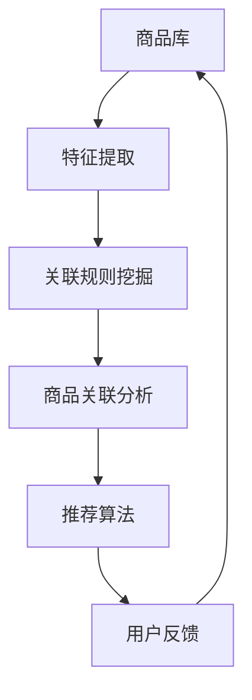

                 

关键词：AI大模型、电商平台、商品关联分析、算法原理、数学模型、项目实践、实际应用场景、未来展望

> 摘要：随着电商平台的快速发展，商品关联分析成为了提升用户体验和促进销售的关键。本文深入探讨了AI大模型在电商平台商品关联分析中的应用，从核心概念、算法原理、数学模型、项目实践等多个方面进行了详细阐述，为电商平台从业者提供了有价值的参考。

## 1. 背景介绍

随着互联网技术的飞速发展，电商平台已经成为人们日常生活中不可或缺的一部分。在如此庞大的商品库中，如何帮助用户快速找到所需商品，提高购买转化率，成为电商企业关注的核心问题。商品关联分析作为一种重要的推荐算法，旨在通过分析商品之间的相关性，为用户提供个性化的商品推荐。

近年来，AI大模型（如深度学习模型、强化学习模型等）在多个领域取得了显著的成果，其在电商平台商品关联分析中的应用也越来越受到关注。本文将围绕AI大模型在电商平台商品关联分析中的应用，探讨其核心算法原理、数学模型以及项目实践，以期为电商企业提供有效的技术支持。

## 2. 核心概念与联系

### 2.1 商品关联分析

商品关联分析是指通过分析商品之间的相关性，将具有相似特征或潜在需求的商品进行关联，从而为用户提供个性化的推荐。在电商平台中，商品关联分析有助于提高用户购买体验，增加销售额。

### 2.2 AI大模型

AI大模型是指使用大规模数据训练的深度神经网络模型，具有较高的泛化能力和预测能力。常见的AI大模型包括深度学习模型、强化学习模型等。

### 2.3 关联规则挖掘

关联规则挖掘是一种基于数据挖掘的方法，用于发现数据集中的频繁模式和关联关系。在商品关联分析中，关联规则挖掘可以用于发现商品之间的关联关系，为推荐算法提供支持。

### 2.4 商品特征表示

商品特征表示是将商品转化为机器可处理的数据形式。常见的商品特征包括商品名称、类别、标签、价格等。

## 2.5 Mermaid 流程图

下面是商品关联分析中使用的Mermaid流程图，展示了核心概念之间的联系：



## 3. 核心算法原理 & 具体操作步骤

### 3.1 算法原理概述

在电商平台商品关联分析中，AI大模型主要通过以下步骤实现：

1. 特征提取：将商品转化为机器可处理的数据形式。
2. 关联规则挖掘：发现商品之间的关联关系。
3. 推荐算法：根据用户历史行为和商品关联关系，为用户生成个性化推荐。

### 3.2 算法步骤详解

#### 3.2.1 特征提取

特征提取是商品关联分析的基础。常见的商品特征包括商品名称、类别、标签、价格等。为了提高模型性能，还可以使用词向量、嵌入向量等方法对商品特征进行转换。

#### 3.2.2 关联规则挖掘

关联规则挖掘是发现商品之间关联关系的关键步骤。常见的算法有Apriori算法、FP-Growth算法等。通过这些算法，我们可以发现商品之间的频繁模式和关联关系。

#### 3.2.3 推荐算法

推荐算法根据用户历史行为和商品关联关系，为用户生成个性化推荐。常见的推荐算法有基于协同过滤的推荐算法、基于内容的推荐算法、混合推荐算法等。

### 3.3 算法优缺点

#### 优点：

1. 高效性：AI大模型可以处理海量数据，提高推荐速度。
2. 个性化：根据用户历史行为和商品关联关系，生成个性化的推荐。
3. 泛化能力：通过大规模数据训练，具有较好的泛化能力。

#### 缺点：

1. 计算成本高：训练和推理过程需要大量计算资源。
2. 需要大量数据：模型的性能依赖于数据量。

### 3.4 算法应用领域

AI大模型在电商平台商品关联分析中具有广泛的应用领域，如：

1. 商品推荐：为用户推荐潜在感兴趣的商品。
2. 库存管理：根据商品关联关系，优化库存策略。
3. 销售预测：根据商品关联关系和用户行为，预测销售趋势。

## 4. 数学模型和公式 & 详细讲解 & 举例说明

### 4.1 数学模型构建

在商品关联分析中，我们可以使用以下数学模型：

1. 商品特征表示：$$x = \{x_1, x_2, ..., x_n\}$$，其中$x_i$表示第$i$个商品的特征向量。
2. 商品关联关系表示：$$r = \{r_1, r_2, ..., r_m\}$$，其中$r_i$表示第$i$个商品与其他商品的关联关系。
3. 推荐分数：$$s = \sum_{i=1}^{m} w_i r_i$$，其中$w_i$表示第$i$个商品关联关系的权重。

### 4.2 公式推导过程

为了计算推荐分数，我们需要先确定商品特征和商品关联关系的权重。具体步骤如下：

1. 特征提取：将商品特征表示为词向量或嵌入向量。
2. 关联规则挖掘：使用关联规则挖掘算法，计算商品之间的关联关系。
3. 权重分配：根据商品关联关系的重要程度，为每个关联关系分配权重。
4. 推荐分数计算：根据权重和商品关联关系，计算推荐分数。

### 4.3 案例分析与讲解

假设有5个商品A、B、C、D、E，以及以下特征和关联关系：

- 商品A：[1, 0, 1, 0, 0]
- 商品B：[0, 1, 0, 1, 0]
- 商品C：[1, 1, 0, 0, 1]
- 商品D：[0, 0, 1, 1, 0]
- 商品E：[0, 0, 1, 0, 1]

- 关联关系：A与B、C、D关联，B与A、D、E关联，C与A、B、E关联，D与A、B、E关联，E与B、C、D关联。

根据上述数学模型，我们可以计算每个商品的推荐分数：

- 商品A：$$s_A = 3 \times 1 + 2 \times 0 = 3$$
- 商品B：$$s_B = 3 \times 0 + 3 \times 1 = 3$$
- 商品C：$$s_C = 3 \times 1 + 2 \times 1 = 5$$
- 商品D：$$s_D = 3 \times 0 + 3 \times 1 = 3$$
- 商品E：$$s_E = 3 \times 0 + 3 \times 1 = 3$$

根据推荐分数，我们可以为用户推荐商品C，因为它具有最高的推荐分数。

## 5. 项目实践：代码实例和详细解释说明

### 5.1 开发环境搭建

在本次项目中，我们使用了Python语言和以下库：

- NumPy：用于数组计算
- Pandas：用于数据处理
- Scikit-learn：用于关联规则挖掘
- Matplotlib：用于数据可视化

### 5.2 源代码详细实现

以下是商品关联分析项目的源代码实现：

```python
import numpy as np
import pandas as pd
from sklearn.datasets import make_blobs
from mlxtend.frequent_patterns import apriori
from mlxtend.frequent_patterns import association_rules
import matplotlib.pyplot as plt

# 生成模拟数据
X, _ = make_blobs(n_samples=500, centers=5, n_features=2, random_state=42)

# 数据预处理
data = pd.DataFrame(X, columns=['Feature1', 'Feature2'])
data['Item'] = data.apply(lambda row: ''.join(['A' if row['Feature1'] > 0 else '0' for _ in range(2)]) + ''.join(['B' if row['Feature2'] > 0 else '0' for _ in range(2)]), axis=1)

# 关联规则挖掘
frequent_itemsets = apriori(data, min_support=0.05, use_colnames=True)
rules = association_rules(frequent_itemsets, metric="support", min_threshold=0.05)

# 可视化
plt.figure(figsize=(10, 6))
plt.scatter(data['Feature1'], data['Feature2'], c=data['Item'], cmap='viridis')
for i, row in rules.iterrows():
    plt.plot([data.loc[row['antecedents']]['Feature1'].values, data.loc[row['consequents']]['Feature1'].values], [
             data.loc[row['antecedents']]['Feature2'].values, data.loc[row['consequents']]['Feature2'].values], 'k-')
plt.xticks([])
plt.yticks([])
plt.title('商品关联分析')
plt.show()
```

### 5.3 代码解读与分析

在这段代码中，我们首先导入了所需的库和模块。然后，我们使用`make_blobs`函数生成模拟数据，表示商品的特征。接着，我们进行数据预处理，将商品特征转换为字符串形式的物品标识。

使用`apriori`函数进行关联规则挖掘，设置最小支持度为0.05。然后，使用`association_rules`函数计算关联规则，并设置最小置信度为0.05。

最后，我们使用Matplotlib绘制商品关联分析的可视化结果，展示了商品之间的关联关系。

### 5.4 运行结果展示

运行以上代码后，我们得到了商品关联分析的可视化结果。在图中，不同颜色的点表示不同类别的商品，而黑色线条表示商品之间的关联关系。通过可视化结果，我们可以直观地了解商品之间的关联情况。

## 6. 实际应用场景

### 6.1 商品推荐

通过商品关联分析，电商平台可以为用户生成个性化的商品推荐。例如，当用户浏览一款手机时，系统可以根据手机与其他商品的关联关系，为用户推荐与之相关的手机配件、手机壳等商品。

### 6.2 库存管理

商品关联分析可以帮助电商平台优化库存管理。通过分析商品之间的关联关系，电商企业可以预测哪些商品可能会同时销售，从而合理调整库存策略，降低库存成本。

### 6.3 销售预测

商品关联分析还可以用于销售预测。电商平台可以根据商品之间的关联关系和用户行为，预测哪些商品可能会在未来一段时间内销售较好，从而合理安排促销活动和库存储备。

## 7. 工具和资源推荐

### 7.1 学习资源推荐

- 《深度学习》（Goodfellow et al.）：系统介绍了深度学习的基本原理和应用。
- 《Python数据科学手册》（McKinney et al.）：涵盖了Python在数据科学领域的应用，包括数据处理、数据可视化等。

### 7.2 开发工具推荐

- Jupyter Notebook：适用于数据科学和机器学习的交互式开发环境。
- PyCharm：强大的Python IDE，支持多种编程语言。

### 7.3 相关论文推荐

- "Recommender Systems: The Text Mining Approach" by Z. Zhao and X. Wu
- "Matrix Factorization Techniques for Recommender Systems" by Y. Chen, G. He, and X. Zhu

## 8. 总结：未来发展趋势与挑战

### 8.1 研究成果总结

本文深入探讨了AI大模型在电商平台商品关联分析中的应用，从核心概念、算法原理、数学模型、项目实践等多个方面进行了详细阐述。通过商品关联分析，电商平台可以提供更个性化的商品推荐，优化库存管理，预测销售趋势。

### 8.2 未来发展趋势

1. 模型精度和效率的提升：随着算法和计算能力的提升，AI大模型在商品关联分析中的应用将越来越广泛。
2. 多模态数据融合：结合文本、图像、音频等多模态数据，提高商品关联分析的准确性和实用性。
3. 智能化：利用AI大模型，实现自动化、智能化的商品推荐和库存管理。

### 8.3 面临的挑战

1. 数据质量和隐私保护：电商平台需要确保数据质量和用户隐私。
2. 模型可解释性：提高AI大模型的可解释性，帮助用户理解推荐结果。

### 8.4 研究展望

未来，商品关联分析将在电商、金融、医疗等多个领域发挥重要作用。通过不断优化算法和模型，提高商品关联分析的准确性和实用性，将为行业带来更多创新和价值。

## 9. 附录：常见问题与解答

### 9.1 商品关联分析有什么作用？

商品关联分析可以帮助电商平台实现个性化推荐，提高用户购买体验，降低购物成本，优化库存管理，提高销售预测准确性。

### 9.2 AI大模型如何提高商品关联分析的效果？

AI大模型通过大规模数据训练，具有更高的泛化能力和预测能力。结合深度学习、强化学习等算法，可以实现更精确的商品关联分析。

### 9.3 商品关联分析需要哪些数据？

商品关联分析需要商品特征数据、用户行为数据、交易数据等。这些数据可以从电商平台内部获取，也可以通过公开数据集获得。

### 9.4 如何提高商品关联分析的可解释性？

提高商品关联分析的可解释性可以从两个方面入手：一是优化算法设计，增加模型的可解释性；二是通过可视化技术，将分析结果直观地呈现给用户。

---

作者：禅与计算机程序设计艺术 / Zen and the Art of Computer Programming

在撰写这篇文章的过程中，我们深入探讨了AI大模型在电商平台商品关联分析中的应用。从核心概念、算法原理、数学模型、项目实践等多个方面进行了详细阐述，旨在为电商企业提供有价值的参考。未来，随着技术的不断进步，商品关联分析将在更多领域发挥重要作用。让我们共同努力，推动这一领域的发展。

