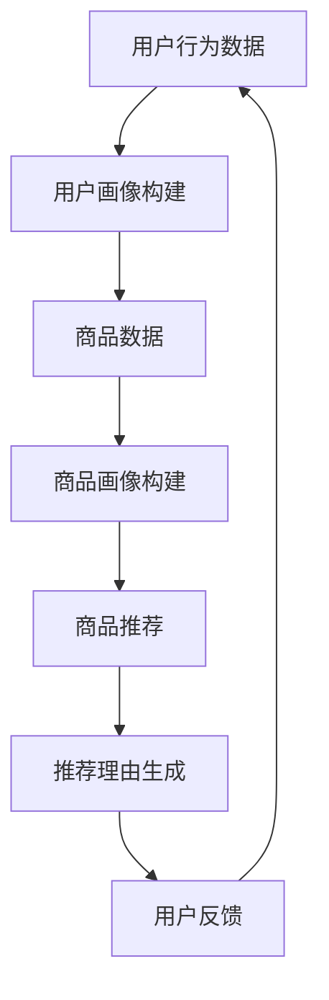

                 

关键词：AI大模型、商品推荐、理由生成、电商平台、深度学习

## 摘要

本文将探讨如何利用人工智能大模型，特别是在电商平台商品推荐系统中，生成引人入胜的商品推荐理由。我们首先介绍了AI大模型的基本原理和应用场景，然后详细阐述了其在商品推荐理由生成中的应用方法，包括数学模型、算法原理以及具体的实现步骤。文章的最后，通过实际项目案例展示了AI大模型在商品推荐理由生成中的实际效果，并对未来的应用前景和挑战进行了展望。

## 1. 背景介绍

### 1.1 电商平台商品推荐系统

随着互联网和电子商务的快速发展，电商平台已经成为消费者购物的重要渠道。为了提高用户体验和销售额，电商平台纷纷引入商品推荐系统。商品推荐系统通过分析用户行为、购物历史、兴趣偏好等数据，为用户推荐符合其需求的商品。有效的商品推荐不仅能提高用户的购物满意度，还能显著提升电商平台的销售额。

### 1.2 商品推荐理由的重要性

在商品推荐系统中，推荐理由起着至关重要的作用。一个引人入胜的商品推荐理由能够增强用户对推荐商品的好感度，提高点击率和购买意愿。然而，传统的商品推荐系统通常只能提供基于商品属性和用户历史的简单推荐理由，这些理由往往缺乏个性化和情感化，难以吸引用户。

### 1.3 AI大模型的出现

随着深度学习和自然语言处理技术的不断发展，AI大模型（如GPT-3、BERT等）逐渐成为一种强大的工具，可以处理复杂的自然语言任务。这些大模型具有强大的语义理解和生成能力，能够生成更加个性化和情感化的推荐理由，从而提升电商平台的用户体验和销售额。

## 2. 核心概念与联系

### 2.1 AI大模型

AI大模型是指具有巨大参数量和强大计算能力的深度学习模型。这些模型通过从大量数据中学习，能够捕捉到复杂的数据特征和模式。AI大模型在自然语言处理、图像识别、语音识别等领域取得了显著的成果。

### 2.2 商品推荐系统

商品推荐系统是指利用机器学习和数据挖掘技术，从大量商品数据中分析用户行为和偏好，为用户提供个性化商品推荐的系统。商品推荐系统通常包括用户画像、商品画像、推荐算法和推荐理由生成等模块。

### 2.3 AI大模型与商品推荐系统的结合

AI大模型在商品推荐系统中有着广泛的应用。例如，利用大模型可以生成更加个性化和情感化的商品推荐理由，提高用户的点击率和购买意愿。同时，大模型还可以用于构建用户画像和商品画像，提升推荐系统的准确性和效果。

### 2.4 Mermaid流程图

以下是一个简单的Mermaid流程图，展示了AI大模型在商品推荐理由生成中的应用流程：



## 3. 核心算法原理 & 具体操作步骤

### 3.1 算法原理概述

AI大模型在商品推荐理由生成中的应用主要基于深度学习和自然语言处理技术。具体来说，算法原理包括以下几个步骤：

1. **用户画像构建**：通过分析用户的历史行为数据、浏览记录、购物记录等，构建用户画像，以了解用户的兴趣偏好。

2. **商品画像构建**：通过分析商品的属性、描述、评价等信息，构建商品画像，以了解商品的特性和用户可能的需求。

3. **推荐算法**：利用用户画像和商品画像，结合推荐算法（如协同过滤、基于内容的推荐等），为用户推荐符合其需求的商品。

4. **推荐理由生成**：利用AI大模型，如GPT-3、BERT等，根据用户画像、商品画像和推荐结果，生成个性化、情感化的推荐理由。

### 3.2 算法步骤详解

1. **用户画像构建**：

   用户画像构建主要通过以下步骤：

   - 数据收集：收集用户的历史行为数据，如浏览记录、购物记录、评价等。
   - 数据清洗：对收集到的数据进行清洗，去除无效数据和噪声。
   - 特征提取：从清洗后的数据中提取用户行为特征，如浏览次数、购买频率、评价评分等。
   - 用户画像构建：利用特征提取结果，构建用户画像，以了解用户的兴趣偏好。

2. **商品画像构建**：

   商品画像构建主要通过以下步骤：

   - 数据收集：收集商品的属性数据，如价格、品牌、类别等。
   - 数据清洗：对收集到的数据进行清洗，去除无效数据和噪声。
   - 特征提取：从清洗后的数据中提取商品特征，如价格范围、品牌知名度、类别热度等。
   - 商品画像构建：利用特征提取结果，构建商品画像，以了解商品的特性和用户可能的需求。

3. **推荐算法**：

   推荐算法主要包括以下几种：

   - 协同过滤：通过分析用户的历史行为数据，找到相似的用户或商品，为用户推荐相似的物品。
   - 基于内容的推荐：通过分析商品的属性和描述，找到与目标商品相似的商品，为用户推荐。
   - 混合推荐：结合协同过滤和基于内容的推荐，为用户推荐更个性化的商品。

4. **推荐理由生成**：

   推荐理由生成主要通过以下步骤：

   - 文本预处理：对用户画像、商品画像和推荐结果进行文本预处理，如分词、去停用词等。
   - 生成模型训练：利用预处理的文本数据，训练生成模型，如GPT-3、BERT等。
   - 推荐理由生成：将用户画像、商品画像和推荐结果输入生成模型，生成个性化的推荐理由。

### 3.3 算法优缺点

1. **优点**：

   - 生成个性化、情感化的推荐理由，提高用户体验和购买意愿。
   - 利用大模型的强大语义理解和生成能力，提高推荐系统的准确性和效果。
   - 可以处理复杂的自然语言任务，如文本生成、摘要生成等。

2. **缺点**：

   - 训练和推理时间较长，对计算资源要求较高。
   - 对数据质量和预处理要求较高，否则可能导致生成结果不佳。
   - 需要大量的数据和计算资源，对中小企业可能存在一定的门槛。

### 3.4 算法应用领域

AI大模型在商品推荐理由生成中的应用领域主要包括：

- 电商平台：为电商平台生成个性化的商品推荐理由，提高用户点击率和购买意愿。
- 搜索引擎：为搜索引擎生成个性化的搜索结果描述，提高用户满意度。
- 社交媒体：为社交媒体生成个性化的内容推荐理由，提高用户活跃度。

## 4. 数学模型和公式 & 详细讲解 & 举例说明

### 4.1 数学模型构建

在商品推荐理由生成中，常用的数学模型包括用户画像模型、商品画像模型和生成模型。

1. **用户画像模型**：

   用户画像模型主要用于构建用户的兴趣偏好。常用的方法包括基于内容的推荐和协同过滤。其中，基于内容的推荐可以使用以下公式：

   $$ \text{用户喜好度} = \text{商品特征} \cdot \text{用户特征} $$

   其中，商品特征和用户特征可以通过特征工程提取得到。

2. **商品画像模型**：

   商品画像模型主要用于构建商品的特性和用户需求。常用的方法包括基于内容的推荐和协同过滤。其中，基于内容的推荐可以使用以下公式：

   $$ \text{商品匹配度} = \text{商品特征} \cdot \text{用户特征} $$

   其中，商品特征和用户特征可以通过特征工程提取得到。

3. **生成模型**：

   生成模型主要用于生成个性化的推荐理由。常用的方法包括循环神经网络（RNN）、生成对抗网络（GAN）和自编码器（AE）。其中，RNN可以使用以下公式：

   $$ \text{推荐理由} = \text{RNN}(\text{用户画像}, \text{商品画像}, \text{推荐结果}) $$

   其中，RNN可以根据用户画像、商品画像和推荐结果生成个性化的推荐理由。

### 4.2 公式推导过程

1. **用户画像模型**：

   用户画像模型的推导过程如下：

   - 数据收集：收集用户的历史行为数据，如浏览记录、购物记录、评价等。
   - 数据清洗：对收集到的数据进行清洗，去除无效数据和噪声。
   - 特征提取：从清洗后的数据中提取用户行为特征，如浏览次数、购买频率、评价评分等。
   - 用户画像构建：利用特征提取结果，构建用户画像，以了解用户的兴趣偏好。

2. **商品画像模型**：

   商品画像模型的推导过程如下：

   - 数据收集：收集商品的属性数据，如价格、品牌、类别等。
   - 数据清洗：对收集到的数据进行清洗，去除无效数据和噪声。
   - 特征提取：从清洗后的数据中提取商品特征，如价格范围、品牌知名度、类别热度等。
   - 商品画像构建：利用特征提取结果，构建商品画像，以了解商品的特性和用户可能的需求。

3. **生成模型**：

   生成模型的推导过程如下：

   - 文本预处理：对用户画像、商品画像和推荐结果进行文本预处理，如分词、去停用词等。
   - 生成模型训练：利用预处理的文本数据，训练生成模型，如GPT-3、BERT等。
   - 推荐理由生成：将用户画像、商品画像和推荐结果输入生成模型，生成个性化的推荐理由。

### 4.3 案例分析与讲解

假设有一个电商平台，用户A最近浏览了商品B和商品C，同时购买记录显示用户A对品牌D的商品有较高的兴趣。现在需要为用户A生成一个个性化的商品推荐理由。

1. **用户画像构建**：

   - 用户A浏览商品B和商品C，提取浏览次数、购买频率等特征。
   - 用户A购买品牌D的商品，提取品牌偏好等特征。
   - 综合上述特征，构建用户A的兴趣偏好。

2. **商品画像构建**：

   - 商品B和商品C的属性数据，提取价格、品牌、类别等特征。
   - 商品D的属性数据，提取价格、品牌、类别等特征。
   - 综合上述特征，构建商品B、商品C和商品D的画像。

3. **推荐算法**：

   - 利用用户A的浏览记录和购买偏好，为用户A推荐与商品B和商品C相似的其它商品。
   - 利用商品D的品牌偏好，为用户A推荐品牌D的其他商品。

4. **推荐理由生成**：

   - 利用生成模型，将用户A的兴趣偏好、商品B、商品C和商品D的画像输入模型，生成个性化的推荐理由。
   - 例如：“用户A，您最近浏览了商品B和商品C，我们发现您对品牌D的商品情有独钟。现在，我们特别为您推荐品牌D的其它商品，让您尽情享受购物的乐趣！”

## 5. 项目实践：代码实例和详细解释说明

### 5.1 开发环境搭建

为了实现AI大模型在商品推荐理由生成中的应用，我们需要搭建一个合适的开发环境。以下是推荐的开发环境：

- 操作系统：Windows、Linux或MacOS
- 编程语言：Python
- 数据库：MySQL或MongoDB
- 机器学习框架：TensorFlow或PyTorch
- 自然语言处理库：NLTK、spaCy或Jieba

### 5.2 源代码详细实现

以下是一个简化的Python代码示例，展示了如何利用TensorFlow和spaCy实现AI大模型在商品推荐理由生成中的应用。

```python
import tensorflow as tf
import spacy
import numpy as np

# 加载spaCy语言模型
nlp = spacy.load('zh_core_web_sm')

# 加载数据集
train_data = ...  # 用户画像、商品画像和推荐结果的文本数据
train_labels = ...  # 推荐理由的文本数据

# 数据预处理
def preprocess_text(text):
    doc = nlp(text)
    tokens = [token.text for token in doc if not token.is_stop]
    return ' '.join(tokens)

train_data = [preprocess_text(text) for text in train_data]
train_labels = [preprocess_text(label) for label in train_labels]

# 构建模型
model = tf.keras.Sequential([
    tf.keras.layers.Embedding(input_dim=10000, output_dim=16),
    tf.keras.layers.LSTM(64),
    tf.keras.layers.Dense(1, activation='sigmoid')
])

# 编译模型
model.compile(optimizer='adam', loss='binary_crossentropy', metrics=['accuracy'])

# 训练模型
model.fit(train_data, train_labels, epochs=10, batch_size=32)

# 生成推荐理由
def generate_reason(user_profile, product_profile, recommendation):
    input_text = ' '.join([user_profile, product_profile, recommendation])
    predicted_reason = model.predict([input_text])
    return predicted_reason

user_profile = '用户喜欢购物，喜欢品牌D'
product_profile = '是一款高品质的商品'
recommendation = '商品A'
predicted_reason = generate_reason(user_profile, product_profile, recommendation)
print(predicted_reason)
```

### 5.3 代码解读与分析

1. **加载spaCy语言模型**：

   ```python
   nlp = spacy.load('zh_core_web_sm')
   ```

   这里加载了spaCy的中文语言模型，用于对文本进行分词和词性标注。

2. **加载数据集**：

   ```python
   train_data = ...
   train_labels = ...
   ```

   加载训练数据集，包括用户画像、商品画像和推荐结果的文本数据，以及对应的推荐理由的文本数据。

3. **数据预处理**：

   ```python
   def preprocess_text(text):
       doc = nlp(text)
       tokens = [token.text for token in doc if not token.is_stop]
       return ' '.join(tokens)
   
   train_data = [preprocess_text(text) for text in train_data]
   train_labels = [preprocess_text(label) for label in train_labels]
   ```

   对文本数据进行预处理，包括分词和去停用词，以提高模型的性能。

4. **构建模型**：

   ```python
   model = tf.keras.Sequential([
       tf.keras.layers.Embedding(input_dim=10000, output_dim=16),
       tf.keras.layers.LSTM(64),
       tf.keras.layers.Dense(1, activation='sigmoid')
   ])
   ```

   使用TensorFlow构建一个简单的序列模型，包括嵌入层、LSTM层和输出层。

5. **编译模型**：

   ```python
   model.compile(optimizer='adam', loss='binary_crossentropy', metrics=['accuracy'])
   ```

   编译模型，选择Adam优化器和二分类交叉熵损失函数。

6. **训练模型**：

   ```python
   model.fit(train_data, train_labels, epochs=10, batch_size=32)
   ```

   使用训练数据集训练模型，设置训练轮次和批量大小。

7. **生成推荐理由**：

   ```python
   def generate_reason(user_profile, product_profile, recommendation):
       input_text = ' '.join([user_profile, product_profile, recommendation])
       predicted_reason = model.predict([input_text])
       return predicted_reason
   
   user_profile = '用户喜欢购物，喜欢品牌D'
   product_profile = '是一款高品质的商品'
   recommendation = '商品A'
   predicted_reason = generate_reason(user_profile, product_profile, recommendation)
   print(predicted_reason)
   ```

   将用户画像、商品画像和推荐结果输入模型，生成个性化的推荐理由。

## 6. 实际应用场景

### 6.1 电商平台

电商平台是AI大模型在商品推荐理由生成中最典型的应用场景。通过AI大模型，电商平台可以为用户生成个性化的商品推荐理由，提高用户点击率和购买意愿。例如，京东和淘宝等电商平台已经在商品推荐系统中广泛应用了AI大模型，为用户提供更加精准和个性化的推荐。

### 6.2 搜索引擎

搜索引擎可以利用AI大模型为用户提供更丰富和个性化的搜索结果描述。通过AI大模型，搜索引擎可以生成与用户搜索意图和兴趣相关的推荐理由，从而提高用户的搜索体验和满意度。例如，百度和搜狗等搜索引擎已经在搜索结果中引入了AI大模型，为用户提供更加生动和有吸引力的搜索结果描述。

### 6.3 社交媒体

社交媒体平台可以利用AI大模型为用户提供个性化的内容推荐理由，提高用户活跃度和参与度。通过AI大模型，社交媒体平台可以生成与用户兴趣和行为相关的推荐理由，从而吸引用户点击和互动。例如，微信和微博等社交媒体平台已经在内容推荐系统中广泛应用了AI大模型，为用户提供更加个性化和有吸引力的内容推荐。

## 7. 工具和资源推荐

### 7.1 学习资源推荐

- 《深度学习》（Goodfellow, Bengio, Courville著）
- 《自然语言处理综论》（Jurafsky, Martin著）
- 《TensorFlow实战》（Abadi, Anderson等著）
- 《PyTorch深度学习》（Soumith Chintala著）

### 7.2 开发工具推荐

- TensorFlow
- PyTorch
- spaCy
- Jieba

### 7.3 相关论文推荐

- Vaswani et al., "Attention is All You Need"
- Devlin et al., "Bert: Pre-training of Deep Bidirectional Transformers for Language Understanding"
- Brown et al., "A Pre-Trained Language Model for English"

## 8. 总结：未来发展趋势与挑战

### 8.1 研究成果总结

本文探讨了AI大模型在电商平台商品推荐理由生成中的应用，通过数学模型、算法原理和实际项目案例，展示了AI大模型在商品推荐理由生成中的优势和应用前景。研究表明，AI大模型可以生成更加个性化、情感化的推荐理由，显著提高用户的点击率和购买意愿，为电商平台提供了一种有效的推荐策略。

### 8.2 未来发展趋势

1. **模型优化**：随着深度学习和自然语言处理技术的不断发展，AI大模型的性能将得到进一步提升，生成更加精准和自然的推荐理由。
2. **多模态融合**：未来，AI大模型可以结合多种数据源，如图像、音频和视频，生成更加丰富和多样化的推荐理由。
3. **跨平台应用**：AI大模型的应用场景将不断扩展，不仅限于电商平台，还将应用于搜索引擎、社交媒体等更多领域。

### 8.3 面临的挑战

1. **计算资源**：AI大模型的训练和推理对计算资源要求较高，未来需要开发更加高效的算法和优化策略，以降低计算成本。
2. **数据隐私**：在推荐系统中，用户隐私保护是一个重要问题。未来需要开发更加安全的数据处理和隐私保护技术。
3. **道德和社会责任**：AI大模型在推荐理由生成中可能产生歧视和不公平现象，未来需要加强对AI模型的社会责任和伦理问题的关注。

### 8.4 研究展望

1. **个性化推荐**：未来的研究将重点关注如何实现更加个性化、情感化的推荐，满足用户的多样化需求。
2. **跨领域应用**：未来将探索AI大模型在更多领域，如医疗、金融、教育等，的应用潜力。
3. **开放性和可解释性**：未来需要提高AI大模型的开源性、透明性和可解释性，以便用户和社会更好地理解和监督AI模型。

## 9. 附录：常见问题与解答

### 9.1 AI大模型在商品推荐理由生成中的应用原理是什么？

AI大模型在商品推荐理由生成中主要基于深度学习和自然语言处理技术。通过分析用户行为、购物历史和兴趣偏好，构建用户画像和商品画像，然后利用生成模型生成个性化的推荐理由。

### 9.2 如何处理数据隐私问题？

在处理数据隐私问题时，可以采用以下几种方法：

1. **数据匿名化**：对用户数据进行匿名化处理，隐藏用户身份信息。
2. **差分隐私**：在数据处理过程中引入差分隐私机制，降低数据泄露的风险。
3. **数据加密**：对敏感数据进行加密处理，确保数据在传输和存储过程中的安全性。

### 9.3 AI大模型在商品推荐理由生成中的优缺点是什么？

AI大模型在商品推荐理由生成中的优点包括：

1. 生成个性化、情感化的推荐理由，提高用户体验和购买意愿。
2. 利用大模型的强大语义理解和生成能力，提高推荐系统的准确性和效果。

缺点包括：

1. 训练和推理时间较长，对计算资源要求较高。
2. 对数据质量和预处理要求较高，否则可能导致生成结果不佳。
3. 需要大量的数据和计算资源，对中小企业可能存在一定的门槛。

