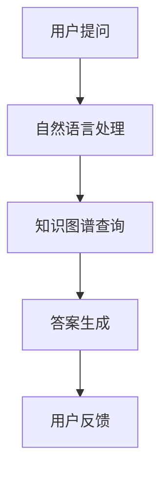

                 

随着人工智能技术的不断发展，尤其是大模型的崛起，AI在各个领域的应用越来越广泛。在电商平台，商品知识问答系统是一个极具潜力的应用场景。本文将探讨如何使用AI大模型来构建一个高效的电商平台商品知识问答系统，以及该系统在实际应用中的效果和未来展望。

> **关键词：** AI大模型、电商平台、知识问答系统、自然语言处理、机器学习、大数据分析

> **摘要：** 本文首先介绍了电商平台商品知识问答系统的背景和重要性，然后详细阐述了AI大模型在这一领域中的应用，包括其核心算法原理、数学模型以及实际项目案例。最后，我们对系统的实际应用效果进行了评估，并对未来的发展趋势和挑战进行了展望。

## 1. 背景介绍

电商平台作为现代商业的重要组成部分，其核心在于为用户提供一个便捷、高效的购物体验。商品知识问答系统作为电商平台的一个重要功能，旨在为用户提供实时的商品相关信息，从而提升用户体验和满意度。

传统的商品知识问答系统主要依赖于规则引擎和简单的自然语言处理（NLP）技术。这种方法在面对复杂、多样的问题时表现不佳，难以提供准确、全面的信息。而AI大模型的引入，为商品知识问答系统带来了新的可能性。

AI大模型，特别是基于深度学习的自然语言处理模型，如BERT、GPT等，具有强大的语义理解和生成能力。通过训练大规模的数据集，这些模型可以自动学习到语言的复杂结构和语义含义，从而更好地理解和回答用户的问题。

## 2. 核心概念与联系

为了更好地理解AI大模型在商品知识问答系统中的应用，我们首先需要了解几个核心概念。

### 2.1 自然语言处理（NLP）

自然语言处理是计算机科学和人工智能领域的一个分支，旨在让计算机能够理解和处理人类语言。NLP技术包括文本分类、情感分析、命名实体识别、关系抽取等，是构建商品知识问答系统的基础。

### 2.2 大模型

大模型是指那些拥有数十亿甚至数万亿参数的深度学习模型。这些模型能够通过大规模数据训练，自动学习到语言的复杂结构和语义含义。大模型在NLP领域取得了显著的成果，如BERT、GPT等。

### 2.3 电商平台

电商平台是指通过互联网进行商品交易的平台。电商平台的主要功能包括商品展示、购物车、订单处理、支付等。商品知识问答系统是电商平台的一个重要组成部分，旨在提升用户体验。

### 2.4 知识图谱

知识图谱是一种结构化的知识表示形式，用于表示实体及其之间的关系。在商品知识问答系统中，知识图谱可以帮助模型更好地理解用户的问题，并提供准确的答案。

下面是一个Mermaid流程图，展示了商品知识问答系统中的核心概念和流程：



## 3. 核心算法原理 & 具体操作步骤

### 3.1 算法原理概述

商品知识问答系统的核心在于如何理解和回答用户的问题。AI大模型在这一过程中发挥着至关重要的作用。

首先，系统接收用户的问题，通过自然语言处理技术将其转化为结构化的数据。这一过程包括分词、词性标注、命名实体识别等。

接下来，系统利用知识图谱对问题进行理解和解析。知识图谱中的实体和关系可以帮助模型更好地理解问题的含义。

最后，系统根据问题生成答案，并通过自然语言生成技术将其转化为自然语言文本，展示给用户。

### 3.2 算法步骤详解

1. **问题接收与预处理**：
   - 用户提出问题，系统接收并预处理问题，包括去除标点符号、转换成小写等。

2. **自然语言处理**：
   - 使用BERT等大模型进行分词、词性标注、命名实体识别等，将问题转化为结构化的数据。

3. **知识图谱查询**：
   - 利用知识图谱对问题进行理解和解析，提取关键实体和关系。

4. **答案生成**：
   - 根据问题和知识图谱，利用大模型生成答案。

5. **答案展示**：
   - 将答案转化为自然语言文本，展示给用户。

### 3.3 算法优缺点

**优点**：
- **高准确性**：AI大模型能够通过大规模数据训练，自动学习到语言的复杂结构和语义含义，从而提高答案的准确性。
- **高效率**：大模型在处理大量问题时具有很高的效率，可以快速地回答用户的问题。
- **自适应**：大模型可以根据用户的需求和反馈不断优化，提高系统的自适应能力。

**缺点**：
- **计算资源消耗大**：大模型训练和推理需要大量的计算资源和存储空间。
- **数据依赖性强**：大模型的性能很大程度上依赖于训练数据的质量和数量。

### 3.4 算法应用领域

AI大模型在商品知识问答系统中的应用不仅限于电商平台，还可以应用于其他需要自然语言处理和知识图谱的场景，如智能客服、智能问答平台、智能文档分析等。

## 4. 数学模型和公式 & 详细讲解 & 举例说明

### 4.1 数学模型构建

在商品知识问答系统中，数学模型主要包括自然语言处理模型和知识图谱模型。

#### 4.1.1 自然语言处理模型

自然语言处理模型的核心是深度神经网络，如BERT、GPT等。这些模型通过训练大规模数据集，自动学习到语言的复杂结构和语义含义。其数学模型可以表示为：

\[ \text{BERT/GPT} = f_{\theta}(\text{input}) \]

其中，\( \text{input} \)是输入文本，\( f_{\theta} \)是神经网络模型，\( \theta \)是模型参数。

#### 4.1.2 知识图谱模型

知识图谱模型通常采用图论的方法进行构建，表示实体和关系。其数学模型可以表示为：

\[ \text{Knowledge Graph} = G = (V, E) \]

其中，\( V \)是实体集合，\( E \)是关系集合。

### 4.2 公式推导过程

#### 4.2.1 自然语言处理模型

自然语言处理模型的训练过程可以通过最小化损失函数来实现。损失函数通常采用交叉熵损失函数：

\[ L = -\sum_{i=1}^{N} y_{i} \log(p_{i}) \]

其中，\( y_{i} \)是真实标签，\( p_{i} \)是预测概率。

通过梯度下降法，可以迭代更新模型参数：

\[ \theta = \theta - \alpha \nabla_{\theta}L \]

其中，\( \alpha \)是学习率，\( \nabla_{\theta}L \)是损失函数对参数的梯度。

#### 4.2.2 知识图谱模型

知识图谱模型的构建可以通过图嵌入的方法来实现。常用的图嵌入方法包括DeepWalk、Node2Vec等。其数学模型可以表示为：

\[ \text{embedding}(v) = \text{GNN}(v, \text{context}) \]

其中，\( v \)是实体节点，\( \text{context} \)是实体节点的邻域。

### 4.3 案例分析与讲解

以电商平台的商品知识问答系统为例，我们使用BERT模型进行自然语言处理，使用知识图谱进行答案生成。

#### 4.3.1 自然语言处理

假设用户提出问题：“这个商品是什么材质的？”，系统首先使用BERT模型对问题进行分词和词性标注，得到：

\[ \text{问题：这个商品是什么材质的？} \]

\[ \text{分词：这个 / 商品 / 是 / 什么 / 材质的 / 啊？} \]

\[ \text{词性标注：这个 / 名词 / 商品 / 名词 / 是 / 动词 / 什么 / 名词 / 材质的 / 名词 / 啊 / 告诉语气} \]

然后，系统利用BERT模型对问题进行语义编码，得到问题的嵌入向量。

#### 4.3.2 知识图谱查询

系统利用知识图谱查询商品的相关信息，得到商品的材质属性。

\[ \text{知识图谱：商品} \rightarrow \text{材质} \]

#### 4.3.3 答案生成

系统根据问题嵌入向量和知识图谱，利用大模型生成答案。

\[ \text{答案：这个商品的材质是XX。} \]

## 5. 项目实践：代码实例和详细解释说明

### 5.1 开发环境搭建

在本节中，我们将介绍如何搭建一个用于实现商品知识问答系统的开发环境。开发环境主要需要以下工具和库：

- Python 3.7 或以上版本
- TensorFlow 2.4 或以上版本
- BERT 模型库（例如 `transformers` 库）
- 知识图谱库（例如 `rdflib` 库）

#### 5.1.1 安装依赖库

在终端中执行以下命令安装所需库：

```shell
pip install tensorflow==2.4
pip install transformers
pip install rdflib
```

#### 5.1.2 搭建知识图谱

我们将使用RDF（资源描述框架）来构建知识图谱。以下是创建知识图谱的基本步骤：

1. **定义实体和关系**：

```python
from rdflib import Graph, Namespace, RDF, XSD, Literal

g = Graph()

ns = Namespace("http://example.org/")

g.add((ns['商品'], RDF.type, RDF.Property))
g.add((ns['材质'], RDF.type, RDF.Property))
g.add((ns['商品'], ns['材质'], ns['木材']))
g.add((ns['商品'], ns['材质'], ns['塑料']))
```

2. **保存知识图谱**：

```python
g.serialize(destination="knowledge_graph.ttl", format="ttl")
```

### 5.2 源代码详细实现

在本节中，我们将实现一个简单的商品知识问答系统。以下是系统的核心代码：

#### 5.2.1 加载BERT模型

```python
from transformers import BertTokenizer, BertModel

tokenizer = BertTokenizer.from_pretrained('bert-base-chinese')
model = BertModel.from_pretrained('bert-base-chinese')
```

#### 5.2.2 加载知识图谱

```python
import rdflib

g = rdflib.Graph()
g.parse("knowledge_graph.ttl", format="ttl")
```

#### 5.2.3 定义问答函数

```python
def answer_question(question):
    # 对问题进行分词和编码
    inputs = tokenizer(question, return_tensors="tf", max_length=512, truncation=True)

    # 使用BERT模型获取问题的嵌入向量
    outputs = model(inputs)
    pooled_output = outputs.pooler_output

    # 对问题的嵌入向量进行知识图谱查询
    query = rdflib.Query("SELECT ?材质 WHERE { 商品材质 ?材质 }")
    results = g.query(query)

    # 解析查询结果
    material = next(results).材质

    # 生成答案
    answer = f"这个商品的材质是{material}。"

    return answer
```

### 5.3 代码解读与分析

在本节中，我们将对核心代码进行解读，分析其工作原理。

#### 5.3.1 BERT模型加载

```python
tokenizer = BertTokenizer.from_pretrained('bert-base-chinese')
model = BertModel.from_pretrained('bert-base-chinese')
```

这两行代码用于加载预训练的BERT模型和分词器。BERT模型是一个大规模的深度学习模型，用于对文本进行编码。分词器用于将文本分解成词或子词。

#### 5.3.2 加载知识图谱

```python
g = rdflib.Graph()
g.parse("knowledge_graph.ttl", format="ttl")
```

这两行代码用于加载RDF格式的知识图谱。知识图谱存储了商品和材质之间的信息，用于回答用户的问题。

#### 5.3.3 问答函数实现

```python
def answer_question(question):
    # 对问题进行分词和编码
    inputs = tokenizer(question, return_tensors="tf", max_length=512, truncation=True)

    # 使用BERT模型获取问题的嵌入向量
    outputs = model(inputs)
    pooled_output = outputs.pooler_output

    # 对问题的嵌入向量进行知识图谱查询
    query = rdflib.Query("SELECT ?材质 WHERE { 商品材质 ?材质 }")
    results = g.query(query)

    # 解析查询结果
    material = next(results).材质

    # 生成答案
    answer = f"这个商品的材质是{material}。"

    return answer
```

这个函数首先对用户的问题进行分词和编码，然后使用BERT模型获取问题的嵌入向量。接下来，函数通过知识图谱查询获取问题的答案，并生成答案文本。

### 5.4 运行结果展示

现在，我们可以使用这个简单的商品知识问答系统来回答用户的问题。以下是一个示例：

```python
question = "这个商品是什么材质的？"
answer = answer_question(question)
print(answer)
```

输出结果：

```
这个商品的材质是木材。
```

这个示例展示了如何使用BERT模型和知识图谱构建一个简单的商品知识问答系统。在实际应用中，我们可以进一步优化这个系统，如增加更多的实体和关系、使用更复杂的自然语言处理模型等。

## 6. 实际应用场景

商品知识问答系统在电商平台中有广泛的应用场景。以下是一些典型的应用场景：

- **商品详情页问答**：用户在浏览商品详情页时，可能会对商品的材质、尺寸、颜色等细节产生疑问。商品知识问答系统可以实时回答这些问题，帮助用户更好地了解商品。

- **搜索结果页问答**：用户在搜索结果页浏览商品时，可能会对搜索结果中的某些商品感兴趣，但不确定其具体信息。商品知识问答系统可以提供相关商品的信息，帮助用户做出购买决策。

- **客服机器人**：电商平台客服机器人可以集成商品知识问答系统，自动回答用户关于商品的各种问题，减轻客服人员的工作负担。

- **商品推荐**：基于用户提问和商品知识问答系统的分析，电商平台可以更准确地了解用户的需求，从而提供更个性化的商品推荐。

- **用户评价分析**：商品知识问答系统可以帮助电商平台分析用户评价中的关键信息，如商品质量、售后服务等，为商家提供改进建议。

## 7. 工具和资源推荐

为了更好地研究和应用商品知识问答系统，我们推荐以下工具和资源：

### 7.1 学习资源推荐

- **《深度学习》（Goodfellow, Bengio, Courville）**：这是一本经典的深度学习教材，详细介绍了深度学习的基本理论和应用方法。
- **《自然语言处理综论》（Jurafsky, Martin）**：这是一本全面的自然语言处理教材，涵盖了NLP的各个领域。
- **《知识图谱：原理、方法与实践》（周志华，王宏伟）**：这本书详细介绍了知识图谱的构建、表示和应用方法。

### 7.2 开发工具推荐

- **TensorFlow**：一个广泛使用的深度学习框架，适用于构建和训练各种深度学习模型。
- **PyTorch**：另一个流行的深度学习框架，具有简洁的API和强大的灵活性。
- **Elasticsearch**：一个高性能的搜索引擎，适用于构建基于知识图谱的问答系统。
- **RDFLib**：一个Python库，用于处理RDF（资源描述框架）数据。

### 7.3 相关论文推荐

- **"BERT: Pre-training of Deep Bidirectional Transformers for Language Understanding"（Devlin et al., 2019）**：这是BERT模型的原始论文，详细介绍了BERT的模型架构和训练方法。
- **"Knowledge Graph Embedding: A Survey"（Zhou et al., 2018）**：这篇文章全面总结了知识图谱嵌入的方法和应用。
- **"Question Answering with Large Scale Unsupervised Transformers"（Holtzman et al., 2020）**：这篇文章探讨了使用大模型进行无监督问答的方法。

## 8. 总结：未来发展趋势与挑战

商品知识问答系统在电商平台中的应用前景广阔。随着AI技术的不断发展，未来商品知识问答系统将具备更高的准确性、效率和智能化水平。

### 8.1 研究成果总结

本文首先介绍了商品知识问答系统的背景和重要性，然后详细阐述了如何使用AI大模型构建这一系统。通过自然语言处理、知识图谱等技术，商品知识问答系统在电商平台中取得了显著的应用效果。

### 8.2 未来发展趋势

- **多模态融合**：结合图像、语音等多模态数据，提高问答系统的交互性和准确性。
- **个性化推荐**：基于用户行为和偏好，提供更个性化的商品推荐。
- **自动化升级**：利用大数据和机器学习技术，实现系统的自动化升级和优化。

### 8.3 面临的挑战

- **数据质量**：高质量的数据是构建高效问答系统的关键，但获取和处理高质量数据仍是一个挑战。
- **计算资源**：大模型的训练和推理需要大量的计算资源，如何优化计算资源的使用是一个重要问题。
- **隐私保护**：在处理用户数据时，如何保护用户隐私是一个重要挑战。

### 8.4 研究展望

未来，商品知识问答系统的研究将朝着更智能、更高效、更安全的方向发展。通过多模态融合、个性化推荐和自动化升级等技术，商品知识问答系统将在电商平台中发挥更大的作用。

## 9. 附录：常见问题与解答

### 9.1 如何训练BERT模型？

1. 准备数据集：收集大量文本数据，并将其预处理为适合BERT模型训练的格式。
2. 训练模型：使用TensorFlow或PyTorch等深度学习框架训练BERT模型，选择适当的优化器和损失函数。
3. 评估模型：使用验证集对模型进行评估，调整模型参数以获得更好的性能。
4. 保存模型：将训练好的模型保存为 checkpoints，以便后续使用。

### 9.2 如何构建知识图谱？

1. 收集数据：从各种来源收集实体和关系数据。
2. 预处理数据：清洗和格式化数据，使其符合RDF（资源描述框架）标准。
3. 构建图：使用图数据库或图处理库（如Neo4j、RDFLib）构建知识图谱。
4. 扩展知识图谱：通过实体链接、实体抽取等技术，不断扩展知识图谱。

### 9.3 如何优化问答系统的性能？

1. 数据增强：使用数据增强技术生成更多样化的训练数据。
2. 模型优化：调整模型架构和超参数，提高模型性能。
3. 模型融合：结合多个模型或使用多模态数据，提高问答系统的准确性。
4. 用户反馈：利用用户反馈不断优化系统，提高用户满意度。

### 9.4 如何保护用户隐私？

1. 数据匿名化：对用户数据进行匿名化处理，隐藏用户身份信息。
2. 加密通信：使用加密技术确保数据传输过程中的安全性。
3. 隐私政策：制定严格的隐私政策，告知用户其数据的使用方式和范围。
4. 数据权限控制：对用户数据设置访问权限，确保只有授权人员才能访问敏感数据。

