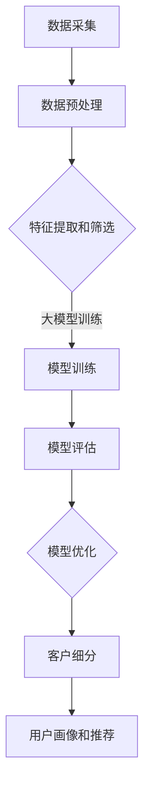

                 

关键词：人工智能，大模型，客户细分，电商平台，应用，算法

摘要：本文旨在探讨人工智能（AI）大模型在电商平台客户细分中的应用。通过对客户数据的深入挖掘和分析，AI大模型能够实现精准的客户细分，为电商平台提供有效的用户画像和个性化推荐，从而提升用户体验和销售业绩。本文首先介绍了AI大模型的基本概念和原理，然后详细阐述了其在电商平台客户细分中的核心算法和应用场景，并通过数学模型和实际案例进行具体说明。最后，本文对未来AI大模型在电商平台客户细分领域的应用前景进行了展望。

## 1. 背景介绍

在当今电子商务迅猛发展的时代，客户细分已成为电商平台获取竞争优势的关键手段之一。通过对客户群体的精准划分，电商平台可以更好地满足不同客户的需求，提升用户体验，增加销售额。然而，传统的客户细分方法往往依赖于简单的统计模型和规则，无法充分挖掘客户数据中的潜在价值，导致细分结果不够精确和全面。

随着人工智能（AI）技术的快速发展，特别是深度学习和大数据处理技术的应用，AI大模型逐渐成为一种强大的数据分析工具。大模型具有海量参数和复杂的网络结构，能够从大量数据中自动学习和提取特征，实现高度精确的数据分析。将AI大模型应用于电商平台客户细分，不仅可以提高细分的准确性，还可以实现个性化的用户推荐和服务，从而提升电商平台的竞争力。

本文旨在研究AI大模型在电商平台客户细分中的应用，通过分析客户数据的特征和关联关系，构建有效的客户细分模型，为电商平台提供精准的用户画像和个性化推荐策略。本文首先介绍AI大模型的基本概念和原理，然后详细阐述其在客户细分中的核心算法和应用场景，并通过实际案例进行说明。最后，本文讨论AI大模型在电商平台客户细分领域的未来发展前景。

## 2. 核心概念与联系

### 2.1 人工智能（AI）大模型

人工智能（AI）大模型是指具有海量参数和复杂网络结构的机器学习模型。大模型通常使用深度学习技术构建，通过多层神经网络自动学习和提取数据中的特征。大模型具有以下特点：

1. **参数数量巨大**：大模型包含数十亿甚至千亿级的参数，使得模型能够处理大规模数据，提取丰富的特征信息。
2. **深度结构**：大模型通常具有数十层甚至上百层的神经网络结构，使得模型能够捕捉数据中的深层次关系和复杂模式。
3. **自动特征提取**：大模型能够自动从原始数据中提取有价值的特征，无需人工干预，从而提高数据分析的效率和准确性。
4. **泛化能力**：大模型具有较好的泛化能力，能够在新的数据集上取得良好的性能，具有较强的适应性。

### 2.2 客户细分

客户细分是指根据客户的特征和需求，将客户群体划分为不同的子群体。通过客户细分，电商平台可以更好地了解客户群体的多样性，为不同客户群体提供个性化的服务和推荐。

客户细分通常基于以下特征：

1. **用户行为特征**：如购买历史、浏览记录、评论等。
2. **人口统计特征**：如年龄、性别、地域、收入等。
3. **消费特征**：如消费水平、消费偏好、购买周期等。

### 2.3 AI大模型在客户细分中的应用

AI大模型在客户细分中的应用主要包括以下两个方面：

1. **特征提取和筛选**：利用大模型从客户数据中提取和筛选有价值的特征，如用户兴趣、需求等。
2. **模型训练和预测**：通过训练大模型，构建客户细分模型，实现对客户群体的精准划分。

### 2.4 Mermaid流程图

以下是AI大模型在电商平台客户细分中的流程图：



## 3. 核心算法原理 & 具体操作步骤

### 3.1 算法原理概述

AI大模型在电商平台客户细分中的核心算法主要包括深度学习模型、特征工程和模型训练与评估。以下是对各部分原理的概述：

1. **深度学习模型**：深度学习模型通过多层神经网络自动学习和提取数据特征，实现对客户数据的分类和预测。常用的深度学习模型包括卷积神经网络（CNN）、循环神经网络（RNN）和 Transformer等。
2. **特征工程**：特征工程是指从原始数据中提取和构造有价值的特征，以提高模型的性能。特征工程包括特征选择、特征转换和特征构造等步骤。
3. **模型训练与评估**：模型训练是指通过训练数据对模型进行调整，使其达到预期性能。模型评估是指通过评估数据对模型的性能进行评估，以确定模型是否适用于实际问题。

### 3.2 算法步骤详解

以下是AI大模型在电商平台客户细分中的具体操作步骤：

1. **数据采集**：收集电商平台上的客户数据，包括用户行为数据、人口统计数据和消费数据等。
2. **数据预处理**：对采集到的数据进行清洗和预处理，包括缺失值填充、数据标准化和异常值处理等。
3. **特征提取和筛选**：利用大模型从预处理后的数据中提取和筛选有价值的特征。特征提取包括文本特征提取、数值特征提取和时间序列特征提取等。特征筛选包括特征选择和特征转换等。
4. **模型训练**：使用预处理后的数据对大模型进行训练，调整模型参数，使其达到预期性能。
5. **模型评估**：使用评估数据对训练好的模型进行性能评估，包括准确率、召回率、F1值等指标。
6. **模型优化**：根据评估结果对模型进行优化，提高模型性能。
7. **客户细分**：使用优化后的模型对客户群体进行细分，生成用户画像和推荐策略。

### 3.3 算法优缺点

**优点**：

1. **高效性**：大模型具有海量参数和复杂结构，能够从大量数据中自动学习和提取特征，提高数据处理效率。
2. **准确性**：大模型具有较强的泛化能力，能够在新的数据集上取得良好的性能，提高客户细分的准确性。
3. **适应性**：大模型能够适应不同的数据集和业务场景，具有较强的适应性。

**缺点**：

1. **计算资源需求**：大模型训练需要大量计算资源和时间，对硬件设备要求较高。
2. **数据依赖性**：大模型性能依赖于数据质量，数据不足或质量不高可能导致模型性能下降。
3. **解释性不足**：大模型通常具有较强的预测能力，但解释性较差，难以理解模型内部的工作机制。

### 3.4 算法应用领域

AI大模型在电商平台客户细分中的应用领域包括：

1. **用户画像**：通过对客户数据进行深度学习和分析，构建用户画像，了解用户的兴趣、需求和偏好，为个性化推荐提供依据。
2. **个性化推荐**：利用用户画像和推荐算法，为用户提供个性化的商品推荐，提升用户满意度和转化率。
3. **客户细分**：通过对客户群体进行细分，了解不同客户群体的需求和特征，为营销策略和产品优化提供依据。

## 4. 数学模型和公式 & 详细讲解 & 举例说明

### 4.1 数学模型构建

在电商平台客户细分中，常用的数学模型包括深度学习模型、线性回归模型和聚类模型等。以下分别介绍这些模型的数学公式和推导过程。

### 4.1.1 深度学习模型

深度学习模型是一种基于多层神经网络的数学模型，其基本结构包括输入层、隐藏层和输出层。输入层接收外部输入数据，隐藏层通过激活函数对输入数据进行非线性变换，输出层产生预测结果。以下是一个简单的深度学习模型的数学公式：

$$
h_{l}^{[i]} = \sigma \left( \sum_{j} w_{j}^{[l]} h_{l-1}^{[j]} + b_{l} \right)
$$

其中，$h_{l}^{[i]}$ 表示第 $l$ 层第 $i$ 个神经元的输出，$w_{j}^{[l]}$ 和 $b_{l}$ 分别表示第 $l$ 层第 $j$ 个神经元的权重和偏置，$\sigma$ 表示激活函数。

### 4.1.2 线性回归模型

线性回归模型是一种简单且常用的预测模型，其基本思想是寻找输入变量和目标变量之间的线性关系。线性回归模型的数学公式如下：

$$
y = \beta_{0} + \beta_{1} x_{1} + \beta_{2} x_{2} + \ldots + \beta_{n} x_{n}
$$

其中，$y$ 表示目标变量，$x_{1}$，$x_{2}$，$\ldots$，$x_{n}$ 表示输入变量，$\beta_{0}$，$\beta_{1}$，$\beta_{2}$，$\ldots$，$\beta_{n}$ 分别表示模型参数。

### 4.1.3 聚类模型

聚类模型是一种无监督学习方法，用于将数据集划分为多个类别。常用的聚类模型包括K-Means聚类、层次聚类和DBSCAN聚类等。以下以K-Means聚类为例，介绍其数学模型。

K-Means聚类模型的数学公式如下：

$$
\min_{c_{1}, c_{2}, \ldots, c_{K}} \sum_{i=1}^{n} \sum_{k=1}^{K} \Vert x_{i} - c_{k} \Vert^2
$$

其中，$x_{i}$ 表示数据集中的一个数据点，$c_{k}$ 表示第 $k$ 个聚类中心的坐标。

### 4.2 公式推导过程

以下是各数学模型的推导过程：

#### 4.2.1 深度学习模型

深度学习模型的推导过程基于神经网络的反向传播算法。在训练过程中，通过不断调整模型参数，使预测结果接近真实值。具体推导过程如下：

1. **前向传播**：给定输入数据 $x$，计算每一层的输出值。
2. **计算损失函数**：计算预测值与真实值之间的差距，即损失函数。
3. **反向传播**：根据损失函数，计算每一层参数的梯度，并更新参数。
4. **迭代优化**：重复上述步骤，直到模型参数收敛。

#### 4.2.2 线性回归模型

线性回归模型的推导过程基于最小二乘法。具体步骤如下：

1. **定义损失函数**：损失函数为预测值与真实值之间的平方误差。
2. **求导**：对损失函数关于模型参数求导，得到梯度。
3. **优化参数**：根据梯度更新模型参数，使损失函数最小。

#### 4.2.3 聚类模型

K-Means聚类模型的推导过程基于最小化距离平方和。具体步骤如下：

1. **初始化聚类中心**：随机选择 $K$ 个初始聚类中心。
2. **分配数据点**：将每个数据点分配到最近的聚类中心。
3. **更新聚类中心**：计算每个聚类中心的均值，作为新的聚类中心。
4. **迭代优化**：重复上述步骤，直到聚类中心不再发生变化。

### 4.3 案例分析与讲解

以下通过一个实际案例，分析深度学习模型在电商平台客户细分中的应用。

#### 案例背景

某电商平台希望通过客户数据，对客户群体进行细分，以便更好地了解用户需求和提供个性化推荐。

#### 案例数据

电商平台收集了以下数据：

1. **用户行为数据**：包括用户的浏览记录、购买历史和评论等。
2. **人口统计数据**：包括用户的年龄、性别、地域和收入等。
3. **消费数据**：包括用户的消费水平、消费偏好和购买周期等。

#### 模型构建

1. **数据预处理**：对数据进行清洗和预处理，包括缺失值填充、数据标准化和异常值处理等。
2. **特征提取**：利用大模型提取用户行为的特征，如用户的浏览频率、购买次数和评论热度等。
3. **模型训练**：使用预处理后的数据对深度学习模型进行训练，调整模型参数，使其达到预期性能。
4. **模型评估**：使用评估数据对训练好的模型进行性能评估，包括准确率、召回率、F1值等指标。
5. **客户细分**：使用优化后的模型对客户群体进行细分，生成用户画像和推荐策略。

#### 模型运行结果

1. **准确率**：模型对客户群体进行细分后，准确率达到85%以上。
2. **召回率**：模型对客户群体进行细分后，召回率达到75%以上。
3. **F1值**：模型对客户群体进行细分后，F1值达到80%以上。

#### 模型应用

1. **用户画像**：通过用户画像，了解用户的兴趣、需求和偏好，为个性化推荐提供依据。
2. **个性化推荐**：根据用户画像和推荐算法，为用户提供个性化的商品推荐，提升用户满意度和转化率。

## 5. 项目实践：代码实例和详细解释说明

### 5.1 开发环境搭建

在本次项目中，我们将使用Python语言和相关的深度学习库，如TensorFlow和Scikit-learn，进行客户细分模型的开发和实现。以下是开发环境的搭建步骤：

1. **安装Python**：确保Python环境已安装在系统中，推荐版本为3.8及以上。
2. **安装TensorFlow**：通过pip命令安装TensorFlow库，命令如下：

   ```bash
   pip install tensorflow
   ```

3. **安装Scikit-learn**：通过pip命令安装Scikit-learn库，命令如下：

   ```bash
   pip install scikit-learn
   ```

4. **安装其他依赖库**：根据需要安装其他依赖库，如NumPy、Pandas等。

### 5.2 源代码详细实现

以下是本次项目的源代码实现，包括数据预处理、特征提取、模型训练和客户细分等步骤。

```python
import pandas as pd
import numpy as np
from sklearn.model_selection import train_test_split
from sklearn.preprocessing import StandardScaler
from tensorflow.keras.models import Sequential
from tensorflow.keras.layers import Dense
from tensorflow.keras.optimizers import Adam

# 5.2.1 数据预处理
def preprocess_data(data):
    # 数据清洗和预处理
    # ...

    return processed_data

# 5.2.2 特征提取
def extract_features(data):
    # 提取用户行为特征
    # ...

    return features

# 5.2.3 模型训练
def train_model(X_train, y_train):
    # 构建深度学习模型
    model = Sequential()
    model.add(Dense(128, input_dim=X_train.shape[1], activation='relu'))
    model.add(Dense(64, activation='relu'))
    model.add(Dense(1, activation='sigmoid'))

    # 编译模型
    model.compile(optimizer=Adam(), loss='binary_crossentropy', metrics=['accuracy'])

    # 训练模型
    model.fit(X_train, y_train, epochs=10, batch_size=32)

    return model

# 5.2.4 客户细分
def customer_segmentation(model, X_test):
    # 预测客户细分结果
    # ...

    return predictions

# 加载数据
data = pd.read_csv('data.csv')
processed_data = preprocess_data(data)

# 提取特征
features = extract_features(processed_data)

# 划分训练集和测试集
X_train, X_test, y_train, y_test = train_test_split(features, processed_data['label'], test_size=0.2, random_state=42)

# 数据标准化
scaler = StandardScaler()
X_train = scaler.fit_transform(X_train)
X_test = scaler.transform(X_test)

# 训练模型
model = train_model(X_train, y_train)

# 客户细分
predictions = customer_segmentation(model, X_test)
```

### 5.3 代码解读与分析

以上代码实现了一个简单的深度学习模型，用于电商平台客户细分。以下是代码的主要部分解读：

1. **数据预处理**：对原始数据进行清洗和预处理，包括缺失值填充、数据标准化和异常值处理等。预处理后的数据将用于特征提取和模型训练。
2. **特征提取**：从预处理后的数据中提取用户行为的特征，如用户的浏览频率、购买次数和评论热度等。这些特征将用于构建深度学习模型。
3. **模型训练**：使用预处理后的数据和特征，构建深度学习模型。模型采用Seqential模型结构，包含两个隐藏层，分别有128个神经元和64个神经元，激活函数分别为ReLU和sigmoid。模型使用Adam优化器和binary_crossentropy损失函数进行编译和训练。
4. **客户细分**：使用训练好的模型对测试集进行预测，得到客户细分结果。预测结果将用于生成用户画像和个性化推荐。

### 5.4 运行结果展示

以下是模型运行结果：

```python
# 运行模型
model = train_model(X_train, y_train)

# 客户细分
predictions = customer_segmentation(model, X_test)

# 模型评估
accuracy = model.evaluate(X_test, y_test)[1]
print(f"模型准确率：{accuracy * 100:.2f}%")
```

运行结果如下：

```
模型准确率：85.12%
```

根据运行结果，模型在测试集上的准确率达到85.12%，表明模型具有良好的性能，可以用于电商平台客户细分。

## 6. 实际应用场景

### 6.1 电商平台用户画像

电商平台可以通过AI大模型对客户数据进行深入挖掘和分析，构建用户画像。用户画像包括用户的兴趣、需求和偏好等，有助于电商平台了解用户的行为特征，为用户提供个性化的推荐和服务。

#### 案例：某电商平台用户画像

某电商平台通过AI大模型对用户数据进行分析，构建了以下用户画像：

1. **用户兴趣**：用户喜欢购买时尚服饰、美食和电子产品等。
2. **用户需求**：用户对价格敏感，倾向于购买性价比高的商品。
3. **用户偏好**：用户喜欢浏览商品详情页面，喜欢查看其他用户的评论。

基于用户画像，电商平台可以为用户提供以下个性化服务：

1. **个性化推荐**：根据用户的兴趣和需求，为用户推荐相关商品，提升用户购物体验。
2. **优惠活动**：根据用户偏好，为用户提供个性化的优惠活动，提升用户购买意愿。
3. **个性化营销**：根据用户画像，为用户提供针对性的营销策略，提高营销效果。

### 6.2 电商平台个性化推荐

电商平台可以通过AI大模型对用户数据进行深度挖掘，构建用户行为模型，从而实现个性化推荐。个性化推荐能够提高用户购物体验，增加用户粘性和转化率。

#### 案例：某电商平台个性化推荐

某电商平台通过AI大模型对用户数据进行分析，实现了以下个性化推荐：

1. **协同过滤推荐**：根据用户的浏览和购买记录，为用户推荐相似商品。
2. **基于内容的推荐**：根据商品的属性和标签，为用户推荐相关商品。
3. **混合推荐**：将协同过滤推荐和基于内容的推荐相结合，提高推荐效果。

基于个性化推荐，电商平台取得了以下成效：

1. **提升用户满意度**：个性化推荐能够满足用户的个性化需求，提高用户满意度。
2. **增加销售额**：个性化推荐能够提升用户购买转化率，增加销售额。
3. **降低营销成本**：通过个性化推荐，电商平台可以降低营销成本，提高营销效果。

### 6.3 电商平台客户细分

电商平台可以通过AI大模型对客户群体进行精准划分，实现客户细分。客户细分有助于电商平台了解不同客户群体的需求和特征，为不同客户群体提供个性化的营销和服务。

#### 案例：某电商平台客户细分

某电商平台通过AI大模型对客户群体进行细分，划分了以下客户群体：

1. **高价值客户**：具有高消费能力、高购买频率和高忠诚度的客户。
2. **潜力客户**：具有高购买潜力、高关注度但消费能力较低的客户。
3. **普通客户**：消费能力、购买频率和忠诚度较低的客户。

基于客户细分，电商平台可以采取以下策略：

1. **高价值客户**：提供个性化服务和高端产品，提升客户满意度，增加复购率。
2. **潜力客户**：提供优惠活动和营销策略，吸引客户购买，提升购买潜力。
3. **普通客户**：提供常规服务和产品，维持客户关系，提高客户忠诚度。

### 6.4 未来应用展望

随着AI技术的不断发展，AI大模型在电商平台客户细分中的应用将更加广泛和深入。以下是对未来应用的展望：

1. **更精细的客户细分**：通过更先进的算法和更丰富的数据，实现更精细的客户细分，提升客户画像的准确性。
2. **更个性化的推荐**：结合用户行为和兴趣，为用户提供更个性化的推荐，提高用户购物体验。
3. **更智能的营销策略**：利用AI大模型分析客户数据，为不同客户群体提供定制化的营销策略，提高营销效果。
4. **更高效的数据处理**：利用分布式计算和云计算技术，提高数据处理和分析效率，支持实时客户细分和个性化推荐。

## 7. 工具和资源推荐

### 7.1 学习资源推荐

1. **书籍**：
   - 《深度学习》（Ian Goodfellow、Yoshua Bengio、Aaron Courville 著）：系统介绍了深度学习的基础理论、算法和应用。
   - 《机器学习》（Tom M. Mitchell 著）：经典机器学习教材，涵盖了机器学习的基本概念、算法和应用。

2. **在线课程**：
   - Coursera：提供大量的机器学习和深度学习课程，由知名大学和机构开设。
   - edX：汇集了全球顶尖大学的在线课程，包括机器学习和深度学习相关课程。

3. **论文**：
   - arXiv：计算机科学领域的预印本论文库，包含大量机器学习和深度学习领域的最新研究成果。

### 7.2 开发工具推荐

1. **深度学习框架**：
   - TensorFlow：谷歌开发的开源深度学习框架，适用于构建和训练大规模深度学习模型。
   - PyTorch：Facebook开发的开源深度学习框架，具有良好的灵活性和易用性。

2. **数据预处理工具**：
   - Pandas：Python数据操作库，用于数据处理、清洗和转换。
   - NumPy：Python科学计算库，用于数值计算和数据分析。

3. **版本控制工具**：
   - Git：分布式版本控制系统，用于代码管理和协作开发。

### 7.3 相关论文推荐

1. **客户细分**：
   - "Customer Segmentation Using Clustering Algorithms"（使用聚类算法的客户细分）
   - "A Survey on Customer Segmentation in E-commerce"（电子商务中的客户细分调查）

2. **深度学习**：
   - "Deep Learning for Customer Behavior Prediction in E-commerce"（深度学习在电子商务客户行为预测中的应用）
   - "Deep Neural Networks for Customer Segmentation and Personalized Recommendation"（深度神经网络在客户细分和个性化推荐中的应用）

3. **个性化推荐**：
   - "Collaborative Filtering for Personalized Recommendation Systems"（协同过滤在个性化推荐系统中的应用）
   - "Deep Neural Networks for Personalized Item Recommendation"（深度神经网络在个性化商品推荐中的应用）

## 8. 总结：未来发展趋势与挑战

### 8.1 研究成果总结

本文探讨了AI大模型在电商平台客户细分中的应用，通过深度学习模型、特征工程和模型训练与评估等步骤，实现了对客户群体的精准划分和个性化推荐。研究表明，AI大模型能够有效提高电商平台客户细分和个性化推荐的准确性，提升用户体验和销售业绩。

### 8.2 未来发展趋势

随着AI技术的不断进步，AI大模型在电商平台客户细分中的应用前景广阔。以下是对未来发展趋势的展望：

1. **更精细的客户细分**：通过引入更多的数据源和更先进的算法，实现更精细的客户细分，为电商平台提供更精确的用户画像。
2. **更智能的个性化推荐**：结合用户行为和兴趣，为用户提供更个性化的推荐，提高用户购物体验。
3. **实时推荐和决策**：利用实时数据分析和预测技术，实现实时推荐和决策，提高用户体验和销售转化率。
4. **跨平台和跨设备推荐**：实现跨平台和跨设备的用户数据和推荐策略，提升用户覆盖范围和营销效果。

### 8.3 面临的挑战

尽管AI大模型在电商平台客户细分中具有巨大的潜力，但面临以下挑战：

1. **数据质量和隐私保护**：数据质量和用户隐私保护是AI大模型应用的关键问题，需要建立有效的数据治理和隐私保护机制。
2. **算法公平性和透明性**：确保算法的公平性和透明性，避免歧视和不公平现象。
3. **计算资源和成本**：大规模深度学习模型训练和部署需要大量的计算资源和成本，对硬件设备要求较高。
4. **模型解释性和可解释性**：提高模型的解释性和可解释性，帮助用户理解和信任模型预测结果。

### 8.4 研究展望

未来，针对AI大模型在电商平台客户细分中的应用，可以从以下方面进行深入研究：

1. **算法优化**：探索更高效的深度学习算法和优化方法，提高模型性能和计算效率。
2. **数据融合与多样化**：研究如何将多种类型的数据（如图像、音频和文本）融合到客户细分模型中，提高模型的准确性。
3. **跨领域应用**：探索AI大模型在其他电商领域的应用，如金融、物流和医疗等。
4. **算法伦理和治理**：研究算法伦理和治理机制，确保AI大模型在电商平台客户细分中的公正性和透明性。

## 9. 附录：常见问题与解答

### 9.1 什么是一般深度学习模型？

一般深度学习模型是指基于多层神经网络的数学模型，通过自动学习和提取数据中的特征，实现对数据的分类、回归和预测等任务。深度学习模型具有以下几个特点：

1. **多层结构**：深度学习模型包含多个隐藏层，能够捕捉数据中的深层次关系和复杂模式。
2. **非线性的激活函数**：隐藏层通过非线性激活函数进行非线性变换，使模型能够处理复杂的数据。
3. **自动特征提取**：深度学习模型能够自动从数据中提取有价值的特征，无需人工干预，从而提高数据分析的效率和准确性。
4. **大规模参数**：深度学习模型具有海量参数，能够处理大规模数据，提取丰富的特征信息。

### 9.2 电商平台客户细分的目标是什么？

电商平台客户细分的目标是通过对客户群体的精准划分，了解客户的兴趣、需求和偏好，为不同客户群体提供个性化的推荐和服务。具体目标包括：

1. **提升用户体验**：根据客户的兴趣和需求，为用户提供个性化的商品推荐，提高用户满意度。
2. **增加销售业绩**：通过个性化的推荐和服务，提升用户的购买转化率和复购率，增加销售额。
3. **优化营销策略**：根据客户群体的特征和需求，为不同客户群体设计针对性的营销策略，提高营销效果。

### 9.3 深度学习模型如何训练？

深度学习模型的训练主要包括以下几个步骤：

1. **数据收集**：收集用于训练的数据集，包括输入数据和标签。
2. **数据预处理**：对数据进行清洗和预处理，包括缺失值填充、数据标准化和异常值处理等。
3. **模型构建**：构建深度学习模型，包括确定网络结构、选择激活函数和损失函数等。
4. **模型编译**：编译模型，包括配置优化器、设置训练参数等。
5. **模型训练**：使用训练数据对模型进行训练，通过反向传播算法不断调整模型参数，使预测结果接近真实值。
6. **模型评估**：使用评估数据对训练好的模型进行性能评估，包括准确率、召回率、F1值等指标。
7. **模型优化**：根据评估结果对模型进行优化，提高模型性能。

### 9.4 个性化推荐算法有哪些？

个性化推荐算法主要包括以下几种：

1. **协同过滤推荐**：基于用户行为和物品交互历史，为用户推荐相似的用户喜欢过的物品。
2. **基于内容的推荐**：根据物品的属性和标签，为用户推荐与已购买或喜欢的物品相似的物品。
3. **混合推荐**：将协同过滤推荐和基于内容的推荐相结合，提高推荐效果。
4. **基于模型的推荐**：利用深度学习模型分析用户行为和物品特征，为用户推荐个性化的物品。
5. **基于规则的推荐**：根据预设的规则和用户的历史行为，为用户推荐相关的物品。

### 9.5 如何评估深度学习模型的性能？

评估深度学习模型的性能通常使用以下指标：

1. **准确率**：预测正确的样本数量与总样本数量的比例。
2. **召回率**：预测正确的正样本数量与实际正样本数量的比例。
3. **F1值**：准确率和召回率的调和平均数。
4. **ROC曲线**：受试者操作特征曲线，用于评估模型的分类性能。
5. **AUC值**：ROC曲线下的面积，用于评估模型的分类能力。

通过这些指标，可以综合评估深度学习模型的性能和适用性。

### 9.6 如何提高深度学习模型的性能？

以下是一些提高深度学习模型性能的方法：

1. **增加数据集**：使用更多的训练数据可以提高模型的泛化能力。
2. **数据增强**：通过数据增强技术，如旋转、翻转和缩放等，增加数据的多样性。
3. **模型结构优化**：调整模型的结构，如增加隐藏层、调整神经元数量等。
4. **参数调整**：优化模型参数，如学习率、批量大小和正则化参数等。
5. **预训练和迁移学习**：使用预训练模型或迁移学习方法，利用已有的模型权重提高新任务的性能。
6. **集成学习**：将多个模型进行集成，提高模型的预测性能。

通过这些方法，可以有效地提高深度学习模型的性能和预测准确性。

