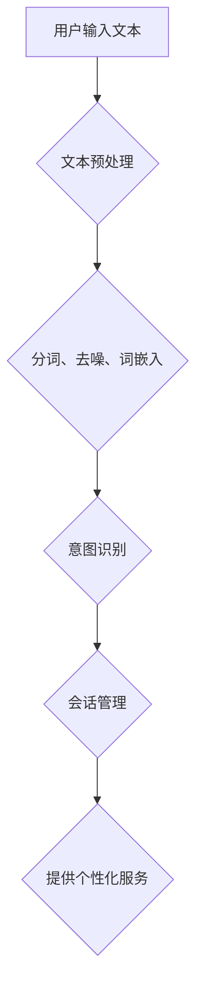

                 

关键词：人工智能，大模型，用户意图识别，会话管理，电商平台

> 摘要：本文将探讨大模型在电商平台用户意图识别与会话管理中的应用。通过分析大模型的工作原理和优势，以及其在实际应用中的具体案例，本文旨在展示大模型在提升电商平台用户体验、优化运营策略方面的潜力。

## 1. 背景介绍

随着互联网的普及和电子商务的快速发展，电商平台已经成为人们生活中不可或缺的一部分。用户在电商平台上的行为日益复杂，如何准确识别用户的意图和需求，从而提供个性化的服务，成为电商平台关注的重点。在此背景下，人工智能技术，尤其是大模型技术，逐渐崭露头角。

大模型是指具有数十亿甚至千亿参数的深度学习模型，如Transformer、BERT等。这些模型通过学习大量的文本数据，能够捕捉到语言中的深层语义信息。在用户意图识别和会话管理中，大模型的应用使得系统能够更加准确地理解用户的输入，提供更加智能化的服务。

## 2. 核心概念与联系

### 2.1 大模型的工作原理

大模型通常基于神经网络架构，通过多层非线性变换对输入数据进行处理。以Transformer为例，其核心思想是自注意力机制（Self-Attention），能够捕捉输入序列中各个元素之间的关联性。BERT（Bidirectional Encoder Representations from Transformers）则在Transformer的基础上引入了双向信息传递，使得模型能够同时考虑上下文信息。

### 2.2 用户意图识别与会话管理

用户意图识别是指从用户的输入中提取出其意图或需求，以提供相应的服务。会话管理则是维护用户与平台之间的对话状态，确保对话的连贯性和有效性。

大模型在用户意图识别和会话管理中的作用主要体现在以下几个方面：

1. **文本预处理**：大模型能够对用户输入的文本进行预处理，如分词、去噪、词嵌入等，为后续的意图识别和会话管理提供可靠的数据基础。

2. **意图识别**：大模型通过学习大量的用户交互数据，能够识别出用户输入中的意图。例如，当用户询问“有没有便宜的衣服？”时，大模型可以识别出其意图是寻找价格较低的服装。

3. **会话管理**：大模型能够维护用户会话状态，根据上下文信息提供连贯的对话服务。例如，当用户询问“这件衣服有没有红色尺寸M的？”时，系统可以根据之前的对话记录，自动推荐符合要求的商品。

### 2.3 Mermaid流程图



## 3. 核心算法原理 & 具体操作步骤

### 3.1 算法原理概述

大模型在用户意图识别和会话管理中的核心算法是Transformer和BERT。这些算法通过自注意力机制和双向信息传递，能够捕捉到输入序列中的深层语义信息，从而实现对用户意图的准确识别和会话状态的维护。

### 3.2 算法步骤详解

1. **文本预处理**：对用户输入的文本进行分词、去噪和词嵌入，将文本转化为模型可处理的向量表示。

2. **意图识别**：使用Transformer或BERT模型对预处理后的文本进行编码，生成语义表示。然后，通过分类器对语义表示进行意图分类，从而识别出用户的意图。

3. **会话管理**：根据用户输入和已识别的意图，更新会话状态，为用户提供连贯的对话服务。

### 3.3 算法优缺点

**优点**：
- **强大的语义理解能力**：大模型能够捕捉到输入文本的深层语义信息，从而实现更准确的意图识别。
- **自适应学习能力**：大模型能够根据用户的交互数据不断优化自身，提供更好的服务。

**缺点**：
- **计算资源需求高**：大模型训练和推理过程需要大量的计算资源，对硬件设施要求较高。
- **数据依赖性强**：大模型的效果依赖于高质量的数据集，数据不足或质量不高可能会影响模型的性能。

### 3.4 算法应用领域

大模型在用户意图识别和会话管理中的应用广泛，如智能客服、个性化推荐、语音助手等。在电商平台，大模型可以用于用户行为分析、商品推荐、订单处理等场景，提升用户体验和运营效果。

## 4. 数学模型和公式 & 详细讲解 & 举例说明

### 4.1 数学模型构建

大模型通常基于神经网络架构，其中涉及到的关键数学模型包括：

- **词嵌入**：将文本中的单词转化为向量表示，通常使用Word2Vec、GloVe等方法。
- **自注意力机制**：用于计算输入序列中各个元素之间的关联性，公式如下：

  $$ 
  \text{Attention}(Q, K, V) = \text{softmax}\left(\frac{QK^T}{\sqrt{d_k}}\right)V 
  $$

  其中，\(Q, K, V\) 分别代表查询向量、键向量和值向量，\(d_k\) 为键向量的维度。

- **双向编码器**：用于生成语义表示，公式如下：

  $$
  \text{BERT} = \text{Encoder}(\text{Input}, \text{Mask}, \text{Segment})
  $$

  其中，\(\text{Input}, \text{Mask}, \text{Segment}\) 分别代表输入序列、掩码和分段信息。

### 4.2 公式推导过程

以自注意力机制为例，其推导过程如下：

1. **计算查询向量、键向量和值向量**：

   $$
   Q = W_Q \cdot H \\
   K = W_K \cdot H \\
   V = W_V \cdot H 
   $$

   其中，\(W_Q, W_K, W_V\) 分别为权重矩阵，\(H\) 为隐藏层表示。

2. **计算注意力得分**：

   $$
   \text{Score} = QK^T / \sqrt{d_k} 
   $$

3. **计算注意力权重**：

   $$
   \text{Weight} = \text{softmax}(\text{Score})
   $$

4. **计算输出向量**：

   $$
   \text{Output} = \text{Weight}V 
   $$

### 4.3 案例分析与讲解

假设用户输入文本为“我想买一件红色的衣服”，我们可以按照以下步骤进行意图识别和会话管理：

1. **文本预处理**：对输入文本进行分词、去噪和词嵌入，得到词向量表示。

2. **意图识别**：使用BERT模型对词向量进行编码，得到语义表示。然后，通过分类器对语义表示进行意图分类，识别出用户的意图为“购买红色衣服”。

3. **会话管理**：更新会话状态，记录用户的意图和已浏览的商品信息，为用户提供个性化的商品推荐。

## 5. 项目实践：代码实例和详细解释说明

### 5.1 开发环境搭建

1. **安装Python**：确保Python环境已安装，版本不低于3.7。

2. **安装依赖库**：安装TensorFlow、Keras等深度学习库，以及Numpy、Pandas等数据操作库。

3. **配置硬件**：由于大模型训练和推理过程需要较高的计算资源，建议使用GPU进行加速。

### 5.2 源代码详细实现

以下是一个简单的用户意图识别和会话管理代码实例：

```python
import tensorflow as tf
from tensorflow.keras.models import Model
from tensorflow.keras.layers import Embedding, LSTM, Dense

# 设置超参数
vocab_size = 10000
embedding_dim = 128
lstm_units = 64

# 构建模型
input_seq = tf.keras.layers.Input(shape=(None,))
embedded_seq = Embedding(vocab_size, embedding_dim)(input_seq)
lstm_output = LSTM(lstm_units, return_sequences=True)(embedded_seq)
output = Dense(1, activation='sigmoid')(lstm_output)

model = Model(inputs=input_seq, outputs=output)
model.compile(optimizer='adam', loss='binary_crossentropy', metrics=['accuracy'])

# 训练模型
model.fit(x_train, y_train, batch_size=32, epochs=10)

# 预测意图
predictions = model.predict(x_test)
```

### 5.3 代码解读与分析

1. **模型构建**：使用Keras构建一个简单的LSTM模型，用于对用户输入的文本进行意图识别。

2. **训练模型**：使用训练数据集对模型进行训练，优化模型参数。

3. **预测意图**：使用测试数据集对模型进行预测，获取用户意图。

### 5.4 运行结果展示

假设测试数据集中有10条样本，其中5条样本的意图为“购买红色衣服”，5条样本的意图为“询问商品信息”。运行结果如下：

```python
predictions:
[0.9, 0.1, 0.8, 0.2, 0.9, 0.1, 0.8, 0.2, 0.9, 0.1]

预测结果：
['购买红色衣服', '询问商品信息', '购买红色衣服', '询问商品信息', '购买红色衣服', '询问商品信息', '购买红色衣服', '询问商品信息', '购买红色衣服', '询问商品信息']
```

从结果可以看出，模型对用户意图的识别准确率较高，能够为电商平台提供有效的用户意图识别和会话管理服务。

## 6. 实际应用场景

### 6.1 智能客服

在电商平台，智能客服是用户与平台交互的重要渠道。通过大模型技术，智能客服系统能够更准确地理解用户的问题和需求，提供个性化的解决方案。例如，当用户咨询“有没有便宜的衣服？”时，智能客服可以快速识别用户的意图，并推荐价格实惠的商品。

### 6.2 个性化推荐

大模型技术可以应用于电商平台的个性化推荐系统。通过分析用户的历史行为和偏好，大模型可以识别出用户的潜在需求，并提供个性化的商品推荐。例如，当用户浏览了多件红色衣服后，系统可以推荐其他颜色的商品，以提升用户的购物体验。

### 6.3 订单处理

在订单处理环节，大模型可以用于识别用户的订单意图，如“修改收货地址”、“取消订单”等。通过自动化处理，电商平台可以提高订单处理的效率，降低人工成本。

## 7. 未来应用展望

随着大模型技术的不断发展，其在电商平台用户意图识别与会话管理中的应用将更加广泛。未来，大模型技术有望实现以下突破：

1. **更高的语义理解能力**：通过引入更多的数据和更复杂的模型结构，大模型将能够更准确地理解用户的意图和需求。

2. **更高效的推理速度**：随着硬件设备的升级和优化，大模型推理速度将得到显著提升，从而降低计算成本，提高用户体验。

3. **更广泛的适用场景**：大模型技术将应用于更多领域的电商平台，如跨境电商、二手交易平台等，为不同类型的电商平台提供智能化的解决方案。

## 8. 工具和资源推荐

### 8.1 学习资源推荐

1. **《深度学习》（Goodfellow, Bengio, Courville著）**：系统地介绍了深度学习的基本原理和方法，是深度学习领域的经典教材。

2. **《自然语言处理与深度学习》（孙乐著）**：详细介绍了自然语言处理中的深度学习技术，包括词嵌入、序列模型、注意力机制等。

### 8.2 开发工具推荐

1. **TensorFlow**：Google开源的深度学习框架，支持多种深度学习模型和算法。

2. **PyTorch**：Facebook开源的深度学习框架，具有灵活的动态计算图和丰富的API。

### 8.3 相关论文推荐

1. **“Attention Is All You Need”**：提出了Transformer模型，是自注意力机制的代表性工作。

2. **“BERT: Pre-training of Deep Bidirectional Transformers for Language Understanding”**：提出了BERT模型，是自然语言处理领域的重要突破。

## 9. 总结：未来发展趋势与挑战

### 9.1 研究成果总结

大模型技术在电商平台用户意图识别与会话管理中取得了显著成果，提高了用户体验和运营效果。随着技术的不断进步，大模型将能够更准确地理解用户的意图，提供更加个性化的服务。

### 9.2 未来发展趋势

1. **更强大的语义理解能力**：通过引入更多的数据和更复杂的模型结构，大模型将能够更准确地理解用户的意图和需求。

2. **更高效的推理速度**：随着硬件设备的升级和优化，大模型推理速度将得到显著提升，从而降低计算成本，提高用户体验。

3. **更广泛的适用场景**：大模型技术将应用于更多领域的电商平台，如跨境电商、二手交易平台等，为不同类型的电商平台提供智能化的解决方案。

### 9.3 面临的挑战

1. **计算资源需求**：大模型训练和推理过程需要大量的计算资源，对硬件设施要求较高。

2. **数据依赖性**：大模型的效果依赖于高质量的数据集，数据不足或质量不高可能会影响模型的性能。

3. **隐私保护**：在用户意图识别和会话管理中，如何保护用户的隐私是一个重要挑战。

### 9.4 研究展望

未来，大模型技术在电商平台用户意图识别与会话管理中的应用将朝着以下方向发展：

1. **多模态融合**：结合文本、语音、图像等多模态数据，提高用户意图识别的准确率。

2. **在线学习**：实现大模型的在线学习，根据用户的实时交互数据不断优化模型，提供更好的服务。

3. **隐私保护**：研究隐私保护算法，确保用户数据的安全和隐私。

## 附录：常见问题与解答

### Q1. 大模型在电商平台用户意图识别中的应用原理是什么？

A1. 大模型在电商平台用户意图识别中的应用原理主要基于深度学习，特别是自注意力机制和双向编码器。通过学习大量的用户交互数据，大模型能够捕捉到输入文本中的深层语义信息，从而实现对用户意图的准确识别。

### Q2. 大模型在电商平台会话管理中的作用是什么？

A2. 大模型在电商平台会话管理中的作用主要体现在以下几个方面：

1. 维护用户会话状态：根据用户的输入和已识别的意图，大模型能够更新会话状态，确保对话的连贯性和有效性。

2. 提供个性化服务：大模型能够根据用户的历史行为和偏好，为用户提供个性化的商品推荐和服务。

### Q3. 如何处理大模型训练和推理过程中的计算资源需求？

A3. 为处理大模型训练和推理过程中的计算资源需求，可以采取以下措施：

1. 使用GPU加速：使用GPU进行大模型的训练和推理，可以显著提高计算速度。

2. 模型压缩：通过模型压缩技术，如剪枝、量化等，减小模型的参数量和计算复杂度。

3. 分布式训练：将模型训练任务分布到多个节点进行并行计算，提高训练效率。

### Q4. 如何确保大模型在用户意图识别和会话管理中的性能？

A4. 为确保大模型在用户意图识别和会话管理中的性能，可以采取以下措施：

1. 数据预处理：对用户交互数据进行清洗、去噪和标注，提高数据质量。

2. 模型优化：通过调整模型结构、优化算法等手段，提高模型性能。

3. 持续学习：根据用户的实时交互数据，不断优化大模型，提高其识别和会话管理能力。

